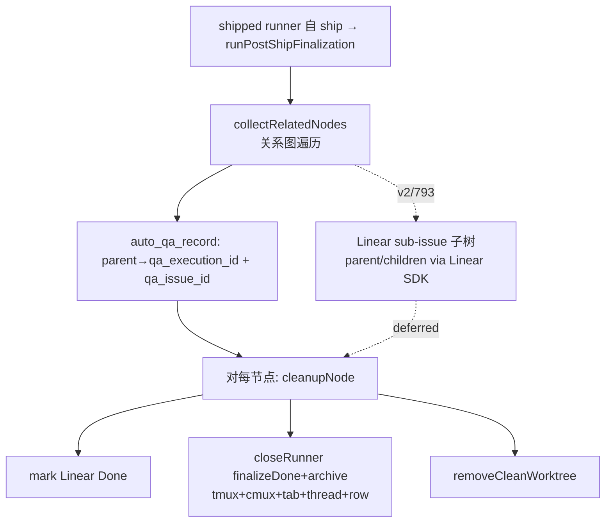

# FLY-799 Ship 流程重构:founder 批准归属 founder + runner 自 ship + fan-out 收尾 — 实施计划

Issue: FLY-799 (https://linear.app/geoforge3d/issue/FLY-799/infrafounder-facingp1-ship-流程重构founder-discord-批准-归属-founder-runner-自)
日期: 2026-07-02
基于: exploration.md, research.md

> **plan-first**:本 plan 走 Codex design review → present Annie。§7 的大方向问题必须 Annie
> 拍板后才 implement。**不自 ship、不代 merge。**

---

## 1. 目标 & 非目标

**目标**:founder 在 [FLY-XX] thread 的**明确批准**(身份验证=她本人 Discord)被**自动、归属
她本人**地写进 `approve_to_ship` gate → `verify-approval` 翻 true → runner 走它**现成的**自
ship → 触发**顺关系图的 fan-out 收尾**(shipped runner + QA + [v2] sub-issue 全清)。Lead 只
relay,不代 merge。

**非目标**:① 不实现 FLY-795 durable-state 地基(只标依赖、留接口);② 不建 FLY-793 的 sub-
issue 三段式结构(fan-out v2 接口留好、遍历随 793);③ 不改 verify-approval 的 4-源校验(复用);
④ **不引入 PR mode / pr_handoff**(Annie 明确『绝对没说要用 PR mode』)—— runner 自 ship =
**复用现有 deploy workflow / 🆒 self-ship**,不做「runner 交 PR 给 founder 手动 ship」那套。

## 2. 架构:现状 vs 目标

```mermaid
graph TD
    subgraph NOW["现状(断)"]
        A1[founder thread 打字 'ship 756'] --> A2[founder-reply-deliverer<br/>身份验证 OK]
        A2 -.只 WAKE、不写 gate.-> A3[runner 醒]
        A3 --> A4[verify-approval = false<br/>gate_not_answered]
        A4 -.卡 awaiting_review.-> A5[Lead 外部 gh pr merge]
        A5 -.没 session_completed.-> A6[收尾从不跑 ❌]
    end
    subgraph TARGET["目标(通)"]
        B1[founder thread 批准 / reaction] --> B2[founder-reply-deliverer<br/>身份验证 + 批准意图判定]
        B2 -->|明确批准| B3[写 approved:true<br/>归属 founder + onResponseWritten]
        B3 --> B4[awaiting_review→approved_to_ship<br/>+ 唤醒 runner]
        B4 --> B5[verify-approval = true]
        B5 --> B6[runner 自 ship :cool: → merged]
        B6 --> B7[fan-out finalization<br/>顺关系图全清 ✅]
        B2 -->|含糊/reject/非本人| B8[WAKE-only + relay Lead<br/>不 ship]
    end
```



## 3. 设计(三部分)

### Part A — founder-approval-relay + gate-flip(核心)

> **反转 FLY-175/FLY-605 的「approve_to_ship=WAKE-only」边界 = 新增一条 first-class 授权写面。
> 它必须比现有 Surface A/B consent 更严:证据绑到"这条 Discord 消息 + 这个当前 review question
> + 这个 PR head",可审计、可重试。** 以下 5 条硬约束(Codex R1 #1-#4)是这条写面的合同。

**主改点**:`bridge/founder-reply-deliverer.ts` `processFounderMessage` 的 `ship`(approve_to_ship)
分支,从「只 WAKE」改为(仅当身份 + 硬约束全满足才写批准,否则 WAKE-only + 交回 Lead)。

**A-0 批准信号抽象层(Annie D2-② 要求:可扩展到语音/图片)**:批准检测不绑死单一形态,而是抽
一个 `ApprovalSignalSource` —— 每个 source 把一个 founder 输入归一成**完全绑定的**
`ApprovalSignal`(discriminated union,§5),gate-write 路径 **source-无关**(信号绑定后)。

> **『明确批准』的确切定义(Annie 要求明确定义)** = 一个 **kind:"approve"、身份=canonical
> founder、绑定到当前 gate(questionId + prHeadSha + targetMessageId/message)** 的
> `ApprovalSignal`,来自以下任一 source。**任何达不到的(含糊 / reject / 非本人 / 无绑定 / REST
> 失败)= 不算批准 → 不 ship**(fail-closed)。

- **`ReactionSource`(v1,✅ 对勾)**:founder 在 ship-gate 那条消息上贴 ✅ = **确定性批准,零
  LLM**。**不用 🆒**(Annie:少见;v1 只 ✅)。最简单最稳,是主路径。**必须绑到 A-0b 的
  durable `targetMessageId`**(下条);缺绑定 → 拒批准(不靠文字/时间戳/最新 post/扫 thread 猜)。
- **`TextSource`(v1,自由文字)**:走 A-3 的 Haiku classifier(只为「别把『我看看再 ship』误当
  批准」兜底)。
- **`ImageSource`(v1,Annie:图片确认)**:founder 发**图片附件**(截图/图片确认)→ **多模态
  classifier**(Claude 原生多模态)判是否明确批准。**证据到附件级(Codex R5)**:先只收
  founder-authored Discord 图片附件(非文字里任意 URL)、过 MIME/扩展 allowlist + 数量/字节上限 +
  成功 fetch + **classify 前算 sha256**;verdict 要求 `evidenceMessageId===expectedMessageId`
  **且** `evidenceAttachmentIds ⊆ 期望附件`;fetch 失败 → unclear(不回退文字推断)。审计记
  attachmentId/filename/contentType/byteSize/sha256/classifier model+version/prompt+policy version。
  **图片语义 fail-closed 严规(Codex R5,图比文字更易误判)**:只有 founder 消息/图**无歧义表达
  『现在批准 ship 这个当前 gate』**才 approve;以下一律 `unclear` → 不 ship:纯状态截图、
  历史/转发的旧批准、通用 ✅/👍 图、别的 issue/PR、看不清/裁切/残缺、或无法把图绑到当前
  `questionId/prHeadSha`。倾向要求「图里能看到当前 issue/PR/gate 上下文」或「配一句把图绑到
  『ship this』的 founder 文字」。
- **`VoiceSource`(未来)**:语音转写 → 同一 classifier,**作为新 source 插入,不碰 gate-write
  路径**。这就是 Annie 要的抽象层(image/voice 都是它验证的用例)。
- 无论哪个 source,A-1(身份)+ A-2(唯一当前 gate)+ A-4(受信任写)+ A-5(审计)都照常套用。
  reaction 的「身份」= reactor `user.id === canonicalFounderId && bot !== true`(Codex R3 #3:要
  完整 user 对象、查 bot 位);text/image/voice = 消息作者 id === canonicalFounderId && !bot。

**A-0b ship-gate 消息 id 的 durable 绑定(Codex R3 #1,ReactionSource 的前置)**:现在
`founder-thread-notifier` POST「🚀 Ship gate 等你批准」后**只 audit threadId/status、不存 Discord
message id**(notifier L170-175/L229-257),`chat_threads` 也不存 per-gate 通知消息 → **今天没有
`(questionId,prHeadSha,threadId)→gateMessageId` 绑定**。修:notifier 成功后**解析 Discord POST
返回的 message id 并返回**;durable 存一行/事件,key 至少含 `questionId / executionId / issueId /
prHeadSha / threadId / gateMessageId / checkpoint / postedAt`。`ReactionSource.evaluate` 从这条
绑定取 `targetMessageId`,缺则拒批准。**幂等(Codex R4 #2)**:notifier 「先 POST 后写 marker」
可能重复发 gate 通知 → 用 unique key `(questionId, prHeadSha, checkpoint)`、`gateMessageId` 一旦写
入 immutable(或允许多行但 ReactionSource 要求「恰好一条当前绑定」否则 fail-closed);**写绑定前
再核 session 仍 `awaiting_review` 且 `review_question_id`+`prHeadSha` 未变**。

**A-0c reaction 观察独立于文字 cursor(Codex R3 #2)**:reaction 可能后贴到一条已在文字 cursor
后面的旧 gate 消息 → 不能塞进现有 `/messages?after=<cursor>` 循环(会漏 or 重复)。改成
**per-current-gate poll**:对每个 `awaiting_review` 且 `review_question_id===当前 gate` 的 session,
取其 durable `targetMessageId`,**只 poll 那条消息的 ✅ reactors**(复用 gateway 已有的
`founder-confirmation.ts`:emoji 编码 + bounded 分页 + 精确 founder-id + fail-closed
HTTP/malformed/429 —— Codex R3 「reuse」),命中 → 调共享写 helper(A-4 幂等);retry-safe 后落一个
durable signal marker `founder-approval-signal:reaction:<questionId>:<prHeadSha>:<targetMessageId>:
<founderId>:✅` 防重复触发。REST 失败/429/404 = 非批准、不推进文字 cursor、不落 marker。**bounded backoff
(Codex R4 #3)**:per-binding 记 last-checked + 429/5xx/404 退避,别每个 GatePoller tick 都猛敲
Discord;fail-closed 语义不变、retry-safe 前绝不 mark processed。

**A-1 身份(单一 canonical + fail-closed,Codex R1 #4)**:founder id 现分散在两处 ——
`discordOwnerUserId`(deliverer 用,gate-poller L1795-1847)与 `founderConsent.founderUserId`
(evaluator annotate 用,evaluator L225-234)。本写面**派生单一 canonical founder id**:两者都
缺 → fail-closed 不写;两者都在但**不相等** → fail-closed 不写(配置错防线)。消息身份仍是
`msg.author.id === canonicalFounderId && !bot`。

**A-2 唯一当前 ship gate(Codex R1 #2)**:现匹配模型把一条 founder 消息匹配到 thread 里所有
更早的 pending question、并对每个 approve_to_ship gate 循环(deliverer L181-188、L238-297)——
对 WAKE-only 无害,对**授权写危险**(一句「ship it」可能批准同 thread 的多个 live review /
rerun / 未来 sub-issue)。写前**收窄候选**:只留 `session.status==="awaiting_review" &&
session.review_question_id === q.questionId` 的 gate,**要求恰好一个**;>1 → 不写、WAKE-only +
交回 Lead(除非 Annie 明确批 batch 语法,§7-D2)。

**A-3 批准意图判定(专用 classifier,绑消息,Codex R1 #1)**:**不直接复用
`FounderConsentEvaluator`** —— 它会 env/label short-circuit(evaluator L149-178)、cache 按
issue/exec/action/head 而非消息 id(L180-200)、只要求 evidence 是"window 内某条 founder 消息"
(L297-314)。新增专用合同 `FounderShipApprovalClassifier`:输入必须含 `expectedMessageId /
messageContent / questionId / executionId / issueId / prHeadSha`;**禁用 env/label bypass**;
**禁 cache 或按 `(questionId, prHeadSha, expectedMessageId)` 为 key**;若用 LLM,**要求
`decision.evidenceMessageId === expectedMessageId`**,否则 fail-closed。明确 reject/
changes-requested → 写 feedback(非 approved)+ feedback_wake。含糊/非本人 → WAKE-only。

**A-4 写路径复用受信任语义(抽共享 helper,Codex R1 #3)**:**不裸写
`db.insertResponse + onResponseWritten`**。抽一个共享内部 helper
`writeGateResponseAndRunPostWrite`,**Surface B(gate-response-router)与本 founder-reply 路径
共用**,合同 = 现有 approveExecution / gate-router 的幂等语义(actions.ts L223-303、
gate-response-router L235-268):① 校验 checkpoint==approve_to_ship;② 校验 questionId ==
session 当前 review_question_id;③ 校验 session `awaiting_review`(或已 `approved_to_ship` 幂等);
④ 已存在**相同**批准 response → 当 retry 重跑 hook;⑤ 已存在**冲突** feedback → 拒;⑥
founder-reply cursor **只在 response + post-write 副作用达到 retry-safe 状态后**才前移(写了
response 但 transition/wake 失败 → 不前移 cursor,下轮重试收敛)。

**A-5 归属 + 审计**:actor 用真实 founder Discord user id(不只是通用 `founder-discord` 串);
审计事件记 **真实 user id + 证据 message id + questionId + prHeadSha + 收窄到的 node set**
(Codex R1 #7),复用现有 `founder_consent_audit` / session_events。

**装配**:`gate-poller.ts` `founderReplyDeliverPass()`(L1864-1871)给
`emitFounderReplyDeliveryForThread` deps 注入 `writeGateResponseAndRunPostWrite` +
`FounderShipApprovalClassifier` handle。helper/hook 由 plugin.ts 从
`buildFounderConsentWiring(...)` 提供(把 `onResponseWritten` + 新 helper 从 wiring export)。

**为何安全**:verify-approval 不校验 responseFrom(research A.1),它信任「谁写 approve_to_ship
response 谁权威」,而写路径本被 respond.ts 限死(research A.3)。FLY-799 在 **Bridge 进程内、
基于 Discord 身份验证过的、绑定到唯一当前 question + PR head + 具体消息 id 的 founder 批准**
写 —— 比 Lead 转述更强的 founder 授权证据,等价于「被信任路径」,符合 FLY-175 本意。**这条写面
走独立的 default-off flag(区别于 default-on 的 founder-reply-deliver flag)**,opt-in 才启用。

### Part B — runner 自 ship(基本不改 + 795 依赖)

Blueprint APPROVE GATE 已对(research B)。Part B:
- **D3 = 保留 `:cool:`(Annie 已拍✅)**:**零改动** runner 提示词,保 CI/deploy/branch-protection。
  `gh pr merge` 方案已否决(不改 Blueprint L1167)。

**795 依赖 —— 诚实定位(Codex R1 #5,不再声称 restart-resilient)**:runner 醒来后的自 ship
是**一次性过程**(verify-approval→`:cool:`→轮询 merge→改 land-status→completed,Blueprint
L1159-1177)。若 runner 进程在**批准后、`:cool:`/land-rewrite/completion 之前**死掉,「wake +
幂等 verify-approval」**兜不住**(它只在同一个活 runner 真消费了 wake 时才续做);现有
stale-blocker 逻辑只会 alert / finalize 已 merged/closed 的 PR,**不会 resume 一个 open 的
approved ship**(stale-blocker-guard L14-19、L126-139)。因此:
- **v1 落地 default-off**(landing code 允许);但**把它当新 ship 流程正式启用,前置条件 =
  FLY-795 durable-state 地基,或本 issue 自带一个具体的 v1 reconciler**:检测 stale
  `approved_to_ship` + open PR 的 session → bounded、audited 地 re-wake / re-drive。
- 设计里定义窄接口 `ShipResumeSubstrate`(v1 = wake + 幂等 verify + [可选] stale-approved
  reconciler;v2 = 795 durable 快照续做),实现挂接口后。**production 启用的 gating 写进 §9
  rollout + §7 present Annie。**

### Part C — fan-out 收尾(扩 post-ship-finalization)

shipped runner 自 ship 触发 `runPostShipFinalization`(对它自己,已存在)后,**再顺关系图遍历**
清理每个相关节点。新增 `runFanoutFinalization(rootExecutionId)`:



- **节点收集** `collectRelatedNodes(rootExecId)`:
  - v1:root 的 `auto_qa_record`(parent=root)→ `qa_execution_id`(QA runner)+ `qa_issue_id`
    (QA issue/thread)。
  - v2(接口留好、遍历 deferred):Linear `issue.parent` 上溯到 main → `.children()` 下遍
    design/implement/QA sub-issue。需处理「无 linear client」fallback(research C.4)。
- **v1 fan-out 的真实增量(Codex R1 #6,别高估复用)**:QA PASS 现在**已经**关掉了 QA runner
  (auto-qa-coordinator L629-652,reconcile L691-715 还会重试),所以 v1 QA fan-out 的真实工作
  ≈「**若 QA runner 仍 live 则 verify/close;若有 QA issue 则标 Done**」。**不动**
  `running / awaiting_retest / stuck` 的 QA 记录(那些 QA 还没结论,root 批准不覆盖它们的关闭
  授权 —— Codex R1 #7);只处理已 PASS / 可安全收尾的。「标任意 Linear issue Done」**不是现成
  原语** —— 现逻辑埋在 HTTP `/api/linear/update-issue` route(plugin.ts L1882-1938)→ **抽一个
  内部 `LinearIssueFinalizer` helper**(复用其 state-name resolution),显式传 `transitionOpts`
  / `archive` / `removeCleanWorktree` deps。
- **每节点** `cleanupNode(node)`:`closeRunner({finalizeDone:true, archive})`(tmux+cmux+tab+
  thread+row)+ `removeCleanWorktree` + `LinearIssueFinalizer.markDone`。
- **per-node 可重试状态(Codex R1 #6,不照抄 post-ship 的一次性 claim)**:post-ship 的单个
  one-shot claim(L159-168)对**单** runner 够,但 fan-out 多节点若照抄、部分失败就变不可重试。
  → 定义 `FanoutFinalizationStore`(或 session_events 协议)记**每节点** `started/succeeded/
  failed` marker + **重启 reconcile**(未完成节点下次续清)。失败节点记 founder-facing alert
  (FLY-368 channel)+ 不阻塞其他节点(§7-D2b)。整体仍有一个 fan-out 级 claim 防并发重入,但
  节点级状态保证部分成功可续。
- **授权语义(Codex R1 #7)**:写批准的 audit 事件里**先记下收窄到的 related node set**(A-5),
  再动手;v1 只覆盖「已 PASS QA 收尾」,更宽的 subtree runner 关闭授权 defer 到 FLY-793 设计
  关系图 + 授权措辞。classifier 的 action 名显式化(如 `approve_to_ship_and_finalize_related`)。

## 4. 改动清单(文件级)

| # | 文件 | 改动 | Part |
|---|------|------|------|
| 1 | `bridge/founder-reply-deliverer.ts` | ship 分支:身份 + A-1..A-5 → 调 `ApprovalSignalSource` → 共享写 helper;`RawDiscordMessage` + fetch 扩到含**图片附件**(Codex R5:只 founder-authored、allowlist、fetch+hash) | A |
| 1b | `bridge/approval-signal/`(新) | `ApprovalSignalSource` 抽象 + `ReactionSource`(per-gate poll `targetMessageId` 的 ✅,复用 `founder-confirmation.ts`,确定性零 LLM,查 bot 位)+ `TextSource`(Haiku)+ `ImageSource`(图片附件→多模态 classifier,Annie D2);VoiceSource 留口 | A |
| 1c | `bridge/founder-thread-notifier.ts` | 成功 POST 后解析并返回 Discord `gateMessageId`(现只 audit threadId/status) | A |
| 1d | `StateStore.ts` + `bridge/gate-message-binding.ts`(新) | durable `(questionId,execId,issueId,prHeadSha,threadId,gateMessageId,checkpoint,postedAt)` 绑定 + reaction signal marker | A |
| 2 | `bridge/gate-poller.ts` `founderReplyDeliverPass` | 注入 signal sources + `writeGateResponseAndRunPostWrite` + canonical founder id;founder-reply 读取扩到 reactions | A |
| 3 | `bridge/founder-consent/wiring.ts` | export `onResponseWritten` + 抽出的共享 `writeGateResponseAndRunPostWrite`(Surface B 也改用) | A |
| 4 | `bridge/founder-consent/gate-response-router.ts` | 改用共享 `writeGateResponseAndRunPostWrite`(去重,Codex R1 #3) | A |
| 5 | `bridge/founder-ship-approval-classifier.ts`(新) | `FounderShipApprovalClassifier`(TextSource 用):绑 expectedMessageId,禁 bypass/cache,require evidenceMessageId 匹配 | A |
| 6 | `bridge/plugin.ts` | 装配 classifier + helper + canonical founder id + 新 default-off flag → GatePoller config | A |
| 7 | `bridge/fanout-finalization.ts`(新) | `collectRelatedNodes` + `cleanupNode` + fan-out claim | C |
| 8 | `bridge/linear-issue-finalizer.ts`(新,从 plugin.ts L1882-1938 抽) | `LinearIssueFinalizer.markDone`(state-name resolution 复用) | C |
| 9 | `StateStore.ts` + `bridge/fanout-finalization-store.ts`(新) | `FanoutFinalizationStore`:per-node started/succeeded/failed marker + reconcile | C |
| 10 | `bridge/post-ship-finalization.ts` | ship 收尾后 call fan-out(v1 = auto_qa 链,仅已 PASS QA) | C |
| 11 | [Part B production 启用前] stale-`approved_to_ship` reconciler(或依赖 795) | Codex R1 #5 | B |
| 12 | `edge-worker/src/Blueprint.ts` | [仅 D3=merge 时] 改 :cool: 那句 | B |
| 13 | 2 个 env 开关(default-off 授权写面 + fan-out)+ 测试夹具 + 单测/集成测 | byte-compat + TDD | ALL |

## 5. 接口(795 边界 + fan-out 收集器)

```ts
// Part A — 批准信号抽象层(Annie D2-②:可扩展到语音)。gate-write 路径 source-无关。
// Codex R3 #4:用 discriminated union(非 free-form evidenceRef),每个 source 产出**完全绑定、
// 可审计**的信号;source-agnostic 只发生在信号已绑定之后。
type GateBinding = {           // 每个 source evaluate 的共同上下文
  questionId: string;          // = session 当前 review_question_id
  executionId: string; issueId: string; prHeadSha: string;
  threadId: string; canonicalFounderId: string;
  targetMessageId: string;     // ★ ship-gate 通知消息的 durable Discord id(A-0b)
};
type ApprovalSignal =   // 每个 variant 都带 questionId+prHeadSha,审计对称(Codex R4 #1)
  | { source: "reaction"; kind: "approve"; questionId: string; prHeadSha: string;
      targetMessageId: string; emoji: "✅"; reactorUserId: string }
  | { source: "text"; kind: "approve" | "reject" | "unclear"; questionId: string; prHeadSha: string;
      messageId: string; authorUserId: string }
  | { source: "image"; kind: "approve" | "reject" | "unclear"; questionId: string; prHeadSha: string;
      messageId: string; authorUserId: string;
      evidenceAttachmentIds: string[]; imageHashes: string[] }  // Annie D2:图片确认(证据到附件级)
  | { source: "voice"; kind: "approve" | "reject" | "unclear"; questionId: string; prHeadSha: string;
      transcriptId: string }; // future
// Codex R4 #1:接口按 source 各自数据流分,别硬统一(reaction 只吃 gate+targetMessageId;text/image 吃 message)
interface ReactionSource { evaluate(gate: GateBinding): Promise<ApprovalSignal | null>; }
interface TextSource {
  evaluate(args: { gate: Omit<GateBinding, "targetMessageId">;
                   message: { id: string; content: string; authorId: string } }): Promise<ApprovalSignal | null>;
}
interface ImageSource {  // founder 图片附件 → 多模态 classifier(Codex R5:证据必须到附件级)
  evaluate(args: {
    gate: Omit<GateBinding, "targetMessageId">;
    // 只收 founder-authored Discord 图片附件(非文字里的任意 URL);先 fetch+hash 再 classify
    message: { id: string; authorId: string;
               imageAttachments: { id: string; filename: string; contentType: string;
                                   byteSize: number; sha256: string }[] };
  }): Promise<ApprovalSignal | null>;
}
// 多模态 classifier verdict(TextSource 用 ClassifierVerdict;ImageSource 用这个):
// require evidenceMessageId===expectedMessageId AND evidenceAttachmentIds ⊆ expectedAttachmentIds(非空);
// cache(若有)key = (questionId, prHeadSha, expectedMessageId, attachmentIds, imageHashes)。
// v1: ReactionSource(✅ 确定性零 LLM) + TextSource(Haiku) + ImageSource(多模态 classifier);future: VoiceSource

// Part A — 绑消息的 ship 批准判定器(Codex R1 #1;仅 TextSource / VoiceSource 用)。禁 bypass/cache;require evidence 匹配。
interface FounderShipApprovalInput {
  expectedMessageId: string;   // 正在处理的这条 Discord 消息 id
  messageContent: string;
  questionId: string; executionId: string; issueId: string; prHeadSha: string;
}
type ClassifierVerdict =        // R3 #4:与 source-level ApprovalSignal 分名,避免碰撞
  | { kind: "approve"; evidenceMessageId: string }   // require === expectedMessageId
  | { kind: "reject"; reason: string }
  | { kind: "unclear" };                              // fail-closed → WAKE-only
interface FounderShipApprovalClassifier {
  classify(input: FounderShipApprovalInput): Promise<ClassifierVerdict>;
}

// Part A — 共享受信任写面(Surface B + founder-reply 共用,Codex R1 #3 / R2 #2)
// 需要完整 trusted deps 才能守 status/head 并观测 post-write 结果(不能只有 db+qid+answer)。
interface WriteGateResponseResult { written: boolean; retrySafe: boolean; reason?: string }
function writeGateResponseAndRunPostWrite(args: {
  db: CommDB;
  store: StateStore;                     // getSession → 守 status
  questionId: string;
  executionId: string;
  actor: string;                          // 真实 founder user id | leadId(Surface B)
  answer: string;                         // '{"approved":true}' | feedback
  expectedCurrentReviewQuestionId: string;
  expectedStatus?: string;                // "awaiting_review"(founder-reply 路径)
  expectedPrHeadSha?: string;             // 供 audit/binding
  // post-write hook 返回可观测结果(成功/失败),而非静默吞;调用方决定 cursor 是否前移
  runPostWrite: (info: {...}) => Promise<{ ok: boolean }>;
}): Promise<WriteGateResponseResult>;
// 语义:checkpoint==approve_to_ship + questionId==当前 review_question_id + status 守卫 +
// 相同批准当 retry 重跑 hook + 冲突 feedback 拒。
// **founder-reply 路径**:post-write hook 失败 → retrySafe:false → cursor 不前移(下轮重试)。
// **HTTP Surface B 路径**:仍可选现有 best-effort(hook 失败不 fail 请求)—— 但这是**调用方
// 显式策略**,不藏在共享原语里。

// Part B — ship resume 地基(v1 = wake+幂等 verify [+可选 stale-approved reconciler];v2 = FLY-795)
interface ShipResumeSubstrate { ensureShipResumable(execId: string): Promise<void>; }

// Part C — 关系图收集(v1 auto_qa;v2 Linear 子树)
interface RelatedNode {
  executionId?: string;   // 有 runner 的节点
  issueId: string;
  role: "shipped" | "qa" | "design" | "implement";
  qaStatus?: string;      // v1:只处理已 PASS;跳过 running/awaiting_retest/stuck
}
function collectRelatedNodes(rootExecId: string): Promise<RelatedNode[]>;

// Part C — per-node 可重试状态(Codex R1 #6)
interface FanoutFinalizationStore {
  mark(execIdOrIssueId: string, node: string, state: "started"|"succeeded"|"failed"): void;
  pendingNodes(rootExecId: string): string[];   // 重启 reconcile 用
}

// Part C — 从 plugin.ts /api/linear/update-issue 抽出的标 Done 原语
interface LinearIssueFinalizer { markDone(issueId: string): Promise<{ done: boolean; reason?: string }>; }
```

## 6. 安全 / fail-closed / 防伪造(初判,§7-D1 请 Annie 定强度)

- **身份**:`msg.author.id === canonicalFounderId && !bot`(A-1:canonical = `discordOwnerUserId`
  与 `founderConsent.founderUserId` 一致解析;缺/冲突 → fail-closed)。Discord 保证作者 id 不可
  冒充;强度 = Discord 账号安全 + bot token 保密。
- **意图**:fail-closed —— 只有**完全绑定的 `ApprovalSignal`**(Codex R4 #4)才写
  `{approved:true}`:reaction 证据 = `(targetMessageId, emoji, reactorUserId)`;text 证据 =
  `(messageId, classifier evidenceMessageId===expectedMessageId)`。含糊/reject/非本人 → 不 ship。
- **绑定**:恰好一个当前 ship gate(A-2)+ 只答 session 当前 `review_question_id`
  (gate-response-router 同款防 stale,research A.4)+ `pr_head_sha` 匹配(改了码 → 旧批准失效)。
- **残余向量**(surface Annie):同机有 db 写权限的进程能直接伪造(verify-approval 已声明的
  threat-model);canonicalFounderId 配错;Discord 账号被盗。
- **审计**:每次写批准记 `founder_consent_audit` / session_event(actor = **真实 founder Discord
  user id**,非通用串 + 证据 message id + questionId + prHeadSha + 收窄 node set,A-5),复用现有
  审计表。

## 7. 大方向决定(Annie 拍板记录)

- **D1 身份防伪造强度 = 批准边界反转 ✅(Annie 拍)**:验明是她本人 Discord 身份(reaction
  user / message author === canonicalFounderId 且非 bot)→ 把 approval 写进 gate(反转
  FLY-175 WAKE-only)。fail-closed:身份不符 → WAKE-only 不写。
- **D2 明确批准 = 文字 / ✅ reaction / 图片确认 ✅(Annie 拍)**:v1 三 source(`TextSource` Haiku
  + `ReactionSource` ✅ 确定性零 LLM,不用 🆒 + `ImageSource` 图片附件→多模态 classifier);
  `ApprovalSignalSource` 抽象让语音以后作新 source 插入。**明确批准的确切定义见 A-0**。**D2b 收尾
  失败 = best-effort 不回滚 ✅(Annie 拍)**:失败节点只告警(FLY-368)+ 不阻塞其他 + 幂等不重清 +
  per-node reconcile 补未完成;**绝不回滚已 ship 的东西**。
- **D3 自 ship 机制 = 保留 `:cool:` ✅(Annie 拍)**:runner 提示词零改,保 CI+branch-protection;
  `gh pr merge` 已否决;**不引入 PR mode/pr_handoff ✅(Annie 拍)**。
- **D4 fan-out scope = 一次做全、分两波 ✅(Annie 拍)**:v1 按当前 main = feature + 它的 QA;
  FLY-793 merge 后 799 rebase 再把 Design/Implement/QA 三段清理做全(§10)。接口 v1 留好。
- **Part B 启用前置 ✅(Annie 拍,顺序可协调)**:runner 自 ship 后中途重启的完全可靠 = 依赖
  FLY-795 或本 issue 自带 stale-approved reconciler;默认 default-off、小范围先验。

### 本轮回 Annie 的两个问题(D2 a/b)
- **(a) Haiku 分类器装在 Bridge 哪一层?** 装在 **Bridge 进程内、GatePoller 的 founder-reply 读取
  那一层**(新模块 `founder-ship-approval-classifier.ts`),跟现在已经在读你 thread 消息的代码
  **同一层**。它**只在 `TextSource`(你打自由文字)时才跑**;你点 **✅ 是确定性的、根本不调 AI**。
  用的是系统**已有的同一个 LLM 判断模式**(founder-consent evaluator 已在用),**不是新基建**。
- **(b) 会不会太复杂?值不值?** 核心其实很小 —— 大部分是把**已有零件接起来**(自 ship / 收尾 /
  状态翻转都现成、verify-approval 零改)。真正新增就三块:① 文字批准的 Haiku 判断(**一次很轻的
  调用、只在你批准 ship 这种少见时刻**跑,非热路径);② `ApprovalSignal` 抽象层(小,为你要的语音
  留口);③ 收尾的分步重试(为正确性)。**✅ 表情路径零 AI、最简单最稳、是主路径**;Haiku 只为
  「别把『我看看再 ship』误当批准」兜底 —— ship 不可逆,值得这道 fail-closed 闸。**评估:值** ——
  换来你再也不用提醒 / 手动 merge。想更省:v1 可先只上 **✅ 表情(彻底零 AI)**、文字批准当
  fast-follow;但你说要文字我就都留在 v1。

## 8. 测试(TDD,byte-compat)

- **单测**:批准判定器(明确批准/reject/含糊/非本人 4 类);deliverer ship 分支(写批准 +
  hook 触发 / fail-closed 不写);fan-out `collectRelatedNodes`(有 QA / 无 QA)+ `cleanupNode`
  幂等 + 部分成功(某节点失败不阻塞 + 告警)。
- **安全回归专项(Codex R2 #3,逐条对应 R1 失败模式,防实现时回退)**:
  ① evidence message id 不匹配 → fail-closed;② env/label bypass 不能批准;③ cache 不能跨
  message id 复用批准;④ 同 thread 两个当前 ship gate → 不写 + 交回 Lead;⑤ canonical founder
  id 缺/冲突 → fail-closed;⑥ 已存在相同批准 → 重跑 post-write hook(幂等);⑦ 已存在冲突
  feedback → 拒;⑧ post-write hook 失败 → founder-reply cursor 不前移;⑨ default-off 授权写面
  → byte-compat 逐字 WAKE-only;⑩ 非 PASS QA 记录被跳过;⑪ per-node fan-out 失败 → 重启后只续
  未完成节点、不重做已成功节点。
- **reaction 专项(Codex R3 #5)**:⑫ 无 durable target gate message id → 不批准;⑬ ✅ 贴在
  非-gate / 旧 gate / QA ship-ready 消息 → 忽略;⑭ 重新 review 后 ✅ 贴旧 gate → 被当前
  `review_question_id`+`prHeadSha` 拒;⑮ reaction API 分页第 2 页才找到 founder → 命中;
  ⑯ 403/404/429/malformed → fail-closed;⑰ 重复 poll 同一 ✅ → 幂等(signal marker);⑱ 批准后
  founder 取消 ✅ → 已 durable 写不回滚;⑲ audit 记 targetMessageId + emoji + reactorUserId。
- **image 专项(Codex R5)**:⑳ 无附件 → null/unclear;㉑ 非图片/超大附件 → fail-closed;㉒ 多附件
  需显式 evidenceAttachmentIds;㉓ 通用 ✅/👍 图 → unclear;㉔ 旧批准/别 issue/QA-pass 截图 →
  unclear;㉕ 看不清图 → unclear;㉖ 合法当前-gate 图批准仅当作者=canonical founder 且
  questionId/prHeadSha 匹配才写;㉗ audit 含 image sha256 + evidenceAttachmentId;㉘ fetch 失败 →
  unclear(不回退文字)。
- **集成**:真 CommDB + StateStore:founder 消息 → gate 翻 → verify-approval=true;fan-out 关
  QA + archive。
- **byte-compat**:env 开关(如 `FLYWHEEL_FOUNDER_AUTO_APPROVE=0` 默认?见 rollout)默认关 →
  行为逐字等于现状(WAKE-only);reverse-compat sentinel。
- **真机 E2E**(独立 QA,529 Room / Claude-in-Chrome):Annie 真账号在 thread 批准 → runner 真
  自 ship → QA+worktree+thread+cmux 全清;非本人/含糊不 ship。

## 9. Rollout
Bridge 侧改动 → 需一次 Bridge 重启部署(runner 提示词若 D3=保 :cool: 则不改,fleet 不用重
起)。env 开关默认**关**(opt-in),先在 529 Room / 单项目验,再 fleet。协调批量 Bridge 重启
(攒 PR)。

## 10. 依赖 / 时序(Annie 拍的分波)
- **可并行设计**(Tadashi):跟 FLY-795 并行走 plan-first。
- **fan-out 一次做全、但分两波落地(Annie ④)**:**v1 = 先按当前 main 写**(现 main 上只有
  feature↔QA 关系 = auto_qa_record,所以 v1 清 feature runner + 它的 QA);**FLY-793 merge 到
  main 后,799 rebase 上去,把 Design/Implement/QA 三段的清理分开做全**(= 799 PartC 的
  completion,committed follow-on,不是模糊 future)。接口(`collectRelatedNodes` /
  `FanoutFinalizationStore`)v1 就留好。
- **Part B 作为新 ship 流程正式启用,前置 = FLY-795 durable-state 地基 _或_ 本 issue 自带的
  stale-`approved_to_ship`+open-PR reconciler**(二选一;顺序可跟 795 协调;接口留好)。
- **收尾 = best-effort(Annie ②)**:某步失败只告警(FLY-368),**绝不回滚已 ship 的东西**
  (ship 不可逆);幂等不重清 + per-node reconcile 补未完成。
- **present Annie** 拍板 → Codex design review 已过(4 轮 APPROVED)→ 才 implement。
