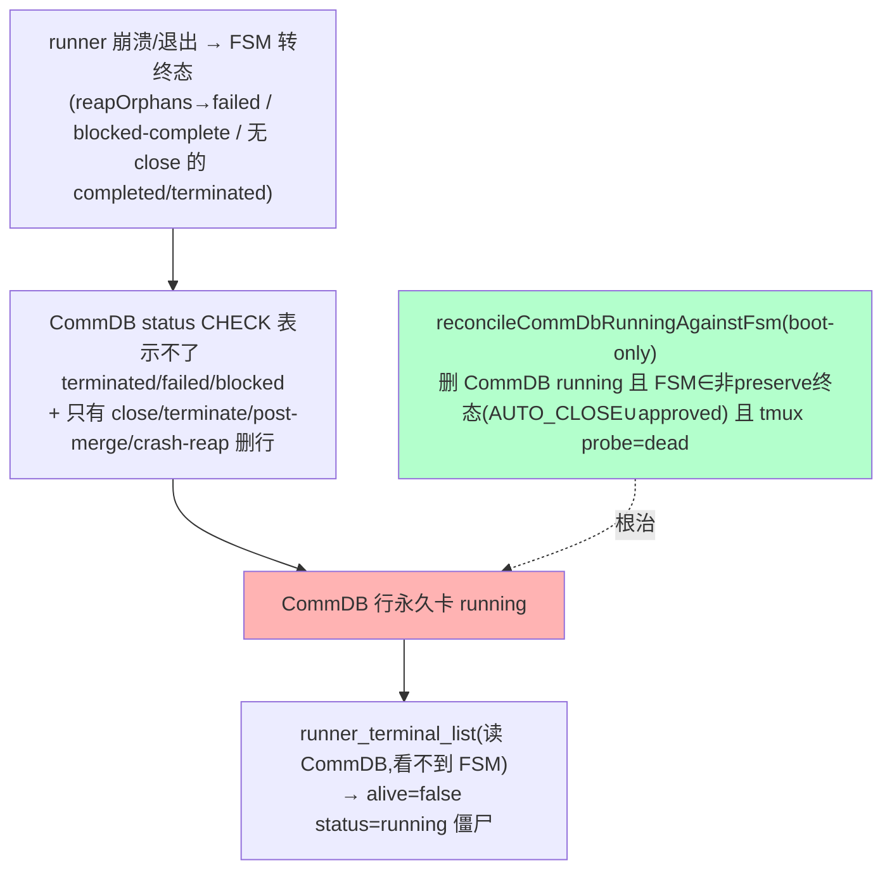

# FLY-817 收口 runner/cmux 清理缺口 — 实施计划

Issue: FLY-817 (https://linear.app/geoforge3d/issue/FLY-817/infracleanup-收口-runnercmux-清理缺口-验证已上线的-crash-reaper-真在工作-清现存-100-僵尸记录)
日期: 2026-07-03
基于: exploration.md, research.md

**Version**: v1.57.0(暂定,ship 取空号)
**Status**: codex-approved(Codex design review APPROVED after 3 rounds, xhigh)

---

## 1. 问题与目标(一句话)

`runner_terminal_list` 显示的 ~100 个 `alive=false status=running` 僵尸,真因是 **CommDB↔Bridge FSM 同步 gap**:FSM 早已把它们转终态(104/112 = completed 47/terminated 34/failed 17/blocked 6),但 CommDB `sessions.status`(CHECK 只允许 running/completed/timeout,且只有少数路径删行)从没同步。**根治 = CommDB↔FSM reconcile 的 boot sweep**(镜像 FLY-638 sibling、boot-only、fire-and-forget):删 CommDB `running` 且 **① FSM ∈ 非-preserve 终态 outcome(含 legacy approved)② tmux target 经 probe 证明已死** 的行 —— 结构性保护 8 个真活 runner + preserve(failed/blocked)不删。

非目标:不改 FSM、不撤 tmux、不动 Discord thread;**不删 failed/blocked preserve 行**(它们的 CommDB 残留归 read-model follow-up);不建自动化 cmux-terminal-dead-pin sweep(follow-up);不做 heartbeat tick(见 §3.3/§8 决策 #3 修订);不碰 `runner_terminal_list` 读 CommDB 的架构(terminal-mcp 刻意跨机 CommDB-only)。



---

## 2. 交付物

| # | 交付物 | 类型 | 对应 task |
|---|---|---|---|
| A | `commdb-fsm-reconcile.ts` + 单测 | 代码(PR) | task 2 根治 |
| B | boot sweep 接线(plugin.ts,折进 FLY-638 循环) | 代码(PR) | task 2 + task 3(boot 自动清 deletable-终态+tmux-dead 僵尸,~81;保留 failed/blocked preserve ~23) |
| C | kill-switch env `FLYWHEEL_COMMDB_FSM_RECONCILE` | 代码(PR) | 逃生口 |
| D | FLY-724 式 reaper 真机 QA(529 Room) | 独立 QA | task 1 |
| E | cmux 787-class 死 pin 一次性 ops 清理 | deploy 期人工步骤 | task 4 |
| F | (follow-up)preserve(failed/blocked)CommDB 残留隐藏 = read-model / 独立路径 | follow-up issue | — |

> ~~heartbeat tick 接线~~ 取消(Codex R1 BLOCKER 2/4,§3.3 + §8 决策 #3)。

---

## 3. 详细设计

### 3.1 新模块 `packages/teamlead/src/bridge/commdb-fsm-reconcile.ts`

> **Codex R1 三 BLOCKER 已并入(见 §9)**:删除断言收紧为「非-preserve 终态 outcome + 含 legacy `approved` + **tmux target 证明已死**」,镜像 FLY-638 的 tri-state probe 策略。

```ts
import { CommDB } from "flywheel-comm/db";
import { AUTO_CLOSE_STATES, CRASH_PRESERVE_STATES } from "./close-runner.js";
import { resolveCommDbPath } from "./commdb-session-prune.js";
import { probeTmuxWindowLiveness, type TmuxWindowProbe } from "./tmux-lookup.js";

/**
 * 可被本 reconcile 删除的 FSM outcome 状态集。
 * = 非-preserve 终态 outcome ∪ legacy `approved`
 * = OUTCOME_STATUSES − {approved_to_ship(runner 还要 ship), failed, blocked(CRASH_PRESERVE)}
 * = AUTO_CLOSE_STATES {completed,rejected,deferred,shelved,terminated} ∪ {approved}
 *
 * 刻意排除(BLOCKER 1):failed/blocked —— retry 时 closeRunner(forcePreserved) 靠
 *   CommDB tmux_window 找 preserve 目标 teardown,先删行会 strand。它们的 CommDB 残留
 *   属另一类(read-model / 独立路径),留 follow-up。
 * 刻意补入(BLOCKER 3):approved —— WORKFLOW_TRANSITIONS 里 approved:[] 是 legacy 终态,
 *   CLOSE_ELIGIBLE_STATES 不含它 → 不补会永久漏 CommDB=running+FSM=approved。
 * 刻意排除:approved_to_ship / awaiting_review / running / reconnecting / pending —— 非终态。
 */
export const RECONCILE_DELETABLE_STATES: ReadonlySet<string> = new Set([
  ...AUTO_CLOSE_STATES,
  "approved",
]);

export interface CommDbFsmReconcileResult {
  scanned: number;          // CommDB running 行数
  reconciled: number;       // 删掉的(deletable 终态 + tmux 证明已死)
  keptNonTerminal: number;  // FSM 非终态 / FSM 缺失(无终态证据)
  keptPreserve: number;     // FSM=failed/blocked(preserve,不在此删)
  keptAliveTarget: number;  // deletable 终态但 tmux 还活/indeterminate(保 target 给 teardown)
}

/** lookup fn:execId → FSM status(缺失返 undefined)。解耦 StateStore,便于单测。 */
export type FsmStatusLookup = (executionId: string) => string | undefined;

/**
 * 删除某项目 CommDB 中 status='running' 且满足全部三条件的行:
 *   (1) 其 Bridge FSM 状态 ∈ RECONCILE_DELETABLE_STATES(非-preserve 终态 outcome),
 *   (2) 其 CommDB tmux_window 被 tri-state probe **证明已死**(probe === "dead")。
 * FSM 缺失/非终态/preserve → 保留;tmux 活/indeterminate → 保留(BLOCKER 2:留 target 给
 *   close_runner/post-merge/heartbeat 的 teardown,别 strand 窗口)。
 * best-effort:任何异常 log warn 吞掉,返回已累计计数。dbPath / probe 可注入(测试)。
 */
export async function reconcileCommDbRunningAgainstFsm(
  projectName: string,
  fsmStatusOf: FsmStatusLookup,
  opts: { dbPath?: string; probe?: (w: string) => Promise<TmuxWindowProbe> } = {},
): Promise<CommDbFsmReconcileResult> {
  const result = { scanned: 0, reconciled: 0, keptNonTerminal: 0, keptPreserve: 0, keptAliveTarget: 0 };
  const dbPath = opts.dbPath ?? resolveCommDbPath(projectName);
  if (!dbPath) return result;
  const probe = opts.probe ?? probeTmuxWindowLiveness;
  let db: CommDB | undefined;
  try {
    db = new CommDB(dbPath);
    const running = db.listSessions(projectName, ["running"]);
    result.scanned = running.length;
    for (const s of running) {
      const fsm = fsmStatusOf(s.execution_id);
      // failed/blocked(preserve)→ 不删(BLOCKER 1),记 keptPreserve。
      if (fsm && CRASH_PRESERVE_STATES.has(fsm)) { result.keptPreserve++; continue; }
      // FSM 缺失(测试 scratch)/ 非终态(running/reconnecting/awaiting_review/approved_to_ship/pending)→ 保留。
      if (!fsm || !RECONCILE_DELETABLE_STATES.has(fsm)) { result.keptNonTerminal++; continue; }
      // deletable 终态 → 必须 tmux target 证明已死才删(镜像 638)。
      const state = await probe(s.tmux_window);
      if (state !== "dead") { result.keptAliveTarget++; continue; } // alive/indeterminate → 保留
      db.deleteSession(s.execution_id);
      result.reconciled++;
    }
  } catch (err) {
    console.warn(`[commdb-fsm-reconcile] ${projectName} failed: ${(err as Error).message}`);
  } finally {
    db?.close();
  }
  return result;
}
```

**要点**
- 终态集**不手搓**:`AUTO_CLOSE_STATES` + `approved`(legacy)= 非-preserve outcome。`PRESERVE` 复用 `CRASH_PRESERVE_STATES`。
- **tmux-dead 闸**(BLOCKER 2):只有 probe `dead`(window 没了/`pending` 无效目标)才删;`alive`(含 dead-pin)或 `indeterminate` 保留 —— 与 FLY-638 同策略,不 strand 待 teardown 的窗口。
- FSM-first 排序:先 cheap PK 查 FSM,只有 deletable 终态才 probe tmux → probe 次数最小(steady-state 极少)。
- `fsmStatusOf` / `probe` 注入 → 单测零 StateStore/tmux 依赖。
- async(有 tmux 探活)→ boot 里 fire-and-forget(同 638)。

**多项目聚合**:直接复用 FLY-638 boot sweep 已有的 per-project `void(async()=>{ for p of projects … })` 循环(那里已 dedup + best-effort),在同循环里 `await reconcileCommDbRunningAgainstFsm(p, …)` 再 `await pruneDeadTerminalCommDbSessions(p)` —— 不新造聚合函数(减面 + 复用现成 dedup)。

### 3.2 boot 接线(plugin.ts,折进 FLY-638 boot sweep 循环 ~3332-3352)

reconcile 现在有 tmux 探活(BLOCKER 2)→ 和 638 同为「per-row probe、慢」→ **折进 638 那个 fire-and-forget per-project 循环**,同 project 里先 reconcile(删 running+终态+tmux 死)再 638 prune(删 completed/timeout+tmux 死)。复用现成 dedup + best-effort detach:

```ts
{
  const prunedProjects = new Set<string>();
  const reconcileOn = process.env.FLYWHEEL_COMMDB_FSM_RECONCILE !== "0";
  void (async () => {
    for (const p of projects ?? []) {
      if (prunedProjects.has(p.projectName)) continue;
      prunedProjects.add(p.projectName);
      // FLY-817: 先删「CommDB running + FSM 终态(非 preserve) + tmux 死」的僵尸(补 638 盲区)。
      if (reconcileOn) {
        try {
          const r = await reconcileCommDbRunningAgainstFsm(
            p.projectName,
            (id) => store.getSession(id)?.status,
          );
          if (r.reconciled > 0) {
            console.log(`[Bridge] FLY-817 CommDB↔FSM reconcile (${p.projectName}): scanned=${r.scanned} reconciled=${r.reconciled} keptNonTerminal=${r.keptNonTerminal} keptPreserve=${r.keptPreserve} keptAliveTarget=${r.keptAliveTarget}`);
          }
        } catch (err) {
          console.error(`[Bridge] FLY-817 reconcile (${p.projectName}) failed (non-fatal): ${(err as Error).message}`);
        }
      }
      // FLY-638(不变):
      try {
        const pruned = await pruneDeadTerminalCommDbSessions(p.projectName);
        if (pruned.pruned > 0) { console.log(`[Bridge] FLY-638 CommDB prune (${p.projectName}): scanned=${pruned.scanned} pruned=${pruned.pruned} kept=${pruned.kept} stale terminal rows removed`); }
      } catch (err) {
        console.error(`[Bridge] FLY-638 CommDB prune (${p.projectName}) failed (non-fatal): ${(err as Error).message}`);
      }
    }
  })();
}
```
- 顺序:同 project reconcile 先(running 候选)、638 后(completed/timeout 候选),两者候选不相交、无强依赖。
- fire-and-forget:有 tmux 探活会慢,不阻塞 boot(同 638 原语义)。

### 3.3 ~~heartbeat tick 接线~~ —— **取消(见 §9 BLOCKER 2/4 + §8 决策 #3 修订)**

原计划 boot + tick 双做。Codex R1 两处发现使 tick「近零成本」前提失效:
- **BLOCKER 2**:reconcile 现必须 tmux 探活才安全(否则 strand 待 teardown 窗口)→ tick 每心跳带 per-row 探活,非零。
- **MEDIUM 4**:`new CommDB(dbPath)` 每次开库触发 schema-migration 检查 + `purgeExpired()` → tick 每心跳 × 每项目一次 = 真周期维护负载。

而 **FLY-638 sibling sweep 本就是 boot-only**(非 ticked)。为一致 + 相称 + 简单,**本 reconcile 亦 boot-only**,与 638 完全同形态。backlog 在每次 restart-gated 部署的 boot 清掉;累积速率约 6/天,restart 频繁 → 列表基本干净。持续 tick 收益边际、成本真实 → 不值。已向 Lead 报此决策 #3 修订。

### 3.4 kill-switch
`FLYWHEEL_COMMDB_FSM_RECONCILE`:未设/≠"0" = ON(默认);="0" = boot reconcile skip(逃生口,镜像 `FLYWHEEL_CRASH_REAPER` / 638 无独立开关但本 sweep 给一个)。

---

## 4. 测试(TDD:RED → GREEN → REFACTOR)

`packages/teamlead/src/__tests__/commdb-fsm-reconcile.test.ts`(真临时 sqlite CommDB + 注入 fake `probe`):
1. **deletable 终态 + tmux 死** → 删。逐个测 completed/rejected/deferred/shelved/terminated/**approved**(BLOCKER 3),probe 返 `"dead"` → reconciled 计数、行确实没了。
2. **preserve(BLOCKER 1)**:FSM=failed/blocked,即使 probe `dead` → **不删**,keptPreserve++。
3. **tmux 活闸(BLOCKER 2)**:deletable 终态但 probe 返 `"alive"` → 保留,keptAliveTarget++;probe 返 `"indeterminate"` → 保留,keptAliveTarget++。
4. **非终态**:running/awaiting_review/approved_to_ship/pending/reconnecting → 保留,keptNonTerminal++,**不 probe**(断言 fake probe 零调用)。
5. **FSM 缺失**(lookup 返 undefined,测试 scratch)→ 保留,keptNonTerminal++,不 probe。
6. **FSM-first 省 probe**:混合行,断言 probe 只对 deletable 终态行被调。
7. CommDB 有 completed/timeout 行 → 不在 running 候选、不动。
8. `pending` placeholder target(`runner-flywheel:pending`):**fake probe 返 `dead`** 时 → 删(表达「无效/无窗 target 判死即清」;不断言真 tmux 对 `:pending` 的普适行为 —— probe 是 target-resolution based,真 tmux 若能解析到名为 pending 的 target 会返 alive)。
9. best-effort:坏 dbPath(不存在)→ 空结果不抛;`new CommDB` / probe 抛错 → 吞掉不抛。
10. 混合总场景:N 行覆盖全分支,断言五个 kept/reconciled 计数精确 + 删的没了/留的在。

字节兼容:`FLYWHEEL_COMMDB_FSM_RECONCILE=0` → boot 块 skip(plugin 层,以现有 boot-sweep 测试形态或手动验证覆盖)。全仓 `pnpm lint`(biome)+ `pnpm --filter flywheel-teamlead test`。

> 注:tick 取消 → 无 HeartbeatService 改动 → 无对应单测 + 零 HeartbeatService 字节兼容风险(比原方案更小面)。

---

## 5. QA(独立 529 Room,gate ship)

### 5.1 FLY-724 式 reaper 验证(task 1,证明 720 真工作)
529 Room 隔离环境合成:runner 起 → FSM=running → 杀进程留 cmux dead-pin(remain-on-exit)→ 无 completion marker → heartbeat 老过 grace → 断言:crash-reaper 转 FSM=terminated + killCmuxLinkedSession + killTmuxWindow + archive thread + 写 crash-log + `runner_crash_reaped` 事件。这是 720 从没在生产 fire 过的首次真机证明。

### 5.2 reconcile 验证(task 2/3)
529 Room 隔离 CommDB + StateStore:造 N 行 CommDB running(deletable 终态×tmux-dead、deletable 终态×tmux-alive、preserve failed/blocked、非终态、FSM 缺失)→ 跑 boot reconcile → 断言:仅「deletable 终态 + tmux dead」被删,preserve/非终态/缺失/tmux-alive 全留;**再跑一次 boot reconcile → 幂等**(已删的不再动、留的仍在)。字节兼容:`FLYWHEEL_COMMDB_FSM_RECONCILE=0` → 零删除。

### 5.3 生产真机对照(部署后,只读验证)
部署重启后查 flywheel CommDB running:预期从 112 降到 = 8 真活 + ~23 preserve(failed/blocked,本设计**刻意保留**)+ 任何 deletable 终态但 tmux 仍 alive/indeterminate 的行(应极少)。**关键断言**:8 真活(793/795/811/817 + 314/766/799/807)一个不少;被删的确实是 deletable 终态 + tmux-dead。**不承诺 112→8**(preserve 行留存是设计,其列表隐藏 = read-model follow-up)。**destructive 验证生产之前先有独立 QA 抓 before 基线。**

---

## 6. cmux 787-class 一次性清理(task 4,ops)

部署期人工:`tmux list-panes -s -t runner-flywheel -F '...dead=#{pane_dead}'` 列死 pin → 逐窗按 issue→FSM 判:AUTO_CLOSE 终态(completed/terminated/…)且非当前活 → `tmux kill-window -t <target>`;保 failed/blocked(Annie 可能看)、保 806(awaiting_review)。非代码,记录在 QA/deploy log。持续化 cmux-terminal-dead-pin reaper = follow-up issue。

---

## 7. Ship 顺序 / gating

TDD 实现 → Codex design review(本计划)→ Codex code review → 独立 529-Room QA(5.1 + 5.2 PASS)→ hold founder ship-gate → **restart-gated**(Bridge 侧,重启即 boot reconcile 自动清 deletable-终态+tmux-dead 僵尸 ~81,保留 preserve ~23)。批准 merge 后走 :cool: 部署路径。kill-switch 留着。

---

## 8. 关键决策记录

1. 结构性修复 = 选项 A(boot sweep reconcile)✅(brainstorm gate 批)
2. purge 范围 = 全生产项目通用覆盖(reconcile 天然按 execId,geoforge3d/joycon/tidal-echo/growth/sub 一起收)✅(brainstorm gate 批)
3. ~~reconcile = boot + tick 都做~~ → **修订为 boot-only**(Codex R1 BLOCKER 2/4:tick 需 tmux 探活 + 每次开库 migration/purge,「近零成本」前提失效;FLY-638 sibling 本就 boot-only)。已向 Lead 报此修订。
4. cmux:收 787 类 FSM-终态死 pin(一次性 ops),806 + 自动化 cmux sweep 留 follow-up ✅(brainstorm gate 批)
5. 纳入 FLY-724 式 reaper QA(720 生产从没 fire 过)✅(brainstorm gate 批)

## 9. Codex design review R1 处置(CHANGES REQUESTED → 全采纳)

| # | Codex 发现 | 采纳 | 处置 |
|---|---|---|---|
| 1 BLOCKER | 删 failed/blocked 破坏 preserve + retry force-cleanup(closeRunner(forcePreserved) 靠 CommDB tmux_window 找 target) | ✅ | 删除集**排除** failed/blocked(`RECONCILE_DELETABLE_STATES` 不含 preserve);keptPreserve 计数。CommDB 里 preserve 残留归 read-model/独立路径 follow-up。 |
| 2 BLOCKER | 只凭 FSM 终态删不安全,会 strand 待 teardown 窗口;须 tmux target 证明已死(镜像 638) | ✅ | 加 tri-state probe 闸:仅 `probe==="dead"` 才删;`alive`(含 dead-pin)/`indeterminate` → keptAliveTarget 保留。 |
| 3 BLOCKER | `CLOSE_ELIGIBLE_STATES` 漏 legacy 终态 `approved`(WORKFLOW_TRANSITIONS `approved:[]`、OUTCOME_STATUSES 含) | ✅ | 删除集改用 `AUTO_CLOSE_STATES ∪ {approved}`(= OUTCOME − {approved_to_ship,failed,blocked}),不再 import CLOSE_ELIGIBLE。 |
| 4 MEDIUM | 周期 `new CommDB` 触发 migration + purgeExpired = tick 周期负载 | ✅ | 促成决策 #3 改 boot-only,tick 移除 → 无周期开库。 |
| 5 LOW | dedup 其实 ProjectConfig 已拒重复 projectName | ✅ | 不新造聚合函数,复用 638 循环已有 `prunedProjects` dedup。 |
