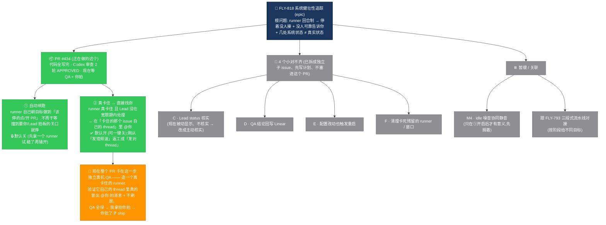

# FLY-818 系统健壮性追踪 — 现状一图看懂

Issue: FLY-818 (https://linear.app/geoforge3d/issue/FLY-818/infraepicrobustness-系统健壮性追踪-runner-完成idle-不上报-founder-lead-status-不准)
日期: 2026-07-04
基于: exploration.md / plan.md（同文件夹）

> 给 Annie 的现状说明：你问"这个系统的健壮性追踪现在长什么样"。一句话：**FLY-818 是一把伞（epic），治的是「runner 干着干着停了、没人接着干、也没人可靠告诉你」这个根问题，外加几处「系统以为的状态 ≠ 真实状态」的对不齐。** 下面这张图 = 伞下面拆了哪几块、每块现在到哪一步。

## 根问题（为什么要有这把伞）

Runner 是**回合制**的：干完一个回合，就停在命令行等下一句话 —— 但这时目标**还没做完**。于是两件坏事：

1. **没人接着让它干**（它就干等着，浪费）。
2. **没人可靠地告诉你它卡住了**（你不知道，直到你自己去看）。

再加上几处**对不齐**：系统显示的 Lead 状态 / QA 结论 / 配置改动 / 残留进程，跟真实情况有偏差。

## 一张图：伞下拆了什么 + 各自到哪一步

**图例**：🟢 代码完成/审查过 　🟠 现在卡在这（等 QA/你） 　⚪ 还没动（子 issue / 暂缓）

## 一句话现状

- **这个 PR（#434）里的两件事都写完了、Codex 审查两轮都通过、byte-compat（不碰现有行为）。** 现在**唯一没做完的一步 = 独立真机 QA**：真造一个卡住的 runner，看它自己的 issue thread 里是不是真冒出 @你 的提醒、且不刷屏。QA 绿了才拿给你拍板 ship。**在你拍之前绝不 ship。**
- **4 个小对不齐（C/D/E/F）已经拆成独立子 issue**，先写计划、单独做，**不塞进这个 PR**（避免这个 PR 越滚越大）。
- **①（自动续跑）默认是关的** —— 先拿一个 runner 小范围试、稳了再铺开，不会一上来就全队自动跑。
- **②（卡住找你）默认是开的** —— 因为「真卡住必须有人告诉你」是这把伞最初就要解决的痛点，关着等于没做；但只在「真卡住」这个少见情况才触发，风险低，且留了一键关。

## 走过的一段弯路（为什么②改了几版）

②「发到哪」你改了三次主意，我跟着返工了三次：DM → alert 告警频道 → **最终定稿：发到卡住那个 issue 自己的 thread**。最后这版其实最简单，因为代码库里早有一条现成的「往 issue thread @你」的管子（FLY-605 当初就把「发告警频道」这条路否决了），我复用它就行、没重造轮子。
