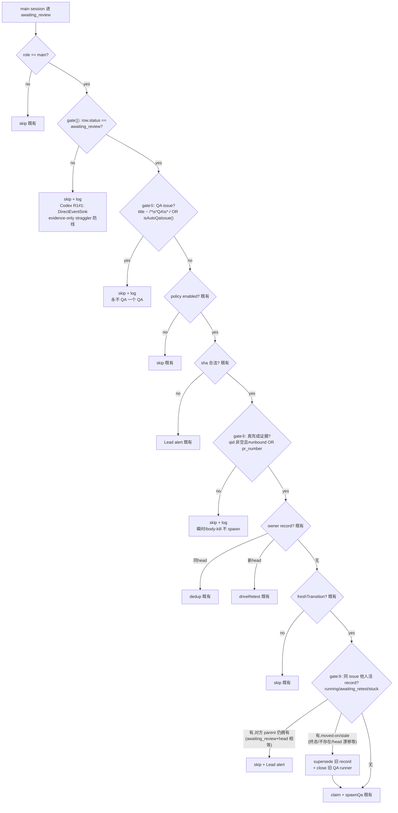

# FLY-846 auto-QA 误 spawn 三重 gate — 实施计划

Issue: FLY-846 (https://linear.app/geoforge3d/issue/FLY-846/infrap1-auto-qa-在-qa-issue-上又-spawn-qa-of-qa-guard-没生效潜在-runawayfly)
日期: 2026-07-04
基于: research.md

## 目标

auto-QA spawn 前三条 gate（+ Codex R1 补的 gate⓪ status 防线）,根治三类误 spawn（QA-of-QA / 过早 spawn / 重复 spawn），消除 runaway 级联。全部收敛在 `AutoQaCoordinator.onMainAwaitingReview`（两个 sink 的唯一咽喉）。Brainstorm gate 已获 Lead 批准（含 gate③ 对方 parent 终态时 supersede+放行的拍板）。

## 流程图



## Step 1 — StateStore 两个只读查询（TDD）

**RED**：`packages/teamlead/src/__tests__/` 新增（或就近扩展 StateStore 测试文件）：

- `isAutoQaIssue(keys: string[])`：
  - record 的 `qa_issue_id` 命中 → true；`qa_issue_identifier` 命中 → true；不命中/空 keys → false（空/全空白 keys 不得生成非法 SQL）。
- `listActiveAutoQaRecordsForIssue(input: { issueKeys: string[]; excludeParentExecutionId: string })`：
  - 只返回 status ∈ {running, awaiting_retest, stuck}；
  - `issue_id` 命中任一 key 即算——**parent issue 键 UUID/identifier 混形要正面验证**（Codex R1 #3）：一条 record 以 issueId="uuid-parent" 落库、另一条以 "FLY-696" 落库，`issueKeys: ["uuid-parent","FLY-696"]` 两条都返回；
  - 排除 `excludeParentExecutionId`；
  - passed/failed/superseded 不返回；空 keys → `[]`。

**GREEN**（`packages/teamlead/src/StateStore.ts`,照抄 `listAutoQaRecordsByStatus` 的 sql.js 模式）：

```ts
isAutoQaIssue(keys: string[]): boolean
// SELECT 1 FROM auto_qa_record WHERE qa_issue_id IN (...) OR qa_issue_identifier IN (...) LIMIT 1

listActiveAutoQaRecordsForIssue(input): AutoQaRecord[]
// SELECT * FROM auto_qa_record
//  WHERE status IN ('running','awaiting_retest','stuck')
//    AND issue_id IN (...keys)
//    AND parent_execution_id != ?
//  ORDER BY started_at
```

（keys 去空去重后动态占位符；不改 schema、不加索引——全表 <100 行且 status 已有索引。）

## Step 2 — coordinator 三条 gate（TDD）

`packages/teamlead/src/bridge/auto-qa-coordinator.ts` `onMainAwaitingReview`：

**Gate ⓪ — coordinator 级 status 防线**（role 检查后立即；Codex R1 #1）：

```ts
if (session.status !== "awaiting_review") { log skip; return; }
```

理由：DirectEventSink 的 FLY-191 R5 evidence-only 分支（DirectEventSink.ts:457-492）对 Phase-2-bound session 的迟到 qid-less 完成**不改 row 状态**（row 保持 approved_to_ship），但本地 `status` 变量仍是 "awaiting_review"，其 auto-QA 调用 gate（:622）用的是本地变量 → 一个已 approved_to_ship 的 row 会进 coordinator，且旧 qid 让 gate② 放行。coordinator 必须自查 row 状态，才配叫「真咽喉」。

**Gate ①**（gate⓪ 后、policy 前）：

```ts
if (this.isQaIssueSession(session)) { log skip; return; }
// isQaIssueSession = /^\s*QA\s*·/.test(issue_title ?? "")
//   || store.isAutoQaIssue([issue_id, issue_identifier].filter(Boolean))
```

log-only,不 alert（普通 review 流程照走,Lead 自然看到）。

**Gate ②**（sha 检查后、owner-record 分支**前**——retest 同样受保护）：

```ts
const qid = session.review_question_id;
const hasReviewEvidence =
  (!!qid && qid !== REVIEW_BINDING_UNBOUND) || session.pr_number != null;
if (!hasReviewEvidence) { log skip; return; }
```

不 claim、不 alert → parent 走普通 review 路径（pre-FLY-579 行为,绝不 wedge）。

**Gate ③**（freshTransition 通过后、claim **前**）：

```ts
const foreign = store.listActiveAutoQaRecordsForIssue({
  issueKeys, excludeParentExecutionId: session.execution_id });
for (const rec of foreign) {
  const otherParent = store.getSession(rec.parent_execution_id);
  // stale 判定与 reconcileOnStartup 的 running-sweep 逐字同构（Codex R1 #2）:
  // 对方 parent「仍拥有」这条 record = awaiting_review 且 head 仍等于 record 的 target sha;
  // 其余（终态/不存在/running/approved_to_ship/head 已漂移）都算 moved-on → stale。
  const parentStillOwnsRecord =
    otherParent?.status === "awaiting_review" &&
    otherParent.pr_head_sha?.toLowerCase() === rec.target_pr_head_sha;
  if (parentStillOwnsRecord) {
    // 一 issue 两个活 main 挂 QA = 真异常 → skip + Lead alert,人来处理
    alertLeadPipelineError(...); return;
  }
  // stale → 事件驱动 reconcile 同款清理,然后放行。顺序固定:先 supersede 再
  // best-effort close(与 reconcile awaiting-retest 分支一致);close 只尝试一次,
  // 失败不重试不告警(closeQaRunner 本就吞错;Codex R1 #4) — 死 parent 不挡新 spawn。
  store.setAutoQaStatus(rec.parent_execution_id, rec.target_pr_head_sha, "superseded", {});
  const oldQa = rec.qa_execution_id ? store.getSession(rec.qa_execution_id) : undefined;
  if (oldQa && !TERMINAL_STATUSES.has(oldQa.status ?? ""))
    await effects.closeQaRunner({ qaSession: oldQa, reason: "superseded by new parent …" });
}
// 继续 claim + spawnQa
```

**测试用例**（auto-qa-coordinator.test.ts,复用 awaitingMain/fakeEffects 基建）：

1. gate⓪: row.status="approved_to_ship" 且带 qid+sha+pr_number 的 main session → 不 spawn、无 record（Codex R1 #1;另加 DirectEventSink 回归:FLY-191 R5 迟到 qid-less approved_to_ship 场景断言无 auto_qa_record 产生）；
2. gate①: issue_title="QA · FLY-1 — x" 的 main session → 不 create issue、不 start、无 record；
3. gate①: title 无前缀但 issue_id 命中某 record 的 qa_issue_id → skip；issue_identifier 命中 qa_issue_identifier → skip；
4. gate②: 无 qid（NULL）且无 pr_number → skip；qid="unbound" 且无 pr_number → skip；
5. gate②: 只有 qid → spawn；只有 pr_number（qid=NULL 或 unbound）→ spawn（LEARN 形态回归）；
6. gate②: retest 路径（owner record + 新 head）在无证据时不 retest；有证据时照常 retest（FLY-752 回归）；
7. gate③: 他人活 record（running/awaiting_retest/stuck 各一）+ 对方 parent awaiting_review 且 head==record.target sha → skip + alert、无新 record；
8. gate③: 对方 parent awaiting_review 但 head≠record.target sha（moved-on 契约,Codex R1 #2）→ 旧 record superseded + 放行新 spawn；
9. gate③: 他人 running record + 对方 parent terminated → 旧 record 变 superseded + 旧 QA closeQaRunner 被调一次（best-effort,失败不阻 spawn）+ 新 spawn 成功（FLY-696→842/852 重放）；对方 parent 不存在 → 同上；
10. gate③: 他人 record 为 passed/superseded → 不挡（照常 spawn）；
11. 回归: 既有全部用例不动、全绿（awaitingMain 自带证据字段）。

## Step 3 — 全量验证

```bash
pnpm --filter @flywheel/teamlead test   # 或包内 vitest run
pnpm lint && pnpm build                  # push 前全仓（feedback_lint_and_ci_hygiene）
```

## Step 4 — PR + 评审 + QA

1. 分支 `flywheel-FLY-846`(已在)提交:docs（exploration/research/plan）+ tests + impl；
2. `gh pr create` → `stage set pr_created` → Codex code review（Bridge 自动触发）；
3. review 过后 approve gate --no-block + `complete --route needs_review --pr N --question-id qid`；auto-QA(FLY-579)会给本 issue spawn 独立 QA——本修恰好经受自己的 gate 检验；
4. HOLD ship 等 Annie（Lead 已明示）。

## 明确不做

- 不改 schema / 不加 feature flag / 不动调用点、policy、effects、held、FSM、phase-orchestrator、reconcileOnStartup（保留作兜底）；
- 不回收存量坏 record（FLY-842/845/828 已终态;FLY-852 由 Lead 处置）；
- 手动 QA（无 auto_qa_record）不进 gate③ 检测——runaway 源是 auto 管线,gate① 的 title 前缀已防「手建 QA issue 被再 QA」。

## 风险与回滚

- 三条 gate 都是「少 spawn」方向的收紧,skip 均退化为 pre-FLY-579 普通 review 路径——错拦的最坏后果是某次该有的 QA 没跑、founder 走普通待批（有 log 可查）,不会 wedge、不会多 spawn。
- 证据谓词经生产 30 条全量回测：误伤 0/28、漏拦 0/2。
- 回滚 = revert 单个 PR（无 schema/状态迁移）。
