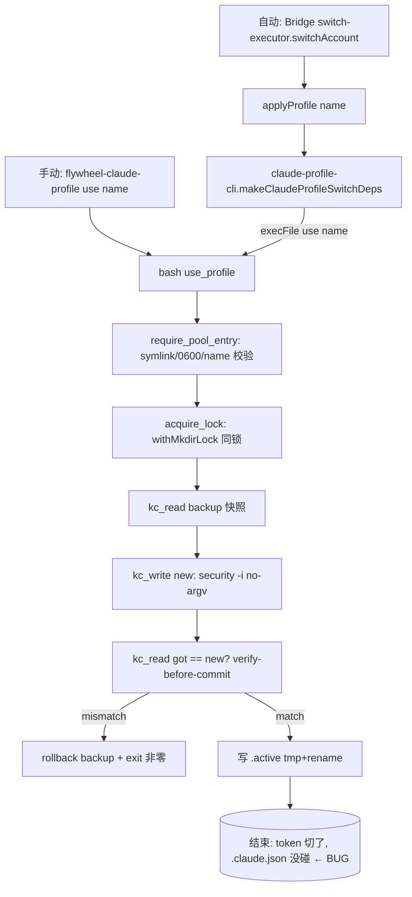

# FLY-865 账号切换身份同步 — 技术调研

Issue: FLY-865 (https://linear.app/geoforge3d/issue/FLY-865/bug-账号切换只换-token-不换显示身份-新-claude-status-仍显示旧账号阻塞-696-enable)
日期: 2026-07-04
基于: exploration.md

---

## 1. 切换链路(现有代码,已审计)



**关键结论**:两条入口(手动 CLI + 自动轮转 executor)**最终都落到同一个 bash `use_profile`**。TS `switch-executor.ts` 的 `applyProfile`(`claude-profile-cli.ts`)就是 `execFile(binPath, ["use", name])`,不额外做任何事。→ **只要在 bash `use` 里补身份同步,两条入口一次覆盖**,无需改 TS 逻辑。

审计命令(确认无第二处 Keychain / oauthAccount writer):
```
grep -rn "flywheel-claude-profile|kc_write|add-generic-password|oauthAccount" --include=*.ts packages
```
→ 只有 `switch-executor.ts` / `claude-profile-cli.ts` 引用 `use`,且都经 `applyProfile`。无旁路。

## 2. 数据形状(真机核实,keys-only,未打印任何 token 值)

### 2.1 `~/.claude.json` 的 `oauthAccount`(/status 显示身份来源,非 secret)

```
accountUuid, emailAddress, organizationUuid, organizationName, organizationType,
displayName, hasExtraUsageEnabled, billingType, accountCreatedAt,
subscriptionCreatedAt, organizationRole, workspaceRole, seatTier,
organizationRateLimitTier, userRateLimitTier, profileFetchedAt, ...
```
`.claude.json` 是 claude 自管的大 JSON(~80+ 顶层 key:caches、numStartups、mcpServers…)。`oauthAccount` 是其中一个顶层字段。**patch 只能替换这一个字段,保留其余全部**(→ jq / node JSON parse,不能 regex)。

### 2.2 pool profile 的 `.credentials.json`(只有 token,无身份)

```
claudeAiOauth.accessToken, claudeAiOauth.refreshToken, claudeAiOauth.expiresAt,
claudeAiOauth.scopes[0..4], claudeAiOauth.subscriptionType, claudeAiOauth.rateLimitTier
```
**无 accountUuid / emailAddress / organizationUuid**。这是身份丢失的物理原因。

### 2.3 当前池状态(真机)

```
~/.flywheel/claude-profiles/{shopping,business,personal,school}/.credentials.json  (4 个 token)
~/.flywheel/claude-profiles/.active = shopping
~/.claude.json oauthAccount = shopping (emailAddress=xrliannie.shopping@gmail.com)
```
→ 只有 shopping 的身份现存在于 `.claude.json`;其余 3 个账号身份从未采集(capture 只抓过 Keychain token)。

## 3. 各路径可行性论证

| 路径 | 机制 | 可行性 | 判定 |
|------|------|--------|------|
| 1 capture+restore | 池里成对存 token+身份;use 写回身份 | 确定性,不依赖 claude 内部;需一次性 re-capture 3 账号 | **采用** |
| 2 clear→refetch | use 时清空 oauthAccount,赌 claude 用 token 重取 | bug 本身证明 claude 不从 token reconcile(否则换 token 就自动换显示);清空有触发重登风险(撞 red line);quota-safe 不可验证 | 排除 |
| 3 token 派生身份 | 从 token 解 email/org | token = opaque `sk-ant-oat01`(非 JWT),无本地手段 | 排除 |

## 4. 工具链

- `jq` 1.7.1(`/usr/bin/jq`)可用;`node` v25(`/usr/local/bin/node`)可用。
- bash 脚本当前**不用 jq**。为不引入运行时新硬依赖 + 保持脚本可测,JSON patch 用 **`node -e`**(本仓 Node 项目,脚本本就由 Node Bridge / vitest `execFileSync("bash", …)` 触发,PATH 里必有 node;比 jq 更稳的「保证可用」)。备选 jq。→ 具体二选一在 plan.md 定。

## 5. 测试基建(现有,可复用)

`packages/claude-runner/test/claude-profile.test.ts` 已有完整 harness:
- fake `security`(stub bin + state file + argv log),env override 全套(`FLYWHEEL_CLAUDE_SECURITY_BIN` / `_KEYCHAIN_SERVICE` / `_PROFILES_DIR` / `_ACCOUNTS_LOCK`)。
- `run()` / `runExpectFail()` / `seedProfile()` helper。
- RED LINE 断言范式(argv log 不含 secret;verify-fail rollback)。

新增:
- `FLYWHEEL_CLAUDE_JSON` env override → scratch `.claude.json` fixture。
- `capture` 采集身份、`use` 写回身份、无身份 warn+exit0 的用例。
- 大 `.claude.json`(多顶层 key)patch 后其余 key 无损的用例。

`packages/teamlead/src/__tests__/claude-profile-cli.integration.test.ts`(REAL 脚本 + REAL 锁 + fake security)可加一条:切换后 scratch `.claude.json` 身份被写。
