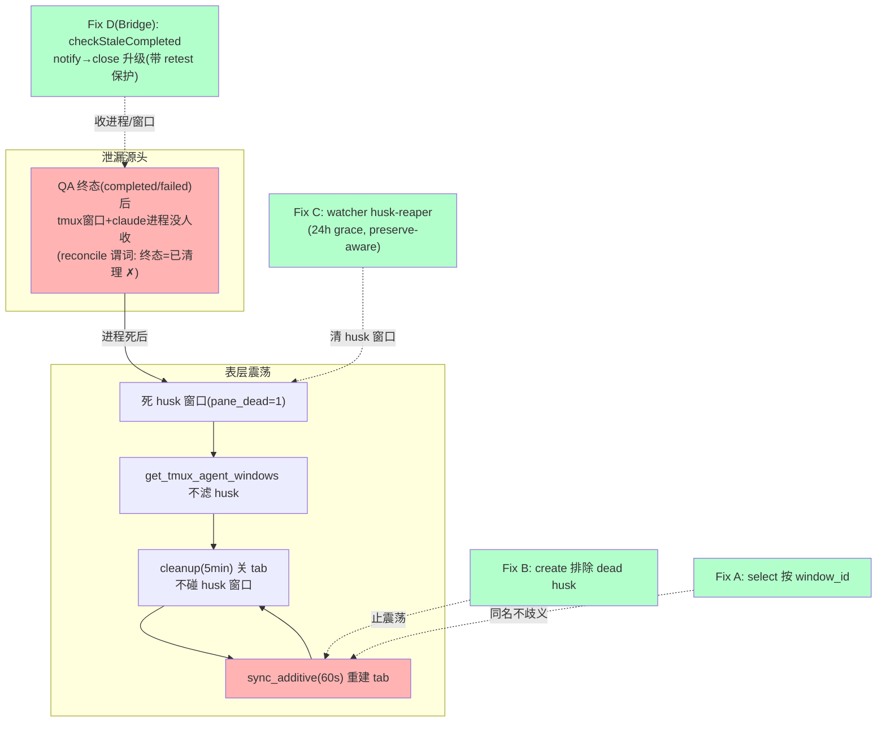

# FLY-867 死 runner tab 清不掉 — 实施计划

Issue: FLY-867 (https://linear.app/geoforge3d/issue/FLY-867/bugcmux彻底收口-cmux-侧栏跟真实-tmux-不同步-死-runner-tab-关不掉-活-runner-不显示如-865修死)
日期: 2026-07-04
基于: research.md

**Status**: codex-approved（design review 2 轮 APPROVED，xhigh；R2 guardrails：closeRunner 用 reason 字段、retest fail-closed 测试精确、Fix C 镜像 FLY-293 bash 防御）

---

## 1. 问题与目标（一句话）

cmux 死 runner tab「关不掉」由两条链叠加：**表层震荡**（cleanup 每 5min 关 tab，dead husk 源窗口不滤 → sync_additive 60s 重建；FLY-808 日志铁证 ~7min 周期）+ **深层泄漏**（终态 session 的 tmux/进程没人收：reconcile 的 close 谓词把「CommDB 终态」当「已清理」，真机 15 个终态+进程活着的 QA 实证）。**根治 = watcher 三环（A/B/C）止震荡清 husk + Bridge 一点（D）把 GEO-270 stale 巡检从 notify-only 升级为 close** + 一次性清现存。



非目标：不动 dispatch/retry 管线；不清 parked-alive 15 进程（Lead 逐个 close_runner，清单已交）；不碰活 lead/活 runner；FLY-806（awaiting_review 异常态）只 flag。

## 2. 交付物

| # | 交付物 | 层 | 生效方式 |
|---|---|---|---|
| A | Fix A：create ready-gate select 按 window_id（1 行） | watcher(bash) | merge+pull+kill watcher（launchd 自动重拉），零 Bridge 重启 |
| B | Fix B：`window_source_pane_alive` 谓词 + create 顶部 husk 守卫 | watcher(bash) | 同上 |
| C | Fix C：`reap_dead_husk_windows` 周期 reaper（24h grace + kill-switch） | watcher(bash) | 同上 |
| D | Fix D：`checkStaleCompleted` notify→close 升级（retest 保护 + kill-switch） | Bridge(TS) | 攒批量 Bridge 重启窗 |
| E | 测试：test-cmux-sync.sh mock 忠实化 + A/B/C RED→GREEN；D 的 vitest 单测 | 测试 | — |
| F | 一次性清现存 7 窗死 husk + 报数字（watcher fix 部署后执行） | ops | — |
| G | 独立真机 QA S1–S5（收口 819 层） | 独立 QA | — |

## 3. 详细设计 — watcher 侧（scripts/flywheel-cmux-sync.sh）

### 3.1 Fix A — ready gate 按 window_id select（1 行）

`create_workspace_for_window`（≈2098）：
```bash
# 旧: tmux select-window -t "=${view_session}:=${window_name}"
# 新: tmux select-window -t "=${view_session}:${window_id}"
```
- `window_id`（`$2`）所有调用点已传入；grouped session 共享 window 对象 → wid 是合法 view target（FLY-177 refresh_linked_sessions:2230 同款）。
- 效果：同名多窗口（混合 1死1活、或多活）create 不再歧义 defer —— 清理后 tab 可为活窗重建，清理系统不误伤活 runner 可见性。真机歧义已隔离 server 实证（`can't find window` rc=1）。

### 3.2 Fix B — create 对 dead husk 免疫（止震荡，核心）

新谓词（ID-scoped，镜像 refresh_linked_sessions 的 liveness 探测；is_pane_alive 是 name-scoped 在此错误——同名兄弟活会漏判）：
```bash
window_source_pane_alive() {
  local sess="$1" wid="$2" dead
  dead=$(tmux display-message -p -t "=${sess}:${wid}" "#{pane_dead}" 2>/dev/null || echo "1")
  [[ "$dead" == "0" ]]
}
```
`create_workspace_for_window` 顶部（FLY-825 dedup 之前）：
```bash
# FLY-867: dead-husk windows must NEVER get a workspace — breaks the
# CREATE↔CLEANUP oscillation. Silent skip (60s rescan × N husks would flood).
window_source_pane_alive "$source_session" "$window_id" || return 0
```
- probe 失败 → `"1"` → 跳过 create。fail-closed 方向正确：漏一次 create 有下轮/事件兜底；为死窗建 tab 才是 bug 本身。
- 覆盖全部 create 路径；create 事件（新窗 pane 必活）行为不变。

### 3.3 Fix C — dead-husk 窗口周期 reaper（preserve-aware）

新函数 `reap_dead_husk_windows`，挂 `sync_additive`（60s tick 内，零新 timer——FLY-129 纪律）：

谓词（ALL 必须成立才 reap）：
1. 窗口在 `runner-*` 组（**绝不碰 `flywheel` Lead 组** —— Lead 窗口由 claude-lead.sh 生命周期管理）；
2. `is_managed_runner_title`（既有 FLY-293 gate：`^[A-Z]+-[0-9]+-(claude|design|implement|qa)(-|$)`）；
3. `pane_dead=1`（按 window_id 探测；probe 失败 → 不 reap，fail-closed）；
4. 持续 dead ≥ grace（默认 **24h**，`FLYWHEEL_CMUX_HUSK_GRACE` env 可调，数字校验 + 长度上限镜像 FLY-293 reaper 的防御）。grace 状态文件 `HUSK_STATE`，**key = `session|window_id|base64(window_name)|first_seen_dead`**（Codex R1 #4：裸 wid 太弱 —— tmux server 重启后 @id 可复用、跨 title/session 漂移会继承旧时钟绕过 grace）；session/title 与现窗任一不匹配 → re-clock（当新 first-seen）；启动 GC 删 `(session,wid,title)` 精确三元组已不存在的行；镜像 ORPHAN_PIN_STATE 模式（mktemp+mv 原子写、字段校验、损坏行自愈）。

动作：kill 前**最后重验**（同 key 精确匹配 + runner-* 组 + managed-title + `pane_dead=1` 按 id）→ `tmux kill-window -t "=<sess>:<wid>"`（之后 cmux tab 由既有链自然收敛：window-unlinked 事件/cleanup/FLY-293 orphan-pin reaper）。

kill-switch：`FLYWHEEL_CMUX_HUSK_REAPER=0` → 完全 inert（byte-compat OFF 路径）。bash 侧两 env（HUSK_REAPER/HUSK_GRACE）在 watcher 启动日志打印生效值（FLY-254 knobs 行同款，运维锚点；TS drift scan 不覆盖 bash，靠这行文档化）。

**preserve 边界（设计权衡，Codex 把关）**：CRASH_PRESERVE（failed/blocked）husk 的 scrollback 是 forensics 现场（FLY-720 语义）。本 reaper 用 **24h grace** 尊重之而非永久保留 —— crash-reaper（60min 门 + crashGrace）拥有绝对先手权收 running-session 的 dead-pin 并抓 scrollback；24h 后无人看的 forensics 让位于「别攒」（Annie 明确诉求，Lead 确认 C 做）。bash 侧不做 CommDB 状态耦合（窗口→session 映射含糊，复杂度不值——research §2 C3 已否）。

### 3.4 震荡终止后的收敛链

husk-only name（如 808）：Fix B 止重建 → cleanup（5min）关 tab + 杀 linked session → 永久干净；husk 窗口 ≤24h 内由 Fix C 收 → FLY-293 orphan-pin reaper 收残 pin。

## 4. 详细设计 — Bridge 侧（Fix D，④ 终态泄漏收口）

### 4.1 缺口（真机实证）

15 个 QA（803/804/811×2/815×2/819/829/833/848/852×3/857/860）全部 **CommDB 终态（completed 11/failed 3/blocked 1）+ claude 进程与 tmux 窗口活着**。现有机制全部漏过：
- auto-QA reconcile 的 close 谓词 `!TERMINAL_STATUSES.has(qa.status)`（auto-qa-coordinator.ts:1119/1245/1253）——**把终态当已清理**，但状态转终 ≠ tmux 收了（QA 违反「PASS 后勿 complete」合同自行 complete、或 marker-reconciler 转态，都会造出终态+活进程）；
- crash-reaper 只碰 `status='running'`（StateStore.ts:2749）；
- GEO-270 `checkStaleCompleted`（HeartbeatService.ts:825）探测的正是「终态 + tmux alive ≥24h」这个组合——**但只 notify 不 close**。

### 4.2 修法：checkStaleCompleted notify → notify+close（最小单点，Codex R1 已修订）

在既有循环（已判定 `alive===true` 之后）加：

```ts
// FLY-867: a terminal-status session whose tmux window is still alive after
// staleThresholdHours is a leak — nothing else closes it (crash-reaper only
// takes status='running'; auto-QA reconcile treats terminal as already-clean).
// Close it through the closeRunner chokepoint UNLESS an active fix-loop still
// needs it (FLY-752: parked QA awaiting retest must stay alive).
if (this.staleCloseEnabled() && !this.isRetestProtected(session)) {
    const res = await this.closeStale(session); // plugin-injected → closeRunner(...)
    if (res.closed) continue;                    // confirmed close → skip stale notify
    // close failed / ineligible → fall through to the existing notify path
    // (operator visibility preserved; NOT marked handled)
}
```

- **合同（R1 #7）**：D 拥有的终态集 = `getStaleCompletedSessions` 现查询（completed/failed/blocked）、**不限 session_role**（852 的 main-role 泄漏实证 main 也漏）。不扩 terminated/rejected/shelved/deferred（各自路径已有 close 链）。复用现查询、不新增（避免过度工程）；合同写进代码注释 + 测试。
- **retest 保护谓词（R1 #3，owner-record 绑定）** `isRetestProtected(session)`：按 **parent owner record** 语义证明该 session 是当前 fix-loop 的 QA —— 存在 auto_qa_record 满足 `record.qa_execution_id === session.execution_id` ∧ `record.status ∈ {running, awaiting_retest}`（active 态；running 也保 —— in-flight QA 带终态 CommDB 异常宁可不杀）∧ parent 存在 ∧ `parent.status === 'awaiting_review'` ∧ `parent.pr_head_sha === record.target_pr_head_sha`。`qa_execution_id` 非唯一（历史重复行）→ **任一**满足即 protected；任何读库 throw / 归属歧义 → protected（fail-closed 不杀）。测试盖历史重复行 + parent head 漂移。
- **closeStale 注入（R1 #1）**：plugin.ts 注入回调 → `closeRunner({ trigger:"fly867_stale_terminal", forcePreserved:true, archive })`，**返回 close 结果**。`forcePreserved:true` 是本 backstop 的关键：closeRunner 的 preserve gate（close-runner.ts:53-57,210-230）会拦 failed/blocked —— 恰是实证泄漏里的 3 failed + 1 blocked；本 backstop 已过 retest 保护 + 24h stale 门，preserve 例外成立（进程活挂 24h+ 无 fix-loop 引用 = 纯泄漏，非 crash-forensics 场景）。测试断言 failed/blocked 走 force_preserved 路径真拆 tmux。
- **close 结果语义（R1 #2）**：只有 `closed:true`（或 target-gone）才 skip notify；失败/不可拆 → 走既有 `onSessionStale` 通知（运维可见性不丢）且**不**记 dedup。成功路径的候选退出机制 = closeRunner 成功 kill 后**删 CommDB 行**（close-runner.ts:373-378）→ 下轮查询天然不含；~~转 terminated~~（R1 纠正：closeRunner 不转终态行的 status）。
- **kill-switch（R1 #6）**：`FLYWHEEL_STALE_TERMINAL_CLOSE=0` → 回退纯 notify（byte-compat）。默认 **on**。**注册进 feature-flag registry**（packages/config/src/feature-flags/registry.ts，default-on kill-switch，读点=HeartbeatService/plugin 接线）—— FLY-709 drift guard 会抓未注册 env。
- 节奏复用：staleCheck 每 6h、threshold 24h —— 零新 timer、零新表。

### 4.3 上游合同不动

QA runner「PASS 后勿 complete」合同、FLY-752 park 协议、FLY-859 verdict tail 全不碰 —— D 是 backstop 收口，不改契约。

## 5. 一次性清现存（ops，watcher fix 部署后）

顺序：**Fix A/B/C merge + watcher 重启之后**执行（否则旧 watcher 重建 tab —— 即本 bug）。执行前逐窗重验 `pane_dead=1` + PID 不存在，不符即跳过并报告：
1. kill 7 窗死 husk：787→4@603,12@283；808→1@749；824→19@1420；842→23@1517；834→26@1614（保活兄弟 17@1412）；850→27@1615（保活兄弟 25@1583）。
2. husk-only 4 name（787/808/824/842）：杀 `cmux-<name>` linked session + socket `close-workspace` 收残 tab。
3. 15 个 parked-alive 由 **Lead 逐个 close_runner**（清单已交，含 exec-id）——非本 runner 动作。
4. 报数字。

## 6. 测试策略（TDD）

watcher（harness = scripts/test-cmux-sync.sh，mock 系统）：
1. mock 忠实化（Codex R1 #5，先行）：统一 target parser —— `display-message -t "=sess:@id"` 按 id 解析、`=sess:=name"` 按 name 解析（现 MOCK_PANE_DEAD 两种 fixture 惯例混用：早期 `session:wname`、FLY-177/280 `session:@id`，统一而不破坏既有断言）；`select-window -t "=sess:=name"` 在该组同名 ≥2 时 rc=1（真 tmux 已实证）、`@id` 命中 rc=0。既有 FLY-177/280 by-id 测试不受影响（回归验证）。
2. Fix A RED→GREEN：dup-name 2 活窗 + workspace MISSING → 旧码 defer / 新码建成。
3. Fix B RED→GREEN：husk-only → 旧码 create（震荡）/ 新码零 cmux 调用；混合 → 只为活窗 create。
4. Fix C：husk 满 grace → kill-window 发出；未满 → 不动；probe 失败 → 不动；Lead `flywheel` 组窗口 → 永不 reap；kill-switch=0 → inert；HUSK_STATE 损坏行 → 自愈不崩（`set -euo pipefail` 防御镜像 FLY-293 的 R1/R2 修法）；**key 重验**：session/title 漂移 → re-clock 不 kill；tmux-server-restart 复用 @id 场景不继承旧时钟。
5. 全量 `bash scripts/test-cmux-sync.sh` 回归绿。

Bridge（vitest，packages/teamlead）：
6. Fix D：completed/failed/blocked 各态 +alive+超时 → closeStale 以 `forcePreserved:true` 调用且真拆（failed/blocked 断言 force_preserved 路径而非 preserved 短路）→ skip notify；**close 失败/`closed:false`** → 走既有 notify 且不记 dedup；retest-protected（active owner record + parent awaiting_review @ 同 head）→ 不 close 只 notify；历史重复 qa_execution_id 行 → 任一 active 即 protected；record 读 throw → protected（fail-closed）；kill-switch=0 → 纯 notify（byte-compat 哨兵）；成功 close → CommDB 行删除 → 下轮候选自然退出。feature-flag registry 注册（drift test 绿）。
7. `pnpm lint` + teamlead 全量测试绿（push 前全仓 lint —— 纪律）。

## 7. 独立真机 QA（S1–S5，收口 819 层，deploy 后）

- S1 husk→tab 自动消：造 managed-title 测试窗跑短命进程 → husk → tab ≤6min 消失且 ≥2 个 additive 周期（≥10min）不重建。
- S2 混合：同名 1活1死 → close tab → ≤60s 重建且指向活窗。
- S3 全链：真派 test runner → 出现 cmux → close_runner → tab 消失不回。
- S4 护栏：全程活 lead/活 runner tab 一个不少。
- S5（Fix D，Bridge 重启窗后）：造终态+活进程 session（缩短 threshold env）→ 周期内被 close；retest 保护场景不被杀。

## 8. 部署

- **watcher 侧（A/B/C）**：merge → 生产主仓 `git pull` → kill watcher PID（launchd KeepAlive+SUPERVISED 自动重拉新码）。零 Bridge 重启。随即执行 §5 清现存。
- **Bridge 侧（D）**：**攒批量重启窗**（纪律：多 Bridge PR 攒一次重启；开跑前问 team-lead 有无其他 Bridge PR 排队）。D 在重启前 dormant 不影响 A/B/C 生效。
- 回滚：watcher revert+再 kill；Bridge kill-switch env 或 revert。

## 9. 风险与红线

- 绝不 kill 活 lead/活 runner；Fix C 三重 gate（runner-* 组 + managed-title + pane_dead 按 id）+ 24h grace + kill-switch；Fix D retest 保护 fail-closed。
- 清现存逐窗重验；cmux 变更全走 socket。
- Fix C grace 与 crash-reaper（60min）间隔 >23h —— forensics 先手权无冲突。

## 10. Follow-ups（只剩真正外围的）

1. FLY-806 形态（awaiting_review + 进程死 = 异常态）→ flag 给 Lead（本次不清）。
2. QA runner 违反「PASS 后勿 complete」合同的 prompt 侧收紧（D 已兜住后果，非紧急）。

---

## 实现说明（2026-07-04 落地，Lead 确认后）
- **Fix C（husk 窗口自动 reaper）降级 follow-up**：Lead 批准 —— 自动 reap 撞 FLY-720 CRASH_PRESERVE forensics 边界（834:26 案例），而 Fix B 后 husk 只留在 tmux 层、cmux 侧栏不再显示，Annie 可见的「攒」已由 B+D 消掉。C = tmux 内部卫生，单独 issue。
- **实际交付 = Fix A + Fix B（watcher）+ Fix D（Bridge stale-terminal close）+ 一次性清现存**。
- 一次性清现存已由插队指令完成：comm.db 33 僵尸转终态、7 窗死 husk（Lead close parked 时带走）、孤儿 tab=0。
- Fix D 生效时序：A+B watcher 侧即时（merge+pull+kill watcher）；D 随下一次 batched Bridge 重启生效（默认 ON `FLYWHEEL_STALE_TERMINAL_CLOSE`）。
