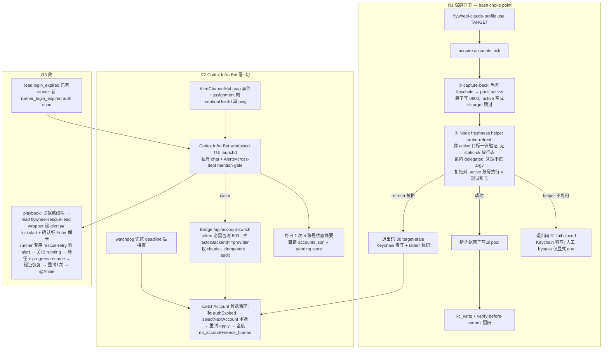

# FLY-871 Codex 救援 Bot(看/切/救 + token 保鲜)— 实施计划

Issue: FLY-871 (https://linear.app/geoforge3d/issue/FLY-871/infraresilience-codex-救援-bot-账号体系外的看切救696-交叉自愈架构的-codex-半边token)
日期: 2026-07-04
基于: research.md

> Brainstorm gate 已过(Lead 确认理解正确)+ **Annie GO 已到(lead-instruction d9958eec / 47ef28c4,2026-07-04)**,4 个决策点全拍:① 救援 = bot 直接执行(配合同边界)② 命名 = **Codex Infra Bot**(不用 Baymax;将来反向 = Claude Infra Bot,按背后模型命名)③ OAuth refresh 端点直调 OK(fail-closed)④ **R1 保鲜守卫先单独 ship**(凑 696 enable 条件的一半),R2/R3 随后。Lead 补充硬要求:「active 账号绝不从 pool 侧 refresh」必须写成测试断言(→ §3 C2)。执行顺序:design review 后交接 Implement 段;**Implement 先做 R1 并单独 PR**。

---

## 1. 目标与范围

**根治 2026-07-04 logout 事故**(stale pool token 被切进机器级 Keychain → 全机 session 被踢)+ 上线 **696 交叉自愈架构的 Codex 半边 = Codex Infra Bot**(看/切/救 Claude 侧)。

**In scope(三段,均独立可 ship)**:
- **R1 token 保鲜守卫**(纯 Bridge/bash 机械,不依赖 bot):切走回捕 + 切前活性验证(非 active 目标一律 probe-refresh)+ authExpired 写入与候选循环 + 每日 keep-fresh(回捕跟随主 flag;probe-refresh 半独立开关默认 off,R3 后启用)。
- **R2 Codex Infra Bot 上线(看+切)**:windowed TUI full-access Codex(launchd;私有 chat channel + Alerts 作 cross-dept mention-gated 频道)+ C8b 专用 `/account-switch` 路由 + `claimPending` 认领链路 + 每日状态摘要。
- **R3 救**:runner 侧 `runner_login_expired` 检测 + 救援 playbook(lead=`flywheel-rescue-lead` wrapper kickstart+确认框解卡;runner=专用 rescue-retry+progress-resume)+ founder-authority 窄 carve-out。

**Out of scope(follow-up)**:Claude-Bot 反向救 Codex;re-login 自动化(696 M3);「Infra Bot 接管所有 infra」;per-account usage 端点查询(R-7 spike,失败不影响验收);Codex 侧 Bridge 机械 executor。

**硬前置关系**:`FLYWHEEL_ACCOUNT_SELF_HEAL` 保持 OFF;**R1+R2 都 ship 且真机 QA 过 → Annie 拍板 enable**(runbook 见 §8)。

## 2. 架构总览

## 3. 组件分解

### R1 — token 保鲜守卫

#### C1 `use_profile` 切走回捕(bash)
`use_profile()` 在 `kc_write` 前(锁内、`backup=$(kc_read)` 之后):`.active` 非空且 != 目标 且 backup 是合法 JSON object → 原子写 `pool/<.active>/.credentials.json`(temp+rename、0600、拒 symlink,复用 capture 的写法)。kc_read 失败/值非法 → 跳过回捕(warn,不 fail 切换)。
- 测试:回捕后 pool copy == 切换前 Keychain 值;.active 为空跳过;非法值跳过且不改 pool;symlink 拒。

#### C2 Node freshness helper(新,`packages/teamlead/src/account-heal/freshness.ts` + bin 入口)— Codex R1#1/#2 收紧
`verifyPoolCredential(name)`:读 `pool/<name>/.credentials.json` → **对非 active 目标一律 probe-refresh**(OAuth refresh,端点/字段按 **实现期真机 spike** 定案,见 §7-S1)→ 成功:新凭据**先原子写回 pool** 再返回 `{fresh:"refreshed"}`;失败:`{fresh:"stale", reason}`。**没有 static-ok 放行态**(Codex R1#1:事故类别是 refresh-token family 失效,不是 access token 过期 —— expiresAt 未过期照样可能 family 已被外部轮转;红线路径不允许未经活性验证的凭据落 Keychain)。`expiresAt` 只作 telemetry/日志,不作放行依据。
- **硬约束(Tadashi 拍,测试断言不是文字)**:helper 对 `name === .active` **fail-closed 拒绝 probe-refresh**(active 账号的 token family 属于 live session,pool 侧 refresh = 复刻事故);显式单测:对 active 名字调用 → throw,pool 零写,无网络调用(mock fetch 断言 0 次)。
- 凭据绝不进 argv(名字进 argv,凭据经文件读);网络调用 bounded timeout(10s)+ AbortSignal;写回 = temp+fsync+rename 0600。
- bash `use` 在锁内以 delegated 模式 shell out(`FLYWHEEL_CLAUDE_LOCK_DELEGATED=$$`,FLY-852 三条件验证已有)。
- **helper 不可用 = fail-closed(Codex R1#2)**:helper/node 缺失或崩溃 → `use` 退出码 **31 helper-unavailable**,Keychain 零写。人工救急 bypass = 显式 `FLYWHEEL_CLAUDE_FRESHNESS_BYPASS=1`(名字就吓人,`use` 打大声 warning;**仅限人在键盘的紧急场景**)。
- **bypass 防继承(Codex R2#1 HIGH)**:「自动路径不设置」不够 —— `claude-profile-cli.ts` 现在把整个 `process.env` 展开传给 bash 子进程,父环境污染(`.env`/launchd wrapper/测试父进程)会把 bypass 静默带进自动路径。双层堵:① `claude-profile-cli.ts` 构造子 env 时**主动删除** `FLYWHEEL_CLAUDE_FRESHNESS_BYPASS`(scrub,不是"不设");② bash 侧 bypass **仅在非 delegated-lock 模式**下生效(delegated = Bridge 自动切换,env 再污染也不认)。回归测试:父 `process.env` 置 bypass=1 + helper 缺失 → 子 env 无 bypass、`switchAccount` 走退出 31 失败路径、Keychain 零写。
- 测试:refresh 成功→pool 先更新后返回 fresh(顺序断言);失败→pool 原样+stale;**future-expiresAt + refresh 被拒 → stale(不放行)**;active 拒绝断言;超时 fail;写回原子性;bypass env 只在显式设置时生效。

#### C3 `use` 结构化退出 + `switchAccount` 候选循环(bash + TS)
- bash `use`:目标 stale(helper 返回 stale)→ **退出码 30** + stderr `FLYWHEEL_TARGET_STALE <name>`;helper 不可用 → **退出码 31** + stderr `FLYWHEEL_FRESHNESS_UNAVAILABLE`。两者 Keychain/`.active`/identity 全部未动。其他失败沿现有语义。
- `claude-profile-cli.ts` `applyProfile`:捕退出码 30 → throw `TargetStaleError(name)`;捕 31 → throw `FreshnessUnavailableError`。
- `switch-executor.ts` `switchAccount`:catch `TargetStaleError` → 持锁内把该账号 `authExpired:true` 写入 store → `selectNextAccount` 重选(已会跳过 auth-unusable)→ 重试 apply;循环上限 = 池内账号数;全废 → `no_account` + needs_human(消息带 authExpired 名单 + 最早 reset)。catch `FreshnessUnavailableError` → **环境性失败,不标记账号、不循环**(换候选也会同样失败)→ `outcome:"failed"` + needs_human。其他失败保持现状(fail-closed 单次)。
- 测试:stale→标记+换候选成功;两个连续 stale→第三候选成功;全 stale→no_account;31→不标记不循环直接 failed;非 30/31 退出码→现状语义;store 标记在锁内原子;**helper 不可用时 switchAccount 不可能提交任何 Keychain 写(Codex R1#2 断言)**。

#### C4 keep-fresh 巡检(每日,piggyback 无新 timer)— 按 Codex R2#2 HIGH 拆成两半
**关键事实(shipped 模型,`flywheel-claude-profile` 头注)**:`use` 切走后,旧账号的 live session 拿着内存 token 继续跑等 reset —— **"非 active" ≠ "无人在用"**。后台对这类账号 probe-refresh 会在它脚下轮转 family → 无切换收益地把等 reset 的 session 弄掉线。因此拆:
- **C4a 活跃账号回捕**(Keychain→pool,零轮转,无风险):每日一次,挂现有日级 cadence(如 daily-standup 触发点或 30s poll 内 24h 节流),跟随 `FLYWHEEL_ACCOUNT_SELF_HEAL`。
- **C4b 非活跃账号 probe-refresh**:独立开关 `FLYWHEEL_ACCOUNT_KEEPFRESH`,**显式默认 off、不跟随 SELF_HEAL**;启用前提写进 runbook = **R3 救援已上线**(万一扫掉一个滞留 session,救援兜得住)。串行、持锁、逐个;结果写 store `lastVerifiedAt`/`lastFreshness:"refreshed"|"stale"`(向后兼容可选字段);stale → 标 authExpired + Alerts 告警(episode 语义:同账号同因只报一次)。
- 注:**切前 always-refresh(C2)保留** —— 它保护的是即将发生的 Keychain 写(红线),且切换目标马上成为 active、Keychain 即持有其最新 family,滞留 session 可从中恢复;后台 sweep 无此性质,故区别对待。
- 测试:C4a 只回捕不触网;C4b off(默认)零行为;C4b on 只碰非活跃账号;stale 告警一次不刷屏;两开关组合矩阵。

### R2 — Codex Infra Bot(看+切)

#### C5 C8b 专用 `/api/account-switch` 路由(TS,按 696 已批设计)
- 仿 `/api/founder-consent/*` tokenless-503 前例:`TEAMLEAD_API_TOKEN` 必需否则 503;**不挂 `/actions`**。
- body:`{provider, observedAccount, observedGeneration, scope, resetAt, sourceAlertId, actorBotId, actorBackend}` 全必填校验(系统边界)。
- server-side gating:拒 `actorBackend === provider`(自修自,403);MVP 仅 `provider:"claude"`(其他 400)。
- 流程(对齐现有 API,Codex R3#2):从已校验 body 派生 `pendingKey(sourceAlertId, observedAccount, observedGeneration)` → 持 accounts lock 内 `claimPending(key, actorBotId)`(记录缺失/已 claimed → 409 幂等,bot 与 watchdog race 钉在同一条 pending 上)→ `switchAccount`(同一 observedAccount/generation,含 C3 循环)→ audit row(复用 founder_consent_audit 同款 better-sqlite3 audit.db 或 lead_events,实现期定,前后各一条)→ 结果贴回 alert 线程(复用 watchdog 的 postToThread 路径)→ resolvePending。
- watchdog 兜底不动:deadline 后仍 unclaimed → 照常直接切。
- 测试:无 token 503;gating 403/400;claim 幂等 409;成功链路贴帖;watchdog 与 bot race → CAS no-op(现有测试延伸)。

#### C6 Codex Infra Bot 部署(脚本 + launchd + Discord)— 命名 Annie 已拍定;channel 结构按 Codex R1#3 修正
- 新 launcher `run-codex-infra-bot-tui.sh`:复制 Mufasa TUI full-access 模板,改:`FLYWHEEL_LEAD_ID=codex-infra-bot-lead`、`FLYWHEEL_PROJECT_NAME=flywheel`、自有 Discord bot token/user id(显示名 **Codex Infra Bot**)、独立 `FLYWHEEL_CODEX_LEAD_STATE_DIR`(thread 记忆延续)、隔离 `CODEX_HOME=~/.codex-infra-bot`。
- **channel 结构(Codex R1#3:chat channel 无 mention gate,`codex-lead-runtime` 会把 base chat 从 cross-dept 剥离 → Alerts 当 chat 会吞每一条告警帖)**:`FLYWHEEL_LEAD_CHAT_CHANNEL_ID` = **新私有频道 #codex-infra-bot**(Annie 直接指挥/调试用);`FLYWHEEL_LEAD_CROSS_DEPT_CHANNEL_IDS` = **Alerts channel** → 走现成 FLY-267 mention-gate(仅显式 `<@botId>`/mentions 触发,bot-authored 名字正则天然不触发)= 结构性保证 bot 只被 assignment 帖唤醒,不消费 Bridge 状态流。
- Bridge 侧 assignment 帖:`AlertChannelHub.postToThread` 默认压 mention —— assignment 帖显式传 `mentionUserId=FLYWHEEL_INFRA_BOT_USER_ID`(真 allowed-mention,否则唤不醒);env 未设 = 现状帖子,byte-compat。
- launchd `com.flywheel.lead.flywheel-codex-infra-bot-lead`(KeepAlive,与 Mufasa 同款),wrapper source `~/.flywheel/.env`(token 不进 plist,FLY-250 纪律);ship 步骤遵循 companion-lead-ship-discipline.md。
- persona/rules(精简 infra bot,非聊天):职责三件事;**回帖纪律** = 只响应 mention-gate 放行的 assignment 帖与私有频道指令,绝不回 Bridge 状态帖/自己帖(C8d loop 防护);每日 1 次摘要,事件线程内跟进;founder-only-authority 全文照载 + §C9 carve-out。
- Discord server 侧(Annie 动作):给 bot 建专用角色,按 696 `discord-permissions.md` ✅ 组勾选;bot 入 Alerts channel。
- 测试:launcher dry-run 断言 env 面;mention 注入 byte-compat(env 未设 = 原帖);真机 QA 见 §7。

#### C7 看:状态摘要 + reset 追踪(bot 侧行为,规则驱动)
- bot 每日一次(它自己的节律)直读 `~/.flywheel/claude-accounts.json` + pending store + keep-fresh 字段 → Alerts 发 4 账号摘要(active 标记/quota 态/weeklyResetAt/auth 健康/lastVerifiedAt)。
- reset 日:store 的 weeklyResetAt 事件学习(696 已有)+ bot 可按 Annie 指令人工 seed(直接改 store 属 Bridge 侧数据 —— bot 提议、由 `flywheel-claude-profile`/小 CLI 写,避免手改 JSON)。
- spike(可选,不阻塞):per-account usage 端点探查(§7-S2)。

#### C7b「bot 自己挂了谁知道」(Lead 三问之③,结构回答)
1. **launchd KeepAlive 自动拉起**(进程级,与 Mufasa/全 Lead 同款):bot 进程死 → launchd 1s 内重启,thread 记忆经 state dir 延续。
2. **LeadWatchdog 例行覆盖**:bot 以 lead 身份注册、TUI pane 在 cmux → 现有 LeadWatchdog 30s 扫描天然覆盖(frozen/crash_loop/auth 分类照常告警;codex TUI lead 的 watchdog config 有 FLY-259 S5 前例)。bot 挂 = Alerts 里出现针对它的告警,Annie 与其他 Lead 都看得到。
3. **功能兜底不依赖 bot**:切换有 watchdog deadline 兜底(bot 死照样切);每日摘要缺席本身是可见信号。
4. **交叉互看终态**:将来 Claude Infra Bot 上线后反向监控 Codex Infra Bot(696 交叉自愈的完整形态,follow-up milestone)。

### R3 — 救

#### C8 runner 侧 login-expired 检测(TS)— 事件类型按 Codex R1#5 修正
`RunnerIdleWatchdog` 现有 `runnerQuotaScan` seam 泛化:scan 回调内在 quota 判定旁加 auth 判定(复用 LeadWatchdog `login_expired` tokens:`/login.*expired/i`、`/reauth/i`,加 Invalid API key 形态,以真机被踢 pane 采样定稿 fixture)→ 命中 → emit **新事件类型 `runner_login_expired`**(runner 身份 + execution id,eventId 按 exec+generation 去重)。**不复用 lead 的 `login_expired`**:现有 `AlertChannelHub.reconcile()` 对 `login_expired` 按 **Lead pane** 捕获判恢复(仅 `runner_stuck_unhandled` 有 runner 分支)—— runner 事件混进去会被错误 pane 误 resolve,而 C9 的 server-side 救援校验恰恰依赖这行 alert 的未决状态可信。仿 `runner_stuck_unhandled` 前例接通 `LeadAlertNotifier`/`AlertChannelHub`,reconcile = captureRunner/继任 session 状态;`AlertMetadata.authLimit` 扩带 execution/session 身份(救援校验用)。不装 = byte-compat(现有 seam 语义)。lead 侧现成不动。
- 测试:被踢 runner pane fixture → emit runner_login_expired;健康/quota pane → 不 emit;去重;**reconcile 用 runner 侧状态判恢复(lead pane 健康不影响其未决态)**;lead login_expired 现路径不回归。

#### C9 救援 playbook(bot 直接执行【推荐方案,待 Annie 拍】+ 结构护栏)
- **触发**:`login_expired`(lead)/ `runner_login_expired`(runner)alert → Bridge 贴 assignment(带 mention)→ bot 接手;"风暴"识别 = 短窗内 ≥2 个上述 auth alert → 先查 active 账号凭据是否死(machine-level 事故)→ 若死:先经 C5 路由切到健康账号,再逐个救 session。
- **lead 救援(Codex R1#6:审计 wrapper,不裸 launchctl)**:新本地 CLI `flywheel-rescue-lead --project 
 --lead <id> --alert-id <a>`:校验存在**未决**的该 Lead `login_expired` alert row → 才执行 `launchctl kickstart -k gui/$UID/com.flywheel.lead.<project>-<leadId>` → 记 audit;无 alert/对不上 → 拒绝退出。bot playbook 只用 wrapper(仍是 bot 直接执行 = Annie ①,但结构上无法 kickstart 健康 Lead)。后置:等待上线 → **检测 "Resume from summary?" 确认框 pane → tmux send Enter 解卡**(memory 有案的已知坑)→ 验证 pane 健康(liveRegion idle 锚点)。
- **runner 救援(Codex R1#4:现有 retry action 不适用 —— 它只收 failed/blocked/rejected 且拒同 issue+role 有 active session,而被踢 runner 恰是 running 态)**:新**专用 rescue-retry 路径**(Bridge 内部函数 + 窄入口):原子校验该 executionId 存在未决 `runner_login_expired` alert → 以 `login_expired_rescue` 理由关停旧 running session(状态机新窄边)→ idempotency-key 绑定继任 → 派发新 execution + `$FLYWHEEL_PROGRESS_PATH` progress-resume(FLY-795 机制;interactive tmux 无原地 resume,research R-6 已修正)。
- **护栏(结构,不只 prompt)**:
  1. founder-only-authority.md 加窄 carve-out:仅限「被 Bridge 分类为 login_expired/runner_login_expired 且 alert row 未决」的 session;动作限 restart-in-place(kickstart wrapper)/rescue-retry-with-resume;绝不 terminate-不-restart、绝不碰健康 session;每步证据先行贴 Alerts 线程 + 完成后验证;重试 1 次仍败 → @Annie 停手。
  2. 结构校验双侧齐:runner = rescue-retry 入口原子校验未决 alert(无 alert → 拒);lead = wrapper 校验未决 alert(同上)。bot 无法对健康 session 发起任何救援动作。
  3. 全程 audit(与 C5 同 audit 面)。
- 测试:rescue-retry —— running+未决 alert → 成功且旧 session 不残留;running+无 alert → 拒;健康 running → 拒;重复 rescue 收敛到单一继任;wrapper —— 无 alert 拒/错 lead 拒/一次重试上限;playbook 规则文件 review;真机演练见 §7。

## 4. 契约与数据变更

- `AccountEntry` 新增可选:`lastVerifiedAt?: string`、`lastFreshness?: "refreshed"|"stale"`(向后兼容;readStore 容忍缺失)。
- `flywheel-claude-profile use` 新退出码:**30 = target-stale**(stderr `FLYWHEEL_TARGET_STALE <name>`)、**31 = freshness helper 不可用**(stderr `FLYWHEEL_FRESHNESS_UNAVAILABLE`);两者 Keychain 零写。
- 新 Node helper bin(freshness probe;经 teamlead dist 暴露,bash 用 env `FLYWHEEL_CLAUDE_FRESHNESS_BIN` 定位,未设 = 按相对 dist 路径推导;**推导失败/不可执行 = 退出 31 fail-closed**)。人工紧急 bypass env `FLYWHEEL_CLAUDE_FRESHNESS_BYPASS=1`(大声 warn):**自动路径主动清洗 —— `claude-profile-cli.ts` 构造子 env 时删除该变量(scrub,防父环境继承),且 bash 在 delegated-lock 模式下即使 env 存在也拒认**(= C2「bypass 防继承」,两层都是测试断言)。
- 新 alert 事件类型 `runner_login_expired`(仿 runner_stuck_unhandled 接 Notifier/Hub/reconcile);`AlertMetadata.authLimit` 扩带 execution/session 身份。
- 新路由 `POST /api/account-switch`(token 必需 503;不挂 `/actions`)。
- 新 rescue 面:Bridge 内部 **rescue-retry** 路径(原子校验未决 runner_login_expired → 关旧 session(理由 `login_expired_rescue`,状态机新窄边)→ idempotent 继任派发 + progress-resume);本地 CLI **`flywheel-rescue-lead`**(校验未决 lead login_expired alert → kickstart → audit)。
- 新 env:`FLYWHEEL_INFRA_BOT_USER_ID`(assignment 帖显式 mentionUserId,未设 byte-compat)、`FLYWHEEL_ACCOUNT_KEEPFRESH`(**仅控 C4b 非活跃 probe-refresh;显式默认 off,绝不跟随 `FLYWHEEL_ACCOUNT_SELF_HEAL`;启用前提 = 操作者显式开 + R3 救援已上线**;C4a 回捕不受它控、跟随 SELF_HEAL)。
- founder-only-authority.md 新 §「infra 自愈 carve-out」(全 Lead 加载,文字见 C9)。
- 新 lead 注册:projects.json flywheel 项目下 infra bot lead 条目(chat = 新私有 #codex-infra-bot;crossDept = Alerts)+ launchd plist + launcher 脚本 + persona/rules 文件。

## 5. Flags 与 byte-compat

- 全部新行为挂 `FLYWHEEL_ACCOUNT_SELF_HEAL`(现有 flag,默认 off)之下:off = C1-C4 的自动路径不跑(人工 `use` 的守卫**仍生效** —— 它只会把"切进死 token"变成"拒切+提示",这是事故根治的一部分,任何时刻都该有;此点在 reverse-compat sentinel 里显式豁免并注释)、C5 路由存在但 flag off 时返回 409/needs_human 语义、C8 scan 不装、assignment mention env 未设不注入。
- 现有 sentinel `account-selfheal-bytecompat.test.ts` 扩展:flag unset → 除「人工 use 的 stale 拦截」外零新行为。
- bot 不上线(launchd 不装)= R1/watchdog 独立成立。

## 6. 测试策略(TDD)

- **纯函数 RED→GREEN**:freshness 判定(未过期/过期/余量边界)、退出码映射、候选循环、风暴聚合判定。
- **红线断言(单测层)**:①active 账号 probe-refresh 拒绝(mock fetch 0 次调用);②stale 目标 → Keychain mock 零写;③refresh 成功未写回 pool 前不返回 fresh(顺序断言);④健康 session 绝不进 rescue 动作集(rescue-retry/wrapper 校验拒);⑤helper 不可用 → 退出 31,自动 switchAccount 全程零 Keychain 写;⑥future-expiresAt + refresh 被拒 → 照样 stale 不放行(事故类别 = family 失效,非 access 过期);⑦bypass 防继承:父 `process.env` 污染 bypass=1 + helper 缺失 → 子 env 已被 scrub、delegated bash 拒认、退出 31、Keychain 零写。
- **bash 测试**(仿现有 16 单测 fake-security stub):回捕正确性/跳过分支/退出码 30/identity 与 `.active` 未动。
- **集成**:switchAccount 候选循环 ×3 场景;C5 路由 503/403/400/409/成功;claim 与 watchdog race;C4 两开关矩阵(SELF_HEAL off/on × KEEPFRESH off/on:仅双 on 才 probe-refresh 非活跃,C4a 回捕只随 SELF_HEAL,默认全 off 零行为)。
- **reverse-compat sentinel** 扩展如 §5。
- teamlead 测试从 `packages/teamlead/` 内跑(root cwd 会 resolver 找不到 better-sqlite3 —— 已知环境事实)。

## 7. 实现期 spike(先于对应组件,结论回写本 plan)

- **S1 OAuth refresh 真机 spike**(C2 前置):测试账号(非 active)真调 refresh 端点;验收 = 新 token 生效 + 旧 refresh token 失效确认 + 响应字段与假设一致;不符 → 停,按实际调整 C2 再走 review。凭据全程不进 argv/日志。
  - **实现期结论(2026-07-04,Lead 批准 lead-instruction fe514116)**:真 spike **推迟到 Annie 在场的 enable gate**,不在无人值守 implement session 里对真账号跑 —— refresh_token grant 是**破坏性**的(轮转真 family),对 Annie 的活账号跑 = 复刻 2026-07-04 事故本身,没有非破坏性的 spike 形态。因此 C2 按 research R-2 文档契约实现:端点/client_id **走 env 可覆盖**(`FLYWHEEL_CLAUDE_OAUTH_ENDPOINT` / `FLYWHEEL_CLAUDE_OAUTH_CLIENT_ID`,默认 `https://console.anthropic.com/v1/oauth/token` + 公开 client_id),全 **fail-closed**(端点契约不符 = stale = 不切 + 告警,Keychain 零写),单测**全 mock fetch 零真网络**覆盖所有红线。真 spike + 真机 QA(§8)在 Annie 在场的 enable gate 做;`FLYWHEEL_ACCOUNT_SELF_HEAL` 默认 OFF = 生产零风险(这段代码在她 flip 前不会自动跑)。若 spike 发现端点/字段契约不符 → 按 Annie 决策 ③ 退化形态(仅拒切 + 告警),env 覆盖使其为**配置改动而非代码改动**。
- **S2 usage 端点探查**(可选,C7 增强):找 `/usage` 背后 HTTP 面;找不到/不稳 → 记论,维持事件学习,不阻塞。
- **S3 被踢 pane 采样**(C8 前置):真机复现/采集 logged-out pane 文本 → fixture 定稿(参照 FLY-193 真 pane fixture 纪律)。

## 8. 独立 QA(真机,gate ship)

1. **红线:stale token 绝不落 Keychain** —— 注入死 pool 凭据(scratch keychain + dummy service,绝不碰真 item;含 **expiresAt 未过期但 refresh family 已死**的变体)→ `use` 退出 30、Keychain/`.active` 未动、告警可见;helper 摘走 → 退出 31 同样零写。
2. **红线:不写坏登录**(继承 696 §8#2)—— 守卫加入后切换前后 claude 正常认证。
3. 回捕:切走后 pool copy == 切走前 Keychain 值(字节比对)。
4. probe-refresh 原子性:成功 → pool 更新;失败 → pool 原样 + authExpired 标记 + 候选循环生效。
5. **active-不-refresh 断言真机复核**:keep-fresh 巡检期间 active 账号 pool 文件 mtime 只因回捕变化、无网络 refresh 痕迹。
6. bot 链路:注入 cap → assignment 帖(真 mentionUserId)→ bot claim → 路由切换 → 线程贴进展;bot 停掉 → watchdog deadline 兜底照常;**mention-gate 结构验证:Bridge 普通状态帖/bot 自己帖不唤醒 bot,只有 assignment mention 唤醒**。
7. **救援演练(隔离 QA slot)**:注入 login_expired(lead 假 pane)+ runner_login_expired(runner 假 pane)→ bot 证据贴帖 → `flywheel-rescue-lead` wrapper(确认框解卡步骤真跑)/ rescue-retry+progress-resume → 恢复验证;**健康 session 全程不被碰**(前后进程/席位快照比对 + wrapper/rescue-retry 对无 alert 目标拒绝真跑一遍);救不动分支 → @Annie。
8. 风暴场景:同窗 ≥2 login_expired + active 凭据注入为死 → 先切后救顺序正确。
9. byte-compat:flag off 全套 sentinel 绿 + 人工 use stale 拦截豁免项符合预期。
10. Discord 权限:bot 角色按 696 清单 ✅ 组,无任何「慎开」权限。
11. **滞留 session 场景(Codex R2#2)**:账号 X 切走后留一个 live session 等 reset → C4b(默认 off)确认零触碰;切回 X 的切前 refresh 后,滞留 session 可从新 Keychain 恢复(或按 login_expired 进 R3 救援)—— 行为记录进 runbook。

**启用 runbook(QA 全绿后,Annie 拍板)**:确认 pool 4 账号 capture 新鲜(今天 15:52 已重建)→ 装 launchd 起 bot → 验 bot 在 Alerts 出摘要 → 设 `FLYWHEEL_ACCOUNT_SELF_HEAL=1` + `FLYWHEEL_CLAUDE_PROFILE_BIN` → 重启 Bridge(攒批纪律)→ 注入一次演练确认 → Annie 验收。

## 9. Annie 决策记录(2026-07-04 全部拍定,via flywheel-eng-lead)

| 决策点 | 结果 | 落点 |
|---|---|---|
| ① 救援执行路径 | **bot 直接执行**(tmux/launchctl),配合同边界:证据先行 + 全程 Alerts 可见 + 只碰被踢 session | C9(护栏 1-3 原样保留) |
| ② 命名 | **Codex Infra Bot**(不用 Baymax;将来反向 = Claude Infra Bot,按背后模型命名,对齐 696 原文 Infra Bot 叫法);代码/Discord 显示名/文档/配置全用此名 | C6 |
| ③ OAuth refresh 端点直调 | **可以**(fail-closed:失败只是不切+告警) | C2 + S1;若 S1 发现端点契约不符 → 停,回 Lead 重议(退化形态 = 仅静态判定+拒切) |
| ④ R1 先行单独 ship | **可以,且优先**:Implement 段先做完 R1 单独 PR ship(凑 696 enable 条件的一半),R2/R3 随后 | §11 交付顺序 |

Lead 附加硬要求:「active 账号绝不从 pool 侧 refresh」= 测试断言(C2,已落)。

## 10. 风险(承接 research R-8)

- OAuth 端点契约风险 → S1 spike 先行 + fail-closed;端点没了最坏 = ③改判形态(仅静态判定+拒切)。**每次切换都 probe-refresh(R1#1 收紧)= 每次切换轮转一次目标 family**。诚实边界(Codex R2#2):"非 active" ≠ "无人在用" —— 切走的账号可能还有 live session 等 reset。切前 refresh 仍值得:目标马上成为 active,Keychain 即持有其最新 family,滞留 session 可从中恢复;而**后台 sweep 没有这个恢复性质** → C4b 独立开关默认 off、R3 后启用。QA §8 补「切走账号带滞留 live session」场景。
- helper 不可用 = fail-closed(Codex R1#2 拍定):环境坏时宁可不切(needs_human)也不裸写;人工救急走显式 `FLYWHEEL_CLAUDE_FRESHNESS_BYPASS=1`(有据可查;自动路径 scrub 该 env + delegated-lock bash 拒认 = R2#1 双层防继承)。
- bot 是新常驻 Codex 消耗:低频(事件+每日摘要),跑在 5 账号 fallback 池上;掉线非单点(watchdog 兜底)。
- 三段体量大 → R1→R2→R3 顺序、各自独立 PR + QA,不攒大包。

## 11. 交付物清单(交付顺序 = Annie ④:R1 单独 PR 先 ship,R2、R3 随后各自 PR)

- [x] **R1 核心(本 PR,incident 根治)**:C1 回捕(bash+测试)/ C2 freshness helper(TS `freshness.ts`+`freshness-cli.ts`+bin wrapper+18 断言测试,全 mock fetch)/ C3 退出码 30/31+候选循环(bash+TS+20 测试)/ sentinel 扩展 / S1 spike 记录(推迟 enable gate,见 §7-S1)。**红线断言齐全**:active 绝不 pool-refresh(0 fetch+pool 零写)/ stale 目标 Keychain 零写(exit 30)/ future-expiresAt+refused→stale / helper 不可用→exit 31 零 Keychain 写 / bypass 防继承(cli scrub + delegated bash 拒认)。
- [ ] **R1 fast-follow(独立 PR)**:C4 keep-fresh 巡检 —— C4a 活跃账号回捕(随 SELF_HEAL)+ C4b 非活跃 probe-refresh(独立开关 `FLYWHEEL_ACCOUNT_KEEPFRESH` 默认 off,**启用前提 = R3 救援已上线**)。挂 LeadWatchdog `onPollComplete`(24h 节流,无新 timer)。**Tracked issue = FLY-875**(Lead 已开)。
- [ ] R2:C5 路由+audit+测试 / C6 launcher+launchd+persona+Discord 角色清单执行(Annie 勾)/ C7 摘要行为 / S2 记录
- [ ] R3:C8 runner auth scan+fixture(S3)/ C9 playbook+carve-out 文字+server-side 校验+测试
- [ ] 独立真机 QA §8 全 11 项 → 各段 PR hold 等 batch,不 self-ship
- [ ] 归档:本 doc 三件套随最终 PR git mv 到 archive(若分段 ship,随 R3 段)
