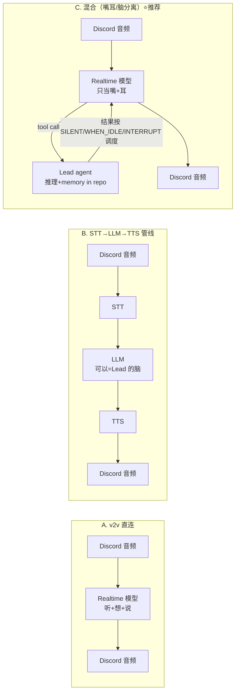

# FLY-883 Realtime voice-to-voice 技术选型 — 调研

Issue: FLY-883 (https://linear.app/geoforge3d/issue/FLY-883/researchvoice-realtime-voice-to-voice-技术选型-deep-research喂给-543-地基用)
日期: 2026-07-05
基于: 无

> **状态：完成（DR 已运行并回填）。** 本文档是给 Voice EPIC（FLY-542）内部 brainstorm 的
> **输入，不是终稿** —— 产品体验 brainstorm（PM 侧）之后才定实施。证据底座 = ChatGPT
> Deep Research（2026-07-05 运行，9 分钟，25 citations，488 searches，报告原文 + 19 个
> 解析引用 URL 归档于同文件夹 **dr-report.md**；prompt 见 **dr-prompt.md**）。下文数字
> 均带日期，时效敏感（价格/模型名/session 限制随时会变，实施前复核 dr-report.md 引用）。

## 1. 摘要（TL;DR）

FLY-543 要做全 Lead 共用、**可插拔 realtime 后端**的 voice skill。本调研回答「realtime
voice-to-voice 怎么做最优」。结论：

- **架构：混合模式**（FLY-542 方案 C）—— realtime 语音模型当嘴/耳（听、说、VAD、打断），
  实质推理经 **tool call 回我们自己的 Claude Lead agent**（脑留在 repo）。这是 OpenAI/
  Google 双方 2026 年都在优化的形态，与 542 已定决定严丝合缝。
- **默认托管后端：Google Gemini Live API**（native-audio 线），**OpenAI Realtime 作为
  第一备选后端同步实现**。裁决依据（按我们的权重）：Gemini 在多语言/句内切换的官方定位
  最强、异步工具调用的文档化调度模型（SILENT/WHEN_IDLE/INTERRUPT）几乎为「嘴耳+外部脑」
  量身定做、成本约为 OpenAI 的 1/4（~$10 vs ~$43/月 @ 每天 2×15 分钟）。代价：Live 连接
  短命（~10 分钟）需要会话恢复/压缩工程。
- **本地 CosyVoice 栈**：不当默认，作为**隐私 / per-Lead 独立声线（FLY-547）/ 中文极限
  优化**的战略后备路径 —— 中文向证据反而是三者最强（SenseVoice 中文/粤语优势 +
  CosyVoice 3 zh↔en 克隆），但工程/运维负担实质更高。
- **最大的诚实盲区**：三家都**没有公开的中英混说（zh-en code-switching）benchmark**。
  最终拍板前应该用 Annie 真实说话风格**自建一个小 eval set** 实测（给 543 的行动项）。
- **Discord 集成的真风险在传输层不在 AI 厂商**：audio receive 官方不文档化 + **2026-03
  起 DAVE 端到端加密强制**（bot 必须支持）。

## 2. 研究问题与方法

| # | 问题 | 出口 |
|---|------|------|
| Q1 | 三后端逐项对比（延迟/成本/音质/中英混说/**工具调用**/私有化） | §5 对比表 |
| Q2 | v2v 直连 vs STT→LLM→TTS 管线的延迟/灵活度取舍 | §6 架构 |
| Q3 | Discord bot 进语音频道收麦/播音的现成方案 | §7（喂 FLY-544） |
| Q4 | XHS 参考（FLY-435/342/344）可复用做法 | §4 提炼 |
| Q5 | 结论服务 FLY-212 离屏终态 | §8 选型建议 |

方法：①离线审计（现有资产 + XHS 提炼）；②ChatGPT Deep Research（Annie 指定，
deep-research skill via claude-in-chrome，ChatGPT Pro 账号）拿带引用的时效性证据；
③整合成本文。**维度权重（Annie 诉求 + FLY-344 社区信号）**：
中英混说质量 > 工具调用可靠性 > 端到端延迟 > 成本 > 私有化。

## 3. 现有资产审计（别把已有的当从零设计）

- **v0.4-voice-interface.md**（2026-03-05，GEO-150 exploration）：当时按
  STT→LLM→TTS 管线 + 状态机设计。**仍然有效**：push/pull 两种交互模式、Decision Layer
  决策类型→语音行为映射、风险清单（STT 误识别 → 误 approve，需二次确认）、"Voice 是
  并行通道不替代文字、决策同步回文字留 audit trail"。**已过时**：技术选型表 —— realtime
  v2v API 当时未纳入，本调研已补齐。
- **FLY-542 已定设计决定**（直接约束本选型）：① voice = model-agnostic 可插拔 skill；
  ② 不拆 bot 身份（同 bot 挂 voice 子系统）；③ 独立 voice-bridge 进程（低延迟 runtime
  与文字 agent loop 分离，FLY-544）；④ 独立声线 = Phase 2（FLY-547）；⑤ **推理 +
  memory/context 照旧在 repo**。—— §8 的混合架构推荐正是 ⑤ 的直接落地。
- **周边依赖**：FLY-548 结论落地 pipeline 需要 transcript → 三后端都能出 transcript
  （Gemini 注意：native-audio 直接输出仅 AUDIO 模态，文字走 output audio transcription）；
  per-Lead bot token 基建已有（GEO-252）。

## 4. XHS 参考提炼（research 输入，非 build 清单）

| 来源 | 展示了什么 | 对本选型的可复用做法 |
|------|-----------|---------------------|
| **FLY-435**（实测阿里本地 CosyVoice 300m） | 局域网自建语音系统：Openclaw agent 框架 + 本地 CosyVoice TTS 自动播报，300m 小模型自然度已「最满意」 | ① 本地 TTS 可行性实证，与 DR 结论互证（CosyVoice 系音质/克隆是本地栈最大卖点）；② **agent 框架与语音服务解耦**（服务化、远程调用）→ 佐证独立 voice-bridge + 可插拔后端设计；③ 高质量语音输出显著拉升满意度 → 音质不能为省成本牺牲太多 |
| **FLY-342**（车机外置 mic 语音 Agent，Harmony + TTS） | 真实需求：旅行/碎片时间用外置 mic 控制 agent；作者点名 Harmony 格式 + TTS 架构有启发 | ① FLY-212「离屏顺畅工作」同款实证；② **结构化对话格式 + TTS** → voice loop 里工具调用要走结构化 schema（与 §6 混合架构的 tool-call 面一致）；③ 多 agent 语音交接是社区共同关注 |
| **FLY-344**（250 块键盘改 vibe coding 语音输入，👍27.2K） | 低成本硬件改造成语音输入工具，全场最火 | ① 语音入口硬件门槛可以极低；② **社区最高频追问 = 中英混说识别准确率** → 印证第一权重，且与 DR 的「无公开 zh-en benchmark、须自建 eval」结论呼应；③ 0 元平替说明 STT 单点很轻，难的是端到端对话体验 |

共同信号：**中英混说是这类工具的核心痛点**；**解耦/服务化的语音层**是社区验证过的方向；
语音质量直接决定「愿不愿意一直用」。

## 5. 后端对比（Q1）— DR 定稿

> 数字截至 2026-07-05（DR 运行日），细节与引用见 dr-report.md。

| 维度 | A. OpenAI Realtime API | B. Gemini Live API ⭐推荐默认 | C. 本地 CosyVoice 栈 |
|------|------------------------|------------------------------|---------------------|
| 现役模型 | gpt-realtime（GA 2025-08-28）；GPT-Realtime-2 / -Translate / -Whisper（2026-05-07） | gemini-live-2.5-flash-native-audio；gemini-3.1-flash-live-preview（2026-03-26，低延迟线） | 组合栈：ASR=SenseVoice/FunASR（或 Whisper 系）+ 脑=Claude agent + TTS=CosyVoice 3（2025-05-23 论文）或 2 |
| 延迟/打断 | 文档化打断语义最强（VAD 检测到新语音自动 cancel + 客户端截断未播音频）；社区实测 WebRTC ~500ms API 首字节，理想 ~800ms 全程 | 支持打断；官方建议音频分块 500–800ms（服务端默认 ~800ms）；3.1 Flash Live 宣称延迟改进但无一手 P50 数字 | 组件级可以很快（SenseVoice <80ms 识别；CosyVoice 2 流式「最小响应延迟」），端到端取决于全链路调优，无可复现的 Mac 全栈 benchmark |
| 成本（2×15min/天 ≈ 900min/月） | $32/1M 音频输入 token + $64/1M 输出（入 1 token/100ms，出 1 token/50ms）→ 50/50 对话 ~$0.048/min ≈ **~$43/月**（全双工上限 ~$86） | $0.005/min 输入 + $0.018/min 输出（3.1 flash live preview 价）→ 50/50 ~$0.0115/min ≈ **~$10/月**（上限 ~$21）——**约 OpenAI 的 1/4** | 无 API 账单，代价=工程+硬件。FunASR CPU 可跑（macOS 支持）、SenseVoice 有 macOS arm64（sherpa-onnx）；M 系列 64–128GB **可行**，但 CosyVoice 的 Apple Silicon 文档薄，Linux/CUDA 仍是低风险路径 |
| 音质/声线 | 10 个内置声线（推荐 marin/cedar），预置声线策略=防冒充，**无一手声线克隆** | native audio 主打自然度/情绪/节奏；**未验证一手克隆能力** | **最大优势**：zero-shot 多语言 TTS + 跨语言声线克隆 + 表现力控制 → FLY-547 per-Lead 声线的最清晰路径 |
| 中英混说 | 官方宣称句中切换语言 + 中文字母数字序列改进；**无公开 zh-en benchmark** | 官方宣称对话中自然切换语言、免预配置多语言；第三方 benchmark 显示 Gemini 3 Flash 在**欧洲语对**码切 ASR 顶级；**无公开 zh-en benchmark** | **中文向证据三者最强**：SenseVoice 中文/粤语识别显著优势；CosyVoice 3 zh↔en 跨语言克隆 WER 较 2 代改善。但同样不等于句内混说实测 |
| 工具调用（voice 里触发 action） | 原生支持，2025/2026 更新后长时异步 function call 不打断会话流 + 支持远程 MCP；调度细节文档不如 Google 显式 | **本项最强**：function call 默认全非阻塞，模型边听边说边等工具；工具结果可调度为 SILENT / WHEN_IDLE / INTERRUPT —— 为「语音壳+外部脑」量身定做 | 工具调用在自己的 agent 层（天然「脑在 repo」），但语音侧填充语/打断智能要自己造 |
| transcript | 同会话可同时出音频+文字 | 有，但 native audio 直接输出仅 AUDIO 模态 → 文字走 output audio transcription | 天然有（ASR 输出即 transcript） |
| 私有化 | 云；API 数据默认不训练、/v1/realtime 默认 30 天滥用监控保留，可申请 ZDR | 云；付费 API 默认不用于改进产品，有 ZDR；注意 Live session resumption 状态最多存 24h、搜索 grounding 存 30 天 | **唯一全本地**，音频可不出机 |
| Node/Discord 摩擦 | JS 文档好，WebRTC/WS/SIP；有现成 OSS Discord 桥 | JS SDK；输入 16kHz PCM（可重采样）/输出 24kHz PCM；有现成 Node Discord 桥 | Python-first → 实用解=Python 微服务/本地 OpenAI 兼容 server + Node bot |
| 运维 | **单会话 60 分钟**上限，托管可靠性文档最好 | **连接 ~10 分钟 / 纯音频会话 15 分钟**，靠 session resumption + context compression 续命 → 需要桥接层重连工程 | 全归自己（进程监督/预热/内存/升级） |

**表格结论**：按我们的权重（混说 > 工具调用 > 延迟 > 成本 > 私有化）→ **Gemini Live 当
默认**；重视会话耐久与实现简单 → OpenAI 更稳（作第一备选同步实现）；重视隐私/声线 →
CosyVoice 栈是长期后备。

## 6. 架构：v2v 直连 vs 管线 vs 混合（Q2）— DR 定稿

三种形态（对应 FLY-542 的 A/B/C）：

- **A 直连**：闲聊延迟最低、韵律/插话最自然，但公司逻辑/memory/审批变成二等公民 ——
  与我们「voice 里要触发高价值 action」的需求不符。
- **B 管线**：控制力/可观测性/隐私最强、Claude 是唯一决策者，但要自己做全链路流式 +
  填充语 + 打断，否则对话质感掉档 → 适合当**后备架构与本地/隐私形态**，不适合当默认。
- **C 混合（推荐）**：语音模型管听说/VAD/打断/轻量回合管理，实质工作经 tool 调回我们的
  Claude agent。这正是两家厂商 2026 年共同优化的方向（OpenAI：preamble/并行工具/恢复
  行为；Google：全非阻塞工具 + 结果调度策略）。四个具体优点：①Claude session +
  memory 仍是唯一事实源；②语音模型只干它独有的快回合管理；③transcript 与工具动作天然
  是一等记录（喂 FLY-548）；④厂商风险被局部化 —— 换语音壳不用重造公司系统（=可插拔
  接口的意义）。

## 7. Discord voice 集成（Q3，喂 FLY-544）— DR 定稿

**真风险在 Discord 传输层，不在 AI 后端**：

- **收麦**：@discordjs/voice 明文警告 audio receive 不被 Discord 官方文档化（能用、有
  多年生产实践，但要给它单独的可靠性预算）。
- **⚠️ DAVE（2026 特有）**：Discord 已推行语音端到端加密，**2026-03 过渡期后不支持
  DAVE 的客户端/应用无法参与通话**；@discordjs/voice 现以 @snazzah/davey 为受支持的
  DAVE 库（已预装）。FLY-544 实施必须按 DAVE 基线做。
- **音频路径**：Discord 48kHz Opus 收 → 解码 PCM → 本地 VAD/说话门控 → 送后端
  （Gemini：16-bit PCM，输入 16kHz 可重采样、输出 24kHz；OpenAI：24kHz PCM16）→
  后端 PCM 出 → 重采样 + Opus 编码 → 播回频道。
- **现成 OSS 参考**（成熟度=示例级，非久经沙场）：
  - hihumanzone/Gemini-Live-discord —— **最贴我们形态**：Node、多用户混音、Discord
    Opus↔Gemini PCM、低延迟 VAD、本地打断门控、有界重连；
  - Emmanuek5/openai-realtime-discordbot —— TS/Bun 小型桥，带 function calling；
  - dtinth/discord-transcriber —— Node 收音 + VAD + 48kHz→16kHz 预处理（transcript
    优先形态参考）。
- **政策**：未发现明文禁止 bot 录音，但 Discord Developer ToS 要求清晰的隐私政策、
  数据删除响应、最小保留 —— 做录音/转写必须披露 + 提供删除 + 按当地法律取得同意。

## 8. 给 543 地基的选型建议（Q4+Q5）— 定稿

**默认后端 = Gemini Live；第一备选 = OpenAI Realtime（接口层第一天就实现两个）；
CosyVoice 本地栈留在路线图**（隐私 / FLY-547 独立声线 / 中文极限优化的逃生舱）。
Gemini 便宜到可以常开（~$10/月），OpenAI 兜底会话耐久性与实现简单性。

**可插拔接口必须抽象**（DR 版清单，直接给 543 定接口用）：
- 音频格式协商（采样率/编码，桥接 Discord 48kHz Opus）；
- 流式输入/输出帧；
- turn/VAD 事件：speech-started / speech-stopped / response-started / response-cancelled；
- **打断语义**（显式 truncate/clear 未播内容 —— OpenAI 语义可直接借鉴）；
- tool call 事件 + 工具结果回注（含调度策略位：SILENT/WHEN_IDLE/INTERRUPT，非 Gemini
  后端可降级）；
- transcript 事件（partial/final × user/assistant）；
- 声线/persona 选择（FLY-547 预留；capability flag：supportsCloning）；
- 会话生命周期：connect/disconnect/**resume**（Gemini 10/15 分钟限制的重连续命就藏在
  这里）+ 各后端 session 上限声明。
做干净了，OpenAI / Gemini / 本地管线三种后端共享同一个 Discord adapter 和 agent 工具面。

**推荐默认（Gemini）的风险清单**：
1. **会话管理复杂度**：~10 分钟连接 / 15 分钟纯音频 → resumption + compression 工程
   （选它的最大代价，FLY-543/544 要把重连做成一等公民）；
2. **preview 波动**：Live 系 SKU 命名/价格在 Cloud 与 Gemini API 两边已有不一致，GA
   前有变动风险；
3. **zh-en 混说未定**：官方多语言宣称好，但无公开 zh-en benchmark —— **行动项：543
   动工前用 Annie 真实说话风格自建 ~20 句混说 eval set，Gemini/OpenAI 各跑一遍实测
   定最终默认**（这也是 DR 报告自己承认的最大盲区）;
4. **Discord receive/DAVE 脆弱性**：与后端选型无关，FLY-544 单独扛。

**服务 FLY-212**：混合架构 + Gemini 默认满足「随时开口、亚秒级响应、语音里直接触发
action、聊完有 transcript 落 Linear（548）」——离屏工作的顺畅度由延迟 + 工具调用可靠性
决定，两项都是本推荐的强项；成本低到可以「常开不心疼」，这对「敢离开屏幕」同样关键。

**DR 承认的未验证项**（如实转告，勿当定论）：① 无公开 zh-en 混说 benchmark（三家都是）；
② 无同口径的 OpenAI vs Google 首音延迟 P50/P90 一手数据（OpenAI 数字是社区实测）；
③ 两家托管 API 的一手声线克隆能力均未验证（本地栈是声线定制最清晰路径）。

## 9. DR 执行记录

- [x] Lead 确认 FLY-882 释放 Chrome（2026-07-05 上午；期间一度因账号是 Free 计划 hold，
      Annie 连入 Pro 账号后放行）
- [x] Chrome 独占自检（恰 1 浏览器；LEARN-212 QA 闲置且无 chrome 调用）
- [x] DR 运行：2026-07-05，**9 分钟，25 citations，488 searches**，ChatGPT **Pro** 账号；
      会话 https://chatgpt.com/c/6a4a999f-f150-83e8-98de-6cb76b9cf6b8
- [x] 导出：Copy contents（sentinel 校验）+ Export to Word（引用 URL 解析）→
      assemble_report.py → **dr-report.md**（原文 + 19 个解析 URL，归档本文件夹）
- [x] 回填本文档 §5–§8 并定稿
