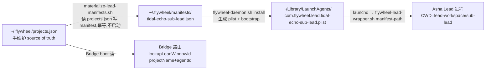

# FLY-886 projects.json 编排层折干净：Sub 并入 tidal-echo — 调研

Issue: FLY-886 (https://linear.app/geoforge3d/issue/FLY-886/org722-收尾-projectsjson-编排层折干净-删独立-sub-projectasha-挂-tidal-echo-下终态sub)
日期: 2026-07-05
基于: exploration.md

本文回答 exploration 留下的机制问题 + Lead 4 条指令（53875520 / f9f8ea8d / 292bc64a / 2172f8af）要求的核实项。所有结论均实机验证。

> **勘误（superseded by plan.md，Codex design review R1/R2 修正）**：
> ① §2 提到的 `materialize-lead-manifests.sh` **不适用于本次 Asha 换轨** —— 它把 `.workspace` 写成 project dir，会丢掉 Asha 的隔离 lead-workspace；plan §4 改用旧 manifest jq 定向变换。
> ② §6 设想的 `agent_file: sub/.flywheel/...` **不合法** —— ConfigLoader 要求 agent_file 落 `.flywheel/agents/<dept>/` 且与 `department:` 一致；plan §3.1 改为复制到 `.flywheel/agents/content/sub-content-executor.md`。
> ③ 本文未覆盖的两个后续发现：Lead identity 必须随 projectDir 落 root `.lead/sub-lead/identity.md`（否则 daemon fail-fast）+ AgentDispatcher 按 YAML 顺序首匹配（sub-content 必须排前）—— 见 plan §3.1/§3.3。

## 1. projects.json 的 source-of-truth（Lead 指令 53875520 要求先读清）

**结论：`~/.flywheel/projects.json` 是 runtime 手维护、机器本地文件，无 repo 生成源。**

证据：
- `scripts/setup-new-project.sh:8` 自述 "The BACK half (Discord bots, live ~/.flywheel/projects.json, ...)"，`:416` 指示人工 "Edit live ~/.flywheel/projects.json — add the ${PROJECT} entry"。
- 两个 repo 的 `.flywheel/config.yaml` 也注明 "Lead/Discord routing lives in ~/.flywheel/projects.json (machine-local)"。
- repo 内唯一的 projects.json 是 `fleet/example/projects.json`（示例，非源）。

→ 按 Lead 指令：**精确 diff 备好 + 写清 apply 方式，不 apply**。（tidal-echo repo 侧的 config.yaml 融合则有 repo 源 → 走正常 PR。）

## 2. 从 projects.json 到运行中 Lead 的派生链（官方工具全齐，无需手写 manifest/plist）

- **`scripts/materialize-lead-manifests.sh`**（FLY-650）：读 projects.json，为每个 lead 写 `<projectName>-<agentId>.json` manifest；shape 与 claude-lead.sh 自写的逐字段一致（缺 runtime-only `pid`）；model / leadBackend 从 projects.json 带过（`claude-opus-4-8[1m]` 会带上）；**create-if-absent 幂等**（新 key `tidal-echo-sub-lead` 不存在 → 会创建；旧 `sub-sub-lead` 是活 manifest 不会被碰）。
- **`scripts/flywheel-daemon.sh`**：`install <exact-key>` 生成 plist + bootstrap；`uninstall <exact-key>` bootout + 删 plist；`restart` = kickstart -k。lead-id 可用全 key `tidal-echo-sub-lead` 消歧。
- **manifest workspace 字段**按 leadId 派生（`~/.flywheel/lead-workspace/${LEAD_ID}`）→ agentId 保留 `sub-lead` 则 Asha 的 workspace（vault 等）零迁移。
- 校验命令（实测可用）：
  `node --input-type=module -e "import {loadProjects} from '<flywheel>/packages/teamlead/dist/ProjectConfig.js'; loadProjects(); console.log('OK')"`
  （loadProjects 校验：duplicate projectName、exact-key 冲突、SAFE_ID、每 lead 必填字段、model 控制字符等 —— ProjectConfig.ts:288-520。）

## 3. 一致性约束：Bridge 与 Asha 必须同窗口换（identity 分裂风险）

- Bridge 按 `(projectName, agentId)` 找 Lead 的 cmux window（plugin.ts:447 `lookupLeadWindowId(projectName, lead.agentId)`）；CommDB runtime 要求 leadId + projectName（plugin.ts:402-411）。
- Lead 进程的 projectName 来自 manifest（boot 时读）。
- → 若 Bridge 已读新 projects.json（Asha ∈ tidal-echo）而 Asha 进程还带旧 manifest（projectName=sub），路由/window 查找 identity 分裂。**apply 顺序必须**：projects.json 落盘 → manifest 物化 → 旧 label bootout / 新 label bootstrap（Asha 以新 identity 起）→ Bridge 重启。全部在同一个激活窗口（早上，founder 在场）。

## 4. REPORT_CHANNEL 不变量（Lead 指令 f9f8ea8d / 292bc64a / 2172f8af + Cass drop-in）

**不变量：`REPORT_CHANNEL` == 某个已注册 generalChannel**，否则 Asha 夜报（顶层帖带 LEARN issue ID）被 FLY-152/162 reply-guard 静默拒。

实机核实：
- 现状：`~/Dev/sub/content/scripts/sub-create-nightly-tick.sh:67` 与 `sub-daily-loop-tick.sh:67` 都是 `REPORT_CHANNEL="1511267947551653918"`（#sub，= sub project 现注册的 generalChannel）。
- sub block 删除后，`1511267947551653918` 的 generalChannel **注册随条目消失** → 它不能再当夜报落点（#sub-core 作为 core 落点下线）。该 ID 继续作为 Asha 的 chatChannel/alertChannel 存在（issue 明确保留，频道已在 tidal-echo 分类下）。
- **落点已由 Lead 拍板：`1517041708855197908` = #tidal-echo-core** = tidal-echo 注册的 generalChannel。我 cross-check 过 projects.json：tidal-echo 的 `generalChannel` 字段确实 = `1517041708855197908`（Cass 验证一致）✓。Ariel 自己的工作流在 #tidal-echo-content（1517041986358611998），不冲突。
- **无需新建频道、无需新增 generalChannel 注册。**
- cron 内 REPORT_CHANNEL 的改动属 FLY-876 scope → 本 issue 在 PR/diff 摘要里**显式列出对齐项**：876 须把两个 tick 脚本的 REPORT_CHANNEL 改为 `1517041708855197908`，与 886 同早上窗口 merge。

## 5. FLY-876 家族全量盘点（同步给 876 的新发现）

指向 `~/Dev/sub` 的 launchd plist 共 **6 个**（issue/876 文本只列了 2 个）：

| plist | tick 脚本 | 触发 |
|---|---|---|
| com.flywheel.sub-create-nightly | ~/Dev/sub/content/scripts/sub-create-nightly-tick.sh | 周一–五 1:00 |
| com.flywheel.sub-daily-loop | ~/Dev/sub/content/scripts/sub-daily-loop-tick.sh | 每日 3:07 |
| com.flywheel.growth-improve | ~/Dev/sub/content/scripts/growth-improve-tick.sh | （growth 家族） |
| com.flywheel.growth-learn | ~/Dev/sub/content/scripts/growth-learn-tick.sh | 〃 |
| com.flywheel.growth-report | ~/Dev/sub/content/scripts/growth-report-tick.sh | 〃 |
| com.flywheel.growth-retro | ~/Dev/sub/content/scripts/growth-retro-tick.sh | 〃 |

→ `~/Dev/sub` 在 6 个全部重指完成前不能失效/archived；876 漏 4 个 growth = 静默断。（growth 脚本落在 sub 树是历史遗留；重指目标同为 `~/Dev/tidal-echo/sub/content/scripts/`，具体由 876 确认。）

## 6. tidal-echo repo 侧融合（brainstorm gate Q1 = 方案 A，Lead 已拍）

- origin/main root `.flywheel/config.yaml` 的 `agents:` 只有 `content`（labels `["content"]`，Ariel 的 executor）；sub 的 runner 侧配置只作为快照在 `sub/.flywheel/`，Blueprint 不读子目录。
- 待融合内容（来自 `~/Dev/sub/.flywheel/config.yaml`，与合并树 `origin/main:sub/.flywheel/config.yaml` 同源）：
  - agents 匹配表：`["affirmation","pack","copy","publishing","research","audio","肯定语","文案","调研"]` + agent_file `content-executor.md`；
  - executor 协议里的 style-lint（`content/scripts/style-lint.sh`，合并树内路径为 `sub/content/scripts/style-lint.sh`）与 audio_preview 门（`gate audio_preview --lead sub-lead`，agentId 保留则命令继续有效）。
- **key 冲突**：sub 的 agent key 也叫 `content`，与 tidal-echo 的 `content`（Ariel）冲突 → 融合时改 key 为 `sub-content`，并把 `Sub` 加进匹配 labels（只带 `Sub` 标签、不带内容类标签的 issue 也能命中 sub executor，而不是落到 `default_agent`=Ariel）。
- `default_agent: content` 保持不变（tidal-echo 泛内容仍归 Ariel executor）。
- agent_file 落点：指向合并树内的 sub executor（`sub/.flywheel/agents/content-executor.md`）。`.flywheel/config.yaml` 的 agent_file 是相对 projectRoot 的路径，指向子目录无机制限制（tidal-echo 自己用 `.flywheel/agents/content/content-executor.md` 也是相对路径）。
- ⚠️ sub 的 executor 文件内部若写死 `content/scripts/...` 相对路径（style-lint 等），在 tidal-echo worktree 里实际位置是 `sub/content/scripts/...` → **融合 PR 需要一次窄幅路径 sweep**（只动 executor/agent 文档中的路径引用，不动 sub/ 快照本身；具体条目 implement 时逐个 grep 定位）。
- 本地 `~/Dev/tidal-echo/.flywheel/config.yaml` 有未提交改动（`roles.runner: model/effort/backend`，机器本地运营改）：与 origin/main 无冲突（722 PR 未碰该文件），`git pull --ff-only` 不受影响；但融合 PR 基于 origin/main 内容写，**不吸收**这个未提交本地改动（它是否入 repo 由 Lead 另定，不属本 issue）。

## 7. 其余核实点（安全/边界）

- **StateStore 历史**：project=sub 的历史 session 行保留只读历史，无迁移需求；激活窗口前需 drain check（无 active/awaiting sub session）。
- **Lead 侧全部按 leadId 键的资产**（gate 路由 `--lead sub-lead`、`.inbox-ready-sub-lead`、mem0 bucket、lead-workspace）在 agentId 保留下零迁移。
- **DepartmentRegistry**：折后三 lead labels（Tidal-Echo-Triage / Tidal-Echo / Sub）互不相交；同带 `Sub`+`Tidal-Echo` 双标签 → `"multiple"` → runs-route 拒（既有语义，QA 记边界用例）。
- **memoryAllowedUsers**：tidal-echo 并入 `"sub-lead"`、`"sub"`（Asha 记忆桶 + 历史项目桶读取权）。
- **Linear 侧**：`team_id`（LEARN vs TIDE）非 runtime ingestion filter；路由真相 = issue label `Sub` + run-start gate → 折后在 tidal-echo 下唯一命中 Asha。Sub 的 Linear issue 无需迁移 team。
- **tidal-echo 本地 clone**：HEAD b3d0632 落后 origin/main（b27229c = 722 merge）。`git pull --ff-only` 前置（gate Q2 已批：确认真 ff，有 divergence 停下上报）。
- **激活=批量 Bridge 重启**：Annie 纪律攒批；由 team-lead 排窗口。本 issue 一切改动 **park 不激活**（Lead 指令 53875520：绝不 bootout/swap launchd、绝不重启 Bridge，早上 founder merge 后同窗口做）。
