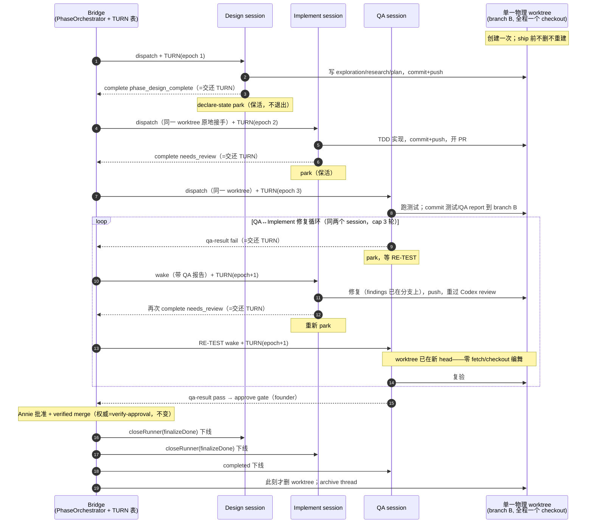

# FLY-887 三段式 phase-session 并存保活 — 探索

Issue: FLY-887 (https://linear.app/geoforge3d/issue/FLY-887/pipeline-三段式-phase-session-并存保活-designimplementqa-不跑完就关qaimplement)
日期: 2026-07-05
基于: 无

## 1. 问题与设计本意

Annie 原话（2026-07-05 06:48）：

> 设计、实现、QA 的窗口**不应该跑完就关**，特别是实现和 QA。因为实现做完 QA 可能测出问题 → 实现再改 → 再给 QA 跑，**循环往复好几轮直到修好**。实现跑完就关了，QA 发现问题就得**重开一个实现来改，既费 token 又丢 context，根本不是我设计的本意。**

要求的运行时行为（六条，逐字为规格）：

1. 设计阶段：只有设计 session 在。
2. 开始实现：实现 session 上线，**设计 session 不下线**。
3. 开始 QA：QA session 上线，**设计 + 实现 session 同时都在**。
4. QA↔实现修复循环：QA 报 bug → 实现（活着、带全部 context）改 → QA 复验 → 循环直到过。**不重开、不丢 context、不费 token。**
5. **只在 Annie 说「可以 ship」后**，design/implement/QA 三个才各自 ship/cleanup → 下线 → archive thread。
6. **禁止「同一时间只有一个 session」。**

活证据（FLY-871 R2/R3，2026-07-04 当晚）：implement 做完即被关 → QA 独立验出真 bug（feature-flags-drift）→ 修复时 implement 已死 → 只能重派一个 implement-fix session（= 费 token + 丢 context）。

## 2. 现状审计（代码级事实）

### 2.1 三段式今天是「串行交接、交接即关」

`packages/teamlead/src/bridge/phase-orchestrator.ts`（FLY-793 + FLY-859）：

- **Design→Implement / Implement→QA 交接**（`handoff()`）：capture head SHA → **`closePhaseRunner(prev)`**（经 close-runner `finalizeDone` → FSM 转 `completed` → kill tmux window + Terminal tab + 删 CommDB session row）→ dispatch 下一段（`shareParentBranch: true` + `startPoint = head`）。
- **QA FAIL 修复循环**（`runFailFlow()`）：capture head → **close QA runner** → **dispatch 全新 Implement-fix session**（`phaseFixContext {round, qaSummary}`，round cap 默认 3）。fix 完成 `needs_review` → 再走 Implement→QA 交接 → **又 spawn 一个全新 QA**。
- 即：**每一轮修复烧掉一个新 Implement session + 一个新 QA session 的全量 onboard/上下文重建** —— 正是 Annie 痛点。
- Blueprint 三段式 QA prompt（`Blueprint.ts:944`）明文写着「Do NOT park for retest (that is the separate auto-QA protocol)」——保活在三段式路径里被显式排除过。

### 2.2 worktree：三段共享一个 key，但每次 dispatch 都会拆掉重建

- `WorktreeManager.resolveWorktreeKey()`：`shareParentBranch` → 三个 phase 派生**同一个** worktree key（= issue 的 main key）→ 同一 branch B、同一目录（如 `~/Dev/flywheel-FLY-887`）。
- `Blueprint.runInner()`（`Blueprint.ts:720-733`）：**每次 dispatch 无条件 `removeIfExists()` + `create()`** —— 上一段的 worktree 目录被删除并在 `startPoint` 重建。
- 今天这是安全的（前段进程已被 kill）；**保活后这是致命的**（parked session 的 cwd 会被从脚下抽走）。这是保活方案必须改的第一结构点。
- `runs-route.ts:560-571` 已有守卫：issue 有活跃三段 phase 时拒绝新的 main dispatch（理由正是 removeIfExists 会拆共享 worktree）。

### 2.3 现成先例：auto-QA（FLY-752）已经跑通了「park + wake」这套循环

单 session pipeline 的 auto-QA 路径（`auto-qa-coordinator.ts` + `auto-qa-effects.ts`）：

- QA FAIL → **wake 实现者 main runner**（mailbox `sendRunnerWake`，带 QA report）——因为单 session 路径里 main runner 停在 `awaiting_review` 活着等 wake（FLY-191）。
- QA 自己 **`declare-state park`**（释放 Chrome、/compact）→ 停着等 RE-TEST。
- 实现修完 push 新 head → `retestWakeQa`：**alive → wake 复验；dead → re-spawn 兜底**。同一 QA session 循环到 PASS。
- 即：**Annie 要的循环形态在 auto-QA 里已经完整存在，FLY-887 的本质是把它移植进三段式**（issue 里也点名了这条路）。

### 2.4 park 基建（FLY-626）已就绪

`flywheel-comm declare-state park`：CommDB `runner_declared_states` 持久标记（活过 Bridge 重启）；watchdog 完全抑制 stall wake；orphan/tmux liveness 收割保持（死掉的 parked runner 仍被收）；Lead/founder 一条 `flywheel-comm send` 即清标记恢复监控。`runs-route.ts:314` 的守卫文案已经在引导「parked-alive → 用 send 再唤醒，别重开」。

### 2.5 ship 后收尾机制已存在

- close-runner `FINALIZE_DONE_SOURCE_STATES` 已含 `design_done` / `awaiting_review` / `running` / `approved_to_ship` → `finalizeDone` 可把停在这些态的 done-but-alive session 转 `completed` 再关（FSM 边已合法）。
- FLY-855/FLY-793：post-ship finalization 按 CommDB 注册关掉 phase windows + FLY-369 archive cascade。**收尾骨架在，只是今天交接时就把人关光了，轮不到它关活人。**

### 2.6 gap 对照表

| Annie 规格 | 现状 | gap |
|---|---|---|
| 1. 设计阶段只有设计 session | ✅ 一样 | 无 |
| 2. 实现上线，设计不下线 | ❌ 交接即 close 设计 | handoff 改 park |
| 3. QA 上线，设计+实现都在 | ❌ 交接即 close 实现 | handoff 改 park |
| 4. QA↔实现活体循环 | ❌ close+respawn 两头烧 | FAIL→wake implement；fix→wake QA retest |
| 5. ship 后统一收尾 | ⚠️ 机制在但无活人可收 | finalization 扩到活体 parked 三段 |
| 6. 禁止单 session 独存 | ❌ 结构上强制单 session | 上面四条的总和 |

## 3. 方案选项

### 方案 A（推荐）：park-and-keep-alive + 共享 worktree 原地复用 + wake-or-spawn

把 auto-QA 的 park/wake 模式移植进 PhaseOrchestrator：

- **交接不关人**：`handoff()` 的 `closePhaseRunner(prev)` 换成 park（prompt 让 runner 自己 `declare-state park` + STOP 不退出；Bridge 侧再 upsert park 标记做双保险——runner 忘了 park 也不会触发 stall watchdog 的高价 Lead wake）。
- **worktree 原地复用**：phase dispatch（`shareParentBranch`）检测到共享 worktree 已存在且有活体前段 → **跳过 removeIfExists+create**，校验（registered + clean + HEAD==startPoint）后直接以该目录为 cwd 起新 tmux window。校验失败 → fail-closed 告警（绝不静默拆活人目录）。前段已死 → 走现行 remove+create 路径（行为=今天，天然兜底）。
- **wake-or-spawn**：每个「起下一段」的决策点先查有没有活体 parked 同段 session：
  - QA FAIL → 活体 parked implement 在 → **wake 它**（带 QA summary，round 计数保留）；死了 → 现行 spawn implement-fix 兜底。
  - implement fix 完成再次 `needs_review` → 活体 parked QA 在 → **wake 复验**（RE-TEST，新 head）；死了 → 现行 spawn QA 兜底。
- **ship 统一收尾**：QA 过 founder ship gate、verified merge 后，finalization 对 issue 的**全部**三段活体 session 依次 `finalizeDone` close（design_done / awaiting_review 均已在 FINALIZE_DONE_SOURCE_STATES）→ 下线 → archive thread（既有 cascade）。
- 开关沿用 `pipeline.three_stage`（不加新配置面），行为变化只落在 three-stage 已启用的项目（当前仅 flywheel）。

优点：精确实现 Annie 六条；每处都有「死了就退回现行为」的兜底，失败模式=今天而不是更糟；复用 FLY-626/752/142 全部现成基建，不发明新机制。
缺点：并发活 session ×3 的内存占用；「同 worktree 多进程」把单写者不变量从结构保证（kill 前段）降为协议保证（park 纪律 + watchdog）。

### 方案 B（否决）：保持 close+spawn，交接时持久化「context 摘要」给下一轮 fix session

省内存，但 Annie 原话直接否定了这个形态（「重开一个实现来改…根本不是我设计的本意」），摘要也救不回真 context，且每轮仍烧全量 onboard token。不做。

### 方案 C（否决）：每 phase 独立 worktree + detach/attach 切换 branch B

三个 phase 各开 worktree，parked 段 detach HEAD 释放 branch B，激活时再 attach。规避了共享目录，但引入 3 倍磁盘 + git 状态编舞（detach/attach/pull 的时序错误面）+ 与现有 shared-key 设计全面冲突。复杂度买不来对应收益。不做。

## 4. 方案 A 关键设计决策

1. **park 的双保险**：runner 自 park（prompt 协议，沿用 FLY-752 文案形态：commit+push → complete → release 重资源 + /compact → declare-state park → STOP 不退出）＋ Bridge 在交接点 server-side upsert park 标记。任何一侧生效即不误报 stall。
2. **wake 通道**：mailbox `sendRunnerWake`（FLY-142/168 已修的 wake 链路），wake 消息里带角色化指令（implement: QA report + 修复要求；QA: 新 head + RE-TEST）。wake 成功即清 park 标记（FLY-626 re-engagement 语义，watchdog 恢复监控活跃段）。
3. **单写者不变量的新形态**：同一时刻只允许一个「激活段」写 worktree —— 由 park 协议 + wake 时序保证；orchestrator 在 wake A 前确认 B 已回到 parked/静默（QA FAIL 事件本身即 QA 停手的信号，implement 的 needs_review 完成即 implement 停手的信号——与今天 handoff 的触发条件一一对应，不需要新的同步原语）。
4. **状态机不加新状态**：design 停在 `design_done`、implement 停在 `awaiting_review`、QA FAIL 后停在 `running`（+ verdict intent 记录轮次）——全部是现存 FSM 态；「活着且 parked」由 CommDB declared-state 表达（正交于 FSM，FLY-626 既有设计），ship 收尾用既有 `finalizeDone` 边。**不改 FSM。**
5. **fix round cap 保留**（默认 3，含 wake 轮）：保活让每轮变便宜，但无限循环仍是故障形态，cap 到顶仍升级 Lead。
6. **崩溃/重启韧性**：park 标记持久（CommDB）；tmux 活体过 Bridge 重启（FLY-172 reconcile）；FLY-859 的 verdict-intent 两阶段持久化骨架保留，reconcile 的 stranded 扫描改为 wake-or-spawn 同款判定（活体在→adopt/wake，不双开）。

## 5. 风险与对策

| 风险 | 对策 |
|---|---|
| 内存：每个三段 issue 挂 3 个 claude 进程（FLY-751/753 教训） | park 前强制 /compact + 释放 Chrome（FLY-752 已有文案）；三段式本就 opt-in per-project（当前仅 flywheel）；FLY-751 已默认剥非-QA runner 的 chrome MCP |
| 双写者事故：parked 段被误唤醒/自行乱动，与激活段同时写 worktree | park 纪律 prompt 明文（wake 前不得动 worktree）；wake 消息才是唯一激活信号；橙区兜底=git 层 commit 冲突可见、fail-closed 告警 |
| dispatch 复用 worktree 校验失败（dirty / HEAD 漂移） | fail-closed：告警 Lead，绝不静默 remove 活人目录；Lead 决定杀谁 |
| parked 段真死了（crash/reboot） | HeartbeatService 照常收割死 parked runner；wake-or-spawn 的 spawn 兜底=现行为 |
| 长挂 `awaiting_review`/`design_done` 触发别的巡检误判（FLY-742 类 stale 检测、stuck 检测） | research 阶段逐一排查现有 watchdog/reconciler 对这三个态+park 标记的分类；FLY-878（park 态识别）是姊妹 issue，边界划清不重做 |
| Bridge 重启后 reconcile 双开 | stranded 扫描先查活体（getActiveImplementSession 模式已存在），adopt 优先 |

## 6. 假设清单（brainstorm gate 确认项）

- A1：**设计段保活到 ship** 按 Annie 规格逐字实现（即便 design 被 wake 的场景少，保活成本≈0 token，只有内存）。不擅自裁剪成「只保 implement/QA」。
- A2：QA FAIL→implement 的修复轮沿用 **round cap=3**（cap 到顶升级 Lead，Annie 决定），保活不改变 cap 语义。
- A3：**不改单 session pipeline / auto-QA 路径一个字节**——只动 three-stage 分支（`shareParentBranch`/phase role 门内），byte-compat 默认。
- A4：「Annie 说可以 ship」= 现有 **founder approve gate + verify-approval**（QA 段是 gate holder，FLY-869 纪律链不动）；本 issue 不新增 ship 授权面。
- A5：收尾顺序：verified merge → landing signal → QA `stage set completed` → finalization 关三段活体 + archive thread。三段各自的「ship/cleanup」不含额外仪式（design/implement 无独立 ship 动作）。
- A6：内存压力接受为已知代价（flywheel 单项目 opt-in），不在本 issue 做全局并发上限系统。

## 7. 结论

方案 A：把 FLY-752 auto-QA 已验证的 park/wake 循环移植进 FLY-793 三段式编排，交接由「关人重开」改为「park 保活 + wake-or-spawn」，worktree 由「每段重建」改为「活体原地复用（fail-closed 兜底回现行为）」，ship 后由既有 finalizeDone 链统一收尾。不改 FSM、不加新配置、不动单 session 路径。

---

## R2 修订（2026-07-05）：worktree 并发定案提案 — 🅱️ 单物理 worktree + TURN 轮流写

> 背景：Lead 初版给 Annie 的「可写 worktree 传递 + QA 只读 checkout」被 Annie 亲自纠正**收回**——设计和 QA 都要写分支（设计 commit 文档、QA commit test-report/补测试）。Annie 在 🅰️（各自子分支→汇聚）/ 🅱️（共享 worktree + 写锁轮流）里 steer 🅱️：🅰️ 的交叉 rebase 链是错误温床；关键洞察 = **三段大部分时候不同时干活 → 一个物理 worktree 就够**。技术落地交给本设计从现状代码定。

### R2.1 读代码后的结论：🅱️ 与现状高度合拍，比「QA 只读」更简单

- 现状三段本就共享**一个** worktree key/branch/目录（`resolveWorktreeKey`，research §1.3）——🅱️ = 把「kill 前段来腾地方」换成「不删不重建、轮流用」，目录结构零变化。
- git 硬约束（一条 branch 不能被两个 worktree 同时 checkout）在 🅱️ 下**天然不存在**：全程只有这一个 checkout。
- 修复循环零编舞：implement 在同一目录修完 commit，QA 被唤醒时 **worktree 已经在新 head**——不需要 fetch/re-checkout/re-pin（「QA 只读独立 checkout」模型反而需要每轮 re-pin）。
- QA 照旧 commit findings/failing tests/report 到 branch B（FLY-793 Step 8 的 writer 协议原样保留，Annie 2026-07-02 的决定不被推翻）。
- 代码没有任何强烈反对信号：唯一要新建的机制就是 TURN 记录本身。

### R2.2 写锁（TURN）机制设计

**一句话：turn-based 独占激活——PhaseOrchestrator 在它既有的交接决策点授予 TURN，CommDB 持久记录，phase 的既有完成/verdict 信号即释放；runner 写前自查作 belt，Bridge 对账回收作兜底。**

- **放在哪层（核心设计题的答案）**：**Bridge 侧 PhaseOrchestrator 交接点集中授予**。理由：交接点本来就是流水线唯一的状态权威（今天就是它决定谁 spawn/谁关），把 TURN 授予挂在同一决策点 = **零新增决策源**；runner 自协调当真相源会裂脑；纯强制层（hook 拦 git）过重。752 的 park/wake 里现成的「锁位」就是 wake 消息本身——wake = 授予，park = 交还，TURN 记录把这个隐式契约变成可查、可审计、可恢复的显式事实。
- **真相源**：CommDB 新表 `three_stage_turn (issue_id PK, holder_exec_id, phase, epoch, granted_at)`，**只有 Bridge 写**。选 CommDB 不选 StateStore：跨进程可读（runner 经 flywheel-comm 自查）、过 Bridge 重启（FLY-626 同款持久性）。
- **授予点**（全部是既有决策点，不新增事件）：dispatch design / handoff→implement / handoff→QA / FAIL→wake implement / fix 完→RE-TEST wake QA / founder 批准→ship wake QA。每次授予 epoch+1。
- **释放点**（全部是既有 durable 信号）：`complete --route phase_design_complete`、`complete --route needs_review`、`qa-result fail`、`qa-result pass`。orchestrator 处理这些事件时翻转 TURN；runner 侧 park 是协议层的同义交还。
- **锁的粒度**：TURN 管 worktree 的**全部触碰**（git 写 + 跑测试 + 改文件）。parked = 完全不碰 worktree（比「只锁 git 写」更粗但更简单可验——三段本就不同时干活，细粒度是 YAGNI）。
- **runner 自查 belt**：新 flywheel-comm 子命令 `turn --exec-id <id>`（读 CommDB，答 yours / not-yours + holder）。prompt 契约：凡不是被带 TURN 的 wake 叫醒（例如 Lead 出于别的原因 send 了一条消息），动 worktree 前必须 turn 自查；not-yours → 不写，只回话/报告。
- **退避（罕见并发）**：不设自旋等待。not-yours 的一方不写、答复来意后继续 park；若它确实需要写（极罕见），`flywheel-comm ask` 报 Lead 仲裁。写冲突的最终兜底是 git 本身（同分支冲突可见、可恢复）。
- **崩溃恢复**：holder 死体 → HeartbeatService 照常收割 → orchestrator 对账（reconcile）发现 TURN 指向死 session → 按流水线当前态重新授予（wake-or-spawn 同款判定）。授予是事件驱动非阻塞等待，**无死锁形态**。

### R2.3 权威图（单 worktree 三段轮流写 / QA 复验 / fix 循环 / ship 收尾）

图的不变量：任一时刻 **TURN 只指向一个 phase**（其余 parked、不碰 worktree）；worktree 生命周期 = issue 生命周期（创建一次、ship 后才删）；每一次 TURN 授予/交还都落在**已存在**的 pipeline 信号上，没有新事件类型。
