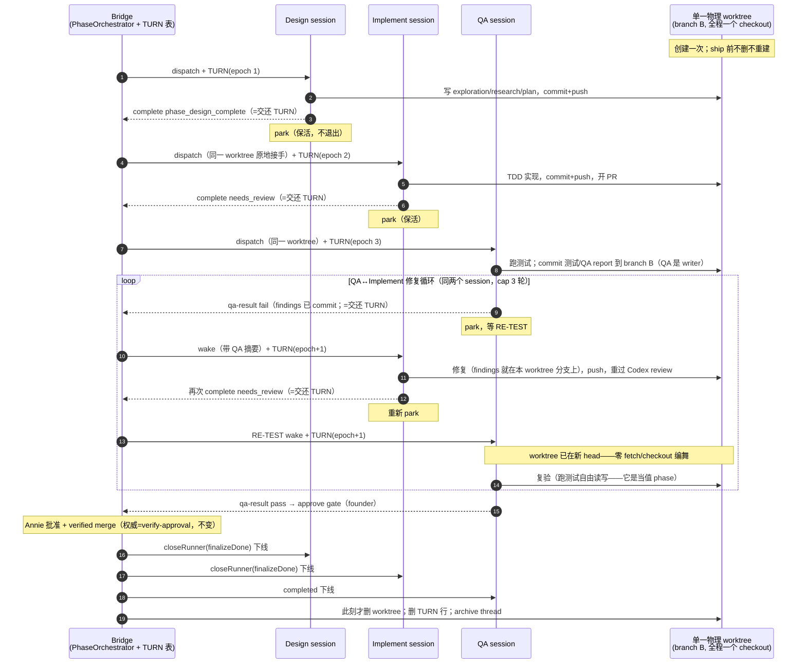

# FLY-887 三段式 phase-session 并存保活 — 实施计划

Issue: FLY-887 (https://linear.app/geoforge3d/issue/FLY-887/pipeline-三段式-phase-session-并存保活-designimplementqa-不跑完就关qaimplement)
日期: 2026-07-05
基于: research.md
版本: v1.58.0（暂定，ship 取空号）
修订: R2（按 Annie steer 全面换到 🅱️ 单物理 worktree + TURN 轮流写、三段全 writer；
R1 的「QA 只读 checkout」模型已随 Lead 收回作废。**Annie 已拍板 A5（接受 3 进程/issue
内存代价，/compact+释放 Chrome 缓解保留）——前提齐全，本 plan 进 Codex design review；
review 过后 Lead 拿图+大白话给 Annie 终 sanity-check。**）

## 定案（Lead brainstorm gate 已批 A1-A6；worktree 并发 = Annie steer 🅱️）

三段式交接从「关人重开」改为「**park 保活 + wake-or-spawn + TURN 轮流写**」：

- 每段完成后 **park 不退出**（runner 自 park + Bridge 侧标记双保险），三段并存到 ship。
- **单物理 worktree**：整个 issue 只有一个 worktree（= 现状共享 key 的那个），创建一次、ship 后才删；三段 session 的 cwd 都指向它，**三段都是 writer**（设计 commit 文档、实现 commit 代码、QA commit 测试/报告——FLY-793 原协议全保留）。
- **TURN = 显式激活权**：任一时刻只有 TURN 持有者碰 worktree（写+跑测试），其余 parked 完全不碰。授予=PhaseOrchestrator 既有交接/唤醒点；释放=既有完成/verdict 信号；真相源=CommDB `three_stage_turn` 表（Bridge 独写）。机制全文与权威时序图见 exploration.md R2.2/R2.3。
- QA FAIL → **wake 活体 implement** 修（带全部 context）；fix 后 → **wake 同一 QA** 复验（worktree 已在新 head，零 checkout 编舞）；循环到 PASS。任一侧死体 → **spawn 兜底 = 现行为**。
- 只在 founder ship 批准 + verified merge 后统一 `finalizeDone` 收尾三段 + 删 worktree + archive thread。
- 不改 FSM、不动单 session / auto-QA / isQaRunner 路径（byte-compat，改动全在 `shareParentBranch`/phase-role 门内）。
- A5（内存代价 3 进程/issue）**Annie 已拍板接受**（/compact + 释放 Chrome 缓解保留）。

## 目标运行时行为（Annie 六条 → 状态表）

| 时刻 | design | implement | QA | TURN 持有者 |
|---|---|---|---|---|
| 设计中 | running | — | — | design |
| 实现中 | design_done + parked | running | — | implement |
| QA 中 | parked | awaiting_review + parked | running（同一 worktree，可写） | QA |
| FAIL 修复中 | parked | woken 修复 | running + parked（等 RE-TEST） | implement |
| 复验中 | parked | 重新 parked | woken 复验（worktree 已在新 head） | QA |
| founder 批准→ship | parked | parked | approved_to_ship → ship | QA |
| merged 收尾 | finalizeDone→completed→关 | 同左 | completed→关 | —（worktree 此刻才删） |

不变量：任一时刻 TURN 只指向一个 phase；worktree 生命周期 = issue 生命周期；每次 TURN 授予/交还都落在既有 pipeline 信号上（零新事件类型）。

### 权威图（单 worktree、TURN 传递、三段轮流写、QA 跑测试、fix 循环、统一收尾）



## 改动面（7 处 + 测试）

| # | 文件 | 改动 |
|---|---|---|
| 1 | `packages/teamlead/src/bridge/phase-orchestrator.ts` | `handoff()` park 化 + wake-or-spawn + TURN 授予；`runFailFlow()` wake 化 + 轮次账本换源；reconcile 适配；deps 扩展（`probePhaseAlive` 四态/`parkPhaseRunner`/`wakePhaseRunner`（内清 park 标记）/`assertPhaseWorktreeReady`/`getAlivePhaseSession`/`grantTurn`/`recordFixRound`（insert-or-read）/`countFixRounds`） |
| 2 | `packages/teamlead/src/bridge/plugin.ts` | 新 effects 接线：park（CommDB `upsertDeclaredState` + tmux 活体探测复用 tmux-lookup）、wake（`wakeRunnerMailbox` 直调，镜像 auto-qa-effects）、TURN 表读写、ship 收尾扩容调用 |
| 3 | `packages/flywheel-comm/src/db.ts` + 新 `src/commands/turn.ts` | CommDB 新表 `three_stage_turn(issue_id PK, holder_exec_id, phase, epoch, granted_at)`（幂等 CREATE TABLE IF NOT EXISTS，migration 同 `runner_declared_states` 模式）+ 新子命令 `turn --exec-id <id>`（答 yours/not-yours + holder；runner 写前自查 belt） |
| 4 | `packages/edge-worker/src/Blueprint.ts` | worktree 原地接手路径（implement/QA dispatch 遇活体前段 → 校验后复用，绝不 removeIfExists；接手也合成 WorktreeInfo + emitWorktreeReady）；三段 prompts 改版（park 协议可执行拼写、翻转「Do NOT park」、强制 turn 自查契约；**QA writer 协议保留**）；drive-by：:436 auto-QA prompt 的 `declare-state park` 改可执行拼写 |
| 4b | `packages/teamlead/src/bridge/run-dispatcher.ts` | pre-launch TURN grant seam（Codex R2 #1）：execId 分配 + CommDB 预注册后、`runtime.blueprint.run` 前，对 `shareParentBranch` phase dispatch 授 TURN；失败 → dispatch fail 不 launch。一个 seam 覆盖 fresh 入口/两条 spawn 兜底/reconcile spawn（全走同一 dispatcher） |
| 5 | `packages/teamlead/src/StateStore.ts` | `getPhaseSessionsForIssue(issueId)`（按 chat_thread_role）+ `countEventsByIssueAndType(issueId, type)` |
| 6 | ship 收尾链（`runPostShipFinalization`，DirectEventSink.ts:36 引入处 + 其定义模块） | 收尾扩到 issue 全部三段活体：逐个 `closeRunner({finalizeDone:true})` → 共享 worktree 删除（此刻才删）→ archive cascade 放行 |
| 7 | `packages/config/src/feature-flags/registry.ts` | 登记新 env `FLYWHEEL_THREE_STAGE_KEEPALIVE`（FLY-871 registry-drift 教训：新 env 必登记） |

**WorktreeManager 零改动**（R1 的 QA 独立 key 已作废——🅱️ 下三段共用现状 shared key，worktree key 派生一字不动）。

## 关键机制设计

### M1 park 化交接（handoff）

```
async handoff(prev, next):
  headSha = capturePhaseHeadSha(prev)          # 不变，fail-closed
  if (!keepAliveEnabled()) → 现行 close+spawn   # kill-switch =0 逐字回退
  liveness = await deps.effects.probePhaseAlive(prev)   # 四态，见下
  if (liveness === 'alive'):
    await deps.effects.parkPhaseRunner(prev)   # CommDB upsertDeclaredState(execId,'parked',
                                               #   'three-stage phase parked awaiting pipeline', now, null)
                                               # 不 closeRunner、不删 worktree
  elif (liveness === 'indeterminate'):
    failClosed(prev, 'liveness indeterminate') # 不 close、不 park、不动 TURN——留给 reconcile
    return
  else:  # dead_pin / absent
    await deps.effects.closePhaseRunner(prev)  # 死体 → 现行 close-clean（worktree 收干净）
  target = deps.getAlivePhaseSession(prev.issue_id, next)
  if (target):
    await deps.effects.assertPhaseWorktreeReady(target, headSha)  # Codex R1 #1：wake 路的
                                               # dirty/head fail-closed 校验（见下），不过→alert+return
    deps.grantTurn(prev.issue_id, target.execution_id, next)      # 先记 TURN 再 wake
    await deps.effects.wakePhaseRunner({session: target, kind: 'retest', headSha})
  else:
    await startDispatcher.start({... 现行 dispatch ...})
    # TURN 授予不在 caller 侧——由 dispatcher 内的 pre-launch seam 在 Blueprint.run
    # 启动前完成（Codex R2 #1，见 M5b）；caller 后置 grant 会与 runner 首个动作竞态
```

- `probePhaseAlive` **四态**（Codex R1 #2）：基于 `probeRunnerProcessLiveness`（tmux-lookup.ts:313-360，区分活进程 vs 死 pin），**不是**布尔 window 探测。`alive` → park/wake；`dead_pin`/`absent` → spawn 兜底（close-clean=现行为）；`indeterminate`（tmux 超时/EACCES 等瞬态）→ **fail-closed**：告警 Lead、不 close、不动 TURN，留 reconcile 重试——绝不把可能活着的 context holder 当死体关掉。四种结果各有 fake-tmux 测试。
- `assertPhaseWorktreeReady(session, expectedHeadSha)`（Codex R1 #1）：**每次 grantTurn+wake 前必过**（handoff-retest 与 runFailFlow-fix 两处），不只在 dispatch：校验 persisted `worktree_path` 存在 + `git status --porcelain` 干净 + `rev-parse HEAD === expectedHeadSha`；任一不过 → 告警 Lead、不授 TURN、不 wake。今天 close 路径的 dirty fail-closed（plugin.ts:4033-4055）由它在 wake 路径上等价接续。
- **wakePhaseRunner 先清 park 标记**（Codex R1 #7，镜像 auto-qa-effects.ts:481-489）：打开目标项目 CommDB → `clearDeclaredState(execId)` → 再写 mailbox wake；清除失败 warn-only 不阻塞 wake。否则 watchdog 会继续抑制一个本该活跃的 runner。
- **TURN 顺序**：先写 TURN 记录再 wake（wake 失败 → `runner_wake_failed` 事件 + held-for-reconcile 镜像 FLY-752；TURN 已指向目标，reconcile 重试 wake 幂等）。
- 释放语义：orchestrator 处理 `phase_design_complete` / `needs_review` / `qa-result` 事件时即认定上一持有者交还（TURN 在授予下一位时覆盖写，epoch+1；不需要显式"空档"状态）。

### M2 单 worktree 原地接手（Blueprint）

`Blueprint.runInner` worktree 准备段（现 :719-733）改为：

```
const phaseTakeover = ctx.shareParentBranch === true
  && (ctx.sessionRole === 'implement' || ctx.sessionRole === 'qa');
if (phaseTakeover && await worktreeManager.isRegistered(projectRoot, worktreePath)) {
  const clean = await gitWorktreeClean(worktreePath);
  const head  = await revParseHead(worktreePath);
  if (clean !== true || head !== ctx.startPoint) {
    throw new Error('worktree_takeover_failed: ...');   # fail-closed，绝不 removeIfExists 活人目录
  }
  worktreeInfo = { projectName, issueId: worktreeIssueId,
                   worktreePath, branch: <shared main-key branch>, mainRepoPath: projectRoot };
  cwd = worktreePath;                                    # 原地接手：不 remove、不 create
  await emitWorktreeReady(env, worktreePath);            # Codex R1 #3：worktree_path 必须照常持久
} else {
  现行 removeIfExists + create                            # 首段 design / 死体已清 / 非三段
}
```

- **fail-closed 语义**：接手校验不过 → throw（`worktree_takeover_failed`），orchestrator `failClosed` 升级 Lead，**绝不静默 remove**（parked 前段的 cwd 在里面）。
- **接手必须合成 `WorktreeInfo` + `emitWorktreeReady`**（Codex R1 #3）：`worktree_path` 不是装饰——`capturePhaseHeadSha`、Codex gate 产物、post-ship 清理都靠它；现行只在 `create()` 后持久（Blueprint.ts:743-755），缺失时 worktree-cleanup.ts:118-135 会按 `session_role` 派生兜底 key，QA 会错指到 `-qa` 路径。测试：接手路径照发 worktree_ready；QA 段收尾删的是共享 main-key worktree 而非 role 派生路径。
- worktree key、目录、branch 全部零变化（🅱️ = 现状结构 + 不删）。

### M3 QA FAIL → wake implement（runFailFlow 改版）

```
runFailFlow(qaSession, verdict):
  基础 refuse 分支不变（config off / 缺 project_name）
  round = deps.qaVerdicts.recordFixRound(issue, verdict.eventId)   # insert-or-read 单点记账，
                                                            # 返回该 verdict 的权威轮次（见下）
  if (round > maxFixRounds): refuse(cap 升级 Lead)          # cap=3 语义不变
  headSha = capturePhaseHeadSha(qaSession)                  # 语义照旧：QA 是 writer，
                                                            # findings 已 commit 在共享 worktree
  impl = deps.getAlivePhaseSession(issue, 'implement')
  if (impl):
    await deps.effects.assertPhaseWorktreeReady(impl, headSha)      # Codex R1 #1：wake 前
                                                        # dirty/head fail-closed，不过→alert+return
    deps.grantTurn(issue, impl.execution_id, 'implement')
    await deps.effects.wakePhaseRunner({session: impl, kind: 'fix', round,
        qaSummary})                                     # findings 已在分支上，wake 带摘要即可
                                                        # （wakePhaseRunner 内先清 park 标记，M1）
    patchIntent(qa, {fixExecId: impl.execution_id, round})
  else:
    现行 spawn implement-fix（close QA 不需要——QA 活着只是 park；worktree 死体清理后
    dispatch phaseFixContext @ headSha）                    # 兜底=今天（轮次已在顶部记账）
  QA 自己由 prompt park（M6 文案）；Bridge 不 close QA
```

- **轮次账本换源 + crash-safe**（Codex R1 #5）：`countImplementPhases`（数 session 行）在 wake 模式下永不增长 → 换成**幂等轮次事件**，且 `recordFixRound(issueId, verdictEventId)` 是**insert-or-read 原子语义**：该 verdict eventId 的 `three_stage_fix_round` 事件已存在 → 直接**读回其 payload.round**（不重计）；不存在 → `round = countFixRounds(issue) + 1`，insert `{event_id: 'fix-round-' + verdictEventId, event_type: 'three_stage_fix_round', issue_id, payload:{round}}` 后返回 round。这样「记账后、wake 前」的 crash 重放会**恢复原轮次 N** 而不是误算 N+1；round 同时 patch 进 QA intent，重放以 intent/账本为准不双 wake。`countFixRounds(issue)` = 新查询 `countEventsByIssueAndType(issueId,'three_stage_fix_round')`。durable、跨 session、跨重启；wake 路与 spawn 兜底路统一记账。cap 判定在 recordFixRound 之后用返回的权威轮次做。
- **QA findings 通道不变**：FAIL 前 QA 已把 findings/failing tests/报告 commit 进 branch B（现行 :944 协议）——implement 醒来在同一 worktree 直接看到，wake 消息只需带摘要 + round。R1 的「报告文件路径引用」通道作废（不需要了）。
- verdict intent 从「一 session 一 verdict」放宽为**按轮**：`three_stage_verdict` 增加 `round` 字段；「已有 intent 即忽略新 verdict」守卫（:372-389）改为「同 round 幂等、新 round 换届」——FAIL 未走完的 round 继续走完（resume 语义保留）。

### M4 implement 修完 → wake QA 复验

- implement prompt（M6）：修完 push → Codex review 照旧 → 重跑 `gate approve_to_ship --no-block` + `complete --route needs_review`（FLY-191 生产已验形态；fix 轮 prompt :927 已是这个走法）。
- 触发点**零新增**：`session_completed` → `onPhaseComplete`（event-route.ts:2080 每事件必调，DirectEventSink.ts:725 同）→ `handoff(implement,'qa')` → M1 wake-or-spawn 找到活体 parked QA → grantTurn + `wakePhaseRunner({kind:'retest', headSha: 新 head})`。
- QA wake 消息：新 head + 指令「你的 worktree 已经在新 head（implement 在同一目录修的）——直接重跑场景，再发 qa-result」。**无 fetch/checkout 步骤。**
- **幂等**：wake 前查 QA intent 当前 round 是否已 retest-woken（intent patch `retestWokenAt` + head）；同一 head 重放事件不双 wake（镜像 FLY-752 durable retest 标记）。
- **守卫对齐**：merge_block session（FLY-869）不做任何 auto wake/spawn（镜像 event-route.ts:2059 suppressor）；触发条件与今天逐字同点，不新增/不移除 Codex gate 语义。

### M5 TURN 表 + turn 子命令（flywheel-comm）

- `db.ts`：`CREATE TABLE IF NOT EXISTS three_stage_turn (issue_id TEXT PRIMARY KEY, holder_exec_id TEXT NOT NULL, phase TEXT NOT NULL, epoch INTEGER NOT NULL, granted_at INTEGER NOT NULL)` + `grantTurn(issueId, execId, phase)`（epoch 自增覆盖写）+ `getTurn(issueId)`。Bridge 独写；runner 只读。
- 新子命令 `turn --exec-id <id>`：查本 session 的 issue 的 TURN 行 → stdout 打印 `yours phase=<phase> epoch=<n>` / `not-yours holder=<execId> phase=<phase> epoch=<n>`（exit 0 都是；查询失败 exit 1）。
- **runner 契约（Codex R1 #4 收紧）：动 worktree 前 turn 自查一律强制——包括被「带 TURN grant」的 wake 叫醒之后。** wake 文本不是权威（可能迟到/重复/串轮次）：wake 消息携带 phase+epoch 仅作上下文，runner 必须以 `turn --exec-id` 的 CommDB 答案为准，`yours` 才动手；`not-yours`（含 stale epoch 的迟到 wake）→ 不写、只回话。测试覆盖「上一 epoch 的迟到 wake 不引发越权写」。
- ship 收尾时删除该 issue 的 TURN 行（M7）。

### M5b 新 dispatch 的 pre-launch TURN 授予（Codex R2 #1，blocking 修复）

turn 自查强制后，**新 spawn 的 phase session 必须在 runner 动手前就有 TURN 行**——而 `RunDispatcher.start()` 在返回 executionId 之前就已启动 `Blueprint.run(...)`（run-dispatcher.ts:682 分配 execId → :787-788 launch → :821 才返回），caller 侧后置 grant 不构成可靠的 happens-before；fresh Design 入口（runs-route.ts:575-579 改写 role=design + shareParentBranch 后调同一 dispatcher）此前更是完全没人授牌。

- **seam 位置**：`RunDispatcher.start()` 内部——executionId 分配 + CommDB 预注册之后、`runtime.blueprint.run(...)` 之前——加窄 scope 的 `preLaunchTurnGrant(executionId, issueId, phase)` 组合根 effect，门条件 = `shareParentBranch === true` && phase role && keepalive 开。**授予失败 → dispatch 直接 fail（不 launch）**，fail-closed。
- **一个 seam 覆盖全部四条 spawn 路径**（都走同一 dispatcher）：① fresh 三段入口（runs-route）② handoff spawn 兜底 ③ QA FAIL spawn 兜底 ④ reconcile 驱动的 spawn。已活 session 的 wake 路径保持「grantTurn 先于 wake」不变。
- **测试钉 happens-before**：fresh Design start 在 fake Blueprint/adapter 观察到 prompt 前 TURN epoch 1 已落；两条 spawn 兜底同样 pre-grant；kill-switch=0 不授牌；「fake runner 启动即查 turn」看到 `yours` 而非 no-row。

### M6 prompts（Blueprint 三段块）

> **CLI 拼写（Codex R1 #6）**：park 命令的可执行拼写是顶层 `node <comm> park --exec-id <id> --reason ...`（flywheel-comm index.ts:190-207 注册的是 `park`/`busy`/`unpark`；**不存在** `declare-state` 子命令——那只是源码模块名）。下述 prompt 全用可执行拼写，prompt 快照测试断言之。**顺带修**：现有 auto-QA prompt（Blueprint.ts:436）用的 `declare-state park` 是同款潜在生产 bug（QA runner 照它跑会报未知命令、park 失效）——本 issue 一并改为可执行拼写 + 快照测试（一行改动，同文件同 bug 类，向 Lead 报备的 drive-by fix）。

- **design**（:903-909 追加）：
  > 5. After `complete --route phase_design_complete` succeeds: release heavy resources (close Claude-in-Chrome tabs; run `/compact` if your context is large), then run `node <comm> park --exec-id <id> --reason "three-stage design parked until ship"`, then STOP and WAIT. Do NOT exit — you stay alive as the design-context holder until ship. Before touching the worktree for ANY reason, you MUST run `node <comm> turn --exec-id <id>` and proceed only on `yours` — wake-message wording is never authority. The Bridge closes you after ship.
- **implement**（:911-928 追加 park + wake 契约）：
  > After `complete --route needs_review`: release heavy resources, `node <comm> park --exec-id <id> --reason "three-stage implement parked awaiting QA"`, STOP and WAIT. Never touch the worktree while parked.
  > When woken with a QA FIX message: FIRST run `node <comm> turn --exec-id <id>` — proceed only if it answers `yours` (the wake text itself is context, not authority; a stale or duplicated wake must not make you write). Then: the QA phase's findings / failing tests / report are ALREADY COMMITTED on this branch — read them, fix exactly what they name in THIS worktree, push, re-run Codex review, then re-request review (`gate approve_to_ship --no-block` + `complete --route needs_review`), then park again and WAIT.
- **QA**（:938-944 修订——**writer 协议主体保留**）：
  > （步骤 1-4 现行文案保留：同一 branch 验证、commit 测试+QA report 到 THIS branch、push、PASS → qa-result pass + APPROVE GATE 流。）
  > 5. On FAIL: commit + push your findings/failing tests to this branch FIRST (unchanged), then `qa-result --status fail --summary ...`, then release heavy resources and `node <comm> park --exec-id <id> --reason "three-stage QA awaiting implement fix"`, then STOP and WAIT for a RE-TEST wake — the implementer (alive, with full context) fixes on this same branch and the pipeline wakes you to re-verify. On wake, FIRST run `node <comm> turn --exec-id <id>` and proceed only on `yours`; your worktree will already be at the new head — re-run your scenarios directly. Do NOT run `complete`, do NOT open the approve gate on FAIL.（删除旧「Do NOT park for retest」「the pipeline closes this session」句。）
- 三段共同契约：**任何时刻动 worktree 前 turn 自查强制**（含带 grant 的 wake 之后——Codex R1 #4）。

### M7 ship 后统一收尾

- Hook 在既有 `runPostShipFinalization`（post-ship-finalization.ts；merge-evidence gated）：新增 `finalizeThreeStagePhases(issueId)` **作为其显式依赖**，**插入点钉死**（Codex R1 #8）：在 root QA/shipped runner 的 tmux 清理之后、`removeCleanWorktree`（post-ship-finalization.ts:220-248）**之前**调用——否则共享 worktree 会在 parked design/implement（cwd 还在里面）被收掉之前先删。它对 `store.getPhaseSessionsForIssue(issueId)` 取 chat_thread_role ∈ {design, implement} 且状态 ∈ FINALIZE_DONE_SOURCE_STATES 的 session，逐个**直接调 `closeRunner({finalizeDone:true, transitionOpts})`**（不是 `closePhaseRunner`——那个 effect 拥有 handoff 期的 worktree 删除职责，ship 期不适用；FSM 边合法：design_done/awaiting_review → completed），随后共享 worktree 清理（**此刻才删**）+ 删 TURN 行。单测断言调用顺序（closeRunner×2 → removeCleanWorktree）。
- archive cascade（FLY-369）本就 gate 在「completed + 无其他 active runner」——三段全关后自然放行，不改 cascade。
- 漏收兜底：FLY-742 stale-blocker guard（PR merged 后 authoritative 检查会收）保持为第二道网。

### M8 reconcile / 重启韧性

- `reconcileOnStartup`：stranded design_done 的重驱走同一 `handoff`（M1 已 wake-or-spawn 化，天然不双开——`getAlivePhaseSession` 先查活体）。
- QA verdict sweeps（FLY-859 (a)(b)(c)）保留；replay 进 `onQaResult` → intent round 幂等守卫（M3）保证重放安全。
- 重启后 park 标记在 CommDB（FLY-626 持久）；TURN 行同库同持久；tmux 活体过重启（FLY-172）；死 parked runner 被 HeartbeatService 收割 → 后续 wake-or-spawn 自动落到 spawn 兜底；TURN 指向死 session 时 reconcile 按流水线当前态重新授予。

### M9 kill-switch

`FLYWHEEL_THREE_STAGE_KEEPALIVE`（默认 ON；`=0` → M1-M4/M6 全部回退现行 close+spawn+重建，M5 表闲置、M7/M8 扩容按「无活体可收」自然 no-op）。判定收口在 orchestrator 一处 `keepAliveEnabled()` + Blueprint 接手判定一处（两处同 env，registry 登记一条）。three-stage 本身仍由 `pipeline.three_stage` opt-in——两开关正交。

## 实施步骤（TDD：每步先失败测试 → 最小实现 → 全绿 → commit）

### Step 1 — CommDB TURN 表 + turn 子命令
- RED：`grantTurn` 覆盖写 + epoch 自增；`getTurn` 读；`turn --exec-id` 对 yours/not-yours/无行 三态输出契约；migration 幂等（二次 open 不炸）。
- GREEN：db.ts 表 + 两方法 + commands/turn.ts。

### Step 2 — StateStore 新查询
- RED：`getPhaseSessionsForIssue` 按 issue 返回 chat_thread_role ∈ {design,implement,qa} 的行（含状态过滤）；`countEventsByIssueAndType` 精确计数 + event_id 幂等重放不重计。哨兵：非三段 issue 返回空/0。
- GREEN：两个 SQL 方法（现有 sessions/events 表，无 schema 迁移）。

### Step 3 — Blueprint worktree 原地接手
- RED（注入 fake WorktreeManager/exec）：implement/qa 段 + registered+clean+HEAD==startPoint → 不调 removeIfExists/create、cwd=worktreePath、**照常 emitWorktreeReady（worktree_path 持久，Codex R1 #3）**；校验任一不过 → throw `worktree_takeover_failed`（不静默 remove）；未注册（前段死体已清）→ 现行 create；design 首段 / kill-switch=0 / 非三段 → 现行路径逐字（哨兵）。
- GREEN：M2 判定块。

### Step 4 — PhaseOrchestrator handoff park 化 + wake-or-spawn + TURN
- RED（fake deps）：probePhaseAlive **四态各一测**（Codex R1 #2）——alive → parkPhaseRunner 且 closePhaseRunner 不被调；dead_pin/absent → closePhaseRunner（现行）；indeterminate → failClosed 且**不 close、不 park、不动 TURN**；活体 parked 下段 → assertPhaseWorktreeReady → grantTurn 先于 wakePhaseRunner 且不 dispatch；assertPhaseWorktreeReady dirty/head-mismatch/无 worktree_path → 告警且**不授 TURN 不 wake**（Codex R1 #1）；无下段 → dispatch（现行参数逐字，**caller 不 grant**——授牌在 dispatcher seam）；wakePhaseRunner 先清 park 标记（清除失败 warn-only，Codex R1 #7）；capture head 失败 → fail-closed 不变；kill-switch=0 → 全现行路径（哨兵）。
- RED（dispatcher seam，Codex R2 #1）：fresh Design start（runs-route 入口形态）在 fake Blueprint/adapter 观察到 prompt 前 TURN epoch 1 已落；handoff/QA-FAIL 两条 spawn 兜底同样 pre-grant before launch；pre-grant 失败 → dispatch fail 且 Blueprint.run 未被调；kill-switch=0 / 非 shareParentBranch → 不授牌（哨兵）；fake runner 启动即查 turn → `yours` 非 no-row。
- GREEN：M1 逻辑 + M5b dispatcher seam + deps 接口扩展 + plugin 接线（probePhaseAlive/park/wake/assertPhaseWorktreeReady/grantTurn effects）。

### Step 5 — runFailFlow wake 化 + 轮次账本
- RED：活体 implement → recordFixRound insert-or-read（同 verdict eventId 重放**返回原轮次**不重计——crash 窗口测试：账本已插、intent/wake 未落，replay 以 round N 续走不算 N+1，Codex R1 #5）+ assertPhaseWorktreeReady + grantTurn + wakePhaseRunner(kind:'fix') + intent patch；死体 → spawn 兜底（现行 dispatch 参数 + 同样记账）；round>cap → refuse 升级（文案含轮数）；intent round 换届语义（新 round 的 verdict 不被旧 intent 吞）。
- GREEN：M3 全量。

### Step 6 — QA 复验 wake（二次 needs_review）
- RED：implement 二次 `session_completed`(awaiting_review) → handoff('qa') → 活体 QA → assertPhaseWorktreeReady（dirty/mismatch → 不授不 wake）→ grantTurn + retest wake（内容含新 head + phase/epoch + 「worktree 已在新 head」）+ `retestWokenAt` 幂等（同 head 重放不双 wake）；**stale-epoch 迟到 wake：turn 命令答 not-yours（epoch 不符）→ runner 侧契约测试证不越权写**（Codex R1 #4）；QA 死体 → spawn 新 QA（现行）；merge_block session → 全程 no-op。
- GREEN：M4（大部分由 Step 4 覆盖，本步补 retest 专属幂等 + 守卫）。
- **验证补钉**：event-route 级集成测试钉死「FSM no-op（awaiting_review→awaiting_review 拒绝）时 session_completed 事件仍到达 onPhaseComplete」（research §6.1；complete.ts 每次调用独立 POST /events 已核实）。

### Step 7 — 三段 prompts
- RED：Blueprint prompt 快照断言——design/implement 含 park 指令（**可执行拼写 `node <comm> park`，绝无 `declare-state`，Codex R1 #6**）与强制 turn 自查契约（含带 grant 的 wake 之后）；QA 保留 writer 步骤（commit tests/report to THIS branch）、FAIL 段含 park/RE-TEST、不含「Do NOT park」「the pipeline closes this session」旧句；**auto-QA prompt :436 的 `declare-state park` 同步改为可执行拼写（drive-by fix，快照断言）**；单 session/其余 auto-QA prompt 逐字不变（哨兵）。
- GREEN：M6 文案。

### Step 8 — ship 收尾扩容
- RED：merged 收尾触发 `finalizeThreeStagePhases`（作为 runPostShipFinalization 显式依赖）→ 两个 parked 段**直接 closeRunner**(finalizeDone) 调用（非 closePhaseRunner）→ **调用顺序钉死：closeRunner×2 → removeCleanWorktree**（Codex R1 #8）→ TURN 行删除 → archive cascade 在全关后放行；单 session issue → no-op（哨兵）。
- GREEN：M7。

### Step 9 — reconcile 适配
- RED：重启 replay：stranded design_done + 活体 implement 已在 → 不双 spawn（adopt/wake）；FAIL round 半程（recordFixRound 已记、wake 未确认）→ replay 续走不重计；TURN 指向死 session → 重授予。
- GREEN：M8（大部分复用 Step 4/5 判定）。

### Step 10 — kill-switch + registry
- RED：registry 含 `FLYWHEEL_THREE_STAGE_KEEPALIVE` 条目（FLY-871 drift 哨兵 pattern）；`=0` 下 Step 3/4/5/6 的所有哨兵路径全过。
- GREEN：M9。

### Step 11 — 收口
- 全仓 `pnpm lint` + 全测试套；push 前跑（房子纪律）。
- 真机 E2E（529 Room / 或 flywheel 本体 dogfood）：一条三段 issue 全链 —— design park→implement 原地接手 worktree→QA 同 worktree 验证→注入 FAIL→wake implement 修→wake QA 复验（确认零 checkout 编舞）→PASS→founder gate→ship→三段统一收尾+worktree 删除+archive。穿插一次 Bridge 重启验证 park/TURN/活体全存活。**QA 阶段由独立 QA session 验，不自证**。

## 测试计划汇总

- 单测：Step 1-10 各 RED 集（orchestrator fake-deps 套用现有 `__tests__/phase-orchestrator` 模式；Blueprint 用注入 fake；CommDB 用临时库）。
- byte-compat 哨兵：非三段全路径逐字（prompt 快照 / dispatch 参数 / worktree 路径决策）+ kill-switch=0 回退全套 + WorktreeManager 零改动断言。
- 集成：event-route 二次 needs_review 事件到达性；insertEvent 幂等轮次；TURN grant→wake 顺序。
- 真机：Step 11 全链 + Bridge 重启穿插（park 标记/TURN/活体存活/不双开）。

## 风险 / 边界（照 research §5 + R2）

- 内存 3 进程/issue：park 前 /compact + 释放 Chrome（prompt 硬要求）；three-stage 仅 flywheel opt-in；A5 Annie 已拍板接受。
- 双写者：TURN（Bridge 独写）+ parked-不碰-worktree 纪律 + runner 写前 turn 自查；同刻激活段唯一；git 冲突为可见兜底。
- watchdog：park 标记全抑制（FLY-626）；`parked-alive` 分类已有；识别缺口归 FLY-878 不重做。
- 与 FLY-869 的 merge_block / QA-done gate：守卫镜像，不动其语义。
- 回退：`FLYWHEEL_THREE_STAGE_KEEPALIVE=0` 单开关回现行；再往上 `pipeline.three_stage=false` 回单 session。

## 交付 / 验收

- 本文档由 **Design phase**（本 session）产出并 commit 到分支；**Implement phase** 在同分支按本计划 TDD 执行。
- 验收 = Step 11 真机全链 PASS + Annie 六条逐条对照（本计划「目标运行时行为」表）+ Codex code review APPROVED + 独立 QA。

---

# R2 实施计划 — rebase 收敛 + per-phase model 策略 + channel 门控

Issue: FLY-887 (https://linear.app/geoforge3d/issue/FLY-887/pipeline-三段式-phase-session-并存保活-designimplementqa-不跑完就关qaimplement)
日期: 2026-07-05(R2 resume 修订 2026-07-06)
基于: 同文件夹 exploration.md R2 节、research.md R2 节
状态: R1(上文)已实现+QA 4/4 PASS,本节为 Lead 指令 34522575 的追加 scope;brainstorm gate 已获 Lead 批准(Path A:本 session 做完三件→推 PR #458)。
resume 注记(2026-07-06,前 runner 在 R2 design review 中被 restart):Lead 在 resume brainstorm gate **再次确认 Path A**——本 session 直接做完三件、不走 phase_design_complete 交接。关键理由:887 修的就是三段式 per-phase model 路由;若走三段式 handoff,Implement/QA phase 会用**还没修**的路由 spawn(sorter pin light 时落 Sonnet 的 bug),等于 887 自己的实现可能跑在 Sonnet 上、违反 Annie 零-Sonnet 政策。Path A 全程 Fable。做完推 PR #458 → hold 在 founder ship gate,绝不自 ship。

**再更正(2026-07-06,Lead 指令 10c2f779,Annie 亲自拍板):Path A 收回,回正经三段式。**Annie 纠正:implement 和 QA 必须是**两个不同 session**(独立质检,runner 绝不测自己写的)。执行形态定稿:本 design session 只出 docs → `complete --route phase_design_complete` 交棒 → **独立 Implement phase** 在同分支执行本节 R2 Step 1-4 → **独立 QA session** 验收,三段共用同一条 thread。dogfooding 陷阱(本单修 model 路由本身,implement/QA 段可能被现有 buggy 路由 spawn 到 Sonnet)的兜底改为 **Lead 人工核模型**:phase 段起来后 Lead 核对、是 Sonnet 即换 Opus,pipeline 照常走。founder-UX 门(FLY-900)在撤,不再构成阻塞;ux-brief.md 保留为 founder 可见变化的记录。

## 目标(验收标准)

1. PR #458 mergeable(不再 CONFLICTING/DIRTY),不 force-push、QA 已验证的 commit SHA 链保留。
2. 三段式 per-phase 模型 = design:Fable / implement:Fable / qa:Opus;任何路径(入场/交接/修复 spawn/retry,**含 request model pin 与 Linear 模型/vendor label 覆盖路径**)都不可能把 phase 段放上 Sonnet——phase 段模型主权归 phase 表。
3. 三段式只对「dispatch Lead 的 chatChannel ∈ pipeline.three_stage_channels」的 fresh main dispatch 生效;flywheel 生产配置收窄到 #flywheel-engineer(1516209714097291335)。config key 缺失 = 现状(byte-compat)。
4. 全量测试绿 + lint 绿;一个 PR;approve gate 报 Lead,不自 merge/ship。

## Step 1 — merge origin/main 解冲突(任务①)

- git merge origin/main,预期冲突 2 文件:
  - StateStore.ts:main 侧 FLY-892 chat_threads canonical-key 收敛 vs branch 侧 R1 phase/park 列 —— 两者关注点不同,保双方语义:FLY-892 的 thread 收敛逻辑照 main,R1 的 park/phase 列与方法照 branch。
  - post-ship-finalization.ts:main 侧 +7 行(FLY-892)vs branch 侧 keep-alive 统一收尾 —— 以 branch 结构为骨架,把 main 的 7 行语义(FLY-892 行为)融进来。
- 解完先跑受两文件影响的测试(StateStore*、post-ship-finalization*、event-route*、phase-orchestrator*)再跑全量,证明「两边语义都活着」而不只是文本无冲突。
- 产出 1 个 merge commit;绝不 rebase/force-push。

## Step 2 — per-phase model 策略(任务②,TDD;Codex design review R1 #1/#2 修订)

> **Codex R1 blocker(已采纳)**:只改 dispatchModel 不够——resolveRoleAdapter(role-adapter-resolver.ts:173-194)里 **Linear label 层先于 dispatchModel**(`sonnet`/`opus`/`fable-1m` 模型 label 与 `codex`/`agy`/`kimi` vendor label 都赢过 dispatchModel;role-adapter-resolver.test.ts:415-423 显式断言)。修法 = phase 段 dispatch 全部带 **ignoreRunnerLabelSelection: true**(FLY-643 既有 seam,auto-QA 已用同款):label 层跳过后 1b 分支 dispatchModel 必中(backend=claude-tmux + phase 表模型),roles config/env 不再参与;issueLabels 照旧流入 BlueprintContext 供路由/线程。副作用兑现:vendor label 无法把 phase 段放上 no-transport 后端(park/wake 需要 mailbox)。

2a. packages/config/src/three-stage-phases.ts:
   - DEFAULT_PHASE_TIER → { design: "heavy", implement: "heavy", qa: "medium" }。
   - 文件头注释更新为 Annie 2026-07-05 新表(Plan→Fable / Implement→Fable / QA→Opus,全程无 Sonnet;记录「QA 返工卡 Sonnet」动机)。
2b. packages/teamlead/src/bridge/three-stage-policy.ts:
   - resolveThreeStageEntry 返回值新增 dispatchModel?: string —— 入场(enteredThreeStage=true)时携带 resolvePhaseModel("design"),把模型主权收进可单测的 policy 模块。
2c. packages/teamlead/src/bridge/runs-route.ts:579:
   - dispatchModel = dispatchModel ?? resolvePhaseModel("design") → 入场分支内无条件 dispatchModel = entry.dispatchModel(sorter pin 被 phase 表覆盖;注释写明 FLY-887 R2 政策与取舍:特殊模型走 no-three-stage label)。
   - 同一入场分支的 startDispatcher.start 请求带 **ignoreRunnerLabelSelection: true**(模型/vendor label 对 phase 段失效)。
2c2. packages/teamlead/src/bridge/phase-orchestrator.ts 三个 spawn 点(交接 :1144、修复 spawn :798/941):startDispatcher.start 请求同样带 **ignoreRunnerLabelSelection: true**(表驱动模型不变,flag 是对 label 层的同款封口)。
2c3. **retry 路径收归 phase 表**(Codex R1 #2):判别器 = session.**chat_thread_role ∈ {design, implement, qa}**(StateStore durable 三段标记;auto-QA/单 session 行 = 'main',不受影响——「不动 auto-QA」边界由此保证)。对 phase 行的 retry:
   - actions.ts retry 调用 + retry-dispatcher → run-dispatcher.retry 链路**透传 ignoreRunnerLabelSelection=true**(现状 run-dispatcher.ts:404 对 retry 硬编码 undefined——refreshed label 可绕过持久 dispatch_model,Codex R1 实锤);
   - dispatchModel = **resolvePhaseModel(chat_thread_role)** 无条件(不用 session.dispatch_model 持久值:修复前 dispatch 的存量 phase 行持久的可能是 sorter pin 或 NULL,重放会再落 Sonnet)。
   - 非 phase 行(chat_thread_role='main')retry 行为逐字不变(byte-compat 哨兵)。
2d. 测试(先红后绿):
   - three-stage-phases.test.ts:新表断言(design/implement→claude-fable-5,qa→claude-opus-4-8)+ 「零 Sonnet 不变量」(遍历 THREE_STAGE_PHASE_SEQUENCE,resolvePhaseModel 不含 sonnet)。
   - three-stage-policy.test.ts:entry 携带 design 模型、pin 不影响 entry 决策。
   - **label-bypass 矩阵(Codex R1)**:三段入场分别带 request model pin sonnet / issue label `sonnet` / label `fable-1m` / vendor label `codex` → dispatch 结果全部 = phase 表模型 + claude-tmux(label 不逃逸);同 label 集合在**非**三段路径(单 session)行为逐字不变(哨兵)。
   - **retry 矩阵**:失败 phase 行(dispatch_model='claude-fable-5' + 当前 label `sonnet`)retry → 后继仍 phase 表模型;存量 phase 行(dispatch_model=NULL/sorter pin + label `sonnet`)retry → phase 表模型;chat_thread_role='main' 行 retry 行为逐字不变(auto-QA 哨兵)。

## Step 3 — channel 门控(任务③,TDD)

3a. packages/config/src/types.ts:PipelineConfig 加 three_stage_channels?: string[](JSDoc:absent=不限;空数组=处处 OFF;必须是带引号的字符串,防 YAML 大整数丢精度)。
3b. packages/config/src/ConfigLoader.ts:pipeline 校验块扩展 —— three_stage_channels 若存在必须是数组、每项必须非空字符串;数字项抛错并提示「Discord channel id 必须加引号」。
3c. packages/teamlead/src/bridge/three-stage-policy.ts:
   - ThreeStagePolicyInput / ThreeStageEntryInput 加 dispatchChannelId?: string(JSDoc:server-side 由 leadId → project.leads[].chatChannel 解析,绝不取自 request body。leadId 的可信性由 runs-route 内联 membership 校验保证——runs-route.ts:337-349 显式 leadId 校验 ∈ project.leads、:400-419 缺失时 server-side 自动解析,均在三段式入场判定之前;Codex R1 #3 修正:不是 chat-thread-register 的 validateChatThreadParams)。
   - resolveThreeStagePolicy:three_stage=true 后追加 —— allowlist 未定义→enabled(现状);allowlist 已定义→dispatchChannelId 存在且 ∈ allowlist 才 enabled,否则 disabled(reason 带上未命中详情)。kill-switch 与 no-three-stage label 仍最先短路。
3d. packages/teamlead/src/bridge/runs-route.ts:入场分支前解析 dispatchChannelId = leadId ? proj?.leads.find(l => l.agentId === leadId)?.chatChannel : undefined,传入 resolveThreeStageEntry。
3e. .flywheel/config.yaml(repo 内):pipeline 块加 three_stage_channels: ["1516209714097291335"] + 注释(#flywheel-engineer;529 Room 测三段式需加 slot channel 或删 key)。
3f. 测试(先红后绿):
   - three-stage-policy.test.ts 门控矩阵:key 缺失=现状 / 命中 / 未命中 / channel undefined / 空数组 / label 与 kill-switch 优先。
   - ConfigLoader 校验矩阵:合法 / 非数组 / 数字项 / 空串项。

## Step 4 — 回归 + 收尾

- pnpm 全仓 test + lint(biome);dist 不提交。
- progress.md 逐步更新(flywheel-comm progress);docs(exploration/research/plan R2 节)与代码同 PR。
- push → PR #458 自动更新;等 CI 绿;stage set pr_created(Bridge 触发 Codex code review)→ review 过后 approve gate --no-block + complete --route needs_review 报 Lead。**不自 merge、不 ship。**

## 风险与取舍

| 风险 | 处理 |
|---|---|
| merge 冲突解错丢 FLY-892 或 R1 语义 | 冲突文件双侧针对性测试先跑,再全量回归 |
| 显式 fable-1m 等 pin 在三段式内被覆盖 | 记录在案的取舍(Lead 已批):特殊模型 issue 用 no-three-stage label 走单 session |
| 已 parked 的存量 phase session 模型不变(Sonnet QA 还活着的 pipeline) | 策略对新 spawn 生效;存量 pipeline 由 Lead 决定要不要重跑,不在代码内强杀 |
| YAML 裸数字 channel id 丢精度→门控静默失效 | ConfigLoader 拒数字项并给出加引号提示(3b) |
| slot/529 Room 三段式 E2E 被 allowlist 关掉 | research R2.6 记录;slot config 自行加 slot channel(absent=不限) |
| leadId 可被 dispatch 方伪造 | 三段式非特权(工作流形态而非权限);且 channel 解析仍走 server 配置,伪造只能选到「已配置 lead 的频道」,收益为零风险面不变 |

## 明确不做(scope 纪律)

- 不动 auto-QA(FLY-579 独立 QA·issue 流)的模型逻辑(runner_defaults.model 已由 Annie 定为 Opus 1M,与三段式 phase 表无关)。
- 不做 per-phase 模型的 config 化(表 = 固定策略,Annie 拍板;要变更再开 issue)。
- 不迁移存量 parked session 的模型。
