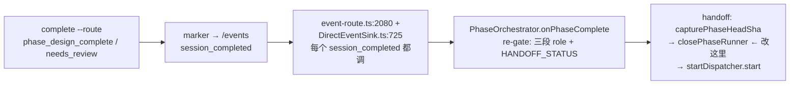

# FLY-887 三段式 phase-session 并存保活 — 调研

Issue: FLY-887 (https://linear.app/geoforge3d/issue/FLY-887/pipeline-三段式-phase-session-并存保活-designimplementqa-不跑完就关qaimplement)
日期: 2026-07-05
基于: exploration.md

## 0. 结论摘要

> **R2 修订（2026-07-05）**：初版 gate 后 Lead 给的「QA 只读 checkout」约束被 Annie 亲自纠正**收回**（三段都要写分支）；Annie steer 定 **🅱️ 单物理 worktree + TURN 轮流写**。本文 §3 已按 🅱️ 重写；§4/§5 受影响行随之修订。TURN 机制设计 + 权威图见 exploration.md R2。

方案 A（brainstorm gate 已批）完全可落地：所需基建（park 标记、mailbox wake、alive→wake/dead→spawn 双路、finalizeDone 收尾边、活跃态保护查询）**全部已存在**，改动集中在 PhaseOrchestrator 的两个动作点 + Blueprint 的 worktree 准备/prompt + 轮次账本 + 新增 TURN 记录。🅱️ 下 worktree 结构零变化（三段本就共享一个 key/目录），git「一 branch 一 checkout」硬约束天然满足（全程只有一个 checkout）。

## 1. 现行机制精确解剖（file:line 为准）

### 1.1 交接链（Design→Implement / Implement→QA）

- `phase-orchestrator.ts:194-197`：`HANDOFF_STATUS = {design: "design_done", implement: "awaiting_review"}`。
- `phase-orchestrator.ts:585-653 handoff()`：capture head（fail-closed）→ `closePhaseRunner(prev)` → dispatch next（`shareParentBranch: true`, `startPoint=head`, `resolvePhaseModel(next)`）。
- **`closePhaseRunner` 效果（plugin.ts:4012-4081）比 close-runner 本身更重**：`closeRunner({finalizeDone: true})`（FSM 转 completed + kill tmux/Terminal/CommDB row）**之后还做 `phaseWorktreeCleanup` 把共享 worktree 删掉**（dirty→fail-closed；删不掉→fail-closed）。即今天交接后 worktree 也不在了，下一段 dispatch 在 `startPoint` 重建。
- `event-route.ts:2080-2092`：`onPhaseComplete` 在**每个** `session_completed` 上无条件调用（按 session 当前状态 re-gate）→ 被唤醒的 implement **二次** `complete --route needs_review` 会再次进入 handoff 判定——wake-or-spawn 可直接挂在现有触发点，无需新事件。FSM 无 `awaiting_review` 自环（workflow-fsm.ts:143-150），二次 complete 的 FSM 转移是 no-op，但事件照发、session 行仍读 awaiting_review（FLY-191 的 re-request review 生产已验证此形态）。

### 1.2 QA FAIL 修复循环（FLY-859）

- `phase-orchestrator.ts:354-427 onQaResult()`：verdict intent 持久于 QA session_params `three_stage_verdict`，**一个 QA session 一个 verdict**（`:367-371` "one verdict per lifecycle"）——保活后同一 QA 要出多轮 verdict，**intent 模型必须改为按轮记录**。
- `runFailFlow()（:429-561）`：capture head → `closePhaseRunner(QA)` → `startDispatcher.start({sessionRole:"implement", phaseFixContext:{round, qaSummary}})`。qaSummary **truncate 600 字符**（:415）。
- **轮次 cap**：`countImplementPhases(issueId)`（plugin.ts:3930，数 implement session 行数）`>= 1 + maxFixRounds(3)` → refuse+升级 Lead。**保活后 fix 轮不再新建 session → 此计数永远不涨，账本必须换**（durable per-issue fix_round 计数）。
- 崩溃恢复：`getActiveImplementSession`（:458-469）已实现「活体 implement 在 → adopt 不双开」——wake-or-spawn 判定的现成半成品。

### 1.3 worktree

- `WorktreeManager.resolveWorktreeKey（:79-85）`：`shareParentBranch` → 三段共享 main key（同 branch B 同目录）。
- `Blueprint.runInner（:719-733）`：每次 dispatch **无条件 `removeIfExists()` + `create()`**（`git worktree add -B <branch> <startPoint>`）。
- `-B` 在 branch 已被别的 worktree checkout 时会失败（WorktreeManager.ts:188-189 注释明示）→ **保活下 implement worktree 不删，QA 若仍用共享 key 会直接创建失败**——Lead 的「QA 只读 checkout」约束是结构必然。

### 1.4 三段 prompt 现行协议（Blueprint.ts:889-944）

- design（:903-909）：commit docs → `complete --route phase_design_complete`。
- implement（:911-928）：TDD → PR → APPROVE GATE 流（`needs_review`）；fix 轮（`phaseFixContext`，:921-928）：findings 已在分支上、PR 已存在、push 后走标准 APPROVE GATE。
- QA（:938-944）：**是 branch B 的 writer**（Annie 2026-07-02「give it more permissions」，:862-867）：commit 测试/报告到 B；PASS → qa-result pass + 自己走 APPROVE GATE（QA = ship-gate holder + ship executor）；FAIL → commit findings 到 B → qa-result fail → STOP，**明文「Do NOT park for retest」**（要翻转）。

### 1.5 FSM 边（workflow-fsm.ts:120-167）

- `running → design_done`；`design_done → [completed, blocked, failed, terminated]`（无回边——parked design 被咨询式唤醒不需要变状态，够用）。
- `awaiting_review → [approved_to_ship, completed, rejected, deferred, shelved, terminated]`（无自环、无回 running——woken implement 修复期间状态就停在 awaiting_review，与 FLY-191 单 session 修复循环同形态）。
- **不需要加 FSM 边**（gate 批的「不改 FSM」成立）。

## 2. 可复用基建清单（全部已在生产）

| 基建 | 位置 | 保活用途 |
|---|---|---|
| `declare-state park`（FLY-626） | flywheel-comm declare-state.ts | phase 完成后自 park：CommDB 持久（过 Bridge 重启）、watchdog 全抑制、`flywheel-comm send` 即清（re-engagement）；死 parked runner 仍被 Heartbeat 收割 |
| `parked-alive` class（FLY-229） | terminal-mcp lifecycle.ts:12, index.ts:162 | CommDB completed/timeout + tmux 活 = RE-ENGAGEABLE 的既有分类；Lead 侧可见性已就绪 |
| `sendRunnerWake`（FLY-191/142） | bridge/runner-wake.ts:98 | mailbox wake，带 feedbackText（cap 1500）、no-transport 防护、失败→`runner_wake_failed` 事件 |
| `retestWakeQa` alive→wake / dead→respawn（FLY-752） | auto-qa-effects.ts:464、auto-qa-coordinator.ts:796-868 | wake-or-spawn 双路的完整参考实现（含 CAS retarget、durable retest 标记、wake 失败 held-for-reconcile） |
| `FINALIZE_DONE_SOURCE_STATES` 含 design_done/awaiting_review | close-runner.ts:68-78 | ship 后统一收尾：对活体 parked 段 `closeRunner({finalizeDone:true})` 即可（FSM 边合法） |
| active 查询保护 design_done | StateStore.ts:2462,2487 | parked design 不会被 stale prune / 允许新 run 的判定误伤 |
| FLY-742 stale-blocker guard | plugin.ts:286-300, runs-route.ts:293-300 | PR open 时不误收 parked implement（PR-state 权威检查）；PR merged 后反而是漏收尾的兜底 |
| runs-route 三段防双开守卫 | runs-route.ts:560-571 | issue 有活跃 phase 时拒新 main dispatch——保活后依旧成立（活跃集合更大） |
| `onMainAwaitingReview` 的 freshTransition + merge_block suppressor 模式 | event-route.ts:2053-2075 | 二次 needs_review 判「新一轮」的参考模式；FLY-869 merge_block 姊妹守卫要对齐 |

## 3. worktree 并发模型（R2 重写）：🅱️ 单物理 worktree + TURN 轮流写

> Annie 定案方向（Lead relay）：设计/实现/QA **三段都是 writer**（设计 commit 文档、QA commit test-report/补测试）；🅰️ 各自子分支→汇聚被她否掉（交叉 rebase 链 = 错误温床）；🅱️ 的关键洞察 = 三段基本不同时干活 → 一个物理 worktree 够用，剩下是「写锁/轮流」实现。TURN 机制完整设计 + 权威时序图见 **exploration.md R2.2/R2.3**。

1. **单 worktree 全程存续**：共享 worktree **创建一次、ship 后才删**——handoff 时跳过 `phaseWorktreeCleanup`，后续 phase dispatch 跳过 `removeIfExists+create`，校验（registered + clean + `HEAD==startPoint`）后原地接手；校验不过 → fail-closed 告警（绝不静默拆活人目录）。三段 cwd 同一目录（与现状 `resolveWorktreeKey` 共享 key 完全一致，**worktree key 派生零改动**）。
2. **git 硬约束天然满足**：「一条 branch 不能被两个 worktree checkout」在 🅱️ 下不构成问题——全程只有这一个 checkout；三个 session 只是三个进程共享同一 cwd。
3. **TURN = 显式化的激活权**：任一时刻只有 TURN 持有者碰 worktree（git 写 + 跑测试 + 改文件），其余 parked 完全不碰。授予点=PhaseOrchestrator 既有交接/唤醒决策点；释放点=既有完成/verdict 信号（`phase_design_complete` / `needs_review` / `qa-result`）；真相源=CommDB 新表 `three_stage_turn`（Bridge 独写、跨进程可读、过重启）；runner 写前 `flywheel-comm turn` 自查作 belt；死 holder 由 Heartbeat 收割 + reconcile 重授予。无死锁（事件驱动授予，无阻塞等待）。
4. **QA 协议不变（writer 保留）**：FAIL 时照旧 commit findings/failing tests/report 到 branch B（FLY-793 Step 8 原协议、Blueprint :941-944 文案主体保留）——只把「STOP 等 close」改成「park 等 RE-TEST」。`capturePhaseHeadSha` 语义照旧（QA 有 commit，头就是它的头）。
5. **修复循环零编舞**：implement 在同一目录修完 commit+push → QA 被 RE-TEST wake 时 worktree **已经在新 head**——不需要 fetch/re-checkout/re-pin（这是 🅱️ 对比「独立 QA checkout」模型的直接简化收益）。

## 4. 改动面盘点（现状 → 目标）

| # | 位置 | 现状 | 目标 |
|---|---|---|---|
| a | `phase-orchestrator.ts handoff()` | capture head → close+删 worktree → spawn | capture head → **park**（Bridge 侧 upsert 标记；不 close 不删）→ **wake-or-spawn**（活体 parked 下段在→wake；无→spawn）；前段已死→现行 close-clean+spawn 兜底 |
| b | `runFailFlow()` | close QA → spawn implement-fix | QA 自 park（prompt）→ **wake 活体 parked implement**（带 QA 报告 + round + TURN）；implement 死→现行 spawn 兜底；`capturePhaseHeadSha` 语义照旧（QA 是 writer） |
| c | verdict intent 模型 | 一 QA session 一 verdict | 按轮记录（round-indexed intent 数组或 latest+counter）；**fix_round 账本改 durable per-issue 计数**（替代 countImplementPhases 的 session 数语义），cap=3 语义不变 |
| d | `Blueprint.runInner` worktree 准备 | 无条件 removeIfExists+create | `shareParentBranch` 且共享 worktree 存在且有活体前段 → 校验后原地接手（implement 与 QA 同此路径；**worktree key 零改动**）；不存在/前段死体已清 → 现行 create |
| e | Blueprint 三段 prompts | 完成即 STOP（被关）；QA「Do NOT park」 | design/implement：complete 后 `/compact`+释放重资源 → `declare-state park` → STOP 不退出、parked 期间不碰 worktree；QA：FAIL → commit findings（不变）→ qa-result → park 等 RE-TEST（翻转禁令）；三段共同的 TURN 契约（非 TURN wake 先 `flywheel-comm turn` 自查再动 worktree） |
| f | 二次 needs_review → QA 复验触发 | 不存在（每轮新 QA session） | 复用 onPhaseComplete 现触发点 + wake-or-spawn；对齐 freshTransition/merge_block 守卫模式；QA wake = RE-TEST（worktree 已在新 head，零 checkout 编舞） |
| f2 | TURN 记录（新） | 不存在（激活权隐含在「其余已被 kill」里） | CommDB 新表 `three_stage_turn(issue_id PK, holder_exec_id, phase, epoch, granted_at)` Bridge 独写；orchestrator 授予/翻转；新 `flywheel-comm turn --exec-id` 查询子命令（runner belt） |
| g | ship 后收尾 | 交接时人已关光，finalization 只关 QA 窗 | verified merge → finalization 对 issue 全部三段活体依次 `closeRunner({finalizeDone:true})` + worktree 清理 + archive cascade（既有 FLY-369/855 链扩容） |
| h | `reconcileOnStartup` / 各 sweep | stranded → 重驱 handoff（close+spawn） | 同一 wake-or-spawn 判定；重启后核对 park 标记 vs tmux 活体（死体→Heartbeat 收割→spawn 兜底） |

## 5. 风险确认（研究结论）

- **watchdog 误报**：park 标记全抑制 stall wake（FLY-626）；`parked-alive` 分类已存在；FLY-878（loop/watchdog park 态识别缺口）为姊妹 issue——本 issue 只保证标记正确写/清，识别缺口不重做（gate A6 已批）。
- **stale 检测误伤**：StateStore 活跃查询保护 design_done；FLY-742 guard 以 PR 状态为权威（loop 期间 PR open → 不收）。
- **内存**：3 claude 进程/issue；park 前 /compact + 释放 Chrome（FLY-752 文案现成）；FLY-751 已默认剥非-QA runner 的 chrome MCP；three-stage 仅 flywheel opt-in。**A5 已由 Lead 转 Annie 知情确认中。**
- **双写者**：TURN 记录（Bridge 独写）+ parked-不碰-worktree 协议 + runner 写前 `flywheel-comm turn` 自查；同刻激活段唯一；git commit 冲突为可见兜底。
- **byte-compat**：所有改动在 `shareParentBranch`/phase-role 门内；单 session、auto-QA（QA·FLY-XX 独立 issue 流）、`isQaRunner` 路径零变化。auto-QA 与三段互斥既有守卫（event-route.ts:2053 gate on session_role==='main'——三段 phase role 不进 auto-QA）。

## 6. 留给 plan 定稿的点

1. 二次 `needs_review` 的 marker/事件重放语义验证（FSM no-op 下 session_completed 事件确认重发——FLY-191 生产已验，需测试钉死）。
2. TURN 表 schema/`flywheel-comm turn` 子命令输出契约 + 授予/翻转与既有事件处理的原子性（先记 TURN 还是先 wake——倾向先记后 wake，wake 失败 held-for-reconcile 镜像 FLY-752）。
3. fix_round durable 账本的落点（issue 级 session_params vs QA session intent 数组）。
4. park 后 runner 的等待姿态（STOP 不退出 = 等 mailbox wake；PostToolUse hook 注入 vs inbox-check 轮询——沿用 FLY-752 QA park 的既行姿态）。
5. ship 收尾的 hook 位置（event-route merged 分支 vs fanout-finalization 扩展）。
6. 每处 fail-closed 兜底的告警文案与 `three_stage_stuck` 事件复用。

---

# R2 调研 — rebase 收敛 + per-phase model + channel 门控(2026-07-05)

基于: exploration.md R2 节。全部为 PR #458 分支(b0dd7786)+ origin/main(4b18a1f4)上的实测事实。

## R2.1 分叉与冲突清单(git merge-tree 实测)

- merge-base = 740c90ee(FLY-869)。branch +45 commits,main +13 commits。
- 冲突仅 2 文件:
  - packages/teamlead/src/StateStore.ts —— main 侧 FLY-892(#461)重构 chat_threads(canonical-key 收敛,222 行改动)vs branch 侧 R1 新增 phase/park 相关列与方法。同文件不同关注点,预计为相邻行/imports 级冲突。
  - packages/teamlead/src/bridge/post-ship-finalization.ts —— main 侧 FLY-892 +7 行 vs branch 侧 R1 keep-alive 统一收尾重写。
- main 侧对 packages/config/src/three-stage-phases.ts 只做**加法**(FLY-892 badge/tag 辅助:PHASE_THREAD_BADGE、phaseMessageTag 等),未动 DEFAULT_PHASE_TIER;runs-route.ts 模型行、phase-orchestrator.ts 在 main 侧零改动 —— ②③ 的落点与 merge 冲突不重叠。
- 加分项:main 的 phaseMessageTag(founder 可见 [设计·Fable] 标签)在 runner_model 缺失时回退 DEFAULT_PHASE_TIER[role] —— 改表后标签自动变成 [实现·Fable]/[QA·Opus],无需另改。

## R2.2 模型决策点全量清单(定案;Codex design review R1 修订)

| # | 位置 | 现状 | 改动 |
|---|---|---|---|
| 1 | runs-route.ts:579(三段式入场) | dispatchModel ?? resolvePhaseModel("design") —— sorter pin 赢 | **无条件 resolvePhaseModel("design")**(phase 表赢)+ **ignoreRunnerLabelSelection: true**(见 #7) |
| 2 | phase-orchestrator.ts:1144(交接 spawn) | resolvePhaseModel(next) | 表驱动不变 + **ignoreRunnerLabelSelection: true**(见 #7) |
| 3 | phase-orchestrator.ts:798/941(QA-fail 修复 spawn) | resolvePhaseModel("implement") | 同 #2 |
| 4 | wake 路径 | 保持 spawn 模型 | 不改(策略在 spawn 时生效) |
| 5 | retry(actions.ts:807-849 → retry-dispatcher → run-dispatcher.retry) | 重放 sessions.dispatch_model,但**同时传当前 issueLabels 且 label 优先**;run-dispatcher.ts:404 对 retry 硬编码不带 ignore flag | **phase 段 retry 收归 phase 表**:session.chat_thread_role ∈ {design,implement,qa}(durable 三段标记,auto-QA 行 = 'main' 不受影响)→ (a) retry 链全程透传 ignoreRunnerLabelSelection=true;(b) dispatchModel = **resolvePhaseModel(chat_thread_role)** 无条件(不用持久值——修复前 dispatch 的存量 phase 行持久的可能是 sorter pin/NULL) |
| 6 | DEFAULT_PHASE_TIER(three-stage-phases.ts:78) | design:heavy / implement:medium / qa:light | **design:heavy / implement:heavy / qa:medium** |
| 7 | **Linear label 路径(Codex R1 blocker)**:resolveRoleAdapter(role-adapter-resolver.ts:173-194)label 层先于 dispatchModel —— `sonnet`/`opus`/`fable-1m` 等模型 label 与 `codex`/`agy`/`kimi` 等 vendor label **赢过** dispatchModel(role-adapter-resolver.test.ts:415-423 显式断言 label > dispatchModel) | 三段入场/交接/修复 spawn 均只改 dispatchModel → **label 照旧绕过 phase 表** | 所有 phase 段 dispatch(#1/#2/#3/#5)带 **ignoreRunnerLabelSelection: true**(FLY-643 既有 seam,auto-QA 已用同款;issueLabels 照旧流入 BlueprintContext 供路由/线程,只跳过 backend/model 选择层)→ label 层跳过后 1b 分支 dispatchModel 必中(backend=claude-tmux + phase 表模型),roles config/env 也不再参与 —— 副作用兑现:vendor label 无法把 phase 段放上 no-transport 后端(park/wake 需要 mailbox) |

plugin.ts:3912 的 loadPipelineConfigByProject 仅作 boot 日志计数,非决策点。入场决策唯一入口 = runs-route(PhaseOrchestrator 交接直调 startDispatcher.start,天然只服务已入场的 pipeline)。特殊模型/vendor 需求的 issue 用 no-three-stage label 走单 session(Lead 已批取舍,label 在单 session 路径完整生效)。

## R2.3 channel 门控的可信输入链(定案;Codex R1 #3 修正 seam 引用)

- dispatch body 的 leadId 由 **runs-route 内联的 project lead membership 校验**把关(runs-route.ts:337-349 显式 leadId 校验 ∈ project.leads;:400-419 leadId 缺失时 server-side 自动解析)——发生在三段式入场判定**之前**。(初稿引的 chat-thread-register.ts validateChatThreadParams 是 chat-thread 显式注册路径,不是 fresh dispatch 的校验 seam;信任模型不变,只修正 seam 引用);
- project.leads[].chatChannel 来自 ~/.flywheel/projects.json(server 端配置)。生产实测:flywheel 项目 5 个 lead,flywheel-eng-lead.chatChannel = 1516209714097291335(#flywheel-engineer),其余 4 个(cos/product/codex-infra/anna)各有不同 channel;
- 结论:门控输入 = leadId → leadConfig.chatChannel(server-side derive),对 request body 零新增信任。leadId 缺失/查无此 lead → chatChannel 解析为 undefined → allowlist 存在时 fail-closed。

## R2.4 YAML 大整数精度坑(ConfigLoader 校验必须挡)

Discord channel id(如 1516209714097291335)> 2^53,YAML 不加引号会被解析成丢精度的 JS Number。three_stage_channels 校验必须**只接受字符串**,数字项直接抛错并提示加引号 —— 否则配置者写裸数字会静默匹配不上(门控永 OFF 且无人知)。

## R2.5 受影响测试清单

- packages/config/src/__tests__/three-stage-phases.test.ts —— tier/模型断言(19-31 行)需按新表更新;新增「零 Sonnet 不变量」断言。
- packages/teamlead/src/bridge/__tests__/three-stage-policy.test.ts —— 新增 channel 门控矩阵(absent=现状/命中/未命中/undefined channel/空数组/kill-switch 与 label 仍短路)。
- ConfigLoader 校验测试(packages/config)—— three_stage_channels 类型矩阵(缺失/合法数组/非数组/数字项/空串项)。
- 回归:phase-orchestrator.test.ts + phase-orchestrator.fly887-keepalive.test.ts + StateStore.fly887-keepalive.test.ts + event-route-fly859 全量跑(不预期改动,spawn 点模型值断言除外——若有硬编码 opus/sonnet 断言随表更新)。

## R2.6 529 Room / QA slot 影响

slot bridge 用各自 worktree 的项目 config。若 slot config 拷贝生产 config.yaml(带 allowlist)而 slot lead 的 chatChannel 是测试频道 → 三段式在 slot 内 OFF。以后测三段式:slot config 把 slot channel 加进 allowlist 或删掉该 key(absent=不限)。记入 qa-framework 使用注意,不阻塞本 PR。
