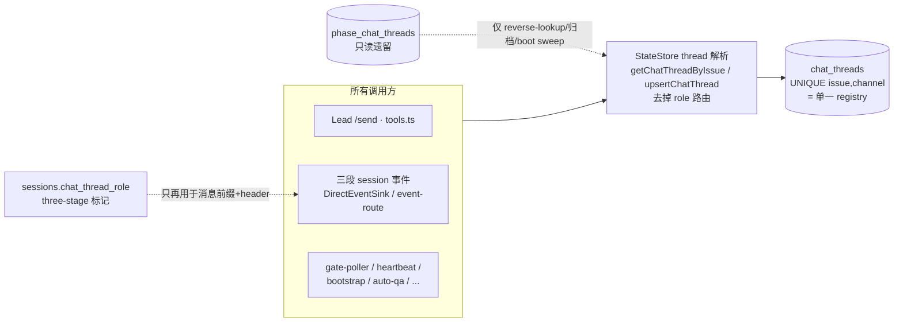

# FLY-892 一 issue = 一 thread — 实施计划

Issue: FLY-892 (https://linear.app/geoforge3d/issue/FLY-892/pipelineux-一-issue-一-thread-收敛三段式-designimplementqa-三-thread-lead-chat)
日期: 2026-07-05
基于: research.md

## 0. 目标与边界

**目标**:一 issue = 一 thread。某 issue 的全部 Discord 消息(Lead 更新 + design/implement/QA 三段 session 产出)落在同一条 `(issue, channel)` thread;`session_role` 降级为 thread 内消息前缀;置顶消息升级为三段 pipeline header。

**状态(2026-07-05)**:Annie 已审 mockup 并 **批准 UX、说 go**(Tadashi 指令 7ed3320a);Design 段打 `phase_design_complete` 交棒,本 plan 即 Implement 段执行合同。QA 挂 892 自己的 QA 段(不另开 issue);ship = Annie gate(Tier-3,攒批重启排安静窗口)。

**Founder-approved UX(Annie 定案,锁定,不再问)**:
① 每段消息带**模型标签**(『[设计·Fable]』格式 = 段名·模型名)+ thread 置顶 header 列三段各自模型;
② 置顶列三段 session 的 tmux/cmux 位置 / exec id,可点跳各段 scrollback(复用 `attach_pin_*` 字段);与 FLY-887(三段 session 保活并存)对齐:① 独立先落,② 可用性驱动渲染、887 前优雅降级、**不碰 887 的实现**;
③ **thread 标题前缀只到阶段级**(🎨设计 / 🔨实现 / 🧪QA)—— three-stage issue 上收敛掉 FLY-560 的细粒度 status 前缀(mockup 审后定案,指令 3c87c49e);非 three-stage issue 标题行为字节不变;
④ **自动状态播报用专职「系统播报」bot 身份**(复用池子空 bot 03–06 挑一个;**不新开 bot、不用 InfraBot**),与聊天 Lead(Tadashi/Honey Lemon)身份分开(指令 3c87c49e)。

**红线(不动清单)**:
- 三段 session / per-phase 模型(`Blueprint.ts:615-616` 的 `chatThreadRole` 派生、`sessions.chat_thread_role` 列及其全部 three-stage 标记消费者:`countSessionsByIssueAndChatThreadRole`、`getThreeStageQaSessionsWithVerdictEvents`、`getStrandedThreeStageQaPassSessions`、`event-route.ts:671`、`phase-orchestrator.ts:363`、`resolveCompletionSessionRole`)— **逐字不动**。
- `roundtable_topic_threads`(FLY-314)、`alert_threads`(FLY-368)— 别的表,不碰。
- `/api/chat-threads/*` 请求/响应形状 — 不碰(它们本来就走 main 路径)。
- `tools.ts:340` 的 `req.query.sessionRole`(retry/action 的 session 选择器)— 不是 thread 路由,不碰。
- 非 three-stage 项目全链路输出字节不变(reverse-compat sentinel 兜底)。

**架构一图**:

## 1. Step 1 — StateStore:thread 解析收敛(核心)

文件:`packages/teamlead/src/StateStore.ts`

1. `upsertChatThread(threadId, channelId, issueId, leadId?)`(`:2975`):**删 role 参数**,只保留 main 分支(delete-stale 按 `(issue,channel)` + INSERT ON CONFLICT,事务不动)。
2. `getChatThreadByIssue(issueId, channelId)`(`:3815`):**删 role 参数**,只查 `chat_threads`;返回值**删 `session_role` 字段**(单 registry 下无意义;编译期暴露所有读者——预期只有测试)。
3. `set/get/clearChatThreadAttachPin(issueId, channelId, ...)`(`:3941/:3972/:4005`):**删 role 参数**,只走 `chat_threads`。
4. **保留**:`getChatThreadByThreadId`(双表读,历史 phase thread 的 reverse-lookup / reply-guard 分类)、`markChatThreadMissing/Archived`(按 thread_id 双表 UPDATE)、`normalizeChatThreadRole`/`ChatThreadRole`(标记语义仍在用)、`phase_chat_threads` DDL 与历史行。
5. **新增查询**:
   - `getUnarchivedPhaseChatThreads(): Array<{thread_id, channel_id, issue_id, session_role, lead_id}>` — `WHERE archived_at IS NULL AND discord_missing_at IS NULL`(boot sweep 输入)。
   - `getPhaseSessionsForIssue(issueId): Session[]` — 每个 phase role(`chat_thread_role IN ('design','implement','qa')`)取最新一条;**选择合同(Codex R1 #4)**:按 `last_activity_at DESC`,平手按 `created_at`/rowid 再排 —— implement fix-round 多 session 时 header 永远指最新一轮,绝不显示旧 exec 的 attach 命令(pipeline header 数据源)。

**编译期驱动清除第三参**(调用点,逐个删传参,行为自动收敛到 main):HeartbeatService(`:1264`)、bootstrap-generator(`:305/:330`)、gate-poller(`:1404/:1791/:1964/:2108`)。其余调用点本来不传 role → 零 diff。

**TDD**:先改 `bridge/__tests__/phase-chat-threads.test.ts` —— FLY-793 Step 11 的「role 路由到侧表」断言改写为:(a) 任何调用都解析/写入 main 行、`phase_chat_threads` 零新行;(b) 历史 phase 行 reverse-lookup(`getChatThreadByThreadId`)与 `markChatThreadArchived` 仍工作;(c) 新查询两枚的行为。RED → 实现 → GREEN。

## 2. Step 2 — ChatThreadCreator:创建入口收敛

文件:`packages/teamlead/src/bridge/ChatThreadCreator.ts`

1. `ChatThreadContext` **删 `chatThreadRole` 字段**(`:127`);in-flight dedup key 回到 `issueId:channelId`(`:256`);`_doEnsure` 查找/upsert 不再传 role(`:275/:401`)。
2. **`phaseThreadBadge` 保留但改任职并搬家**(`:141-152`):从 base-title 徽章(`buildIssueThreadName` 的拼接 `:172-173` 删除)改为**阶段级标题前缀**的来源,函数与徽章字面**搬到 `packages/config/src/three-stage-phases.ts`**(单一词表来源,Step 6-4);base 标题回到 `[FLY-XX] <title>`;`composeThreadTitle`(前缀 + model code 组装)机制不动。
3. 调用方清理:`DirectEventSink.ts:208` 的 `chatThreadRole: env.chatThreadRole` 透传删掉(**注意**:`DirectEventSink.ts:136` 的 `chat_thread_role: env.chatThreadRole ?? "main"` 是 sessions 列持久化 —— 保留);`event-route.ts` session_started 路径同理(`:797/:826` 持久化保留,creator ctx 若有透传则删)。edge-worker 的 `EventEnvelope.chatThreadRole`(`ExecutionEventEmitter.ts:24`)与 `Blueprint.ts:615` **保留**(标记信号)。

**TDD**:`ChatThreadCreator.test.ts` —— (a) 并发 design+implement ensure 同 issue → dedup 成一次创建、一条 thread;(b) 标题无 phase 徽章;(c) 非 three-stage 标题/文案字节不变(sentinel)。

## 3. Step 3 — 消息级 phase 模型标签(founder-approved ①)

1. **Helper 两枚(Codex R1 #3:显示名合同先定,杜绝各注入点自行推导)**:
   - `modelDisplayName(model: string | null | undefined, fallbackTier?: ModelTier): string | undefined` 放 `packages/config/src/model-tiers.ts`(与 `modelShortCode` 并排):canonical id / alias / `[1m]` 变体 → 短显示名(Fable/Opus/Sonnet/Haiku);未知 id → undefined;`model` 缺省且给了 `fallbackTier` → 该 tier 显示名。
   - `phaseMessageTag(role: string | null | undefined, runnerModel?: string | null): string` 放 `packages/config/src/three-stage-phases.ts`:`design→"[设计·<模型>] "`,`implement→"[实现·<模型>] "`,`qa→"[QA·<模型>] "`,其余 `""`。模型名 = `modelDisplayName(runnerModel, DEFAULT_PHASE_TIER[role])`;拿不到 → 只渲染段名 `[设计] `。pipeline header(Step 4)同用 `modelDisplayName`。两枚都从 `packages/config` 导出。
2. **注入点 = 真正发 Discord 帖的组装边界(Codex R1 #2:收紧到精确 seam,不按文件名撒网)**:
   - `founder-thread-notifier.ts`:`FounderThreadNotifyOpts`/`FounderStuckNotifyOpts`/`FounderMilestoneNotifyOpts` 各加可选 `phasePrefix?: string`,`buildBody`(`:91`)/`buildStuckBody`(`:408`)/`buildMilestoneBody`(`:333`)头部拼接;**所有调用方**(gate-poller 四处 founder 通知 `:1404/:1791/:1964/:2108`、stuck-escalation `:579` 等)传 `phaseMessageTag(session.chat_thread_role, session.runner_model)`;
   - `AutoQaEffects.postThread`(`auto-qa-effects.ts:128-142`)—— auto-QA 发 issue-thread 帖的**中心 seam**(plugin.ts 三段 orchestrator 也走它),在这里统一 prepend,而不是挑上游 caller;
   - `runner-ready-to-close-notifier`:`ReadyToCloseOpts` 加 `phasePrefix?`(或直接带 `{chatThreadRole, runnerModel}`)。
   - **明确不注入**:`event-route.ts:198-346` 的 design_review/pr_created handler —— 那是 CommDB 指令排队,不是 Discord 帖(Codex R1 验证);它若未来长出真发帖路径,归 founder-thread-notifier seam。
3. Lead 的 `/api/chat-threads/send` 不加标签。`chat_thread_role === 'main'` → 标签空串 → **非 three-stage 消息字节不变**。

**TDD**:`modelDisplayName` 单测(canonical/alias/[1m]/未知/兜底 tier)+ `phaseMessageTag` 单测(三段×有/无 runner_model + main 空串)+ **每个 seam 一对测试**(phase session → 带标签;main session → 字节不变)。

## 4. Step 4 — 置顶 Pipeline Header(吸收现有 attach-pin)

文件:`ChatThreadCreator.ts`(渲染/幂等)+ `event-route.ts`(数据组装)

1. **渲染**:新 `buildPipelineHeaderContent(ctx, phases)`;`phases` = 三段各 `{role, modelLabel, status, execId?, attachCommand?}`:
   - 已有 phase session → `session.runner_model` 短名 + 状态映射(terminal 完成→✅;running/awaiting_review 等活跃→▶;无 session→⬜ + `DEFAULT_PHASE_TIER`/`resolvePhaseModel` 计划模型,`three-stage-phases.ts:78/:90`);
   - **session-nav(founder-approved ②)**:每段带 exec id 短码;凡 CommDB 仍能解析到该 exec 的 tmux target 的段,渲染 attach 命令(点着跳 scrollback)。887 前已完成段 session 已关 → 渲染「✅ 完成(session 已结束)」;887 保活落地后同一逻辑自动三段全给 —— **可用性驱动,不碰 887 实现,只读 CommDB**(文案见 mockup.html 置顶区)。
2. **回退**:issue 无 phase session(`getPhaseSessionsForIssue` 空)→ 走现有 `buildAttachMessageContent`(`:725`)**字节不变**(非 three-stage sentinel)。
3. **幂等**:`ensureRunnerAttachPinNow`(`:841`)的比较键从裸 `command` 改为**最终渲染内容**(存进现有 `attach_pin_command` TEXT 列,不加列不迁移;列语义 = 幂等指纹)。内容没变 → 零 PATCH;`attachChains` FIFO、自愈(missing→重发/403→重试 pin)逻辑不动。
4. **触发点不变**:`pinRunnerAttachForSession`(`event-route.ts:446`,stage_changed 驱动)组装 `phases`(调 `getPhaseSessionsForIssue` + 逐段 CommDB target 解析,沿用现有异步边界防 comm.db 锁阻塞——Codex R1 MED-1 教训在注释里)后传入。已接受的局限:QA 段 terminal 后无后续 stage_changed → header 可能停在「QA ▶」;issue Done 时 thread 整体归档,不修(YAGNI,评审可推翻)。

**TDD**:`ChatThreadCreator.attach-pin.test.ts` —— (a) 渲染态:⬜ / ▶+exec+命令 / ✅+exec+命令(CommDB 有 target)/ ✅ session 已结束(无 target);(b) 内容不变零 PATCH、变更走 PATCH;(c) 无 phase session → 现有单-runner 文案字节不变;(d) missing/403 自愈路径带新内容仍工作;(e) 多轮 implement fix session → header 指最新一轮 exec(Codex R1 #4);(f) CommDB 无 target / terminal pre-887 session → 行渲染「已结束」不带命令。

## 5. Step 5 — Boot sweep:归并历史 phase thread

文件:`packages/teamlead/src/bridge/` 新模块 `legacy-phase-thread-sweep.ts` + `plugin.ts` 启动挂载(模式同 FLY-172 marker drain / FLY-863 reconcile,**零新周期 timer**)。

对 `getUnarchivedPhaseChatThreads()` 每行(逐行 try/catch,单行失败不断 sweep):
1. 解析该 issue 的 lead/botToken(复用 `resolveBotTokenForThread` 形态);
2. **fail-closed 分支(Codex R1 #1:绝不归档一个 issue 唯一可见的 thread)**:
   - 同 `(issue,channel)` **有 main 行** → 向 phase thread 发指针消息:「🔀 本 issue 后续消息已归并到主 thread:https://discord.com/channels/<guild>/<main_thread_id>」(`allowed_mentions: {parse: []}`)→ 归档;
   - **无 main 行**:查该 issue 是否仍需可见 Discord 面 —— **专用显式判定,别拿全局 TERMINAL_STATUSES 判**(它把 awaiting_review 算 terminal,而 `getActivePhaseSessionForIssue` 刻意保护 awaiting_review/approved_to_ship/design_done/pending+worktree —— 拿错 helper 会对 park/等审的 session 重演 R1 bug,Codex R2 note-2);回归用例必须覆盖 running / awaiting_review / design_done / pending+worktree 四种 no-main 行都不被归档。**活跃 → 跳过本行 + log skipped_no_main**(它是该 issue 当前唯一 Discord 面;main 行由未来某个 ensureChatThread 路径建出 —— DirectEventSink session start 或 Lead /send row-miss;HTTP session_started/stage_changed 不建 thread,别写成「下一个事件就归并」,Codex R2 note-1 —— 建出后下次 boot 再收;log 保持可见便于人工处理意外行);**terminal → 归档**(issue 已完结,thread 本来就该收);
3. Discord archive(复用 done-thread-archiver 的 archive 调用形态);
4. `markChatThreadArchived(thread_id)`。

幂等 by construction(archived 行不再入选);Discord 失败 → 行保持未归档,下次 boot 重试。规模:仅 flywheel 项目 2026-07-04 后的行(≈880-892 波次 ×≤3),一次 <20 个 API 调用。日志输出 sweep 总结(处理/跳过/失败计数)。

**TDD**:sweep 单测(指针消息内容、归档落库、单行失败不断、二次运行零操作)+ **回归:活跃 issue + 仅 phase 行无 main 行 → 不归档、log skipped_no_main**(Codex R1 #1);terminal + 无 main 行 → 归档。

## 6. Step 6 — 阶段级标题前缀(定案③,收敛 FLY-560 细状态)

文件:`event-route.ts`(`stampStageEmojiForSession :380`)+ `ChatThreadCreator.ts`(`stampStageEmoji`)+ `stage-utils.ts`

1. **three-stage issue**(报告 session 的 `chat_thread_role` 是 phase role):标题前缀 = `phaseThreadBadge(chat_thread_role)`(🎨设计/🔨实现/🧪QA,= 当前活跃段),**不再用** `stageEmoji(session_stage)` 的细粒度 emoji/状态词;同段内 stage 变化 → 前缀不变 → coalescing writer 幂等 no-op,**每条 pipeline 全程仅 ~2 次改名**(设计→实现、实现→QA),远离 2/10min 限速。
2. **model 前缀 `[F/O/S/H]`(FLY-755)保留** = 活跃段的 model code(随该段 stage_changed 一起 stamp,与置顶 header 的三段模型互补)。
3. **非 three-stage issue:FLY-560 行为字节不变**(`stageEmoji` 细前缀照旧;reverse-compat sentinel)。
4. **徽章词表单一来源(Codex R3 #4)**:🎨设计/🔨实现/🧪QA 字面挪进 `packages/config/src/three-stage-phases.ts`(与 `phaseMessageTag` 同住;`ChatThreadCreator` 与 `stage-utils` 的 strip/识别逻辑都从这里 import —— stage-utils 不能反向 import ChatThreadCreator)。`splitStatusEmoji`/前缀识别词表(`stage-utils.ts:152-184/:237-254`)加入三个阶段徽章;**restamp 显式测试**:🎨设计、🔨实现 vs 既有 🔨实现中、🧪QA —— 剥旧贴新不叠加不残留。

**TDD**:phase session stage_changed → 标题 = 阶段徽章(细状态不出现);同段多次 stage 变化 → 零额外 PATCH;段切换 → 恰一次改名;非 three-stage → 现有 FLY-560 断言字节不变;strip/restamp 幂等。

## 7. Step 7 — 专职「系统播报」bot 身份(定案④)

文件:`packages/config`(项目配置)+ `plugin.ts`(解析)+ 发帖 seam(Step 3/4/5 所列)

1. **配置(Codex R3 #2:严格沿 ProjectConfig 的 botTokenEnv 秘密处理模式)**:项目级新可选输入键 **`announcerBotTokenEnv?: string`**(env 变量名,从池子空 bot 03–06 挑一个,**不新建 bot、不用 InfraBot**);load 时 hydrate 出 runtime-only 字段 **`announcerBotToken`**(与 `ProjectConfig.ts:241-260` 的 lead botToken hydration 同型);raw `announcerBotToken` 出现在 projects.json 输入 → 与 `ProjectConfig.ts:590-593` 同样 strip/拒绝;校验非空字符串;测试对齐现有 botTokenEnv 用例。**未配置 → 一切现状(lead bot),byte-compat 默认关**;flywheel 项目配置启用。
2. **bot 身份路由矩阵(Codex R3 #1:一条可测规则 —— 凡 @mention Annie 的消息 = lead bot;纯播报(不 @ 人)= announcer)**:

   | 消息面 | bot 身份 |
   |---|---|
   | thread 创建 / 改名(标题 stamp) | lead bot(现状) |
   | Lead `/api/chat-threads/send`(聊天) | lead bot(现状) |
   | founder-thread-notifier 全部 body(gate/approve 请求、stuck 升级、milestone —— 都带 owner @mention,`founder-thread-notifier.ts:34-50`;gate-poller 传 token 处 `:1409/:1417-1429`) | **lead bot**(是「向 Annie 请求/升级」,身份 = 发起的 Lead) |
   | 阶段开跑/完成播报、Step 3 标签化纯播报、`AutoQaEffects.postThread` QA 播报、Step 5 boot-sweep 指针消息 | **announcer** |
   | pipeline header 置顶消息 POST/PATCH/pin(header 归 announcer 所有) | **announcer** |

   `phaseMessageTag` 是**内容前缀**,与 bot 身份无关(两侧都可带)。**每个 seam 加 token 断言测试**(用的是哪个 token)。
3. **Step 3 措辞更正**:founder-thread-notifier 属 Step 3 的**标签**注入点(内容),但**不是** announcer 身份适用面(路由按上表)—— 两个维度分开,别混。
4. **身份切换自愈**:Discord 只允许作者 bot 编辑消息 —— 存量 pin(lead bot 所发)在 announcer 启用后 PATCH 会 403:把 **edit 403 并入现有 missing 自愈路径**(clear pin state → announcer 重发 + 重 pin;`ChatThreadCreator.ts:868-909` 的形态扩一枝)。
5. **Setup 前置**(plan 级注明,E2E 验):所选池 bot 须在各 chatChannel 具备 View / Send / Send in Threads / Manage Messages(pin)权限。

**TDD**:未配置 → 全部现状(sentinel);配置后自动播报/header 用 announcer token、/send 与 founder 通知仍用 lead token;edit 403 → clear+repost by announcer;权限缺失 → 现有 warn 路径不崩。

## 8. Step 8 — 全量回归 + 真机 E2E(Implement/QA 阶段执行,plan 先定验收)

- **单测/lint**:`pnpm lint` + 全仓 vitest(受影响包:teamlead、edge-worker、config)。
- **reverse-compat sentinel**:非 three-stage 项目(无 phase session、无 role 传参)thread 标题、pin 文案、founder 消息全链路字节不变。
- **529 Room 真机 E2E(验收标准)**:
  1. 派一个真 issue 走三段式 → `chat_threads` 恰 1 行、`phase_chat_threads` **零新行**、Discord 恰 1 条 `[FLY-XX]` thread;
  2. Lead `/api/chat-threads/send` 落同一条 thread;
  3. 消息带 [设计·Fable]/[实现·Opus]/[QA·Sonnet] 标签,Lead 消息无标签;
  4. pinned header 随段推进原地更新(⬜→▶+exec+attach→✅;887 前完成段显示 session 已结束),不新增第二条置顶;
  5. 预置一条 legacy phase thread → Bridge 重启后收到指针消息并被归档;
  6. 标题前缀 = 阶段级徽章(🎨→🔨→🧪 随段切换,细状态不出现;非 three-stage 对照 issue 标题字节不变;每场景换 issueId,避 Discord 2 改名/10min 限速——memory 前科);
  7. 自动播报消息的发帖者 = 系统播报 bot(与 Tadashi 聊天身份可区分),pipeline header 由播报 bot 持有并可编辑更新;/send 仍是 Lead 身份。

## 9. 部署

纯 Bridge 侧 + edge-worker ctx 清理 → **单次 Bridge 重启**(Runner/Lead 不动);与在飞 Bridge PR 攒批(Annie 纪律:多 PR 一次重启,开跑前问 team-lead)。生效核验 = Step 8 E2E 的 1/2/5 三条在生产复跑一轮轻量版(用下一个自然派发的 issue 观察,不专门造)。

## 10. 风险与已接受的取舍

| 风险 | 处理 |
|---|---|
| 删 role 参数改动面大(≈10 文件) | 全部是编译期错误驱动的机械删参;行为收敛由 Step 1 单测锁死 |
| header 停在「QA ▶」(无末次刷新触发) | 已接受(Done 即归档);评审可要求加 phase_complete 触发 |
| legacy issue 无 main 行 → 新建一条 main thread | 每 issue 至多一次;审计确认 880-887 均已有 main 行;boot sweep 对活跃 no-main 行 fail-closed 跳过(Codex R1 #1) |
| boot sweep 误归档在飞 phase thread | 在飞消息部署后本来就进 main thread;phase thread 不再接收任何消息,归档是终态正确的 |
| 不加 config 开关 | 收敛即 Annie 指令;非 three-stage 项目零行为差异,开关只膨胀测试矩阵(Tadashi gate 已认可方向) |
| 与 FLY-887 相互影响 | 本 issue 只读 CommDB target、不碰 session 生命周期;887 落地前后 header 渲染自动升级,双向零耦合 |
| announcer bot 权限缺失/漏配 | 默认关(未配置=现状);配置后权限缺失走现有 warn 不崩;setup 步骤 + E2E 断言兜底 |
| 存量 pin 消息作者是 lead bot,announcer 无法编辑 | edit 403 并入 missing 自愈:clear + announcer 重发重 pin(一次性过渡) |

## 11. 交付物清单

1. 代码:Step 1-7(TDD,RED→GREEN→REFACTOR)。
2. 文档:本文件夹 exploration/research/plan/mockup.html/progress.md 随分支进 PR。
3. mockup.html:Annie 已审并批准(2026-07-05 go);其两条 mockup-审定案(③④)已折进本 plan。
4. E2E 证据:529 Room FINAL PASS 报告 —— **QA 挂 FLY-892 自己的 QA 段(不另开 issue)**。
