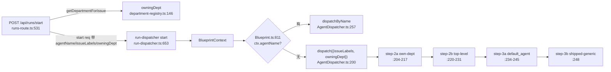

# FLY-901 产品/设计执行器 dual-register — 调研

Issue: FLY-901 (https://linear.app/geoforge3d/issue/FLY-901/产品-lead-派活路由问题product-部门-lead-自动派活够不着产品设计执行器角色)
日期: 2026-07-06
基于: exploration.md

## 1. 派活链路全景（file:line 均已实读核对）



### 1.1 owningDept 的来源

`DepartmentRegistry.getDepartmentForIssue(projectName, labels)`（department-registry.ts:146-157）：`classifyIssue` 用**Lead 注册的 match.labels**（projects.json）分类——恰一个 Lead 命中 → 该 Lead 的 `department`；2+ → 字面 `"multiple"`；0 → `undefined`。

生产 `~/.flywheel/projects.json`（flywheel 项目，2026-07-06 实读）：

| Lead | department | match.labels | canSpawnRunners |
|------|-----------|--------------|-----------------|
| flywheel-cos-lead | (无) | Flywheel-Triage | false |
| flywheel-eng-lead (Tadashi) | engineering | Flywheel | true |
| flywheel-product-lead (Honey Lemon) | **product** | Flywheel-Product | **true** |
| codex-infra-bot-lead | infra | infra-bot | false |
| anna-interviewer-lead | external | external-interviews | false |

→ `Flywheel-Product` issue 的 `owningDept = "product"`，成立。

### 1.2 step-2a 的失配点（根因）

AgentDispatcher.ts:204-217：

```ts
if (typeof owningDept === "string" && owningDept !== "multiple") {
    for (const [name, cfg] of this.entries) {
        if (parsedDept(cfg.agent_file) !== owningDept) continue;   // ← :206 根因
        if (this.labelsMatch(cfg, issueLabels)) { ... return ... }
    }
}
```

`parsedDept`（:94-128）从 `agent_file` 路径派生 dept：`.flywheel/agents/<dept>/<file>.md` → `<dept>`（深度 1）；`.flywheel/agents/<file>.md` → `null`（顶层）；其他（legacy 路径 / 深度 ≥2）→ throw `InvalidAgentFilePathError`。**一个文件路径只能给出一个 dept**——这就是单注册机型。

step-2a 命中时结果为 `department: owningDept`（:213）——注意**不是**路径 dept。dual-register 后这个语义天然正确（按哪个 dept 命中就是哪个 dept 的活）。

### 1.3 flywheel 项目当前 agents 注册（.flywheel/config.yaml）

| agent | agent_file (dept) | match.labels |
|-------|-------------------|--------------|
| engineer | engineering/ | code, feat, fix, refactor, test, infra, tooling, bug, backend, frontend, api, server, ui, web, be, fe, eng, research, plan |
| qa | engineering/ | qa, testing |
| product-designer | engineering/ | doc, docs, design, product, pm, ux, designer |
| general | (顶层) | []（空——永不按标签命中） |

无 `default_agent`。→ product issue 的完整掉落链：2a 无 product dept agent → 2b general 空标签 → 3a 无 → 3b shipped-generic。与 issue 描述吻合。

## 2. 改动面逐项审计

### 2.1 `AgentConfig` 类型（packages/config/src/types.ts:123-153)

现有字段：`agent_file`（必填）、`domain_file?`、`department?`（FLY-137 单数、显式声明时 ConfigLoader 做与路径的双向一致性校验）、`match.labels`、`match.keywords?`（deprecated）。加 `departments?: string[]` 与单数字段并存（单数字段的合同不变）。

### 2.2 ConfigLoader 校验（packages/config/src/ConfigLoader.ts:663-712)

现有 agents 校验：`agent_file` 必填 + `validateAgentPath`（:771+，镜像 parsedDept 的路径规则）；`domain_file` 可选同校验；**单数 `department` 双向检查**（:681-698——顶层 agent 声明 department 报错；声明值 ≠ 路径 dept 报错）；`match.labels` 必须字符串数组。`"generic"` 名字保留（:657-661）。

`departments` 的校验就挂在同一段里，规则设计（与既有风格对齐）：

1. 必须是非空字符串数组，每项匹配 `^[a-z0-9-]+$`（对齐 doc_flow.default_department 的 path-safety 校验 :332-340——dept 会成为路径段/目录名语义）。
2. 去重（重复项报错，配置洁癖，防手滑）。
3. **仅 dept-owned agent 可声明**：路径在顶层（parsedDept=null）时声明 `departments` 报错——与单数 department 的既有规则完全同构（:691-694）。
4. **必须包含路径派生的 home dept**：文件物理住所必须是注册集合的成员（路径继续承载「家在哪」的语义，防止「文件在 engineering/ 却只注册给 product」的错乱形态）。
5. 与单数 `department` 并存时无需新耦合规则：单数已被 :696-698 钉死等于路径 dept，而规则 4 保证路径 dept ∈ departments，传递一致。

### 2.3 AgentDispatcher（packages/edge-worker/src/AgentDispatcher.ts）

唯一行为改动 = step-2a :206 的比对。引入一个小 helper（agent 的注册 dept 集合）：

- dept-owned：`cfg.departments ?? [parsedDept(cfg.agent_file)]`
- 顶层（parsedDept=null）：照旧不参与 2a（ConfigLoader 规则 3 保证顶层无 departments，dispatcher 侧仍防御性以 parsedDept=null 为准）。

step-2b（:220-231，仍按 parsedDept===null 筛顶层）、step-3a/3b、`dispatchByName`（:257-278，department 取路径 home dept——显式点名路径下语义保持「家」）、`labelsMatch`、首配优先（entries 顺序遍历）全部不动。

### 2.4 结果消费面（blast radius）

- `AgentDispatchResult.department`：全仓 grep（排除 dist/node_modules/tests）——Blueprint.ts / run-dispatcher.ts / runs-route.ts / actions.ts 均**不消费**该字段；持久化的是 `agent_name` + `agent_match_method`（runs-route.ts:733、actions.ts:873-886、StateStore sessions 列 :1038）。半径确认小。
- Blueprint 消费 `agentFileRoot`（:1469）、`agentConfig.agent_file`（:1481，40k-char 截断读取）、`domain_file`（:1489）——都与 dept 无关。
- **doc-flow 落点**：`resolveDocFlowDepartment(owningDept, default)`（Blueprint.ts:75-83）键在 **owningDept** 上、与 agent 的 dept 无关——product issue 的过程文档本来就落 `product/doc/`（即便今天掉 generic 也如此），本 fix 零影响。

### 2.5 消费 config 的另一侧：run-infra

config.yaml 的 agents 由 `run-infra.ts` 读进 AgentDispatcher 构造器（config.yaml 头注释自述 "run-infra only reads checkpoints/agents/skills"）。AgentConfig 是透传的 record——加可选字段对 run-infra 零改动（需在 implement 时复核 run-infra 无 agents 字段白名单过滤；若有则加一行透传）。

## 3. 既有测试盘点

### 3.1 AgentDispatcher.test.ts（packages/edge-worker/src/__tests__/，467 行，30 用例）

`parsedDept` 5 例（顶层 null / dept 名 / legacy throw / 深度≥2 throw / 裸前缀 throw）+ dispatch 全链（dept 命中、fall-through、owningDept=undefined 跳 2a、default_agent、shipped-generic、首配优先、multi-alias、大小写）+ dispatchByName（known/generic/qa 保留名/unknown throw）+ availableNames。**全部不依赖 departments 缺省之外的行为 → 一条不改就是字节兼容的回归证明。**

### 3.2 ConfigLoader.test.ts（packages/config/src/__tests__/）

既有单数 department 三例（:607 顶层声明报错、:622 与路径失配报错、:637 缺省自动派生)——departments 的新用例仿此形态。

### 3.3 FLY-880 契约守卫（scripts/__tests__/test-pm-executor-contract.sh）

:15 钉死 `ROLE_MD=.flywheel/agents/engineering/product-designer-executor.md`——方案①文件不挪家，守卫不受影响、不改。

## 4. 关键结论

1. 根因单点：AgentDispatcher.ts:206 的路径派生单 dept 比对。修复 = 比对集合化，其余照旧。
2. 引擎改动 3 文件（types.ts + ConfigLoader.ts + AgentDispatcher.ts）+ 项目配置 1 文件（.flywheel/config.yaml 给 product-designer 加 `departments: [engineering, product]`）。
3. 缺省字节兼容有结构性保证：`departments` 缺省时 dept 集合 = `[parsedDept]`，与现行为逐字等价；现有 30 条 dispatcher 测试原样通过即为证明。
4. 隔离不糊：只有显式列出的 dept 命中 2a；`"multiple"`/`undefined` 的既有跳过语义不变；跨 dept 无兜底。
5. 无隐藏消费者：result.department 无下游读者；doc-flow 键在 owningDept 上与本 fix 正交。
6. 生效方式：engine 侧改动经 Bridge 重启生效（dispatcher 在 Bridge 进程内）；config.yaml 是 Runner spawn 时经 run-infra 读取——implement 阶段需实证确认 config 读取时机（boot 时读 vs 每 spawn 读，FLY-205 的教训是「补装项目 config 落地后必须再重启一次 Bridge」，按需重启为准）。

## 5. 风险与开放点（带进 plan）

- **R1 dept 名笔误静默不可达**：`departments: [engineering, prodcut]` 校验过（合法 token）但永不命中——config.yaml 与 projects.json 跨文件无法在 ConfigLoader 层互验（后者是 Bridge 侧文件）。缓解：与今天 dept 目录名笔误同级的既有风险；测试矩阵里用真实 dept 名端到端断言。
- **R2 同 dept 标签冲撞**：product dept 下 product-designer 是唯一 agent，无冲撞；未来第二个 product agent 进来时适用既有「首配优先」语义（有测试钉住）。不新增冲撞检测（scope 纪律）。
- **R3 三段式 phase 换手**（见 exploration「Out of scope」）：handoff 不传 owningDept/labels/agentName（phase-orchestrator.ts:101-112、:529-543 实读确认），Implement/QA phase 的 agent 解析各 dept 一致地退化——既有形态，FLY-830 相邻，不碰。fresh main 入口（runs-route :534+ 三段式改道)保留完整派活上下文（:684 owningDept 照传），Design phase 拿得到正确角色。
