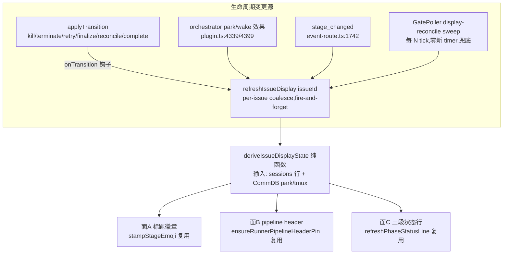

# FLY-907 thread 显示批次:状态随真实状态刷新 — 实施计划

Issue: FLY-907 (https://linear.app/geoforge3d/issue/FLY-907/uxdisplay-thread-显示批次-状态行标题随真实状态刷新parkwakekillresetfinalize-全触发-绿标)
日期: 2026-07-06
基于: research.md
版本: v1.5x(暂定,ship 时取空号;纯 Bridge 侧,单次 Bridge 重启部署)

## 0. 目标 / 非目标

**目标**(brainstorm gate 已获 Lead 全采纳):

1. 三个显示面(A 标题前缀 / B 置顶 pipeline header / C 三段状态行)**从真实状态派生**,生命周期事件仅作触发;park/wake/qa-result/finalize/kill/terminate/operator-reset/重授 turn 全覆盖;ship 收尾后终态必对(✅ 完成,不留「进行中」),且有自愈兜底保最终一致。
2. 高可见绿标:完成=✅(绿)、进行中=▶、未开始=灰;B/C 两面词汇统一。
3. tmux attach 链接按当前真实 exec-id 解析 + identifier 前缀防串线校验,绝不渲染错误链接。
4. 快照/单测钉住每个生命周期节点三面输出。

**非目标**:turn-belt/相位排序内部(FLY-921)、CommDB 注册侧 exec-id 错位根因(FLY-923)、两段式改造(FLY-905,本计划只保证 sequence-agnostic)、FLY-560 重开、runner pane spinner 串扰(tmux/cmux 渲染层,移出 scope —— **TODO@Lead:单开 follow-up issue**,gate 已拍)。

## 1. 架构



派生一处、触发多处、渲染复用现有三个写入器(自带 coalesce/限速/零churn/404 自愈)。

## 2. 实施步骤(TDD,每步先测后码)

### Step 1 — 统一派生模块 `packages/teamlead/src/bridge/issue-display.ts`(纯函数,零 I/O)

**1a. 统一 per-phase founder 状态机**(替换 B 的三态 + C 的四态两套并行):

```ts
export type PhaseDisplayState = "pending" | "active" | "done" | "blocked";
export type ParkProbe = "parked" | "not_parked" | "unknown";
// "unknown" = CommDB 缺库/缺表/读错/无法区分——现有读口对「无标记」与「读不到」都可能返 null,
// 派生层必须显式三态,绝不把「读不到」当「被唤醒」(Codex R1 #2)。

export interface PhaseDisplayInput {
  role: ThreeStagePhase;
  status?: string;          // 该 phase 最新 session 的 status;无 session → undefined
  park: ParkProbe;
}
export function derivePhaseDisplayState(p: PhaseDisplayInput): PhaseDisplayState
```

映射表(**每行都要单测钉住**;Codex R1 #2 修正版):

| 输入 | 状态 | 说明 |
|---|---|---|
| 无 session | pending | ⬜→灰 |
| running | active | |
| **completed / merged(无条件)** | done | 真终态,**不受 park 探测影响**——post-ship finalization 后 QA 段合法地 completed 且无 park 标记,绝不能被翻回 active(post-ship-finalization.ts:182-185 的终态快照契约) |
| design_done / awaiting_review / approved_to_ship,且 park ∈ {parked, unknown} | done | 到达 handoff 边界=该段工作到位 |
| design_done / awaiting_review / approved_to_ship,且 park === "not_parked" | active | **FLY-543 修正**:被唤醒返工(park 标记被 wake 显式清除)→ ▶ 返工中,不再假 ✅。例外仅限这三个 wake-敏感边界态 |
| failed / terminated / blocked / rejected | blocked | 🔴 |
| 其他/未知 status | active | 保守:有 session 且非终态就算在干 |

`park === "unknown"`(CommDB 读不到/非 887 保活)→ 纯按 status 表走,行为与现 HEADER_DONE_STATUSES 对齐(byte-safe 降级)。

**1b. issue 级标题徽章聚合**(治结构性终态缺口):

```ts
export function deriveIssueTitleBadge(args: {
  phaseStates: ReadonlyMap<ThreeStagePhase, PhaseDisplayState>; // 空 map = 非三段
  mainSessionStage?: string;   // 单 session 路径:现行 session_stage
  mainSessionStatus?: string;
}): { kind: "stage"; stage: string } | { kind: "phase"; phase: ThreeStagePhase } | { kind: "blocked" } | { kind: "completed" }
```

- 三段:任一 phase blocked → `blocked`(🔴受阻,启用 FLY-560 预留的 BLOCKED_EMOJI,剥离/重stamp 已支持);全部已存在 phase = done 且 qa 已存在且 done → `completed`(✅完成);否则 → 序列(`THREE_STAGE_PHASE_SEQUENCE`)中**最靠后的 active phase**,无 active 则第一个 pending 的前一 phase(handoff 间隙)→ `phase` badge。
- 非三段:`stage`= 现行公式(session_stage;status failed/terminated→blocked、completed→completed)。**单 session 在 stage_changed 时刻的输出与现行为逐字节一致**(哨兵测试);kill/finalize 时刻是新增刷新(以前根本不刷),不构成兼容破坏。

**1c. 统一词汇常量**(面 B、C 共用;Annie 拍的字形):

```ts
export const PHASE_DISPLAY_GLYPHS: Record<PhaseDisplayState, string> = {
  done: "✅ 完成",      // 绿
  active: "▶ 进行中",
  pending: "◾ 未开始",  // 深灰小方块;不用白色 ⬜。字形是单行常量,Annie 可随时换(候选 🩶/⚫)
  blocked: "🔴 受阻",
};
```

`ChatThreadCreator.PHASE_STATUS_BADGE` 删除,改 import 本表;`renderPhaseStatusLine` 改用本表 + `PHASE_THREAD_BADGE_PARTS` 中文词(`🎨设计✅·🔨实现▶·🧪QA◾` 风格,plan 定稿字形,实现期可微调间隔符)。`PHASE_LINE_ORDER`(phase-orchestrator.ts:112 本地复制)删除,改从 `THREE_STAGE_PHASE_SEQUENCE` 派生 —— **FLY-905 两段自动跟随**。

### Step 2 — `refreshIssueDisplay(issueId)` 统一刷新器(plugin.ts 组装,新文件 `issue-display-refresher.ts` 放逻辑)

- **输入采集**:`getLatestPhaseSessionsForIssue`(面 A/B)+ `getPhaseSessionsForIssue`(面 C 兼容既有语义)+ 单 session fallback(issue 最新 main session);CommDB 读 park 标记与 tmux target(**必须过 `Promise.resolve().then` 异步边界**,不占触发者调用栈 —— 与 event-route.ts:542 同纪律,CommDB busy_timeout=5s)。
- **per-issue coalesce**:仿 ChatThreadCreator.titleWriters 的 coalesce-to-latest:`Map<issueId, {running: boolean; rerun: boolean}>`,在跑则标 rerun,跑完 drain。fire-and-forget,catch-all console.warn,绝不 throw 进触发方。
- **三面渲染**(全部复用现有写入器,不新增 Discord 写路径):
  - 面 A:徽章来自 1b;`completed`/`blocked` kind → 调 `stampStageEmoji(ctx, threadId, "completed"/…, withWord, /*phaseBadge*/ "")` 走 stage 词汇;`phase` kind → phaseBadge 参数。coalesce/429 由 titleWriters 自带。
  - 面 B:行状态改用 1a 状态机(替换 HEADER_DONE_STATUSES 三态判定);attach 命令加 Step 3 校验;其余(per-role 最新 exec、planned 模型、ensure 幂等)不动。
  - 面 C:文本改 1c 统一词汇;post-or-edit/零churn/404 机制不动。
- **flags**:面 A 尊重 `FLYWHEEL_ISSUE_STATUS_EMOJI`、面 B 尊重 `FLYWHEEL_ISSUE_ATTACH_PIN`(现有 env,语义不变);新增总开关 `FLYWHEEL_ISSUE_DISPLAY_REFRESH=0` 关掉**新增触发面**(onTransition/park/wake/sweep),关掉后仅剩 stage_changed 旧触发 → 回退到 ship 前行为(逃生口,byte-compat 哨兵)。

### Step 3 — attach 防串线(tmux-lookup.ts + 面 B 组行处)

- `resolveCmuxAttachTarget` 返回值 `AttachTarget` 增加 `windowName?: string`(读到的 `#{window_name}`;base fallback 也带上,display-message 失败则 undefined)。
- 面 B 组行 + 单-runner pin 两处:`session.issue_identifier` 存在且 `windowName` 存在且 `!windowName.startsWith(`${identifier}-`)` → **不渲染 attach 命令**,行内降级 `_(终端待解析)_`,`console.warn`(exec-id、期望 identifier、实际 window_name —— 给 FLY-923 留证据)。identifier 或 windowName 缺失 → 保持现行为(不新增误杀)。
- 锚点依据:`buildWindowLabel` = `${displayId}-${runner}-${title}`(core/tmux-naming.ts:36),displayId=Linear identifier(FLY-272)。

### Step 4 — 触发面接线

**触发注册是 composition-root 显式依赖,不是对某一个 opts 实例的假设**(Codex R1 #1):status 写路径共有**三类**,逐一接线并各配触发证明测试。

1. **applyTransition 钩子**:`ApplyTransitionOpts` 增可选 `onTransition?: (executionId, targetStatus, ctx) => void`;applyTransition 在 persist 成功后、return 前同步调用(钩子自身 try/catch 吞错 + 内部只做 enqueue,微秒级)。**两个 opts 实例都要挂**:
   - 共享 `transitionOpts`(plugin.ts:2738)→ 覆盖 actions.ts terminate/retry/reject、close-runner、crash-reaper、HeartbeatService、done-running-/complete-marker-reconciler、event-route 完成路径、founder-consent(research §2.1 表)。
   - `staleGuardTransitionOpts`(plugin.ts:2376-2380,**独立构建的第二个实例**)→ 覆盖 stale-blocker-guard 把 stale blocker 转 completed 的路径(stale-blocker-guard.ts:273-284)。
   两处经同一 holder 赋值(`issueDisplayRefreshHolder`,同 phaseStatusLineRefreshHolder 前向引用模式)。ctx 无 issueId 时从 store.getSession 补查。
1b. **DirectEventSink(in-process sink,不走 applyTransition!)**:DES 用 `store.upsertSession` 直写 running/completed/failed(DirectEventSink.ts:129-163/582-608/837-851;其注释明言 HTTP sink 走 applyTransition 而它不走)。给 DES 增可选 dep `onSessionDisplayChanged?: (issueId) => void`,在 `emitStarted`/`emitCompleted`/`emitFailed` 成功写库后调用,plugin 组装时接同一 holder。**测试必须证明 DES 完成/失败与 stale-guard finalization 都会 enqueue refreshIssueDisplay**。
1c. **finalizeRecoveredMerge(merge-block 恢复收尾,第四条完成写路径——Codex R3 #1)**:`merge-ship-gate.ts:142-196` 直接 `store.upsertSession({status:"completed"})` 后调 `runPostShipFinalization`,两个批准入口(actions.ts approveExecution 与 founder-consent/wiring.ts gate-response)都会走到——绕过 onTransition 和 DES 钩子。修法:给 `finalizeRecoveredMerge` 增可选 `refreshIssueDisplay?: (issueId) => Promise<void>` 依赖(接同一 holder,两个调用方都传),并让它把该依赖透传进 `runPostShipFinalization` 的可选刷新参数——保证 phase finalization(parked design/implement 关成 completed)**之后**再做终态统一刷新,不是只在主 session 翻 completed 后刷一次。测试:approveExecution 路径与 founder-consent gate-response 路径各一条,恢复 merge-blocked session → 断言 enqueue + 最终 done/done/done 终态显示。(不改走 applyTransition——recovered-merge 的 upsert 语义/字段集是刻意镜像 live sink 的,改 FSM 路由超出本 issue 显示范畴。)
2. **park/wake**:plugin.ts:4339 `parkPhaseRunner` / 4399 `wakePhaseRunner` 效果末尾 enqueue(重授 turn 的正常路径 = wake,天然覆盖)。
3. **stage_changed**:event-route.ts:1811/1821 两个调用替换为 enqueue 统一刷新(stampStageEmojiForSession/pinRunnerAttachForSession 函数体迁入 issue-display-refresher,event-route 保留薄转发;auto-qa-effects.ts:472 镜像同步改)。session_stage 已在 1784 行先 persist,刷新器从 DB 读到的就是新值。
4. **orchestrator/post-ship**:`PhaseOrchestratorDeps.refreshPhaseStatusLine` 与 post-ship-finalization 的可选刷新参数,重接到统一刷新器(签名不变,实现替换)——qa_result/finalize 自动升级为三面全刷。
5. **sweep 兜底(两层 fingerprint 驱动,保证重启/漏触发/CommDB-only 漂移后收敛——Codex R1 #3 + R2 #1)**:GatePoller 增 `displayReconcileEveryNTicks`(默认 60 tick ≈ 3min@3s;`FLYWHEEL_ISSUE_DISPLAY_SWEEP_TICKS` 可调,0=关)。piggyback 现有 tickCount(gate-poller.ts:332 FLY-208 同款,零新 timer)。
   - `chat_threads` 增两列 `display_fingerprint TEXT` + `display_reconciled_at TEXT`(additive 幂等迁移,镜像 attach_pin_* 列模式 StateStore.ts:5135)。**存储的是全量 fingerprint**:派生显示状态的稳定哈希,输入含 sessions 表(per-role 最新 {status, execution_id} + 单 session {session_stage, status})**和刷新时实际读到的 CommDB 派生输入**(park 三态 + tmux target/windowName 校验结果)。由 `refreshIssueDisplay` 在写出成功后计算落库(落库条件见下条 6)。
   - **层 1(廉价 status 扫,零 CommDB 读)**:`listDisplayReconcileCandidates(cursor, limit=50)` 对有 chat_threads 行的 issue(**含 terminal**——A/B 面 stale 而 C 已终态/缺行的崩溃窗口不再隐身)比较「sessions-only 快速哈希」与存储 fingerprint 的 sessions 分量;不匹配(含 NULL)→ enqueue。按 `last_activity_at DESC` + keyset cursor 可续,LIMIT 不造成永久盲区。
   - **层 2(CommDB-敏感轮转扫)**:同一 sweep tick 内,对「存在非 terminal session 的 issue」按 keyset cursor 轮转取一小批(LIMIT 10),**无条件 enqueue 刷新**(刷新器本来就读 CommDB + 三面零churn跳过 → 无漂移时零 Discord 请求)。这层专门兜 Bridge 不可见的 CommDB-only 漂移:手动重授 turn、park 标记单独变化、`tmux_window` 迟注册(先前刷新时 target 尚不存在)、attach 目标被纠正。terminal issue 的 CommDB 漂移无显示意义(session 已收尾),不在层 2 域内。
   - 测试钉住(Codex R2 #1):「tmux_window 在上次刷新后才注册」和「park 标记清除但 sessions status 未变」两个场景,sweep 必须再次 enqueue 并刷出新内容。
6. **fingerprint 落库条件 = 全部启用面确认写达(Codex R2 #2)**:现有三个写入器是 best-effort/吞错设计(`stampStageEmoji` 的 drain 不 reject、`ensureRunnerPipelineHeaderPin`/`refreshPhaseStatusLine` 失败仅 log)——**不能把 resolve 当成功**。为刷新器路径增加可观测结果契约:`type DisplayWriteResult = "changed" | "noop" | "deferred" | "failed"`,三个写入器各提供返回 result 的内部变体(公开 void 接口对既有调用方 byte-compat 保留)。仅当每个启用面返回 `changed` 或 `noop` 才落 fingerprint;任何 `failed`/`deferred`(429 待重试、tmux target 未解析、pin 403 待自愈等)→ 不落 → 该 issue 保持 sweep 候选,下轮重试。测试:模拟标题 PATCH 失败 / header pin POST 失败 / 状态行 post 失败,断言 fingerprint 未写。

### Step 5 — 测试矩阵(快照钉住)

**纯函数直测**(issue-display.test.ts):1a 映射表逐行;1b 聚合逐 kind(含 543 场景:design_done+wake→标题回 🎨设计、header 行回 ▶);词汇表。

**生命周期节点快照**(issue-display-refresher.test.ts,mock Discord/CommDB seam):每节点三面输出 `toMatchInlineSnapshot`:

| 节点 | 关键断言 |
|---|---|
| design running | 标题 🎨设计,header 设计▶/实现◾/QA◾ |
| design park+handoff | 设计✅ 实现▶ |
| implement awaiting_review(park) | 标题 🧪QA(QA active)或 📬,header 实现✅ |
| qa_result FAIL → wake implement | 标题回 🔨实现,header 实现▶(不是 ✅——543 修正) |
| qa_result PASS | QA✅ |
| kill/terminate QA | header QA🔴,标题 🔴受阻 |
| operator-reset(terminate+重派新 exec) | header 换新 exec-id/attach,状态回 ▶ |
| finalize(ship 收尾) | 标题 ✅完成,header 三行全 ✅,状态行终态 —— **不留任何「进行中」** |
| attach 串线注入(window_name=别的 identifier) | 不渲染链接,降级文案 + warn |

**byte-compat 哨兵**:①非三段单 session:stage_changed 时刻标题/pin 输出与 main 现行为逐字节一致;②`FLYWHEEL_ISSUE_DISPLAY_REFRESH=0`:kill/park 不触发任何 Discord 调用(仅 stage_changed 旧路径);③flags(STATUS_EMOJI/ATTACH_PIN=0)各自关面。既有测试(stage-utils-badge/phase-orchestrator/auto-qa-effects/post-ship-finalization.fly887)全绿,`renderPhaseStatusLine`/`PHASE_STATUS_BADGE` 相关期望按新词汇更新——**词汇变化是本 issue 的交付物,不是回归**。

**真机 E2E(独立 QA 段负责,这里给脚本锚)**:529 Room 三段流水线跑通 park/wake/kill/finalize,Claude-in-Chrome 逐节点截图核对三面;串线注入用假 CommDB 行。

### Step 6 — 收尾

- lint + 全仓 vitest;`pnpm build` dist 断言。
- 文档:本三件套随 PR;CLAUDE.md 里程碑行由 implement 段加。

## 2.5 实现注记(Codex R4 非阻塞备注)

post-ship 刷新钩子的接线形态二选一,implement 时在代码/PR 说明里写明选了哪个:(a) 给 `PostShipDeps` 加 byte-compat 可选 `refreshIssueDisplay` 字段,在 `finalizeThreeStagePhases` 之后调用;(b) 直接传入用统一刷新器构建的 `finalizeThreeStagePhases` 闭包(现签名 `makeFinalizeThreeStagePhases(store, transitionOpts, refreshPhaseStatusLine?)`)。两形态都必须让钉住的 recovered-merge 测试证明「刷新发生在 phase finalization 之后」。

## 3. 风险与对策

| 风险 | 对策 |
|---|---|
| onTransition 在高频 reconcile 下放大 Discord 流量 | enqueue+coalesce;三面零churn跳过;标题写入器自带 429 处理。sweep 默认 3min 且候选 LIMIT |
| CommDB 锁阻塞触发方 | 全部读过异步边界(event-route.ts:542 既有纪律),钩子本体只 enqueue |
| 单 session 行为漂移 | 1b 单 session 公式=现行;哨兵逐字节测;`FLYWHEEL_ISSUE_DISPLAY_REFRESH=0` 逃生口 |
| 与 FLY-905 撞车 | 全部从 THREE_STAGE_PHASE_SEQUENCE 派生;905 改序列显示自动两格 |
| 与 FLY-921 时序(921 未落地时底层状态本身错) | 本 issue 只保证「如实反映 DB/CommDB」;921 落地后显示自动变准,无代码交集 |
| Discord 线程改名限速 2/10min | 标题走既有 coalesce-to-latest 写入器;聚合公式天然减少 rename 次数(整条流水线 ~3 次) |

## 3.5 附录:已核验的源码 seam(路径基准,Codex R1 #4)

除注明者外,`<file>:<line>` 均相对 `packages/teamlead/src/bridge/`;跨包路径写全。

| Seam | 精确路径 |
|---|---|
| 面 A/B 渲染 + stage_changed 触发 | `packages/teamlead/src/bridge/event-route.ts`(:398/:486/:542/:1742/:1811/:1821) |
| 面 B 渲染器 + 标题写入器 | `packages/teamlead/src/bridge/ChatThreadCreator.ts`(:205/:221/:488) |
| 面 C 派生/渲染 | `packages/teamlead/src/bridge/phase-orchestrator.ts`(:110-159/:580/:701/:706) |
| 面 C 发帖/编辑 + auto-QA 镜像 stamp | `packages/teamlead/src/bridge/auto-qa-effects.ts`(:181/:472) |
| status 写路径 ①统一入口 | `packages/teamlead/src/applyTransition.ts`(:26)+ 共享 opts `packages/teamlead/src/bridge/plugin.ts:2738` |
| status 写路径 ②第二个 opts 实例(**bypass 共享对象**) | `packages/teamlead/src/bridge/plugin.ts:2376-2380` + `packages/teamlead/src/bridge/stale-blocker-guard.ts:273-284` |
| status 写路径 ③in-process sink(**bypass applyTransition**) | `packages/teamlead/src/DirectEventSink.ts`(:129-163/:499-510/:582-608/:837-851,upsertSession 直写) |
| status 写路径 ④merge-block 恢复收尾(**bypass ①和③的钩子**) | `packages/teamlead/src/bridge/merge-ship-gate.ts:142-196`(upsertSession 直写 completed + runPostShipFinalization);调用方 `packages/teamlead/src/bridge/actions.ts:371-377` + `packages/teamlead/src/bridge/founder-consent/wiring.ts:163-169` |
| park/wake 效果 | `packages/teamlead/src/bridge/plugin.ts:4339/:4399` |
| ship 收尾 | `packages/teamlead/src/bridge/post-ship-finalization.ts:182-233` |
| attach 解析/校验 | `packages/teamlead/src/bridge/tmux-lookup.ts`(:63/:113/:197) |
| 窗口命名锚 | `packages/core/src/tmux-naming.ts:36` |
| phase 词汇/序列 | `packages/config/src/three-stage-phases.ts` |
| sweep 挂点 | `packages/teamlead/src/bridge/gate-poller.ts:332-336` |
| 迁移模式参照 | `packages/teamlead/src/StateStore.ts:5135`(attach_pin 列 additive 迁移) |

## 4. 交付边界

- 改动包:`packages/teamlead`(issue-display 新模块、event-route、plugin、phase-orchestrator、post-ship-finalization、auto-qa-effects、ChatThreadCreator、tmux-lookup、StateStore、gate-poller、applyTransition)+ `packages/config`(如词汇常量放 config 侧则加导出;倾向留 teamlead,config 只已有 PHASE_THREAD_BADGE_PARTS)。
- 部署:merge → 生产 `git pull` + build + **单次 Bridge 重启**(攒批,遵循 bridge-ship-discipline)。无需重 Lead/Runner。
- **TODO@Lead(gate 已拍)**:runner pane 内 Lead 任务 spinner 串扰 → 单开 follow-up issue(tmux/cmux 渲染层)。

## 5. 实施注记(implement 段补,2026-07-06)

1. **§2.5 选型 = 形态 (a)**:`PostShipDeps` 增可选 `refreshIssueDisplay`,在 `finalizeThreeStagePhases`(step 1.25)之后、notifier/archive 之前调用;`finalizeRecoveredMerge` 增同名可选参数透传(actions.approveExecution 与 founder-consent gate-response 两个调用方都接 holder)。
2. **1a 状态机一处修正(实现期发现,快照矩阵逼出来的)**:显式 park 标记(park === "parked")在任何非终态/非 blocked 的存活 status 下都判 done——keep-alive QA 出完 verdict 后以 status=running 挂 park,若仍按「running→active」渲染,QA 会抢走标题 badge、且 FAIL 场景标题回不到 🔨实现(plan Step 5 矩阵行)。wake 清标记 → not_parked → 回 ▶(FLY-543 语义不变)。
3. **Lead 指令折入(2026-07-06,flywheel-eng-lead)**:
   - `7d7bf4f0` 大白话词汇:面向 founder 只用 完成✅/进行中▶/未开始◾(灰)/受阻🔴,中文词,parked→完成、pending→未开始,不露内部术语。已即本计划 1c 词汇。
   - `17ab4f53` **状态收敛到置顶块**:三段状态由置顶 pipeline header(面 B)一处承载、原地刷新;统一刷新器**不再散发**独立状态行消息(原 FLY-887 面 C),并对存量散消息主动删除自愈(`deleteDiscordMessageInChannel`,404=已消失=成功;删除失败不落 fingerprint,sweep 重试)。`FLYWHEEL_ISSUE_DISPLAY_REFRESH=0` 逃生口保留 ship 前散发行为。
4. **环境性测试失败对照**:LeadAlertNotifier / createLeadRuntime-preflight / fly247-bash / fly350-fullaccess / StructuredInboxRouter 数个用例在设计基线 commit(ae30f3f3)同样失败(本机 runner 环境携带生产 Discord token / 真 ~/.flywheel),与本 PR 无关;codex-lead-runtime 用例需 TMPDIR 不在 ~/.flywheel 下(既有已知坑)。CI 干净环境为准。
