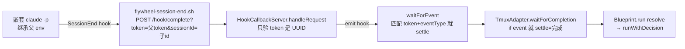

# FLY-921 三段式流水线相位误推进 + turn-belt 恢复 — 调研

Issue: FLY-921 (https://linear.app/geoforge3d/issue/FLY-921/bugpipeline-三段式流水线qa-相位抢先跑-turn-belt-死-holder-不释放锁-qa-边角覆盖补强)
日期: 2026-07-06
基于: exploration.md

## 1. 目标

把 exploration 定下的四个 fix 方向落到精确的机制位点:每条链路现状怎么走、改哪里、为什么这样改是最小且字节兼容的。

## 2. 机制审计

### 2.1 完成检测链(Fix A 位点)



- `scripts/hooks/flywheel-session-end.sh`:SessionEnd 时 POST `/hook/complete?token=${FLYWHEEL_CALLBACK_TOKEN}&sessionId=${SESSION_ID}…`。`SESSION_ID` 是**触发 hook 的那个会话**自己的 id;token 来自 env,子进程继承 → 身份混淆的源头。hook 脚本本身无法区分「我是 runner 主会话」还是「runner 里嵌套跑的 claude -p」(它只有 env 可看,而 env 相同)。
- `packages/edge-worker/src/HookCallbackServer.ts:89-93`:`onHook` 只比对 `event.token === token && event.eventType === eventType`;`event.sessionId` 被携带但从未参与匹配。
- `packages/claude-runner/src/TmuxAdapter.ts:937-941`:`this.hookServer.waitForCompletion(callbackToken, hardTimeoutMs).then((event) => { if (event) settle(false); })` —— 调用方**手里就有** `claudeSessionId`(adapter 用 `--session-id` 预生成并传给 `waitForCompletion(ctx, claudeSessionId, …)`),却没用来过滤。
- 兜底路径完好:pane_dead poller(5s 周期)+ sentinel(land-status.json)+ dynamic/hard timeout。也就是说,**忽略一个 sessionId 不匹配的 callback 是安全的** —— 若 runner 真退出了,pane_dead 在 ≤5s 内照样 settle。

**结论(Fix A)**:在匹配层加 sessionId 过滤。两个候选:
- A-1(选定):`HookCallbackServer.waitForEvent(token, eventType, timeoutMs, expectedSessionId?)` 增加可选第四参;`onHook` 在 `expectedSessionId` 给定时要求 `event.sessionId === expectedSessionId`,不匹配记 warn(带两个 id,便于诊断)并**保持等待**。`TmuxAdapter` 把 `claudeSessionId` 传进去。可选参数 → 既有调用方字节兼容。
- A-2(否决):在 TmuxAdapter `.then` 里判断后重新 armed —— `waitForEvent` settle 时已删 pendingWaits/listener,重 arm 要写循环,复杂且有窗口期漏事件;不如在匹配处过滤。
- hook 脚本侧不改:脚本无法自证身份(见上),改脚本治标不治本;且脚本分发面广(installed hooks),服务端一处改覆盖所有历史安装。

边缘情况:runner 主会话 id 变化(理论上 resume/新会话)→ callback 被忽略 → 退化到 pane_dead 兜底,最多晚 5s,可接受;CodexTmuxAdapter/Antigravity/Kimi 等 no-hook 或各自 adapter 路径不受影响(只有 claude-tmux 走 hookServer callback)。

### 2.2 完成路由合成链(Fix B/D 位点)

- `Blueprint.runWithDecision`(`packages/edge-worker/src/Blueprint.ts:1829-`):**进程侧任何 resolve**(callback 误判 / pane 死 / 被 kill / 超时)都会走 DecisionLayer;catch 分支还有 `decision_error_fallback → needs_review`。
- 本部署(订阅制,无 ANTHROPIC_API_KEY)Haiku triage **永久不可用** → 每次落 `FallbackHeuristic`(`packages/edge-worker/src/decision/FallbackHeuristic.ts`):
  - Rule 1 `commitCount === 0 → blocked`(本可拦住 FLY-543,被 ledger commit 骗过);
  - Rule 4 默认 `needs_review`。
- `needs_review` → 事件层把 session status 置 `awaiting_review`(event-route / DirectEventSink)→ `PhaseOrchestrator.onPhaseComplete`(两个接线点:`DirectEventSink.ts:744`、`event-route.ts:2207`)→ `HANDOFF_STATUS.implement === "awaiting_review"` 命中 → `handoff(prev, "qa")`。
- **runner 驱动的真完成**长什么样:三段式 implement 的协议(Blueprint prompt APPROVE GATE 流程)要求 `gate approve_to_ship --no-block`(得 questionId)→ `complete --route needs_review --pr <N> --question-id <qid>`;`--question-id` 落 `reviewQuestionId` → sessions.review_question_id。**源码更正(Codex design R1 #1)**:`complete.ts` 对 needs_review 并**不**强制 `--pr`(源码里 "REQUIRES --pr" 的注释说的是 pr_handoff),且 `collectEvidence` 只在 pr_handoff/`--merged` 路径写 `landingStatus.prNumber` —— 即合法 needs_review 完成落库后 `pr_number` 也可能为空,判别子不能要求它。FLY-543 的合成完成 review_question_id 为空(DB 实证)。
- `REVIEW_BINDING_UNBOUND = "unbound"`(`StateStore.ts:618`):Phase-2 完成到达但没带 questionId 时写入的哨兵,verify-approval 拒绝它 —— 判别子必须同时排除这个哨兵。

**结论(Fix B)**:在 `PhaseOrchestrator.onPhaseComplete` 的 implement 边界(`session.status === "awaiting_review"`)增加**真实完成证据闸**:

```
genuineHandoff = session.review_question_id 在场
              && session.review_question_id !== REVIEW_BINDING_UNBOUND
```

(Codex design R1 #1 修正:初稿还要求 `pr_number`,但源码核实 `complete.ts` 对 needs_review 不强制 `--pr`、`collectEvidence` 只在 pr_handoff/`--merged` 路径落 `landingStatus.prNumber` —— 拿 pr_number 当必要条件会误伤合法 happy path。`review_question_id` 单独已充分:合成路由不可能携带 questionId;runner 忘带时 Bridge 落 `"unbound"` 哨兵、verify-approval 本就拒绝,此时不拉 QA + 告警正确。)

不满足 → `failClosed(session, "implement reached awaiting_review WITHOUT runner-driven review evidence (synthesized completion …) — QA NOT started")`,不 handoff、不 grantTurn,并 `refreshPhaseStatusLine`。判定顺序:边界 → policy(保 FLY-902 disabled-warn 语义)→ 证据 → handoff;天然同时覆盖 keep-alive ON(wake-or-spawn)与 OFF(close-and-respawn)两条 handoff 路径,以及 `reconcileOnStartup` 的重放路径(它复用 onPhaseComplete)。两个接线点传入的 session 快照来自 StateStore 行,`review_question_id` 字段可得。

design 边界(design_done)无需闸:DecisionLayer 的可合成路由集 = auto_approve / needs_review / blocked / pr_handoff,产不出 `phase_design_complete`;design_done 只能由 runner 显式 complete 产生(event-route 映射)。qa 段无 HANDOFF_STATUS,同样不受影响。文档化即可 + 用测试钉死。

**结论(Fix D,防御纵深)**:`FallbackHeuristic` Rule 1 把「全部 commit message 都匹配 `/^chore\(progress\):/`」视同零 commit → `blocked`(reasoning 注明 progress-ledger-only)。`ExecutionContext.commitMessages` 已在评估上下文里,零新数据面。效果:即便 Fix A/B 都被未知路径绕过,纯 ledger 的空跑也落 `blocked`(不是 handoff 边界,不拉 QA,Lead 走正常 blocked 告警)。对单会话流水线同理 —— 一个只写了 ledger 的 runner 被判 needs_review 本来就是误报,改为 blocked 是修 bug 不是回归(会新增 Lead 对「空跑退出」的告警,这是期望行为)。

### 2.3 turn-belt 生命周期(Fix C 位点)

现状写入口全景(审计结论,exploration §3 已列):

| 操作 | 位点 | 时机 |
|---|---|---|
| grant | `run-dispatcher.ts:711-731`(pre-launch seam) | 每次 phase SPAWN |
| grant | `phase-orchestrator.ts:924`(fix wake)/`:1119`(retest wake) | wake 前 |
| delete | `post-ship-finalization.ts:241` | **仅** ship 后 |

无任何 stale 检测。holder 死亡后的表现:`turn` CLI(只读)永远 `not-yours`;keep-alive 下其余相位全 parked,谁也不会再 grant(wake 才 grant,而 orchestrator 不知道 holder 死了)。

可复用的既有构件:
- **FLY-863 先例**:`AutoQaCoordinator.reconcileStuckCodexHolds` —— 启动 + 事件位点触发、阈值判定、同一状态只告警一次、安全恢复。形状直接借用。
- **liveness 探测**:`probeRunnerProcessLiveness`(`tmux-lookup.ts:337`,四态 alive/dead_pin/absent/indeterminate),orchestrator 已通过 `deps.probePhaseAlive`(`plugin.ts:4329`)注入 —— Fix C 复用同一探针与同一 fail-closed 语义(indeterminate 不动)。
- **相位会话查询**:`StateStore.getPhaseSessionsForIssue` / `getAlivePhaseSession`(orchestrator deps 已有)。
- **CommDB**:需新增 `listTurns(): ThreeStageTurn[]`(现只有按 issue 的 `getTurn`);readonly-tolerant 语义照抄 `getTurn`(no such table → 空表)。

**结论(Fix C)**:新增 `PhaseOrchestrator.reconcileTurnBelt()`(或独立小模块,倾向放 orchestrator —— deps 都在):

1. **触发位点**:(a) Bridge 启动,`reconcileOnStartup` 内(在 stranded-design 重放之后);(b) 事件驱动 —— 三段式 phase 会话进入终态(session_completed/session_failed)时,由既有两个 onPhaseComplete 接线点顺带调一次单 issue 版本(轻量:一次 getTurn + 一次 probe)。零新周期 timer(项目纪律)。
2. **判定**:对每个 turn 行,取 holder 会话:
   - 会话不存在,或 status ∈ {completed, failed} → stale;
   - 会话非终态 → `probePhaseAlive`:alive → 健康,跳过;dead_pin/absent → stale;indeterminate → **fail-closed 跳过**(下轮再看),不告警刷屏。
3. **恢复**:stale 时在该 issue 的相位会话里找「最靠下游的 parked-alive 相位」(qa > implement > design,复用 getAlivePhaseSession)→ `grantTurn`(epoch 自增,旧 wake 的 stale epoch 天然失效)+ 告警 Lead 一次(带 old holder/epoch → new holder/epoch);**一个 alive 相位都没有** → `deleteTurn` + 告警(留给 post-ship 或重新 dispatch 的 pre-launch seam 重建)。
4. **单写者不变**:全部动作在 Bridge 进程内走 CommDB;`turn` CLI 保持只读。手动逃生口 = 重启 Bridge(触发启动 reconcile),不新增 HTTP action(避开 founder-only-authority 保留动作面);FLY-543 型现场从「手改 SQL」变成「重启即自愈/或等事件位点自愈」。

为什么「重授给最靠下游的 parked-alive 相位」是安全默认:TURN 指向一个 parked 会话本来就是 keep-alive 的常态(parked 会话协议上不碰 worktree,被 wake 才动);而后续任何 wake/spawn 路径都会自己 re-grant(epoch++)。恢复的意义是让**已经收到 Lead 指令、在轮询 turn 的活会话**(FLY-543 的 design 段)能拿回轮次,不是替 orchestrator 决定下一步干什么。FLY-543 场景下唯一 alive 的就是 design → 重授 design,与 operator 手改的结果一致。

### 2.4 事故里其余现象的归位

- **假「PR ready for review」**:QA 段被 kill → 同一合成链 → session_completed(needs_review) 的 founder 通知。Fix A 消除嵌套误判源;kill/crash 情形下路由仍会合成,但 QA 段无 handoff 边界、不再有相位副作用;founder 通知语义(kill ≠ PR ready)本质是 DecisionLayer 在无 LLM 部署下的表达力问题 —— Fix D 把「纯 ledger」情形改判 blocked 已覆盖 FLY-543 形态;更广的「kill 应判 blocked/failed」重塑**不进本 PR**(牵动单会话流水线全局语义),在 plan 的 follow-up 节记录。
- **GatePoller orphan 刷屏**(打错 exec-id):Lead 已拍板单开 follow-up issue,不进本 PR。

## 3. 字节兼容与风险

| 改动 | 兼容性论证 |
|---|---|
| Fix A | 新参数可选;不给 expectedSessionId 的调用方行为逐字节不变。claude-tmux 传入后,唯一行为差 = 假 callback 被忽略(此前是 bug);真退出由 pane_dead 兜底(≤5s) |
| Fix B | 只影响「三段式 implement 边界 + review_question_id 缺失/unbound」分支 —— 该分支在正确协议下不可达(complete needs_review 带 --question-id);可达即事故,fail-closed 是期望。单会话/auto-QA 会话不进 HANDOFF_STATUS 逻辑,不受影响 |
| Fix C | 纯新增(新方法 + 新 CommDB 读列表接口 + 两个触发位点);健康 holder(alive)绝不被动;indeterminate fail-closed。恢复动作 = grantTurn/deleteTurn,均为既有写语义 |
| Fix D | 仅改 LLM-unavailable 的 fallback 分支;有 API key 的部署走 Haiku 不变。纯 ledger 完成从 needs_review → blocked:少一个假 PR-ready、多一个真告警 |

主要风险与对策:
- **Fix B 误伤真完成**:若某合法路径产生 awaiting_review 但不带 binding —— 协议期望 `--question-id`(complete.ts 只透传不强制;缺 qid 时 Bridge 落 `unbound` 哨兵并 fail-close),fail-closed 的代价只是「不自动拉 QA + Lead 收告警」,不会丢工作;告警文案写明缺哪个字段,可人工续推。
- **Fix C 与 handoff 竞态**:事件位点的 reconcile 与 onPhaseComplete 的 handoff 在同一事件处理流内串行(两个接线点都是 await 顺序调用),且 grantTurn 的 epoch 单调递增使旧授权自然失效;startup reconcile 在 orchestrator 重放之后跑,拿到的是重放后的最终态。
- **探针成本**:事件位点是单 issue 单 probe(tmux list-panes 一次),启动位点全表行数 = 活跃三段式 issue 数(个位数),可忽略。

## 4. 测试面(③ 的落点,细目在 plan)

- 单测:HookCallbackServer sessionId 过滤(匹配/不匹配/未给);TmuxAdapter 假 callback 不 settle、后续 pane_dead settle;FallbackHeuristic 纯 ledger → blocked、混合 commit 不变;PhaseOrchestrator 证据闸(缺 qid / UNBOUND 哨兵 / qid 在场而 pr_number 空 → 照常 handoff / 齐备)× keep-alive ON/OFF;reconcileTurnBelt 全判定矩阵(terminal / dead probe / alive / indeterminate / 无 alive 相位)。
- 对抗/场景测(orchestrator 级,模拟 FLY-543 全链):合成 needs_review 完成 → 断言 QA 不 spawn + 告警;kill holder → 断言 TURN 重授给 parked design + epoch 递增 + design turn=yours;founder 中途改 scope(design 被 wake 而 TURN 在死 QA 手里)→ reconcile 后 design 可拿回;同 verdict 重放不双恢复(告警一次)。
- 真机 QA(pipeline 第三段,独立 QA runner 执行):在隔离房间重放「implement 内跑嵌套 claude -p」并断言不误判完成;kill holder 后重启 Bridge 断言自愈。
