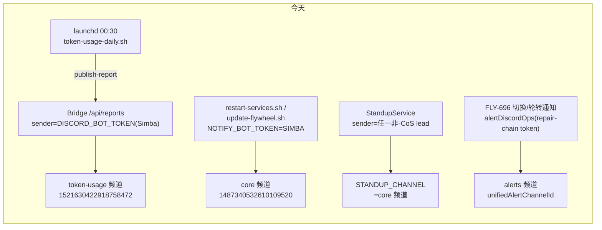

# FLY-929 Profile 自动切换启用 + 通知迁移 — 调研

Issue: FLY-929 (https://linear.app/geoforge3d/issue/FLY-929/profile-自动切换-通知迁移-claude-infra-bot-fly-915)
日期: 2026-07-07
基于: exploration.md

---

## 1. 现状数据流(审计,均为 main 上真实代码)

### 1.1 ① token report(sender = Simba)

- `scripts/token-usage-daily.sh`:launchd(`~/Library/LaunchAgents/com.flywheel.token-usage-daily.plist`,已部署含 `FLYWHEEL_TOKEN_USAGE_CHANNEL=1521630422918758472`,**无** `FLYWHEEL_BRIDGE_URL` —— FLY-925 的 bug)→ `flywheel-comm token-report daily` 聚合 + 渲染 → `flywheel-comm publish-report --channel …` → Bridge `/api/reports`。
- `packages/teamlead/src/bridge/plugin.ts:2556-2568`:`createReportsRouter({ …, discordBotToken: opts?.globalBotToken, … })`;`globalBotToken` = `config.discordBotToken` = `process.env.DISCORD_BOT_TOKEN`(`packages/teamlead/src/config.ts:127`)= **Simba**。
- `packages/teamlead/src/bridge/reports-route.ts`:`/deliver` 无 token → 501(`:293`);投递用 `opts.discordBotToken`(`:375` 带截图路径 / `:394` 纯链接路径),2xx 返回 `{ok, messageId}` —— **回执写入的天然插入点**。
- 失败形态:`set -euo pipefail` → 脚本非零退出 → 只进 `/tmp/flywheel-token-usage-daily.err`,**无人看见**(FLY-925 事故根因)。

### 1.2 ② 重启/部署通知(sender = Simba,落 core)

- `scripts/restart-services.sh:84-85`:`SIMBA_BOT_TOKEN="${SIMBA_BOT_TOKEN:-${DISCORD_BOT_TOKEN:-}}"; NOTIFY_BOT_TOKEN="${SIMBA_BOT_TOKEN}"`;`notify_discord()`(`:96-105`)POST 到 `DISCORD_CORE_CHANNEL`。`severe_alert()`(`:110` 附近)= `notify_discord "🚨 …"`,是部署失败要人救的**最后防线**。
- `scripts/update-flywheel.sh:38-45`:同构(`DISCORD_CORE_CHANNEL` 默认 `1487340532610109520`)。
- `scripts/flywheel-bridge-wrapper.sh:87-91`:Bridge 死机 🚨 也用 Simba token → core。**本 issue 不碰**(Tadashi 点 4:留给 927 发送方门禁统一治,带 fallback 再换)。

### 1.3 ③ standup(sender = 任一非-CoS lead)

- `packages/teamlead/src/bridge/plugin.ts:3049-3055`:FLY-71 约束 —— 发送 bot **不能是** standup lead(CoS/Simba),因为 Discord bot 收不到自己的 MESSAGE_CREATE,Simba 要「看见」standup 消息才能触发 triage。现实现:`standupSenderLead` = 项目里第一个非-CoS 且有 botToken 的 lead;`standupBotToken = standupSenderLead?.botToken ?? standupLead?.botToken`。
- `standup-service.ts:328/:383` 用该 token POST 到 `STANDUP_CHANNEL`(生产 = `1487340532610109520`,即 core 频道)。**频道不迁**(standup 是 Simba 的 triage 触发器,不是 notify digest)。
- `STANDUP_PROJECT_NAME` 生产未设 → 多项目下 standup disabled(FLY-925 修,929 不重做)。

### 1.4 FLY-696 切换/轮转通知(全部落 alerts)

- `packages/teamlead/src/bridge/plugin.ts:4876-4880`:`alertDiscordOps = createDiscordOps(() => buildRepairChain(projects, repairBotTokenEnvName)…)` —— repair-chain token(默认 `CASS_BOT_TOKEN` 起)。
- 三个贴帖位点,全部 `alertDiscordOps.postToThread(unifiedAlertChannelId, detail)`:
  1. `accountRotationPostHolder.current`(`plugin.ts:4901-4903`)—— Codex per-runner 轮转的 `account_rotation` 事件;
  2. account-switch **watchdog** tick(`account-switch-watchdog.ts:45-46`:`executeSwitch(pending)` → `post(result.detail)`);
  3. `/api/account-switch` 路由的 `postResult`(`plugin.ts:4907-4910`,bot 认领执行后贴结果)。
- 结果形状:`SwitchResult = switched | noop_already_switched | no_account | failed`(`switch-executor.ts:52-56`)→ 折叠成 `RepairDisposition { outcome: "attempted"|"needs_human", action, detail }`(`account-switch-repair.ts:39-43`)。watchdog 在 `outcome==="attempted"` 时触发 FLY-871 R3 的 post-switch rescue sweep(`account-switch-watchdog.ts:49-59`)。
- **要点**:disposition 层丢失了 switched vs noop 的区分 —— notify digest 只该在**真 switched** 时发(noop「重复触发跳过」发 digest = 噪音),需要给 disposition 增一个可选结构化字段。

### 1.5 self-heal enable 面(FLY-696 §3.1 / RESUME ANCHOR)

- 点亮 = `FLYWHEEL_ACCOUNT_SELF_HEAL=1` + `FLYWHEEL_CLAUDE_PROFILE_BIN`(默认解析 `flywheel-claude-profile` on PATH,`claude-profile-cli.ts:53-55`;生产建议显式指 `packages/claude-runner/bin/flywheel-claude-profile`)+ 池 provision(`~/.flywheel/claude-profiles/<name>/.credentials.json`,Annie 逐账号浏览器登录 + `flywheel-claude-profile capture <name>`)+ 重启 Bridge。
- 生产现状(2026-07-07 实测 `~/.flywheel/.env`):两个 flag 均未设;`CODEX_INFRA_BOT_TOKEN` / `FLYWHEEL_INFRA_BOT_USER_ID=1523219324561522831` / `FLYWHEEL_INFRA_BOT_CHAT_CHANNEL_ID` 已配;Codex Infra Bot launchd **未装**(`launchctl list` 无 infra 项)—— 部署 = FLY-928 W4。
- FLY-696 §8 真机 QA 16 项中 M1 部分(1-13、16)是 enable 窗的 gate;红线 = 「绝不弄坏 claude 登录」+「529 不误切」。FLY-865(切换身份 fix)已 merged,enable 前置已清。

### 1.6 告警 shell 兜底路径(自我健康检查复用)

- `scripts/lead-alert.sh`(FLY-83/FLY-368):Bridge down 也能发;从 projects.json 解析频道+token;`claims.db` 去重(与 Bridge `LeadAlertNotifier` 同表);失败 spill 到 `~/.flywheel/alert-queue/`。
- **kind 白名单**(`--kind rate_limit|usage_limit|login_expired|permission_blocked|crash_loop|pane_hash_stuck|companion_config_error|external_config_error|tui_window_lost|restart_guard_bypass`)—— 需新增 `notify_digest_failed` kind(shell 白名单 + Bridge 侧 kind 认知各一行级改动)。
- 签名默认 = 当日日期 → 天然「每日至多一条」去重,正好匹配 digest 失败告警的节奏。

## 2. 接缝契约(跨 issue)

| 对象 | 契约 | 方向 |
|---|---|---|
| **FLY-928 W5** | env 名 `CLAUDE_INFRA_BOT_TOKEN`(929 定名、928 provision 后写入 `~/.flywheel/.env`);bot 需被邀进 server 且对 #flywheel-notify / alerts / STANDUP_CHANNEL 有发言权限(928 的 invite/权限清单项) | 929 → 928 |
| **FLY-928 W4** | Codex Infra Bot 部署后,失败工单里的 `<@FLYWHEEL_INFRA_BOT_USER_ID>` mention 唤醒它进 ARC(FLY-871 mention-gated 入站已建) | 929 消费 |
| **FLY-927** | 工单状态机 / @-target 门禁 / T2 判定 / 速率兜底归 927;929 的失败帖 mention 是 927 落地前的功能性过渡,927 的结构化 schema 落地后收编 | 929 → 927 |
| **FLY-925** | `FLYWHEEL_BRIDGE_URL` + `STANDUP_PROJECT_NAME` 补齐;929 不重做,token report 真发出去以它为前置 | 929 依赖 |

## 3. 新 env 契约(全部 opt-in,未设 = 逐字现状)

| env | 值 | 消费方 |
|---|---|---|
| `CLAUDE_INFRA_BOT_TOKEN` | Claude Infra Bot 的 Discord bot token(928 W5 产出) | reports-route sender、standup sender、notify digest 发送、restart/update 脚本例行通知 |
| `FLYWHEEL_NOTIFY_CHANNEL` | `1521630422918758472`(A2 复用 token-usage 频道) | Bridge notify digest(轮转/切换成功)、restart/update 脚本例行通知落点 |
| `FLYWHEEL_NOTIFY_DIGEST_EXPECT` | `1` = 开期望回执检查(enable 窗才设) | Bridge 回执 watchdog |

`FLYWHEEL_TOKEN_USAGE_CHANNEL` 保留不动(同一频道 id,`token-usage-daily.sh` 的既有入参,零回归)。

## 4. 设计空间结论(细节 → plan.md)

1. **Bridge 侧统一收口**:一个 `resolveInfraNotifyIdentity()` helper(读两 env,返回 `{botToken, notifyChannelId} | undefined`)+ 一个 `notifyOps = createDiscordOps(() => [CLAUDE_INFRA_BOT_TOKEN])` —— reports sender、notify digest、standup sender 三处共用判定,单测一处覆盖。
2. **成功 digest = 纯增量**:`RepairDisposition` 增可选 `notifySuccess?: { from?: string; to: string }`(仅真 `switched` 时填);watchdog / account-switch 路由 / rotation-post 三个位点在 alerts 贴帖(不动)之后,若 env 齐 + 有 notifySuccess → 追发一条 notify digest。rotation(`account_rotation` 事件)同样追发。
3. **失败 mention**:`needs_human` 帖文本在 env `FLYWHEEL_INFRA_BOT_USER_ID` 存在时追加 `<@…>`(交叉:Claude 账号问题 @ Codex bot)+ 一句 T2 提示文本。
4. **脚本迁移**:restart/update 两脚本 —— 例行 `notify_discord` 增加 token/channel 解析:`CLAUDE_INFRA_BOT_TOKEN`+`FLYWHEEL_NOTIFY_CHANNEL` 都设 → 用之;否则现状。`severe_alert` **不动**。
5. **回执**:reports-route 投递 2xx 后写 `~/.flywheel/notify-receipts.json`(`{token_report: {date, ts, messageId}}`,原子写);watchdog piggyback 现有 `onPollComplete`/reconcile cadence(FLY-696 watchdog 同款,零新 timer),`FLYWHEEL_NOTIFY_DIGEST_EXPECT=1` 且本地时间 > 01:00 且当日无回执 → `lead-alert.sh` 同款 claims 去重发 `notify_digest_failed` 告警。
6. **standup**:`standupBotToken = process.env.CLAUDE_INFRA_BOT_TOKEN ?? standupSenderLead?.botToken ?? standupLead?.botToken`(infra bot 非 CoS → FLY-71 约束天然保留)。

## 5. 风险清单

- **Discord 权限**:Claude Infra Bot 对 notify/alerts/standup 三频道的发言权限属 928 invite 清单;929 enable 窗 verify 步骤要真发一条探活消息(fail-loud,不静默)。
- **noop digest 噪音**:已用 `notifySuccess` 结构化字段排除。
- **回执文件损坏/缺失**:读失败按「无回执」处理(宁多报一条经 claims 去重的告警,不静默)。
- **时区**:期望检查用报告时区(`TOKEN_USAGE_TIMEZONE` 同款,默认 America/Los_Angeles),避免 UTC 跨日误报。
- **enable 窗顺序**:标准红线 —— 编辑 env 在重启 Bridge **之前**(FLY-193 教训:launchd KeepAlive 秒拉起)。
