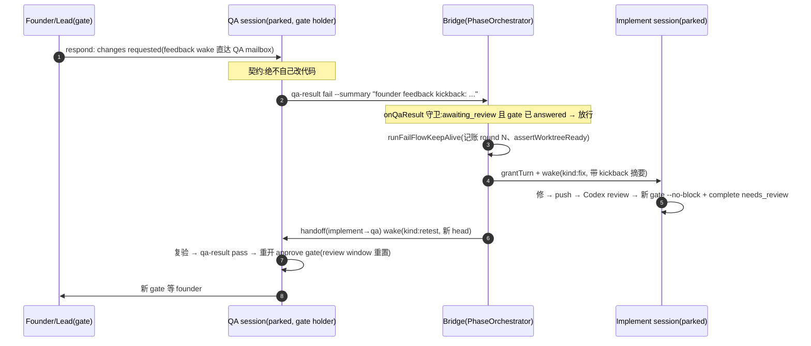

# FLY-939 wake-not-respawn — 实施计划

Issue: FLY-939 (https://linear.app/geoforge3d/issue/FLY-939/pipelinekeepalive887-qa-fail-rework-重启-reconcile-必须-wake-常驻-session绝不)
日期: 2026-07-07
基于: research.md
版本: v1.56.x 线(ship 取空号)

## 定案(brainstorm gate 已批)

- 审计结论:今晚三条乱象(543 respawn / 648·907·921 dup implement / QA complete 不常驻)
  的直接根因 = **FLY-887 merged-but-never-deployed**(生产 Bridge 17:29 重启用 stale
  checkout 4b18a1f4)。887 as-merged 已覆盖这三条路径。
- 939 代码 scope = 887 的四个真实残余缺口:
  - **G-A** wake 失败一次性 → fail-loud + 可重放重试;**G-A2** boot 重驱扩到 stranded
    implement→qa 交接。
  - **G-B** QA PASS 后 founder feedback 无路回 fix-loop → QA-prompt kickback 契约
    (Lead 拍板:走 prompt 契约转发,零新 Bridge 路由/零新事件)+ onQaResult 守卫精确放宽。
  - **G-C** spawn 兜底前 tmux 活体探测,探到活体/不明 → fail-closed 绝不 spawn。
  - **G-D** Bridge 启动 sha 可见性:log 运行 HEAD + stale-checkout WARN(只 WARN 不自动
    pull;Lead 拍板收进 939)。
- 部署提醒(非本 issue 交付物,Lead 已认领):887 + 939 都要一次**带 pull 的 Bridge 重启**
  才生效。
- 边界:不动 FLY-921/turn-belt(PR #478)、检测器归 FLY-778、operator 恢复归 FLY-934、
  auto-QA/单 session/keepalive-OFF 全 byte-compat、kill-switch 沿用
  `FLYWHEEL_THREE_STAGE_KEEPALIVE`(G-D 独立新 env `FLYWHEEL_BOOT_SHA_CHECK`)。

## 目标运行时行为(Annie 三条诉求 → 修后状态)

| 场景 | 修前(887 已部署仍存在的洞) | 修后 |
|---|---|---|
| fix/retest wake 失败 | warn 一句,fixExecId 照 patch,重放永久短路,静默停摆 | failClosed 报警 Lead;intent 保持可重放;boot sweep 自动重试 |
| crash 后 implement→qa 交接失落 | 无 boot 重驱(reconcile 只管 design) | stranded implement(awaiting_review+零 qa 行)boot 重驱既有 handoff |
| founder 在 gate 上要改动(live-patch) | feedback 指挥 QA 改代码(角色错位);FAIL 被「gate in flight」拒 | QA kickback → wake implement 修 → wake QA 复验 → 重开 gate |
| parked 行被旁路翻 terminal 后再触发 | wake miss → 盲 spawn → 重复 runner + 双 writer | spawn 前探 tmux;活体/不明 → 报警不 spawn(零重复) |
| stale checkout 重启 | 无任何信号,merged 修复静默不生效 | 启动必打 HEAD 行;落后 origin/main → WARN + durable event + alert |

### 权威时序(G-B live-patch 复验环)

## 实施步骤(TDD:每步 RED → 最小实现 GREEN → 全绿 → commit)

### Step 0 — 开工前置检查

- `gh pr view 478 --json state`:已 MERGED → 先 `git merge origin/main`,跑
  phase-orchestrator*/event-route*/plugin 相关测试证两侧语义共存;仍 OPEN → 直接开工,
  在 PR 描述记「与 #478 存在同文件改动,后 merge 者负责语义合并」。

### Step 1 — G-A fix-loop wake 失败可重试 + fail-loud

- RED(`phase-orchestrator.fly939-wake-retry.test.ts`,fake deps 套用 fly887 套路):
  1. wake 失败(`woke.ok=false`)→ `fixExecId` **未被 patch**、`alertedAt` **未被 patch**、
     `failClosed`(alert effect)被调一次、TURN 已授(现行为保留)。
  2. wake 失败后模拟 boot:`reconcileQaVerdicts` 重放同 verdict → `runFailFlow` 重驱 →
     `recordFixRound` insert-or-read 返回**原轮次**(不 +1)→ wake 重试被调。
  3. wake 成功路径:patch fixExecId、不 failClosed(逐字哨兵)。
  4. spawn 兜底路径的 fixExecId patch 行为不变(哨兵)。
- GREEN:`runFailFlowKeepAlive` :930-950 重排——`woke.ok` 分支内 patch fixExecId+log;
  `!woke.ok` 分支 `await this.failClosed(impl, "fix wake failed: <err> — TURN set; will
  retry on next reconcile sweep; Lead may nudge manually")`,不 patch。

### Step 2 — G-A handoff wake 失败 fail-loud

- RED:handoff 至活体 parked 目标,wake 失败 → `failClosed(prev,...)` 被调(现只 warn);
  wake 成功路径逐字不变(哨兵)。
- GREEN:`handoff` :1125-1137 的 else 分支 warn → failClosed。

### Step 3 — G-A2 boot 重驱 stranded implement→qa

- RED(StateStore + orchestrator 两层):
  1. `getStrandedImplementPhaseSessions()`:命中 role='implement' AND
     status='awaiting_review' AND chat_thread_role='implement';不命中 main 行/其它状态。
  2. reconcile:stranded implement + 该 issue 零 qa 行 + 无 ship claim →
     `onPhaseComplete(impl)` 被调(→ 既有 handoff);存在 qa 行(alive)→ skip;
     存在 qa 行(terminal)→ skip;有 ship claim → skip。
  3. stranded design 现行为逐字不变(哨兵)。
- GREEN:StateStore 一条 SQL;orchestrator deps 加 `listStrandedImplementPhases()`;
  `reconcileOnStartup` 在 design 循环后加对称循环(guard = `getPhaseSessionsForIssue`
  中 chat_thread_role='qa' 的行数为 0 且 `!hasShipFinalizationClaim`);plugin.ts 接线。

### Step 4 — G-B onQaResult 守卫精确放宽 + deps

- RED(守卫矩阵):
  1. awaiting_review + `hasGateResponse=true` + FAIL → 进 `runFailFlow`(放行)。
  2. awaiting_review + `hasGateResponse=false`(pending)→ 拒(现行 warn 文案)。
  3. review_question_id 缺失 / ='unbound' → 拒。
  4. approved_to_ship + FAIL → 拒(无条件,不看 response)。
  5. keepalive OFF → 现行为逐字(哨兵;kickback 契约只在 keepalive prompt 变体里)。
- GREEN:deps `qaVerdicts.hasGateResponse(session): boolean`(plugin.ts 接线:打开该项目
  CommDB → `getResponse(session.review_question_id)` 非空;try/finally close;异常 →
  false=拒,fail-closed);:669-680 守卫改为
  `if (fail && (approved_to_ship || (awaiting_review && !hasGateResponse(session)))) refuse`。

### Step 5 — G-B QA prompt kickback 契约(Codex R1 #1 修订:必须压过通用 feedback 文案)

问题:只「追加」kickback 段不够——通用 APPROVE GATE 块的步骤 f(Blueprint.ts:1480
「address it, push your fixes, then RE-REQUEST review」)与运行时 feedback wake 文本
(runner-wake.ts:84-89 同款措辞)仍会指挥 QA 自己改代码;且 QA PASS 后 QA 是 gate/TURN
holder,turn 自查挡不住它(risk 表原「turn 自查兜底」一条对该场景失效,已改)。

- RED(prompt 快照,`Blueprint.fly887-keepalive-prompt` 套路扩展):
  1. keepalive 三段 QA prompt 含 kickback 段(锚点:「woken with FEEDBACK」「do NOT edit
     code yourself」「founder feedback kickback:」「park again and WAIT for the RE-TEST」)。
  2. **负向断言**:keepalive 三段 QA prompt 的生效 feedback 规则**不是**未经限定的
     「address it, push your fixes」——通用 APPROVE GATE 块在三段 QA keepalive 变体里,
     步骤 f 被替换为(或紧跟一条显式 override)「For THIS role, FEEDBACK = kickback
     (see step 5-fb above); never edit code yourself」。
  3. keepalive OFF 的三段 QA prompt、auto-QA prompt、单 session prompt 逐字不变(哨兵)。
  4. runner-wake.ts feedback 文本:含新的角色中立 deferral 句(见 GREEN),且单 session
     语义不变(快照:原指令句保留)。
- GREEN:
  - Blueprint.ts 三段 QA 块(:1011-1017 区域)PASS/gate 段追加 research §2.2 契约文案,
    且该变体拼接的 APPROVE GATE 块把步骤 f 换成 QA-kickback override(实现取
    「变体内替换」或「块后紧跟 override 行」之一,以拼接代码最小改动为准)。
  - runner-wake.ts feedback 文本追加一句角色中立 deferral:
    「If your role's prompt defines a different feedback protocol (e.g. a three-stage QA
    kickback), follow your role prompt instead of the generic re-request steps.」——
    不新增路由/事件,单 session runner 语义不变(它的 role prompt 没有别的协议)。

### Step 6 — G-C spawn 兜底活体探测

- RED(spawn 矩阵,handoff spawn 与 QA-FAIL fix spawn 两个兜底点各一组):
  1. 该 issue+role 存在 terminal 行、probe=alive → `startDispatcher.start` **未被调** +
     `failClosed` 被调(文案含 refusing to spawn a duplicate)。
  2. probe=indeterminate → 同上不 spawn。
  3. 全部 dead_pin/absent / 无行 / 行无 tmux_session → spawn,**dispatch 参数逐字**现行(哨兵)。
  4. 只探最近 3 行(第 4 旧行不被 probe;fake probe 计数断言),排序确定性 =
     `last_activity_at DESC, rowid DESC`(Codex R1 #2:getPhaseSessionsForIssue 现缺
     rowid tiebreak,邻近 latest-phase 代码已用同款)。
  5. **CommDB 注册缺失但 StateStore 行仍有 tmux_session、该窗口 probe=alive → 拒 spawn**
     (Codex R1 #2 核心场景:现 `probePhaseAlive` 走 CommDB `getTmuxTargetFromCommDb`,
     注册被清/未修复时返回 absent,恰好漏掉「terminal-but-live 污染」)。
  6. keepalive OFF → 不探测、legacy 路径逐字(哨兵)。
- GREEN:orchestrator 私有 `async ghostGuard(issueId, phase): Promise<boolean>`(true=放行):
  deps 加 `listPhaseSessionRows(issueId, phase)`(plugin 接线 =
  `getPhaseSessionsForIssue().filter(chat_thread_role===phase)`,全 status,
  排序修为 last_activity_at DESC + rowid DESC tiebreak);**新增独立 effect
  `probeGhostTmux(row): Promise<PhaseLiveness>`**(Codex R1 #2):直接以持久化的
  `row.tmux_session` 调 `probeRunnerProcessLiveness`,**不走 CommDB lookup**
  (PhaseSession 类型补 `tmux_session` 字段或用窄 ghost-row 类型);取有 tmux_session
  的最近 3 行逐个 probe;alive/indeterminate → failClosed + false。两个兜底点 spawn 前调用。

### Step 7 — G-D boot sha 可见性

- RED(新 `boot-sha-check.test.ts`,纯函数 + fake exec):
  1. `classifyBootSha({head, originMain, isAncestor})` 五态:same→ok;behind(ancestor)→
     stale;ahead/diverged(非 ancestor)→ branch(只 log);fetch 失败→unknown(只 log)。
  2. effect 层:stale → console.warn 含「STALE CHECKOUT」+ `insertEvent`
     (`bridge_boot_stale_checkout`)+ alert 一条;branch/unknown/ok → 无 WARN 无 event。
  3. `FLYWHEEL_BOOT_SHA_CHECK=0` → 整段跳过;git 抛错 → 不炸(boot 继续)。
  4. registry 哨兵:`FLYWHEEL_BOOT_SHA_CHECK` 已登记(FLY-871 drift pattern)。
  5. fetch 命令断言(Codex R1 #3):fake-exec 断言 fetch 用**显式 remote-tracking refspec**
     `git fetch --quiet origin +refs/heads/main:refs/remotes/origin/main`——裸
     `git fetch origin main` 在部分配置下只刷 FETCH_HEAD、不刷 refs/remotes/origin/main,
     后续 rev-parse origin/main 读旧 ref = 假阴性,恰好漏掉本功能要抓的 stale checkout。
- GREEN:新 `packages/teamlead/src/bridge/boot-sha-check.ts`(纯函数 + runBootShaCheck
  effect,git 调用带 8s timeout、fetch best-effort 且用上述显式 refspec);plugin.ts boot
  段 fire-and-forget 调用(不 await 阻塞启动);registry 登记。

### Step 8 — 收口

- 全仓 `pnpm lint` + 全测试套(push 前跑,房子纪律)。
- progress.md 逐步更新;docs(exploration/research/plan)与代码同 PR。
- 真机 E2E(529 Room 或 flywheel dogfood,由独立 QA session 验,不自证):
  1. G-B 全环:三段 issue 到 QA PASS + gate 开 → 注入 changes-requested respond →
     QA kickback → implement 被 wake 修 → QA 被 wake 复验 → PASS → 新 gate。
  2. G-A:人为制造 wake 失败(如临时挪走目标 mailbox 目录)→ 观察 failClosed 报警 →
     恢复 → Bridge 重启 → boot sweep 自动重试接通。
  3. G-C:手动把 parked implement 行翻 terminal(模拟旁路污染)→ 触发 QA FAIL →
     观察不 spawn + 报警;恢复行状态 → wake 正常。
  4. G-D:在 stale checkout 上起测试 Bridge → 观察 WARN + event;分支 checkout(QA slot
    形态)→ 无 WARN。

## 测试计划汇总

- 单测:Step 1-7 各 RED 集(orchestrator fake-deps 沿用 `__tests__/phase-orchestrator.fly887-*`
  模式;prompt 快照沿用 `Blueprint.fly887-keepalive-prompt`;StateStore 临时库)。
- byte-compat 哨兵:keepalive OFF 全路径 / 单 session / auto-QA prompt / spawn dispatch
  参数逐字 / stranded design reconcile 不变。
- 集成:reconcileQaVerdicts 重放 → wake 重试(Step 1.2);stranded implement 重驱 →
  handoff wake(Step 3)。
- 真机:Step 8 四场景 + 一次 Bridge 重启穿插。

## 风险 / 边界

| 风险 | 处理 |
|---|---|
| PR #478(FLY-921)同文件未 merge | Step 0 检查;后 merge 者做语义合并(镜像 887 R2 Step 1) |
| kickback 占用 fix-round cap(3) | 接受的取舍:cap 到顶 refuse 升级 Lead,人接手;不开独立账本 |
| wake-fail 反复重启反复报警 | 接受(loud beats silent);报警聚合归 FLY-368 |
| G-C 探测误伤(indeterminate 频发) | fail-closed 是 887 全篇哲学;indeterminate 属瞬态,下次触发自愈;报警给人兜底 |
| G-D fetch 在离线/慢网 | 8s timeout + best-effort;失败只 skip 比对,boot 零影响 |
| QA 段收到 feedback 却照旧自己改(prompt 不服从) | 守卫层不阻止(runner 行为无法硬禁)。注意 turn 自查在此场景**不构成**约束(QA PASS 后 QA 就是 TURN holder,Codex R1 #1 指正)——约束全靠 prompt 层:kickback 契约 + 通用 feedback 步骤在 QA 变体里被 override + wake 文本角色中立 deferral(Step 5);严重违约由 Codex review/职责分离审计兜底 |
| 887 未部署则 939 全部机制同样不生效 | 已向 Lead 点名;ship 时与 887 同一次 pull+restart 上线 |

## 交付 / 验收

- 本文档由 Design phase 产出并 commit 到分支;Implement phase 同分支按本计划 TDD 执行。
- 验收 = Step 8 真机四场景 PASS + Codex code review APPROVED + 独立 QA + 目标行为表逐条对照。
