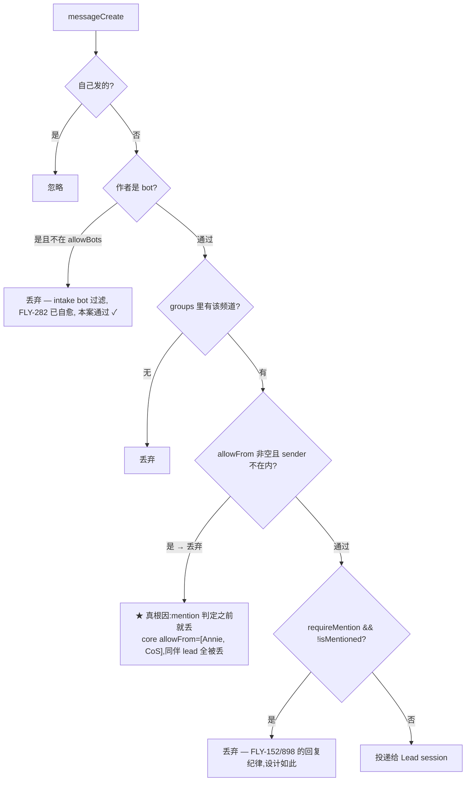

# FLY-944 shared 频道 lead-to-lead @-mention 不触发 — 探索

Issue: FLY-944 (https://linear.app/geoforge3d/issue/FLY-944/bugrouting-shared-频道-reply-gating-漏掉-lead-to-lead-mention-只有-founder)
日期: 2026-07-06
基于: 无

---

## 1. Problem(Annie 的观测,2026-07-07)

call room(shared lead 频道:#leads-roundtable / #flywheel-core)里:

1. 另一个 lead(如 Honey Lemon)@ 我 —— 不触发;
2. 我 @ 另一个 lead —— 不触发;
3. 只有 founder(人)主动说话 / @ 才触发。

**当晚实锤**:HL 在 call room @ Tadashi 请求 FSM 重绑,Tadashi 没收到,Annie 手动 relay
("你怎么没去 take action")才推进。P1:破坏 lead 间协调。

Issue 里的初始怀疑:FLY-152(shared-channel reply-discipline)修过头,把 bot-to-bot 的
@-mention 也当成"不该回"挡掉了。**审计结论:怀疑的现象为真,但根因不在 FLY-152 的
mention 判定 —— 见 §3。**

## 2. 事故 ground truth(生产 Discord 消息 + 生产 access.json 实测)

用 Tadashi 的 bot token 只读拉取了两个频道的真实历史(时间为 UTC):

| 时间(UTC) | 频道 | 事件 |
|---|---|---|
| 07-07 00:45 | #flywheel-core | HL 用**真 `<@1516207680836866219>` mention** @ Tadashi:FSM 重绑请求(915/PR#475) |
| 07-07 02:43 / 02:47 | #flywheel-core | HL 又两次真 @ 催(补充 912 也撞同 bug) |
| —— | —— | Tadashi 全程零反应(期间他在 core 正常回复 Annie 和 Cass 的消息) |
| 07-07 02:57 | #flywheel-core | **Annie 手动 relay**:"Honey Lemon 说他要你去重置 FSM" |
| 07-07 02:59 | #flywheel-core | Tadashi:"看到了、我这就去 —— 抱歉,我刚一直埋在 907/921 里、没顾上" |
| 07-07 03:02 | #flywheel-core | FSM 重绑完成 |

关键事实:

- HL 的三条消息都带**真 mention token**(Discord mentions 数组已填充)——不是"bot 只发了
  纯文本 @名字"的问题。
- Tadashi 的道歉框架是"忙没顾上",实际是**插件根本没投递**——gate 静默丢弃,Lead session
  从未见过这三条消息。
- 更早一次同病"假修复"(07-06 00:34-00:52,roundtable hello thread):Annie 要求把 HL 加进
  #flywheel-core;Tadashi 核对后宣布"HL 部署时就配好了 core、实测双向通"。他验的是
  **HL↔Cass**(Cass 在 allowFrom 里,天然通)——**HL↔Tadashi 这一对从没被验过**,当晚就死在
  这一对上。
- 同晚 Cass 也说"刚漏你(HL)消息、补上"——她的 core allowFrom=[Annie, Tadashi],缺 HL,同病。
- **roundtable 的 lead-to-lead 其实是通的**:07-06 20:37-23:01 HL↔Tadashi 在 roundtable
  topic thread 里多轮真实对话(HL 在 thread 内回、Tadashi 都接上了)。事故发生在 core;
  Annie 的观测 ① ② 对 core 全成立,对 roundtable 只对带历史遗留白名单的个别 lead 成立(§3.3)。

## 3. 根因(入站门链逐层审计)

Claude Lead 的 Discord 入站在插件 fork(claude-plugins-official/external_plugins/discord/
server.ts)里过四道门:

### 3.1 真根因:per-group `allowFrom`(sender 白名单)挡在 mention 判定之前

`server.ts` gate():`if (groupAllowFrom.length > 0 && !groupAllowFrom.includes(senderId))
return drop`。这一步在 requireMention / isMentioned **之前**执行——所以哪怕消息带真
`<@id>` mention,sender 不在白名单就直接静默丢。

生产 access.json 实测(fleet 全量,2026-07-06):

| Lead | 频道 | requireMention | allowFrom | 病 |
|---|---|---|---|---|
| flywheel-eng-lead (Tadashi) | #flywheel-core | **false**(898 未 flip) | [Annie, Cass] | ★ HL/anna 全盲 |
| flywheel-product-lead (HL) | #flywheel-core | true + patterns:[] | [Annie, Cass] | ★ Tadashi/anna 全盲 |
| flywheel-cos-lead (Cass) | #flywheel-core | false(CoS,正确) | [Annie, Tadashi] | ★ CoS 居然听不见 HL/anna |
| cos-lead (Simba) | #geoforge3d-core | false(CoS,正确) | [Annie, Peter, Oliver] | 暂全覆盖,新 lead 必漂移 |
| product-lead (Peter) | #geoforge3d-core | true + patterns:[] | [Annie, Simba, Oliver] | 同上 |
| ops-lead (Oliver) | #geoforge3d-core | true + patterns:[] | [Annie, Simba, Peter] | 同上 |
| mufasa-lead(遗留 access.json) | #growth-core | false | [Annie] | 见 §3.4 |
| belle-lead | #leads-roundtable | true | [Annie + 8 bots] | ★ 缺 HL/Ariel/Triton/Rafiki/Sarabi |
| mufasa-lead(遗留) | #leads-roundtable | true | [Annie + 6 bots] | ★ 缺 Tadashi/Cass/HL 等 |
| 其余 lead 的 core/roundtable | —— | (各自) | **[]** | 健康 |

这份白名单是**部署时手工写的**(HL 部署清单原话:"allowFrom 限定 founder + 现有 bot"),
每上一个新 lead,所有既有 lead 的白名单都不会自动补——**跟 FLY-282 修掉的 allowBots 漂移
一模一样的病,只是换了个字段**。FLY-282 当时的修复注释甚至明确写了 allowFrom 仍会 gate
reply,但没人把 shared 频道的 allowFrom 清掉。

### 3.2 为什么"只有 founder 触发"

founder(Annie)和 CoS 恰好是每份手写白名单里仅有的两个 id → 只有他们的消息能过第三道门。
这就精确复现了 Annie 的观测三条。

### 3.3 FLY-152 / FLY-898 的 mention 判定本身是好的

- 插件 isMentioned():真 `<@id>` mention 对**任何作者**(含 bot)都生效;
- FLY-898 的 id-only core gate(requireMention:true + mentionPatterns:[])同样认 bot 的真 @;
- Codex 侧 mention-gate.ts 的 isIdMentioned() 同样对 bot 作者生效(FLY-220 只把"裸名字
  regex"限定为非-bot 作者,真 @ 不受影响);
- roundtable 的 FLY-314 topic-thread 政策:非 member bot 的显式 @ → handle=true(放行)。

所以 issue 的原始怀疑("FLY-152 把 bot 的 @ 当不该回挡掉")方向对、位置错:挡的是
sender-identity 门(allowFrom),不是 addressing 门(requireMention/isMentioned)。

### 3.4 次生发现

1. **Tadashi 的 core requireMention 仍是 false**:FLY-898 的启动位点 apply 还没跑到他
   (Lead 进程自 898 合并后未重启)。若只清 allowFrom 不等 898 flip,Tadashi 会听到 core
   里**全部** bot 消息(pile-on 风险)——所以修复必须与 898 的 flip 同一个位点、同一次
   normalize(见方案)。
2. **mufasa-lead 的 access.json 是遗留物**:Mufasa 现为 Codex full-access lead(FLY-350),
   入站走 CodexDiscordGateway(RestPoll),**没有 allowFrom/allowBots 概念**,该文件不再被
   runtime 读。清理与否不影响行为,归 normalize 顺手覆盖即可(幂等,无害)。
3. intake 层 allowBots(FLY-282 自愈 mesh)工作正常:HL/Tadashi 互在对方名单里。

## 4. 方案选项

### 方案 A(推荐,Tadashi 已在 brainstorm gate 批准):退役 shared 频道的 allowFrom,职责归位

三层职责各归其位,**零插件代码改动**:

| 职责 | 归属机制 | 状态 |
|---|---|---|
| "哪些 bot 可信" | intake `allowBots`(FLY-282 自愈 mesh)+ guild 成员身份(人) | 已有、健康 |
| "该不该回" | `requireMention` + mentionPatterns(FLY-152/898 纪律) | 已有、健康 |
| ~~"哪些 sender 允许"~~ | ~~per-group `allowFrom`~~ | **shared 频道退役(清空)** |

实现 = 扩展 claude-lead.sh 里现有的 FLY-898 apply 启动位点,做幂等 normalize:

- 非-CoS lead 的 core group → `requireMention:true` + `mentionPatterns:[]` + **`allowFrom:[]`**;
- CoS 的 core group → **`allowFrom:[]`**(requireMention 保持 false,CoS 听全);
- 所有 lead 的 roundtable group → **`allowFrom:[]`**(requireMention 保持 true);
- fleet 模式一次清扫存量 + 每次 Lead 启动自愈防漂移(与 FLY-282/FLY-898 完全同模式)。

优点:boring、复用两套已验证的自愈机制、结构性消灭"新 lead 上岗要进每个同伴白名单"这类
漂移;安全边界不变宽(intake allowBots 依旧挡未注册 bot,server 是 Annie 私有的)。
缺点:allowFrom 作为逐频道 sender 白名单的能力在 shared 频道不再可用(它本来就是造成
本 bug 的错误工具;私聊 dmPolicy/顶层 allowFrom 不动)。

### 方案 B:保留 allowFrom,自动 union 同伴 lead id 进去(FLY-282 式 reconcile 扩到 allowFrom)

把每个 lead 的 shared 频道 allowFrom 自动补齐 registry 里的所有同伴 id。
缺点:同一份信任要维护两张名单(allowBots + 每频道 allowFrom),职责重复;registry 之外的
新形态 agent(如 Codex infra bot、external bot)仍会漏;白名单继续存在就继续有人往里写。
**否**:治标不治本,保留了导致本 bug 的结构。

### 方案 C:改插件语义 —— 显式 @ 越过 allowFrom

在 gate() 里让 isMentioned 为真的消息绕过 allowFrom。
缺点:要动插件 fork 代码;改变 allowFrom 对所有 group 的语义(Belle 等确实在用非空
allowFrom 的场景会被 surprise);"白名单挡不住 @"这个语义本身很拧巴。
**否**:方案 A 用纯 config 达到同一效果且语义更干净。

## 5. 行为矩阵(方案 A 落地 + FLY-898 全量生效后)

| shared 频道消息 | 目标 lead 是否触发 |
|---|---|
| founder 真 @ 某 lead | ✅ 触发(不变) |
| **lead bot 真 @ 某 lead** | ✅ **触发(本 fix)** |
| founder 在 core 无 @ 说话 | 只有 CoS 回(FLY-898 设计,Annie 自定;**Tadashi 被 flip 后行为收紧,需让 Annie 知情**) |
| lead 在 core 无 @ 说话 | 只有 CoS 回(不变) |
| roundtable 无 @ 消息 | 不触发非相关 lead(FLY-152/314 纪律,不变) |
| 未注册 bot 的任何消息 | intake allowBots 丢弃(不变) |

## 6. Scope

- **改**:packages/teamlead/scripts 的 normalize 逻辑(扩展/伴生 apply-core-room-mention-gate.sh
  位点)+ 对应单测 + fleet 存量清扫 + 真机 N-to-N 验收。
- **不改**:插件 fork 代码、Codex 入站(无 allowFrom 概念,research 阶段核验即收)、
  dmPolicy/顶层 allowFrom(私聊配对机制)、FLY-898 的 gate 语义、FLY-314 thread 政策。
- 关联:FLY-152(纪律保留)· FLY-282(同模式自愈)· FLY-898(同位点、语义组合)· FLY-314(roundtable thread)。
