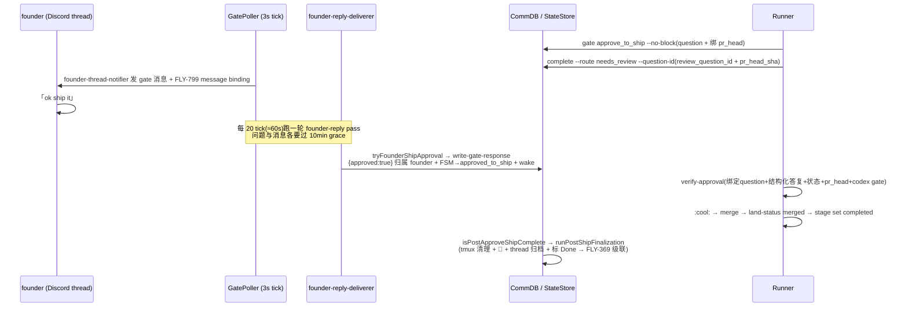

# FLY-945 founder 批准 → runner self-ship 断链 — 调研

Issue: FLY-945 (https://linear.app/geoforge3d/issue/FLY-945/bugworkflow-founder-批准没触发-runner-self-ship-lead-被迫-executor-merge)
日期: 2026-07-06
基于: exploration.md

Brainstorm gate 结论(Tadashi 确认):A+B = P0(10min grace 延迟 + head 漂移),C/D/E/F = P1 全要;
「真 Discord E2E 硬 gate」独立走 FLY-952。本文逐项落机制、给选型。

## 0. 现有链路地图(实测校准)

关键实测参数:
- `GatePoller` tick = 3s;founder-reply pass = 每 `DEFAULT_PATROL_EVERY_N_TICKS`(20)tick ≈ **60s 一轮**(`gate-poller.ts:238,582`)。
- grace 有**两处**:① pass 里 question 太年轻直接跳过(`now - createdMs < graceMs`,`gate-poller.ts:~1963`);② deliverer 消息循环里 `now - msgMs < graceMs` → **break 整个 thread 扫描**(`founder-reply-deliverer.ts:209`)。两处共用 `founderReplyDeliverGraceMs()` 默认 **10min**(`gate-poller.ts:1917`)。
- ✅-reaction 批准 pass 搭同一 patrol 节奏(每 20 tick),且**同样吃 10min grace**(`gate-poller.ts:2046` 用 `founderReplyDeliverGraceMs()` 过滤 gate);
  15s(`founderReactionCheckIntervalMs`)只是 per-question 的 reaction 复查节流,**不是**端到端延迟。
  即:当晚 Annie 就算 ✅-react 也一样要等满 grace——文字与 reaction 两条通道都压在同一个 10 分钟后面,Fix A 必须两条一起放行。
  (Codex design review R1 #6 纠正;03:07:30 的批准实为文字路径在 grace 到期后落库。)
- 文字批准分类:Tier-2 全句 allowlist(有 "ship it"/"批准" 等,「ok ship it」不在表内)→ Tier-3 分类器兜底。当晚正是 Tier-3 在 grace 到期后判 approve 的(03:07:30 落库,归属 Annie 的 Discord id)。

## A. ship-gate founder 文字消息去 grace(P0)

### 现状语义
grace 的设计初衷(FLY-605)是「Lead 先手 relay,Bridge 是 fallback」。但 approve_to_ship 的答复 Lead 被禁止代写
(respond.ts GATED_CHECKPOINTS fail-closed 走 Bridge),所以 ship gate 上这 10 分钟纯粹是空转延迟;
且 break 语义让**同 thread 后面的所有消息**都排在最早一条未成熟消息后面。

### 选型
- **A1(推荐):per-message 按 checkpoint 定 grace + 不 break 只 stop-advance。**
  deliverer 循环里,一条消息的适用 grace = 它 matching 的 pending questions 里各 checkpoint grace 的**最小值**
  (approve_to_ship → `shipGraceMs`,默认 ~15s,可 env 调;其他 checkpoint → 维持 10min)。
  未成熟消息:**不处理、cursor 不前进越过它**,但**继续处理它之后已成熟的 ship 消息**(把现在的 `break` 改成
  「记住不可推进点、循环继续」)。安全性靠既有幂等:一问一答 UNIQUE、gate-response 幂等重试、wake marker 去重
  ——重复扫描不会重复批准/重复 wake。question-level 的 10min 跳过(gate-poller 侧)同样按 checkpoint 分流:
  approve_to_ship question 立即可扫。
- A2:给 ship gate 单开一条快扫描线(仿 reaction pass)。否——同一 thread 两个 cursor 双读,归属与顺序耦合复杂,A1 改动更小。
- A3:全局把 grace 降到 15s。否——动了 FLY-605 非 ship relay 的 Lead 先手语义,超 scope。

### 端到端延迟预算(A1 后)
founder 发言 → ≤60s(pass 节奏)+ shipGraceMs(15s)≈ **最坏 ~75s,典型 ~40s**。与 reaction 路径同量级。
若还想更快可把 founder-reply pass 对「有 pending ship gate」的 project 提频,但 v1 不做(60s 已够,零新 timer 原则)。

### 触点
`gate-poller.ts`(question 过滤 + ctx 传参)、`founder-reply-deliverer.ts`(per-message grace + stop-advance 循环)、
新 env `FLYWHEEL_SHIP_GATE_GRACE_MS`(默认 15_000;`FLYWHEEL_FOUNDER_REPLY_DELIVER=0` 总开关不变)。

## B. head 漂移的感知与纠正(P0)

### 现状
- `complete --route needs_review` 时记 cwd HEAD 进 session.pr_head_sha;FLY-799 binding(`ship_gate_msg_binding`)同 sha。
- runner 之后再 push(当晚:QA 证据 commit)没有任何机制感知;02:51 的 `qa_result` 事件 payload 里就带着新 prHeadSha,Bridge 白白拿着证据。
- 批准落库绑旧 sha → verify `pr_head_sha_mismatch`,链条死。

### 选型
- **B1(推荐):就地刷新绑定(question 不变)。** Bridge 收到 **qa_result(status=pass)** 且
  `prHeadSha ≠ session.pr_head_sha`、session 是 `awaiting_review`、`review_question_id` 已绑、
  **且该 gate 尚无 response** 时:
  1) 更新 session.pr_head_sha;2) 更新 gate-message-binding 行;3) 在 thread **追发**一条
  「gate 更新:PR head 923c48d0 → 4ac0df03(QA 证据 commit),批准将绑新 head」(不 edit 原消息——founder 可能已读旧文,追发保知情权)。
  已有 response → **绝不改绑**(批准已定格在 founder 看到的 sha 上,走 C 的重 review 恢复)。
  触发源只认 qa_result(带 QA pass 证据的 head 才配被批),不做 GitHub push 监听(无 webhook 基建,超 scope)。
- B2:作废旧 question、Bridge 代 runner 开新 gate(question 轮换)。否——question 由 runner 创建是现有边界
  (gate.ts 还写 runner 侧 marker),Bridge 越俎代庖要伪造 from_agent + marker,新增一个跨信任域写者;
  B1 单写 + 幂等,复用「答复必须绑当前 review question」既有不变量。
- 说明:**verify-approval 一字不改**——它读的就是 session.pr_head_sha,B1 更新的正是这个可信侧。

### Codex hard gate 的连带(诚实边界)
verify 第 5 步(FLY-827)要求 codex_review_record 覆盖**当前 head**。B1 rebind 后,如果新 head 没有 codex 记录,
verify 会以 `codex_review_not_approved` 拦住——**这是正确的安全行为,不是 bug**。
当晚场景里 4ac0df03 只是 docs/证据 commit,runner 的正确动作是对新 head 补一轮(resume-based,增量便宜)codex review。
落到 runner 协议文本(见 F):「gate 开了以后原则上禁 push;确需 push(如补 QA 证据)→ 立刻补 codex review + 重发 qa_result,Bridge 会自动 rebind」。

### 触点
Bridge 的 qa_result 处理路径(event-route / auto-qa-coordinator 侧,research 定位:qa_result 进 `session_events`,
处理点在 flywheel-comm qa-result → Bridge 事件路由)+ `StateStore`(pr_head_sha setter + binding 更新)+
`gate-message-binding-store` + thread 追发(复用 founder-thread-notifier 的发消息件)。
新事件 `ship_gate_rebound`(审计)。kill-switch:`FLYWHEEL_SHIP_GATE_REBIND=0`。

## C. FSM 重 review 恢复边(P1)

### 现状
`workflow-fsm.ts:157`:`approved_to_ship: ["completed","blocked","failed","terminated"]` —— 没有回 awaiting_review 的边。
FLY-208 5a 把「approved_to_ship + completion 无 merge 证据」统一推成 completed+标记(evidence-gap),
三个 sink 一致映射:`event-route.ts:~1136`、`DirectEventSink.ts:~430`、`complete-marker-reconciler.ts:~205`。
它没区分「结束」和「我要重新请求 review」(route=needs_review **带新 question 绑定**)。

### 方案
FSM 加边 `approved_to_ship → awaiting_review`(仅 trigger=session_completed 且 route=needs_review 且**带新 review_question_id** 且无 merged landing);
三个 sink 的映射同步分叉:该组合 → awaiting_review + 重绑 question/pr_head(complete --question-id 已有的绑定写路径),
其余组合维持 FLY-208 5a 原样(completed + evidence-gap 标记)。
「带新 question」是关键判据:区分「runner 主动重开 review」与「runner 收尾但证据缺失」。
FLY-208 的教训直接适用:**映射改动必须四处同步**(complete.ts 提示文本也要跟)。

## D. 外部 merge 收敛兜底(P1)

### 现状与先例
- 收尾准入 `isPostApproveShipComplete`(post-ship-finalization.ts)要求 merged landing 证据或先前 approved_to_ship;executor-merge 两者皆无 → 收尾蒸发。
- FLY-742 stale-blocker guard 已确立语义先例:「merged/closed PR = founder 已决策 → auto-finalize 是系统健康清理,非 founder-gated」,
  且 plugin.ts:339 已有**权威 PR-state 检查件**可复用——但它只挂在 run-start 409 路径(被动)。

### 方案
> 注:本节是初版选型;**以 plan.md §4 为准**(design review R1 #4 / R2 #1 修正:只复用 FLY-742 的有界 gh 查询模式,
> 不复用其 finalizer;parked 走 FLY-869 pre-transition ship-eligibility,completed-but-unfinalized 走窄域恢复校验)。

GatePoller 挂一个低频 reconcile pass(复用现有 patrol 节奏,零新 timer):
1. **parked**(awaiting_review / approved_to_ship)session:核 PR 真实状态(复用 FLY-742 的 PR-state 检查件 + 其节流/TTL 习惯),
   MERGED → 走 ship-eligibility 校验后收尾(细节见 plan.md §4)→ `runPostShipFinalization` → FLY-369 级联。
2. **completed-but-unfinalized**(当晚残局形态):status=completed、有 pr_number/head、thread 未归档(archive-once 可查)、
   PR 实为 MERGED → 直接补跑 finalization(合成 merged landing 证据:gh 的 mergeCommit oid)。
   范围收敛:只扫近 N 天(env,默认 7)+ archive-once 去重,避免翻旧账。
边界:PR open/unknown → 什么都不做(不 alert——FLY-742 在它的路径已 alert;这里是收敛器不是告警器)。
CLOSED-未-merge → 不自动收(可能是 reject 场景,留 parked 流程)。
kill-switch:`FLYWHEEL_EXTERNAL_MERGE_RECONCILE=0`。定位:**兜底**,不是 executor-merge 的许可(F 同时退役它)。

## E. verify-approval 归属校验(P1)

### 现状(exploration §2 已实证)
verify-approval 不查 responseFrom;DECISION_MODE=off 时 gate-response 端点 pass-through,Lead 的
`respond <qid> '{"approved":true}'` 能通过全部校验。founder-only 目前是合同不是机制。

### 写入者归属盘点(comm.db response.from_agent 实测)
| 写入路径 | from_agent | E 之后 |
|---|---|---|
| FLY-799 文字/reaction(write-gate-response) | canonical founder id(Discord 雪花) | ✅ 放行 |
| `/api/actions/approve`(approveExecution,dashboard) | `"bridge"` | ✅ 放行(端点本身受 FLY-175 合同/未来 enforce 管) |
| gate-response pass-through(Lead respond) | leadId | ❌ 拒 |
| `FLYWHEEL_COMM_BYPASS_BRIDGE=1` 应急 | leadId | ❌ 拒(应急旁路对 E 也要显式开关,见下) |

### 方案
> 注:细节以 plan.md §5 为准(design review R1 #2 / R2 #2 修正:写侧同 PR 改——enforce-allow/bypass 写
> "bridge-founder-consent",audit_only 与 pass-through 保持写 leadId 且被读侧拒;可信集 = founder id /
> "bridge" / "bridge-founder-consent")。

verify-approval 在结构化校验后加一步:`responseFrom ∈ 可信集(见上注)`。
- canonical founder id 的本地解析:学 FLY-827 codex hard gate 的模式,从 `~/.flywheel/.env` 活读
  `DISCORD_OWNER_USER_ID`(runner 进程 env 是 spawn 快照,不可靠)。
- **id 解析不到 → 跳过该步**(等价 feature-off):没配 Discord founder 的项目不能被弄死。这是 fail-open,
  但保护目标(Lead 自批)在有 founder 配置的生产环境必然有 id;写清楚这个诚实边界。
- kill-switch `FLYWHEEL_FOUNDER_ATTRIBUTION_GATE=0`;**QA 房(FLY-115 slot 框架)靠它旁路**
  (slot env 注入,框架现有 lead-respond 路径不动)。新 reason:`response_not_founder_attributed`。
- 诚实边界②:`"bridge"` 放行意味着能打 `/api/actions/approve` 的本地进程仍可写批准——那扇门归 FLY-175
  DECISION_MODE=enforce(Track 3)管,E 不重复造。E 消灭的是**当晚那类**「Lead 用 respond 自批」的具体通路。

## F. Lead 纪律文本(P1,零代码)

`packages/teamlead/lead-rules-base/founder-only-authority.md` 增补(全 Lead 注入):
- executor-merge **退役**:founder 批准后 Lead 零动作(Bridge 自动归属批准、runner 自 ship);
  runner 卡住时 Lead 的动作 = 诊断/修机制/升级 Annie,**不是代 merge**。
- 引用本 issue 时间线作为反例教材(批准已在途、4 分钟后落库,executor-merge 反而撕断了自清理+自归档)。
同步:runner 侧协议文本(Blueprint APPROVE GATE 段)补「gate 后 push → 立即补 codex review + 重发 qa_result(触发 rebind)」一句。
Tadashi 自己的 agent memory 由他本人更新(issue 里他已自领,非本 PR 交付物)。

## 风险与开放问题(带进 plan)

1. **A1 的循环重写**是本次唯一动核心投递语义的点:必须保住三条不变量——at-least-once(cursor 绝不越过未处理成功的消息)、
   同一消息幂等重扫、非 ship 消息行为字节不变(10min grace 原样)。测试矩阵要覆盖「ship 成熟 + 前有未成熟非 ship」交错序。
2. **B1 与批准的竞态**:rebind 与 write-gate-response 并发 → 以「gate 已有 response 则不 rebind」+ 写侧现有
   expectedCurrentReviewQuestionId 校验兜住;最坏情形退化为现状(mismatch → C 恢复),不会更差。
3. **D 的 gh 调用预算**:低频 + 只扫 parked/近期 completed-unfinalized + 节流(复用 FLY-742 的 TTL 思路),避免 GatePoller 里打爆 gh。
4. **E 对既有 QA 框架的影响面**:FLY-115 slot、529 房驱动脚本里所有走 lead-respond 批准的用例都要配 `=0`;plan 里列 grep 清单。
5. byte-compat 姿势:A/B/D/E 全部带 kill-switch,默认值选择上 A/B(P0、本 issue 的直接修)默认 ON,D/E 默认 ON 但可关
   ——与「修 bug 默认生效」惯例一致;reverse-compat 测试锁 `=0` 时字节不变。
