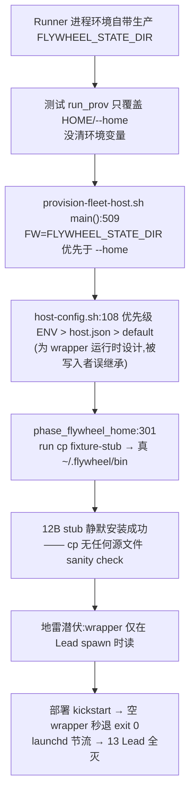

# FLY-954 provision 测试沙箱逃逸 — 探索

Issue: FLY-954 (https://linear.app/geoforge3d/issue/FLY-954/infraprovisioning-provision-测试沙箱逃逸-12-字节-stub-覆盖真-flywheelbin-三脚本2026)
日期: 2026-07-07
基于: 无

## 1. 事故回放(两次,不是一次)

| | 事故 1 | 事故 2 |
|---|---|---|
| 时间 | 2026-07-06 14:25:14 PT (21:25 UTC) | 2026-07-07 00:41:04 PT (07:41 UTC) |
| 肇事 session | FLY-648 runner `2f28bc9a` | FLY-648 runner `d5d27397` |
| 触发命令 | `cd ~/Dev/flywheel && bash scripts/__tests__/provision-fleet-host.test.sh`(21:25:10 UTC,与 mtime 秒级吻合;且是在**生产主 checkout** 上跑) | `git stash push -- provision-fleet-host.sh …; bash scripts/__tests__/provision-fleet-host.test.sh`(07:41:00 UTC —— 为验证修复效果 stash 掉自己的 fix 再跑旧版套件,再次逃逸) |
| 损害 | `~/.flywheel/bin/` 三件套 → 12 字节 stub | 三件套再次 stub 化 + `projects.json` → 207B fixture(`.CORRUPTED-20260707-0048` 备份可证) |
| 恢复 | 当晚 23:24 手动 cp 回三件套 | projects.json 00:48 恢复;**bin 三件套无人恢复**(见 §1.1) |
| 爆炸 | 22:37 FLY-543 部署 kickstart 全体 Lead → 13 Lead 下线 | 未爆(本 runner 抢先止血) |

**取证铁证**(transcript = `~/.claude/projects/-Users-xiaorongli-Dev-flywheel-FLY-648/`):
- stub 内容 `2321 2f62 696e 2f62 6173 680a`(`#!/bin/bash\n`,12 字节)与测试夹具 `echo '#!/bin/bash' > "$RR/scripts/$f"`(test.sh:99)逐字一致;
- 事故 2 的 session `d5d27397` 事后自查并向 Lead 自首(07:51 UTC "是我触发的,泄漏链条全部确认"),同一 session 提交了 env -i 加固(`test(FLY-954): harden … env -i jail per invocation`,随 FLY-648 PR #477 于 7-07 01:10 merge)。

### 1.1 本 runner 的止血动作(2026-07-07,设计阶段开工时)

取证中发现**事故 2 之后 bin 三件套一直没被恢复**——生产 `~/.flywheel/bin` 三个文件仍是 12 字节 stub(mtime 00:41:04),任何 Lead 重启即再度全灭。已按既定 runbook 从 `~/Dev/flywheel`(main)cp 恢复,checksum 与 repo 源逐字节一致(`d2f0356f`/`69ac1bd2`/`5c08083d`),stub 残骸保全至 session scratchpad 作证据,并已向 Lead 报告(ask id `922506c3`)。

## 2. 泄漏机制链(根因)

三个独立缺陷叠加,缺一次不炸:
1. **写入者信任继承环境**:provisioner 是「写入者」,却复用了为「运行时读取者」(wrapper)设计的 `ENV > host.json > default` 优先级。`--home` 指沙箱、env 指生产,两者矛盾时 env 静默获胜。
2. **安装零校验**:`cp` 什么都装——12 字节 shebang-only stub 静默安装成功,无尺寸/内容/与 repo 源一致性检查。
3. **无人对账**:「安装拷贝 == repo 源」这个不变量只存在人脑里,没有机器持续验证;地雷埋 8 小时无人知,事故 2 后又埋了 7+ 小时(直到本 runner 发现)。

## 3. 现状盘点(谁已修、谁还裸奔)

| 防线 | 状态 |
|---|---|
| 测试 env -i jail(darwin 套件每次调用走 `_iso_prov`) | ✅ 已 merge(FLY-648 PR #477) |
| memory 规则「Runner 绝不 host 上跑 provisioning 测试」 | ✅ 已录(软约束,靠自觉) |
| provisioner 写入侧对继承 env 的不信任 | ❌ 无 —— 任何非 env -i 的调用(手动跑、新写的测试、别的 repo 的脚本)仍会逃逸 |
| 安装前源文件 sanity check | ❌ 无(provisioner `cp` + `flywheel-daemon.sh::install_wrapper` 两个写入方都裸装) |
| 安装拷贝写保护 | ❌ 无(644,任何 `cp`/`>` 都能静默覆盖) |
| 持续收敛校验(bin vs repo 源) | ❌ 无 |
| 事故 2 后的生产恢复 | ✅ 本 runner 已止血(§1.1) |

## 4. 运行时架构现状(Annie 追问的「两套并存」)

| 消费者 | 指向 | 本次命运 |
|---|---|---|
| 13 个 Lead plist (`com.flywheel.lead.*`) | `~/.flywheel/bin/flywheel-lead-wrapper.sh`(bin 拷贝) | 💥 全灭 |
| Bridge plist | `~/Dev/flywheel/scripts/flywheel-bridge-wrapper.sh`(repo 直跑) | ✅ 幸存 |
| updater plist (`com.flywheel.updater`) | `~/Dev/flywheel/scripts/update-flywheel.sh`(repo 直跑) | ✅ 幸存 |
| bin 拷贝的合法写入方 | ① provisioner `:301`;② `flywheel-daemon.sh::install_wrapper`(原子 tmp+mv,仅 lead-wrapper) | — |

注意:生产机上 `bin/flywheel-bridge-wrapper.sh` 和 `bin/restart-services.sh` 当前**无 launchd 消费者**(Bridge/updater 走 repo),它们是 provisioner 为 fleet 新机装的可移植拷贝。真正扛着 13 条命的只有 `bin/flywheel-lead-wrapper.sh`。

**关键结构性事实(决定自愈挂载点)**:wrapper 坏掉时 `claude-lead.sh` 永远跑不起来(launchd → stub → 秒退),所以「Lead 启动时收敛」(FLY-913 模式)**救不了 lead-wrapper 本体**——自愈必须至少有一条不经过 wrapper 的路径(updater / restart-services / Bridge)。

## 5. 方案选项

### 防线 1:根治写入源(provisioner 不再信任继承 env)

- **A(推荐)— 写入者显式化**:provisioner 启动即 `unset FLYWHEEL_STATE_DIR FLYWHEEL_DIR`(打 warn 记录曾继承),自定义 state dir 只接受新 CLI flag `--state-dir`(host.json 的 stateDir 仍然生效——那是显式落盘配置,不是环境污染)。矛盾不可能发生:写入目标只由 CLI + host.json 决定。测试改传 `--state-dir`(env -i jail 保留,双保险)。
- **B — 矛盾检测**:保留 env 优先级,但 `--apply` 时若 `FLYWHEEL_STATE_DIR` 与 `--home` 推导值不一致 → die。防住本次形态,但「env 与 --home 恰好都指生产」时仍静默,且逻辑分支多。
- 弃 B 选 A:A 是结构性消除(污染源进不来),B 是症状检测。

**测试入口硬断言**(issue 要求):两个套件(darwin + linux)开头断言 `_iso_prov` 产出的子进程 HOME ≠ 真用户 HOME(防未来有人绕过 helper 直接调 `$PROVISION`),并 grep 断言测试文件内除 helper 外无裸 `bash "$PROVISION"` 调用(已有先例 07:56 UTC 的自查命令)。

### 防线 2:安装前源文件 sanity check(fail-loud)

共享函数 `assert_sane_script_source <src>`(落 `scripts/lib/`):尺寸下限(如 ≥1KB,三件套实际 6.8K/9.2K/57.9K)+ 非 shebang-only(去注释空行后有实体行)。装入方:provisioner `:299` 循环 + `flywheel-daemon.sh::install_wrapper`。不满足 → die,绝不静默装。
(不做「与 repo git HEAD diff」:安装源本来就是 repo checkout,capture/provision 语境下可能是任意 commit,校验「内容健康」而非「等于某个版本」。)

### 防线 3:安装拷贝写保护 chmod 444

安装完成后 `chmod 444`;合法写入方流程 = tmp 写 + `mv` 原子替换 + `chmod 444`(mv 不受目标文件权限影响,写入方无需先解锁)。效果:意外 `cp`/`>` 当场 EACCES fail-loud——本次事故路径(provisioner 的 `cp`)正是被这层挡住的形态。
- 弃 `chflags uchg`:macOS-only(linux fleet 目标不可用)、连 mv 都挡(合法安装方也要 unchg,运维困惑)、收益重叠。444 + 防线 4 兜底足够。

### 防线 4:持续收敛校验(FLY-913 anti-drift 模式,「可选」升「必做」)

单一收敛脚本 `scripts/converge-flywheel-bin.sh`(单一真相,幂等):对三件套逐个 checksum 对比 repo 源 → 不一致则原子修复(tmp+mv+444)+ 一条 Discord 告警(带差异摘要;修复即报,低频场景不需要 FLY-220 式 episode 机制)。挂载点三处:
- **a. claude-lead.sh 每次 Lead 启动**(FLY-913 同款调用形态,非致命 WARN)——日常漂移收敛;
- **b. update-flywheel.sh**(每日 00:00/12:00 定时 + 每次 self-ship deploy)——**wrapper 全灭时的自愈路径**(updater plist 指 repo,不依赖 bin);
- **c. restart-services.sh 部署流程内、kickstart Lead 之前**——本次 22:37 的爆炸形态(部署踩雷)从此结构性不可能:部署前 bin 必然先被收敛。

### 防线 5(架构拍板):统一 plist 指向?

- **现状**:Lead → bin 拷贝,Bridge/updater → repo 直跑。两套并存是漂移不是设计。
- **推荐:本 issue 不动 plist 指向,只落「bin == repo 源」机器不变量(防线 2/3/4)**。理由:① 防线 4 的收敛器就是「对照真相」的机器化,两套并存的漂移风险被它消掉了大半;② Bridge cutover 到 bin 拷贝需要 Bridge 重启窗口(Tier 风险)且本次事故里 repo 直跑是幸存方,现在迁移是拿生产稳定性换纯度;③ fleet 可移植性收益在 FLY-519/650 新机 provisioning 语境兑现,与本机 plist 无关。方向上(fleet 多机)终局是统一 bin 拷贝 + 完整性校验,建 follow-up issue 挂到 provisioning 系列,等 fleet 真有第二台机器时做。

## 6. scope 外(明确不做)

- Bridge plist cutover(→ follow-up issue,理由见防线 5);
- `~/.flywheel/bin` 里三件套之外的脚本(discord-reply-enforcer.py、skills-sync.sh 等各有自己的安装器/收敛器,FLY-913 已覆盖 restart-guard);
- projects.json 的写保护(它是运行时可变状态,不是「安装拷贝」,不适用本不变量;它的防护 = 防线 1 根治写入源);
- 通用「任意测试写真 HOME」防护(那是 harness 级课题,本 issue 只结构性封死 provisioning 一族)。

## 7. 待 Lead 拍板

1. 防线 1 选 A(unset env + `--state-dir` flag)还是 B(矛盾检测)?—— 推荐 A。
2. 防线 5:本 issue 不动 plist 指向、只落机器不变量 + follow-up issue —— 认可?
3. 收敛告警走 `lead-alert.sh` 既有告警管道(claims.db 去重)还是 updater 的 `notify_discord` 直发模式?—— 倾向复用 `lead-alert.sh`(FLY-368 统一告警频道方向一致)。
