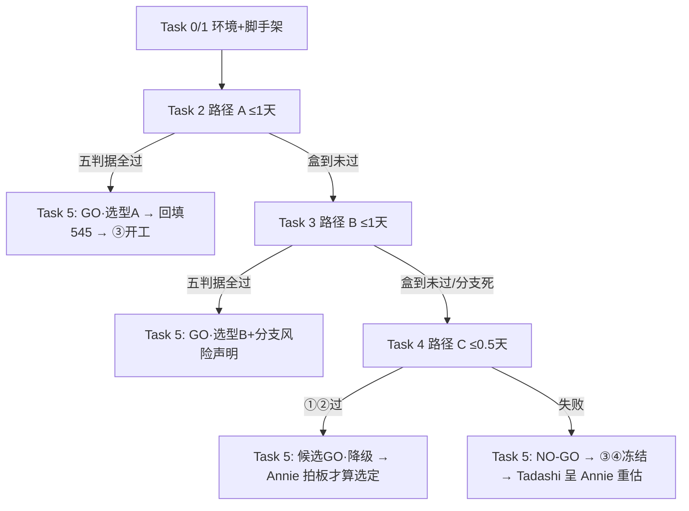

# FLY-960 STT spike:bot 在强制 DAVE 下收音 go/no-go — 实施计划

Issue: FLY-960 (https://linear.app/geoforge3d/issue/FLY-960/voice闸-stt-spike-bot-在-discord-vc强制-dave-加密收音-gono-go-真机验证-全树闸)
日期: 2026-07-07
基于: research.md

> **For agentic workers:** 本计划由三段式 pipeline 的 IMPLEMENT 阶段 Runner 执行(同分支)。
> 步骤用 checkbox 跟踪;每完成一个 Task 更新 progress.md(flywheel-comm progress)。

**Goal:** 真机回答一个二值问题——耳朵 bot 能否在强制 DAVE E2EE 的 Discord VC 里可靠收音
→ 产出 go/no-go + 选型,回填 FLY-545;NO-GO 则 ③④ 冻结、报 Annie。

**Architecture:** 时间盒 spike。按 A→B→C 顺序真机验证(research.md §7 定序),每路径硬时间
盒、盒到即停;全部证据落 `engineering/doc/FLY-960-stt-dave-spike/evidence/`;spike 代码落
`engineering/spike/FLY-960-dave-stt/`(不进 pnpm workspace,零生产代码改动)。

**Tech Stack:** Node 20 + discord.js 14.x + @discordjs/voice **0.19.2**(pin)+
@snazzah/davey 0.1.12 + prism-media;(B 路径才用)Python 3.11 + py-cord 未合入分支;
(C 路径才用)BlackHole 2ch + ffmpeg avfoundation;STT 用 Gemini API 文件转写(GEMINI_API_KEY 已有)。

---

## §0 执行者须知(先读)

1. **这是 spike,不是产品代码**:目标是**证据**,不是代码质量。TDD 豁免(被测对象是外部
   生态行为,「测试」就是真机验证协议本身);但**证据纪律不豁免**——每个判据都要有可复核
   的产物(录音文件 / 日志 / 截图 / transcript),QA 阶段会独立复跑。
2. **改的东西**:只允许新增 `engineering/spike/FLY-960-dave-stt/**` 和
   `engineering/doc/FLY-960-stt-dave-spike/**`。**不碰 `packages/voice-core`**(FLY-959
   并行在修)、不碰任何生产代码。PR = spike 代码 + 文档 + 证据。
3. **时间盒总控(硬)**:A ≤ 1 个工作日;B ≤ 1 天;C ≤ 0.5 天;总 ≤ 3 天。盒到即停:把
   已有证据写进 evidence/、在 progress.md 记「路径 X 盒到,证据至 <文件>」,进下一路径。
   **任一路径达成 GO 判据 → 立即跳 Task 5(不再跑后续路径)。**
4. **GO 判据(exploration §3.1,五条)**:①可懂解密音频 ②STT 中英混说可辨认 ③≥10min
   含一次 rejoin/重连 ④per-speaker 分离(A/B 必须;C 豁免+标降级) ⑤DAVE 真在场证据
   (`dave_protocol_version>0` 日志 + davey/E2EE 会话日志 + 客户端 E2EE 标识截图)。
   NO-GO = 三路径各自盒内均未达成 ①+②。
5. **升级路径**:环境/权限卡住(如测试 VC 没建)→ `flywheel-comm ask` Tadashi,**继续**做
   不被阻塞的部分(desk 准备、脚手架),周期性 `flywheel-comm check`。真死路才 blocked。
6. **implement 开跑前 5 分钟**:刷一遍 upstream 现状(research.md §3/§4 的时效声明)。
   **macOS 没有 GNU `timeout`** —— 统一用这个有界执行 helper(先贴进 shell):
   ```bash
   bounded() { /usr/bin/perl -e 'alarm shift; exec @ARGV' "$@"; }   # bounded <秒> <命令...>
   ```
   然后 `bounded 20 gh api repos/discordjs/discord.js/issues ...` 搜 0.19.2 之后新开的 DAVE
   issue、`bounded 20 gh api repos/Pycord-Development/pycord/pulls/3159` 看 B 路径分支是否已
   merge/烂尾。有实质变化(如 A 路径又出新收音 bug)→ 在 progress.md 记录并按 §9 决策树调整。
   **所有网络刷新命令一律 bounded 且失败不阻塞**:GitHub/npm 不可达 → 在 `evidence/00-env.md`
   记「refresh failed: <命令> <错误>」,按 research.md 已审计状态继续——真机 DAVE 测试才是主线,
   别死在情报刷新上。
7. **flywheel-comm 调用形态**:bare `flywheel-comm` 不在 PATH 上;一律用 **main checkout**
   完整形式 `node /Users/xiaorongli/Dev/flywheel/packages/flywheel-comm/dist/index.js <子命令>`
   (本文档下文的 `flywheel-comm ask/check/progress` 均指这个完整形式)。**为什么是 main
   checkout 而不是本 worktree 构建**:这是 Bridge 给 Runner 注入的钦定调用形态,main checkout
   dist = 已部署版本,与生产 Bridge/CommDB 的契约一致;本 worktree 没有(也不需要)自己的
   dist。Step 0.3 会做一次存在性自检,缺了才升级问 Tadashi。

## Task 0:一次性前置(环境 + 身份 + 场地)

**Files:** 无代码;产出 = 环境就绪清单写进 `evidence/00-env.md`。

- [ ] **Step 0.1 claim 两个 pool bot + token 装载(不回显)**(耳朵 + 发送):
  ```bash
  bash scripts/discord-bot-pool.sh claim flywheel-pool-04 fly960-ears
  bash scripts/discord-bot-pool.sh claim flywheel-pool-05 fly960-sender
  bash scripts/discord-bot-pool.sh invite-url flywheel-pool-04   # 生成邀请链接(含 Connect/Speak 权限)
  bash scripts/discord-bot-pool.sh invite-url flywheel-pool-05
  # token 装载:claim 只改本地 pool 状态,token 本体在 slot 目录文件里;导出到 env、绝不 echo/落盘:
  export FLY960_EARS_TOKEN="$(cat ~/.flywheel/discord-bot-pool/flywheel-pool-04/token)"
  export FLY960_SENDER_TOKEN="$(cat ~/.flywheel/discord-bot-pool/flywheel-pool-05/token)"
  test -n "$FLY960_EARS_TOKEN" && test -n "$FLY960_SENDER_TOKEN" && echo TOKENS_LOADED
  # (若 slot 目录布局不同:bash scripts/discord-bot-pool.sh verify flywheel-pool-04 或读
  #  scripts/lib/discord-bot-pool-lib.sh 确认 token 文件真实路径——修路径,不改流程)
  ```
  预期:`TOKENS_LOADED`。`evidence/00-env.md` 只记 slot 名 + `TOKENS_LOADED` 字样,**永不记
  token 内容(含 masked 形式也不记)**。⚠️ `pool.json.display_name` 不随 rename 同步,以
  slot id 为准。spike 结束后**不 release**(FLY-545 的耳朵 bot 大概率沿用)。
- [ ] **Step 0.2 场地(需 founder/Lead 一次性动作,提前发 ask、别等)**:
  `flywheel-comm ask` Tadashi:「FLY-960 spike 需要:测试 Discord server 里建一个语音频道
  #fly960-spike + 用两个 invite-url 把 pool-04/05 两个 bot 拉进 server(1 分钟)。装好回我频道
  ID。」等待期间继续 Task 1(脚手架不依赖场地)。
- [ ] **Step 0.3 本机 env 自检(Node 版本 + ffmpeg + comm 通道 + GEMINI key 硬解析)**:
  ```bash
  cat .node-version                       # repo 钉的 Node 大版本(当前 22)
  node --version                          # 若非 22.x:优先 mise/nvm 切到 22(避免
                                          # @discordjs/opus 原生模块在过新 Node 上无 prebuild);
                                          # 切不动→记录偏差,依赖 Task 1 的 opusscript 纯 JS 兜底
  ffmpeg -version | head -1
  # comm 通道自检(§0 note 7 的 main-checkout 形态):
  test -f /Users/xiaorongli/Dev/flywheel/packages/flywheel-comm/dist/index.js \
    && echo FWCOMM_OK || echo "FWCOMM_MISSING — ask Tadashi(main checkout dist 缺失,别自己乱建)"
  # GEMINI_API_KEY 真·解析链(逐级 export,找到即停;只记来源标签,绝不记值):
  resolve_gemini() {
    [ -n "$GEMINI_API_KEY" ] && { echo "GEMINI_OK source=shell"; return; }
    set -a; source ~/.flywheel/.env 2>/dev/null; set +a
    [ -n "$GEMINI_API_KEY" ] && { echo "GEMINI_OK source=flywheel-env"; return; }
    [ -n "$GOOGLE_API_KEY" ] && { export GEMINI_API_KEY="$GOOGLE_API_KEY"; echo "GEMINI_OK source=GOOGLE_API_KEY"; return; }
    [ -n "$NANOBANANA_GEMINI_API_KEY" ] && { export GEMINI_API_KEY="$NANOBANANA_GEMINI_API_KEY"; echo "GEMINI_OK source=NANOBANANA"; return; }   # 543 QA 实际借用的 key(poc-converse.md)
    # voice-core 的 config 约定:FLYWHEEL_VOICE_GEMINI_KEY_ENV 存的是"env 变量名",要解引用:
    if [ -n "$FLYWHEEL_VOICE_GEMINI_KEY_ENV" ]; then
      eval "v=\${$FLYWHEEL_VOICE_GEMINI_KEY_ENV}"
      [ -n "$v" ] && { export GEMINI_API_KEY="$v"; echo "GEMINI_OK source=voice-core-env-indirect"; return; }
    fi
    echo GEMINI_MISSING
  }
  resolve_gemini
  ```
  `GEMINI_MISSING`(543 QA 期间就有这个坑,poc-converse.md 有记载)→ **立即 `flywheel-comm
  ask` Tadashi 要 key 的装载路径**,同时继续 Task 1 的 1.1/1.2(转写要到 Task 2.3 才第一次
  用,不阻塞脚手架);key 到位的证明 = Step 1.4 的 `node transcribe.mjs ref/ref-48k.wav`
  真跑通;key 到位前不得进入 Step 2.3 的判据②验证。
- [ ] **Step 0.4 写 `evidence/00-env.md`**:记 bot slot、频道 ID、Node/ffmpeg/依赖版本、
  GEMINI key 解析结果(OK/来源级别,不记值)、upstream 刷新结果(成功摘要或「refresh failed」)、日期。

## Task 1:spike 脚手架 + 参考音频 + 转写器

**Files:**
- Create: `engineering/spike/FLY-960-dave-stt/package.json`
- Create: `engineering/spike/FLY-960-dave-stt/ref/ref-script.txt`
- Create: `engineering/spike/FLY-960-dave-stt/transcribe.mjs`
- Create: `engineering/spike/FLY-960-dave-stt/README.md`(复现说明,QA 用)

- [ ] **Step 1.1 初始化 spike 包**(独立于 pnpm workspace;`pnpm-workspace.yaml` 只含
  `packages/*`,天然不吸入):
  ```bash
  mkdir -p engineering/spike/FLY-960-dave-stt/{ref,out}
  cd engineering/spike/FLY-960-dave-stt
  cat > package.json <<'EOF'
  {
    "name": "fly960-dave-stt-spike",
    "private": true,
    "type": "module",
    "dependencies": {
      "discord.js": "^14.25.1",
      "@discordjs/voice": "0.19.2",
      "opusscript": "^0.1.1",
      "prism-media": "^1.3.5"
    }
  }
  EOF
  npm install                              # 基础依赖里刻意不含原生模块,保证装得上
  # 原生 opus 单独装、失败不阻塞(prism 自动退 opusscript 纯 JS,慢但够 spike 用):
  npm install @discordjs/opus || echo "native opus unavailable; using opusscript"
  node -e "console.log(require('./node_modules/@snazzah/davey/package.json').version)"
  node -e "new (require('@discordjs/opus').OpusEncoder)(48000,2); console.log('decoder=native-opus')" \
    2>/dev/null || echo "decoder=opusscript"
  ```
  预期:安装成功;davey 版本打印(0.1.10+,随 voice 0.19.2 预装)。**版本 pin + 实际生效的
  decoder(native-opus / opusscript)都记进 README 和 evidence/00-env.md**。
- [ ] **Step 1.2 参考脚本(中英混说,5 句,STT 判据的 ground truth)** —— `ref/ref-script.txt`:
  ```text
  第一句:把 FLY-545 的 voice bridge 排上,明天先跑 smoke test。
  第二句:这个 PR 的 CI 已经绿了,等 Annie 确认之后再 ship。
  第三句:Huddle 模式的 latency 目标是首音八百毫秒以内。
  第四句:如果 DAVE 解密失败,今晚就切到 fallback 方案。
  第五句:让 Tadashi 把 worktree 建好,然后开始 TDD。
  ```
  每句抽 3 个关键词(如 FLY-545 / voice bridge / smoke test)列进 README 的比对表;
  判「可辨认」= 关键词命中 ≥ 80%(15 个里中 12 个)。
- [ ] **Step 1.3 生成参考音频**:
  ```bash
  python3 -m pip install --user edge-tts
  edge-tts --voice zh-CN-XiaoxiaoNeural --file ref/ref-script.txt --write-media ref/ref.mp3
  ffmpeg -y -i ref/ref.mp3 -ar 48000 -ac 2 ref/ref-48k.wav
  afplay ref/ref-48k.wav   # 人耳抽查一遍:5 句都清楚
  ```
  (edge-tts 不可用的 fallback:`say -v Tingting -o ref/ref.aiff -f ref/ref-script.txt` 再转 wav,
  英文词发音差些但关键词判据不受影响。)
- [ ] **Step 1.4 转写器 `transcribe.mjs`**(收音是被验对象,STT 用现成 Gemini;输入 wav,输出文本):
  ```js
  // usage: node transcribe.mjs out/xxx.wav > out/xxx.txt
  import { readFileSync, existsSync } from "node:fs";
  const [, , wavPath] = process.argv;
  const key = process.env.GEMINI_API_KEY;
  if (!key) { console.error("FATAL: GEMINI_API_KEY 未设置 — 按 plan Step 0.3 解析链装载"); process.exit(2); }
  if (!wavPath || !existsSync(wavPath)) { console.error(`FATAL: wav 不存在: ${wavPath}`); process.exit(2); }
  const b64 = readFileSync(wavPath).toString("base64");
  const res = await fetch(
    `https://generativelanguage.googleapis.com/v1beta/models/gemini-2.5-flash:generateContent?key=${key}`,
    {
      method: "POST",
      headers: { "content-type": "application/json" },
      body: JSON.stringify({
        contents: [{ parts: [
          { text: "逐字转写这段音频(中英混说,保留英文原词),只输出转写文本:" },
          { inlineData: { mimeType: "audio/wav", data: b64 } },
        ] }],
      }),
    },
  );
  const j = await res.json();
  if (!res.ok) { console.error(JSON.stringify(j)); process.exit(1); }
  console.log(j.candidates?.[0]?.content?.parts?.map((p) => p.text).join("") ?? "");
  ```
  自检:`node transcribe.mjs ref/ref-48k.wav`,预期 5 句关键词全中(这同时校准了「STT 上限」,
  收音轮的命中率以此为基线打折比较)。
- [ ] **Step 1.5 Commit**:
  ```bash
  git add engineering/spike/FLY-960-dave-stt
  git commit -m "spike(FLY-960): scaffold — ref audio + transcriber (no production code)"
  ```

## Task 2:路径 A — @discordjs/voice 0.19.2 耳朵 bot(时间盒 1 天)

**Files:**
- Create: `engineering/spike/FLY-960-dave-stt/ears-a.mjs`(耳朵 bot)
- Create: `engineering/spike/FLY-960-dave-stt/sender.mjs`(参考音源 bot)
- 产出: `engineering/doc/FLY-960-stt-dave-spike/evidence/a-*/`

- [ ] **Step 2.1 耳朵 bot `ears-a.mjs`**(骨架 = #11419 里 stevenpetryk 的最小 repro +
  DAVE 证据采集;确切的 davey 事件面在跑起来后按 debug 输出调整——验收看日志内容,不看 API 形状):
  ```js
  // usage: DISCORD_TOKEN=$FLY960_EARS_TOKEN node ears-a.mjs <guildId> <channelId>
  // 控制面:kill -USR1 <pid> → 受控 destroy+重join(稳定轮用);所有状态/关闭码进 a-debug.log
  import { Client, GatewayIntentBits } from "discord.js";
  import {
    joinVoiceChannel, entersState, VoiceConnectionStatus, EndBehaviorType,
  } from "@discordjs/voice";
  import prism from "prism-media";
  import { createWriteStream, appendFileSync } from "node:fs";
  import { pipeline } from "node:stream/promises";

  const [, , guildId, channelId] = process.argv;
  if (!process.env.DISCORD_TOKEN) { console.error("FATAL: DISCORD_TOKEN 未设置"); process.exit(2); }
  const LOG = "out/a-debug.log";
  const log = (m) => appendFileSync(LOG, `${new Date().toISOString()} ${m}\n`);

  const client = new Client({ intents: [GatewayIntentBits.Guilds, GatewayIntentBits.GuildVoiceStates] });
  client.on("debug", (m) => log(`[client] ${m}`));
  await client.login(process.env.DISCORD_TOKEN);
  const guild = await client.guilds.fetch(guildId);

  let conn;
  function wireReceiver() {
    conn.receiver.speaking.on("start", (userId) => {
      log(`[speaking] start ${userId}`);
      const t = Date.now();
      const opus = conn.receiver.subscribe(userId, {
        end: { behavior: EndBehaviorType.AfterSilence, duration: 1500 },
      });
      const ogg = new prism.opus.OggLogicalBitstream({
        opusHead: new prism.opus.OpusHead({ channelCount: 2, sampleRate: 48000 }),
      });
      pipeline(opus, ogg, createWriteStream(`out/a-${userId}-${t}.ogg`))
        .then(() => log(`[capture] wrote out/a-${userId}-${t}.ogg`))
        .catch((e) => log(`[capture-error] ${e.message}`));
    });
  }
  async function join() {
    conn = joinVoiceChannel({
      guildId, channelId, adapterCreator: guild.voiceAdapterCreator,
      selfDeaf: false, selfMute: true, debug: true,
    });
    conn.on("debug", (m) => log(`[voice] ${m}`));   // session description / dave 行都从这里进日志
    conn.on("stateChange", (o, n) => {
      const code = n.reason !== undefined ? ` reason=${n.reason}` : "";
      const close = n.closeCode !== undefined ? ` closeCode=${n.closeCode}` : "";
      log(`[state] ${o.status} -> ${n.status}${code}${close}`);
    });
    conn.on("error", (e) => log(`[error] ${e.stack}`));
    await entersState(conn, VoiceConnectionStatus.Ready, 15_000);
    log("READY");
    wireReceiver();
  }
  process.on("SIGUSR1", async () => {           // 受控 rejoin(稳定轮 A-4 用)
    log("[control] SIGUSR1 -> destroy + rejoin in 5s");
    conn.destroy();
    setTimeout(() => join().catch((e) => log(`[rejoin-error] ${e.message}`)), 5000);
  });
  await join();
  console.log(`ears-a up, pid=${process.pid} (kill -USR1 触发受控 rejoin)`);
  ```
- [ ] **Step 2.2 发送 bot `sender.mjs`**(发送侧已知安全,当自动化参考音源):
  ```js
  // usage: DISCORD_TOKEN=$FLY960_SENDER_TOKEN node sender.mjs <guildId> <channelId> <audioFile>
  import { Client, GatewayIntentBits } from "discord.js";
  import {
    joinVoiceChannel, entersState, VoiceConnectionStatus,
    createAudioPlayer, createAudioResource, AudioPlayerStatus,
  } from "@discordjs/voice";
  const [, , guildId, channelId, file] = process.argv;
  const client = new Client({ intents: [GatewayIntentBits.Guilds, GatewayIntentBits.GuildVoiceStates] });
  await client.login(process.env.DISCORD_TOKEN);
  const guild = await client.guilds.fetch(guildId);
  const conn = joinVoiceChannel({ guildId, channelId, adapterCreator: guild.voiceAdapterCreator });
  await entersState(conn, VoiceConnectionStatus.Ready, 15_000);
  const player = createAudioPlayer();
  conn.subscribe(player);
  player.on(AudioPlayerStatus.Idle, () => setTimeout(() => player.play(createAudioResource(file)), 3000));
  player.play(createAudioResource(file));
  console.log("sender playing on loop");
  ```
- [ ] **Step 2.3 A-1 收音轮(bot↔bot,自动化)**:两个终端分别跑 ears-a 与 sender(同一
  VC)。预期:`out/a-debug.log` 出现 READY + speaking start;`out/a-*.ogg` 生成。转 wav +
  转写:
  ```bash
  ffmpeg -y -i out/a-<sender>-<t>.ogg -ar 16000 -ac 1 out/a-take1.wav
  afplay out/a-take1.wav                      # 判据①:人耳可懂
  node transcribe.mjs out/a-take1.wav | tee out/a-take1.txt   # 判据②:关键词≥80%
  ```
  失败形态对照:log 里 `DecryptionFailed(UnencryptedWhenPassthroughDisabled)` = #11419 同款
  (说明 0.19.2 没修干净)→ 记全 log,进 Step 2.7 深挖或换路径。
- [ ] **Step 2.4 A-2 DAVE 真在场取证(判据⑤)** —— 产出 `out/a-dave-proof.jsonl` + 截图:
  1. 先查 debug 日志自然产出:
     ```bash
     grep -in "dave\|e2ee\|mls\|epoch\|session description" out/a-debug.log | head -40
     ```
  2. **若 debug 行不含 `dave_protocol_version`,按以下配方给 node_modules 打一次性取证补丁**
     (只改 spike 目录自己的 node_modules,随 `npm ci` 即逝、不进 git):
     ```bash
     grep -n "dave_protocol_version\|sessionDescription\|session_description" \
       node_modules/@discordjs/voice/dist/index.mjs | head
     # 在处理 voice gateway op4 (Session Description) 的位置后插一行(行号以 grep 结果为准):
     #   require/import 均不可用时用全局 process 写法:
     #   process.stdout.write("");  // 占位——实际插入下面这行
     #   (await import("node:fs")).appendFileSync("out/a-dave-proof.jsonl",
     #     JSON.stringify({t:Date.now(),type:"session_description",payload:<该作用域的包变量>})+"\n");
     # 同法在 grep "davey\|DAVESession\|prepareEpoch\|executeTransition" 命中的
     # epoch/commit 处理点插 {type:"dave_epoch",...} 行。
     ```
     补丁后重跑一轮 A-1,`out/a-dave-proof.jsonl` 必须出现:
     `session_description` 且 `dave_protocol_version > 0`;≥1 条 `dave_epoch` 事件。
  3. 任何一个真人类客户端(见 A-3)进频道后,截 Discord 客户端的 E2EE 标识 →
     `evidence/a-2-e2ee-badge.png`。
  **硬规则**:三件套(jsonl 里的 protocol version / epoch 事件 / 截图)不齐 → 报告里写
  「DAVE proof unavailable」并说明缺哪件,**不许**凭「有声音 + 截图」推断标 GO。
- [ ] **Step 2.5 A-3 真人类客户端轮(会话构成贴产品)**:一个真 Discord 客户端(桌面/手机)
  进同一 VC(在场即可,先不要求说话)→ 重跑 A-1。预期:成员变动触发 MLS epoch 前进后,
  **收音仍连续**(#11441 指控的 key 轮换掉帧就在这一刻检验)。有人说话更好:抓真人音轨
  per-speaker 文件,transcribe 一并归档。
- [ ] **Step 2.6 A-4 稳定轮(判据③,量化定义)**:sender 循环播放 ≥10 分钟(每 loop =
  5 句参考音 ~30s + 3s 静默间隙,预期 ≥15 个 loop、每 loop 产 1 个 capture 文件——receiver
  的 1.5s AfterSilence 会按 loop 切文件,**多文件是预期形态,不是断流**)。期间注入三次扰动:
  真客户端进、出各一次(MLS epoch 轮换×2)+ `kill -USR1 <ears pid>` 一次(受控 destroy+
  5s 后重 join)。**通过定义**:①每个 loop(扰动当刻的 loop 除外)都有 capture 文件且抽测
  transcript 关键词 ≥80%;②扰动后 ≤2 个 loop 内恢复捕获;③`[capture-error]`=0 或逐条可
  解释;④`[state]` 日志能对上三次扰动(含 closeCode/reason)。产出
  `evidence/a-4-stability.md`:loop 时间线表(loop# / 时刻 / 文件 / 抽测结果 / 扰动标注)+
  log 摘录——这张表同时就是 FLY-545「重连与 session 重建行为」实现约束的原始数据。
- [ ] **Step 2.7 判定与整理**:五条判据全过 → **GO,选型 = A**,把 out/ 里关键产物(≥2 个
  wav + transcript + debug log + 截图)拷进 `engineering/doc/FLY-960-stt-dave-spike/evidence/a-*`,
  commit,跳 Task 5。未过且盒未到 → 允许**一次**限定深挖(如 bump 到 dev 版
  `@discordjs/voice@0.19.3-dev` 复测、或对照 #11419 的 repro 差异);盒到 → 证据归档,进 Task 3。
  ```bash
  git add engineering/spike/FLY-960-dave-stt engineering/doc/FLY-960-stt-dave-spike/evidence
  git commit -m "spike(FLY-960): path A real-machine evidence (@discordjs/voice 0.19.2)"
  ```

## Task 3:路径 B — py-cord 未合入分支耳朵 bot(仅 A 失败;时间盒 1 天)

**Files:**
- Create: `engineering/spike/FLY-960-dave-stt/ears-b/`(requirements.txt + ears_b.py)
- 产出: `evidence/b-*/`

- [ ] **Step 3.1 进入前置刷新**:`bounded 20 gh api repos/Pycord-Development/pycord/pulls/3159`
  (bounded = §0 note 6 的 helper)+ 搜 4-7 月新收侧 PR。**若 #3159 已 merge 进 master/新
  release → 装 release 版而非分支**;若烂尾且无替代分支 → 评估 fix/voice-rec-2;两者都不可用
  → B 直接判死(记原因),进 Task 4。GitHub 不可达 → 按 research.md §4 已审计状态直接用
  refs/pull/3159/head,失败原因记 `evidence/00-env.md`。
- [ ] **Step 3.2 装分支 + 耳朵 bot**:
  ```bash
  mkdir -p engineering/spike/FLY-960-dave-stt/ears-b engineering/spike/FLY-960-dave-stt/out
  cd engineering/spike/FLY-960-dave-stt/ears-b
  python3 -m venv .venv && source .venv/bin/activate
  # 分支引用不猜:直接用 PR head ref,并把解析到的 commit SHA 记进取证文件。
  # pipefail + SHA 校验:空 lock 文件不许当证据(macOS 无 timeout,用 §0 的 bounded)
  set -o pipefail
  bounded 20 git ls-remote https://github.com/Pycord-Development/pycord refs/pull/3159/head \
    | tee pycord-ref.lock                       # <sha>\trefs/pull/3159/head
  grep -qE "^[0-9a-f]{40}\b" pycord-ref.lock && echo REF_LOCKED \
    || { echo "UNRESOLVED refs/pull/3159/head ($(date -u +%FT%TZ))" > pycord-ref.lock; echo REF_UNRESOLVED; }
  pip install "py-cord[voice] @ git+https://github.com/Pycord-Development/pycord@refs/pull/3159/head"
  pip freeze | grep -i "py-cord\|dave" >> pycord-ref.lock   # 版本/commit 取证
  # (Step 3.1 若判定改用 fix/voice-rec-2 或已发布版,替换上面的 ref/包名并同样记 lock)
  ```
  `ears_b.py`(sinks 天然 per-user 分轨;输出统一写 spike 根的 out/):
  ```python
  # usage: DISCORD_TOKEN=$FLY960_EARS_TOKEN python ears_b.py <guildId> <channelId>
  import asyncio, os, sys, time, pathlib, discord
  guild_id, channel_id = int(sys.argv[1]), int(sys.argv[2])
  OUT = pathlib.Path(__file__).resolve().parent.parent / "out"   # spike 根 out/
  bot = discord.Bot(intents=discord.Intents.default())

  @bot.event
  async def on_ready():
      ch = bot.get_channel(channel_id)
      vc = await ch.connect()
      print("privacy_code:", getattr(vc, "privacy_code", None))  # DAVE 真在场证据(判据⑤)
      sink = discord.sinks.WaveSink()
      vc.start_recording(sink, finished, None)
      await asyncio.sleep(90)
      vc.stop_recording()

  async def finished(sink, _):
      for user_id, audio in sink.audio_data.items():
          audio.file.seek(0)                                     # 防零字节:先回卷再读
          path = OUT / f"b-{user_id}-{int(time.time())}.wav"
          path.write_bytes(audio.file.read())
          print("wrote", path)

  bot.run(os.environ["DISCORD_TOKEN"])
  ```
- [ ] **Step 3.3 复用 A 的验证协议**:sender.mjs 照旧当音源;跑 A-1/A-2/A-3/A-4 同款四轮
  (收音→转写→DAVE 取证→真客户端→稳定),证据落 `evidence/b-*`。判据⑤在 B 侧的落点 =
  `privacy_code` 非空 + py-cord 侧 DAVE 日志。
- [ ] **Step 3.4 判定**:GO → 选型 = B(附:分支 commit pin + 「跑在未合入代码上」的运维
  风险声明,FLY-545 要背),commit 证据,跳 Task 5。盒到未过 → 归档,进 Task 4。

## Task 4:路径 C — 本地采音绕开(仅 A、B 都失败;时间盒 0.5 天)

**Files:**
- Create: `engineering/spike/FLY-960-dave-stt/capture-c.sh`
- 产出: `evidence/c-*/`

- [ ] **Step 4.1 装虚拟音频设备 + 路由**(需要 Annie 桌面在场配合的一次性设置;先 ask 约时间):
  ```bash
  brew install blackhole-2ch
  # 系统设置:建"多输出设备"(扬声器 + BlackHole 2ch),Discord 客户端输出指到它
  ffmpeg -f avfoundation -list_devices true -i "" 2>&1 | grep -i "blackhole\|:"   # 记设备号 :N
  ```
- [ ] **Step 4.2 采集脚本 `capture-c.sh`**(= MicCapture 同款机制换 device;543 已验):
  ```bash
  #!/usr/bin/env bash
  # usage: ./capture-c.sh <avfoundation-device-index> <seconds> <outfile>
  ffmpeg -y -f avfoundation -i ":$1" -t "$2" -ar 16000 -ac 1 "$3"
  ```
- [ ] **Step 4.3 验证轮**:Annie(或任一真客户端)桌面 Discord 进 VC;sender bot 播参考音频
  → Discord 客户端解密播放 → BlackHole 环回 → `./capture-c.sh N 60 out/c-take1.wav` →
  transcribe 比对。判据④豁免但**在证据里显式标注**:混音、无 per-speaker。
- [ ] **Step 4.4 判定**:①+②过 → **候选 GO(降级)**——注意:**C 的选定必须 Annie 知情拍板**
  (exploration §3.4),Task 5 的报告里把降级面(绑桌面/无分离/手机失效/音频路由脆弱)写成
  显式决策项,经 Tadashi 呈 Annie。C 也失败 → NO-GO,进 Task 5。

## Task 5:verdict + 回填 + 汇报(必做,任何结局)

**Files:**
- Create: `engineering/doc/FLY-960-stt-dave-spike/spike-report.md`(verdict 报告)
- Linear: FLY-960 评论 + FLY-545 回填(save_comment)

- [ ] **Step 5.1 写 `spike-report.md`**,固定结构:
  ```markdown
  # FLY-960 STT spike — verdict 报告
  Issue: FLY-960 (…)   日期: <当天>   基于: plan.md
  ## Verdict:GO / GO-with-降级(C,待 Annie 拍) / NO-GO
  ## 选型:<A/B/C + 版本 pin(如 @discordjs/voice 0.19.2 + davey 0.1.12)>
  ## 判据逐条证据表:判据 | 结果 | 证据文件(evidence/ 相对路径)
  ## 给 FLY-545 子范围 A 的实现约束:per-speaker 形态 / 重连与 session 重建行为 /
     依赖 pin / 已知残余风险(如 receive 非官方文档化的运维预算)
  ## 复现配方:QA 独立复跑的确切命令序列(从 README 摘)
  ## (NO-GO 时)三路径失败证据摘要 + Huddle 可行性重估的候选方向(带证据,不预设结论)
  ```
- [ ] **Step 5.2 Linear 回填**:
  - FLY-960:评论 verdict 摘要 + spike-report.md 的 repo 路径 + PR 链接。
  - **FLY-545**:评论「② spike 结论:<GO/NO-GO>;收音选型 = <X>;实现约束见
    engineering/doc/FLY-960-stt-dave-spike/spike-report.md」——这是 issue 钦定的回填动作。
  - NO-GO 时:再在 FLY-545/FLY-546 各评论「② NO-GO → 本 issue 冻结待 Huddle 可行性重估
    (FLY-960 证据)」;**状态流转由 Tadashi 决定,Runner 不改他人 issue 状态**。
- [ ] **Step 5.3 汇报**:`flywheel-comm ask` Tadashi:「DONE: FLY-960 spike verdict=<X>,
  选型=<Y>,报告+证据在 <路径>,FLY-545 已回填 | commits: <sha> | PR: <url>」。
  NO-GO / C-选定 → 明确请 Tadashi 呈 Annie 拍(Runner 不直接 ping Annie)。
- [ ] **Step 5.4 Commit + PR**(照 Runner 基线流程:pr_created → Codex code review → QA →
  approve gate):PR 标题 `spike(FLY-960): DAVE ears-bot go/no-go verdict + evidence`;
  正文附 verdict 摘要 + Linear 链接;**diff 只含 spike 目录 + 文档 + 证据**。

## §7 QA 阶段指引(独立 session)

1. 按 spike-report.md「复现配方」独立复跑**选通路径**的收音轮(A-1 等价轮):自己起两个
   bot、自己录、自己转写——**不许拿 implement 的 wav 当自己的证据**。
2. 核证据链完整性:五条判据每条能指到 evidence/ 里的实物;DAVE 真在场三件套齐
   (dave_protocol_version 日志 / davey 会话日志 / E2EE 截图)。
3. 核边界:diff 无生产代码改动;pnpm workspace 未被吸入 spike 包(`pnpm ls -r | grep fly960`
   为空)。
4. NO-GO 结论的 QA:抽查每条路径的失败证据是否支撑「盒内尽力」(log 完整、盒时长合理),
   防「没跑够就判死」。

## §8 风险与对策

| 风险 | 概率 | 对策 |
|------|------|------|
| 0.19.2 修复不完整(#11419 无用户确认) | 中 | 本 spike 就是确认;失败形态照 Step 2.3 对照,证据留全喂 upstream/换路径 |
| MLS key 轮换掉帧(#11441,被驳但未证伪) | 低-中 | A-3/A-4 显式覆盖 epoch 轮换时刻;发现掉帧→量化(丢包率)进报告,影响 GO 的「可靠」定性由 Tadashi 拍 |
| 测试 VC / bot 邀请卡权限 | 中 | Task 0.2 提前 ask + 不阻塞脚手架;founder 动作只要 1 分钟 |
| bot↔bot 会话形态与产品不符 | 已消 | A-3 真客户端轮为必测项 |
| B 路径分支烂尾/rebase | 高 | Step 3.1 进入前置刷新;commit pin 取证 |
| C 路径音频路由脆弱 | 高(运维) | 只作保底;降级面写进报告,选定必须 Annie 拍 |
| Gemini 转写自身误差污染判据② | 低 | Step 1.4 用 ref 原始音频先校准 STT 上限,收音轮相对比较 |
| spike 泄漏进生产构建 | 低 | 目录在 workspace 外 + QA §7.3 显式核查 |

## §9 决策树(总控)



## Self-review 记录(writing-plans 自查 + Codex R1 折入)

- 判据覆盖:exploration §3.1 五条判据 ↔ Task 2 的 2.3(①②)/2.4(⑤,含 jsonl 三件套硬
  规则)/2.5-2.6(③量化定义,④由 subscribe-per-user 天然给出)逐条有落点;B/C 复用同协议。✔
- 无占位符:B 路径分支引用改为具体的 refs/pull/3159/head + SHA 取证;DAVE 取证给出
  node_modules 一次性补丁配方(grep 定位 + jsonl 落点),不再是「实现期自查」。✔
- 一致性:token env(FLY960_EARS_TOKEN / FLY960_SENDER_TOKEN)、out/ 路径(B 写 spike 根)、
  文件名全文统一;时间盒与决策树一致。✔
- 可执行性(Codex R1 五条 + R2 四条折入):凭据装载不回显、GEMINI key 真·解析链(含
  NANOBANANA 借用 key + FLYWHEEL_VOICE_GEMINI_KEY_ENV 解引用)+缺失即 ask、Node 22 优先+
  原生 opus 拆成可失败的单独安装步(基础 npm install 永不被原生模块挡)、macOS 无 GNU
  timeout → bounded() perl-alarm helper + pipefail + SHA 校验防空 lock 假证据、flywheel-comm
  保留 main-checkout 钦定形态但加存在性自检(R2#2 部分采纳:main dist = 已部署契约,与生产
  Bridge 一致,worktree 自建反而引入版本漂移)、稳定轮有受控 rejoin 手段(SIGUSR1)与量化
  通过定义。✔
- scope:单 spike、单 PR;三路径互斥推进不并行,无需拆计划。✔
