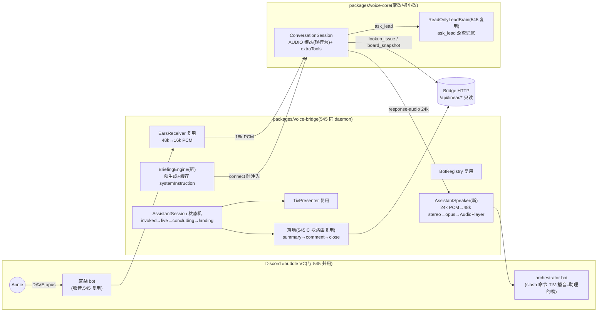

# FLY-967 会议模式 A(纯 Gemini Live 语音助理) — 探索
Issue: FLY-967 (https://linear.app/geoforge3d/issue/FLY-967/voicea-会议模式-a-纯-gemini-live-语音助理自带工具会议简报与-545b-真机对比定方向)
日期: 2026-07-07
基于: 无

> 本档 = design 阶段 brainstorm 产物。目标:把「纯 Gemini Live 全包语音助理」(Annie 的原始
> 心智模型,543 talk 端到端形态搬进 Discord VC)落成可实施的形状,并诚实评估「在 Gemini 侧
> 重做一遍 Claude Code」到底有多大。A 与 FLY-545(B)都做出来,Annie 真机对比定最终方向。

## 1. 问题与来源

Annie 2026-07-07 在 545 thread 拍板:voice 会议形态 A/B 之争不纸上谈兵,拆两个 issue 都建出来,
用真实使用体验定方向。

- **B(FLY-545,不动)**:Gemini Live 当耳朵(TEXT 模态)+ Claude 人格当脑 + edge-tts 分声线。
  强项 = 「懂我们」(Lead persona/知识)+ 每个 Lead 自己的嘴;弱项 = 首音链路长(Gemini 首 token
  + edge-tts 0.66s + opus,估 1.0-2.0s,靠 earcon/filler 兜)。
- **A(本 issue)**:纯 Gemini Live speech-to-speech 全双工,native audio out,单一声线。
  强项 = 最低延迟、最自然的对话流(模型原生语音、原生 barge-in);弱项 = 「懂我们」全靠
  简报注入 + 工具,声音不是 per-Lead 的。

545 的 exploration §D1 其实已经把这两条路摆上过桌面(A=音频直出被列为 documented 降级位);
Annie 的决定 = 别把 A 只当降级位,当一等公民做出来真比。

> **校准(2026-07-07,545 S1 坐实后)**:Gemini Live 当前**全系模型不支持 TEXT 响应模态**
> (服务端拒绝;545 分支 evidence/s1-gemini-text-modality.md),B 已激活 audio 直出降级
> (545 plan 附录 A / D1-A:Gemini AUDIO 直出、主持 bot 单嘴播)。A/B 差异主轴因此从
> 「延迟链路」改为**「脑子」**——B = Claude 人格 + 会议流程,A = 纯 Gemini + 简报注入;
> 两边播放链路同源,「卡不卡」不再是主要区分维度(见 §7 权重调整)。

## 2. 现状审计(A 能站在什么肩膀上)

### 2.1 voice-core(FLY-543 产物,FLY-959 修完已知 bug)

- `ConversationSession`(Gemini Live):**AUDIO 模态就是现行为** —— `response-audio` 事件吐
  24kHz mono PCM16;输入 `sendAudio` 16k PCM;服务端 VAD/语义端点/barge-in(`response-cancelled`);
  `session-expiring` + `TalkSessionRotator` 无缝续接(resume handle 保上下文)。
- `ask_lead` tool 已内建(FLY-959 修好 schema):模型可把项目深问题转给 `BrainAdapter`
  (543 talk = HeadlessClaudeBrain,claude -p)。
- 模型 pin `gemini-3.1-flash-live-preview`(config 可换,FLY-959 修过 404)。
- 543 talk CLI = 本机 mic → Gemini → 本机喇叭。**A 形态 = 把这条链的两端从本机换成 Discord VC**:
  mic → 耳朵 bot 收音;喇叭 → assistant bot AudioPlayer 播音。

### 2.2 FLY-960 spike(GO)+ FLY-545 PR-1 底座(硬约束:复用,不重复造水管)

- 960 已真机证明:耳朵 bot 在强制 DAVE 下能可靠收音(`@discordjs/voice` 0.19.2 pin,
  per-speaker 分轨,speaking-start 去重,clientReady 后才 join 的首坑)。
- 545 PR-1 交付:`packages/voice-bridge`(BotRegistry / EarsReceiver(48k→16k)/ LeadSpeaker /
  TivPresenter 骨架 + launchd daemon + 配置合同)+ voice-core 扩展(TEXT 模态 + **extraTools
  分发合同 `LiveToolSpec`** —— A 的工具集正好用这个机制,不用自己发明)。
- 545 的 Lead-facing 接口合同(speak/onFounderUtterance/bargeIn/presence)= 对接面。
- 545 plan 附录 A(D1-A 降级通路:24k PCM → 48k stereo 重采样 → bot 单嘴播)**几乎就是 A 的
  播放管线**,只是在 A 里它是主路而非降级位。

### 2.3 Bridge 现有只读路由(工具集的原料)

- 现有:`GET /api/linear/issues`(project/state/labels/limit/slim 过滤 — board 快照可用)、
  `POST /api/linear/create-issue`、`POST /api/linear/update-issue`。
- 545 PR-2 计划新增:`GET /api/linear/issue?query=`(identifier/关键词精确查)、
  `POST /api/linear/comment`。A 的 lookup_issue / 落地路由直接复用这两条。
- **没有**的:thread 消息读取路由(get_thread_summary 需要新做)、全文搜索路由(search_context
  需要新做)。这是「诚实评估」的重点,见 §5。

## 3. A 的形态定义(提案)

一句话:**orchestrator bot 的另一种会议模式** —— 同一个 #huddle VC、同一个 daemon,
`/talk`(命名见 §7)启动后,Gemini Live 直接用自己的声音跟 Annie 全双工对话;开场前把
「会议简报」注进 systemInstruction,会中用只读工具查事实,会后 summary 落 Linear。

数据流(live 一轮):她说话 → 耳朵 bot opus → 16k PCM → `sendAudio` → Gemini 服务端 VAD
→ **模型直接开口**(`response-audio` 24k PCM 流式)→ 重采样 48k stereo → opus 编码 →
orchestrator bot AudioPlayer 播 → 她中途开口 → Gemini 原生打断(`response-cancelled`)
→ AssistantSpeaker 立即清缓冲停播(PRD <100ms 口径)。没有 TEXT→TTS 一跳,首音 = Gemini
原生语音首包,这就是 A 的核心卖点。

## 4. 关键决策点(brainstorm 结论,gate 确认)

### D1. 落包位置:voice-bridge 内加 assistant 模式(推荐)vs 独立新包

**推荐 = 同 `packages/voice-bridge` 包内**,`AssistantSession` 与 `HuddleSession` 并列。
理由:①BotRegistry/EarsReceiver/TivPresenter/config/launchd 单实例守卫全部直接复用,独立包
= 这些全要再进口一遍还要解决「两个 daemon 抢同一个 VC/同一批 bot token」;②A/B 共用一场
互斥(同 VC 同耳朵,天然一次一场,`/meet` 与 `/talk` 互报「有会进行中」);③对比实验要求
两条命令肩并肩活在同一个频道里,Annie 切换零成本。代价:voice-bridge 包变大 —— 可接受,
模块边界仍清晰(assistant/* 子目录)。

### D2. 助理的嘴:orchestrator bot 播音(推荐)vs 新 claim 一个 assistant bot

**推荐 = orchestrator bot 自己开口**。A 是单一声线,不需要多嘴;orchestrator 本来就在 VC
(slash 命令/TIV/MOVE 都是它),让它播音 = 零新 bot 身份、零新 token、绿圈亮在「会议助理」
头像上语义也对。代价:B 模式里 orchestrator 不说话、A 模式里它说话 —— TIV 状态行都由它发,
行为差异写清楚即可。若 Annie 希望 A 有独立人设头像(「小助理」),再从 pool claim 一个,
配置位留 `assistantBotTokenEnv?`(缺省 = orchestrator)。

### D3. 简报引擎(她零科普的关键)

`BriefingEngine` 产出一段 systemInstruction 前缀,connect 时注入。**数据源(v1)**:

| 块 | 来源 | 新鲜度 |
|----|------|--------|
| board 状态 | Bridge `GET /api/linear/issues?slim`(In Progress/In Review/Todo 分组计数 + 标题行) | 缓存 ≤10min |
| 相关 issue | 命令参数 `/talk [topic]` → 关键词过滤 board 内 issue(v1 就近取材,不做全文检索) | 即时 |
| 最近决策 | 最近 N 天 Done/Merged issue 标题 + 一句话(同一条 issues 路由,state=Done 排序) | 缓存 ≤10min |
| PRD/文档要点 | 配置的文件路径列表(`briefing.docs[]`,如 product spec / 当前 PRD),截断到每篇 ≤M 字符 | 文件 mtime |

**快的策略 = 预生成 + 缓存**:daemon 后台定时(默认 10min,可配)刷新缓存落
`~/.flywheel/voice-briefing.cache.json`;`/talk` 时**直接用缓存**(注入 = 内存拼接,零等待),
同时踢一次后台刷新。缓存陈旧上限(默认 30min)超了 → 照常开会但 TIV 提示「简报可能滞后」。
简报里写明生成时间,模型口头引用时可说「截至 X 分钟前」。

### D4. 工具集:最小可用起步(她的顾虑正面回应)

Annie 原话:「相当于把 Claude Code 做的事情在 Gemini 那边再做一次」。诚实评估:

- **v1 只做 3 个,全部零/低新增**:
  1. `lookup_issue` — 复用 545 PR-2 的 `GET /api/linear/issue?query=`(若 545 PR-2 未落地,
     本 issue 自带这条路由,照 create-issue 形态,谁先落谁建、后者 no-op);
  2. `board_snapshot` — 复用现有 `GET /api/linear/issues?slim`(按 state 分组摘要);
  3. `ask_lead` — voice-core 已内建 + 545 的 ReadOnlyLeadBrain(claude -p 只读白名单),
     深问题的兜底:简报+工具答不了的,模型口头「我查一下」(WHEN_IDLE 回注,不卡对话)。
- **v1 不做**:`search_context`(需要新的全文检索路由)、`get_thread_summary`(需要 Discord
  消息读取路由 + 摘要)。这两个是真正的「重做 Claude Code」增量,推迟到 A 方向胜出后再建
  —— 对比实验阶段,ask_lead 兜底就是它们的穷人版。
- 工具分发机制 = 545 PR-1 的 `extraTools: LiveToolSpec[]`(voice-core 扩展),**不自己发明**。

「重做一遍」的真实边界:A 不给 Gemini 任何写能力、任何 repo 直接访问;它的「懂我们」=
简报(静态)+ 3 个只读工具(动态)。脑子的深度差距正是 A/B 实验要测的变量,不靠堆工具抹平。

### D5. 会后落地:复用 545 C 块路由,轻量版 pipeline

对比公平要求 A 也有完整的「会后产物」:

- `/talk` 启动时**同样自动建立项 issue**(545 P7 同款 BridgeLinearClient,title 形如
  「2026-07-07 15:00 · talk(Annie)」+ topic);
- 结束(她说「结束」/离开 VC)→ 助理口头 recap 等确认(单一助理,无多 Lead 主持逻辑,比 545
  ConclusionPipeline 简单得多)→ summary + 要点(引用原话,JSONL transcript 已有)POST
  `/api/linear/comment` → issue 关闭 → TIV 卡片贴链接;
- **不建 worktree**(A 是助理聊清事情,不是派活会;要派活她口头说了 → summary 里列出,真派活
  仍走她自己在 Linear/Discord 的动作 —— D3/D4 语音不构成授权的硬边界与 545 完全一致)。

### D6. 模型与模态

- AUDIO 模态 = voice-core 现行为,543 talk 已真机验证(含 ask_lead 工具在 AUDIO 模态下工作)。
- research 阶段要核实:pin 的 `gemini-3.1-flash-live-preview` 是否 native-audio-out 系(vs
  half-cascade),以及 native-audio 系模型对 function calling / systemInstruction 长度的限制;
  选定 v1 pin(config 可换)。判断口径:**543 真机跑通的模型优先**(在repo证据 > 文档),
  除非 native-audio 系有实测更低首音且工具支持完好。
- 声线:Gemini 预置 voice 参数选一个(config `assistant.voice`),不做多声线(FLY-547 是 B 线)。

### D7. 命令命名(给 Annie+Honey Lemon 的建议)

**推荐 A = `/talk`**(候选 `/assist` `/quick` 之外的第三个):

- 她的原始心智模型就叫 talk(543 talk CLI)—— 这个词已经在她的语汇里;
- 与 `/meet` 一听即分:**meet = 开会**(正式、多 Lead、各自声音出席),**talk = 聊两句**
  (快、单一助理、随叫随到);
- `/assist` 偏「客服」;`/quick` 语义悬空(quick 什么?)。
- 命令名可配置(545 的 `commandName` 同款),定稿权在 Annie+Honey Lemon,design 只给建议。

> **落定注记(2026-07-07)**:Annie 先拍 /live、**终稿 = /gemini**(取代本节建议的 /talk);
> 命令名仍可配置(config `commandName`,默认 "gemini")。代码模块相应叫 GeminiCommand。

### D8. 交付切法与时序

- **design 即刻并行(本档);implement 的 VC 接线等 545 PR-1 落地**(issue 硬约束)。
- A 的 implement 切 **1 个 PR**(545 PR-1 之上的增量):AssistantSpeaker + AssistantSession +
  BriefingEngine + 3 工具接线 + 轻量落地 + `/talk` 命令 + 真机验收。若 545 PR-2(comment/
  issue-query 路由)未到,本 PR 自带两条 Bridge 路由(谁先落谁建)。
- 唯一新 spike:**S-A1 真机量首音**(耳朵→Gemini AUDIO→48k 重采样→opus→AudioPlayer 全链,
  对照 §15:≤800ms 好/≤1.2s 可)。A 的存在意义就是低延迟,这个数字必须先拿到。

## 5. 工作量诚实评估(Annie 已知「工作量大」,给真数)

| 块 | 新增工作 | 复用比例 |
|----|---------|---------|
| VC 收音 | 0(EarsReceiver 原样) | 100% 545 |
| 播放管线 | AssistantSpeaker:24k→48k stereo 重采样(resample.ts 加一个方向)+ PCM 流→opus→AudioPlayer + 打断清缓冲 | ~70% 复用(545 附录 A 已画好) |
| 会话状态机 | AssistantSession:invoked→live→concluding→landing,单助理无 TurnRouter/多 Lead | 形态照 HuddleSession,逻辑减半 |
| 简报引擎 | **全新**:4 数据源拼装 + 定时缓存 + 注入 | 0%(A 独有,这就是「再做一个 assistant」的主体之一) |
| 工具集 | extraTools 机制复用;lookup_issue/board_snapshot 是薄封装;ask_lead 现成 | ~80% 复用 |
| 落地 | BridgeLinearClient + comment 路由复用;recap 轻量版 | ~60% 复用 |
| 命令/TIV | MeetCommand 形态复刻一条 `/talk` | ~80% 复用 |

结论:**「再做一个 AI assistant」的真实增量 ≈ 简报引擎 + 播放管线适配 + 轻量会话编排**,
其余站在 545/960/543 肩上。不小,但远小于从零;且大头(简报引擎)正是 A 赢下对比的武器。

## 6. 风险

| 风险 | 等级 | 对策 |
|------|------|------|
| 545 PR-1 时间线滑,A implement 被阻塞 | 中 | design/plan 先行;plan 里明确标出「依赖 545 PR-1 的最小面」(BotRegistry/EarsReceiver/launchd),真滑了可讨论 A 先带最小收音面(960 spike 代码升级)——留给 Tadashi 排期决策 |
| native audio 模型工具支持有坑(function calling 限制) | 中 | 543 已验 AUDIO+ask_lead 可用;research 核实 3.1 live 模型对多工具/长 systemInstruction 支持;真有坑 → 工具减配(简报承重)先跑对比 |
| 简报注入过长(token/延迟) | 低 | 每块截断 + 总预算(如 ≤8k chars);研究阶段定数 |
| Gemini 声线中文口音/英文专名发音 | 低 | 声线试听选型(implement 阶段);这本身是对比维度之一,如实呈现 |
| A/B 共用 daemon,一边的 bug 拖累另一边 | 低 | 模块边界(assistant/* 子目录)+ 各自独立测试;会话互斥是共享的唯一交点 |
| 24k→48k 重采样质量 | 低 | 整数倍上采样(×2)+ 声道复制,纯函数单测;545 resample.ts 同款纪律 |

## 7. 对比实验的验收口径(两个 issue 共同的终点)

Annie 分别用 `/meet`(B)和 `/talk`(A)各开一轮真会,按体感拍板。design 建议给她一张
两列小卡(TIV 里贴),提示对比维度(不打分,凭感觉):

1. **懂不懂我们**(**首位**)— 问同一个项目问题,谁答得准/不用她科普;A/B 主轴 = 脑子
   (B = Claude 人格+会议流程 vs A = 纯 Gemini+简报注入);
2. **会后产物** — summary 谁更能直接用;
3. **声音** — 自然度 vs「像我们团队的人」;
4. **卡不卡**(**降权**:545 S1 后两边同为 Gemini AUDIO 直出,播放链路同源,预期差异小)
   — 首音体感、打断跟手不跟手。

> 权重调整依据:545 S1 坐实 TEXT 模态全系不支持 → B 降级 audio 直出,原「A 低延迟 vs B 链路
> 长」的对比前提消失;「懂不懂我们」升首位,「卡不卡」降权(2026-07-07)。

每边真机验收各自记 evidence(首音实测数字 + transcript 样例),给她体感之外的硬数参考。

## 8. 明确不做(v1)

- `search_context` / `get_thread_summary` 工具(新路由,A 胜出后再建);
- 多声线/per-Lead 声线(那是 B 线的 FLY-546/547);
- 耳机模式/异步 queue(FLY-546,v1.5);
- 任何写动作/语音授权(D3/D4 硬边界,与 545 同);
- OpenAI Realtime/本地模型(backend 可插,但 v1 只 Gemini);
- 多场并发、跨重启会话恢复(断了重开,与 545 同)。
