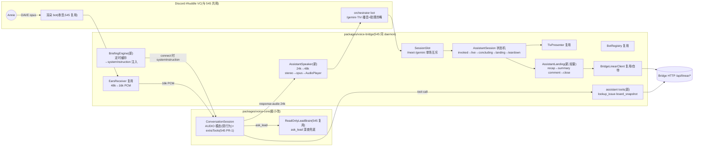

# FLY-967 会议模式 A(纯 Gemini Live 语音助理) — 实施计划
Issue: FLY-967 (https://linear.app/geoforge3d/issue/FLY-967/voicea-会议模式-a-纯-gemini-live-语音助理自带工具会议简报与-545b-真机对比定方向)
日期: 2026-07-07
基于: research.md(+ exploration.md;brainstorm gate 已批:7 条全过 + 2 条口径补充)

> **给 implement 阶段**:三段式同分支交付,implement=Fable、QA=Opus(issue 钉的)。**1 个 PR**;
> implement 的 VC 接线**等 545 PR-1 落地**(issue 硬约束;依赖面精确清单 = research §3,滑期
> 升级 Tadashi)。每 Phase 先测后码(TDD),频繁 commit。命令命名**最终定稿 = /gemini**(Annie 二次拍板,
> 取代先前的 /live 与 design 建议的 /talk)—— 实现用 config 默认值("gemini"),仍可配置。

## 0. 目标与非目标

**目标**:`/gemini [topic]` → 自动建立项 issue → orchestrator bot + 耳朵 bot 进 `#huddle` VC →
Gemini Live **用自己的声音**与 Annie 全双工对话(native audio、单一声线、最低首音)——开场前
简报注入(board/相关 issue/最近决策/文档要点,她零科普)、会中 3 个只读工具查事实、原生
barge-in;结束 → 助理口头 recap 等确认 → summary(引用原话)落立项 issue → 关 issue → TIV
卡片。与 FLY-545(B)在同一 VC 肩并肩,Annie 各开一轮真会按体感定方向。

**非目标**(防蔓延,gate 确认):`search_context`/`get_thread_summary` 工具(新路由增量,
A 胜出后再建;ask_lead 是兜底)、多声线/per-Lead 声线(FLY-546/547,B 线)、耳机模式/异步
queue(FLY-546)、**任何写动作/语音授权**(D3/D4 硬边界;FLY-546 的「语音批准第三信号源」
上线后 A/B 自动继承,**本 issue 不自造批准通道**,v1 = readback + 现有 founder gate)、建
worktree(A 是聊清事情不是派活会)、OpenAI Realtime/本地模型、多场并发、跨重启会话恢复。

> 命名注记(gate ⑥ + Annie 拍板):`/gemini` 是 Discord slash 命令(Annie 定名,先 /live 后终稿 /gemini;与 voice-core **本机** talk CLI(543)的同词混淆随 /gemini 定名自然消解)。
> 代码里命令模块叫 `GeminiCommand`(Discord 面),不去动 voice-core cli。

## 1. 架构总览



数据流(live 一轮):她说话 → 耳朵 bot per-speaker opus → 16k PCM → `sendAudio` → Gemini
服务端 VAD/语义端点 → **模型直接开口**(`response-audio` 24k mono PCM 流式)→ ×2 上采样 +
声道复制 → PassThrough → `createAudioResource(StreamType.Raw)` → orchestrator bot 播;她中途
开口 → Gemini 原生打断 → `response-cancelled` → AssistantSpeaker 立即 destroy stream +
`player.stop()` + turn 序号闸丢弃迟到 chunk。没有 TEXT→TTS 一跳,首音 = 模型原生语音首包。

## 2. 交付切法

| 交付物 | 范围 | 真机验收(evidence/ 落档) |
|--------|------|--------------------------|
| **单 PR「/gemini 助理模式」**(545 PR-1 之上增量) | voice-core `systemPreamble` 可选字段 + voice-bridge `assistant/*` 全部 + SessionSlot + 两条 Bridge 路由(若 545 PR-2 未先落)+ 配置合同 | ①S-A1 首音/打断实测数字;②staged E2E(529 Room 纪律,QA 当 founder 全流程);③**Annie 真用一轮 /gemini**(A 侧北极星;A/B 对比由她各开一轮后拍板) |

## 3. 文件结构

> **并行边界裁决(Tadashi,2026-07-07,967/545 同窗 implement)**:共享底盘归 **545 PR-1 独家**
> ——package 脚手架、**SessionSlot**、resample、config schema、daemon 入口、BotRegistry/
> EarsReceiver 由 545 建,967 **不建这些文件**,等 545 落地后 rebase 消费(下表相应条目按此
> 读)。967 只建:`assistant/*` 全部、voice-core systemPreamble/sendText/voiceName 透传、两条
> Bridge 只读路由(P12 合同「谁先落谁建」照旧)。545 底盘落地前用注入接口 + mock 先行。

```
packages/voice-bridge/src/
├── SessionSlot.ts               # 单场互斥(/meet 与 /gemini 共用;acquire/release;
│                                #   占用中二次 acquire → 显式拒绝带「有会进行中」文案)。
│                                #   归属改判:由 545 PR-1 建(见上方边界裁决),967 消费。
├── audio/resample.ts            # 545 PR-1 文件,加一个方向:upsample24kMonoTo48kStereo(纯函数)
└── assistant/
    ├── AssistantSpeaker.ts      # 24k chunk 流→上采样→PassThrough(highWaterMark 上限)→
    │                            #   AudioPlayer(orchestrator bot);turn 序号闸;flush()=destroy+stop;
    │                            #   预置 earcon/预合成 filler 即播(文件路径注入)
    ├── BriefingEngine.ts        # 4 数据源拼装 + 定时刷新 + 磁盘缓存(原子写)+ 预算截断 +
    │                            #   compose(topic?)→{ text, generatedAt, stale }
    ├── tools.ts                 # LiveToolSpec×2:lookup_issue / board_snapshot(handler→Bridge HTTP;
    │                            #   查不到/超时 → 回注显式错误文本,绝不静默)
    ├── AssistantSession.ts      # 状态机 invoked→live→concluding→landing→teardown(§6)
    ├── AssistantLanding.ts      # recap 模板→确认/纠正/离场降级→summary(引用原话 from JSONL)
    │                            #   →comment→close→TIV 卡片;失败语义照 545 §6 landing 同款
    └── GeminiCommand.ts           # slash 命令注册(名字可配,默认 "talk")+ Join link button +
                                 #   founder @ping + MOVE_MEMBERS + 建立项 issue;
                                 #   照 545 MeetCommand 形态 —— 若 MeetCommand 已落地,抽共享
                                 #   discord/commandKit.ts(注册/按钮/@ping 三件套),谁后落谁抽
packages/voice-core/src/…        # 极小改:ConversationOptions.systemPreamble?: string(§5.1)
packages/teamlead/src/bridge/plugin.ts  # 仅当 545 PR-2 未先落:POST /api/linear/comment +
                                 #   GET /api/linear/issue?query=(合同逐字 = 545 plan §5.3/P12,
                                 #   实现前 grep 确认,已存在则本 PR 零 Bridge 改动)
```

## 4. 配置合同

`~/.flywheel/projects.json` 的 `huddle` 块(545 PR-1 定义)加**可选** `assistant` 子块
(不设 = /gemini 不注册,A 关,字节兼容;545 的 B 面行为零变化):

```jsonc
"huddle": {
  "guildId": "…", "voiceChannelId": "…",            // 545 PR-1 已有,A 共用
  "orchestratorBotTokenEnv": "…", "earsBotTokenEnv": "…",
  "assistant": {
    "commandName": "live",              // 可选,默认 "live"(Annie 拍板 /gemini,仍可配)
    "voice": "Kore",                    // 可选:Gemini prebuilt voiceName;缺省用模型默认;
                                        //   实现期试听 3-5 个预置声线选型记 config 注释。
                                        //   注意:native audio 模型自动选语言,不支持显式
                                        //   languageCode(官方文档,Codex R1 #3)——语言约束
                                        //   走 systemHint 提示词,不进 speechConfig
    "assistantBotTokenEnv": null,       // 可选:独立助理 bot;缺省 null = orchestrator bot 播音
    "briefing": {
      "refreshSec": 600,                // 可选,默认 600
      "maxAgeSec": 1800,                // 可选,默认 1800;超龄照常开会 + TIV 提示「简报可能滞后」
      "charBudget": 8000,               // 可选,默认 8000(总);每源上限 = budget/4 向下取整
      "docs": ["product/doc/FLY-906-voice-product-experience/prd.md"]  // 可选,repo 相对路径,
                                        //   必须 resolve 后仍在 projectRoot 内(路径穿越拒绝)
    }
  }
}
```

- `config.ts` fail-fast 语义沿用 545:`assistant` 存在时字段类型校验,`docs[]` 路径穿越
  启动即拒;缺 `huddle` 块 → 整个 voice-bridge 不启(545 已定)。
- 秘钥纪律与 545 逐字同:全走 `~/.flywheel/.env`,token/正文绝不进 argv/日志。

## 5. 接口合同

### 5.1 voice-core 极小扩展(默认字节兼容)

```ts
// types.ts — ConversationOptions 新增一个可选字段:
export interface ConversationOptions {
  …现有字段…
  /**
   * 会话级上下文前言(会议简报)。有值 → 作为 systemInstruction 的前缀段,
   * 与现有 systemHint(口语纪律)拼接:preamble + "\n\n" + systemHint。
   * 缺省 undefined = 现行为字节兼容(talk CLI/545 全不受影响)。
   */
  systemPreamble?: string;
}
// ConversationSession 新增一个方法(Codex R1 #1:systemInstruction 只设上下文,不会让模型
// 主动开口;开场白/收尾 recap 都需要文字控制口):
export interface ConversationSession {
  …现有成员…
  /** 发一段文字输入给模型(她听不到的控制提示,如「请开场」「请做 recap」)。
   *  经 LiveConnection.sendText → session.sendRealtimeInput({ text })。
   *  控制提示**不是 Annie 的话**(Codex R2):JSONL transcript 里记 role=control(或不落
   *  user 轨),summary「引用原话」池只取她的 inputAudioTranscription 条目,绝不混入。 */
  sendText(text: string): void;
}
// genaiConnector:①连接参数组装处把 preamble 拼进 systemInstruction;②transport 加 sendText。
// 单测(mock transport):有/无 preamble 两形状断言;sendText 帧形状;speechConfig 只发
// voiceConfig.prebuiltVoiceConfig.voiceName(不发 languageCode —— native audio 不支持,
// Codex R1 #3);现有测试全绿不改(缺省字节兼容)。
// 若 545 PR-1 落地时已引入等价能力(以其实际签名为准),对应步 no-op —— implement 前 grep。
```

- **extraTools / LiveToolSpec / 分发与取消合同 = 545 plan §5.1 原文,本计划引用不复制**
  (防两边漂移;545 PR-1 交付)。A 传 `extraTools: [lookupIssueTool, boardSnapshotTool]`。
- `speechConfig` 只含 voiceName:经 ConversationOptions 现有 `voice` 字段透传,genaiConnector
  侧映射到 `voiceConfig.prebuiltVoiceConfig.voiceName`(研究 §1.1 已核 SDK 形状;单测断言
  连接参数;无 languageCode —— 见 §4 config 注)。

### 5.2 assistant tools(D3 边界内,全只读)

```ts
// tools.ts — 545 LiveToolSpec 形状:
export const lookupIssueTool: LiveToolSpec = {
  declaration: { name: "lookup_issue",
    description: "Query a Linear issue by identifier (FLY-123) or keyword. Read-only.",
    parameters: { type: "OBJECT", properties: {
      query: { type: "STRING", description: "issue identifier or keyword" } },
      required: ["query"] } },
  handler: /* GET /api/linear/issue?projectName=<当前项目>&query=…(合同=545 plan §5.3/P12;
              projectName binding 必带,Codex R1 #4)→ 摘要文本;identifier 精确命中优先于
              关键词;not-found → "没找到 <query>";HTTP 失败/超时(5s)→ 显式错误文本回注 */
};
export const boardSnapshotTool: LiveToolSpec = {
  declaration: { name: "board_snapshot",
    description: "Current project board: issues grouped by state. Read-only.",
    parameters: { type: "OBJECT", properties: {
      state: { type: "STRING", description: "optional state filter (e.g. In Progress)" } },
      required: [] } },
  handler: /* GET /api/linear/issues?slim=1&projectName=…[&state=…] → 按 state 分组的
              标题行文本(≤2k chars 截断);失败语义同上 */
};
// BridgeLinearClient:projectName 为构造必填(Codex R1 #4)—— 每一次 Linear 调用
// (create-issue body / issue lookup query / issues query)都带 projectName scope,
// 单测逐路断言;unknown projectName → Bridge fail-loud(现有 FLY-371 行为)。
// ask_lead:voice-core 内建路径不动,brain = 545 的 ReadOnlyLeadBrain(claude -p 只读白名单)。
// 同步 function calling 约束(research §1.3):tool-call 事件一到 → AssistantSpeaker 即播
// earcon;>2s 未回注 → 播预合成「我查一下」clip(一次性合成落文件,运行时零 TTS 依赖)。
```

### 5.3 BriefingEngine

```ts
export interface BriefingResult { text: string; generatedAt: string; stale: boolean }
export class BriefingEngine {
  /** 启动即读缓存;后台 setInterval(refreshSec) 刷新;refresh 失败保旧缓存 + 记日志(绝不
   *  让刷新失败挡开会)。缓存文件 ~/.flywheel/voice-briefing-<projectName>.cache.json,
   *  写 = tmp + rename 原子。 */
  start(): void; stop(): void;
  /** 内存拼接,零 IO 零等待。topic 有值 → 对 board 快照标题做大小写不敏感关键词过滤,
   *  命中的 issue 提升到「相关 issue」段(v1 就近取材,不做检索)。 */
  compose(topic?: string): BriefingResult;
}
// 4 段模板(每段独立截断到 charBudget/4,总长再截到 charBudget):
//   [简报生成时间 HH:MM] / ①board 快照(In Progress/In Review/Todo 分组,identifier+标题)
//   / ②相关 issue(topic 命中,含 state)/ ③最近决策(近 14 天 Done 的 identifier+标题,
//   最多 15 条)/ ④文档要点(docs[] 逐篇:文件名 + 开头 N chars)。
// 数据源:GET /api/linear/issues(现有路由,research §5);docs[] 直接读文件(mtime 变才重读)。
// 「近 14 天」机制(Codex R1 #6):现有路由无日期过滤参数,但按 updatedAt 排序返回 —— 请求
//   state=Done + 足够 limit(50),客户端过滤 updatedAt >= now-14d,截 15 条;路由 truncated
//   时简报标注「决策列表可能不全」。单测:日期过滤 + truncation 标注两路。
```

### 5.4 系统提示要点(systemPreamble + systemHint,implement 定稿逐字)

简报(§5.3 产物)+ 规则:①你是这个团队的会议助理,项目事实**必走** lookup_issue /
board_snapshot / ask_lead,不许编;②口语短句、零工程黑话(§8b);③(b/c 档动作)只
readback 不执行 ——「我记下了,X 会走正式批准流程」,执行永远在现有 founder gate 侧(D4;
546 语音批准信号源上线后自动继承,本层措辞不变);④她说「结束/就这样」= 进入收尾 recap;
⑤长答先一句 ack。

## 6. AssistantSession 状态机

```
idle ──/gemini [topic]──▶ invoked(SessionSlot.acquire 失败 → 回执「有会进行中」即止;
      │                 建立项 issue(title「2026-07-07 15:00 · gemini(Annie)」+topic)via
      │                 create-issue 现有路由;发起频道回执 + Join 按钮;@ping Annie;
      │                 她已在本 guild 任一 VC 且 moveMembers → MOVE_MEMBERS)
      ▼
      (orchestrator + 耳朵 join VC;BriefingEngine.compose(topic) → connect Gemini
       (systemPreamble + extraTools + voice);等 voiceStateUpdate 出现 Annie,超时 10min
       未进 → abort:issue comment「未开成」+ close + TIV 一句 + teardown)
      ▼
live(开场:sendText 控制提示「请用一两句开场,报出简报时间」→ 模型原生语音开场(Codex R1
      │ #1:systemInstruction 不会让模型主动开口,文字控制口是唯一开场通道);对话环;
      │ earcon/filler;TIV 状态行+字幕;JSONL 双向落盘;
      │ 耳朵断连 → 自动 rejoin,>60s 不恢复 → 口播降级 + concluding(545 同款);
      │ rotator goAway 续接透明)
      │ 触发 concluding:她说「结束/就这样」(输入转写命中)或她离开 VC(voiceStateUpdate)
      ▼
concluding(sendText 控制提示触发 recap:「她说结束了,请口头 recap 今天聊清的要点,逐条,
      │      问她对不对」→ 等口头明确肯定;纠正 → 改 → 重念改动;她已离开 → 降级:
      │      summary 标「未经口头确认,请在 issue 里改」)
      ▼
landing(AssistantLanding:summary+要点(逐条附原话引用 ts+原句,from JSONL)→ POST
      │  /api/linear/comment → update-issue 关闭 → TIV 结论卡片贴链接。
      │  失败语义(545 §6 landing 同款,顺序不可乱):comment 失败 → TIV 报错 + transcript
      │  路径兜底,不关 issue;close 翻转失败 → TIV 报错留人工;任何前步失败 = issue 不关,
      │  可重跑。**重跑幂等(Codex R1 #5)**:comment 成功即写本地回执
      │  landing-receipt.json(transcript 同目录,含 issue id + session id + comment 时刻);
      │  重跑先查回执 —— 有回执 → 跳过 comment 直进 close;comment 正文自带
      │  「assistant-summary <sessionId>」标记行供人工审计。单测:comment 成功→close 失败→
      │  重跑不重发 comment。
      ▼
teardown(bot 退出 VC;rotator close;transcript 收尾;SessionSlot.release)──▶ idle
```

- **单场互斥**:SessionSlot 为 /meet(545)与 /gemini 共享的进程内闸;A 先落地 = A 引入,
  545 PR-2 对齐(implement 时同步一条对齐注释到 545 侧文档,防两边各造一个闸)。
- **barge-in 口径(S-A1 定档)**:主路 = Gemini 服务端 VAD(response-cancelled → flush)。
  S-A1 实测「她开口→停播」体感;若 >400ms 不跟手 → 启用**本地预停门**:EarsReceiver
  speaking-start 持续 ≥350ms(545 同款信号源与阈值)→ `speaker.flush()` +
  `conversation.interrupt()`(Codex R1 #2:voice-core 的 interrupt() 本就是**本地抑制**——
  标记 turn 取消、abort 在飞 ask_lead、丢迟到音频/工具调用,不发服务端 cancel;只 flush 不
  interrupt 会让死 turn 继续吐音/完成工具)。与稍后到的服务端 interrupted 幂等。预停门做成
  config 开关(`assistant.localBargeIn`,默认按 S-A1 结论定);fake-timer 单测:预停后迟到
  音频丢弃、assistant transcript 抑制、在飞 tool handler abort、下一轮她开口正常恢复。

## 7. 实施步骤(TDD;mock 全注入,545/voice-core 同款模式)

- **P0-S-A1 spike(throwaway,不进包)**:545 PR-1 真机管线之上,连 Gemini AUDIO 模态跑
  10+ 轮:①全链首音分布(她停话→bot 出声;口径 §15:≤800ms 好/≤1.2s 可/>2s 停报 Tadashi);
  ②打断延迟(开口→停播),定 localBargeIn 默认值;③注入 8k 简报后模型答 board 问题抽查;
  ④试听 3-5 个 prebuilt 声线定默认。产出 evidence/s-a1-first-audio.md(数字+结论)。
- **P1 voice-core systemPreamble + sendText**:先 mock-transport 测(有/无 preamble 的连接
  参数形状、与 systemHint 拼接顺序、sendText 帧形状(sendRealtimeInput text)、speechConfig
  只发 voiceName 不发 languageCode、缺省字节兼容 = 现有测试全绿不改),后实现 §5.1。
- **P2 resample 方向**:upsample24kMonoTo48kStereo 纯函数单测(已知波形进出、奇数长度帧、
  空帧)。
- **P3 AssistantSpeaker**:mock player/connection:流式衔接(chunk 陆续到 → 单 resource)、
  turn 序号闸(cancel 后迟到 chunk 丢弃)、flush() 即停、highWaterMark 上限告警、earcon/
  filler 即播路径、>2s tool 未回 → filler 触发(fake timers)。
- **P4 BriefingEngine**:mock Bridge HTTP + tmp 目录:4 段模板与截断、topic 过滤提升、缓存
  原子写/读、refresh 失败保旧、stale 判定、docs[] mtime 重读、路径穿越拒绝(启动 fail-fast)。
- **P5 tools**:lookup_issue/board_snapshot handler(mock HTTP):正常摘要、not-found 文案、
  超时/HTTP 错误 → 显式错误文本回注、argv/日志无 token、**每次调用带 projectName scope
  断言**(create-issue body / lookup query / issues query 三路,Codex R1 #4)。
- **P6 SessionSlot + AssistantSession**:互斥(占用中 acquire 拒绝文案)、状态机全径
  (fake timers):正常全流程(含开场/收尾 sendText 控制提示各一发)、10min 未进 abort、
  说「结束」/离开 VC 两种 concluding 入口、耳朵断连 >60s 降级、landing 失败语义三组
  (comment 失败不关 issue/close 失败留人工/重跑读回执不重发 comment)。
- **P7 GeminiCommand**:命令注册(可配名)、Join button、@ping、MOVE_MEMBERS(mock REST +
  权限缺失显式错误)、建立项 issue(BridgeLinearClient mock,title 形状断言)。
- **P8 Bridge 路由(条件)**:implement 前 grep `/api/linear/comment`;545 PR-2 已落 → 本步
  no-op;未落 → 照 545 plan §5.3/P12 合同逐字建两条路由 + 单测(auth/501/参数校验/not-found/
  identifier 精确/关键词歧义),测试形态照 create-issue 现有测试。
- **P9 真机闭环 + E2E**:①staged(529 Room 纪律:QA 真人当 founder,测试 guild,全流程
  /gemini→聊→收尾→issue 关闭链接可点);②生产部署(daemon 重启走 Bridge 重启纪律,攒批)→
  **Annie 真用一轮 /gemini**(A 侧北极星)→ evidence;A/B 对比卡(exploration §7 四维度)
  由 Lead 在两轮都跑完后端给 Annie。QA=Opus 独立 session(不自验)。
- 全程:vitest 全绿 + 全仓 lint;每 Phase 一 commit;progress.md 每步更新。

## 8. 验收标准(证据驱动)

| # | 标准 | 证据 |
|---|------|------|
| A1 | vitest 全绿 + 全仓 lint 干净;545 现有测试零改动全绿(字节兼容) | CI |
| A2 | S-A1:首音分布实测(≤1.2s 达标线)+ 打断延迟 + 声线选型 + 简报答题抽查 | evidence/s-a1-first-audio.md |
| A3 | 真机闭环:/gemini 全流程跑通,issue 建/关、summary 引用原话、TIV 卡片链接可点 | staged E2E 记录 |
| A4 | 简报零等待:/gemini 到助理开场 ≤3s(缓存命中路径);简报滞后时 TIV 提示可见 | staged E2E + 单测 |
| A5 | 工具真答:lookup_issue 真机答对一条在库 issue;board_snapshot 分组正确;ask_lead 兜底一例 | staged E2E 记录 |
| A6 | 失败路径显式:配置缺失/Bridge 不可达/耳朵断连/landing 失败全部有面向她的降级(不静默) | 单测 + staged E2E |
| A7 | argv/日志卫生:token/简报正文/对话正文不进 argv,日志 redact | 单测 |
| A8 | **Annie 真用一轮 /gemini 全程跑通**(A 侧北极星;A/B 拍板是她各开一轮后的体感决定) | 终验 evidence |

## 9. 风险与对策(research §9 汇总)

| 风险 | 对策 |
|------|------|
| 全链首音 >2s(A 价值主张不成立) | S-A1 先量再建;>2s 停报 Tadashi(对比实验重估) |
| 服务端 barge-in 不跟手 | localBargeIn 预停门(§6,S-A1 定默认) |
| 同步 function calling 静默 | earcon 即播 + >2s 预合成 filler(§5.2) |
| 545 PR-1 滑期阻塞 | 依赖面 7 项精确(research §3);P1-P8 大半可先行(mock 注入),仅真机步等底座;真滑升级 Tadashi |
| Bridge 路由与 545 PR-2 撞车 | 谁先落谁建 + 合同引用同段不另定义 + implement 前 grep(§7 P8) |
| 简报数据源慢/挂 | 缓存兜底(compose 零 IO);refresh 失败保旧不挡会 |
| Gemini 声线中文口音 | S-A1 试听选型;声线可配;如实作为对比维度呈现 |
| A/B 共 daemon 相互拖累 | assistant/* 模块边界 + SessionSlot 是唯一交点 + 各自独立测试 |

## 10. 明确不做(重申)

search_context / get_thread_summary(A 胜出后再建)· 多声线(546/547,B 线)· 耳机模式/
异步 queue(546)· 语音执行任意动作/语音授权(D3/D4;546 第三信号源上线自动继承,不自造)·
建 worktree · 早晚会 · OpenAI Realtime/本地模型 · 多场并发 · 跨重启恢复(断了重开 /gemini)·
Bridge 除两条(条件)路由外零改动 · StateStore 零改动。

## 11. 给 Annie 的一段话(gate 要求照抄,Lead 投递时用)

> 工作量诚实评估:A 的真实新增 = **会议简报引擎**(全新,也正是 A 赢下对比的武器——你的
> 两个抱怨「要等、要科普」都被预生成缓存杀掉)+ **播放管线适配**(约七成复用 545 已画好的
> 通路)+ **轻量会话编排**;其余全部站在 545/960/543 的肩上。「把 Claude Code 在 Gemini
> 再做一次」的部分被刻意压到 3 个只读工具起步,深问题由 ask_lead(现成的 Claude 只读脑)
> 兜底 —— 脑子深度的差距正是 A/B 实验要测的东西,不靠堆工具抹平。
