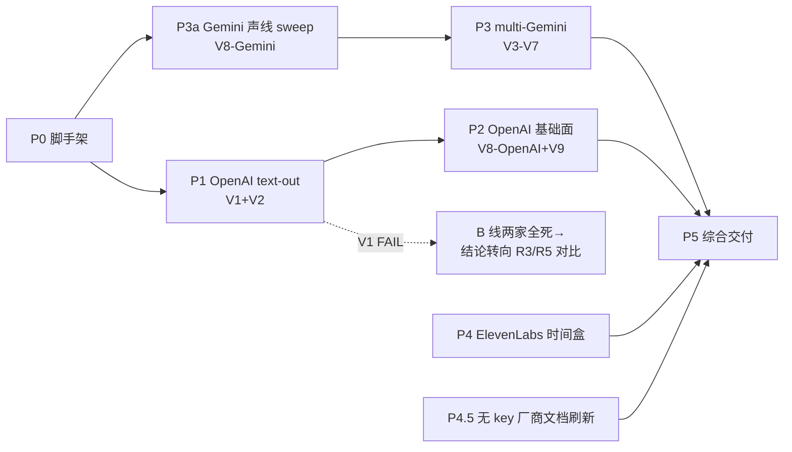

# FLY-968 实时语音模型选型横评 — 实施计划

Issue: FLY-968 (https://linear.app/geoforge3d/issue/FLY-968/voiceresearch-实时语音模型选型横评-openai-realtime-vs-gemini-live-vs-其他-multi)
日期: 2026-07-07
基于: research.md（+ exploration.md；brainstorm gate 已过：三 track / 3-session 规模 /
<$5 上限 / T1 判据 / founder HTML 直投 / 迁移成本增补，Tadashi 2026-07-07）

## 1. 目标与非目标

**目标**（= issue 的四项输出）：

1. Annie 问①的直接回答：multi-Gemini-Live **go / qualified-go / no-go** + 成本表。
2. Annie 问②的直接回答：OpenAI text-out verdict（545 B 线是否在 OpenAI 复活）+
   迁移成本量级 + 其他玩家有无 dark horse。
3. 横评表定稿（延迟 / 声线 / text-out / 工具 / 转写 / 价格 / 会话时限 / 生态成熟度）。
4. founder 一页 HTML，publish-report **直投 channel 1524139853313216544**（本 issue
   thread；gate 已确认 runner 直投，不经 Lead）。

**非目标**（越界即停）：

- 不写产品代码、不改 voice-core/voice-bridge、不实现 OpenAI backend（那是 968 结论
  喂给 545/967 之后的事）。
- 不试图补齐 zh-en 混说学术 benchmark；只做我们自己话术的小样本。
- 不在本 issue 内把 ElevenLabs 升级为主候选（若值得 → 提议 follow-up issue）。

## 2. 环境与前提

| 项 | 值 |
|----|----|
| spike 目录 | `engineering/spike/FLY-968-voice-bakeoff/`（独立 npm 包，throwaway 但进 git；545 S1 同款：README + 复现命令；`out/` 事件日志 .gitignore） |
| 证据目录 | `engineering/doc/FLY-968-voice-model-bakeoff/evidence/`（每命题一份 md + 关键 jsonl/wav 样本） |
| key | `GEMINI_API_KEY`（=GOOGLE_API_KEY，S1 验证过）、`OPENAI_API_KEY`、`ELEVENLABS_*` —— 全部从 env/zshrc source，**绝不进 argv/日志/git**（voice-core argv 卫生合同沿用） |
| 参考音频 | 沿用 S1 配方自产：edge-tts 合成中文问话 + 中英混说句 → 16k mono PCM（S1 的 ref 文件在 flywheel-FLY-545 分支，配方在其 README，直接再生成即可，不跨分支搬文件） |
| 花费上限 | 全程 **<$5**；单命题连续 2 次异常烧钱（单轮 >$0.50）→ 停手报 Lead |
| 停止规则 | 任一 vendor 连续 3 次非配额类连接失败 → 记录证据、标 blocked-vendor、继续其余命题（不硬磕） |

## 3. 实施步骤（顺序 = 价值排序；编号对应 research.md §5 命题）

### P0 — spike 脚手架（0.5 单位）

`engineering/spike/FLY-968-voice-bakeoff/` 初始化：package.json（@google/genai、
openai 或 ws 裸连、dotenv-免——直接读 env）、`ref/` 参考音频生成脚本
（`gen-ref-audio.mjs`，edge-tts → ffmpeg 转 16k PCM；同时产 24k 版给 OpenAI）、
公共事件记录器（jsonl，S1 同款口径：单调时钟、speech-end 锚点）。

参考话术集（写死进 repo，`ref/utterances.md`）：
- U1 中文问话（S1 同款）：「帮我看一下，Huddle 模式今天能不能用？」
- U2 中英混说：「帮我 check 一下 FLY-968 的 status，顺便看看 PR 有没有 approve。」
- U3 点名句 ×3（T1 编排用）：「Tadashi，……」「Honey Lemon，……」「Hiro，……」

### P1 — OpenAI text-out 复活线（V1+V2，最高价值先跑）

脚本 `s2-openai-text-out.mjs`：

1. WebSocket 连 gpt-realtime 现役模型（先 `GET /v1/models` 核对现役 realtime 模型名，
   模型名写进证据——S1 之鉴：不硬编码过期模型）。
2. session.update `output_modalities:["text"]` + 输入转写开启 → 推 U1/U2 真音频
   （20ms 帧实时节奏）×3 轮。
3. 记录：连接是否被拒（对照 S1 的 Gemini 拒绝原话）、speech-end→首 text token 延迟、
   完整 text 回答、输入转写质量（U2 混说逐字对照）。
4. 叠加段：text 回答→本机 edge-tts（复用 S1 §3 配方）→ **全链首音**（speech-end→
   本地可播首字节）；同时测「分句流水」缓解（首句先合成先播）能压到多少。
5. **判据**：V1 = 3/3 轮 text 出、零 audio 帧；V2 = 全链 ≤1.2s 记 PASS、1.2-1.5s 记
   MARGINAL（写明缓解路径）、>1.5s 记 FAIL（B-on-OpenAI 破 §15）。

### P2 — OpenAI 基础面（V8 半 + V9）

脚本 `s3-openai-basics.mjs`：

- 10 内置声线各念同一句中文（audio-out 模式短 session）→ 落 wav → 主观 3 分制初筛
  （founder 终审素材）；
- 1 次真 function calling 往返（声明 1 个假 issue_status 工具，语音触发）；
- barge-in：response 播报中推新语音，记录 cancel 事件序列。
- **判据**：V8-OpenAI = ≥3 个中文可用声线；V9 = tool call 全事件链 + 混说转写可辨认。

### P3 — multi-Gemini-Live 编排（V3-V6 + V8-Gemini，问①核心）

**P3a — Gemini 声线 sweep（V8-Gemini，先于编排跑；Codex R1 #2）**
脚本 `s4a-gemini-voice-sweep.mjs`：同一句中文（U1）扫 Gemini prebuilt voices——预算
紧就先扫预筛 shortlist（文档标注适合中文的 ≥10 个；**shortlist 必须在听/打分之前
预先声明落 evidence**，防止 top-3 看起来像事后择优——Codex R2 rigor note），逐个短
session 收 wav 落 evidence，按「中文可懂度 0-2 + 可区分度 0-3」打分（founder 终审素材）。
**出口 = 选出 top 3 喂给 s4 多 session 实验**。判据：≥3 个中文可用且明显可区分
声线；不足 3 个 → per-Lead-声线-on-Gemini 直接 FAIL（§17 硬要求不满足）。

脚本 `s4-gemini-multisession.mjs`（单进程开 3 条 Live 连接，声线 = P3a 的 top 3，
system prompt 各给 Lead 人设 + 「只有被点名才说话」约束）：

- **T3-a 连通**（V3）：3 条同时 Ready、逐条声线互异确认（各说一句自报身份收 wav）。
- **T3-b all-listen 服从性**（V4）：U3 点名句 ×10 轮全量推给 3 条 session，统计未点名
  session 出声次数。判据：≤1/10 = 服从可用；>3/10 = all-listen 不可用（只记录，不调参
  救——调参救活是 545 后续迭代的活）。
- **T3-c gated+补喂**（V5）：只给被点名 session 推音频；另两条用文本注入（3.1 上
  `send_realtime_input` 文本；若行为异常，对照 2.5 native-audio 系 `send_client_content`
  再跑一遍——两代模型行为差异本身就是结论）。**两层场景（Codex R1 #3）**：
  ①founder 发言补喂：5 段补喂后点名提问，验证引用补喂事实 + 补喂过程零出声；
  ②**跨 agent 回答补喂**：session A 的回答里埋一个唯一事实（转写注入 B/C），随后
  点名 B 问一个必须用到该事实的问题——判据 = B 正确引用；**负对照**：同样问题在
  「故意不补喂」的一轮里 B 答不出/瞎编（证明补喂是必要机制而非模型碰巧知道）。
  注入 payload 逐字落 evidence。
- **T3-d 延迟**（V6）：3 并发下被点名者 speech-end→首 audio chunk ×3 轮，对照 S1
  单 session 的 797-1017ms。
- **T3-e 成本**（V7）：从 usage metadata / 账单页读 token 实耗，把 research §2.4 草表
  换成实测数（3 策略 × 60min 会议口径外推）。
- **T1 verdict 矩阵（gate 拍板判据 + Codex R1 #1 的两道硬门）**：

  | verdict | 条件（全部满足） |
  |---------|------------------|
  | **GO** | V3 连通 PASS + V5（含跨 agent 场景+负对照）PASS + V6 ≤1.2s + V8-Gemini ≥3 中文可用可区分声线 + 实测成本 ≤2× 单 session |
  | **qualified-go** | 其余全过但 V6 落 1.2-1.5s（列延迟代价）或成本 2-3×（列成本代价）——逐条列明 |
  | **NO-GO** | 3 并发被拒；或 V6 >1.5s（§15 破线即 Huddle 不可用）；或 V8-Gemini <3 可用声线（§17 硬要求不满足）；或无任何喂音频策略能同时满足「只被点名者出声 + 未点名者不丢上下文」 |

### P4 — ElevenLabs Agents 时间盒评估（V10，≤2 小时含读文档）

- 建一个最小 Agent（用平台内置 LLM 即可），WebSocket 直连（非电话/Widget），测：
  首音延迟、能否 server-integration 外接自有 LLM（文档级确认即可，不真接 Claude）、
  自定义音频进出的接口形态（Discord 桥接摩擦定性）。
- 出口 = 一段定性结论 + 是否建议开 follow-up issue。超时间盒 → 记 partial、不续。

### P4.5 — 无 key 厂商文档级刷新（时间盒 ≤1.5 小时；Codex R1 #4）

对 Nova Sonic / Hume EVI / xAI Grok Voice / Qwen3.5-Omni-Realtime（+顺手 MiniMax/豆包
各一段）各产一行 evidence 记录（`evidence/vendor-doc-refresh.md`）：官方文档 URL+查证
日期、text-out 状态、声线/克隆、工具调用、中文支持、公开价格、结论标签
（**ignore / watch / follow-up**）。ElevenLabs 保持唯一非主线真机厂商；除非本步发现
blocker 级意外，不升级任何厂商为真机对象。

### P5 — 综合与交付

1. `evidence/` 收口：每命题一份 verdict md（PASS/MARGINAL/FAIL/BLOCKED + 复现命令）。
2. **横评表定稿**（research §4 表 + 实测列）写进 `bakeoff.md`；含对照行 R5（自拼管线，
   引用 960/883 已知数据，不新测）。
3. **对 545 的建议**：B 线复活与否、用哪家、TurnRouter/LeadSpeaker 合同要改什么、
   迁移成本量级（research §3.5 + 实测修正）。
4. **对 967 的建议**：A 线单 session 供应商维持 Gemini 还是换（延迟/时限/工具对比一段话）。
5. **founder 一页 HTML**：Apple-style light theme、mobile-first；结构 = 两问两答 +
   横评表精简版 + 建议 + 花费实报。`flywheel-comm publish-report --channel
   1524139853313216544` 直投本 issue thread。
6. Linear issue 评论回填结论摘要（545/967 各 @ 一条结论指针）。

## 4. 时序与降级

- P1 与 P3 相互独立，可穿插跑（同一天内串行即可，无需并行工程）。
- **V1 FAIL 的降级**：B 线两家全死 → 横评重心转向「R3 多 session vs R5 自拼」的
  per-Lead 声线对决，founder 报告如实呈现「text 路线全灭」。
- **OpenAI key 无 Realtime 权限/额度**：即刻报 Lead（ask，非阻塞），先跑 P3/P4。

## 5. 完成定义（DoD）

- [ ] V1-V9 verdict 全部落 evidence（V10 允许 partial，标时间盒；V8 含 Gemini 声线
      sweep 打分表 + wav 样本）
- [ ] T1 verdict 按 §3 P3 矩阵给出（GO / qualified-go / NO-GO，两道硬门 = §15 延迟
      + §17 声线）
- [ ] P4.5 vendor-doc-refresh.md 每厂商一行（URL+日期+ignore/watch/follow-up 标签）
- [ ] bakeoff.md 横评表定稿（实测列齐）
- [ ] Annie 两问的直接回答各一段（go/no-go + verdict，人话）
- [ ] 545 / 967 选型建议各一节
- [ ] founder HTML 已 publish-report 直投 issue thread + 花费实报（<$5 核对）
- [ ] PR = docs + evidence + spike 脚本（无产品代码），走标准 review/ship 流程

## 6. 风险清单

| 风险 | 概率 | 缓解 |
|------|------|------|
| edge-tts 非流式拖垮 B 线全链延迟 | 高 | P1 步骤 4 的分句流水实测；MARGINAL 时写明「换流式 TTS 可救」但不在本 issue 换 |
| all-listen 服从性差（3.1 无 proactive audio） | 中高 | gated+补喂是主推路线，all-listen 只是对照 |
| OpenAI realtime 模型名/权限意外 | 中 | P1 第一步 models 核对；权限问题走 ask 不阻塞 P3 |
| Gemini 3.1 文本注入行为与文档不符 | 中 | 2.5 native-audio 对照组内置在 T3-c |
| 花费超限 | 低 | 全部实验分钟级音频；单轮 >$0.50 熔断 |
| session limit 再撞（本机 Claude 账号） | 中 | spike 全是独立 node 脚本，不依赖 LLM 子 agent；文档补查延后即可 |
