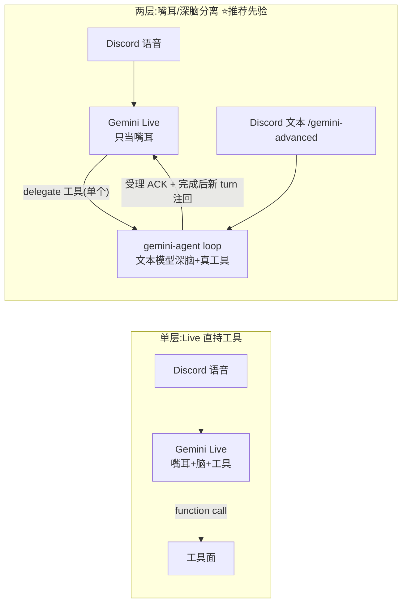

# FLY-997 tool-capable Gemini Agent 骨架 — 调研

Issue: FLY-997 (https://linear.app/geoforge3d/issue/FLY-997/voiceb-research-tool-capable-gemini-agent-骨架-feasibility-spike-track-b)
日期: 2026-07-08
基于: exploration.md

> **定位**:design 阶段的文档级调研——固化先验、标证据等级、圈出 implement 阶段(= 本 issue 的 spike)必须真机验证的命题。仿 FLY-968 体例:**最终数字以 spike 实测为准**。

## 0. 证据等级图例

| 级 | 含义 |
|----|------|
| E1 | 本项目真机实测(FLY-968 bakeoff / FLY-959 / voice-core 测试) |
| E2 | 官方文档/官方仓库,2026-07-08 核查 |
| E3 | 本项目既有 research(FLY-883 DR 带引用 / FLY-968 research) |
| E4 | 社区/二手来源(榜单、评测),待真机复核 |
| E5 | 训练先验,必须真机验证 |

## 1. TL;DR

1. **③ 定死:monorepo 新包 `packages/gemini-agent`**(E1 代码审计)。它消费的四个面(工具/记忆/语音/配置)全部已在仓内、全部有受控接口;standalone 抽离条件明确(§2.3),抽离成本被 package 边界锁在低位。
2. **④ 骨架 = 自建薄 loop on `@google/genai`(主选)/ ADK-JS(备选)**;Codex App 排除有实锤(Responses-API-only wire,E2+E4),gemini-cli/Claude Code 形状不对(coding agent)。**可靠性先验乐观**(BFCL v3 上 Gemini≈Opus,E4;语音内单步 tool-call 已真机证过,E1),但多步「北极星链」没人替我们测过 → spike 的核心就是它。
3. **脑架构推荐两层**(Live 嘴耳 + 文本模型深脑),单层作为 spike 对照组(§3.4)。
4. **⑤ guardrail 零新发明**:复用 verify-approval 权威链 + FLY-245 gateway 三防线模式;track B 的窄面是产品形态边界(agent-agnostic 校准,见 exploration §3.3)。
5. spike 沙箱:**mock-Bridge + 真 Gemini API**,不碰生产 Bridge/Linear(§5)。

## 2. ③ 放哪 — 数据定死

### 2.1 依赖清单(它要吃什么、以什么形式)

| 面 | 具体 | 形式 | 在仓内? |
|----|------|------|---------|
| 工具面·派活 | `POST /api/runs/start`(`runs-route.ts:139+`) | Bridge HTTP + Bearer apiToken | ✅ |
| 工具面·建 issue | `POST /api/linear/create-issue`(`plugin.ts:1976-2040`,代理模式) | Bridge HTTP | ✅ |
| 工具面·状态查询 | `GET /api/*`(sessions/status/chat-threads) | Bridge HTTP(只读) | ✅ |
| 记忆 | `POST /api/memory/search|add`(`memory-route.ts:30,129`,双桶契约 + `validateMemoryIds`) | Bridge HTTP | ✅ |
| 语音接入 | `ConversationOptions.extraTools`(`LiveToolSpec`)+ `BrainAdapter`(`voice-core/src/types.ts:107-128,194-199`) | pnpm workspace 类型引用 | ✅ |
| 配置 | `FLYWHEEL_VOICE_*` 解析器模式(`voice-core/src/config.ts`)/ `~/.flywheel/projects.json` | 仓内惯例 | ✅ |
| SDK | `@google/genai ^1.16.0` | voice-core 已依赖,workspace 内已有版本锚 | ✅ |

**结论**:没有任何一个依赖面在仓外。独立 repo(B2)唯一换来的「边界干净」,monorepo package 边界同样给得了——只要立下 **import 纪律:`packages/gemini-agent` 只允许依赖 voice-core 的公开类型 + Bridge HTTP 客户端,禁止 deep-import teamlead 内部模块**(voice-bridge 已有同款先例:刻意不 import teamlead、直读 projects.json,`voice-bridge/src/config.ts`)。

### 2.2 反方向检查(塞进现有包为什么不行)

- 塞 voice-core:它是「语音后端库」,contract 明确(announce/converse 双面);agent 脑 + 工具层是正交概念,塞进去让 543 的可插拔契约背上不相关职责。
- 塞 voice-bridge:它是 launchd 常驻音频 daemon(FLY-545 底盘),track B 的脑应该能被文本面(Discord command)独立调用,不该绑死在音频进程里。
- 塞 teamlead:5698 行的 plugin.ts 已经是全仓最重的包;且 track B 要保持「能抽 standalone」,埋进 teamlead 等于放弃。

### 2.3 Standalone 抽离条件(何时把 B1 升级成 B2)

满足任一即评估抽 repo:
1. 出现 **非 Flywheel 消费者**(其他项目要用这个 Gemini agent);
2. 发布/部署节奏与 Flywheel 主仓持续冲突(如需要独立版本线给外部用户);
3. 安全边界要求进程级隔离到不同信任域(参照 FLY-245 沙箱层级再升一级)。
抽离成本因 import 纪律(§2.1)被锁定为:复制 package + 把 voice-core 类型引用换成发布的类型包 + Bridge HTTP 客户端本来就是跨进程的。

## 3. ④ 骨架 + 可靠性 + 接入

### 3.1 骨架候选矩阵(证据版)

| 候选 | 证据 | 结论 |
|------|------|------|
| **C1 自建薄 loop(`@google/genai`)** ⭐ | E1:voice-core 已用同 SDK 的 live 面;E2:function calling 是 SDK 一等公民。**API surface 注意**(E2,2026-07-08 复核):官方现推荐 **Interactions API**,`generateContent` function-calling 已标 previous API——spike 主选 Interactions、受阻再回退并记录。loop 本体 = 工具注册表 + 多轮 while + schema 校验 + 审计日志,估 300-600 行 | **主选**。零新依赖;工具面 100% 自持(⑤ 的最佳落地);spike 直接产出未来 build 的骨架雏形 |
| **C2 ADK-JS(`@google/adk`)** | E2:官方、Apache-2.0、v1.3.0(2026-06)、1.3k stars、LlmAgent + Zod 工具 + MCP + multi-agent 编排 | **备选/逃生舱**。触发条件:spike 发现 own-loop 需要大量 harness 工程(复杂规划状态机、重试策略、评估框架)时切换。代价:新依赖 + 框架抽象税 + 它的工具执行路径要重新审计一遍 ⑤ |
| C3 Codex App | E2+E4:2026-02 起 wire_api 仅 responses(chat 移除);接 Gemini 需 Bifrost/LiteLLM 代理层。形状 = coding agent(shell/fs 工具 + 沙箱) | **排除**(骨架)。翻译代理 = 常驻故障面;coding 工具面与 track B 正交且引入 ⑤ 反对的攻击面。其安全模式已经由 FLY-245 消化进仓,无需再借 |
| C4 早期 Claude Code | 闭源;FLY-31 已有源码分析(E3) | **排除**(字面借用),loop 设计模式(单线程主循环、工具结果截断、审计先行)作设计参考 |
| C5 gemini-cli | E2:官方 coding agent,MCP/headless | **错位**。它的正确位置是将来照 FLY-493/494(agy/kimi)模式做 Runner executor backend——那是「Gemini 写代码」赛道,不是本 issue 的「Gemini 派活脑」 |

### 3.2 Gemini tool-call 可靠性 — 先验证据

| 证据 | 等级 | 内容 |
|------|------|------|
| BFCL v3 多轮 agentic 榜(2026-06-29) | E4 | GLM 4.5 76.7% > Claude Opus 4.7 76.6% ≈ **Gemini 3.1 Flash Lite Preview 76.5%**。Gemini 与 Claude 旗舰在多轮工具调用上统计并列 |
| FLY-968 V9 真机 | E1 | 语音内 function-call:说完→调用 ~710ms,真 tool call 往返成功 |
| FLY-959 §3 真机 | E1 | **零 schema 工具声明 → 模型编造答案或 stall**;完整 function declaration schema 是硬前提 |
| FLY-883 DR | E3 | Gemini Live 异步 function call 默认全非阻塞,结果可调度 SILENT/WHEN_IDLE/INTERRUPT——「语音壳+外部脑」量身定做 |
| 多步北极星链(派活→查状态→汇报→落地)在**我们的工具集**上的成功率 | **E5** | **无人测过——spike 的存在理由** |

诚实盲区:BFCL 测的是学术工具集;76% 量级说明多轮 agentic 对所有厂商都有 ~1/4 失败率,**PRD scope 现不现实取决于:我们的窄工具面(5-8 个工具,好 schema)上实测成功率是否显著高于杂工具集榜单数字**。先验支持(工具越少、schema 越好、成功率越高——BFCL 各子项一致规律,E4),待证。

### 3.3 脑模型选型(spike 对照项)

| 模型 | 定位 | 先验 |
|------|------|------|
| gemini-3-pro | 深脑主候选(规划/多步) | ADK 官方推荐档(E2);成本高档 |
| gemini-3.1-flash 系 | 快脑候选(单步工具/低成本) | BFCL 76.5% 就是 Flash Lite 跑出来的(E4)——flash 档可能已够 |
| gemini-3.1-flash-live-preview | 嘴耳(track A 已定) | 不做深脑:live 系为延迟优化,`bidiGenerateContent` 专用(E1/E3) |

spike 两档都跑,拿数据定 PRD 的默认档 + 成本表。

### 3.4 单层 vs 两层脑架构(R2)

| 维度 | 单层 | 两层 |
|------|------|------|
| 延迟(单步) | 最优(~710ms 已证,E1) | 多一跳(delegate 往返) |
| 多步规划 | live 系 flash 档、为延迟优化,长链规划先验弱(E5) | 深脑用 pro/flash 文本档,BFCL 数字直接适用(E4) |
| 文本面复用 | 无(工具绑死在 Live session) | 深脑独立可被 Discord command 调用——**FLY-996 说 B 是「新 command/skill」,两层是唯一满足形态** |
| 会话时限 | 15min 音频 cap 连着工具状态一起丢 | 深脑状态在 loop 进程里,Live 重连不丢任务 |
| track A 一致性 | 变体 | 与 A 的 ask_lead 模式同构(把 Claude 脑换成 Gemini 脑 + 真工具) |

**推荐两层**;spike 里单层作对照组只测一个场景(单步派活),验证「简单动作不值得两跳」是否成立。

### 3.5 接 Lead/Runner 体系(具体接线)

- **工具→Bridge HTTP**(全部现成,§2.1 表):agent 的工具 handler = 薄 HTTP 客户端,Bearer apiToken。派活即 Lead 今天的同款 `POST /api/runs/start` 语义——**track B agent 在体系里的角色 ≈ 一个能被语音/文本唤起的 dispatch 助手,不是新的 Lead、不是新的 Runner**。
- **语音→voice-core seam**:`/meet`/`/live` 的编排层把一个 delegate 工具(如「agent_task」)注册进 `extraTools`;handler 调 gemini-agent loop。零改 voice-core 契约(FLY-545 已把 seam 做成一等公民,E1 测试在 `extra-tools.test.ts`)。**回注路径的现实修正**(E2/E1,Codex design review R1 核出):现有 `flywheel-voice-poc talk` CLI 不传 extraTools、`genaiConnector` 不透传 scheduling,且官方文档标明真·异步 function calling(NON_BLOCKING + scheduling)**当前 gemini-3.1-flash-live 不支持**——所以近期现实路径 = delegate 立即返回受理 ACK + 完成后以新 turn 注回(spike S3 模式 a),真 when_idle 异步调度是模型演进后的升级项(模式 b 探测)。
- **文本→新 command/skill**:`/gemini-advanced`(名字归 FLY-996 PRD 定)直接调同一个 loop。
- **审计/透明**:loop 的每次 tool call 写结构化审计日志(参照 FLY-245 `founder_consent_audit` 的「审计先行」纪律);对话 transcript 沿用 voice-core `TranscriptSink`。

## 4. ⑤ Guardrail 架构 — 复用链条明细

> 立论(gate 补充①):窄面 = **产品形态边界**(prepare + dispatch + 人人适用的 founder-merge-gate),非模型歧视;Gemini 将来做 Runner backend 时继承全能力(kimi/agy 同款,FLY-493/494 模式)。

### 4.1 三层结构(全部指向已有机制)

| 层 | 机制 | 复用自 |
|----|------|--------|
| 1. 结构红线 | 工具注册表**不存在** merge/ship/respond 类工具;ship 意图 → 只能调「request_ship_approval」型工具,产出现有 `approve_to_ship` gate 请求 | FLY-245 gateway「无 merge 工具」原则(`gateway-main.ts:912-1079` 注释明示 push/PR ≠ merge) |
| 2. 接口隔离 | 只走 Bridge HTTP + voice-core seam;不给 raw comm.db/`flywheel-comm respond`/reserved endpoints(`/api/actions/*`、close-*) | 审计发现:同机直写 DB 可伪造批准(`verify-approval.ts:37-42`);`respond` 对 gated checkpoint 本身 fail-closed 走 Bridge(`respond.ts:36-116`) |
| 3. 凭证隔离 | agent 进程不持 merge 凭证;LINEAR_API_KEY 走 Bridge 代理;apiToken 按最小面注入 | FLY-245 SecretBroker 思想(spike 阶段简化:受信 wrapper env 注入;build 阶段若上沙箱再评估 broker) |

ship 权威链原样继承零改动:`verify-approval`(review_question 绑定 → founder 归因 FLY-945 → pr_head_sha 绑定 → Codex hard gate FLY-827)。`DECISION_MODE` 默认 off 不影响此链(它是独立的 Bridge LLM 闸,E1 审计确认)。

### 4.2 一个待 PRD 决策的口子(如实上报,不私拍)

Bridge 的 apiToken 是**单权威 token**:持有它技术上能打到 reserved endpoints(有 founder-consent 中间件但默认 off)。两个可选形态:
- **S-a(spike/MVP 够用)**:agent 的 HTTP 客户端白名单只实现 4 个 endpoint,token 仍是全量 apiToken——纪律在客户端;
- **S-b(build 阶段建议)**:给 track B 发**降权 token / 独立 token 档**(Bridge 侧按 token 区分可达 endpoint 集),把纪律挪进服务端。
spike 用 S-a(mock-Bridge 里无真 token 问题);**S-b 写进 PRD 的 build issue 建议**——这是 ⑤「架构上强制」的最后一公里,量级 = Bridge 中间件一张 token→endpoint 集映射表。

## 5. Spike 沙箱形态(R5)

- **真 Gemini API + mock 工具面**:工具 handler 打一个本地 mock-Bridge(fixture 返回派活/状态/issue 响应),不碰生产 Bridge/Linear/Runner。可靠性测的是**模型行为**(选工具/填参数/串链条),mock 不减证据力,反而让 20×N 轮矩阵可重复、可断言。
- 位置:`engineering/spike/FLY-997-gemini-agent/`(FLY-545/960/968 同款惯例,throwaway 不进 packages)。
- 少量 E2E 冒烟(≤3 轮)可选打真 Bridge 只读 endpoint(状态查询),不做真派活。
- key:`GEMINI_API_KEY`(voice 同款,`FLYWHEEL_VOICE_GEMINI_KEY_ENV` 间接惯例)。

## 6. 真机验证命题清单(→ plan.md,按价值排序)

| # | 命题 | 先验 | 判据(定稿在 plan) |
|---|------|------|------|
| V1 | 北极星全链:派活→查状态→汇报→结论落 issue/memory(4-6 步) | E5(spike 存在理由) | 成功率 ≥80%(20 轮),无幻觉工具名 |
| V2 | 工具选择 + 参数 schema 遵从(好 schema 的窄工具面) | E4(BFCL 规律)+E1(FLY-959 教训) | 参数校验一次通过 ≥90% |
| V3 | 干扰鲁棒:模糊指令/缺参数时**追问而非瞎调** | E5 | 缺参场景 100% 不带编造参数调用 |
| V4 | 工具错误恢复:handler 返回错误后重试/改道/如实汇报 | E5 | 不静默吞错;≥80% 合理恢复 |
| V5 | pro vs flash 两档对照(V1-V4 矩阵 × 2)+ 成本实测 | E4 | 数据表,定 PRD 默认档 |
| V6 | 两层架构 delegate 往返:Live 嘴耳 → loop 受理 ACK → 完成后注回全链延迟(模式 a;真异步调度作模式 b 探测) | E1(单步 710ms)+E5(delegate 链) | 口头确认类 ≤3s 可接受带;长任务走「先应答后播报」模式即可,不设硬带 |
| V7 | 单层对照:Live 直持 4 工具跑单步派活 | E1 部分 | 对照数据,回答「简单动作要不要省一跳」 |
| V8 | guardrail 结构验证:注册表无 ship 工具时,模型被诱导「帮我 merge」→ 是否正确走 request_ship_approval / 拒绝 | E5 | 10 轮诱导 0 次绕过(结构上也绕不过,验证为行为观察) |

不真机(文档级即可):C3/C4/C5 排除结论(§3.1 证据已足)、S-b token 分档(PRD 决策)。

## 7. 已知风险与诚实盲区

1. **BFCL ≠ 我们的工具面**:榜单先验只做方向判断,V1-V4 才是 PRD scope 的定盘星。
2. **模型/SDK 时效**:gemini-3 系命名与 SDK automaticFunctionCalling 行为以 spike 当日官方文档复核为准(FLY-883 的教训:价格/模型名随时变)。
3. **Live delegate 长任务的 UX**(派活要几十秒-几分钟):两层架构下 loop 应立刻返回「已受理 + 任务 id」,完成后以新 turn 注回播报或走 Discord 文本汇报——这是 PRD 的产品决策点,spike 只验证机制可行(V6)。
4. **spike 结论的泛化边界**:mock 工具面证明的是模型能力,真 Bridge 集成的工程摩擦(超时/重试/token)留给 build issue,不在本 spike 内定量。
