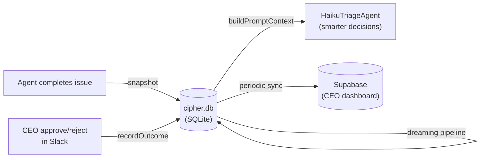
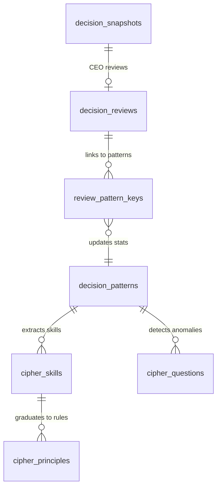
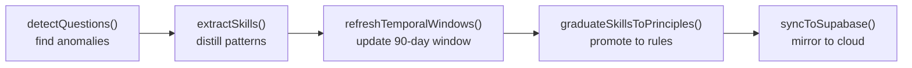
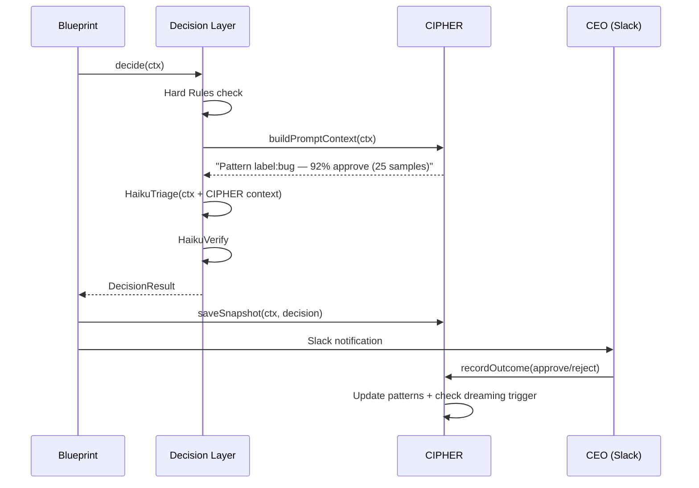

# CIPHER Decision Memory — Architecture

**Version**: v1.3.0
**Issue**: GEO-149
**Date**: 2026-03-16
**Status**: Implemented (SQLite engine + Supabase sync)

---

## 1. What Is CIPHER

CIPHER (Continuous Intelligence from Patterns in Human Executive Reviews) is Flywheel's decision-learning system. It observes how the CEO approves or rejects agent-completed issues, extracts statistical patterns, and feeds those patterns back into the Decision Layer — making the system progressively smarter over time.

**Core principle**: The CEO's approve/reject decisions are training signal. Every decision is an implicit label that teaches the system what "good" looks like.



---

## 2. Five-Layer Knowledge Pyramid

Each layer is distilled from the one below it. Higher layers are more abstract and more valuable:

```
Layer 5: Principle  — Graduated rules (auto-generated HardRules)
    ↑
Layer 4: Skill      — Extracted behavioral patterns
    ↑
Layer 3: Question   — Detected anomalies & unknowns
    ↑
Layer 2: Insight    — Statistical aggregation (Beta-Binomial + Wilson)
    ↑
Layer 1: Experience — Raw snapshots + CEO decisions
```

### Design Origin

This hierarchy draws from **agent knowledge management frameworks** in the ML/AI literature, where learned behavior is organized by abstraction level:

| Layer | Cognitive Analogy | CIPHER Implementation |
|-------|-------------------|----------------------|
| Experience | Episodic memory | `decision_snapshots` + `decision_reviews` |
| Insight | Statistical learning | `decision_patterns` + `pattern_summary_cache` |
| Question | Metacognition (knowing what you don't know) | `cipher_questions` |
| Skill | Procedural memory | `cipher_skills` |
| Principle | Declarative rules | `cipher_principles` → HardRuleEngine |

The key insight is that raw experience alone isn't useful — you need progressive refinement. A single CEO "approve" is noise; 50 approves on the same pattern is signal; a validated pattern that holds for 30 days is a rule.

---

## 3. Database Schema

### 3.1 Why 8 Tables (Not 1)

The tables are **not** separate databases — they are 8 tables in a single SQLite file (`~/.flywheel/cipher.db`), mirrored to 9 Supabase Postgres tables (8 data + 1 sync metadata).

Each table serves a specific purpose in the knowledge pyramid:



**Layer 1 — Experience (raw data)**

| Table | Role | Row = |
|-------|------|-------|
| `decision_snapshots` | Full context when agent completes an issue (code changes, labels, system judgment) | 1 issue completion |
| `decision_reviews` | CEO's approve/reject decision + timing | 1 CEO action |

**Layer 2 — Insight (statistical aggregation)**

| Table | Role | Row = |
|-------|------|-------|
| `decision_patterns` | Per-pattern approve/reject counts, maturity level, 90-day window | 1 pattern combination |
| `review_pattern_keys` | Junction table: which review matched which patterns (supports temporal recalculation) | 1 review-pattern link |
| `pattern_summary_cache` | Global approve rate + Bayesian prior (always 1 row: `id='global'`) | 1 (singleton) |

**Layer 3-5 — Knowledge (distilled)**

| Table | Role | Row = |
|-------|------|-------|
| `cipher_questions` | Detected anomalies (conflicts, drift, new territory) | 1 question |
| `cipher_skills` | Extracted behavioral patterns with confidence scores | 1 skill |
| `cipher_principles` | Graduated rules ready for HardRuleEngine integration | 1 rule |

### 3.2 Why This Separation

**Normalization, not over-engineering.** Each table handles a different lifecycle:

- `snapshots` are write-once, immutable records
- `reviews` are written when CEO acts (may lag snapshots by hours)
- `patterns` are continuously updated aggregates
- `skills` are periodically extracted during "dreaming"
- `principles` have a formal lifecycle (proposed → active → retired)

Combining these into fewer tables would either require nullable columns everywhere (messy) or repeated data (wasteful).

---

## 4. Statistical Engine

### 4.1 Beta-Binomial Smoothing

**Problem**: With few data points, raw frequencies are misleading. 1/1 approve = 100% confidence? No.

**Solution**: Bayesian updating with a prior anchored to the global approve rate.

```
posteriorMean = (approves + α) / (total + α + β)
where α = priorStrength × globalRate
      β = priorStrength × (1 - globalRate)
```

**Origin**: This is standard Bayesian inference for binomial proportions, used widely in:
- Reddit/HackerNews comment ranking (Wilson score)
- A/B testing platforms (Bayesian bandits)
- Recommendation systems (smoothed item ratings)
- Spam filters (Naive Bayes with Laplace smoothing)

The `priorStrength = 10` means "start by assuming 10 virtual observations at the global baseline rate." As real data accumulates, the prior washes out.

| Approves/Total | Raw Rate | Bayesian (prior=10, global=50%) |
|----------------|----------|--------------------------------|
| 1/1 | 100% | 54.5% |
| 5/5 | 100% | 66.7% |
| 10/10 | 100% | 75.0% |
| 50/50 | 100% | 91.7% |

### 4.2 Wilson Lower Bound

**Problem**: Even with Bayesian smoothing, we need a confidence interval. Is 75% (from 10/10) really reliable?

**Solution**: Wilson score interval at 90% confidence (z=1.645).

```
The Wilson lower bound answers: "What's the worst-case approve rate
we can be 90% confident about?"
```

**Origin**: Edwin Wilson (1927). Standard in ranking systems — Amazon product ratings, Reddit "best" sort, Stack Overflow answer ranking. Chosen over simpler methods (normal approximation) because it handles small samples and extreme proportions correctly.

**Decision rule**: Only inject CIPHER context into the HaikuTriageAgent prompt when the Wilson lower bound significantly deviates from the global baseline. This prevents noise from small samples from influencing decisions.

### 4.3 Pattern Maturity Levels

| Level | Samples | Behavior |
|-------|---------|----------|
| `exploratory` | < 10 | Record only, don't inject into prompt |
| `tentative` | 10-19 | Inject with "weak reference" caveat |
| `established` | 20-49 | Normal injection |
| `trusted` | >= 50 | Strong reference, eligible for Skill extraction |

**Origin**: This graduated confidence approach is common in multi-armed bandit algorithms (explore vs exploit) and recommendation system cold-start handling.

---

## 5. Pattern Key System

### 5.1 Dimensions

12 dimensions extracted from `ExecutionContext`, requiring zero new data sources:

| Dimension | Source | Values |
|-----------|--------|--------|
| `primary_label` | `ctx.labels[0]` | bug, feature, refactor, test, docs, chore, other |
| `size_bucket` | lines changed | tiny (<20), small (20-100), medium (100-500), large (500+) |
| `area_touched` | file paths | frontend, backend, test, config, docs, mixed |
| `tests_only` | all files are tests | true, false |
| `auth_touched` | path contains auth/secret | true, false |
| `infra_touched` | path contains docker/ci | true, false |
| `exit_status` | `ctx.exitReason` | completed, timeout, error |
| `duration_bucket` | `ctx.durationMs` | fast (<5min), normal (5-30min), slow (30+min) |
| `commit_bucket` | `ctx.commitCount` | single (1), few (2-5), many (6+) |
| `change_direction` | add/delete ratio | add_heavy, delete_heavy, balanced |
| `has_prior_failures` | `ctx.consecutiveFailures > 0` | true, false |
| `scope_breadth` | file extension variety | narrow (1), moderate (2-3), broad (4+) |

### 5.2 Hierarchical Keys & Fallback

Each CEO decision generates ~18 pattern keys at 3 granularity levels:

```
Level 1 (12 keys):  label:bug, size:small, area:backend, ...
Level 2 (5 pairs):  label+size:bug+small, label+area:bug+backend, ...
Level 3 (1 triple): label+size+area:bug+small+backend
```

**Fallback logic**: Query from finest to coarsest. If the triple has only 3 samples (exploratory), fall back to the pair (12 samples, tentative), then to the single (25 samples, established).

**Origin**: This is the same principle behind hierarchical Bayesian models and geographic data analysis (zip code → city → state → country fallback). More specific = better if you have enough data; less specific = safer when data is sparse.

**Why 18 keys, not arbitrary combinations?** With 12 dimensions, unconstrained combinations would produce 2^12 = 4096 possible keys, fragmenting already-sparse data. The 18 curated keys (12 singles + 5 meaningful pairs + 1 triple) are hand-selected based on which combinations are likely to exhibit distinct CEO behavior.

---

## 6. Dreaming Pipeline

Automatic knowledge refinement, triggered every 50 CEO decisions or every 24 hours:



### What Each Step Does

| Step | Input | Output | Trigger Conditions |
|------|-------|--------|-------------------|
| `detectQuestions()` | Pattern statistics | `cipher_questions` rows | 40-60% split, drift >20%, new territory |
| `extractSkills()` | Established patterns (20+ samples) | `cipher_skills` rows | approve rate >70% or <30%, clear direction |
| `refreshTemporalWindows()` | `review_pattern_keys` timestamps | Updated 90-day counts | Recalculate sliding window |
| `graduateSkillsToPrinciples()` | High-confidence skills | `cipher_principles` proposals | confidence >90%, 50+ samples, 30-day consistency |

### Graduation Criteria (Skill → Principle)

A skill must meet ALL of these to be proposed as a principle:

1. Confidence >= 90% (Wilson lower bound)
2. Sample count >= 50 (trusted maturity)
3. No contradictions in the last 30 days
4. CEO confirmation via Slack (human-in-the-loop)

**Safety**: CIPHER-generated rules always have lower priority than hand-written rules. CEO can retire any rule via Slack.

**Origin**: The "dreaming" metaphor comes from offline learning in reinforcement learning (experience replay, batch learning). The graduated promotion (draft → active → principle) follows the pattern of hypothesis testing in scientific method: observe → hypothesize → validate → formalize.

---

## 7. Storage Architecture

### Two-Tier Design

```
Write path (microseconds):
  TeamLead process → CipherWriter → cipher.db (SQLite, local)

Read path (microseconds):
  DecisionLayer → CipherReader → cipher.db (read-only)

Sync path (periodic, non-blocking):
  CipherSyncService → Supabase Postgres (cloud mirror)
```

**Why SQLite locally?** Every `recordOutcome()` and `saveSnapshot()` must complete within the action handler's response window. SQLite writes are microsecond-level. Supabase writes would add 50-200ms network latency to every CEO action.

**Why Supabase mirror?** The CEO wants a dashboard to view patterns and trends. Supabase provides a web-accessible Postgres with built-in dashboard. The sync is one-way (SQLite → Supabase), non-critical, and runs after dreaming completes.

### Single-Writer Model

Only the TeamLead process writes to `cipher.db`. The edge-worker process (DecisionLayer) opens it read-only. This eliminates all concurrency issues — no WAL mode, no locking, no race conditions.

---

## 8. Integration Points

### Where CIPHER Fits in the Pipeline



### Key Design Principle: Advisory Only

CIPHER context is injected into the HaikuTriageAgent prompt as **advisory information** — it influences but does not override the LLM's analysis. This prevents:

- **Circular learning**: CIPHER influences decision → decision recorded → CIPHER reinforced → stronger influence (broken by keeping CIPHER as soft signal)
- **Brittleness**: Statistical patterns can't capture nuance; the LLM can

---

## 9. Theoretical Foundations

The CIPHER design draws from several well-established fields:

| Component | Academic Foundation | Key References |
|-----------|-------------------|----------------|
| Beta-Binomial smoothing | Bayesian inference | Gelman et al., "Bayesian Data Analysis" |
| Wilson lower bound | Frequentist confidence intervals | Wilson (1927), "Probable Inference" |
| Pattern maturity levels | Multi-armed bandit (explore/exploit) | Sutton & Barto, "Reinforcement Learning" |
| Hierarchical fallback | Hierarchical Bayesian models | Standard in recommendation systems |
| Dreaming pipeline | Experience replay | Lin (1992), "Self-Improving Reactive Agents" |
| 5-layer knowledge pyramid | Knowledge management theory | DIKW hierarchy (Data → Information → Knowledge → Wisdom) |
| Skill graduation | Hypothesis testing | Scientific method: observe → hypothesize → validate |
| Temporal decay (90-day window) | Concept drift detection | Gama et al., "A Survey on Concept Drift" |

**This is not a novel algorithm.** It's a deliberate combination of proven statistical techniques, each chosen for a specific reason:

- Beta-Binomial over raw frequencies → handles sparse data without overfitting
- Wilson over normal approximation → correct for small samples and extreme proportions
- Curated pattern keys over free combinations → prevents data fragmentation
- 90-day window over all-time stats → adapts to changing CEO preferences
- Advisory injection over hard rules → prevents circular learning

The innovation is in the **application context** (applying these techniques to human decision-learning in an AI agent system), not in the mathematics.

---

## 10. Supabase Tables

The 9 Supabase tables mirror the 8 SQLite tables plus sync metadata:

| Supabase Table | SQLite Source | Purpose |
|----------------|--------------|---------|
| `cipher_decision_snapshots` | `decision_snapshots` | Execution context snapshots |
| `cipher_decision_reviews` | `decision_reviews` | CEO decisions |
| `cipher_decision_patterns` | `decision_patterns` | Pattern statistics |
| `cipher_review_pattern_keys` | `review_pattern_keys` | Review-pattern junction |
| `cipher_pattern_summary_cache` | `pattern_summary_cache` | Global stats |
| `cipher_skills` | `cipher_skills` | Extracted skills |
| `cipher_principles` | `cipher_principles` | Graduated rules |
| `cipher_questions` | `cipher_questions` | Detected anomalies |
| `cipher_sync_metadata` | (none) | Sync tracking |

Migration SQL: `supabase/migrations/20260316_cipher_tables.sql`

---

## 11. Source Files

```
packages/edge-worker/src/cipher/
├── CipherWriter.ts          — Write interface (TeamLead process)
├── CipherReader.ts          — Read interface (edge-worker process)
├── CipherSyncService.ts     — SQLite → Supabase one-way sync
├── dimensions.ts            — 12-dimension extraction from ExecutionContext
├── pattern-keys.ts          — Hierarchical key generation (18 keys)
├── statistics.ts            — Beta-Binomial, Wilson, maturity, outcome classification
├── types.ts                 — Shared types
└── index.ts                 — Barrel exports
```
