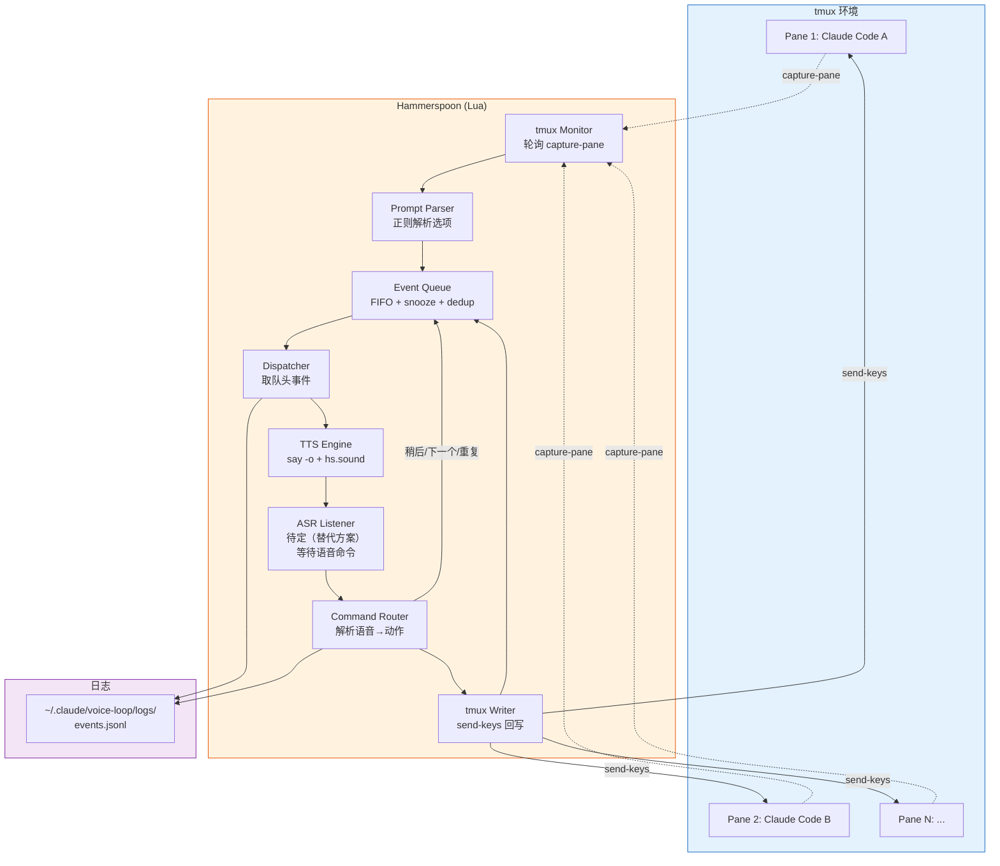
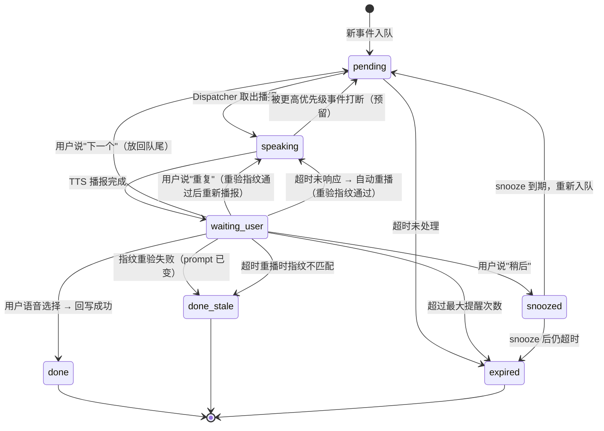
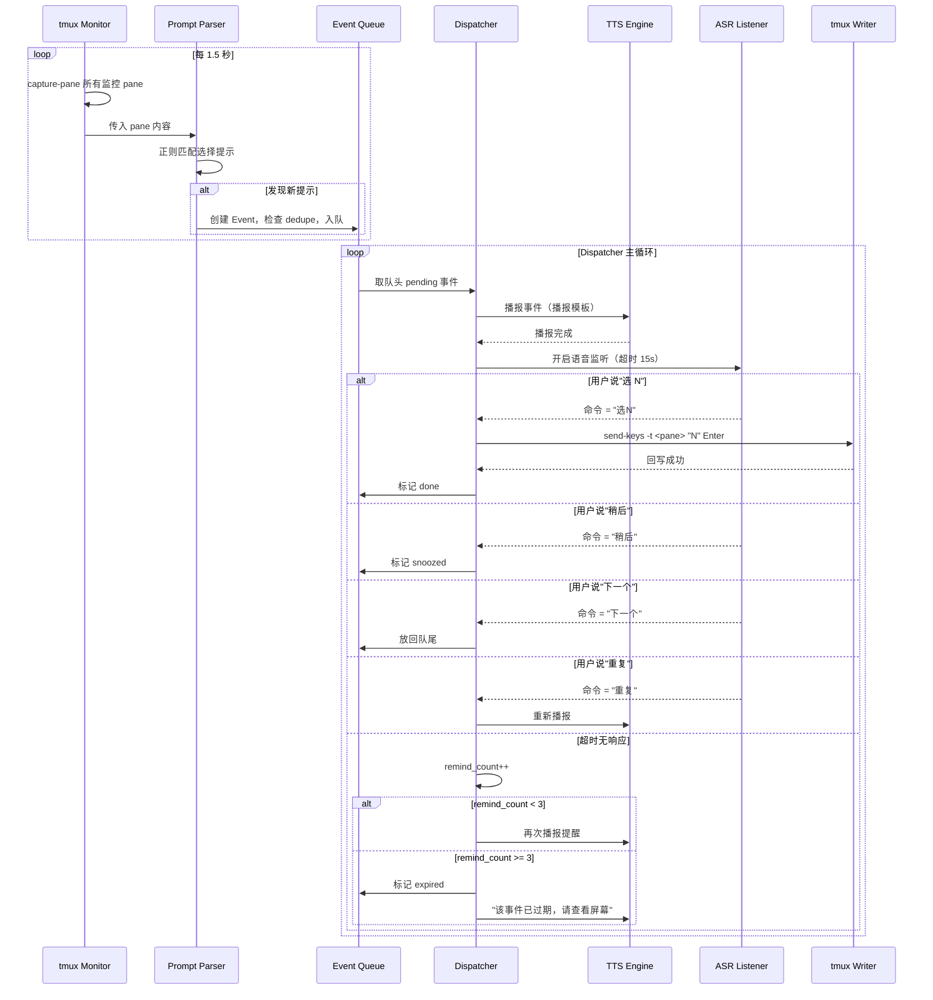
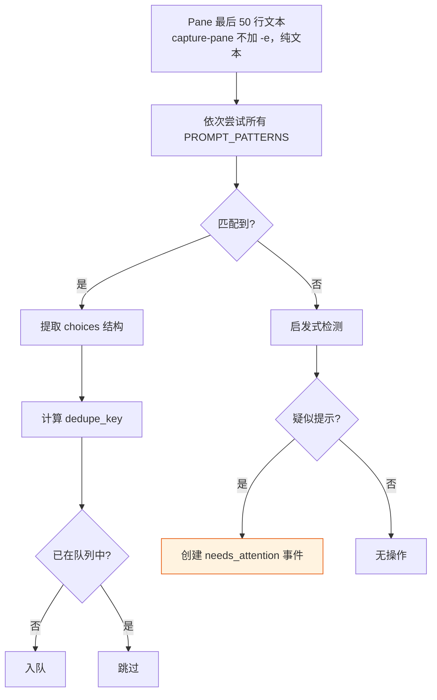

# Voice-in-the-Loop — Shared Design Overview

> 让用户戴着耳机在家走动，用语音完成 80%+ 的 Claude Code approve/choice 操作，不需要盯屏幕。

本文件包含所有 phase 共享的设计基础，从 `PLAN.md` Section 1-9, 11-13 及 Open Questions 提取。

---

## 1. 需求总结

### 目标场景

用户同时运行多个 Claude Code 实例（各自在不同 tmux pane 中），当某个任务需要人类选择（菜单 1/2/3、Approve/Reject 等）时：

1. **系统自动检测**到"需要人类介入"
2. **TTS 播报**：哪个任务需要选择、可选项是什么
3. **用户语音回答**："选一"/"选二"/"稍后"/"下一个"/"重复"
4. **系统回写**到正确的 tmux pane，任务继续

### 核心价值

- 降低 context switch 成本：不用走回电脑前点按钮
- 多任务并行时不会遗漏提示：队列化播报
- 只在"必须看内容"时才看屏幕

### 约束

- macOS only
- 语音命令词表极小（MVP < 15 个词），不需要大模型
- 优先本地化、低延迟、隐私友好

---

## 2. 方案选型对比

### 路线 A: Hammerspoon（推荐 MVP）

| 维度 | 评价 |
|------|------|
| **TTS** | `hs.speech` 直接调用 macOS 系统 TTS，零延迟，支持中英文 |
| **ASR** | `hs.speech.listener` 基于 macOS Speech Recognizer，小词表命令识别，本地离线 |
| **控制力** | Lua 脚本，完全可编程：队列、状态机、tmux CLI 调用 |
| **实现难度** | 中等 — 需要写 Lua，但 API 文档清晰 |
| **延迟** | < 500ms（本地识别 + 本地 TTS） |
| **误触发** | 可控 — 词表小、可设置唤醒词或仅在播报后监听 |
| **可扩展** | 高 — 后续可接 Whisper、加 UI overlay |
| **隐私** | 全本地，音频不出设备 |

**结论：MVP 首选。** 所有核心能力（TTS + ASR + 脚本控制 + tmux 交互）都在一个工具里闭环。

### 路线 B: macOS Voice Control

| 维度 | 评价 |
|------|------|
| 优点 | 零开发，系统内置 |
| 缺点 | 无法实现队列化播报、无法路由到正确 pane、无法编程控制状态机 |
| 适合 | 单 pane、单任务、极简场景（用户手动切窗口） |

**结论：不适合多任务队列场景，放弃。**

### 路线 C: Whisper（自由语音）

| 维度 | 评价 |
|------|------|
| 优点 | 支持自然语言（"帮我 approve A，B 稍后"） |
| 缺点 | 依赖 GPU/API、延迟高（1-3s）、MVP 不需要 |
| 适合 | Phase 4+ 扩展 |

**结论：作为后续升级路径，MVP 不用。**

### 最终选型

```
MVP:      路线 A（Hammerspoon）
Phase 4+: 可选接入路线 C（Whisper）替换 ASR 部分
路线 B:   弃用
```

> **Phase 0 实测更新 (2026-02-22):**
> - `hs.speech`（NSSpeechSynthesizer）在 macOS Sequoia 上无法播放音频。TTS 改用两阶段方案：`say -o` 合成 AIFF 文件 + `hs.sound` (NSSound) 播放。
> - `hs.speech.listener`（NSSpeechRecognizer）在 macOS Sonoma 14.5+ 上 `new()` 返回 nil（[#3529](https://github.com/Hammerspoon/hammerspoon/issues/3529)）。ASR 部分需要替代方案。
> - Hammerspoon 仍是 MVP 首选平台（tmux 集成 + Lua 脚本控制），但 TTS/ASR 的具体技术实现需要调整。

---

## 3. 系统架构

### 模块总览



### 模块职责

| 模块 | 职责 | 关键技术 |
|------|------|---------|
| **tmux Monitor** | 定期抓取所有被监控 pane 的最后 N 行 | `tmux capture-pane -t <target> -p -S -50` |
| **Prompt Parser** | 从文本中识别"需要用户选择"的提示 | 正则 + 启发式规则 |
| **Event Queue** | 事件排队、去重、snooze、超时管理 | Lua table + timer |
| **Dispatcher** | 取队头事件，驱动 TTS 播报 | 状态机控制 |
| **TTS Engine** | 语音播报 | `say -o` 合成 + `hs.sound` 播放（hs.speech 在 Sequoia 不可用） |
| **ASR Listener** | 语音命令识别 | 待定 — hs.speech.listener 在 Sonoma+ 不可用，需替代方案 |
| **Command Router** | 将识别结果映射为动作 | 词表匹配 |
| **tmux Writer** | 把用户选择写回正确 pane | `tmux send-keys -t <target>` |
| **Logger** | 记录所有事件和操作 | JSONL append |

---

## 4. 数据模型

### Event 结构

```lua
Event = {
    event_id      = "evt_001",               -- 递增 ID
    source_pane   = "main:0.1",              -- tmux target (session:window.pane)
    pane_alias    = "claude-backend",         -- 用户自定义别名（用于播报）
    detected_at   = 1708700000,              -- Unix timestamp
    prompt_excerpt= "需要选择操作方式",       -- 原始提示摘要（截断到 200 字符）
    choices       = {                         -- 结构化选项
        {key = "1", text = "Approve changes"},
        {key = "2", text = "Reject"},
        {key = "3", text = "View details"},
    },
    raw_text      = "...",                   -- 匹配到的原始文本块
    status        = "pending",               -- 状态（见状态机）
    dedupe_key    = "main:0.1|sha256_first8", -- 去重 key = pane + 内容哈希前 8 位
    snooze_until  = nil,                     -- snooze 到期时间（nil = 非 snooze）
    remind_count  = 0,                       -- 已提醒次数
    resolved_at   = nil,                     -- 完成时间
    resolved_by   = nil,                     -- "voice:1" | "timeout" | "expired"
}
```

### 状态机



### 状态说明

| 状态 | 含义 | 进入条件 | 退出条件 |
|------|------|---------|---------|
| `pending` | 等待播报 | 新检测 / snooze 到期 / "下一个" | Dispatcher 取出 |
| `speaking` | 正在 TTS 播报 | Dispatcher 开始播报 | 播报完成 |
| `waiting_user` | 等待用户语音回复 | TTS 完成 | 收到语音命令 / 超时 |
| `done` | 已处理 | 回写成功 | 终态 |
| `done_stale` | prompt 已变化 | 指纹重验不匹配 | 终态，播报"已被处理" |
| `snoozed` | 延迟处理 | 用户说"稍后" | snooze 到期 |
| `expired` | 超时未处理 | 超过最大提醒次数 | 终态 |

### Queue 行为规则

1. **FIFO 默认**：按 `detected_at` 排序
2. **同 pane 串行化**：同一 pane 的事件按检测顺序处理，不跳过
3. **去重**：`dedupe_key` 相同的事件不重复入队
4. **snooze**："稍后" → `status = snoozed`，`snooze_until = now + 120s`（默认 2 分钟）
5. **"下一个"**：当前事件放回队尾（`status = pending`），处理下一个
6. **"重复"**：不改变队列，重新播报当前事件
7. **并发上限**：同时只有一个事件处于 `speaking` 或 `waiting_user`

---

## 5. 核心流程

### 主循环（检测 → 入队 → 播报 → 等待 → 回写 → 出队）



---

## 6. tmux 集成细节

### 6.1 抓取 pane 输出（capture-pane）

**命令：**

```bash
tmux capture-pane -t <target> -p -S -50
```

- `-t <target>`：指定 pane，格式为 `session:window.pane`（如 `main:0.1`）或 pane ID（如 `%3`）
- `-p`：输出到 stdout（不写 buffer）
- `-S -50`：从倒数第 50 行开始抓（只看最近 50 行，足够检测提示）

**为什么用 `-S -50` 而不是 `-S -`（全部历史）：**
- 性能：全历史可能有几万行，解析慢
- 准确：提示一定在最近几行，抓太多反而增加误匹配
- 50 行足够覆盖 Claude Code 的选择菜单（通常 5-15 行）

**轮询频率：1.5 秒**

| 频率 | 优点 | 缺点 |
|------|------|------|
| 0.5s | 响应快 | CPU 开销大，多 pane 时明显 |
| 1.5s | 平衡 | 用户等待 < 2s，可接受 |
| 3s | 低开销 | 用户感知延迟明显 |

**去重策略：**

```lua
-- 对抓到的文本块计算简单哈希
local function compute_dedupe_key(pane_target, prompt_text)
    -- 取 prompt 核心部分（去掉时间戳等变化内容）
    local normalized = prompt_text:gsub("%d+:%d+:%d+", ""):gsub("%s+", " ")
    local hash = hs.hash.SHA256(normalized):sub(1, 8)
    return pane_target .. "|" .. hash
end
```

- 同一 `dedupe_key` 在 `done` / `expired` 之前不重复入队
- 如果 pane 内容变了（新提示覆盖了旧提示），会产生新的 `dedupe_key`

### 6.2 回写选择（send-keys）

**命令：**

```bash
tmux send-keys -t <target> "1" Enter
```

- `-t <target>`：必须精确到 pane（`session:window.pane` 或 `%N`）
- `Enter`：tmux 特殊键名，等同于回车
- 不使用 `-l`（literal），因为我们需要 `Enter` 被解析为按键

**回写前校验：**

```lua
local function validate_pane_before_send(target, event)
    -- 1. 检查 pane 是否存在（同步读操作，需要立即判定）
    local output, ok = hs.execute("tmux display-message -p -t " .. hs.fnutils.shellEscape(target) .. " '#{pane_id}' 2>/dev/null")
    if not ok or output == "" then return false, "pane not found" end

    -- 2. 重验 prompt 指纹（同步读操作）
    local current = capture_pane(target)
    local current_key = compute_dedupe_key(target, current)
    if current_key ~= event.dedupe_key then
        return false, "prompt changed (stale event)"
    end

    return true, nil
end
```

**tmux 命令执行方式：**

**异步策略边界：**
- **写操作**（`send-keys`）→ `hs.task` 异步，避免阻塞
- **读操作**（`capture-pane`、`display-message`、`list-panes`）→ `hs.execute` 同步，因为结果需要立即用于判定

```lua
-- tmux 写操作通过 hs.task 异步执行（读操作用 hs.execute 同步，见 monitor/validate 部分）
local function tmux_async(args, callback)
    local task = hs.task.new("/usr/bin/env", function(exitCode, stdout, stderr)
        if callback then callback(exitCode == 0, stdout, stderr) end
    end, {"tmux", table.unpack(args)})
    task:setWorkingDirectory(os.getenv("HOME"))
    task:start()
    return task
end

-- 示例：异步回写
tmux_async({"send-keys", "-t", target, key, "Enter"}, function(ok, stdout, stderr)
    if ok then
        mark_event_done(event)
    else
        handle_send_failure(event, stderr)
    end
end)
```

**失败处理：**
- pane 不存在 → 标记事件为 `expired`，播报"任务 X 的窗口已关闭"
- prompt 指纹不匹配 → 标记为 `done_stale`，播报"任务 X 已被处理"
- send-keys 执行失败 → 重试 1 次，仍失败则标记 `expired`

### 6.3 pane 发现与监控

**手动模式（MVP）：**

配置文件 `~/.claude/voice-loop/config.lua`:

```lua
monitored_panes = {
    { target = "main:0.0", alias = "后端任务" },
    { target = "main:0.1", alias = "前端任务" },
    { target = "work:1.0", alias = "测试" },
}
```

**自动发现模式（Phase 2+）：**

```bash
# 列出所有 pane
tmux list-panes -a -F "#{session_name}:#{window_index}.#{pane_index} #{pane_current_command} #{pane_pid}"
```

- 过滤 `pane_current_command` 包含 `claude` 或 `node`（Claude Code 进程）的 pane
- 自动注册，alias 用 `session:window.pane` 或允许用户后续绑定别名
- 定期刷新（每 30 秒），清理已关闭的 pane

---

## 7. 语音交互设计

### 7.1 播报模板

**标准播报（有结构化选项）：**

```
"[别名] 需要选择。选项：一 [选项1文本]，二 [选项2文本]，三 [选项3文本]。你要选几？"
```

**示例：**

```
"后端任务需要选择。选项：一 approve changes，二 reject，三 view details。你要选几？"
```

**无法解析时的播报：**

```
"[别名] 需要你查看屏幕确认。"
```

**超时重播：**

```
"提醒：[别名] 仍在等待选择。"
```

**事件过期：**

```
"[别名] 的选择已超时，请手动查看。"
```

**队列状态播报（用户说"状态"时）：**

```
"当前有 N 个待处理事件。第一个来自 [别名]。"
```

### 7.2 命令词表

| 命令词（中文） | 同义词/英文 | 动作 |
|---------------|------------|------|
| 选一 | 一、one、first | 发送 `1` + Enter |
| 选二 | 二、two、second | 发送 `2` + Enter |
| 选三 | 三、three、third | 发送 `3` + Enter |
| 选四 | 四、four | 发送 `4` + Enter |
| 选五 | 五、five | 发送 `5` + Enter |
| 稍后 | later、snooze | snooze 当前事件 |
| 下一个 | next、skip | 跳到下一事件 |
| 重复 | repeat、again | 重播当前事件 |
| 取消 | cancel | 标记当前事件 expired |
| 状态 | status | 播报队列状态 |
| 是 / 确认 | yes、approve | 发送 `y` + Enter（用于 yes/no 提示） |
| 否 / 拒绝 | no、reject | 发送 `n` + Enter |

**词表注册（Hammerspoon）：**

```lua
local listener = hs.speech.listener.new("VoiceLoop")
-- 关键：必须关闭 foregroundOnly，否则 Hammerspoon 不在前台时无法识别
listener:foregroundOnly(false)

-- MVP 默认词表：英文优先（识别率有保障），中文作为可选增强
-- Phase 0 gate 会验证中文命令词识别率，通过后再启用
local commands = {
    -- English (primary)
    "one", "two", "three", "four", "five",
    "later", "next", "repeat", "cancel", "status",
    "yes", "no", "approve", "reject",
}

-- 可选：中文命令词（Phase 0 验证通过后启用）
if config.enable_chinese_commands then
    local cn = {
        "选一", "选二", "选三", "选四", "选五",
        "稍后", "下一个", "重复", "取消", "状态",
        "是", "否", "确认", "拒绝",
    }
    for _, cmd in ipairs(cn) do table.insert(commands, cmd) end
end

listener:commands(commands)
listener:setCallback(onVoiceCommand)
```

### 7.3 误触发策略

| 策略 | 说明 | MVP 阶段 |
|------|------|---------|
| **仅播报后监听** | 只在 TTS 播报完后开启 ASR，15 秒内接收命令 | Phase 1 实现 |
| **小词表** | 命令词 < 30 个，误识别概率低 | Phase 1 |
| **高风险二次确认** | yes/no、approve/reject、destructive keywords 默认要求确认（见 Section 9） | Phase 1 默认开启 |
| **置信度过滤** | ASR 返回置信度低于阈值时忽略 | 取决于 hs.speech.listener 是否提供置信度 |

### 7.4 超时策略

| 参数 | 默认值 | 说明 |
|------|--------|------|
| `listen_timeout` | 15s | 播报后等待语音命令的最长时间 |
| `remind_interval` | 30s | 无响应后再次提醒的间隔 |
| `max_remind_count` | 3 | 最大提醒次数，超过则 expire |
| `snooze_duration` | 120s | "稍后"的默认延迟时间 |
| `event_ttl` | 600s | 事件最大存活时间（无论状态） |

---

## 8. 提示解析策略

### 8.1 MVP 正则规则

Claude Code 常见的选择提示格式：

```lua
local PROMPT_PATTERNS = {
    -- 格式 1: "1) text  2) text  3) text"
    { pattern = "(%d+)%)%s*(.-)%s*\n", format = "paren" },

    -- 格式 2: "1. text\n2. text\n3. text"
    { pattern = "(%d+)%.%s+(.-)%s*\n", format = "dot" },

    -- 格式 3: "[1] text  [2] text"
    { pattern = "%[(%d+)%]%s+(.-)%s*\n", format = "bracket" },

    -- 格式 4: Yes/No 二选一
    { pattern = "[Yy]es/[Nn]o", format = "yesno" },

    -- 格式 5: Approve / Reject
    { pattern = "[Aa]pprove.*[Rr]eject", format = "approve_reject" },
}
```

### 8.2 解析流程



**多条件命中规则（降低误报）：**

仅正则匹配不足以判定——必须同时满足以下条件之一：
- **条件 A（强信号）：** 正则命中选择模式 **且** pane 最后一行为空或仅含光标（表示正在等待输入）
- **条件 B（中信号）：** 正则命中 **且** 该 pane 在过去 5 秒内无新输出（通过连续两次 capture-pane 比对）
- **条件 C（弱信号 → needs_attention）：** 仅启发式匹配命中，不满足 A/B

**启发式检测（兜底，仅产生 needs_attention）：**
- 文本末尾出现 `?` 或 `：` 且该行较短（< 80 字符）
- 包含关键词：`choose`, `select`, `which`, `option`, `approve`, `confirm`
- 连续两次 capture-pane 内容相同（pane 处于等待状态）

**解析失败处理（Phase 2+，非 MVP）：**
- 创建 `needs_attention` 类型事件
- 播报："[别名] 有新消息需要你查看屏幕确认。"
- 不尝试回写
- **MVP 阶段：** 解析失败时直接跳过，不入队

### 8.3 ANSI escape code 处理

**关键：`tmux capture-pane` 不加 `-e` 标志时，输出不包含 ANSI escape codes。**

因此 MVP 阶段：
- **不使用 `-e` 标志**（默认行为，输出纯文本）
- **不需要 ANSI 清洗函数**
- 如果未来因调试需要启用 `-e`，再引入完整的 ANSI parser（不手写 regex）

```lua
-- 读操作（capture-pane、display-message、list-panes）使用 hs.execute 同步，
-- 因为结果需要立即用于解析/校验逻辑
-- 写操作（send-keys）使用 hs.task 异步，避免阻塞主循环
-- 见 Section 6.2 tmux_async 定义
local function capture_pane(target)
    local output = hs.execute("tmux capture-pane -t " .. hs.fnutils.shellEscape(target) .. " -p -S -50 2>/dev/null")
    return output or ""
end
```

---

## 9. 安全与误操作防护

### 强绑定 pane

- 每个 Event 绑定 `source_pane`（tmux target）
- 回写前 **必须** 二次校验：
  - pane 存在（`tmux display-message -p -t <target> '#{pane_id}'`）
  - **prompt 指纹匹配**：重新 capture-pane，计算 dedupe_key 与事件一致
- 不止回写前——**每次重播、每次命令执行前都做指纹重验**
- 校验失败 → 不回写，标记为 `done_stale`（内容已变）或 `expired`（pane 不存在），播报通知用户

### 二次确认机制

```lua
config = {
    -- 数字选择（1/2/3）：默认不要求确认（低风险）
    confirm_before_send = false,

    -- 高风险操作默认要求确认（yes/no、approve/reject、destructive keywords）
    confirm_high_risk = true,  -- MVP 默认开启
    confirm_keywords = { "delete", "remove", "force", "reset", "drop", "destroy" },
}
```

**高风险判定逻辑：**
- `yes/no` 类型提示 → 总是要求二次确认
- `approve/reject` 类型提示 → 总是要求二次确认
- 选项文本包含 `confirm_keywords` 中的词 → 要求二次确认
- 普通数字选择（1/2/3 菜单）→ 不要求确认

**确认流程：** 用户说"yes" → TTS 回读"确认 approve 吗？" → 用户说"confirm/yes" → 执行
**撤销窗口：** 回读后 2 秒内说"cancel"可撤销（而非等完整超时）

### 日志

文件位置：`~/.claude/voice-loop/logs/events.jsonl`

每条记录：

```jsonl
{"ts":"2026-02-22T10:00:00Z","type":"detected","event_id":"evt_001","pane":"main:0.1","choices":3}
{"ts":"2026-02-22T10:00:01Z","type":"tts_start","event_id":"evt_001"}
{"ts":"2026-02-22T10:00:04Z","type":"tts_done","event_id":"evt_001"}
{"ts":"2026-02-22T10:00:06Z","type":"voice_cmd","event_id":"evt_001","cmd":"选一","raw":"选一"}
{"ts":"2026-02-22T10:00:06Z","type":"send_keys","event_id":"evt_001","pane":"main:0.1","keys":"1 Enter","ok":true}
{"ts":"2026-02-22T10:00:06Z","type":"resolved","event_id":"evt_001","by":"voice:1"}
```

日志轮转（Phase 3）：每天一个文件，保留 30 天。MVP 阶段使用单文件 append。

### 隐私

- `hs.speech.listener` 纯本地，音频不出设备
- 日志不记录 pane 完整内容，只记录 `choices` 数量和操作
- 如未来接 Whisper，默认使用本地模型（`whisper.cpp`），不调用云 API

---

## 11. 测试计划

### 单元测试

| 模块 | 测试内容 | 方法 |
|------|---------|------|
| Parser | 各种提示格式的匹配/不匹配 | 准备 20+ 样本文本，验证解析结果 |
| Queue | FIFO、去重、snooze、过期 | Lua 单元测试 |
| Router | 命令词映射正确性 | 枚举所有命令词 |
| Writer | target 校验、失败处理 | mock tmux 命令 |

### 集成测试

| 场景 | 步骤 | 预期 |
|------|------|------|
| 基本闭环 | pane 出现提示 → 播报 → 语音选择 | pane 收到正确输入 |
| 多 pane | 2 pane 同时出现提示 | FIFO 播报，各自回写正确 |
| snooze | 播报 → "稍后" | 2 分钟后重新播报 |
| pane 消失 | 事件 pending 时关闭 pane | 事件标记 expired，通知用户 |
| 提示消失 | 事件 pending 时手动在 pane 操作 | 事件标记 done |
| 去重 | 同一提示连续被检测到 | 只入队一次 |
| 超时 | 播报后不响应 | 提醒 3 次后 expire |

### 误触发测试

| 场景 | 预期 |
|------|------|
| pane 输出普通日志（含数字列表但非选择提示） | 不入队 |
| 环境噪音 | ASR 不触发（仅在 `waiting_user` 状态监听） |
| 用户说非命令词 | 忽略，继续等待 |

### 端到端测试脚本

```bash
#!/bin/bash
# test-voice-loop.sh
# 在指定 pane 中模拟 Claude Code 的选择提示

PANE="main:0.0"

echo "=== Test 1: 数字菜单 ==="
tmux send-keys -t "$PANE" "echo '请选择操作：
1) Approve all changes
2) Reject and explain
3) View diff first
'" Enter

sleep 5  # 等待播报

echo "=== Test 2: Yes/No ==="
tmux send-keys -t "$PANE" "echo 'Continue? (yes/no)'" Enter
```

---

## 12. 配置与可运维性

### 目录结构

```
~/.claude/voice-loop/
├── config.lua              # 用户配置
├── logs/
│   ├── events-2026-02-22.jsonl
│   └── ...
└── ...

~/.hammerspoon/
├── init.lua                # 加载 voice-loop
└── voice-loop/
    ├── init.lua            # 模块入口
    ├── monitor.lua         # tmux 轮询
    ├── parser.lua          # 提示解析
    ├── queue.lua           # 事件队列
    ├── dispatcher.lua      # 主循环调度
    ├── tts.lua             # TTS 封装
    ├── listener.lua        # ASR 封装
    ├── router.lua          # 命令路由
    ├── writer.lua          # tmux 回写
    └── logger.lua          # 日志
```

### config.lua 示例

```lua
return {
    -- 监控的 pane 列表（Phase 0-1 手动配置）
    monitored_panes = {
        { target = "main:0.0", alias = "后端" },
        { target = "main:0.1", alias = "前端" },
    },

    -- Phase 2+ 自动发现
    auto_discover = false,
    auto_discover_filter = "claude",  -- pane_current_command 包含此字符串

    -- 轮询
    poll_interval = 1.5,    -- 秒
    capture_lines = 50,     -- capture-pane 行数

    -- 超时
    listen_timeout = 15,    -- 播报后等待语音秒数
    remind_interval = 30,   -- 重播间隔秒数
    max_remind_count = 3,   -- 最大提醒次数
    snooze_duration = 120,  -- snooze 秒数
    event_ttl = 600,        -- 事件最大存活秒数

    -- TTS
    tts_voice = "Ting-Ting", -- macOS 中文语音（或 "Samantha" 英文）
    tts_rate = 200,          -- 语速（words per minute）

    -- 安全（与 Section 9 安全章节对齐）
    confirm_before_send = false,       -- 数字选择（1/2/3）不要求确认
    confirm_high_risk = true,          -- yes/no、approve/reject、destructive keywords 要求确认
    confirm_keywords = { "delete", "remove", "force", "reset", "drop", "destroy" },

    -- 日志
    log_dir = os.getenv("HOME") .. "/.claude/voice-loop/logs",
    log_retention_days = 30,
}
```

### 启动/暂停

在 Hammerspoon console 或通过热键：

```lua
-- 启动
voiceLoop:start()

-- 暂停（停止轮询和监听，不清空队列）
voiceLoop:pause()

-- 恢复
voiceLoop:resume()

-- 停止（清空队列）
voiceLoop:stop()

-- 热键绑定（建议）
hs.hotkey.bind({"cmd", "shift"}, "V", function()
    voiceLoop:toggle()
end)
```

### 用户使用说明草稿

```
Voice Loop 使用说明
==================

启动：
  1. 确保 Hammerspoon 已运行
  2. 按 Cmd+Shift+V 启动语音控制（或在 Hammerspoon console 执行 voiceLoop:start()）
  3. 确认听到提示音"语音控制已启动"

使用：
  - 当你的 Claude Code 任务需要选择时，耳机会播报选项
  - 说"选一"/"选二"/"选三"来选择
  - 说"稍后"延迟 2 分钟
  - 说"下一个"跳到下一个待处理事件
  - 说"重复"重听当前播报
  - 说"状态"听取队列概况

配置监控的 pane：
  - 编辑 ~/.claude/voice-loop/config.lua
  - 查看 pane 列表：tmux list-panes -a -F "#{session_name}:#{window_index}.#{pane_index}"
  - 给每个 pane 起一个 alias（用于播报）

遇到识别错误：
  - 说"重复"重听，然后重新说命令
  - 如果反复识别错误，按 Cmd+Shift+V 暂停语音控制，手动操作
  - 可调整 config.lua 中的 tts_voice 和 tts_rate

查看日志：
  - 日志位于 ~/.claude/voice-loop/logs/
  - 每天一个文件，保留 30 天
```

---

## 13. 手动配置示例

### 如何找到要监控的 pane

```bash
# 列出所有 tmux pane
tmux list-panes -a -F "#{session_name}:#{window_index}.#{pane_index}  #{pane_current_command}  #{pane_title}"

# 示例输出：
# main:0.0  zsh  ~
# main:0.1  node  claude-code
# main:1.0  node  claude-code
# work:0.0  vim  project.py
```

从输出中找到运行 Claude Code 的 pane（`pane_current_command` 为 `node`），把 target 填入 `config.lua`。

### 给 pane 绑定别名

```lua
monitored_panes = {
    { target = "main:0.1", alias = "后端重构" },
    { target = "main:1.0", alias = "API 测试" },
}
```

播报时会说："后端重构需要选择。" 而不是 "main:0.1 需要选择。"

---

## Open Questions

1. ~~**`hs.speech.listener` 中文支持？**~~ → **Resolved (Codex Round 1 #3):** MVP 默认英文词表，中文作为可选增强。Phase 0 增加中文词表 gate 验证。

2. **Hammerspoon `hs.speech.listener` 是否提供置信度？** — 官方文档未明确。Phase 0 需实测。如果不提供，误触发依靠"仅 waiting_user 时监听"+ 小词表来控制。

3. **TTS 中英混合？** — Claude Code 的选项文本通常是英文。macOS TTS 的中文语音（Ting-Ting）读英文可能不自然。可考虑：选项编号用中文读（"一、二、三"），选项内容用英文语音读，或者只读编号不读完整内容。

4. **tmux pane 与 Claude Code 实例的对应关系？** — 用户可能在同一 pane 中 exit 一个 Claude Code 再启动另一个。已通过 prompt 指纹重验（dedupe_key 比对）部分解决——新实例会产生不同指纹，旧事件自动标记 `done_stale`。

5. ~~**耳机切换？**~~ → **Resolved (Codex Round 1 #9):** 加入 Phase 0 preflight checklist，包含耳机切换测试。

6. ~~**`hs.speech` TTS 可用性?**~~ → **Resolved (Phase 0):** `hs.speech` (NSSpeechSynthesizer) 在 macOS Sequoia 上无声。改用 `say -o` + `hs.sound` 两阶段方案，已验证。

7. ~~**`hs.speech.listener` ASR 可用性?**~~ → **Resolved (Phase 0):** 在 macOS Sonoma+ 上 `new()` 返回 nil。需要替代 ASR 方案（Whisper.cpp 或 hotkey fallback）。

8. **`coreaudiod` 长时间运行导致音频失效?** — Phase 0 实测中发现 coreaudiod 运行 14 天后系统音频完全失效，`sudo killall coreaudiod` 可修复。需要考虑是否在启动时检测/提示。
