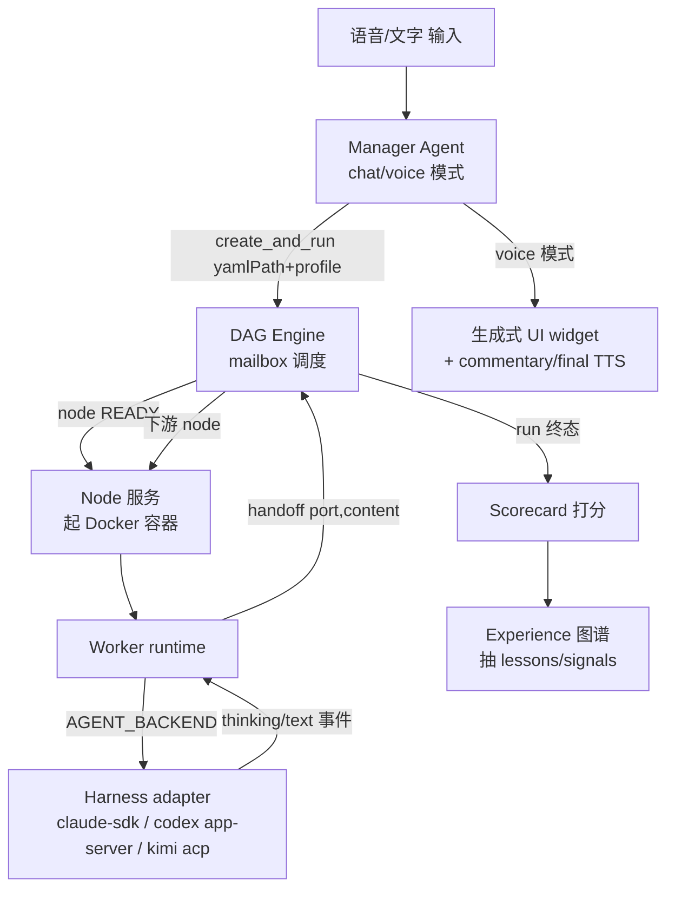

# FLY-1004 homerail 代码深挖报告(基于源码,不是视频)

Issue: FLY-1004 (https://linear.app/geoforge3d/issue/FLY-1004/homerail-竞品分析-开源代码借鉴-语音多-agent-编排-ex-jarvis)
日期: 2026-07-08
基于: research.md + eng-idea-for-tadashi.md(同文件夹)。**本文是 Annie 反馈后的 v2 深挖 —— 逐条盘功能 + 细架构 + 诚实对比,读代码得出,不靠视频。**

> **⚠️ 对我上一版的修正 + 我们自己系统的事实校正(grep 了 codebase,不拍脑袋)**:
> ① 第一版错说"它没有跨-run 记忆" —— 错,它有 experience/lesson 结构化图谱(§1.6/§7)。
> ② **我们没用 Docker** —— Runner 是 tmux + git worktree 裸跑在主机上(codebase:docker 1 处 / tmux 744 / worktree 842)。它的 Docker 容器隔离是我们**没有**的一层(→ 沙箱 FLY-346 / 多机 FLY-1005 可借鉴)。
> ③ **我们 mem0+pgvector 代码在但基本没接**(env-gated,主力=文件 markdown)—— 别再说"我们语义检索更强"。
> ④ **grounded 编排对比**:我们的 DAG = `dag-resolver`(Kahn 拓扑、**严格无环**、issue 级依赖),没有 homerail 那种 run 内工作流 loop;fork 我们靠 Claude Code 原生 `--resume`(不做截断分叉);replay 我们有一种(Bridge 重启按 executionId 确定性重认领 Runner)。详见 ⭐ 深挖节的对比。

---

## 0. 项目坐标(GitHub 链接 + 怎么读的)

- **GitHub**:**https://github.com/xiaotianfotos/homerail**(公开、可 clone、MIT 系)。
- 一句话:*"Voice-first local agent orchestration runtime for auditable DAG workflows."*
- **规模(实测)**:**~95,000 行代码**,6 个包 + agent-ui + skills。分布:manager 27.9K / agent-ui 41.3K(Vue)/ worker 11.2K / cli 8.5K / node 4.4K / protocol 2.1K。**这是一个体量真实的工程项目,不是 demo。** TypeScript,~191★,clone 时 3h 前还在 push。
- **作者**:小天fotos(独立开发者,陕西);模型栈自述 glm max 年 + kimi 199 包年 + $200/月 codex。
- **方法(回应 Annie:看代码不看视频)**:把 repo clone 到本地,读了 30+ 个源文件 + 全部 48 张 SQLite 表结构 + CLI 命令注册 + 进程间 WS/JSON-RPC 协议。功能盘点和架构均 code-grounded,带文件出处。

---

## ⭐ 深挖:Annie 点名的 4 块(code-grounded 实现细节 + 我们能学啥)

> Annie 看了 README,点了 4 个"最该学"的方向。本节按她的点逐块给足实现细节(带 repo 文件出处)。其余功能域见 §1 略读。

### ① DAG 运行时 —— loop / replay / inject / profile 怎么实现(她明说想了解)
- **loop**(`orchestration/dag-engine.ts`):`loop_gateway` node + `loop_sources`。loop source `handoff` 后**保持 RUNNING 不 COMPLETED**;`_wakeLoopSource` / `_wakeLoopGatewayReceiver` 在有新数据时把它拉回 READY,并把 mailbox 里多条**只留最后一条**(last-value coalescing)。→ 支持"迭代直到满足条件"的循环子图,不是纯 DAG。
- **replay**(`runtime/active-runs.ts` `_replayHandoffsInto`):Manager 重启后,从**持久化的 handoff 历史重放**进一个中性 DAGRun 重建内存态,再把权威 node-state snapshot 叠上去 = **确定性重建**,run 态不因进程重启丢。
- **inject**(`active-runs.ts:1090` `injectActiveRun`):运行中给某 node **注入一条指令**,emit `dag:instruction_injected`(type "inject");这条 intervention 后来被 experience 图谱抽成 RunSignal(intervention.total)。→ 人随时干预跑着的 run + 留痕。
- **checkpoint resume**(`active-runs.ts:845` `checkpointResumeActiveRun`):**fork 一个新 session**(拒绝复用父 session;attempt++;`checkpointForkSession` 把 transcript 截断到某 entry,记 keptEntries/totalEntries),把 resume 指令塞进 node mailbox 的 `checkpoint_resume`,node→READY。→ 恢复不是"接着原 transcript 跑",是"**fork 干净 session + resume 指令注进下一个 prompt**"(codex adapter 也明说走这条)。
- **profile**(`protocol/types.ts` `RuntimeProfile`):DAG 模板声明 `runtime_profiles` map,每 profile 的 `agents` 把每个 agent 角色映射到 provider/model/agent_type,`"*"` 通配设默认 + 逐 agent 覆盖。选一个 profile(如 `offline-deterministic`)= **一键把整张图的模型配置切换**。"贵脑子便宜手"就靠它给 planner/worker 配不同模型。
- **我们能学**:①replay 式**确定性重建**(重启不丢 run 态)→ 借鉴我们 Bridge 重启对账(FLY-172);②**inject 运行中干预 + 记成 intervention signal**;③checkpoint resume = **fork 新 session + 注 prompt**(比接原 transcript 干净,值得对照我们 resume);④profile **一键切整图模型**(对照我们 per-agent model override FLY-241)。**⚠️ 编排基元不用换**——我们 issue-driven 三段式更贴真实协作;但这 4 个运行时能力值得**单点借鉴**。

### ② 生成式 UI —— 做法 + 亮点(她说我们做的已 OK,找加分项)
- **做法**(`widgets/widget-file-protocol.ts` + `protocol/manager-agent-tools.ts`):model 调 `show_*_card`/`show_dynamic_widget`/`write_widget_file`(TOML)→ `parseWidgetToml` → `validateWidgetToml`(**校验失败返错 → model 自己修再写**)→ `renderWidget`(按 type 归一化)→ 写 **per-session TOML 文件**(projectId/sessionId/widgetId)→ UI 读归一化 widget。有 `widgetTomlExample` 给 model 参考的 canonical 例子。
- **亮点(对比我们,3 个加分项)**:① **校验-修复回路**(model 吐的 TOML 过 schema,错了让它自己修再渲染)—— 比"直接渲染 model 输出"更稳;② **per-session 文件 + 稳定 widget_id**(更新不重复建卡,防刷屏);③ **voice_memo / task_draft 是带状态机的结构化 widget**(listening→clarifying→ready→executing→done / draft→needs_confirmation→submitted)—— **UI 即状态**。
- **我们能学**:校验-修复回路 + 稳定 id 去重 + 状态机 widget,这三个直接是我们生成式 UI 的加分项。

### ③ 语音面 —— 双 TTS + 3 ASR 的实现(挑喂 Voice PRD FLY-906 的亮点)
- **双 TTS 通道**(`server/voice.ts:61`):`thinking` 事件→**commentary**(边干边说),`text`→**final**(答案);commentary **只有会 stream reasoning 的后端(Codex)自动合成**(claude-sdk/kimi 沉默 = provider capability gap)。
- **3 ASR 策略**(`voice.ts:51`):`native_realtime`(WS 代理上游 `/v1/realtime`)/ `emulated_batch`(收 PCM16、finish 时批量转,**伪实时降级**)/ `ark_voice`。一个 WS server(`/api/voice/asr/realtime`)桥接麦↔provider,PCM16↔WAV 自拼头。
- **亮点喂我们 Voice PRD**:① **双通道让"在想/在说"有声音**(直接是我们 §12/§15 的 filler「让我看一下」);② **emulated_batch 降级策略** —— 实时 STT 起不来先做"说完批量转",对我们 **Discord 收音风险(FLY-544)是可行的 MVP 降级路径**;③ 生成式 UI 让**朗读短**(长内容进卡片,不念)。**⚠️ 约束**:commentary 依赖后端 reasoning stream,别假设所有后端都有 → filler 设计别绑死 reasoning。

### ④ Docker Worker —— Manager→Node→Worker 隔离/生命周期(接多机 FLY-1005 + 沙箱 FLY-346,给足工程细节)
- **链路**:Manager 经 WS 让 Node `createWorkerContainer`(`node/lifecycle/create.ts`,默认 image `homerail-worker:latest`)→ Node 用 `DockerCliProvider`(`node/providers/docker-cli-provider.ts`,**`ExecutionProvider` 抽象**,shell 到 docker CLI)`docker create`(bind mount workspace + env + label + network + entrypoint)→ start → exec/logs → stop/rm。
- **隔离**:**一 DAG node 一容器**;**非 root `node` 用户**(Dockerfile);**mount 策略**(`node/storage/mount-policy.ts` `validateMounts` + `allowed_host_roots` 白名单 + `workerAllowedMounts`)控制能挂哪些宿主目录;**凭据加密**(env 值 encryptSecret)。worker 镜像里烤了 `kimi` CLI。
- **生命周期**(`DockerCliProvider`):create / inspect / logs(`-f` 流式)/ remove(`-f`)/ start / stop / kill,**typed 错误**(DockerNotFound / DockerDaemon / DockerPermission),**跨平台 docker binary 解析**(Windows 候选路径 + env `HOMERAIL_DOCKER_BIN`/`DOCKER_BIN`)。
- **我们能学(这块对 346/1005 最直接)**:① **`ExecutionProvider` 抽象** —— 可换 docker/podman/远程,**多机(FLY-1005)时每机一个 provider**;② **mount 白名单 = 沙箱核心闸**(FLY-346 直接能用的模型);③ **一 node 一容器 + 非 root + 凭据加密** = 沙箱隔离范式;④ container lifecycle(create/start/exec/logs/stop/rm)+ typed 错误 + 跨平台 binary 解析 = **现成的工程细节**。**这是我们下一步(346 沙箱 + 1005 多机)最能直接抄工程细节的一块。**

---

## 1. 功能盘点 —— 它现在到底有多少功能(逐条,code-grounded)

**总览:大致 15 个功能域**(成熟度差别很大:DAG 编排 / harness / provider / 语音最成熟;生成式 UI、经验图谱作者自己标 "in exploration" / 早期)。逐域列:

### 1.1 DAG 编排(最成熟的核心)
- mailbox 式 DAG 引擎(`orchestration/dag-engine.ts`):7 种 node 状态(PENDING/READY/RUNNING/COMPLETED/FAILED/CANCELLED/SKIPPED)、显式 port、边 condition(`on_success`/`on_failure`/`always`)、`after_dep` 排序边、失败路由、`_skipDependentNodes` + 有替代路径兜底。
- **循环支持**:`loop_gateway` node + `loop_sources`(可回环,非纯 DAG)。
- **YAML 编排模板**(`assets/orchestrations/*.yaml.template`)+ `list_orchestrations` 让 Manager Agent 挑模板起 run。
- **RuntimeProfile**(`protocol/types.ts:65-126`):`runtime_profiles` map,每 profile 给每个 agent 角色映射 provider/model(如 `offline-deterministic` 测试用;真 profile 把 planner→贵模型、worker→便宜模型)。
- run 级 **workspace 隔离**(`${HOMERAIL_HOME}/workspace/<run_id>/`)。
- 运维动作:`replay`(重放)、`supervise`(盯)、`inject`(运行中给某 node 注入指令)、`quick`/`watch`/`chats`/`handoffs`(看 run 内部)。

### 1.2 Worker 的编排原语(`worker/dag-tools/`)
4 个工具:`handoff(port,content,summary)`(每轮一次,交给下游)、`send_message`/`receive_message(timeout=300s)`(node↔node 直接消息,阻塞等 inbox)、`get_graph_context`(worker 查自己所在图)。

### 1.3 语音(比我们成熟)
- **两条 TTS 通道**:`commentary`(边干边说/推理流)+ `final`(答案),可配(`voice.ts:61`)。
- **3 种 ASR 实时策略**:`native_realtime`(WS 代理 `/v1/realtime`)/ `emulated_batch`(收 PCM16 批量转)/ `ark_voice`(字节)。`/api/voice/asr/realtime` WS server 桥接麦↔provider,PCM16↔WAV 自拼。
- `recognition_mode`:`asr` | `omni`(多模态音频模型路径)。VAD 未在服务端见,大概客户端(⚠️ UNKNOWN)。
- 语音供应商:小米 MiMo / 字节火山 openspeech+Ark+Doubao / OpenAI-兼容 / qwen3-tts。

### 1.4 生成式 UI(作者标 in exploration)
- Manager Agent voice 模式下调工具吐 UI:`show_status_card`/`show_list_card`/`show_progress_card`/`show_note_card`/`show_artifact_card`/`show_dynamic_widget`(type=html/metric_strip/timeline/dag_flow/chart/topic_outline/slide_deck)。
- 6 种 widget file 类型(memo/task_draft/progress_status/checklist/artifact_ref/timeline),存 per-session TOML、稳定 id 更新不重复(`widget-file-protocol.ts`)。
- `voice_memo`(多轮补槽:known_facts/open_questions/todos/next_action/ready_to_execute)+ `task_draft`(执行前确认:acceptance/constraints/status)。

### 1.5 模型 / Provider(7 家中国模型 + 计费模型抽象 —— 真产品洞察)
- **7 个 provider 家族**(`provider-catalog.ts`):Kimi/Moonshot、智谱 GLM、Xiaomi MiMo、DeepSeek、MiniMax、阿里云百炼/DashScope(qwen)、火山方舟(Volcengine Ark)。
- **每家有计费变体**:`API 计费` / `Coding Plan` / `Token Plan` / `subscription`。→ **它的 provider 抽象是围绕"中国独立开发者的订阅/包年现实"设计的**,不只是 per-token API。
- `llm_settings` 用能力位(`supports_asr`/`supports_tts`/`supports_llm`)+ `is_active`/`is_default` 管理;凭据加密存储(§1.8)。CLI:`hr model configure` / `llm-settings` / `provider`。

### 1.6 记忆 / 经验图谱(⚠️ 修正:它有,不是没有)
- **experience 知识图谱**(`server/experience.ts` + 表 `experience_nodes`/`experience_relationships`/`experience_ingest_jobs`):从每个 run 的 evidence + scorecard 抽 `ExperienceDelta`(upsert_nodes + upsert_relationships + evidence + promoted 标)。
- **17 种节点类型**:UserGoal/Issue/Run/PullRequest/OrchestrationTemplate/RuntimeProfile/Provider/Model/WorkerAgent/Tool/Skill/Hook/ArtifactContract/ScorecardResult/**FailureRootCause/Lesson/RunSignal**。
- 抽取 intervention/failure/lesson **signals**,ingest 进图谱(经 `/api/runs/:id/experience` + `dag-status/:id/experience-ingest/retry` 接进 run 流,非纯脚手架)。另有 `memories` 表(kind 索引)。
- **性质**:这是**结构化"从过去的 run 学教训"的知识图谱**(节点+类型化关系+lesson 抽取),**不是**语义向量记忆(没见 embedding/vector 列)。→ ⚠️ **事实校正(grep 了我们 codebase)**:我们 mem0+pgvector **代码在但基本没接**(`createMemoryService` env-gated,没配就 Disabling memory),**主力记忆是文件 markdown**;所以**不是"我们语义更强"** —— 两边都非活的语义检索,它"自动从 run 抽结构化 lesson"这条**我们没有、可能反而更成熟**。成熟度双方 UNKNOWN。

### 1.7 质量 / 评估 / 审计(招牌:auditable)
- **Scorecard**(`server/scorecard.ts`):run 跑完自动打分,check 类型(实测)= `no_failed_nodes` / `handoff_reported_blockers` / **`handoff_success_contradictions`(声称成功但证据不符)** / **`tool_activity_evidence`(真调工具干活 vs 只说话)** / `handoff_header_contract` / `blind_spot`;结果含 verdict/score/hard_error/soft_warning/blind_spot/intervention 计数 + 每 node tool 活动。**= "agent 到底真干活了没、有没有谎报成功"的质量闸。**
- **审计**:per-run JSONL transcript + **SHA checksum + sidecar + 完整性校验**(`worker/audit/`)+ tool-event + error-log。
- **eval-run / replay / trace / stats / evidence** CLI + `/api/runs/:id/{scorecard,eval-run,replay,audit/summary,metrics}`。

### 1.8 安全(有真东西)
- **凭据加密**:MCP server / node 的环境变量值 `encryptSecret` 后存(`secret-store.ts`),`secret_storage: manager_encrypted | legacy_plaintext`,对外 masked view;表 `encrypted_credentials`/`temporary_keys`。
- **Mount 策略**(`node/storage/mount-policy.ts`):`allowed_host_roots` 白名单 + `validateMounts`/`workerAllowedMounts` —— 控制 worker 容器能挂哪些宿主目录。
- 表 `security_policies` / `security_audit_logs`。

### 1.9 多节点 / 容器 / 运维
- **Node 服务**起 Docker Worker 容器(`node/lifecycle/{create,inspect,logs,remove,start,stop}.ts` + `control-plane/`),一 DAG node 一容器,非 root `node` 用户,workspace 挂载,`kimi` CLI 烤进镜像。表 `nodes`/`node_sessions`/`worker_container_mappings`/`container_volumes`。
- **服务化**:`hr runtime {start,status,stop,restart,logs,install,uninstall,delete-service}` —— 可装成常驻服务。`hr doctor`/`smoke` 自检。
- **多节点**是 ROADMAP long-term,已有 node 抽象铺路。

### 1.10 集成
- **MCP servers**(`mcp-servers.ts`):STDIO | SSE,env 加密。→ worker 可接 MCP 工具。
- **git_servers** 表(git 集成)、**storages**/存储用量追踪。

### 1.11 CLI(~28 命令域,比 README 列的多得多)
config(+wizard/show/path/set)、provider、profile、llm-settings、model、run/runs、dag(resume/sync/quick/watch/supervise/chats/handoffs/inject)、doctor、scorecard、eval-run、replay、trace、stats、evidence、inject、resume、stop、status、runtime(9 子命令)、smoke、voice、templates。

### 1.12 UI
- **agent-ui**:Vue,~41K 行(i18n/composables/stores/router)—— 独立浏览器 UI 操作 Manager。
- 桌面 voice shell(ROADMAP 要三平台签名安装包)。

---

## 2. 工程架构(细)

### 2.1 六包分工
| 包 | 行数 | 职责 |
|---|---|---|
| `homerail_protocol` | 2.1K | 共享消息/校验契约 + Manager Agent prompt/tool catalog(单一真相) |
| `homerail_manager` | 27.9K | Manager 服务:DAG 协调 + voice surface + 生成式 UI 契约 + 持久化(48 表)+ REST/WS + scorecard + experience |
| `homerail_node` | 4.4K | 起/管 Docker Worker 容器;provider;mount 策略;控制面 ws-client |
| `homerail_worker` | 11.2K | 容器内 Worker runtime:harness adapter(claude/codex/kimi)+ DAG tools + audit |
| `homerail_cli` | 8.5K | `hr` CLI(~28 命令域) |
| `agent-ui` | 41.3K | 浏览器 UI(Vue) |

### 2.2 一个请求的生命周期(code-grounded)

- Manager Agent 把请求转成 `create_and_run`(选 YAML 模板 + profile)→ DAG Engine 按 mailbox 调度 → node READY 时 Node 服务起容器 → Worker 用 `AGENT_BACKEND` 选 harness 驱动模型 → 模型 `thinking`/`text` 事件回流(thinking→commentary TTS)→ worker `handoff` 把成果路由到下游 node 信箱 → run 终态触发 scorecard → 打分结果 + 证据 ingest 进 experience 图谱。

### 2.3 进程间协议(3 层)
- **Manager↔Node / Manager↔Worker**:WebSocket(`node/websocket.ts`/`worker/websocket.ts`),消息 `response`/`ping`/`manager_command_result` 等。
- **Worker↔Harness**:**stdio JSON-RPC 2.0**(codex app-server:`thread/start`→`turn/start`→drain notification;kimi:`kimi acp`)。
- **兜底**:不支持原生 tool-call 的 harness 用文本标记 `<homerail_tool_call>` / `<homerail_handoff>`。

### 2.4 持久化(48 张 SQLite 表,分组)
- 编排:dag_runs/dag_workflows/dag_events/dag_handoffs/dag_chats/dag_metrics/dag_runtime_profiles/dag_session_index/orchestrations/changes/change_runs
- Agent/session:agents/agent_sessions/agent_messages/sessions/session_messages/session_activity_logs/node_sessions
- 模型:llm_providers/llm_provider_endpoints/llm_provider_models/llm_settings/llm_custom_providers
- 记忆:memories/experience_nodes/experience_relationships/experience_ingest_jobs
- 安全:encrypted_credentials/temporary_keys/security_policies/security_audit_logs
- 运维:nodes/node_sessions/worker_container_mappings/container_volumes/storages/storage_node_statuses/storage_usage_trackers
- 集成/其它:mcp_servers/git_servers/skills/prompts/projects/voice_settings/voice_agent_config/voice_agent_sessions/voice_ui_events/manager_agent_config/event_records/schema_migrations

### 2.5 REST API 面(部分)
`/api/dag-status/:run_id/{events,metrics,node/:id/chat,manager/chat,experience-ingest/retry}`、`/api/runs/:run_id/{scorecard,eval-run,replay,audit/summary,handoffs,experience,supervise,status,events}`、`/api/runs/active/{dashboard,list}`、`/api/runtime/status`、`/api/voice/*`、`/api/settings/{nodes,workspace}`。

### 2.6 部署形态
跑用户自己家硬件(mac/win/linux 桌面 shell + 本地 Manager/Node 服务 + Docker)。**不是 SaaS、不上云**(ROADMAP Non-goal)。

---

## 3. 它对我们的优势(concrete,读码得出)

1. **语音层成熟度**:双 TTS 通道 + 3 种 ASR 策略 + 生成式 UI 已成型;我们 voice 还在 PRD→实现、且 STT 收音是未验证风险(FLY-544)。**这是它最实的领先。**
2. **容器级 worker 隔离**:一 node 一 Docker 容器 + mount 白名单 + 凭据加密;我们是 host 上 tmux+worktree,隔离更软。
3. **runtime 内置 scorecard**:每 run 自动查"真干活没/谎报成功没/blind spot",便宜、每次跑;我们 auto-QA 是重的独立 Runner。
4. **7 家中国模型 + 计费模型抽象**:围绕订阅/包年/coding-plan 现实设计的 provider 目录;我们后端中立但没这么细的中国计费建模。
5. **经验图谱(结构化学教训)**:从 run 抽 FailureRootCause/Lesson/Signal 进图谱 —— 一条"结构化跨-run 学习"路线(跟我们语义向量记忆不同)。
6. **DAG 可预测性 + replay/eval/trace 工具链**:静态 DAG 让"重放、评测、追踪"很自然;我们 issue-driven 更动态但没这套 replay/eval CLI。

## 4. 我们能学什么(top —— 细节全在 eng-idea-for-tadashi.md)
- **P1 语音**:双 TTS 通道(commentary/final)/ 生成式 UI 让朗读短 / task_draft 执行前确认 / voice_memo 多轮补槽 → 直接喂 voice PRD(FLY-906)。**注意约束**:commentary 只有会 stream reasoning 的后端(Codex)能自动合成,filler 别依赖 reasoning stream。
- **P2 质量闸**:runtime 内置轻量 scorecard(真干活/谎报成功/blind spot 检查),当 auto-QA 前的第一道廉价闸。
- **P2 安全卫生**:凭据加密 + worker mount 白名单 + codex 每实例独立 CODEX_HOME + 日志脱敏。
- **P3 记忆**:结构化"从 run 抽 lesson/failure-rootcause 进图谱"——跟我们语义记忆互补,可考虑加一层"结构化教训"。
- **验证类**:vendor-neutral harness 注册表 / 贵脑便宜手 / skills symlink —— 我们已有,它独立撞车 = 方向对。

## 5. 我们哪里做得更好(concrete)
1. **目标价值高一档**:我们做"建并养真软件产品",它**主动放弃软件**(说软件最难判断)——它让出的正是我们的空地。
2. **交互对象 & 界面**:我们 = 非技术 founder 在**手机原生 IM(Discord)**指挥一个**常驻被协调的多部门 AI 组织**;它 = 单人 operator 跑自己 NAS 的桌面 shell + 静态 DAG。对"只带手机的非技术小生意主",我们的界面赌注更贴。
3. **真实协作编排**:我们 issue-driven 三段式 + Lead↔Runner + founder gate,贴真实"提需求→干→验收";它是提前画好的静态 DAG 模板(更可预测但更死)。
4. **记忆维度(已校正)**:⚠️ 我们 mem0+pgvector **代码在但基本没接**(env-gated,主力=文件 markdown),**不是"我们语义检索更强"**;它是结构化 lesson 图谱(自动从 run 抽,可能反而更成熟)。两边都非活的语义检索。
5. **常驻组织 + 多 Lead 协调 + 供应商中立整合**(FLY-909 定位候选):它是单机单 operator,没有"一家公司在动"的协调层。

## 6. 对"要不要折进定位"的建议(Annie 要 detail 后再定)
- **建议:homerail 主要当"语音层 + 质量闸的技术借鉴来源"(喂 eng),不当"定位靶子"。** 理由:它跟我们**目标用户和产品赛道并不同**(单人 operator 跑自己 NAS 做易判断的活 vs 非技术 founder 手机指挥建软件),硬折进定位叙事会稀释我们已收敛的主线。
- **但两个战略点值得写进 FLY-911 的"外部信号"**(不是定位主体):① 一个同构开源项目主动放弃软件 → 坐实我们空地;② 它独立撞车 vendor-neutral → 方向验证。
- **净判断**:borrow its **eng**(语音/质量闸/安全),don't adopt its **positioning**。最终折不折进定位由 Annie / FLY-911 拍——本文只给足细节支撑这个判断。

## 7. 诚实边界 + 对上一版的修正
- **修正**:上一版说"homerail 没有跨-run 记忆"——**错**。它有 experience 知识图谱(§1.6),只是结构化(非语义向量)。已在 research.md / deepdive / eng-idea 同步修正。
- **UNKNOWN**:VAD 位置(大概客户端,服务端没确认);experience 图谱/生成式 UI 的真实成熟度(作者标 in exploration,是否产品里真复用不确定);UI 是否 codex 做(评论区推测);star/更新时间为 2026-07-08 快照。
- **没实跑**:结论 = 读码 + 官方文档,没 `hr start` 亲测运行体验。视频没转写(README/ROADMAP 已权威覆盖同内容)。

---

## Annie 逐节问题 Q&A(v3 · 大白话答案,HTML 里有完整版)

- **DAG Worker A/B 怎么分**:做**不同的活的不同步骤**(不是同活分两份)。例:"做发布清单" → node A 起草 → handoff → node B 审校 → review。inject=中途插话给正在跑的 node;replay=重启从记录重建进度;fork=从某 node 当前进度岔新分支重跑(旧的不动);profile=给不同 node 配不同模型(难步骤贵模型、体力步骤便宜模型)。
- **TOML 是啥**:一种比 JSON 好写的简单文本格式,模型用它描述"显示一张什么卡"。用户不碰。
- **Claude/Codex 已有生成式 UI?我们要自己写吗**:Claude 有 Artifacts(这份报告就是)、Codex 有自己界面;homerail 自写是因为有自己的桌面 shell。**我们大概率不用自己写引擎** —— 已有 Artifacts/publish-report HTML + Discord 卡片 + dashboard 三个等价面;借思路不抄引擎。校验-修复回路=防坏卡片,我们很少出→价值不大。
- **语音双 TTS(TTS=文字转语音,ASR=语音转文字/自动语音识别)**:两条音流 = 一条报进度旁白(commentary,"我在查了…")+ 一条报最终结论(final)。native_realtime=边说边实时出字;emulated_batch=说完一段一次性转(降级备胎,≈"说完 10 句一起转");ark_voice=用字节火山引擎。
- **经验图谱 = 自动复盘 + 像 wiki?**:基本是 —— run 跑完自动抽 失败根因/教训/信号,存 Manager SQLite 的图里。像 wiki(越用越厚的知识库)但**自动生成 + 结构化**(非人写散文)。按项目分区 UNKNOWN。呼应 FLY-347。
- **浏览器 UI 像我们 dashboard?**:是,基本一个角色(看 run/DAG/评分、配模型、聊 Manager)。
- **凭据加密 vs 我们**:它 key **加密后落盘**(SQLite 存密文 + 打码视图,manager_encrypted/legacy_plaintext);我们 key **明文放本地文件**(~/.flywheel/.env,靠文件权限)。做沙箱/多机(key 要给远程 worker)时它这套值得学 —— 我们 FLY-245 codex broker 已有类似思路。

**生成式 UI mockup**:HTML v3 里做了一个手机样子(语音在跑 → 屏幕给"待确认卡/进度卡/状态卡",不读日志),给 Annie 看"到底长啥样"。

---

## v4 收敛结论(Annie 买账后的决定 · 2026-07-08)

- **① DAG**:Annie GET + 大洞察 —— "**我们的 Session 就是一个 DAG:Design→Implement→QA**"。落点:homerail DAG 运行时(inject/fork 可加;**profile 我们已在做 = Fable/Opus 每 agent 配模型 FLY-241**)用到我们三段式;⭐ **每 Lead/任务类别一套 default DAG 模板(Eng≠Product)** = 值得做的方向。**详细模板设计:低层 per-category 模板 → FLY-1020、高层编排引擎 → FLY-353;1004 只点到不展开。**
- **② 生成式 UI**:Annie 定 **not-now** —— commodity、Claude Code 已带;等做 agent-agnostic(脱开 Claude 自带那套)再考虑自造。之前只借思路(短朗读+详情进卡片+执行前确认)。
- **③ 语音**:2 ASR = **fallback 关系**(native_realtime 主 / emulated_batch 备胎 / ark_voice 另一 provider)。双 TTS + ASR 主备降级 → **喂 FLY-906**(尤其 Discord 收音风险 FLY-544 的降级路径)。
- **⑤ 经验图谱**:自动复盘(run 完抽 失败根因/教训)存 DB 图 → **呼应 FLY-347**;可学"自动从 run 抽结构化 lesson"(我们现在记忆主力人工 markdown)。
- **⑥ 凭据加密**:对比清楚(它加密存 DB+打码;我们明文本地文件)—— 做沙箱/多机时学(FLY-245 broker 已类似)。
- **总结**:borrow eng(DAG inject/fork · 语音双通道+ASR 降级 · Docker 沙箱+加密 key · 经验图谱自动抽 lesson),不做生成式 UI 引擎,别 adopt 定位。**最大抓手 = "Session 就是 DAG" + per-category 模板(低层 → FLY-1020;高层引擎 → FLY-353)。** 折不折进定位 Annie/FLY-911 拍。

---

## v5 收敛(① DAG 讲清 + eng 点各归其位 · Annie v4 批注后)

- **① DAG(讲清)**:① 她的理解**对** —— Session=Design→Impl→QA 是一种 DAG。② homerail 的 DAG **同理念(节点按依赖流转)、不同粒度**:我们=任务级(issue 三段式 + issue 间 dag-resolver 谁挡谁);homerail=活内部级(一个活拆多 agent 步骤 + inject/fork/profile 跑中能力,我们没有)。③ **FLY-353** = 高层自动编排引擎(CoS 分诊 + 决定做哪些 issue + proactive 派活);**低层的"每类任务一套 DAG 模板 + inject/fork/profile"归 FLY-1020**。Annie 在 1004 悟到的"Session 就是 DAG(低层模板)+ 上面的引擎"分别落 FLY-1020 / FLY-353。HTML v5 配了"我们 vs homerail DAG 粒度"对比图。
- **eng 借鉴点各归其位(以 handoff.md 为准)**:DAG **低层**(inject/fork/profile 薄模板)→ **FLY-1020** · DAG **高层**(自动编排引擎)→ **FLY-353**;语音双 TTS + ASR 主备 → **FLY-906 round-2 backlog**(不改现有 PRD);Docker Worker → **FLY-1005**(多机系统 PRD,接沙箱 FLY-346);经验图谱自动抽 lesson → **FLY-347**(出小应用 HTML);生成式 UI = **not-now**;凭据加密对比清楚(沙箱/多机时学,FLY-245 broker 已类似)。
- **收敛**:homerail 研究到此收敛。最大抓手 = "Session 就是 DAG" + per-category 模板(低层 → FLY-1020;高层引擎 → FLY-353)。定位:borrow eng、别 adopt positioning;两战略点当 FLY-911 外部信号。工程点折不折进 911 = Annie/911 拍。

---

## 最终结论(收尾版 · Annie v5 co-eval 后 · 待她签字)

**homerail = 借鉴工程,不 adopt 定位(borrow engineering · don't adopt positioning)。**

- **借鉴的工程点(各归各家 · 以 handoff.md 为准)**:DAG **低层**(inject/fork/profile 薄模板)→ **FLY-1020** · DAG **高层**(自动编排引擎)→ **FLY-353**;语音(双通道 + ASR 主备批量转写降级)→ **FLY-906 backlog**;Docker Worker(容器沙箱 + 凭据加密 + mount 白名单)→ **FLY-1005**(接沙箱 FLY-346);经验图谱(自动从 run 抽结构化教训)→ **FLY-347**;生成式 UI = **not-now**(commodity,Claude Code 已带)。
- **不 adopt 它的定位**:它单人跑自己 NAS、明确不做软件;跟我们非技术 founder 手机指挥建软件不是一个赛道。
- **折进 FLY-911 = 只当两条外部信号,不改 911 定位主体**:
  - 信号 ①:它主动让出软件赛道(说软件最难判断)→ 印证我们"给非技术 founder 建软件"是块空地。
  - 信号 ②:它 vendor-neutral、不自造 harness → 印证我们 executor-backend 方向对。
  - 工程点不塞进定位叙事;各归各家(353/906/1005/347)。

**收尾版 HTML** 已发 FLY-1004 thread 给 Annie 签字。她 OK → docs 入库(ship 走 verify→codex→报 Lead→Tadashi executor-merge,不自 :cool:)。

### Annie 的两层 DAG 模型(v5 co-eval 收进结论)
- **第一层 = 每类 issue 一套 DAG 模板(乐高)**:Eng issue 一种编排、Designer 另一种;底层积木/逻辑同,编排随任务类型变。**这层最接近 homerail**(它就是"怎么执行一个活"的工作流引擎)。
- **第二层 = FLY-353 的自动编排引擎(更高 level)**:自动分诊 + 决定做哪些 issue + proactive 把活派给对的第一层模板。**353 = 第二层,不是第一层。**
- → homerail 借鉴的 DAG 运行时能力(inject/fork/profile)= 喂第一层薄模板的跑中能力(**归 FLY-1020**);第二层自动编排引擎归 **FLY-353**。
