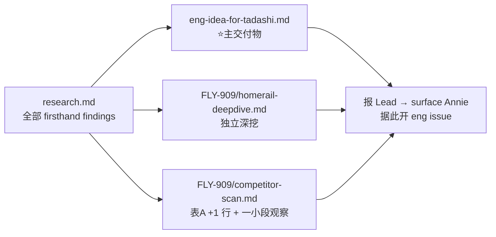

# FLY-1004 homerail — 交付计划

Issue: FLY-1004 (https://linear.app/geoforge3d/issue/FLY-1004/homerail-竞品分析-开源代码借鉴-语音多-agent-编排-ex-jarvis)
日期: 2026-07-08
基于: exploration.md · research.md · eng-idea-for-tadashi.md(同文件夹)

> 这是**研究/分析交付物**(纯 markdown,无代码、无 runtime)。风险低。gate 按 doc-flow full 仍走(brainstorm ✅ 已过 / approve 结尾走),但 design_review 对一份竞品分析属低价值,见 §4。

## 1. 交付物(3 件 + 2 处 fold)

1. **FLY-1004 文件夹**(doc-flow full):exploration.md ✅ / research.md ✅ / plan.md(本文)/ eng-idea-for-tadashi.md ✅ / progress.md。
2. **eng-idea-for-tadashi.md**(主交付物,✅ 已写):每条『它怎么做(带出处)→ 我们能怎么用 → 值不值』,voice 单独一节(A),末尾优先级建议。
3. **FLY-909 fold(轻改,Lead 已确认)**:
   - `homerail-deepdive.md`:独立深挖(仿 paperclip-deepdive.md 形态)。
   - `competitor-scan.md` 表 A:加 1 行 homerail;并加**一小段观察**(homerail 主动不做软件 → 坐实我们空地 + vendor-neutral 独立撞车),**不动** Annie 已收敛的定位叙事。

## 2. 两个战略发现(单独标给 Annie,已写透进 research §9 + deepdive)
1. homerail 明确不做软件工程 → 我们"建并养真软件产品"是没人占的空地(好消息)。
2. homerail vendor-neutral AgentClient 注册表 → 跟我们 executor-backend(493/494/350)独立撞车(方向验证)。

## 3. 报 Lead 内容(交付时)
- 结论(2 个战略发现 + voice 层可借鉴)+ eng-idea 清单链接/摘要。
- Lead surface Annie → Annie 据此开 eng issue(PM 验收 = 未来 FLY-830,现在不做)。

## 4. Process 轻重(诚实)
- **brainstorm gate**:✅ 已过(Lead 确认方向 + 轻改指令)。
- **design_review**:这是竞品分析 markdown,无代码/无 runtime,风险低。按"过程轻重按风险分档",Codex design review 对它价值低。**处理**:stage 报 design_review 过场,内容自查(引用出处准确、UNKNOWN 标清、无瞎编);若 Lead 要正式 Codex review 再补。
- **approve gate**:结尾走(founder-gated,不自 ship)。

## 5. 完成判定(证据)
- 3 个交付文件 + 2 处 fold 落盘、commit、开 PR(CI 绿)。
- eng-idea 每条有 repo 文件出处;UNKNOWN 标清;无视频瞎编。
