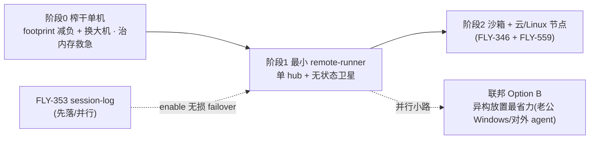

# FLY-1005 多机部署 (multi-machine) — 实施计划 / PRD 草案

Issue: FLY-1005 (https://linear.app/geoforge3d/issue/FLY-1005/多机部署-multi-machine-runner-分散到多台机器跑-research-prd)
日期: 2026-07-08
基于: exploration.md, research.md (同文件夹)
Status: **draft PRD — 主线待 Annie 拍板后由 Lead 收口**(这是她点名最重要的方向,最终方向 lock 在她拍板后)

> 本文是**分阶段 PRD 草案**。§1 结论、§3 路线、§6 开放决策是要 Annie 拍的;§4 阶段1 详细设计是给 Tadashi 照着能建的深度。凡未验证处标 UNKNOWN,不硬编答案。

---

## 1. 结论 (TL;DR)

- **多机值得做,但先分阶段、为对的理由做。** 当下最痛是**内存**,内存最便宜的解是**阶段0 先榨干单机:runner footprint 减负(FLY-751,已部分做)+ 换/用更大 host**。多机不解决额度(额度 per-账号)。
- 多机真正不可替代的价值 = **爆炸半径隔离 + 无上限横向 scale + 异构放置**。
- 架构走 **Option A:单 Bridge hub(state 留主机)+ 无状态卫星 runner**,复用已有**出站 HTTP**(stage/complete/heartbeat/events)+ Tailscale 内网,**刻意回避跨机 StateStore 一致性**。被 homerail 产品级验证。**注意**:ask/gate 问答态 + wake 现仍依赖本地 CommDB,阶段1 要补路由到 hub(不是「改个 URL」)。
- near-term 物理多机**不强制上沙箱(FLY-346)**;沙箱留云阶段。**session-log(FLY-353)**是稳健 failover 的前提,建议先落或并行。

---

## 2. 目标 / 非目标

**目标**
- G1 突破单机内存/容量上限,让 fleet 能跑更多 runner。
- G2 降低爆炸半径:一台机崩不再让整个 fleet 同时崩。
- G3 支持异构/隔离放置(老公 Windows 项目、对外 agent 单独一台)。
- G4 Discord 仍是唯一集中控制 UI,手机一个 Discord 控全部。

**非目标(本轮明确不做)**
- N1 **不做**跨机 StateStore 强一致(Option C);单 brain 绕过。
- N2 **不做**云端弹性 scale(FLY-559,远期,epic FLY-648 下)。
- N3 **不强制**容器化 runner(FLY-346);物理机即隔离。
- N4 **不解决**额度瓶颈(那是加账号,不是加机器)。
- N5 **不做**树状 Lead 层级(FLY-916,正交纵轴,另走)。

---

## 3. 分阶段路线



| 阶段 | 内容 | 前置 | 判定 |
|---|---|---|---|
| **0 榨干单机** | footprint 减负(FLY-751)+ 换大机(48GB→更大,FLY-558 搬大机 + FLY-519) | 无 | 立即,治内存 |
| **1 最小 remote-runner** | 单 Bridge hub + 无状态卫星 runner-agent(§4) | Tailscale + 阶段0 或现机 | 本 PRD 主体 |
| **1' 联邦(可选并行)** | 每机独立完整 Flywheel,各连 Discord(Option B) | 无(=复制单机) | 只为异构放置 |
| **2 沙箱 + 云** | 容器化 runner + Linux/云节点(FLY-346 + FLY-559) | 阶段1 | 远期 |
| **(横切) session-log** | FLY-353 事件日志 → 无状态 runner 可重建 | 独立 | 先落/并行,给阶段1 无损 failover |

---

## 4. 阶段1 详细设计(给 Tadashi 照着能建)

> 原则:**主机是唯一 brain,卫星是纯执行器。** 复用现有件,最小新增。所有跨机只走 HTTP over Tailscale。

### 4.1 拓扑

```mermaid
graph TB
    subgraph HUB["主机 (hub) — 唯一 brain"]
        BR["Bridge/TeamLead (tailnet 暴露 + auth)"]
        SS[("StateStore teamlead.db (留主机)")]
        LEADS["Leads (Claude CLI panes)"]
        AC["per-node AdmissionController"]
    end
    subgraph SAT1["卫星机 1"]
        RA1["runner-agent daemon"]
        RUN1["runner (本地 tmux + worktree)"]
        RA1 -->|本地 spawn / wake→本地 inbox| RUN1
    end
    BR -->|HTTP dispatch (选机)| RA1
    RUN1 -->|FLYWHEEL_BRIDGE_URL→hub tailnet: stage/complete/heartbeat/events| BR
    RUN1 -->|阶段1 新增: ask/gate/wake 路由到 hub| BR
    RA1 -->|上报 load/free-RAM/runner 数| AC
    LEADS --> BR
```

### 4.2 五个要建的件

**(1) runner-agent daemon(新增,卫星机每台一个)**
- 一个轻量常驻进程(node/launchd),向 hub Bridge 注册自己(node-id + tailnet 地址 + 容量)。
- 接 hub 的 dispatch(HTTP)→ 在本地 `tmux new-session` 起 runner(复用 `TmuxAdapter` 逻辑,只是运行在卫星侧)。spawn 环境要点:在 spawn 侧(runner-agent/Blueprint)设 `TEAMLEAD_URL`(或直接传 `bridgeUrl`),让 runner 最终拿到 `FLYWHEEL_BRIDGE_URL=<hub tailnet>`(否则 Blueprint.resolveBridgeUrl 在非 loopback host 下拒绝推导);再注入 **`FLYWHEEL_INGEST_TOKEN`**(runner 的 stage/complete/heartbeat/events 走它)。**token 两侧名字不同:hub/Bridge 端配 `TEAMLEAD_INGEST_TOKEN`(`/events` 鉴权),spawned runner 拿同一密钥叫 `FLYWHEEL_INGEST_TOKEN`。** 若卫星要调 `/api/*` 才需 `TEAMLEAD_API_TOKEN`。
- **满足卫星职责清单(明确、别藏在「runner-agent」四个字里):** 工具链 provision、Claude/Codex 登录态、repo checkout + worktree 创建、tmux/session 生命周期、event/heartbeat 上报、日志可见性、失败清理、以及 hub UI 是否/如何 attach 远程 tmux(见 §4.5)。
- 周期上报 load / free-RAM / 当前 runner 数(喂 admission)。
- **破锚点 C 的 spawn 半边。** 复用 `packages/claude-runner/src/TmuxAdapter.ts` + heartbeat(FLY-172)。

**(1b) ask/gate 问答态 + wake 路由到 hub(新增,一等公民 —— 不是脚注)**
- 现状(research §1.3 已核):`ask` 写**本地** CommDB、`gate` 核心问答**轮询本地** CommDB、mailbox wake 身份来自**本地** CommDB。卫星 runner 默认没有 hub 的 CommDB。
- 阶段1 必须二选一(D-新 决策):(a) 让卫星的 ask/gate 走 HTTP 到 hub 的 CommDB(runner 侧 CLI 加 --bridge-url 路由 + hub 侧收口),或 (b) 给卫星一份可路由的 comm 视图。**倾向 (a)**:与出站事件同一套 HTTP 姿态,hub 仍是唯一 CommDB 权威。
- wake:hub 判目标 runner 在哪台 node → 经 HTTP 发给该 node 的 runner-agent → agent 写**卫星本地** inbox 文件(transport 抽象是 seam,但 forBackend 目前只 claude-code/codex,新增远程分支或走 runner-agent adapter,见 research §1.3)。
- **破锚点 C 的问答/唤醒半边。这块工作量不小,PRD 明确列出、不低估。**

**(2) Bridge 内网暴露(改造,hub)**
- 现状:`config.ts` 硬绑 loopback(锚点 A)。阶段1 要让卫星能连到 hub Bridge。
- **[开放决策 D1]** 两条路(§6,要 Annie/Codex 定):
  - (a) 允许绑 tailnet IP(放宽 `ALLOWED_HOSTS` 到 tailscale 网段)+ 强制 `TEAMLEAD_API_TOKEN`;
  - (b) 保留 loopback + 在 hub 上前置一个只监听 tailnet 的反代 → 转发到 127.0.0.1:9876。
- (b) 改动更小、Bridge 代码零改、安全边界更清楚(反代做认证 + path allowlist)。**倾向 (b)**,但要 spike。
- **阶段1 安全合同(硬要求,不能只靠 loopback 假设了):**
  - 多机模式必须 **fail-start** 除非 **hub 端 `TEAMLEAD_INGEST_TOKEN`**(+ 需要时 `TEAMLEAD_API_TOKEN`)已配置——现状 `tokenAuthMiddleware` 在无 token 时 **no-op 放行**(`plugin.ts:609-618`);注意 hub 只配 runner 侧的 `FLYWHEEL_INGEST_TOKEN` 是**无效的**(`/events` 读的是 `TEAMLEAD_INGEST_TOKEN`)。暴露到 tailnet 前必须堵上。
  - 只暴露**卫星真正需要的端点**(`/events`/heartbeat + dispatch/wake 收口),经反代 path allowlist;**`/actions` 无鉴权 dashboard 别名 + 宽 `/api/*` 保持 loopback-only**(它们当前正是靠「只在 loopback」才不加 Bearer)。
  - PRD 明确列出卫星需要哪些端点 + 各用哪个 token。
  - **强能力路由**(`/api/actions/*`、close-runner 等)风险边界要 Codex/安全过一遍(FLY-175 founder-consent 已是一层防护);考虑多机模式下进一步收紧到 hub-local 触发(见 §6 D5)。
- **破锚点 A(3 步):** 绑/暴露 Bridge + 在 spawn 侧设 `TEAMLEAD_URL`(或传 `bridgeUrl`)让 runner 拿到 `FLYWHEEL_BRIDGE_URL=<hub 地址>` + 保留本地默认的安全兜底(Blueprint.resolveBridgeUrl 现拒非 loopback 推导)。

**(3) dispatch 选机 + per-node admission(改造,hub)**
- `/api/runs/start` 现在只在本机起 runner;阶段1 加一步「选哪台卫星」。
- 扩 `RunnerAdmissionController`(`packages/teamlead/src/bridge/runner-admission.ts`,现有 load + 可选 memory-pressure 闸门)成 per-node:按各 node 上报的 free-RAM + runner 数选最空的;都满则排队(治今天的 swap thrash)。
- 起步策略可以土:free-RAM 优先 + 硬上限 per-node。
- **对齐 FLY-557。**

**(4) 跨机 wake(改造,hub + 卫星)**
- 现状 `wake.ts` 写本地 `~/.claude/teams/<lead>/inboxes/<agent>.json`(锚点 C)。
- 阶段1:hub 判断目标 runner 在哪台 node → 若在卫星,把 wake 经 HTTP 发给该 node 的 runner-agent → 由 agent 写**卫星本地**的 inbox 文件。
- transport 有抽象(`AgentTeamTransportFactory`,FLY-142,目前只 claude-code/codex)→ **可新增 remote-http transport,或走 runner-agent adapter**;两者都利用 transport/role seam,但需 spike 决定选哪个(D6)。
- **[UNKNOWN]** 也可让 runner 直接联网收 wake(不落本地文件);哪个更稳看 Agent Team inbox 轮询实现(未深挖)。
- **破锚点 C 的唤醒半边。**

**(5) failover(改造,hub)**
- 卫星死 → heartbeat(FLY-172)超时 → hub 把该 node 的在飞 issue 重新 dispatch 到别的 node。
- **无 session-log 时** = 重跑该 phase(可接受但浪费);**有 FLY-353 session-log 时** = 从日志续跑(无损)。→ 这条随 353 升级。

### 4.3 state:刻意不跨机(破锚点 B 的替代=绕过)
- StateStore / CommDB / 各 audit db **全部留 hub**,卫星零权威状态。
- 出站事件(stage/complete/heartbeat/events)已走 HTTP 到 hub;阶段1 把剩下的 ask/gate/wake 也收口到 hub 的 HTTP/CommDB(§4.2 1b)→ 卫星零权威状态,**天然无需跨机 DB**(避开 Option C 分布式一致性)。
- 这是本设计避开分布式一致性泥潭的关键决定。

### 4.4 provision(对齐 FLY-558 / FLY-519)
- 卫星 provision 比主机轻:node/pnpm/tmux/claude CLI + runner-agent + Tailscale 入网 + `claude login`(per 机登录态)。**不需要** Discord bot / Lead / 全套 launchd。
- 复用 FLY-519 脚本,加一个「卫星子集」模式。

### 4.5 可观测(对齐 FLY-561)
- 多机后 Discord thread 要标 runner 在**哪台机** + tmux attach 命令(FLY-561)。
- **[UNKNOWN]** cmux GUI 跨机看不到卫星 pane(cmux 桌面 app,不跨机);手机场景靠 `ssh <卫星> + tmux attach`(FLY-561 已指此方向)。统一多机可观测需单独设计。

---

## 5. 落地 sub-issue 映射(交 Tadashi)

阶段1 直接落到已有 FLY-555 子票,**不新开并行**:

| 已有 issue | 本 PRD 对应 | 备注 |
|---|---|---|
| FLY-556 跨机 comm/StateStore | §4.2(1)(2)(4) + §4.3 | **改口径**:不做跨机 StateStore(N1),改成「单 hub + 无状态卫星 + HTTP/wake 跨机」 |
| FLY-557 per-machine load + dispatch | §4.2(3) | admission per-node |
| FLY-558 migration vs provision | §4.4 + 阶段0 | 搬大机 vs 卫星子集 |
| FLY-561 tmux/机器可观测 | §4.5 | 多机后标机器 |
| FLY-519 provisioning(done) | §4.4 | 加卫星子集模式 |
| **新增建议** | runner-agent daemon | FLY-556 里没有独立列;建议单开一个 sub |
| **新增建议** | Bridge tailnet 暴露 + 安全过审 | D1 决策后开 |

**横切依赖:** FLY-353 session-log(§4.2(5) 无损 failover)· FLY-346 沙箱(阶段2)· FLY-916 树(正交,不阻塞)。

---

## 6. 开放决策(要 Annie / Codex 拍)

- **D1 Bridge 暴露方式:** (a) 放宽 loopback + token,还是 (b) tailnet 反代?(倾向 b,要 spike)—— 安全 sensitive,建议 Codex/安全过。
- **D2 阶段0 先做哪个?** 先榨干单机 = footprint 减负(FLY-751,零成本)+ 换大机(48GB→更大)。内存最便宜的解;若 Annie 想直接跳阶段1 也行,但阶段1 有工程周期,救急还是要阶段0。
- **D6 ask/gate/wake 路由方式:** 卫星 runner 的 ask/gate 问答态 + wake 现依赖本地 CommDB(§4.2 1b)。走 (a) HTTP 到 hub CommDB(倾向,同出站姿态),还是 (b) 给卫星一份可路由 comm 视图?这是阶段1 真正的工程量所在,要 Tadashi/Codex 定。
- **D3 联邦 Option B 要不要作为并行小路先上?** 若近期就要「老公 Windows 独立跑 / 对外 agent 单独一台」,B 比阶段1 省力得多,可先做。
- **D4 session-log(FLY-353)排序:** 先落 353 再多机(无损 failover 从第一天有),还是多机先上、353 到位再升级?
- **D5 强能力 API 暴露到 tailnet 的风险边界** —— `/api/actions/*` 要不要在多机模式下进一步收紧(只允许 hub-local 触发)?

---

## 7. 验收 / QA 思路

- **阶段0:** 换机后 fleet 满载 free-RAM 稳定 > 阈值、无 swap thrash、nightly crash 消失。
- **阶段1 真机 E2E(两台机 + Tailscale):**
  1. hub dispatch → 卫星起 runner → runner 走 HTTP 回报 stage/gate/complete 全链通。
  2. 跨机 wake:hub 唤醒卫星 idle runner,runner 醒。
  3. admission:卫星满 → 新 dispatch 排队/转另一台,不 swap thrash。
  4. failover:kill 卫星 → hub 察觉 → 重派;(有 353 则验无损续跑)。
  5. Discord 集中控制:手机 Discord 能看到并驱动跨机 runner(标了机器)。
- 独立 QA(非实现者自验),对齐项目 auto-QA 政策。

---

## 关联

FLY-555(父 epic)· FLY-556/557/558/561· FLY-517(driver)· FLY-519(provision)· FLY-17(relay 草案)· FLY-346(沙箱/阶段2)· FLY-353(session-log/横切)· FLY-916(树/纵轴)· FLY-648/559(可移植/云)· homerail(架构参照)
