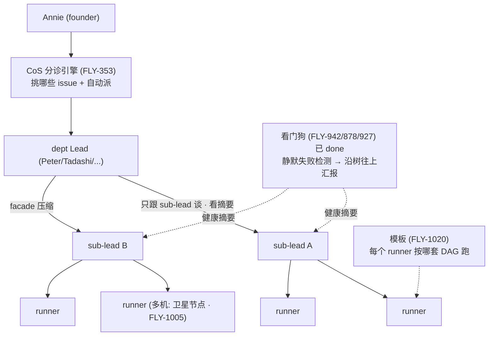

# FLY-1022 树状 Lead 带很多 runner — 调研（research）

Issue: FLY-1022 (https://linear.app/geoforge3d/issue/FLY-1022/lead-scaling-one-lead-managing-many-runners-via-a-tree-hierarchical)
日期: 2026-07-08
基于: exploration.md（同文件夹）

> 本文回答三件事：① 今天 Lead↔Runner 协调**代码上到底 O(几)**（现状审计，钉死行号）；
> ② 别人（homerail / 人类组织 / agent 编排）怎么做「一个脑子指挥很多手」；
> ③ 综合出「要不要做树、做多小」的**判断**（不是 PRD，是喂给 co-eval HTML 的收敛材料）。
> 凡未验证处标 UNKNOWN，不硬编答案。

---

## 1. 现状审计：Lead↔Runner 协调今天是 O(几)（核过码 · 钉行号）

> 目的：把「>5 runner 就吃力」从「体感」变成「代码事实」——哪一段代码让成本随 runner 数线性涨。
> 结论先行：**runner 数今天在准入层根本不设上限；瓶颈整个下沉到「事件全部汇进一个 Lead session、
> 由一条单线程一轮一轮消化」这个扇入点。** 加机器/加账号都不解，只有分层让 Lead 只看摘要才解。

### 1.1 起 runner 的链路（dispatch）

- 入口 = Bridge `POST /api/runs/start`（`runs-route.ts:139`）→ `RunDispatcher.start()`（`run-dispatcher.ts:656`）
  → 准入 `RunnerAdmissionController.tryAdmit()`（`runner-admission.ts:208`）→ `Blueprint.run()` → adapter。
- 实际 spawn = `TmuxAdapter` 的 `tmux new-window`（`TmuxAdapter.ts:522-524`）；一个项目的所有 runner = **同一个本机
  tmux base session 里的多个 window**（`run-infra.ts:589`）。`execFileFn` 默认 **同步 `execFileSync`**
  （`TmuxAdapter.ts:1281-1299`）——spawn 这一下是**阻塞** Bridge 单 Node 事件循环的。
- 部门归属由**服务端** `DepartmentRegistry` 硬 enforce（FLY-127：1 issue → 1 部门 → 1 个 canonical 起活的 Lead，
  `department-registry.ts:237` `isLeadInScope()`）。`AgentDispatcher` 只挑**persona 提示词文件**（engineer/qa executor），
  不决定「谁管这个 runner」。

### 1.2 ⭐ Lead 怎么「知道」runner 进展 —— 三个 poller 全部扇入同一个 Lead 收件箱

infra 侧有**三个互相独立、定时驱动**的 poller 在并行检测 runner 事件，但它们**全部塌缩进同一个 per-Lead mailbox**、
被**一个 Lead 进程一轮一轮**消费：

| poller | 干什么 | 每 tick 的成本 | 证据 |
|---|---|---|---|
| `GatePoller` | 把 runner 的 ask/gate 问题 relay 给 Lead | 每 **3s**；O(项目×lead) 次开 CommDB + O(该 lead 的 pending 问题) **顺序** `relayToLead` | `gate-poller.ts:363,432`；`plugin.ts:4000` |
| `HeartbeatService` | stuck/孤儿/stale/review 超时对账 | 每周期**顺序**跑 6 步；`reconcileMonitorLoss` 每候选一个 tmux 子进程、串行 | `HeartbeatService.ts:230,404-503` |
| `RunnerIdleWatchdog` | 每 runner 静默/idle 启发式 | **最清楚的 O(N)/runner**：对**全 fleet 每个活 runner** 串行 `await checkSession`、一个 tmux capture-pane/个/tick | `RunnerIdleWatchdog.ts:130-154` |

三者的通知**最终都落到一个 `LeadRuntime` 实例**（per `leadId`，不是 per runner；`lead-runtime.ts:166`）→ 写进
**这一个 Lead 的单个 mailbox 文件**（`MailboxLeadRuntime`，默认）或单张 `instructions` 表（`CommDBLeadRuntime`，回滚路径）。
**这就是扇入点：所有 runner 的所有事件 → 一个 Lead 收件箱。**

### 1.3 ⭐⭐ 单线程 Lead + 一条 dated 铁证

- **单线程结构性确认**（不只 MEMORY 的 FLY-85）：Codex Lead 后端 `LeadInputRouter.ts:1-23` 自己的 docblock ——
  「durable, **SERIAL** turn-loop orchestrator … 每 (project, lead) **ONE AT A TIME** … mid-turn 到的新输入**排队、下一轮才处理**」。
  默认 claude-code 后端同理：一个原生 interactive `claude` CLI 进程、一个 tmux pane、一次一 turn；Lead 正在处理 runner A 的
  gate 时，runner B 的消息只能等它这一 turn 完再 re-poll。
- **⭐ dated 铁证（这条最关键）**：`stuck-escalation.ts:87-104`——idle-watchdog 的轮询节奏被**从 30s 全局拉长到 ~1h**
  （`DEFAULT_IDLE_POLL_MS = 3_600_000`，FLY-628，2026-06-27），原因原文：**「每一个（误报）都要 Lead reload 整个 context
  去回答、烧 token」**。这是「多一个 runner 事件 → 唤醒 Lead」贵到必须**全局节流**的**代码级、带日期**的证据 —— 平铺模型
  的成本上限就卡在这里。

### 1.4 准入根本不设上限 → 瓶颈已下沉到扇入

- `runner-admission.ts:1-33` docblock：**「runner 数不设上限 —— 唯一约束是运行时资源（机器 load + 内存）」**；
  只闸 `loadPerCore`（默认 8.0）+ 可选内存地板（默认关）。**曾经**有硬上限 `maxConcurrentRunners`（默认 3、范围 1-20），
  **已被 FLY-123 WS-D 退役**。→ **今天没有任何东西挡着一个 Lead 被塞 20+ 个并发 runner**；瓶颈全在下游扇入处理。
- 每 runner 一条 Discord thread（`ChatThreadCreator`，一个 Lead 一个 bot 身份、受改名限速）；prompt 契约还写死
  「N 个 token → N 次独立 /send、不许批」（`cos-lead-rules.md:15-56`）= 每 issue 线性成本**烤进提示词**。

### 1.5 今天完全没有「树」；CoS→dept Lead 是社交/路由，不是运行时协调层

- `LeadConfig`（`ProjectConfig.ts:7-184`）**没有** parentLeadId/children/groupId/tier 任何字段；`ProjectEntry.leads` 是**扁平数组**。
- CoS（`canSpawnRunners:false`，如 Aunt Cass）triage 后 **@ 恰好一个** dept Lead（`cos-lead-rules.md:134-181` + `DepartmentRegistry` authz），
  **但路由完就退出、不再回环**：此后该 issue 的**每一个** runner-state 事件（§1.2 三 poller）**只**发给那个 dept Lead。
  → 今天的「树」只在**派发那一瞬间**是两层；之后**带 N runner 的活 100% 压在单个 dept Lead 上、往下零扇出**。
- 注意别混：`fleet-*.ts` 是 founder 管 **Lead 守护进程**的运维台（launchd/多机），**不是** runner 管理层级。
  「fleet」(Lead 进程运维) ≠ 「tree」(runner 管理委派)。

### 1.6 多机接缝（FLY-1005，正交）

runner spawn 100% 本机进程（`TmuxAdapter` 同步本机 tmux、无 SSH/host 参数）；mailbox（`path-helpers.ts:76-102`）
与 CommDB（`session-capture.ts:53-55`）都是**本机文件**、要求 Bridge+Lead 同一文件系统；liveness 探针全 shell 本机 tmux、无 host 参数。
代码自知此缺口（`tmux-lookup.ts:106-114` `sshHost` stub，未用；多机 = FLY-517）。**这些是 1005 横轴要改的，不是 1022 纵轴** ——
但 1005 铺开 runner 后，1022 的扇入瓶颈会更快撞墙（更多 runner、跨机 relay）。

---

## 2. 别人怎么做「一个脑子指挥很多手」

### 2.1 homerail（Manager / Node / Worker）—— 已被 1005 引为产品级验证

- homerail 形态：**Manager**（总控）→ **Node**（每台机一个常驻 agent）→ **Worker**（容器里的执行体，经 callback URL 回连）。
- 关键借鉴：**Node 是 Manager 和 Worker 之间的中间层** —— Manager 不直接管每个 Worker，只跟 Node 谈；
  Node 帮 Manager 管它那台机上的一摊 Worker。**这就是一棵「指挥树」的中间层**，只是 homerail 的中间层是**按机器**分的。
- 对 1022 的启发：sub-lead ≈ homerail 的 Node（中间协调层）。**区别**：homerail 的 Node 是**部署单位**（每台机一个），
  1022 的 sub-lead 是**注意力单位**（每一摊 runner 一个）——**这正是纵/横两轴的区别**。多机时两者可能重合（一个 sub-lead 管一台卫星机上的 runner），但不必强绑（§4）。

### 2.2 人类组织（最贴切的类比，Annie 一直用的语言）

- 经理（Lead）→ 组长（sub-lead）→ 工程师（runner）。经理不看每个工程师每天写的每行代码，只听组长的**周报/异常上报**。
- **facade 的本质 = 汇报的压缩比**：组长把 10 个人的状态压成「3 个正常、1 个卡在 X 要你拍板」。经理的注意力
  从「10 个人 × 细节」降到「1 个组长 × 摘要 + 1 条真需要我的事」。
- 这也解释了**为什么树能 scale 而平铺不能**：树把 Lead 的注意力成本从 O(runner 数) 降到 O(sub-lead 数)，
  只要每个 sub-lead 带的 runner 数保持在「一个脑子扛得住」的范围（≈今天的 5-6）。

### 2.3 现有 agent 编排框架的层级模式（Layer 2/3 知识，验证不盲从）

- 多数「多 agent」框架（supervisor/worker、orchestrator/sub-agent）都有一个**supervisor 只跟子 supervisor 谈、
  不直接跟叶子 agent 谈**的模式。共识：**层级的价值 = 上层不被下层细节淹没**（= facade），代价 = **多一层 = 多一处失败/延迟/信息丢失**。
- 对 1022 的取舍：**层级越深，facade 压缩越狠，但「藏卡住的 agent」的风险也越大**（呼应 FLY-916 的「放大器」）。
  → 起步**只一层 sub-lead**（两层树），把风险和收益都控在最小可验证。

---

## 3. 树怎么跟另外四根轴合成（不打架的接线图）

- **353（派什么）**：引擎照旧挑 issue、自动派；只是**派的落点从「Lead 直连 runner」变成「Lead → sub-lead → runner」**。
  353 引擎不用懂树的内部，树对它是一个「更能吃活的 Lead」。
- **1020（每个怎么跑）**：完全正交。runner 用哪套模板，跟它挂在树的哪个位置无关。
- **1005（在哪跑）**：正交但有接缝（§4 / co-eval 问题 5）。树是「谁指挥」，1005 是「在哪台机」；多机时**倾向**让一个
  sub-lead 带一台/一组卫星机的 runner（指挥边界 ≈ 机器边界，省跨机 relay），但不强绑。
- **942（谁卡了）**：**已 done，直接 lean**。树只需让「每个 sub-lead 自报健康 + 把它那摊的健康摘要往上汇总」这条路
  接上现有看门狗的检测输出。**观测的检测逻辑一行都不用重写。**

---

## 4. 收敛判断（喂 co-eval，不是拍板）

### 4.1 要不要做树？—— 诚实的两面

**支持现在做**：痛在眼前（5-6 就吃力，leads 挨个重启）；高杠杆（一个人管更多）；1005 一旦铺开 runner 会更多，早晚要。

**支持先不做 / 缓做**（Annie 红线视角）：
- 353 的**自动派发**本身就减了 Annie 一大块「逐个 assign」的累；942 的**自动检测 + Lead=响应**减了「人肉巡查」的累。
  这两条 done/在做之后，「>5 就累」的**近期**痛可能已缓解一大半 —— **树的边际收益要重新估**。
- 树是**放大器**，加一层就多一处藏卡死的地方；在底子（稳定性 FLY-774 家族）没完全稳之前加层级，有放大风险。
- → **建议 framing（诚实推荐，但最终留 Annie 拍，不替她定）**：树的**必要性是 scale-gated 的** ——
  **具体触发点 = FLY-1005 Phase 2 多机真把 runner 铺开、单 Lead 的 runner 数持续上去时**。在那之前，
  353（自动派发）+ 942（自动检测卡住）大概率先扛住近期痛。所以诚实推荐 = **「先 353+942，树 scale-gate 到多机铺开后」**；
  1022 这轮先把**设计 + 最小接口**想清楚（通信层支持「Lead 当孩子」这层角色），**但不急着全量上**。
  —— **注意：这是给 Annie co-eval 的一个诚实推荐，不是结论。「现在到底要不要做树」由 Annie 拍。**

### 4.2 如果做，最小第一刀（起步范围建议）

- **只一层 sub-lead**（两层树：Lead → sub-lead → runner）。不做递归任意深、不做 sub-lead 再开 sub-lead。
- **sub-lead = 同一套 Lead 代码 + 一个「sub」角色 prompt**（精简职责：带一摊 runner + 往上汇报摘要 + 向下 relay），
  **不新造一个进程类型**（复用现有 Lead 基建 = 最省）。
- **facade = 结构化健康摘要往上汇总**，接 FLY-942 看门狗的检测输出，不重造检测。
- **dispatch 路由多一跳**（Bridge 把活派给 sub-lead 而非直连 runner）——Tadashi 初判「中等改动」。
- **坚决砍**：递归深树、复杂负载均衡/调度、sub-lead 之间的横向协商、跨机自动 rebalance。够用就好。

### 4.3 关键未决（UNKNOWN，留给 co-eval / 实现）

- sub-lead 的 context 成本 vs 收益的真实拐点（几个 runner 时树才划算）——**[UNKNOWN，需实测]**。
- sub-lead 汇报摘要的确切 schema（压掉什么、Annie 要看到什么）——co-eval 问题 4。
- 树层级 vs 机器分布的对齐策略（1005 接缝）——co-eval 问题 5。
- 「Lead 当另一个 Lead 的孩子」在现有通信层（mailbox/CommDB/transport）上的最小改动点——**[待实现 spike，Tadashi]**。

---

## 5. 参考

- FLY-916（本 issue 的origin · Tadashi 树+可观测洞察）· FLY-1005 plan.md（横轴 N3 punts 树）·
  FLY-353 prd.md（Layer 2 引擎）· FLY-1020 HTML（Layer 1 模板）· FLY-942 PRD（看门狗，已 done）·
  产品体验 spec §1.4/§5（CoS→dept Lead 现有两层）· homerail（Manager/Node/Worker，1005 已引）。
