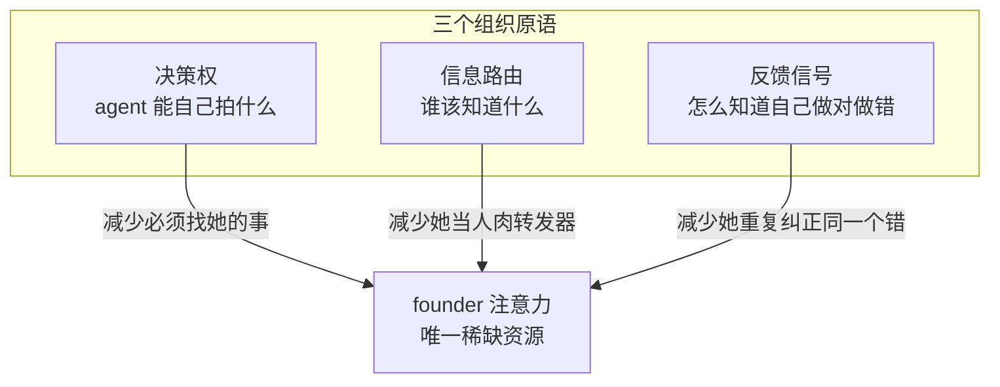

# FLY-1045 人类公司如何运作 → 蒸馏为 AI 公司机制 — 探索

Issue: FLY-1045 (https://linear.app/geoforge3d/issue/FLY-1045/how-human-companies-operate-distill-into-mechanisms-for-our-ai-company)
日期: 2026-07-08
基于: 无

---

## 1. Annie 真正在问什么

原话里有两句是钥匙:

> 「agents 的能力已经很强;**founder 要做的 = 把机制给我们搭好**。」
> 「老板不可能 micromanage 每个人 —— 要做的是把公司的机制搭建好。」

这不是「请介绍一下组织理论」。这是一个**资源分配命题**:在这家公司里,唯一真正稀缺的东西是 **founder 的注意力**。agent 的算力、耐心、工作时长都近似无限,唯独 Annie 的一天只有一份。所以任何组织机制的价值,都应该用同一把尺子量:

> **单位 founder 注意力,能换来多少正确完成的工作。**

她举的例子也印证了这把尺子:Honey Lemon 撞到 gate binding bug,直接去找 Tadashi,俩人解决了 —— 这次事件消耗的 founder 注意力 = 0,而工作照样完成。**这就是机制生效的样子**,不是「agent 更聪明了」,而是「有一条不经过 Annie 的路存在」(#leads-roundtable + 跨部门频道规则,FLY-267)。

所以本文的任务不是罗列人类组织学,而是回答:**还有哪几条不经过 Annie 的路,是我们该修但还没修的?**

---

## 2. 资产盘点 —— Flywheel 已经是一家有制度的公司

做这个 issue 之前我先审计了 codebase。结论很重要:**我们不是在白地上设计组织,我们已经无意中建了一套相当完整的制度**,只是从来没有人把它们当作「组织机制」来统一看待和评估。

| 人类公司里的东西 | Flywheel 里已经存在的对应物 | 位置 |
|---|---|---|
| 授权边界 / 决策权矩阵 | `founder-only-authority.md`:R1 merge/ship、R2 runner 生死,保留给 founder;R3 一条极窄的自愈豁免 | `packages/teamlead/lead-rules-base/` |
| 升级路径(什么时候必须找老板) | 三个 checkpoint gate:`brainstorm` / `question` / `approve_to_ship`,各自带 fail-open 或 fail-close 语义 | `.flywheel/config.yaml` |
| 岗位说明书 / SOP | 分层 rule bundle:base 层(通用)→ 项目层 → `identity.md`(具体人格) | `lead-rules-base/` + `<project>/.lead/` |
| 信息路由 / 谁该知道什么 | reply-discipline 机械算法(按 issue token 数路由)+ 每 issue 一个 chat thread | `cos-lead-rules.md` / `department-lead-rules.md` |
| 横向沟通(不经过老板的同僚通道) | `#leads-roundtable` 跨部门频道 + `#flywheel-core` | FLY-267 |
| 晨会 / 周报 | `daily-standup.sh` + `daily-digest.sh`(launchd 定时) | `scripts/` |
| 质检 / 独立验证(不许自己验自己) | FLY-579 auto-QA:code review 过后自动 spawn 独立 QA runner | `qa.auto: true` |
| 分诊台 / Chief of Staff | CoS(Aunt Cass)triage → 派给部门 Lead | `cos-lead-rules.md` |
| 主动上报(老板不用来问) | `founder_milestone_report`:zero-signal 终态自动 @founder | `.flywheel/config.yaml` |
| 自治档位 | `decision_layer.autonomy_level: advisor`(Lead 提议、founder 决定) | `.flywheel/config.yaml` |
| 绩效档案 | `founder_consent_audit` 审计表 —— **只写不读,没有任何消费者** | FLY-175 Track 2 |

最后一行是本文的核心发现,下面会展开。

---

## 3. 三原语框架

把上表压缩,人类组织减少「老板注意力消耗」的手段,只有三类原语。它们不是我发明的分类,而是从上表反推出来的 —— 每一行都恰好落进其中一格:

三者的分工可以用一句话讲清:

- **决策权**决定 agent **允许**自己做什么 —— 没有它,agent 每一步都要问。
- **信息路由**决定 agent **知道**什么 —— 没有它,founder 沦为消息中转站(Annie 转发 Tadashi 的话给 Honey Lemon)。
- **反馈信号**决定 agent **学会**什么 —— 没有它,同一个错误 founder 要纠正无限次,而且**决策权永远不敢下放**(因为你不知道它什么时候会做对)。

关键的耦合关系:**C 是 A 的前提**。你不可能在没有反馈信号的情况下安全地下放决策权 —— 那不叫授权,那叫赌博。`founder-only-authority.md` 自己就承认了这一点,它把当前的严格状态称为「calibration window」(校准窗口),并写明毕业条件是 Track 2 审计表积累出足够证据。

**而审计表没有任何消费者。**

---

## 4. 现状打分:哪一格是空的

| 原语 | 现状 | 判断 |
|---|---|---|
| 信息路由 | reply-discipline 算法 + per-issue thread + roundtable + standup/digest + milestone push | **接近饱和**。Honey Lemon 直接找 Tadashi 能发生,就是因为这一格已经修好了。边际收益低。 |
| 决策权 | founder-only-authority(R1/R2 全保留)+ 三个 gate + `autonomy_level: advisor` | **刻意收紧**。不是缺失,是有意识的保守选择,并且文件里已经写好了放松的路线图(v1.3x / v1.4x)。 |
| 反馈信号 | `founder_consent_audit` 表在写;auto-QA 提供对错信号但只在单次 PR 内消费;memory 里的 `feedback_*.md` 是 **Annie 手写的**,不是系统自己长出来的 | **几乎为空**。这一格没有闭环。 |

结论一句话:**Flywheel 的组织瓶颈不在沟通,也不在授权,而在「agent 没有办法在不打扰 Annie 的前提下知道自己做对了没有」。**

而这正是 FLY-1034 的题目。也就是说,本研究如果做得诚实,它的落点会自动指向 1034 —— 我不打算重新设计 1034,但我会把「为什么 1034 是整个自治叙事的断点」这件事论证清楚,让它从「不知道现在要不要做」变成一个有依据的排序判断。

---

## 5. 一个必须先想清楚的分叉:人类的奖惩,对 agent 全部失效

人类组织的反馈机制,大部分靠三样东西驱动:**钱、晋升、声誉**。

我们的 agent:
- 没有工资 → 奖金无效
- 没有职业阶梯 → 晋升无效
- **跨 session 没有声誉** → 「这个人上次搞砸了」这个信息根本不存在于它的世界里

所以「搭一个奖惩机制让大家知道做什么对、什么错」这句话,**不能照搬人类的做法**。照搬会得到一个荒诞的东西(给 agent 发绩效奖金)。

但 agent 有两样人类没有的东西:

1. **上下文可以被直接写入。** 你没法把一条规则直接写进一个人的信念里,但你可以把它写进 agent 的 system prompt。人类要靠激励去*改变行为*,agent 可以靠注入去*改变前提*。
2. **权限可以被程序化地精确升降。** 人类的授权是模糊的、社交的;agent 的授权是一行 config、一个 gate 的 threshold。

于是本研究的一个待论证命题浮出来:

> **在 AI 公司里,「奖惩机制」的正确形态不是奖励,而是「上下文注入 + 决策权升降级」。**
> 而人类组织里那些**靠传递信息而非传递奖励**起作用的反馈机制(after-action review、blameless postmortem、advice process),恰好是唯一能移植过来的一类 —— 移植性出奇地好。

这条要在 research 里用真实证据检验,不能预设。DR 的第 4 组问题就是为它准备的:**逐个机制区分「它是靠传递信息起作用,还是靠传递奖惩起作用」。**

---

## 6. 显式假设

写在前面,便于 Annie 直接否决:

1. **假设 founder 注意力是唯一稀缺资源**。如果她其实更在意别的(比如产出质量的绝对上限、或者她享受参与),整个评价尺子就换了。
2. **假设 agent 能力已经够用**,瓶颈在组织而非模型。这是 Annie 原话里的判断,我接受它作为前提。
3. **假设我们要的是「更少打扰」而不是「更多自动」**。这两者不同:全自动 DAG(FLY-353)是「更多自动」;让 Lead 敢自己拍板是「更少打扰」。本文做后者。
4. **假设人类组织学的证据可以迁移**,但每条都要过一遍「它假设了工人有什么(工资/记忆/任期/声誉/怕被解雇)」这道筛子。凡是假设了 agent 没有的东西的机制,要么丢弃,要么先补基座。
5. **假设 doc-only**。本 issue 不改代码,产出是研究 + 机制提案,交 Annie co-eval 后转 PRD。

---

## 7. research 提纲(六个开放问题)

DR 已经按这六条派出去了:

1. **不同运作模式的真实代价**:层级 / 职能 / 事业部 / 矩阵 / 扁平 founder-led / holacracy。各自解决什么问题、强加什么协调成本、在多少人时崩溃。**特别要挖 Spotify squad 模型被 Spotify 自己承认从没真正落地** —— 因为我们很容易照抄一个从未存在过的东西。
2. **决策权如何被正式分配**:RAPID / RACI / DACI、Amazon 的 Type 1 vs Type 2(单向门 vs 双向门)、7 levels of delegation、advice process、subsidiarity。以及**信任如何随时间渐进转化为授权** —— 这直接对应 `founder-only-authority` 的毕业路径。
3. **升级与「停线」**:Toyota andon cord、航空 CRM 的 two-challenge rule、医院 rapid response。核心问题不是「能不能升级」,而是**怎样让升级足够便宜,以至于该拉的时候真的有人拉**。对应我们的 gate 成本。
4. **反馈机制里,哪些传递的是信息、哪些传递的是奖惩**(见 §5)。这是整份 DR 里对我们最值钱的一问。
5. **协调仪式与信息流**:standup、Amazon 六页备忘录 + 静默阅读、写作文化 vs 口头文化、Team of Teams 的 shared consciousness、**span of control 的经验证据**(人类管理跨度到底是多少、由什么驱动)。span of control 直接对应 FLY-1022:我们观测到一个 Lead 超过约 5 个 runner 就退化,这个数字和人类经验值是否同源?
6. **失败模式**:无反馈的授权会坏成什么样、principal-agent 问题与监督成本、accountability sink、Brooks's law、以及**删掉中层会失去什么**(中层是信息压缩器 —— 这一条直指「Annie 直连 runner」的诱惑)。

补充手段:DR 之外用 WebSearch 补锚点来源,但 DR 是主线(Annie 明确要求)。

---

## 8. 初步 thesis(待 research 论证,非预设)

- **T1** 组织机制的唯一评价尺子 = 单位 founder 注意力的产出。
- **T2** 三原语中,信息路由已接近饱和,决策权是刻意收紧,反馈信号近乎为零 → **边际收益最大的投资在反馈信号**。
- **T3** 人类反馈机制中真正起作用的是「信息型」的而非「奖励型」的;而信息型恰好是 agent 唯一能吸收的一类 → 移植性出奇地好。
- **T4** agent 缺 career/salary/reputation,但多出「上下文可写」与「权限可编程」两样 → 奖惩应重写为**上下文注入 + 决策权升降级**。
- **T5** `founder-only-authority` 已经写好了自己的毕业路径(Track 2 审计表 → 逐类放松),但**审计表没有消费者**,毕业条件永远不会被满足。这是整个自治叙事的结构性断点,也是 FLY-1034 的实质内容。

---

## 9. 边界(与关联 issue 的分工)

已与 Lead 在 brainstorm gate 上确认:

| Issue | 它负责什么 | 本文的态度 |
|---|---|---|
| FLY-1022 | Lead → 子协调者 → runner 的树形指挥结构 | **只引用**。本文提供 span-of-control 的人类证据作为它的论据,不重新设计树。 |
| FLY-1034 | CoS / Lead 从数据里学 founder 偏好 | **只引用**,但会论证它是三原语里最弱的一环,给它一个排序依据。 |
| FLY-353 | DAG 编排(自动协调) | **只引用**。DAG 是「怎么把活儿自动串起来」;本文是「谁有权决定、谁该知道、怎么学会」。 |

本文是这三者**之上的组织层**。产出 = research synthesis + 一份按「省下多少 founder 注意力 / 实现成本」排序的机制提案(3-5 条现在就能建),供 Annie co-eval 后转 PRD。

---

## 关联

FLY-1022 · FLY-1034 · FLY-353 · FLY-175(founder-only-authority)· FLY-579(auto-QA)· FLY-267(跨部门频道)
