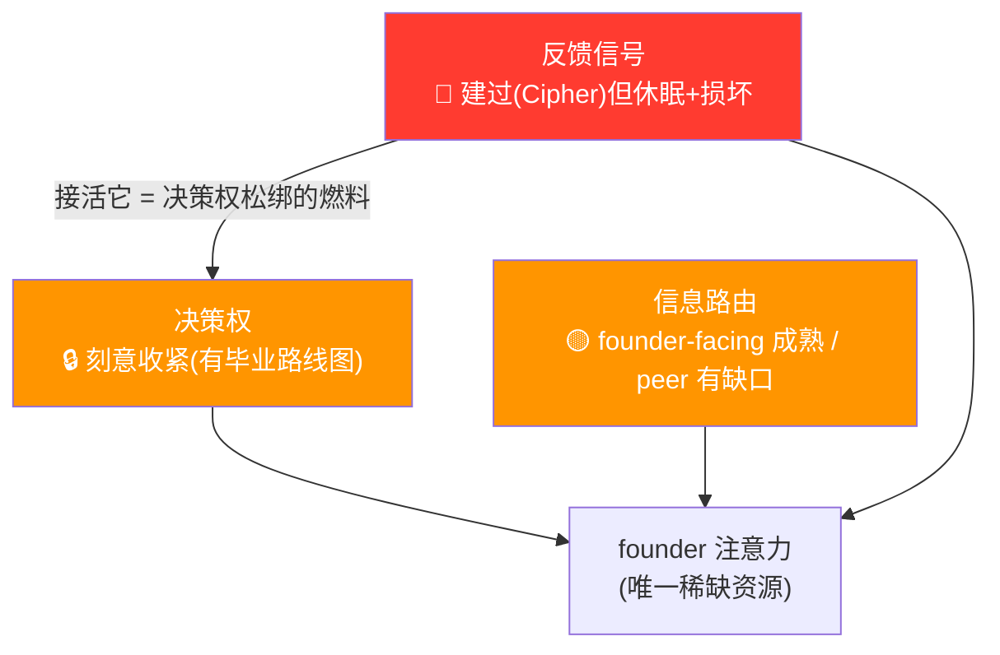
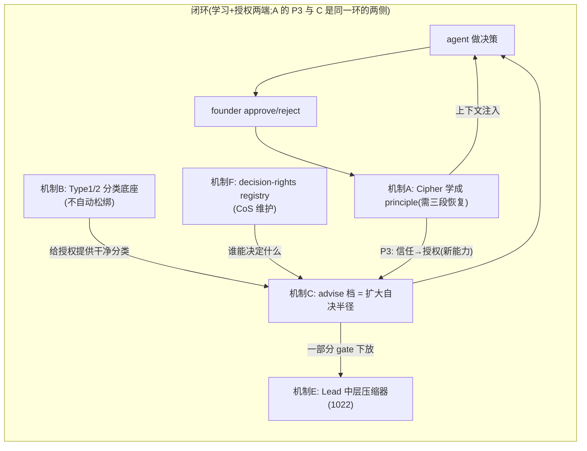

# FLY-1045 组织机制提案 — 把人类公司机制蒸馏进我们的 AI 公司

Issue: FLY-1045 (https://linear.app/geoforge3d/issue/FLY-1045/how-human-companies-operate-distill-into-mechanisms-for-our-ai-company)
日期: 2026-07-09
基于: exploration.md, research.md

> **这是一份 co-eval 提案,不是最终 PRD。** 它把 research 的结论收成一组「现在就能建」的机制,按「省 founder 注意力 / 实现成本」排序,并在每处需要 Annie 拍板的地方留了 co-eval 问题(§6)。Annie 逐条批注后,选中的机制各自转成独立 PRD/build issue。

---

## 0. 一页纸(TL;DR)

- **问题的真身**:Annie 说「把机制搭好,agent 就能自主」。审计发现,减少 founder 注意力消耗的组织原语只有三个 —— **决策权 / 信息路由 / 反馈信号**。我们的信息路由是 **founder-facing 成熟、peer 侧有缺口**(Honey Lemon 直接找 Tadashi 靠的是已有的 roundtable 通道),决策权是刻意收紧(有毕业路线图),**而反馈信号这一格是空的**。
- **最重的发现**:反馈信号原语我们**建过一整套 —— Cipher(GEO-149)**,CEO approve/reject 当训练信号。但它 2026-03-25 起休眠了(15 条学到的 principle 一条都没激活),而且它的「真闭环」从没建全 —— 毕业只产生 escalate/block 规则,**把学到的信任转成「扩大 agent 自决半径」这个我们真正要的能力,今天根本不存在**。同意图的 `founder_consent_audit` 生产库更是**既空又损坏**(`pragma integrity_check` 失败)。**这就是 FLY-1034 的实质。**
- **人类经验里唯一能移植的一类反馈机制,是「传递信息」而非「传递奖惩」的那类** —— 而 Annie 的**第二份 DR(agent 特性校正层)**把这句升级成一套带证据分级的工程判断:**对 agent,「奖惩」= 改 access / memory / routing / compute / artifact-acceptance,在 eval+audit 制度下 —— 不是钱、怕、威望、归属(那些对 agent 是 theater,除非落成控制面变化)**。这不是 HR 系统,是 **control-plane**。见 §3。
- **⭐ 双重收敛(最强的一点)**:① 我从 **codebase** 独立推出「反馈信号是空的一格 = Cipher 断电」;Annie 的 **DR1(人类组织)** 独立把「delegation without a feedback signal」点名为「the central failure mode in your setting」。② 我从代码推出「奖惩 = 上下文注入 + 决策权升降级」;Annie 的 **DR2(agent 校正)** 独立给出几乎逐字相同的 control-plane 结论。**两份独立 DR + 代码审计,三方指向同一处。**
- **一个让人踏实的发现**:DR2 说 agent 的「惩罚」原语 = gating / rollback / quarantine / 独立 critic —— **这些我们已经有了**(founder-gate / QA / revert,DR2 标 Strong)。缺的主要是**奖励侧**:持久 ledger(A)+ capability 阶梯(C)。所以不是从零建奖惩,是补另外半边。
- **产出**:6 条机制(A-F),每条按 **DR1 说 + DR2 校正(带 Strong/Moderate/Limited/Speculative 标签)+ 映射现有系统** 重锚(§4)。A 是根(接活 Cipher,DR2 把它抬成 operating model 中枢);B/F 低成本独立快赢;C 是 capability 阶梯;D 被 DR2 收窄成 artifact-based(见 Q4);E = FLY-1022 orchestrator-worker。

---

## 1. 三原语框架(为什么是这三个)

减少「老板必须亲自处理的事」的组织手段,穷举下来只有三类。它们不是抽象分类,而是从 Flywheel 已有机制反推出来的 —— 每个已有机制都恰好落进一格(证据见 research §2)。

| 原语 | 它决定 agent…… | 缺了它,founder 变成…… | Flywheel 现状 |
|---|---|---|---|
| **决策权** | **允许**自己做什么 | 每一步都被问的审批瓶颈 | 🔒 刻意收紧,毕业被反馈信号卡住 |
| **信息路由** | **知道**什么 | 人肉消息转发器 | 🟡 founder-facing 成熟,peer 路由有缺口(→机制 D) |
| **反馈信号** | **学会**什么 | 无限次重复纠正同一个错 | 🔴 建过(Cipher)但休眠 |

**关键耦合**:反馈信号是决策权的前提。没有「agent 这类判断历来做得对不对」的记录,就不敢下放这类决策 —— 那不叫授权,叫赌博。`founder-only-authority.md` 自己把当前严格状态称为 "calibration window",毕业条件就是「Track 2 审计表积累出足够决策证据」。**而审计表几乎是空的,Cipher 也断了电 → 毕业条件永远满足不了 → 决策权永远松不了。这是整个自治叙事的结构性断点。**

---

## 2. 反馈信号为什么是最高优先级(证据)

research §2.3 的直查结论,浓缩成三句:

1. **Cipher 建过主体**:`packages/edge-worker/src/cipher/` 有决策学习系统的主要部件(五层金字塔 Experience→Insight→Question→Skill→Principle)。代码仍接线(`packages/teamlead/src/bridge/actions.ts:427` recordOutcome / `DecisionLayer.ts:105` 读 CIPHER context)。**但生产闭环从没建全**(见第 3 点)。
2. **Cipher 休眠**:生产 `cipher.db` 数据冻结于 2026-03-25(Slack 时代);15 条 principle **全部 `proposed`,一条没激活**(激活是独立步骤 `activatePrinciple()`,生效于 next-process-start)。信号源疑在 Slack→Discord 迁移时断了。
3. **闭环的最后一环从没建**:即使 principle 激活,毕业出的 HardRule **只有 `block` | `escalate`**(`CipherWriter.ts:829` 明写 no auto_approve)。也就是说 Cipher 能「学 + 升级预警」,但**不能把学到的信任转成「扩大 agent 自决半径」** —— 而那正是我们要的。这是**从没建过的能力**,不是修 bug。
4. **重复且既空又坏**:同意图的 `founder_consent_audit`(FLY-175)生产表仅 1 行(QA 的 `cli-bypass`,因 `decisionMode` 默认 `off`),而且 `pragma integrity_check` **失败**(malformed btree;对照 cipher.db 是 `ok`)。指望它当校准语料,得先修复/重建。

结论:这一格不是「没想到」,是「建了两次都没接活,而且真闭环的最后一环从没建」。**边际回报最高;成本是「三段式恢复 + 补建授权闭环」(见机制 A),比新建一套系统低,但比「接一根线」高。**

---

## 3. 反馈机制的分析核心:从 HR 框 → control-plane 框(DR2 校正)

这是本提案送给 Annie 的最重要一个判断,而 **Annie 亲手跑的第二份 DR(agent 特性校正层)把它从一个「洞察」升级成了一套有证据分级的工程分类学**。

**DR1(人类组织)给的判断**:人类反馈机制分两类 —— **奖励型**(工资/晋升/年度评估)靠钱、地位、未来收入,**对 agent 全部失效**;**信息型**(blameless postmortem / AAR / advice process / andon)靠把「对错信息」送到做事的人手里,**对 agent 移植得比对人还干净**。

**DR2(agent 校正)给的升级 —— 这是关键**:别用 **HR 框**(激励人的心理),要用 **control-plane 框**(治理计算与状态)。DR2 一句话结论:

> **「对当前 LLM coding agent,『奖惩』= 改 access / memory / routing / compute / artifact-acceptance,在 eval+audit 制度下 —— 不是钱、怕、威望、归属。」**

这和我从 codebase 独立推出的「奖惩 = 上下文注入 + 决策权升降级」**是同一个东西**,但 DR2 给了它一张更完整、带**证据强弱标签**的控制面清单(Strong/Moderate/Limited/Speculative):

| agent 世界的「奖惩」原语 | 是奖励还是惩罚 | DR2 证据 | 我们现有的对应物 |
|---|---|---|---|
| **持久 run/artifact ledger**(记录哪个 model/prompt/tool 产了哪个 patch + 测试/rollback/review 结果) | 奖励的**底座**(≈声誉,但按 role/version 不按 persona) | **Strong** | Cipher(机制 A) |
| **capability/permission 阶梯**(read→branch→test→PR→merge→prod) | 升=奖励、降=惩罚 | **Strong** | founder-only-authority 的授权边界 + 机制 C |
| **routing / compute / 更强模型**给可靠 role | 奖励 | **Moderate** | 机制 A 的 track record → 路由 |
| **memory-WRITE 权限**(sustained clean 才给;write 严管、read 可宽) | 奖励 | **Limited(但实践重要)** | Annie 在聊的 memory 分片 |
| **gating / rollback / quarantine / shadow-mode** | 惩罚(软件原生) | **Strong** | founder-gate / QA / revert(**已有**) |
| **critics / monitors / audits**(producer ≠ final judge) | 问责基础设施 | **Strong(coding review)** | auto-QA(独立 QA,禁自验,**已有**)/ 942 watchdog(monitor) |
| 人类式 pay / title / culture / firing 威胁 | —— | 直接不可移植 | ❌ 丢弃(除非落成上面某个控制面变化) |

> **给 Annie 的一句话**:你说「搭个奖惩机制让大家知道对错」—— DR2 证明正确形态**不是**造一个 HR 系统,而是把「对/错」变成**控制面上的具体变化**:做得对 → 爬 capability 阶梯 / 拿 memory-write / 路由到更好的活;做错 → 降权 / rollback / 进 shadow mode。而且我们**已经有一半**(gate/QA/rollback = 被证的惩罚原语,Strong),缺的主要是**奖励侧的 ledger 与阶梯**(= 机制 A + C)。

### DR2 的三条框架校正(影响所有机制的读法)
1. **持久单元 = role/version/ledger,不是 persona;worker = ephemeral slot**。所以「信任」记在 role/profile/version 上,不是记在某个 agent 人格上。(影响 A 怎么建、E 的树怎么想)
2. **协调 = 中心化 orchestration + 有界 delegation,不是去中心 peer 政治**。当前系统受益于**清晰的任务契约**远多于丰富的 peer 政治。(**校正机制 D、E**)
3. **handoff 走 artifact、不走对话**(减少「传话游戏」)。(**校正机制 D**:agent standup 不该是聊天仪式,要 artifact-based 共享状态)

---

## 4. 机制 shortlist(6 条,可拆 build)

排序 = 省 founder 注意力 ÷ 实现成本。

> **每条机制按 DR 重锚**(Lead 要求 3 项):**(a) DR 证据强弱** — 直接用 DR 自己标的强度,不夸大;**(b) 需要什么 substrate + 我们有没有/能不能建** — DR 给了一份权威的五 substrate 清单:① 持久身份 ② 决策+结果的持久记忆 ③ 按 task type 的绩效台账 ④ 机器可读的承诺+deadline ⑤ 按领域(非全局)更新的可信度模型;**(c) 对到现有机制** — DR 的映射(Lead 确认):`founder-gate ≈ Type1(不可逆才 gate)`、`per-issue runner ≈ single-threaded ownership`、`现有 gate/escalation ≈ andon`、`持久决策记录 ≈ agent memory / Cipher`(正好接上 Annie 在聊的 memory 分片)。
>
> ⭐ **关键事实(精确版,别说太满)**:Cipher 对五 substrate 的覆盖是**不均匀**的 —— **② durable memory of decisions+outcomes = 强骨架**(`decision_snapshots` 存 issue/route/diff/pattern-keys,`decision_reviews` 存 CEO action/outcome/timestamp 并外键到 snapshot);**③ task-specific performance ledger = 只有 pattern 级 proxy**(`decision_patterns` 聚合 approve/reject/total/maturity,但还不是「按 task-owning agent / task type」的台账);**⑤ domain credibility model = 只有很弱的前身**(per-pattern `maturity_level` 只是「近期样本数达标就升级」,不是「按领域而非全局更新的可信度模型」)。所以「接活 Cipher」不是从零,但也不只是「补 ①④」——**要补 ③ 的 by-task/agent 台账 + ⑤ 的 domain credibility model + ① 持久身份 + ④ 机器可读承诺 + 授权侧闭环**。

### 机制 A — 接活 Cipher(反馈闭环)【根,最高优先】
- **归属**:**FLY-1034 的实质**。本提案为 1034 提供排序依据 + 技术起点,不重设计。
- **成本**:**中偏高**(medium-high)。不是「新建系统」,但也远不止「接一根线」—— 分三段:
  - **P1 恢复新鲜信号捕获**:审计当前所有 approve/reject 发生点(Discord thread approve、runner 自 ship FLY-945、gate-response-router、reject/defer 路径),确认 `recordOutcome` 真被触发写进 cipher.db;**修复/重建损坏的 audit.db** 并加 integrity check;处理「只有 3 月旧数据」的冷启动。
  - **P2 安全的 principle 激活**:补上 `proposed → activate`(独立步骤)+ next-process-start 生效语义;**平衡证据门槛**(见风险),让激活由证据驱动而非手动拍。
  - **P3 毕业成授权变更(新能力)**:今天毕业只产生 escalate/block;把「学到的信任 → 扩大 agent 自决半径」建出来 —— 这与机制 C 是同一个闭环的两端。
- **省下的注意力**:高。反馈闭环是决策权松绑的燃料;直接减少「同一类判断反复问 Annie」。
- **验收**:一个真实的 founder approve/reject 写进 cipher.db 的**当天**数据(P1);至少一条 principle 走完 proposed→active 并在下一次 process start 于 Decision Layer 生效(P2);reject 与 approve 都被记录(反 Goodhart)。
- **风险**:**Goodhart**。当前 15 pattern 全 `approve=55/reject=0`,是「只见过对、没见过错」的信号 —— 直接拿它学会把「一切都 approve」当规律。缓解:必须记录 reject、要求平衡样本、保留 founder 覆盖权、丢弃只有 3 月的陈旧数据。
- **DR1 重锚(人类组织)**:**(a) 证据 = 方向级强,但注意分两层**。**① DR1 强支持这个方向**:decentralization×trust×performance(Bloom/Sadun/Van Reenen + WMS)是 DR1 证据最强的一块;对 AI 的翻译原话「the substitute for human trust is not culture; it is verifiable logs, persistent state, and traceable decision quality by domain」+「a durable performance record by task type」;并把「delegation without a feedback signal」列为**核心失败模式**。**② 但 DR1 没评估「Cipher」这个具体实现** —— 「Cipher 是我们现成的 scaffold」是 codebase 审计的结论。**(b) substrate = ② 强骨架 / ③ 部分 proxy / ⑤ 弱前身**;A 的 scope 因此包括**补 ③ 的 by-task/agent 台账 + ⑤ 的 domain credibility model**,不只补 ①④。**(c) 映射 = 持久决策记录 ≈ agent memory / Cipher**。
- **DR2 校正(agent 控制面)· 证据 = Strong**:DR2 把「持久 run/artifact ledger」列为 agent 唯一真正起作用的「声誉」形态,**证据 Strong**,而且它就是 DR2 整个 operating model 的核心(trust ledger)。**两条硬校正**:① **信任记在 role/profile/version 上,不是 persona** —— Cipher 的 pattern key 要按 role/version 而非某个 agent 人格;② ledger 要记的字段 DR2 列得很具体:outcome score / test pass rate / static-analysis flags / rollback rate / review acceptance / monitor alerts / cost / latency / `pass^k`(不只是 approve/reject)。DR2 的 reward-hacking 证据(Strong)进一步硬化 A 的反-Goodhart 要求:**别让管理塌成单一标量 proxy**,配 external audit + role separation + holdout。**结论:DR2 把 A 从「值得做」提升到「DR2 operating model 的中枢」。**

### 机制 B — 可逆性判据(决策权分类,不是自动松绑)【低成本快赢】
- **归属**:新机制(本研究提出)。
- **具体做法**:把 `founder-only-authority.md` 从「逐个枚举 endpoint」升级成一条通用**分类**判据 —— 新 endpoint 自动被标成 **Type 1(不可逆:merge main / 销毁 runner transcript)** 或 **Type 2(可逆:双向门)**(Amazon Type 1/2)。**关键边界**:B 首先只是**分类 + backstop**,**不自动松开 R1/R2**。`founder-only-authority` 今天明确规定「即使可逆/低风险,也只是给 founder 的 input,不是自决触发」;所以 B 把动作分好类、fail-closed(拿不准 = 当 Type 1 = gate),但**把某类 Type 2 真正降成自决,仍要走机制 A/C 的同一套校准证据**,不能因为「它可逆」就跳过。
- **省下的注意力**:中。新动作自动归类,减少「这个动作算不算保留动作」的反复判断;为 A/C 的松绑提供干净的分类底座。
- **成本**:低—中(一份 rule 文件 + 一个分类函数;若含 server 端 fail-closed 归类则中,不只是「一个函数」)。
- **验收**:一个新增的可逆动作**不改 rule 文件**就被正确标为 Type 2(但默认仍 gate,直到 A/C 证据放行);一个不可逆动作被标 Type 1 且 gate;分类拿不准时 fail-closed 到 gate。
- **风险**:被误读成「可逆就自动放行」→ 文档和实现都要把「分类 ≠ 授权」写死。
- **DR1 重锚(人类组织)· 证据 = documented escalation filter(非强因果)**:DR1 称 Amazon Type 1/2 是「one of the clearest documented escalation filters in any major firm」,「transfers directly to AI **if reversibility and blast radius are explicitly encoded**」。它的强点是「有清楚公司文档 + 直接可移植」,不是「强因果绩效证明」。**substrate 几乎不需要**;**映射 `founder-gate ≈ Type1`**。
- **DR2 校正(agent 控制面)· 证据 = Strong**:DR2 把 B 的地基**从 practitioner 升级到 Strong** —— 因为它的落地是 **permission boundaries + gating + rollback**,而这些是 DR2 明列的「软件原生、Strong 证据」的**惩罚原语**。DR2 关键补充:**「不可逆状态」是要专门保护的东西**(irreversible-state controls);它建议人类/系统把「只有一小部分动作真不可逆」当设计事实,把重控制集中在那一小部分。所以 B 不只是「分类」,是**把控制面预算集中到真正不可逆的动作上**。⚠️ DR2 也重申 B 只分类不放行(与 A/C 证据挂钩才松),因为 DR2 反对「让管理塌成单一 proxy」。

### 机制 C — advise 档(渐进授权)
- **归属**:新机制,依赖 A + FLY-1034。
- **具体做法**:在 gate 的「问 / 不问」二值之间加第三档 **advise**(agent 先做、事后在 thread 告知,不阻塞)。用 Cipher 的 track record 决定哪类动作可以从「问」升到「advise」(Management 3.0 的 7 levels 里的 Advise 档)。这就是机制 A 的 P3(把信任转成授权)在授权侧的落地。
- **省下的注意力**:高(把一批中风险动作从「打断她等批」降成「做完告诉她」)。
- **成本**:中(依赖 A 的 track record)。
- **验收 + 升档门槛(**必须平衡证据,不能用「100% approve」当门槛**)**:一类动作要升到 advise,必须满足 —— ① 足够的**近期**样本(丢弃只有 3 月的陈旧数据);② 存在**真实的 reject 机会**(不是从没被拒过);③ 置信区间达标;④ 有 founder override 遥测在跟。⚠️ **反例**:当前 cipher.db 恰好是 100% approve / 0 reject —— 这正是 Goodhart 陷阱,**绝不能**拿「历史 100% approve」直接当升档信号(那只证明「从没被拒过」,不证明「做得对」)。founder 保留随时一键降级回 gate 的权力。
- **风险**:升档太快 / 拿单边数据升档 → 门槛必须要求平衡证据 + 可一键降级。
- **DR1 重锚(人类组织)· 证据 = practitioner**:DR1 对 Management 3.0 七档授权标「semi-transferable」,限定语「iff delegation levels 做成 machine-readable 且 grounded in task history」—— 依赖 task history(= Cipher / 机制 A)。**substrate = ③ 绩效台账**(靠 A);**映射 = advise 档接在 founder-gate 之下**。
- **DR2 校正(agent 控制面)· 证据 = Strong**:DR2 把 C **从 practitioner 升级到 Strong** —— 因为「advise 档」其实是一条更大的 **capability/permission 阶梯**上的一格,而 DR2 明说这条阶梯是「**最直接可移植的 promotion/demotion 类比,Strong 证据**」:`read-only → branch edits → test execution → PR creation → PR merge → production write`。「奖励 = sustained eval 成功后爬一格」;「惩罚 = failed audit / suspicious trace / rollback 后自动降一格」。**重要新增(Annie 关心)**:DR2 把 **memory-WRITE 权限**列为阶梯上一个**要严管的高价值格** —— read 可宽、write 要 sustained clean 才给(memory poisoning 是真实攻击面,Limited 证据但实践重要)。所以 C 的完整形态 = 一条 control-plane 阶梯(gate→advise→delegate 只是其中授权那一段),memory-write 是接 Annie memory 分片的另一段,全部由 A 的 ledger 门控。

### 机制 D — agent 共享状态(artifact-based,非聊天 standup)【独立快赢,不依赖 A】
> ⚠️ **DR2 重定义了这条**。原来我把它想成「agent 之间的聊天 standup」;DR2 说这个方向要小心 —— 见下面 DR2 校正。保留机制,但形态从「聊天仪式」改成「**artifact-based 共享状态**」。
- **归属**:新机制(本研究提出)。**独立于 A** —— 补信息路由里的 **peer 缺口**(§1 表:founder-facing 成熟,peer 有缺口)。
- **具体做法(DR2 校正后)**:我们现在的 "standup"(`daily-standup.sh` / `standup-service.ts`)是**面向 founder 的系统健康报告**,不是 agent 之间的同步。加一个 agent 能读的**结构化共享状态 artifact**(谁在做什么 task / 卡在哪 / 依赖谁的哪个 artifact),让下游 agent **引用 artifact** 而不是靠对话转发。**不是**开一个聊天早会。
- **省下的注意力**:中(减少「Annie 当人肉转发器」的场景)。
- **成本**:低(roundtable / 现有 artifact 层已在,加一个结构化状态聚合)。
- **验收**:一个 agent 的 blocker 被另一个 agent **从共享状态 artifact 里**看到并接手,全程不经过 founder,也不靠长对话历史。
- **风险**:变成噪声或退化成 peer 政治(见 DR2)→ 必须结构化 artifact + 中心 orchestration 兜底。
- **DR1 重锚(人类组织)· 证据 = case-based**:DR1 说 standup「often drift from coordination toward status reporting」,只在「updates a shared state graph and triggers routing of blockers」时才有用 —— 这句正好定义了 artifact-based 形态。Team of Teams:「transparency without local authority just creates spectators」→ D 要配 E 的 local authority。
- **DR2 校正(agent 控制面)· 这是 DR2 对本提案最大的一处纠正**:① DR2 明确 **当前 agent 系统受益于「清晰任务契约」远多于「丰富的 peer 政治」**,协调应是**中心化 orchestration + 有界 delegation**,不是去中心 peer 社会 —— 所以 D **绝不能**做成「agent 之间自由开会协商」。② DR2:**handoff 走 artifact、不走对话**(减少「传话游戏」;这是 DR2 的 **operating recommendation / Anthropic 生产指引**,实践相关性高,但 DR2 **没给它挂四档标签**,别当「Strong 证据」读)—— 所以 D 的载体是结构化 artifact(plans / TODO / diffs / test reports / dependency graphs),不是 chat 历史。③ 净判断:D 仍值得做(peer 缺口真实,Honey Lemon↔Tadashi 是它的样子),但**收窄成 artifact-based 共享状态 + 由 orchestration 兜底**,不是聊天仪式。**这条最需要你(Annie)拍**:要不要按这个收窄后的形态做(见 Q4)。
- **DR 重锚**:**(a) 证据 = case-based**。DR 说 standup「often drift from coordination toward status reporting」,只在「updates a shared state graph and triggers routing of blockers」时才有用 —— 这正好定义了我们要的形态(路由 blocker,不是播报状态)。**(b) substrate = ④ 机器可读承诺**(轻量;roundtable 通道已在)。**(c) 映射 = 现有 standup 是 founder-facing 系统健康报告,D 补的是 peer 侧**(Team of Teams 的 shared consciousness:DR「transparency without local authority just creates spectators」—— 所以 D 要配合 E 的 local authority)。

### 机制 E — Lead 中层信息压缩器(andon 中间层)
- **归属**:**FLY-1022**。本提案提供组织学论据,不重设计。
- **具体做法**:让一部分 gate 由 Lead 响应而非 founder(丰田 andon 拉绳先由 team leader 响应、不惊动厂长)。Lead 敢响应的前提是它对「这类决策 founder 会怎么判」有 track record（← 机制 A）。**加一个「revise the rule」钩子**(见 DR 重锚 c):每个 workflow 要有一条「暂停 + 升级 + 修规则」的正式路径,否则是 accountability sink。
- **省下的注意力**:高(直接减少砸向 founder 的 gate 量)。
- **成本**:高(是完整 PRD = FLY-1022)。
- **组织学论据**:span-of-control。⚠️ **DR 明确「there is no magic manager-to-report ratio」** —— 没有魔法数字。所以别把「人类 5-9」当定律:它是方向性类比。真正决定 span 的是**任务耦合度 + coordinator 的监控带宽**(对 AI:一个 coordinator 在 token 限制下能有意义 inspect 多少 workflow)。FLY-1022 观测「一个 Lead 超过约 5 个 runner 就退化」是**本地观测**,和人类经验值方向一致(都指向「监控带宽有限」),但不宣称是「跨物种成立的上限」。结论仍成立:树形结构不是工程偏好,是绕过「监控带宽」这个约束的办法。
- **DR1 重锚(人类组织)· 证据 = 反阈值 + tradeoff(非强因果)**:DR1「there is no magic manager-to-report ratio」;删中层是 tradeoff,DR1 点明「删掉信息压缩器 → **that is exactly your current bottleneck**」。**substrate = 靠 A 的 track record**;**映射 = 现有 gate/escalation ≈ andon**;dept-lead = 信息压缩器,不是小老板。
- **DR2 校正(agent 控制面)· 证据 = 生产/实践支持(非四档 Strong)+ 反过度扩张护栏**:① DR2 **支持 E 的核心** —— 「centralized orchestration with constrained delegation」正是 DR2 力荐的协调形态:lead agent 分解工作、给 subagent **具体目标 / 输出格式 / 工具指引 / 清晰边界 + effort budget**(否则 agent 重复劳动、留缺口、乱逛)。**FLY-1022 的树 = 这个 orchestrator-worker 模式**。⚠️ 注:DR2 给 orchestration 的是**生产指引 + benchmark/case 支持**,但**没有**把「orchestrator-worker 模式」本身标进它四档里的 Strong(它明标 Strong 的是 ledger / permission 阶梯 / gating / critic·audit);别把这条当四档 Strong。② DR2 加了一条**反过度扩张护栏**:**别默认上多 agent**,先把单 agent + 好工具 + 好 eval 做到极致,**只在有具体失败模式**(工具过载 / 任务分解 / review 瓶颈 / 长程分支)时才加层 —— 「elaborate multi-agent 常常不如简单 scaffold」。所以 1022 的树要**由失败模式驱动地长**,不是为了树而树。③ dept-lead 定位 = **orchestrator + 信息压缩器**(读写 artifact、发任务契约),不是小老板、不是 peer 政治节点。**942 watchdog = DR2 的 monitor 层**(监控可疑轨迹),和 E 的中层响应互补。

### 机制 F — decision-rights registry(DR 移植性高,Lead 点名)【独立快赢】
- **归属**:新机制(DR 催生 + Lead 在指令里点名 CoS 该维护它)。**独立于 A**。
- **具体做法**:把「谁能决定什么」做成一张 **machine-readable 路由表**(RAPID:Recommend/Agree/Perform/Input/Decide,或 DACI:Driver/Approver/Contributor/Informed)。**CoS 拥有并维护这张表 + escalation policy + review cadences**,而不是逐个模糊点分诊。每类 issue/动作查表就知道该谁拍、该谁被咨询、什么升级 —— 把「这事该谁决定」从「每次问 founder / CoS 现判」变成「查表」。
- **省下的注意力**:高(DR:决策权模糊是常见瓶颈;显式化后 founder 不再当路由器)。
- **成本**:低—中(路由表 schema + CoS 规则改写;DR 说 RAPID/RACI/DACI「basically a routing table」,移植性极高)。
- **验收**:一个新 issue 进来,CoS 按 registry 自动定「谁 Decide / 谁 Input / 什么触发升级」,不再逐个问 founder;registry 是显式文件,可 review、可版本化。
- **风险**:DR 警告 over-apply 到每个小选择会 backfire → 只对「反复出现、值得固化」的决策类型建表,不是每个动作。
- **DR1 重锚(人类组织)· 证据 = practitioner / clarity-tool,但 AI 移植性高**:DR1 诚实标注 RAPID「mostly practitioner evidence」、RACI/DACI「clarity tools, not performance technologies」—— 没有强因果绩效证明,价值是**对 AI 移植性极高**(「basically a routing table」)。别把「高移植」误读成「强证据」。**substrate = ④ 机器可读**;**映射 = CoS 分诊 → CoS 维护 registry**。
- **DR2 校正(agent 控制面)· 证据 = permission-boundary 框 Strong,schema 本身仍 practitioner**:DR2 说决策权对 agent 的转移形态就是 **permission boundaries**,而这是 DR2 的 Strong 证据面。DR2 的一条核心 operating 建议**几乎逐字**是 F + CoS 重构:**「human oversight should shift up one level —— 少花时间点『approve 每个动作』,多花时间设计 permission tiers / audit suites / merge criteria / intervention hooks;人变成系统的 governor,不是每个键盘动作的 foreman。」** 所以 F 的 registry 不只是「谁拍板」的路由表,更是 **permission-tier + merge-criteria + audit-suite 的设计物**,由 CoS/founder 维护。DR2 还加 **task-scoped IAM**:短命 credential 绑 role/task/repo/env,run 结束自动 deprovision —— 这是比任何 prompt 威胁都真的「firing」,也是 F 的一个可选延伸面。

**依赖排序(Codex R1 校正 + DR 重锚)**:
- **A = 根**,但只对「授权毕业」是根(C 依赖它、E 受益于它)。A 本身是三段式、中偏高成本。
- **B / D / F = 独立快赢**,都不依赖 A:B = Type1/2 分类底座(不自动松绑);D = peer 路由补口(补信息路由缺口);F = decision-rights registry(DR 说移植性极高、CoS 维护)。
- **C 依赖 A**(需要 track record)。
- **E = FLY-1022**:自己的 PRD 轨道,受益于 A 但能独立推进。
- 先做顺序建议:**B + D + F(独立低成本)可立即起步;A 是最高价值但最重,值得优先立项;C 跟在 A 后;E 走 1022。**

---

## 5. 分类总表:直接移植 / 补基座 / 丢弃

> DR1 的 synthesis + DR2 的 control-plane 框给了这张表一个权威版本(见 research §7);下表已与两份 DR 对齐。DR2 尤其锐化了「丢弃」和「别过度建」两栏。

| 类别 | 机制 | 处理 |
|---|---|---|
| ✅ 直接移植(靠结构化信息+授权/控制面) | Type 1/2 分类、RAPID/RACI/DACI 命名决策权、single-threaded ownership、blameless postmortem/AAR、书面 narrative+WBR、handbook-first;**+DR2 补:permission 阶梯 / gating·rollback·quarantine / critic·monitor·audit / artifact-based handoff / task-scoped IAM** | B + F + 写进 memory 规范;**gate/QA/rollback = 已有的 Strong 惩罚原语**;single-threaded/写作文化=已有资产 |
| ⚠️ 补基座后移植(需先补 substrate) | Cipher 决策学习(② 强骨架 / ③ 部分 proxy / ⑤ 弱前身)、capability 阶梯 + memory-write 权限、Lead 树/orchestrator | 机制 A / C / E |
| ❌ 丢弃 / ⚠️别过度建(DR2 加严) | 顶薪、pay-for-performance、晋升阶梯、Keeper Test 恐惧、self-determination 内在动机叙事、Bridgewater 互评打分、照抄 Spotify squad 图;**+DR2 明列 Speculative、别当激励原语:agent「职业」/ status market / 长命 peer 层级 / 象征性 title / 自治内部政治**(引入了只当实验性控制接口) | 明确不做 / 不默认多-agent |

---

## 6. 给 Annie 的 co-eval 问题(逐条批注)

> 这些是需要你拍板的地方。交互 HTML 卡里每条留一个 textarea。

**Q1. 核心论断认不认?** 我说「三原语里反馈信号是唯一空的一格,而它其实是 Cipher 断了电」——这个诊断你同意吗?还是你觉得瓶颈其实在别处(比如 agent 能力、或某个具体流程)?

**Q2. 排序认不认?** 我把「接活 Cipher(机制 A)」排在第一,因为它是决策权松绑的燃料。但它 = FLY-1034,而 1034 你之前说「不知道现在要不要做」。这份研究给了它一个排序依据 —— 你现在想把 1034 提上来做吗,还是先做成本更低的机制 B(可逆性判据)当快赢?

**Q3. control-plane 版的「奖惩」翻译,戳不戳心坎?** 你原话是「搭奖惩机制让大家知道对错」。两份 DR + 代码都指向:agent 世界不该造 HR 奖惩,该造的是**改 access / memory / routing / compute / artifact-acceptance,在 eval+audit 下**(做对 → 爬 capability 阶梯 / 拿 memory-write / 路由到好活;做错 → 降权 / rollback / shadow)。而且惩罚那半边我们已有(gate/QA/rollback)。这个 control-plane 翻译对不对你的意?

**Q4. 机制 D 被 DR2 收窄了 —— 收窄后的形态你要吗?** 原本我想成「agent 之间聊天 standup」;DR2 明确说当前 agent 受益于**清晰任务契约**远多于 peer 政治,且 handoff 应走 **artifact 不走对话**。所以我把 D 收窄成「**artifact-based 共享状态**(agent 从结构化 artifact 里看到彼此在做什么/卡在哪),由中心 orchestration 兜底」——不是聊天早会。这个收窄后的 D 值得建吗?还是先放一放?

**Q5. DR 推的机制 F(decision-rights registry + CoS 从「分诊每件事」变「维护决策路由表」)你怎么看?** DR 说 RAPID/RACI/DACI「basically a routing table、对 AI 移植性极高」(注:DR 诚实标注它是 practitioner/clarity-tool 证据,非强因果),Lead 也点名 CoS 该维护它。这条独立、低成本、移植性高 —— 你想把它也放进立即起步的一批吗?

**Q6. 拆哪几条?** A-F 里,你想让哪几条转成独立 PRD/build issue?(A→1034,E→1022,B/C/D/F 是新的;B/D/F 可立即起步。)

---

## 7. 边界与非目标

- 本文**不重新设计** FLY-1022 / FLY-1034 / FLY-353,只引用并给它们排序/论据。
- 本文**不改代码**,产出是研究 + 提案。选中的机制各自走自己的 PRD → build。
- 本文**不碰 ship / gate 之外的东西**;这是 docs-only。
- ⚠️ **来源分级**:本文的**硬事实**是 §2 的 codebase 断言(带文件/行号/SQL,可复现)。组织学论断来自 **Annie 亲手跑的两份 DR**(一等证据,带引用):**DR1**(`deep-research-org-design.md`,人类组织)+ **DR2**(`deep-research-agent-incentives.md`,agent 特性校正层,用 Strong/Moderate/Limited/Speculative 标签)。本文逐条继承它们的证据强弱标注 —— DR2 标 Strong 的(persistent ledger / permission 阶梯 / gating·rollback / critic·audit **在 coding review 场景 Strong、broader alignment 只 Moderate**)当强证据用;orchestration / artifact-handoff 是 DR2 的**生产指引**、不带四档标签,别当 Strong;标 Limited/Speculative 的(memory-write 具体收益 = Limited;**role/profile 之上的**合成声誉 / agent 职业 / status market = Speculative —— 注意 role/version 级 trust ledger 本身是 Strong)明确当「实验性、别当定论」。凡 DR 标弱的地方,本文不夸大。

---

## 附:证据可复现性

所有 codebase 断言可复现:
- Cipher 结构:`packages/edge-worker/src/cipher/README.md`
- 写:`packages/teamlead/src/bridge/actions.ts:427`(approve)/ `:538`(reject/defer);读:`DecisionLayer.ts:105`(读 CIPHER context;构造参数 `DecisionLayer.ts:29`、组装 `run-infra.ts:226-238`);实例化:`packages/teamlead/src/index.ts:31`(advisory/fail-open)
- HardRule 只有 block/escalate:`packages/edge-worker/src/cipher/CipherWriter.ts:829`;principle 激活独立步骤 + next-process-start:`packages/teamlead/src/bridge/plugin.ts:1987-1998`
- audit.db 损坏:`sqlite3 ~/.flywheel/audit.db "pragma integrity_check"` 失败(对照 cipher.db `ok`)
- 休眠证据:`sqlite3 ~/.flywheel/cipher.db "select status,count(*) from cipher_principles group by 1"` → 全 `proposed`;`decision_reviews` 时间戳全在 2026-03-19
- 决策权契约:`packages/teamlead/lead-rules-base/founder-only-authority.md`
- 审计表默认关:`packages/config/src/decision-mode.ts:23`(default `off`)
- span-of-control 观测:FLY-1022 立项描述
- 组织学一等证据(Annie 亲手跑):`deep-research-org-design.md`(DR1,人类组织)+ `deep-research-agent-incentives.md`(DR2,agent 控制面校正,带 Strong/Moderate/Limited/Speculative 标签)
