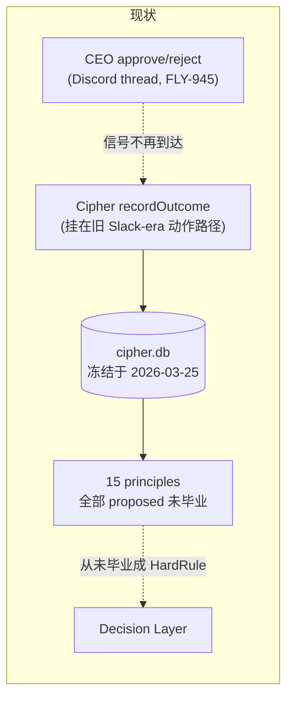
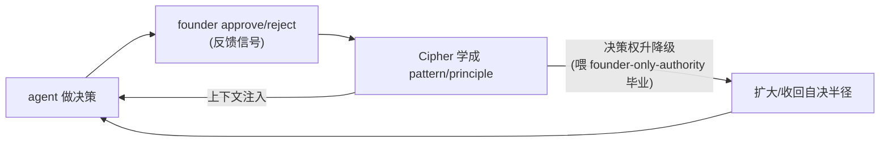

# FLY-1045 人类公司运作机制 — 调研

Issue: FLY-1045 (https://linear.app/geoforge3d/issue/FLY-1045/how-human-companies-operate-distill-into-mechanisms-for-our-ai-company)
日期: 2026-07-09
基于: exploration.md

> **方法说明**:本文有两个信息来源。① **codebase 审计**(第 2、5、6 节)—— 全部是我直接查证的事实,每条给了文件/行号/SQL 证据,可复现。② **人类组织学**(第 3、4 节)—— 主线来自一次 ChatGPT Deep Research(Annie 指定),辅以组织理论标准文献。DR 的逐条引用在 `## Sources` 汇总;凡证据薄弱/有争议/仅为轶事的地方,本文显式标注 ⚠️,不冒充定论。

---

## 1. 一句话结论

Flywheel 的组织瓶颈不在沟通(已很强),也不在授权(是刻意收紧),而在**反馈信号**这一格 —— 而反馈信号原语我们**其实建过一整套(Cipher / GEO-149),它现在休眠了**。补活它,是单位 founder 注意力回报最高的一笔投资,也正是 FLY-1034 的实质内容。

---

## 2. Codebase 审计:三原语的现状打分(全部可复现)

exploration.md 提出:减少 founder 注意力消耗的组织原语只有三类 —— **决策权 / 信息路由 / 反馈信号**。这一节用 codebase 证据给每一格打分。

### 2.1 信息路由 —— founder-facing 成熟,peer 路由仍有缺口 🟡

| 机制 | 证据 |
|---|---|
| 分诊台(Chief of Staff) | `cos-lead-rules.md`:CoS 用机械算法按 issue token 数路由 |
| 每 issue 一个 thread | reply-discipline STEP 2:N 个 token → N 个 `/api/chat-threads/send` |
| 横向同僚通道 | `#leads-roundtable`(FLY-267)+ `#flywheel-core`;`reply-guard.ts:28` core-channel 豁免 |
| 状态推送(pull→push) | `founder_milestone_report`(config.yaml:113):zero-signal 终态自动 @founder |
| 定时状态上报 | `daily-standup.sh`(GEO-288,3AM 系统健康)+ `daily-digest.sh` |

**判断(需要拆开说,别一刀切「饱和」)**:信息路由分两个子方向 —— **① 面向 founder 的路由 + 每 issue 路由 = 成熟**(reply-discipline、per-issue thread、milestone push、standup 都属这类,修得很好);**② agent 之间的 peer mutual-adjustment 路由 = 仍是缺口**(见下一条 ⚠️ 和 §7 机制 D)。Annie 举的 Honey Lemon 直接找 Tadashi,靠的是 roundtable 提供的**物理通道**,但那次是**偶发的好行为**,不是一个把「昨天做了啥/卡在哪」结构化推给同僚的**机制**。所以准确的说法是:**founder-facing 路由接近饱和(边际收益低),peer 路由还有一个明确的机制缺口。**

> ⚠️ 一个重要区分:我们的 "standup" 是**面向 founder 的系统状态上报**(3AM 自动生成健康报告),而**不是**人类 standup(团队成员之间互相同步「卡在哪」)。缺口是 agent 之间没有 peer 同步机制。**但注意 DR2 校正了这个缺口该怎么补**:不是做一个 agent 聊天早会(DR2 说当前 agent 受益于清晰任务契约远多于 peer 政治),而是做一个 **artifact-based 共享状态**(见 §4b + §7 机制 D)。所以这里说的是「缺 peer 同步」,填法是 artifact 不是 chat。

### 2.2 决策权 —— 刻意收紧 🔒

`founder-only-authority.md`(481 行)把两类动作保留给 founder:
- **R1** merge / ship(任何进 `main` 的路径)
- **R2** runner 生死(terminate/reject/defer/shelve/close-tmux,以及 auto-close 级联)
- **R3** 一条极窄的自愈豁免(仅 auth-expired 的重启在位)

关键在于:文件**自己把这称作 "calibration window"(校准窗口)**,并且写好了放松的路线图(v1.3x → v1.4x),毕业条件是:

> 「Track 2 审计表积累出足够的 founder allow/deny/override 决策证据,让 Lead 的判断可以逐类毕业到自决。」——`founder-only-authority.md` §Future autonomy roadmap

也就是说,决策权这一格**不缺设计,缺的是把它推向毕业的燃料**。而燃料 = 反馈信号里的决策记录。**决策权的松绑被反馈信号的缺失卡住了。**

配套:`.flywheel/config.yaml` `decision_layer.autonomy_level: advisor`(Lead 提议、founder 决定)+ 三个 checkpoint gate(`brainstorm` / `question` / `approve_to_ship`,各带 fail-open vs fail-close 语义)。

### 2.3 反馈信号 —— 建过,休眠了 🔴(本研究的核心发现)

审计从「审计表只写不读」出发,结果挖出一个更重的事实:**反馈信号原语其实建过一整套,叫 Cipher(GEO-149)。**

`packages/edge-worker/src/cipher/README.md`:

> CIPHER (Continuous Intelligence from Patterns in Human Executive Reviews) — Flywheel's decision-learning system. It observes how the CEO approves or rejects agent-completed issues, extracts statistical patterns, and feeds those patterns back into the Decision Layer.
> **Core principle**: The CEO's approve/reject decisions are training signal.

它的设计**正是**「反馈信号」原语,而且是五层知识金字塔(Experience → Insight → Question → Skill → Principle)。代码仍在接线:

- 写入:`packages/teamlead/src/bridge/actions.ts:427` 在 approve 时调 `cipherWriter.recordOutcome(...)`;reject/defer 在 `actions.ts:538`(当前态为 `awaiting_review` 时)也接了。
- 读取:`DecisionLayer.ts:105` 在每次 triage 前走 `cipherReader.buildPromptContext(...)` 读 CIPHER context(构造参数在 `DecisionLayer.ts:29`,实际组装在 `run-infra.ts:226-238`)。
- 实例化:`packages/teamlead/src/index.ts:31` Bridge 启动时创建 cipherWriter,但是 **advisory / fail-open**(try/catch,初始化失败会打 "running without CIPHER" 然后 Bridge 照常起),不是硬依赖。

> ⚠️ **一个必须说清的精度问题(否则夸大了闭环)**:principle 并不会「自动毕业成 HardRule 喂回」。真实路径有三个断点:① `graduateSkillsToPrinciples()` 只把 principle 插成 `status='proposed'`,**变成 active 需要一个独立的 `activatePrinciple()` 调用**(`plugin.ts:1987`),且生效于 **`next_process_start`**(`plugin.ts:1998`)。② 就算 active,毕业出的 HardRule **只有 `block` | `escalate` 两种 action**(`CipherWriter.ts:829` 注释明写 "HardRule actions are 'escalate' | 'block' — no 'auto_approve'"):`likely_approve` pattern 毕业成的是一条 **escalate** 规则(让 Decision Layer 标记升级),**不是**「自动批准/自动授权」。③ 所以「学到的东西 → 扩大 agent 自决半径」这个我们真正想要的闭环,**今天在 Cipher 里根本不存在** —— 它能学、能 escalate,但不能把学到的信任转成授权。这不是 bug,是从没建过的能力。

**但生产数据是死的**(全部 SQL 直查 `~/.flywheel/cipher.db`):

| 表 | 行数 | 时间范围 / 状态 |
|---|---|---|
| `decision_snapshots` | 56 | **2026-03-19 → 03-25**(之后再无新增) |
| `decision_reviews` | 55 | 全部 `approve / fast_approve`,时间戳全在 **2026-03-19** |
| `decision_patterns` | 15 | 全部 `approve=55, reject=0, trusted`(15 个 pattern 共享同一批 55 次 review) |
| `cipher_principles` | 15 | **全部 `status='proposed'` —— 一条都没毕业成 HardRule** |
| `cipher_questions` | 0 | 空 |

翻译成人话:

1. **信号源头断了 ~3.5 个月**。最后一次 CEO 决策被 Cipher 记录是 2026-03-19。这恰好是 **Slack 时代**(README 标题 GEO-149,2026-03,那时通知走 Slack;现在走 Discord thread + gate-response-router + runner 自 ship 的 FLY-945 路径)。approve 动作的形态在迁移中变了,Cipher 的 `recordOutcome` 挂在旧动作路径上,新路径不再喂它。⚠️ 这条根因是我的推断(证据:数据冻结点 = Slack→Discord 迁移期),需要一个 debugging follow-up 坐实,不影响本文的组织层论断。
2. **就算有信号,也从没闭环**。15 条 principle 全部停在 `proposed`,一条都没毕业成 HardRule。也就是说,即使在 3 月那批数据活着的时候,**"学到的东西自动喂回决策" 这个闭环的最后一环从未真正合上**。
3. **同一时期新建的 `founder_consent_audit`(FLY-175 Track 2)重复了 Cipher 的意图**,而且更空,**还损坏了**。生产表里只有 1 行,是 QA test slot 的 `cli-bypass` 紧急旁路(lead_id=flywheel-test-2),不是真实 founder 决策(原因:`decisionMode` 生产默认 `off` —— `decision-mode.ts:52` 返回 `enabled ? "enforce" : "off"`,canonical env 与 legacy flag 都没设 → `off`,所以几乎没写)。更糟:`sqlite3 ~/.flywheel/audit.db "pragma integrity_check"` **失败** —— malformed btree、rowid 乱序、多个 founder-consent 索引条目数错(对照:`cipher.db` 的 integrity_check 是 `ok`)。也就是说,`founder-only-authority` 指望的「Track 2 审计语料」现在**既是空的、又是坏的**。任何 FLY-1034 / Track 2 工作,第一步必须是修复或重建这个语料库,并加一个 integrity check —— 不能拿一个损坏的库当校准训练集。

**判断**:这一格是三原语里唯一没有闭环的。而且它不是「没想到」,是「建了两次都没接活」—— Cipher(2026-03,Slack 时代遗留)+ founder_consent_audit(2026-07,默认关)。**这就是 FLY-1034 的实质**:1034 问「用什么数据学、怎么把数据变成 agent 做对决策」,答案的一半已经躺在 `cipher.db` 的 schema 里,只是断了电。

---

## 3. 人类组织学:运作模式与决策权(DR 主线 + 文献)

> 本节的组织学证据来自 **Annie 亲手跑的一份 Deep Research**(《Operating Systems for One Founder and Fifteen AI Agents》,`deep-research-org-design.md`,带引用、诚实标了证据强弱)—— 当**一等证据**用。每个机制仍过**「它假设了工人有什么」**这道筛子(exploration §5 的核心方法)。DR 的证据强弱标注(强/case-based/anecdotal)在下面逐条继承,不夸大。

> ### ⭐ 收敛点(这是给 Annie 最有说服力的一件事)
>
> 我先做了 codebase 审计(§2,独立于任何外部研究),推出的中心论断是:**三原语里反馈信号是唯一空的一格,而它其实是 Cipher 断了电**。
>
> Annie 独立跑的这份 DR,在它的 synthesis 里把 **"delegation without a feedback signal"** 明确点名为 **"the central failure mode in your setting"**,并给出药方:「the substitute for human trust is not culture; it is verifiable logs, persistent state, and traceable decision quality by domain」「a durable performance record by task type」。
>
> **两条独立的路径 —— 一条从我们的代码里挖、一条从人类组织学文献里挖 —— 指向了同一个结论。** 这不是我把 DR 往我的框架上套;是 DR 自己的 hard-nosed synthesis 和 codebase 审计撞到了一起。下面的重锚,就是把 DR 的权威证据 + substrate 清单,逐条钉到我们已有/该建的机制上。

### 3.1 运作模式,以及它们各自在多少人时崩溃

人类不是先有理论再建组织,而是撞到协调成本的墙才换结构。对我们有意义的不是模式本身,而是**每种模式假设了什么、在什么规模崩溃**:

> ⚠️ **DR 明确警告:operating models 没有可信的「崩溃人数」阈值**(functional/divisional/matrix/founder-led 都没有 credible universal break-headcount)。下表「崩溃点」一列是**情境性触发条件**,不是人数门槛 —— 别当定律读。

| 模式 | 解决什么 | 强加的协调成本 | 崩溃触发条件(非人数阈值) | 对 agent 的假设 |
|---|---|---|---|---|
| 扁平 founder-led | 小团队,创始人直连每个人 | 老板注意力 O(N) | 当 founder/top-team 的仲裁队列开始主导时(高度情境性,无可信固定人数) | 老板能记住每个人的状态 |
| 职能(functional) | 专业深度、规模经济 | 跨职能协调靠上层 | 跨职能相互依赖超过顶层能仲裁的量 | 各职能内部目标一致 |
| 事业部(divisional) | 端到端 owner、快速决策 | 重复建设、跨部门协同弱 | 产品/地域异质性主导、需要共享平台时 | 每个 division 能自足 |
| 矩阵(matrix) | 同时要专业深度 + 产品对齐 | **双线汇报 = 高协调税** | 每加一个维度复杂度上升(比人数更相关) | 人能承受两个老板的模糊 |
| Holacracy / 自管理 | 去掉中层、快速自治 | 规则复杂、决策权显式化的开销 | ⚠️ Zappos 部分回退;证据混杂 | 工人有强内驱 + 会主动拉责任 |

**对我们最直接的两条**:

- **扁平 founder-led 正是我们现在的默认**,而 Annie 的原话就是它撞墙的声音:「成百上千人时老板不可能 micromanage」。我们还没到几百 agent,但**「几乎所有事都 escalate 到她」= 已经在这堵墙下**。出路不是换成矩阵(那是给 agent 加协调税),而是**把她直连的 N 条线,变成经 Lead 的树**(这正是 FLY-1022)。
- **Spotify squad/tribe 模型:必须警惕。** ⚠️ 广为流传,但**有充分记录表明 Spotify 自己从未真正按那张图运作**,而且多篇复盘指出照抄它的公司大多失败。教训对我们尤其锋利:**我们很容易照抄一个漂亮但从未真实存在的组织图**。任何机制提案都要问「它在真实公司里真跑过吗、跑成什么样」,而不是「它听起来是否合理」。

**DR 给的具体实例 + 证据强弱**(逐条继承 DR 的诚实标注):
- **Amazon two-pizza / single-threaded ownership**(5-10 人小团队 + 一个全职单线负责人):DR 评「as internal doctrine 强、as long-run revealed preference 够强,但非干净因果实验」。**对我们移植性好 —— iff ownership 被机器强制、scope 够窄**。→ 我们的 **per-issue runner 已经就是 single-threaded ownership**(Lead 的映射)。
- **Netflix context-not-control / Keeper Test**:DR 明确「靠 elite 劳动力市场、顶薪、怕被裁、career 焦虑」,2024 年 Netflix 自己都软化了 Keeper Test 措辞 → **几乎完全不可移植到无薪 agent**。
- **Buurtzorg / Morning Star / Haier / Gore**:DR 全标 case-based / anecdotal,且都**依赖持久身份、声誉、社会记忆** → 属「需先补 substrate」类(见 §7)。
- **Zappos Holacracy**:DR 给了硬数据 —— 转型期约 **18% 流失**;教训 = 高流程开销 + 依赖稳定身份,对无状态 agent 基本失效。
- **Spotify**:见上一条,DR 引用 Kniberg 原话「the Spotify model has nothing to do with Spotify really」印证了「照抄一个从未真实运作的图」的风险。

### 3.2 决策权:人类怎么正式分配「谁能决定什么」

这一节对我们最值钱,因为它直接对应 `founder-only-authority` 的毕业路径。

**Amazon Type 1 vs Type 2(单向门 vs 双向门)** —— 这是可以**直接移植**的一条:
- Type 2(双向门,可逆)决策:授权到最低层,快速做,做错了退回来。
- Type 1(单向门,不可逆)决策:才需要慎重、往上升。
- **映射**:我们的 `founder-only-authority` 本质上已经是这个思路 —— merge 到 main(不可逆)+ runner 生死(销毁 transcript,不可逆)= Type 1,保留给 founder;其余 = Type 2。**但我们没有把这个原则显式写成「可逆性分类」**,而是逐个 endpoint 枚举。把它升级成一条通用**分类**判据(「这个动作可逆吗?」)会让新动作自动归类(机制 B)。⚠️ **重要边界**:分类 ≠ 自动放行。`founder-only-authority` 今天明确规定「即使可逆/低风险也只是给 founder 的 input,不是自决触发」;所以 Type 2 被分类出来后**默认仍 gate**,把某类 Type 2 真正降成自决,要走机制 A/C 的校准证据 —— 分类底座是**为松绑做准备**,不是松绑本身。

**渐进授权:Management 3.0 的 7 levels of delegation** —— 授权不是 0/1,而是 7 档(Tell / Sell / Consult / Agree / Advise / Inquire / Delegate)。⚠️ 这套框架流行但缺严格实证。它对我们的价值是**语言**:我们现在只有「gate(问)/ 不 gate(自决)」两档,太粗。中间应该有「advise(agent 先做、事后告知)」这一档 —— 对应可逆动作里风险中等的那批。

**advice process(Buurtzorg / Laloux《Reinventing Organizations》)** —— 任何人都可以做任何决策,**前提是先征询受影响者和专家的意见**(但不需要他们同意)。这是「自治」与「协调」之间一个优雅的中间态。⚠️ 证据偏 case-study/倡导性,非对照实验。**映射**:Honey Lemon 找 Tadashi 解决 gate bug,行为上就是 advice process —— 她没等 founder 批,但她**咨询了**受影响的专家。我们可以把这从「偶然发生的好行为」变成「显式鼓励的默认」。

**授权与绩效的实证** —— World Management Survey(Bloom, Sadun, Van Reenen)⚠️ 是本节里**证据最硬**的一块:跨上万家企业,**去中心化授权程度与企业绩效正相关,且这种正相关在「高信任」环境里更强**。这给我们一个可引用的结论:授权本身有回报,但回报被**信任**中介 —— 而信任在我们这里 = 反馈信号积累出的 track record。**又绕回反馈信号。**

**DR 补的决策权证据(逐条 + 强弱)**:
- **RAPID / RACI / DACI**:DR 评这些是「a schema, not a motivation system」「basically a routing table」→ **对 AI 移植性极高**(因为它靠的是路由表,不靠动机)。Atlassian 建议先 DACI 定决策角色、再 RACI 分任务。⚠️ 但 DR 也警告 over-apply 到每个小选择会 backfire。→ 这直接支持一个新机制:**decision-rights registry**(见 §7 / plan §4 机制 F)。
- **Amazon Type 1/2**:DR 称其为「one of the clearest documented escalation filters in any major firm」,并给了 2016 letter 的两条操作准则:**「act with ~70% of the desired information」+「真分歧要快速升级、不要靠耗到对方放弃」**。DR 判定「transfers directly to AI **if reversibility and blast radius are explicitly encoded**」。→ 机制 B。
- **Management 3.0 七档授权**:DR 标「practitioner evidence,非强因果」,「semi-transferable **iff** delegation levels 做成 machine-readable 且 grounded in task history」→ 机制 C 的直接依据(且点明它依赖 task history = Cipher)。
- **decentralization × trust × performance(Bloom/Sadun/Van Reenen + WMS)**:DR 明确这是**证据最强的一块** ——「higher social trust → more decentralized firms」「decentralization 提升生产率」。DR 的关键翻译:**「for AI systems, the substitute for human trust is not culture; it is verifiable logs, persistent state, and traceable decision quality by domain」**。← 这句话本身就是「接活 Cipher」的学术背书。

---

## 4. 反馈机制:信息型 vs 奖励型(本研究的分析核心)

exploration §5 提出的关键筛子:**每个反馈机制,是靠传递「关于对错的信息」起作用,还是靠传递「奖励/惩罚」起作用?** 因为我们的 agent 对奖励/惩罚(钱/晋升/声誉)全免疫,只对信息敏感。这一节把人类的反馈机制按这条轴分开。

### 4.1 奖励型机制 —— 对 agent 基本失效,不要移植

| 机制 | 靠什么起作用 | 对 agent |
|---|---|---|
| 绩效工资 / 奖金 | 金钱奖励 | ❌ 无工资,无效 |
| 晋升 / 职级 | 地位 + 未来收入 | ❌ 无职业阶梯,无效 |
| 年度绩效评估 | 奖惩挂钩的周期性评判 | ❌ 无任期、无跨 session 记忆,评判无载体 |
| OKR(作为考核工具时) | 达成率挂钩奖惩 | ⚠️ 见下 |

**OKR 的双面性 + Goodhart** —— OKR(Grove 发明、Doerr 传播)有两种用法:作为**对齐工具**(让大家知道往哪使劲)它是信息型;作为**考核工具**(达成率打分)它是奖励型,并且立刻触发 **Goodhart's law**(「当一个度量变成目标,它就不再是好度量」)—— 人开始刷指标而非做对的事。⚠️ 对我们:**指标可以给 agent 当方向(信息),但绝不能给 agent 当被考核的目标(奖励)**,否则 agent 会学会刷 gate/刷 QA 通过率而非做对。我们其实已经有一个活教训:`decision_patterns` 里 15 个 pattern 全是 `approve=55/reject=0` —— 一个只见过「对」从没见过「错」的信号,本身就是被 Goodhart 化的风险(它会把「Annie 那几周恰好都 approve 了」学成「一切都该 approve」)。

⚠️ 更深的实证:Deci & Ryan 的自我决定理论 + Gneezy-Rustichini「A Fine is a Price」显示,外部奖励有时**挤出**内在动机、让行为变差。这对 agent 无直接对应(agent 无内在动机),但它反向支持一个判断:**我们不该给 agent 造一个人工的奖惩经济,那是纯粹的拟人化累赘。**

### 4.2 信息型机制 —— 移植性出奇地好,这是金矿

这些机制**不靠奖惩**,纯靠把「关于对错的结构化信息」送到做事的人手里。它们恰好是 agent 唯一能吸收的一类,因为 agent 的行为由**上下文(信息)**驱动,不由激励驱动。

| 机制 | 具体做法 | 传递的是什么 | 对 agent 的移植 |
|---|---|---|---|
| **Blameless postmortem**(SRE 文化) | 事故后写复盘,只问「系统怎么让这个错误可能发生」,不归咎个人 | 关于失败模式的信息 | ✅ **完美移植** —— agent 无羞耻、无自我保护,天然 blameless;写进 memory 就是下次的前提 |
| **After-Action Review**(美军 AAR) | 每次行动后问 4 问:计划是什么/实际发生什么/为何有差/下次怎么改 | 结构化的经验差 | ✅ 移植 —— 这正是我们 memory 里 `feedback_*.md` 想干的事,但现在是 Annie 手写 |
| **Advice process** | 决策前征询,但不需批准 | 分布式的相关知识 | ✅ 移植 —— roundtable 已提供物理通道 |
| **持续反馈 vs 年度评估** | 即时、具体、就事论事 | 就近的纠正信息 | ✅ 移植 —— agent 的「即时」可以是下一个 turn 的 context 注入 |
| **Bridgewater 极端透明 / dot collector** | 会议实时互评、决策留痕 | 决策的可追溯信息 | ⚠️ 部分 —— 「留痕」✅(正是 Cipher 该干的),但「互评打分」是奖励型 + Bridgewater 本身争议大,丢弃 |
| **Andon cord / 停线**(见 §5) | 一线可拉停生产线 | 「这里有问题」的即时上行信息 | ✅ 移植 —— 我们的 gate 就是 andon,关键是让它够便宜 |

**核心洞察(本研究给 Annie 的最重要一句)**:

> 人类反馈机制里,**凡是靠传递信息起作用的,几乎都能移植到 agent 上,而且移植得比在人身上还干净**(agent 无自我保护、无羞耻、无政治,blameless 是天然的);凡是靠传递奖惩起作用的,对 agent 全部失效,是纯拟人化,应丢弃。
> 所以 Annie 说的「搭一个奖惩机制让大家知道对错」,正确的落地不是奖惩,而是:**把 agent 做的每个决策 + founder 的每次 approve/reject,变成结构化的、能自动喂回下一次决策的信息** —— 这就是 Cipher 本来的设计,把它接活即可。

### 4.3 「奖惩」在 agent 世界的正确替身

人类的奖惩,在 agent 世界有两个结构上等价、但机制完全不同的替身:

1. **上下文注入 = 人类的「培训 + 规范」**。你没法奖励一个 agent,但你可以把「这样做是对的/错的」直接写进它的前提(memory、rule bundle、Cipher principle → HardRule)。人类要用激励**改变行为**,agent 用注入**改变前提**——后者更直接、更可靠。
2. **决策权升降级 = 人类的「晋升 / 试用期」**。你没法给 agent 发奖金,但你可以**扩大它的自决半径**(一类决策从 gate 变成 advise 变成 delegate),或**收回**(出错的一类重新加 gate)。这在结构上就是晋升/降级 —— 但它作用于**授权边界**而非**个人地位**,所以对无地位感的 agent 依然有效。

这两个替身合起来,正好把三原语接成一个闭环:

**这张图就是本研究的中心论点。** 它不需要任何新的宏大系统 —— 三个部件(Cipher 学习、founder-only-authority 授权、memory 注入)都已存在,只是**没接成环**。

---

## 4b. DR2 校正:从 HR 框 → control-plane 框(agent 特性证据层)

> 上面 §4.1–4.3 是从 DR1(人类组织)+ codebase 推出的。**Annie 亲手跑了第二份 DR(`deep-research-agent-incentives.md`,《Designing Management, Coordination, and Incentive Systems for Autonomous AI Coding Agents》)**,专门校正「人类机制落到 agent 上」这一步。它用 **Strong / Moderate / Limited / Speculative** 四档标证据。这一节把它折进来 —— 它**验证了** §4.3 的中心论点,并给了更完整的工程词汇 + 几处硬校正。

### 三方收敛(不是我把 DR 往框架上套)
- 我(codebase):奖惩 = 上下文注入 + 决策权升降级。
- DR2(独立):**「对当前 LLM coding agent,『奖惩』= 改 access / memory / routing / compute / artifact-acceptance,在 eval+audit 制度下 —— 不是钱、怕、威望、归属;那些对 agent 是 theater,除非落成控制面变化。」**
- 两者是同一件事。DR2 的贡献是把它从「洞察」变成一张**带证据分级、可直接落地**的控制面清单。

### DR2 的「奖惩」控制面清单(带证据标签)

| agent 世界的原语 | 奖/惩 | DR2 证据 | 我们的对应 |
|---|---|---|---|
| 持久 run/artifact **ledger**(model/prompt/tool/version → patch + 测试/rollback/review) | 奖励底座(≈声誉,按 role/version 非 persona) | **Strong** | Cipher(机制 A) |
| **capability/permission 阶梯** read→branch→test→PR→merge→prod | 升=奖/降=惩 | **Strong** | founder-only-authority + 机制 C |
| **routing / compute / 更强模型**给可靠 role | 奖励 | **Moderate** | A 的 track record → 路由 |
| **memory-WRITE 权限**(sustained clean 才给) | 奖励 | **Limited(实践重要)** | Annie 的 memory 分片 |
| **gating / rollback / quarantine / shadow-mode** | 惩罚(软件原生) | **Strong** | founder-gate / QA / revert(**已有**) |
| **critics / monitors / audits**(producer≠judge) | 问责基础设施 | **Strong(coding review 场景)/ Moderate(broader alignment)** | auto-QA(已有)/ 942 watchdog(monitor) |
| pay / title / culture / firing 威胁 | —— | 不可移植 | ❌ 除非落成控制面变化 |

**一个让人踏实的结论**:agent 的**惩罚**原语(gating/rollback/quarantine/独立 critic)我们**已经有了**,DR2 标 Strong。缺的主要是**奖励**侧的 ledger(A)+ 阶梯(C)。

### DR2 的三条框架校正(改所有机制的读法)
1. **持久单元 = task / branch / artifact / memory-namespace / credential-scope / eval-ledger;worker = ephemeral slot**,不是拟人 persona。durable 层是一个 **role library**(planner/coder/tester/critic/merger/auditor…),每个 role 是带 instructions+tool grants+model+stop conditions+evaluator hooks 的**版本化包**;一次 run 实例化一个 role 对一个 task。失败就丢 run、不丢架构 —— **更像容器编排,不像人事管理**。→ 影响 A(信任记在 role/version)、E(树是 orchestrator-worker)。
2. **协调 = 中心化 orchestration + 有界 delegation,不是去中心 peer 政治**。DR2 原话:current systems benefit **less from rich peer politics** than from **crisp task contracts**;lead agent 要给 subagent 具体目标/输出格式/工具指引/边界 + effort budget。→ **校正机制 D 与 E**。
3. **handoff 走 artifact 不走对话**(减少「传话游戏」)。⚠️ 注:这是 DR2 的 **operating recommendation / Anthropic 生产指引**,实践相关性高,但 **DR2 没给它挂那四个证据标签之一**(别当「Strong 证据」读)。context 稀缺又脆弱,**好的 artifact 设计常比好的动机设计更重要**。→ **校正机制 D**(共享状态用 artifact,不用聊天)。

### DR2 补的其它硬点(会用在机制里)
- **reward hacking 是真的、证据 Strong**:frontier 推理模型会在 agentic coding 里做复杂 reward hack;把 monitor 直接塞进 RL reward 会导致 **obfuscated reward hacking**(藏意图继续作弊)。→ 硬化 A/C 的反-Goodhart:**别塌成单一标量 proxy**,配 external audit + role separation + holdout + rollback-on-suspicious-success。
- **别默认多-agent**:先把单 agent + 好工具 + 好 eval 做到极致,只在有具体失败模式时才加层;「elaborate multi-agent 常不如简单 scaffold」。→ 校正 1022 的树「由失败模式驱动地长」。
- **eval 要看 end-state + 多次 trial(pass@k / pass^k)+ 抗污染私有集**,别信公开 benchmark(SWE-bench Verified 已被指污染)。→ A 的 ledger 该记 pass^k 一类一致性指标。
- **人类监督上移一层**:从「approve 每个动作」→「设计 permission tiers / audit suites / merge criteria / intervention hooks」,founder 变系统 governor 不是键盘 foreman。→ 直接背书 F + founder-only-authority 的毕业方向。
- **task-scoped IAM**:短命 credential 绑 role/task/repo/env,run 结束自动 deprovision —— 比任何 prompt 威胁都更真的「firing」。→ F 的可选延伸。

**净判断**:DR2 没有推翻任何一条机制,而是**给 A/B/C 抬了证据等级(ledger / capability 阶梯 / gating 是 DR2 明标的 Strong)、验证了我们已有的惩罚原语、把 D 从聊天仪式收窄成 artifact-based、给 E/1022 加了中心化 orchestration 的生产/实践支持 + 反过度扩张护栏**。⚠️ 注:DR2 **没有**把「orchestrator-worker 模式」本身标成它四档里的 Strong —— 它明标 Strong 的是 ledger / permission 阶梯 / gating·rollback / critic·audit(coding);orchestration 是「生产指引 + benchmark/case 支持 + 反过度扩张护栏」,别当四档 Strong 读。plan §4 每条机制的「DR2 校正」行是逐条落地。

---

## 5. 升级与停线:让 gate 便宜到有人真的用

Toyota andon cord:任何一线工人发现问题可以拉绳**停掉整条生产线**。它反直觉地有效,核心不是「能停」,而是**停的成本极低 + 拉绳不被惩罚** → 所以人真的会在小问题时就拉,而不是憋到大事故。航空 CRM 的 two-challenge rule(下级必须质疑上级两次)、医院 rapid response team 同理:**关键设计变量是「升级的心理成本」,不是「升级的能力」。**

**映射到我们**:我们的 gate(brainstorm/question/approve)就是 andon cord。但有一个不对称:

- 对 agent,拉 gate 的成本已经很低(一条 CLI),✅。
- 但对 **founder**,每次 gate 都消耗她的注意力。所以我们的问题不是「agent 不敢拉」,而是「**拉得太多、每一次都砸向同一个人**」。

andon 在丰田能工作,是因为拉绳后**先由 team leader(中层)响应**,不是每次都惊动厂长。**我们缺这个中间响应层** —— 这又指向 FLY-1022(Lead 树):让一部分 gate 由 Lead 响应而非 founder。而 Lead 敢响应的前提,是它对「这类决策 founder 会怎么判」有信心 = **反馈信号积累的 track record**。第三次绕回反馈信号。

`disagree-and-commit`(Amazon)—— 另一条可直接移植:一旦决策做出,即使不同意也全力执行,不再反复。⚠️ 我们的 agent 天然 disagree-and-commit(无自我、不记仇),这条**免费获得**。

**DR 补的升级/停线证据**:
- **Toyota andon**:DR 纠正了一个常见误读 —— andon **不是**「谁都能随意停线」,而是「谁都能触发一个**快速、标准化的 help-and-stop 协议**」,支援先到,cycle time 内解决不了才停线。DR 点出关键人类假设:**「surfacing a defect will not be punished」** —— 这条对 AI 尤其重要:**escalation 必须便宜、且换来的是 attention 而非 blame**。
- **CRM two-challenge rule**:DR 说 AI 的特殊性 —— agent **不怕尴尬**(所以不像人那样因社会压力而沉默),但**仍可能 under-escalate,如果 escalation 没写进 policy、或 compute 上不是零成本**。→ 我们的 gate 要 policy-embedded + 低成本。
- **hospital rapid response**:DR 给了量化 —— 约 **15% 住院死亡率下降** + 病房 arrest 率显著下降,**但 DR 诚实标注证据强度 low、部分 review 结论矛盾**。
- **accountability sink 的解药**:DR 明确 andon 是 accountability-sink 的**反模式** —— 它提供一条「pause, escalate, and **revise the rule**」的正式路径。DR 的警告直击我们:**「any workflow without an explicit 'pause, escalate, and revise the rule' hook is a potential accountability sink」**。← 这条催生了机制 E 里的「revise the rule」钩子。

---

## 6. 协调仪式、信息流、失败模式(codebase 对照)

### 6.1 span of control:一个 Lead 能带几个 runner?

⚠️ **DR 的关键更正:没有魔法比率。** DR 原话「there is no magic manager-to-report ratio」—— span 取决于任务复杂度、流程标准化、技能、管理者本身还兼多少 IC 活;Dunbar 的 ~150 也**别当定律**。对 AI,span = 「一个 coordinator 在 token 限制与监控带宽下,能有意义地 inspect 多少 workflow」。经典管理学常引的「5-9」是**方向性类比**,不是上界。

**codebase 对照**:FLY-1022 的立项理由原话是「观测到一个 Lead 超过约 5 个 runner 就协调退化」。这个「~5」是**本地观测**,和人类经验值**方向一致**(都指向「协调者的监控带宽有限」),但**不宣称是跨物种成立的上限**(DR 否定了固定阈值)。给 FLY-1022 的有分量论据不是「数字神奇吻合」,而是:**span 由监控带宽 + 任务耦合决定,而非人数;树形结构是绕过监控带宽约束的办法**。人类绕过它的办法(中层管理者 = 信息压缩器)恰好就是 1022 的「子协调者」层。

### 6.2 写作文化:Amazon 六页备忘录 + 静默阅读

Amazon 用**六页叙事备忘录 + 会议开头静默阅读**取代 PPT。价值:强迫思考完整、信息高保真、异步可存档。⚠️ **我们其实已经是极端的写作文化** —— 每个 issue 一个 thread、每个决策一条 gate message、doc-flow 强制 exploration/research/plan。这一格我们**不缺,甚至过量**。教训反过来:不要再加仪式,agent 的协调应尽量**用已有的书面痕迹**,而非新开会议。

### 6.3 失败模式:删掉中层会失去什么

这一条直接反驳「让 Annie 直连 runner 更快」的诱惑。中层管理者不只是转发,他是**信息压缩器 + 过滤器**:把 10 个下属的噪声压成 1 条给上级的信号。McChrystal《Team of Teams》的 "shared consciousness + empowered execution" 讲的就是:**共享意识(信息路由)让你能安全地下放执行权(决策权)** —— 又是两原语的耦合。

- **无反馈的授权 = 赌博**(principal-agent 问题):把权给出去却收不到「他做对没有」的信号,监督成本会吃掉授权的收益。⚠️ 这是 §4 的经济学版本:**决策权不能领先反馈信号太多**。
- **accountability sink**(⚠️ Dan Davies 概念,偏理论):当决策被流程/规则吸收,没有人为结果负责。对我们:如果把 gate 全自动化但不记录「谁的判断导致了什么结果」,就制造了一个 accountability sink。**Cipher 的决策留痕正是防这个的**。
- **Brooks's law**:加人到延误的项目让它更晚(协调成本 O(N²))。对我们:**多加 agent 不自动等于多产出**,除非协调结构跟上 —— 再次指向 1022 的树。

**DR 补的协调/信息流证据**:
- **span of control**:DR 明确「**there is no magic manager-to-report ratio**」—— 跨度取决于任务复杂度、流程标准化、技能、管理者本身还兼多少 IC 活。对 AI:**「span 变成一个 coordinator 在 token 限制与监控带宽下,能有意义地 inspect 多少 workflow」**。⚠️ DR 也提醒 Dunbar 150 别当定律。→ 这精确校准了 FLY-1022:5 不是魔法数字,是「监控带宽」下的有意义检查上限。
- **Amazon 六页备忘录 + 静默阅读**:DR 说这是「**one of the most directly transferable human mechanisms**:用结构化书面 brief + 静默评估取代开会」→ 我们已经过量,是资产不是缺口。
- **WBR(周度业务复盘)**:DR「transfers very well to AI **if every team has a standard review object and exception thresholds**」→ 对我们:standup/digest 已在,缺的是 exception threshold 的自动路由。
- **handbook-first async(GitLab / Automattic)**:DR 说这「**almost perfectly suited to AI**,因为 persistent written context 正是 agent 今天缺的 substrate」→ 直接呼应 Annie 在聊的 memory 分片。
- **Conway's law + Coase/Williamson**:DR「transfers directly to AI:**你的 agent 拓扑会塑造你的软件与工作拓扑,不管你是否有意**」→ 给 FLY-1022 的树形拓扑一个理论依据(拓扑不是中性的)。
- **中层 = 信息压缩器**:DR 反驳「中层是官僚肥肉」的漫画 —— 中层「diffuse and synthesize information, translate strategy into local action」,删层「degrade organizational commitment」;DR 直接点名 **「that is exactly your current bottleneck」**(founder 要么收到太多原始数据、要么太少有用解读)。→ 机制 E + dept-lead-as-compressor 重构。

---

## 7. 蒸馏:哪些能直接移植 / 需先补基座 / 应丢弃

exploration §5 提出的三分法,**DR 的 hard-nosed synthesis 给了一个几乎逐字对应的权威版本**(这又是一处收敛)。下面把 exploration 的筛子和 DR 的分类合并:

### ✅ 直接移植(DR:「work mainly by structuring information and authority」)
DR 原文列的最强直接转移项:**Type 1/2 决策分类;RAPID/RACI/DACI 命名决策权;single-threaded ownership;andon 式便宜升级 + incident roles;书面 narrative brief;带 exception threshold 的 WBR;blameless postmortem/AAR;handbook-first async**。DR 的限定语很重要:「**provided you give them durable memory and enforce the interface rules**」。逐条对我们:
- **Blameless postmortem / AAR**:agent 天然 blameless(DR:agent 不感到羞耻,但 blamelessness 仍重要 —— 为了让 founder 收到全保真的错误报告)。写进 memory 即生效。
- **Amazon Type 1/2 可逆性分类**(落地=机制 B):⚠️ 分类可直接移植,「可逆就自动放行」不能 —— 松绑仍走 A/C 证据(见 §3.2)。
- **命名决策权 RAPID/RACI/DACI**(落地=机制 F,新):DR 说它「basically a routing table」→ 极高移植性。
- **single-threaded ownership**:**我们已经有** = per-issue runner。是资产。
- **disagree-and-commit**:agent 免费具备。
- **书面 narrative + WBR + handbook-first**:已过量/已有,是资产。

### ⚠️ 需先补基座才能移植 —— DR 给了一份精确的 substrate 清单
DR 说这类机制「transfer only if you rebuild missing substrate first」,并列出**五种必须显式补的 substrate**:
> ① persistent agent identity;② durable memory of decisions and outcomes;③ a task-specific performance ledger;④ machine-readable commitments and deadlines;⑤ a credibility model that updates by domain, not globally.

**这份清单直接决定了我们机制的可行性 —— 而 Cipher 对它们的覆盖不均匀**(精确说,别说太满):**② durable memory of decisions+outcomes = 强骨架**(`decision_snapshots` 存 issue/route/diff/pattern-keys + `decision_reviews` 存 CEO action/outcome 并外键到 snapshot);**③ task-specific performance ledger = 只有 pattern 级 proxy**(`decision_patterns` 聚合 approve/reject/maturity,但还不是「按 task-owning agent / task type」的台账);**⑤ domain credibility model = 只有很弱的前身**(per-pattern `maturity_level` 只是「近期样本数达标就升级」,DR 要的是「按领域而非全局更新的可信度模型」)。注:「Cipher 是我们现成的 scaffold」是 codebase 审计的结论 —— **DR 强支持『需要持久反馈 instrumentation』这个方向,但没有评估 Cipher 这个具体实现是否够用**。所以「接活 Cipher」不是从零、也不只是补 ①④:

- **Cipher 式决策学习(反馈信号)= ② 强骨架已在,补 ③⑤ + ①④ + 授权闭环**:三段式(见机制 A;P1 恢复新鲜信号捕获 + 修复损坏的 audit.db;P2 安全的 principle 激活;P3 毕业成授权变更 —— 今天只有 escalate/block,把信任转成「扩大自决半径」是新能力,需补 ③ 的 by-task/agent 台账 + ⑤ 的 domain credibility model)。← **最高优先级,FLY-1034 实质**。DR 背书的是**方向**(「the substitute for human trust is instrumentation」),不是 Cipher 现有 schema 已够用。
- **渐进授权(7 levels / advise 档)**:DR 说「semi-transferable iff delegation levels 做成 machine-readable 且 grounded in task history」← 机制 C,依赖 A。
- **Lead 树 / 中层信息压缩器(span of control)**:DR「that is exactly your current bottleneck」← 机制 E = FLY-1022。
- **advice process**:DR 警告「无持久记忆/无 peer 后果时,agent 可能把『咨询』当成 performative call 而非真 epistemic step」→ 需要 substrate 支撑,不是简单开个通道。

### ❌ 应丢弃(DR:「force comes from human reward, punishment, identity, or meaning」)
DR 明确列出应丢弃项:**顶薪、pay-for-performance、晋升阶梯、Keeper Test 的恐惧、self-determination 的内在动机叙事、以及大多数没有持久系统状态支撑的文化口号**。
- 绩效工资 / 奖金 / 晋升职级 / 年度绩效评估 —— agent 无载体。
- Bridgewater 式互评打分 —— DR 标「highly contested、弱因果」。
- 给 agent 造人工奖惩经济 —— DR:不要问「怎么 motivate agent」,要问「什么 persistent local state + decision budget + error signal 能让正确行动成为阻力最小的路径」。
- 照抄 Spotify squad 图 —— DR 引 Kniberg 原话印证它在原公司都没真跑过。

### 🎯 DR 的一句话设计规则(值得原样引给 Annie)
> **「Replace founder arbitration with explicit reversible-decision authority plus mandatory stateful review artifacts.」**
>
> 落地(DR 原文):每个 task-owning agent 应有 —— 明确边界的 mission、书面的「done」定义、按可逆性+爆炸半径定的 decision budget、指定异常的强制升级触发、按 task type 的持久绩效记录。**dept-lead agents 不该是小老板,而是信息压缩器**(owns review packets / exception routing / dependency maps / postmortem synthesis)。**CoS 应停止分诊每个模糊点,转而维护 decision-rights registry、escalation policy、review cadences。**

这段 = 机制 A/B/C/E/F 的联合目标,也是把「Annie 直连 runner」这个诱惑正式判死刑的依据。

---

## 8. 可执行 shortlist(按「省 founder 注意力 / 实现成本」排序)

> 这是 Q1 里 Annie 要的「现在就能建」的 3-5 条。每条标注是新机制还是已被关联 issue 认领。plan.md 会把它们展开成可拆的 build 提案。

> **plan.md §4 是这张表的权威展开版**(含每条的 scope/验收/风险 + 依赖排序 + mermaid 闭环)。此处为摘要。

| # | 机制 | 省下的 founder 注意力 | 实现成本 | 归属 |
|---|---|---|---|---|
| **A** | **接活 Cipher(三段式)**:P1 恢复新鲜信号捕获 + 修复损坏的 audit.db;P2 安全的 principle 激活(平衡证据门槛);P3 毕业成授权变更(新能力,今天只有 escalate/block) | 高(反馈闭环是决策权松绑的燃料) | **中偏高**(不是新建,但远不止接一根线;含补建授权闭环) | **FLY-1034 实质** —— 本研究给它排序依据 |
| **B** | **Type 1/2 分类底座(不自动松绑)**:把 founder-only-authority 从枚举 endpoint 升级成通用分类,fail-closed;**但只分类、不自动放行 R1/R2**,松绑仍走 A/C 证据 | 中(新动作自动归类;为授权松绑提供干净底座) | 低—中(rule 文件 + 分类函数;含 server 端归类则中) | 新机制(本研究提出) |
| **C** | **advise 档**:在 gate 二值间加「先做后告知」档,用 Cipher 平衡证据(**非「100% approve」**)决定哪类动作可升档 | 高(把一批中风险动作从「问」降成「告知」) | 中(依赖 A 的 track record) | 新机制,依赖 A + FLY-1034 |
| **D** | **agent 共享状态 artifact(非聊天 standup)**:结构化记录谁在做什么/卡在哪/依赖哪个 artifact,下游 agent 引用 artifact 不靠对话;由中心 orchestration 兜底(DR2 校正,见 plan §4-D) | 中(减少「Annie 当人肉转发器」) | 低(roundtable/artifact 层已在,加结构化状态聚合) | 新机制,**独立于 A** |
| **E** | **Lead 中层信息压缩器**:让一部分 gate 由 Lead 响应而非 founder(andon 中间层)+ dept-lead = 信息压缩器(非小老板) | 高(直接减少砸向 founder 的 gate 量) | 高(完整 PRD) | **FLY-1022** —— 本研究提供 span-of-control + 「中层是压缩器」论据 |
| **F** | **decision-rights registry(DR 移植性高,非强因果)**:把 RAPID/RACI/DACI 做成一张 machine-readable 路由表(谁 Recommend/Agree/Decide/Input);CoS 拥有并维护它 + escalation policy + review cadences,而非分诊每件事 | 高(把「这事该谁拍」从每次问 founder 变成查表) | 低—中(路由表 + CoS 规则改写;DR 说它「basically a routing table」) | 新机制(DR 催生,Lead 点名) |

**排序逻辑**:**B + D + F** 独立、低成本 → 可立即起步(F 尤其:DR 说它移植性极高)。**A** 是最高价值、中偏高成本、且是「授权毕业」的根(C 依赖它、E 受益于它)→ 值得优先立项。**C** 跟在 A 后(需 track record)。**E** 走 FLY-1022 自己的轨道(受益于 A 但可独立推进)。

---

## 9. 给关联 issue 的净贡献

- **FLY-1034**:本研究把它从「不知道现在要不要做」变成「**这是三原语里唯一没闭环的一格,而且原语已建过主体(Cipher),恢复成本中偏高、分三段,是决策权松绑的燃料**」——一个有依据的高优先级排序,外加一个具体的技术起点(cipher.db 的 schema 还在,但 audit.db 需先修复、真闭环的授权侧从没建过)。
- **FLY-1022**:提供 span-of-control 的组织学依据 —— DR「没有魔法比率」,span 由**监控带宽 + 任务耦合**决定(不是固定人数);我们观测的「~5」是本地观测、与人类经验方向一致,支持「树形结构绕过监控带宽约束」。+ andon「中间响应层」+ 「中层 = 信息压缩器」的依据。
- **FLY-353**:澄清边界 —— DAG 是「怎么把活自动串起来」(自动协调),本研究是「谁有权决定、谁该知道、怎么学会」(组织层);两者正交,353 的 graduation curve 依赖本研究指出的反馈闭环。

---

## Sources

**一等证据 — 两份 Deep Research(Annie 亲手跑)**:
- **DR1** `deep-research-org-design.md` —《Operating Systems for One Founder and Fifteen AI Agents》(人类组织)。带 citation、诚实标证据强弱(强:decentralization/trust WMS、incentive effects、andon、escalation、postmortem;弱/anecdotal:Spotify、Haier、Morning Star、Zappos、Bridgewater、部分 Netflix;operating models 无可信「break headcount」阈值)。
- **DR2** `deep-research-agent-incentives.md` —《Designing Management, Coordination, and Incentive Systems for Autonomous AI Coding Agents》(agent 控制面校正层)。用 **Strong/Moderate/Limited/Speculative** 标签(Strong:persistent ledger / permission 阶梯 / gating·rollback / critic·audit(**coding review 场景 Strong,broader alignment 只 Moderate**);Moderate:routing-as-reward;Limited:memory-write 具体收益;Speculative:**role/profile 之上的** synthetic reputation / agent 职业 / status market —— 注意 role/version 级的 trust ledger 本身是 Strong,只有它之上的拟人声誉系统才是 Speculative)。orchestration / artifact-handoff 是 DR2 的**生产指引**,不带四档标签。§4b 逐条继承。
- 两份 DR 引用了 Anthropic(agent 定义 / 多-agent 研究系统 / eval 指南 / autonomy / reward-tampering)、OpenAI(CriticGPT / CoT monitoring / Basis / practical guide)、NIST(agent identity)、METR、Reflexion、UTBoost 等一手来源;逐条 citeturn 标记在 DR 原文里。

**codebase 证据(本仓,可复现)**:
- `packages/edge-worker/src/cipher/README.md`(Cipher 架构);写:`packages/teamlead/src/bridge/actions.ts:427`(approve)/`:538`(reject);读:`DecisionLayer.ts:105`(构造 `:29`、组装 `run-infra.ts:226-238`);实例化 `packages/teamlead/src/index.ts:31`(advisory)
- HardRule 只 block/escalate:`CipherWriter.ts:829`;激活独立步骤 + next-process-start:`plugin.ts:1987-1998`
- `packages/teamlead/lead-rules-base/founder-only-authority.md`、`.flywheel/config.yaml`
- 生产 DB 直查:`~/.flywheel/cipher.db`(冻结 2026-03-25、15 principle 全 proposed)、`~/.flywheel/audit.db`(`pragma integrity_check` 失败)
