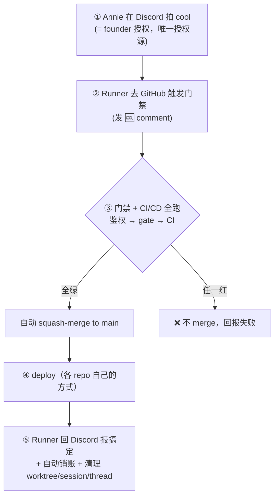

# FLY-1063 GitHub PR 🆒 → 自动 CI/CD ship — 实施计划（PRD，方案 B）

Issue: FLY-1063 (https://linear.app/geoforge3d/issue/FLY-1063/prd-github-pr-comment-自动-cicd-ship系统-全-repo-通用annie-点名-hl-出-prd)
日期: 2026-07-09
基于: exploration.md + research.md + proposal.md（同文件夹）；Annie 2026-07-09 拍板（经 HL brief d0e35e21）

---

## 0. Annie 拍板结论（本 PRD 的前提，不再重开）

| # | 问题 | Annie 的决定 |
|---|------|--------------|
| Q1 | source of truth | **方案 B**：**Discord = 授权源**（她说 cool 就是 founder 授权），**GitHub = 执行 + 门禁**，不是竞争授权 |
| Q2 | 身份分离（bot vs 她本人账号） | **暂不做**，先用她的 GitHub 账号。**列 follow-up，并注明：产品化给外部用户时是前置**（理由见 §7） |
| Q3 | 第一批 repo | **FlyView + GeoForge3D**（「Flavio」= FlyView） |
| — | 关键设计意见 | **所有 repo 用同一个 flow，变的只是 gate 的重量** |
| — | 记账 | **「记账」是流程里的一等步骤**，🆒 flow 最后一步自动销账 |

写死一句话：**Discord 授权，GitHub 执行。**

> **⚠️ 一处需 HL/Annie 确认的命名**：`xrliAnnie/flyview` 这个 repo **不存在**（实测 404）。而项目记忆里记着 **FlyView = Flywheel 的别名**（Annie 对本产品的叫法）。因此本 PRD 按 **「FlyView 即 flywheel 本仓」** 理解，第一批 = **flywheel + GeoForge3D**（两者实测都存在：`xrliAnnie/flywheel`、`xrliAnnie/GeoForge3D`）。这也与「Flywheel-first」一致。**若 FlyView 实为另一个尚未创建的 repo，请纠正，rollout 章节需改。**

---

## 1. 目标 / 非目标

**目标**
1. 把「Discord 授权 → GitHub 执行」这条链**从提示词契约变成机械保证**。
2. 所有 repo 走**同一个 🆒 flow**，形状恒定、gate 重量可变。
3. 🆒 flow 收尾**自动销账**，让三本账（Linear / Bridge session / GitHub PR）不再各说各话。

**非目标**
- ❌ 不做身份分离（Q2，follow-up）。
- ❌ 不设计门禁（Prow）/ CI / deploy 的**内部实现** —— 那是 eng 交付（§6），本 PRD 只在流程层引用「有个门禁 + CI/CD + deploy」。
- ❌ 不做「GitHub 亲发 🆒 作审批」（方案 A 已被否，相关分析留档 research §C 供 follow-up）。

---

## 2. 核心流程（Annie 亲述的 5 步）



关键读法：**②③ 只是执行与门禁**。授权在 ① 就发生了，且只在那里发生。GitHub 侧**永不产生授权**，只负责「核验授权是否存在」并执行。

---

## 3. 恒定形状 + 可变 gate 重量（Annie 的核心设计意见）

**形状恒定**（每个 repo 都一样）：

```
🆒  →  鉴权  →  gate / CI  →  merge  →  记账
```

**变的只是「gate」这一格的重量**：

| gate 档 | 适用 repo | gate 内容 |
|---------|-----------|-----------|
| 重 | 代码 repo（flywheel、GeoForge3D） | 门禁（Prow 类）+ 全套 CI：build / typecheck / lint / test |
| 中 | 配置 / skill repo（flywheel-skills） | lint + contract fixture + blocklist |
| 轻 | 纯文字 / 视频 / 内容 repo | 极轻，甚至只有格式检查 |
| 空 | 纯素材 repo | 无 gate —— **但照样走 🆒 flow**，等于「🆒 → 鉴权 → merge → 记账」 |

**这正好落在 reusable workflow 上**：

- 中央一份 `workflow_call` 核心 workflow，封装恒定形状里的 **🆒 → 鉴权 → merge → 记账**；
- 每个 repo 一个**瘦 caller**，把自己的 gate 作为一个 job 注入；**轻 repo 就声明一个空 gate**。

**机制可行性（已核实）**：本仓是**个人账号下的 private repo**（非 org），但 GitHub 自 2022-12 起 GA 支持**私有仓跨 repo 复用 reusable workflow**，只需在中央 repo 的 Settings → Actions → General → Access 选 *"Accessible from repositories owned by `<user>`"*。所以「中央一份 + 瘦 caller」在我们这个非-org 形态下**成立**。
（代价：个人账号**没有** org 级 `.github` 模板仓、**没有** org audit log。）

---

## 4. ⚠️ 核心 eng 硬要求：GitHub 侧必须去核账本

> 这是本 PRD 最重要的一条。**不做这条，方案 B 的「Discord 才拍板」就是假的。**

### 4.1 现状漏洞（实测，非推测）

今天 `ship-on-comment.yml` 的授权闸**只检查 commenter 有没有 write 权限**（`ship-on-comment.yml:34-54`）。它**从不查任何审批账本** —— 不读 CommDB、不读 StateStore、不调 verify-approval、不经 Bridge。

→ **任何有写权限的人 / 进程，在 PR 上打一个 🆒，就直接 ship 了。Annie 在 Discord 根本没批过。**

### 4.2 威胁模型（落到本仓真实情况）

实测：`xrliAnnie/flywheel` 的 collaborator **只有 `xrliAnnie` 一人**（admin）。所以「任何有写权限的人」在今天**不是外部第三方**，而是：

> **这台 Mac 上任何持有她 gh token 的 agent / 进程** —— 每个 Runner、每个 Lead、任何被 prompt 注入或跑飞的 agent、任何残留进程。

它们**今天**能做的：跳过 `verify-approval`，直接 `gh pr comment --body ":cool:"` → 合并进 main。拦住它们的**只有提示词契约**（`Blueprint.ts:1474-1481`），没有任何机械闸。这正是 Annie 要的「Discord 拍板」被架空的路径。

### 4.3 附带发现：**根本没有 branch protection**

`Blueprint.ts:1481` 写着「the project's own CI/CD + **branch protection** is the hard merge boundary」。实测这句话**不成立**：

```
gh api repos/xrliAnnie/flywheel/branches/main/protection
→ 403 "Upgrade to GitHub Pro or make this repository public to enable this feature."
```

**private repo + GitHub Free ⇒ branch protection 这个功能根本不可用。** main 上没有任何保护，也**无法**配置「required status check」。（FLY-350 M-2 当时的结论是「admin 能绕过」；真相比那更弱 —— 闸门压根不存在。）

这条直接影响 §4.4 的机制选型：**不能依赖「branch protection 要求某个 check 通过」来落地闸门**。

### 4.4 硬要求陈述

> **REQ-1（必须）**：🆒 flow 在 merge 之前，**必须独立核验「这个 PR head 存在一条 founder 批准的 gate 记录」**，复用现有 `verify-approval` 的那套判定（founder-attributed 的 `approved:true` + **绑定当前 head sha** + Codex review 硬闸）。
>
> **不得**仅以「commenter 有 collaborator 写权限」作为放行依据。
>
> **REQ-2（必须）**：核验失败 ⇒ **不 merge**，并在 PR 上留下可见的失败原因。静默放行 = 违规。

### 4.5 机制候选与推荐（实现细节归 eng，此处给方向与理由）

难点：**账本在 Annie 的 Mac 上（Bridge / CommDB / StateStore 都是 localhost）；而 GitHub Actions 跑在云端 `ubuntu-latest`，够不着。**

| # | 机制 | 评价 |
|---|------|------|
| **M1** | **在 self-hosted runner（Annie 的 Mac）上加一个 gating job**，直接跑 `verify-approval --pr-head <sha>`；merge job `needs:` 它 | ✅ **推荐**。账本就在本地，复用**生产同一个** verify-approval 原语（HL 原话「复用 verify-approval 那套」），保真度最高。GEO-175 早已规划过 self-hosted runner |
| M2 | Bridge 在 verify-approval 通过后，往该 head 写一条 check-run，workflow 断言其 `app.id` | 需要 GitHub App 才能做**结构性**归属断言 —— 而 App 属于 Q2 已推迟的身份分离。且无 branch protection，无法「required check」 |
| M3 | Runner 在 🆒 里带一个 HMAC 签名的一次性 ship token，workflow 用 repo secret 验签 | 引入共享密钥 + 重放/nonce 管理；且在无 branch protection 的仓里，能改 main 的 agent 也能捞到密钥 → 并未真正收口 |
| M4 | Bridge 暴露公网 verify 端点给 workflow 调 | 引入入站攻击面。不推荐 |

**推荐 M1**，并且它有一个**关键的安全性质（已查证）**：

> `issue_comment` 事件触发的 workflow，**永远使用默认分支（main）上的那份 workflow 文件**，PR 分支**改不动**它。

所以「gating job」这道闸**无法被 PR 分支上的改动绕过**。这让 M1 在**当前无 branch protection** 的现实下依然可信。

**M1 的已知边界（必须诚实写出，交 eng 权衡）**：
- 依赖 Annie 的 Mac 在线；Mac 离线 ⇒ ship 停摆（可接受：Runner 本来就跑在这台机器上）。
- 只适用于**账本在这台机器上**的 repo（flywheel、GeoForge3D 都是）。对没有 Bridge 账本的 repo（如纯内容 repo），该 gating job 应**按 gate 档位省略**（对应 §3 的「空 gate」）—— 但那类 repo 也就不存在「Discord 授权」这条链，形状仍一致。
- 能直接 `git push` 到 main 的 agent 仍可绕过整条 flow（因为**没有 branch protection**）。→ 见 REQ-3。

> **REQ-3（应做）**：把 `xrliAnnie/flywheel`（及 GeoForge3D）升级到可用 branch protection 的方案（GitHub Pro），或将 repo 转为 org。否则 main 永远敞着，任何机械闸都只是「正门上锁、后门大开」。
> 这条独立于 🆒 flow，但**不做它，REQ-1 的价值会被绕过**。成本很低，建议一并交 eng 评估。

---

## 5. 「记账」作一等步骤（Annie 亲口列进流程）

### 5.1 要解决的病

三本账各说各话（Annie 今晚的质疑）：

- **Linear**：活干完了，issue 还挂在 Backlog；
- **Bridge**：一堆 session 状态还显示「在跑」，其实早死了；
- **GitHub**：PR 合了，但相关状态仍是 dormant。

### 5.2 要求

> **REQ-4（必须）**：🆒 flow 的**最后一步**自动销账，把该 issue 的三本账推到一致的终态：
> 1. **Linear** issue → Done；
> 2. **Bridge** session → 终态 + landing 状态写实（`merged` + merge commit sha）；
> 3. **GitHub** PR → merged、分支删除、thread/worktree/session 清理（Annie 的第 ⑤ 步）。
>
> **REQ-5（必须）**：销账必须**幂等**（重跑不产生第二次副作用）且**失败可见**（销账失败要留痕/告警，不得静默吞掉 —— 静默吞就是这个病的成因）。

### 5.3 与现有机制的接点

现有 FLY-369 cascade（landing signal → `stage set completed` → 自动清理 + thread 归档 + Linear Done）已经是这件事的雏形，但**它挂在 Runner 自 ship 这条路上**。本 PRD 要求把销账做成 **🆒 flow 自身的一步**，这样无论谁触发的 🆒、Runner 是否还活着，账都能销掉。

---

## 6. 归属：哪些是 eng 交付（→ Tadashi）

本 PRD **只到流程层**。以下**技术实现**为 eng 交付，打 `Flywheel` label 路由到工程：

- 门禁（Annie 以 **Prow** 作类比；是否真的引入 Prow、还是用现有 GitHub Actions 组合，**选型归 eng**）；
- CI/CD 的具体 job 编排；
- 各 repo 的 deploy 腿（flywheel 走本机 self-ship launchd 更新器；GeoForge3D 走它自己的部署）；
- §4.5 的机制落地（M1 self-hosted gating job 的具体实现）；
- §5 销账的具体实现与幂等保证。

---

## 7. Follow-up：身份分离（产品化给外部用户时的**前置**）

Annie 决定**现在不做**，先用她自己的 GitHub 账号。但必须列为 follow-up，且写明**产品化对外时这是前置**。理由（Annie 给的四条）：

1. **不能让 bot 用客户本人的账号发言**；
2. **审计要分清「谁拍板」vs「谁执行」**；
3. **bot 应当最小权限，不该是 ADMIN**；
4. **bot 发疯时，炸的范围要有界。**

现成底稿见 **research.md §C**（四维取舍 + 实测证据），结论摘要：

- **GitHub App** 提供**结构性判别式** `user.type == "Bot"`（本仓 `linear[bot]` 实测证实），是硬判别；
- **专用 bot 机器账号**只能靠 **login 白名单**（软判别），但安装便宜（个人账号 Free 版私有仓 collaborator 无限、$0）；
- 两条路都绕不开一条机制约束：**workflow 自带的 `GITHUB_TOKEN` 发的 comment 不会再触发 workflow**（官方防递归），所以机械 🆒 必须来自 PAT 或 App installation token。

> 现状实测：**100% 的真实 ship run，actor 都是 `xrliAnnie` / `type=User`** —— 「谁拍板」与「谁执行」在 GitHub 上**零区分度**。这正是理由 ② 的实证。

---

## 8. Rollout（Flywheel-first）

| 阶段 | repo | 说明 |
|------|------|------|
| P0 | **flywheel**（= FlyView，待确认命名） | 先跑通：M1 gating job + 销账 + 瘦 caller |
| P1 | **GeoForge3D** | 第二个代码 repo，验证 gate 重量可变 + deploy 腿 per-repo |
| P2+ | 其余 repo（flywheel-skills / 内容 repo…） | 验证「轻 gate / 空 gate」档，形状不变 |

不强求一步到位做成 generic 模板；**先在 flywheel 落地，形状对了再抽 reusable workflow**。

---

## 9. 风险与 open questions

| # | 项 | 状态 |
|---|----|------|
| R1 | **FlyView 是否就是 flywheel 本仓**（`xrliAnnie/flyview` 实测 404；记忆记着 FlyView=Flywheel 别名） | **待 HL/Annie 确认** |
| R2 | 无 branch protection（Free plan 限制），main 敞着 | REQ-3，建议一并解决 |
| R3 | M1 依赖 Mac 在线 | 可接受（Runner 本就在这台机器） |
| R4 | 「门禁」是否真的引入 Prow | 选型归 eng |
| R5 | REQ-1 落地后，**现有 Runner 的 `:cool:` 路径必须同步**（它今天不带任何可核验凭据，只靠先跑 verify-approval 的契约） | eng 拆单时一并处理 |

---

## 10. eng 拆单建议（交 Tadashi，打 `Flywheel` label）

1. **[P0] 🆒 flow 去核账本（REQ-1/REQ-2）** —— self-hosted gating job 跑 `verify-approval --pr-head`，merge job `needs:` 它；失败在 PR 留言。
2. **[P0] 销账做成 🆒 flow 一等步骤（REQ-4/REQ-5）** —— Linear / Bridge landing / GitHub 三本账推终态，幂等 + 失败可见。
3. **[P1] branch protection（REQ-3）** —— 升 GitHub Pro 或转 org，给 main 上锁。
4. **[P1] 抽 reusable workflow + 瘦 caller** —— 恒定形状集中一份，gate 作为可注入 job；轻 repo 声明空 gate。
5. **[P1] GeoForge3D 接入** —— 验证 gate 重量可变 + per-repo deploy 腿。
6. **[follow-up] 身份分离** —— 产品化对外前的前置（§7）。

---

## 附：本 PRD 引用的实测/查证清单

| 断言 | 来源 |
|------|------|
| 只检查 write-collaborator，不查账本 | `.github/workflows/ship-on-comment.yml:34-54` |
| Runner 发 🆒 且 :cool: 是唯一 merge 路径 | `packages/edge-worker/src/Blueprint.ts:1479, :1481` |
| verify-approval 的 8 道 fail-closed 判定（含 head-sha 绑定、Codex 硬闸） | `packages/flywheel-comm/src/commands/verify-approval.ts` |
| 唯一 collaborator = xrliAnnie(admin) | `gh api repos/xrliAnnie/flywheel/collaborators` |
| **无 branch protection**（Free plan 403） | `gh api repos/xrliAnnie/flywheel/branches/main/protection` |
| 100% 真实 ship run actor = xrliAnnie / type=User | `gh api .../actions/workflows/254044724/runs` |
| GitHub App comment 结构性可辨（`linear[bot]`, `type=Bot`） | `gh api repos/xrliAnnie/flywheel/issues/524/comments` |
| `xrliAnnie/flyview` 不存在；GeoForge3D / flywheel-skills 存在 | `gh api repos/xrliAnnie/<name>` |
| `issue_comment` workflow 恒用默认分支的文件，PR 分支改不动 | https://docs.github.com/en/actions/reference/workflows-and-actions/events-that-trigger-workflows |
| `GITHUB_TOKEN` 发的事件不触发新 workflow（PAT / App token 会） | https://docs.github.com/en/actions/how-tos/write-workflows/choose-when-workflows-run/trigger-a-workflow |
| 私有仓 reusable workflow 跨 repo 复用 GA + Access 设置 | https://github.blog/changelog/2022-12-13-github-actions-sharing-actions-and-reusable-workflows-from-private-repositories-is-now-ga/ |
| 个人账号 Free 版私有仓 collaborator 无限 | https://docs.github.com/get-started/learning-about-github/githubs-products |
