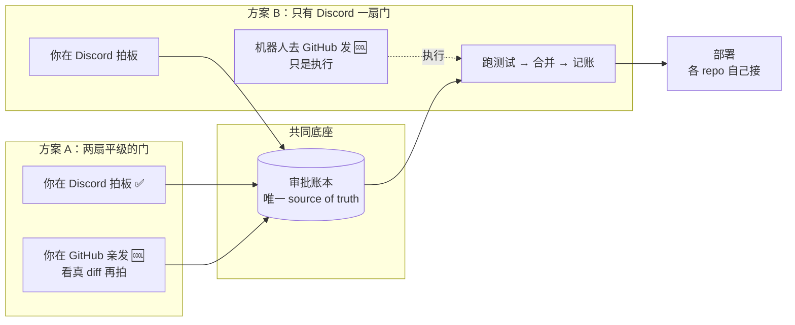

# FLY-1063 GitHub PR 🆒 → 自动 ship — 给 Annie 的 co-eval 提案

Issue: FLY-1063 (https://linear.app/geoforge3d/issue/FLY-1063/prd-github-pr-comment-自动-cicd-ship系统-全-repo-通用annie-点名-hl-出-prd)
日期: 2026-07-09
基于: exploration.md + research.md（同文件夹）

> 这不是最终 PRD，是**一份让你拍方向的提案**。核心只有一个问题要你拍：**在 GitHub 上你亲自发的 🆒，算不算一次正式审批？** 其余（怎么装到每个 repo、部署怎么接）都已经基本想清，作推荐给你确认。拍完这个方向，我们才拆成开发任务、写实现细节。

---

## 一、先说一个可能出乎意料的现状

你说「想在 GitHub 也做 🆒」——其实 **flywheel 上已经有一个 🆒 了**：在 PR 里发 🆒，就会自动跑测试、通过后合并。

但它今天的真实样子是这样的：

- **真正拍板发生在 Discord**（你在 thread 里说 ship 或点 ✅）；
- GitHub 上那条 🆒，是**机器人在你 Discord 拍板之后、替你补按的一个执行按钮**；
- **你本人根本没碰 GitHub。**

所以你说的「Discord 和 GitHub 不等价」——**你完全说对了**。今天的 GitHub 🆒 不是一个「你看着代码拍板的地方」，只是一个「机器人替你按的开关」。

你真正想要的，我理解是：**你能亲自到 GitHub 上，看着真实的代码改动，自己发一个 🆒，它就 ship。** 让 GitHub 变成一个你**亲自审批**的入口，而不只是机器人镜像 Discord 决定的地方。

**所以这件事不是「从零造 🆒」，而是把 GitHub 从「机器人的执行按钮」升级成「你亲自的审批面」，并且让每个 repo 都有。**

---

## 二、要你拍的那一个问题：GitHub 的 🆒 算不算你的审批？

你的话里其实有两种可能的意思，我把两个都摆出来，你挑一个（或告诉我都不是）。两个方案有一个**共同底座**：无论选哪个，「审批账本」永远只有一本，不会出现 Discord 说批了、GitHub 没记这种账目对不上的情况。区别只在下面这一点。

### 🅰 方案 A —— 你在 GitHub 发的 🆒 = 一次正式审批（我推荐，也更像你最早说的）

- 你亲自到 GitHub PR，看真实的 diff、文件、测试状态，**自己发一个 🆒**；
- 系统认得出「这是 Annie 本人拍的」，把它当作一次**正式审批**记进账本，然后自动跑完合并 + 部署；
- 结果：**GitHub 和 Discord 是同一个决定的两扇门**，你在哪扇门拍都算数、都记账、都一样安全。想在手机上用 Discord 就 Discord，想看代码就去 GitHub。

**为什么我推荐 A**：这才真正回应你说的「不等价」——只有把 GitHub 做成你能亲自拍板的一等入口，两个入口才真正等价可选；也最贴你最早、最具体的诉求（「我想亲自在 GitHub 看真 diff 再拍」）。

### 🅱 方案 B —— GitHub 的 🆒 只是执行按钮，Discord 才是拍板的地方

- 保持今天的样子：你在 **Discord** 拍板 → 机器人去 GitHub 发 🆒 → 合并；
- GitHub 的 🆒 不代表你的授权，只是执行；
- 「全 repo 通用」在这版里 = 把「跑测试 + 合并 + 记账」这套标准化到每个 repo，但**拍板永远只在 Discord**。

**B 的代价**：你还是不能「亲自在 GitHub 上拍板」，那个「不等价」的痛点没被解决。B 更像是把现状铺开，而不是给你新的入口。

> 👉 **要你拍的**：A 还是 B？（我推荐 A。如果你其实是想让 GitHub 直接**取代** Discord 成为主审批面——不是「并列两扇门」而是「以后主要在 GitHub」——也告诉我，那会再改一版骨架。）

---

## 三、方案 A 有一个必须先解决的前提（不解决就做不了）

如果选 A，有一个**前提条件**必须先办，否则整套不成立：

**今天在 GitHub 上，机器人和你本人用的是同一个账号（都叫 `xrliAnnie`）。**

后果：系统看到「一条 🆒 来自 xrliAnnie」，**分不清**这是：

- 你**亲自**看完代码按的（= 真审批），还是
- 机器人**机械**补发的（= 只是执行）。

方案 A 的整个安全性，就建立在「能可靠认出这是你本人拍的」上面。所以前提是：**把机器人发按钮用的身份，和你本人审批用的身份分开**——给机器人一个专用的「机器人账号」去发那些机械 🆒，让 `xrliAnnie` 重新变成「只有 Annie 本人」的身份。这样系统一看是谁发的，就分得清「人拍的」还是「机器按的」。

（方案 B 不强依赖这个前提，因为 GitHub 🆒 本来就不代表你的授权。）

> 这条 Honey Lemon 已经同意，作为方案 A 的前置写进来。具体用「新建一个机器人账号」还是「GitHub App」，是落地细节，等你拍完 A 再定。

---

## 四、这两点已经基本想清，给你确认（不用纠结细节）

### 4.1 怎么让「每个 repo 都有」？→ 一份中央模板 + 每个 repo 挂一个瘦接口

- **中央放一份**「🆒 → 认人 → 跑测试 → 合并 → 记账」的标准流程；
- **每个 repo 只挂一个几行的小接口**指向它，再接上自己的部署方式；
- 好处：以后要改，只改中央那一份，所有 repo 一起升级；每个 repo 自己的部署互不干扰。
- （对比：也可以做成一个装在 org 上的大服务，或把整份文件拷到每个 repo——但前者太重、后者容易 N 份走样，都不如这个方案。）

### 4.2 部署怎么接？→ 合并和部署是分开的两条腿

- **合并**（🆒 → 测试 → 合到 main）是通用的、每个 repo 一样；
- **部署**每个 repo 不一样（flywheel 是本机自更新重启；GeoForge3D 是 Vercel；flywheel-skills 是自己的同步…）；
- 所以**通用的只做到「🆒 → 认人 → 测试 → 合并 → 记账」**，部署由每个 repo 自己接上自己的方式。这也正好是上面「中央模板 + 瘦接口」的天然好处。

---

## 五、落地节奏（Flywheel 先行）

1. 先在 **flywheel** 一个 repo 上把方案（A 或 B）跑通、验证顺手；
2. 再谈铺到其它 repo；第一批具体铺哪些 repo，**等你确认清单**（HL 记得有一个 repo 的归属还要跟你确认）。

---

## 六、需要你回的（越少越好）

1. **主问题**：方案 A 还是 B？（我推荐 A）
2. 如果 A：接受「给机器人一个单独身份、把 xrliAnnie 还给你本人」这个前提吗？
3. 第一批要装 🆒 的 repo，除了 flywheel 还有哪些？

拍完 1（和 2），我就把它落成正式 PRD 并拆开发任务。其余细节我们边做边对，不用你操心。

---

### 附：一图看懂两个方案

