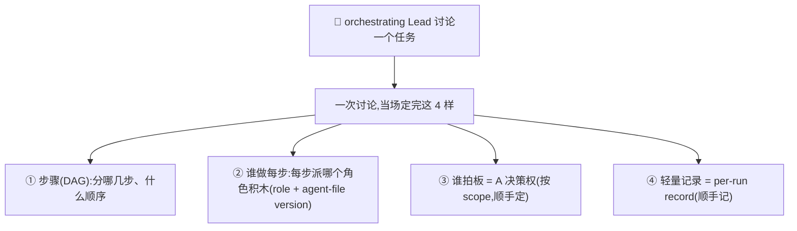
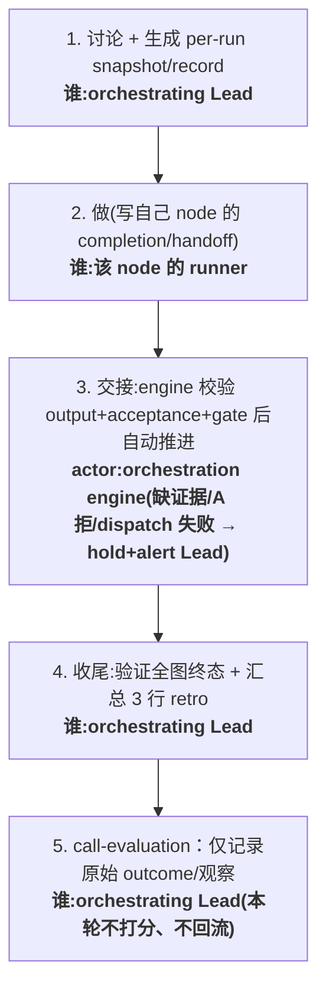
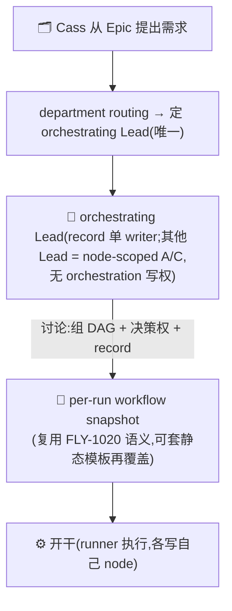
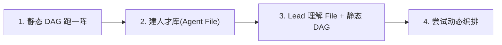

# FLY-1140 动态 DAG 协作编排(operating model)— PRD

Issue: FLY-1140 (https://linear.app/geoforge3d/issue/FLY-1140/动态-dag-协作编排operating-model-roles-as-ics-静态动态进化-双维评估)
日期: 2026-07-10
基于: co-eval-r3.html(第 3 轮核心化简,Annie 圈全绿)

> 本 PRD 是 vision / operating-model 层的设计,不是某个模块的详细实现规格。产出后走 Codex design review(内部质量门),经 Annie 确认后由工程(Tadashi)拆成 build issue。
> Round 1 Codex design review 已把「现状基线、per-run 契约、编排归属唯一性、record/eval 权威、依赖映射、阶梯毕业条件」六处收敛进本稿。

---

## 1. 背景与问题

**现状(准确基线):**
- Flywheel 对**符合条件的 engineering `main` dispatch** 启用一条**硬编码的 `Design → Implement → QA` phase chain**(three-stage)。它是 **project opt-in / 默认 OFF**,仅 fresh `main` dispatch 可进入,受全局 kill-switch、`no-three-stage` label、channel allowlist 约束(本项目当前只对 `#flywheel-engineer` 开)。其他 role / opt-out 的任务仍走**单 session**。
- 现状**已经有一条固定的回退**:`PhaseOrchestrator` 里有有界的 `QA FAIL → Implement → QA` fix loop。所以「完全不能回退」并不成立。

**真正的 gap:** 现状没有一个通用机制,能**按任务选择任意 role、任意长度、任意顺序与 handoff**,并把这次「怎么配合」物化成一次可执行、可恢复、可审计的 workflow。固定的三段链 + 固定的 QA fix loop ≠ 「按任务现组一张图」。

**目标:** 从「几条写死的链」进化到「一堆职能积木(role markdown = IC 职能)+ 一张按任务现组、可物化执行的图」。哪些积木、什么顺序、允许怎样回退,由**一次讨论**当场定。

---

## 2. 目标 / 非目标

**目标(本 PRD 范围):**
1. 定义**核心编排机制**:Lead 讨论一个任务、当场组一张 DAG,并给出它的**最小 operating contract**(§3)。
2. 定义**决策权**如何按任务、按决策 scope 确定(§4),以及**编排归属的唯一性**(§6)。
3. 定义**轻量记录 + 复盘 + call-evaluation**的权威、owner 与本轮边界(§5)。
4. 给出**进化阶梯 + 每级毕业条件**(§7)。

**非目标 / 押后(不在本 PRD 展开,见 §8):**
- C(卡壳 swarm)、D(成本感知派活)—— 押后。
- E(好组合固化成静态模板)+ 两维评估**打分与选择规则**(个人 role-version + 组合成功率)—— 明确**下一轮单独补**。本轮 call-evaluation **只记录原始 outcome,不打分、不影响下次派活**(见 §5),以免 in-scope 流程提前依赖尚未定义的评估。
- Annie 另欠一个**宏观综合 round**(单独一层,不在本 PRD)。
- **拓扑上的**:parallel fan-out / fan-in、跑中任意插节点继续、**任意新 loop 类型 / 自由条件表达式** —— v1 明确 deferred(§3)。(v1 **仍保留** allowlisted、预声明、带 `max_iterations` 的**有界回退边**,以兼容现有 QA fix loop —— 见 §3.1。)

---

## 3. 核心机制:一次讨论,当场组 DAG(+ 最小 operating contract)

**只有一个核心机制:「Lead 讨论一个任务、当场组一张 DAG」。** 一次讨论,顺手把下面 4 样一起定完 —— 它们不是 4 个独立仪式:



**关键澄清(消除 r2 的重叠错觉):③ 决策权 和 ④ 记录,是 ① 那次讨论的两个「产出面」,不是另外要做的两件事。**

### 3.1 最小 operating contract(vision 层 invariant,不写低层 schema)

为了让「讨论」能安全物化、且不被工程理解成一个新的并发/合流引擎:

- **拓扑边界(v1):** 只支持**可变长度的顺序 workflow + allowlisted / 预声明 / 带 `max_iterations` 的有界回退边**(**至少保留 FLY-1020 的 `qa_fail` / `founder_feedback_kickback` 语义**,以维持 L1 的 three-stage byte compatibility 与现有 QA fix loop)。**任意新 loop 类型、自由条件表达式、parallel fan-out/fan-in、跑中任意插节点继续 —— deferred**。
- **产出 snapshot:** 讨论结束必须产出一个 **per-run workflow snapshot**,**复用 FLY-1020 的 node / edge / role-version / output 语义**(见 §10)。可从静态模板起步再覆盖,也可在允许的 roster 内组合,但**绝不修改 canonical 静态模板**。
- **node 完整性:** 每个 node 至少有 `role + agent-file version`、前置依赖、预期产出 / 验收、handoff、D(推进)与 A(拍板);缺任一项**不 dispatch**。
- **跑中改图:** 由**同一个 orchestrating Lead** 发起,形成新 **revision / generation**;必须明确「已完成输出是否保留 / 哪些 downstream 结果失效 / 当前 runner 是 park·finish·terminate」,且**旧事件不得推进新 revision**。
- **fail closed:** 无法形成有效 snapshot 或修订失败时,**回退到静态模板 / 人工接管**,不「猜着跑」(**静态 fallback 的启动条件严格遵守 §5.2 safe-fallback 规则,不自动发生**)。

---

## 4. 决策权:按任务、按 scope 现定,PM 非必选

「谁做 + 谁拍板」不是固定班子,是讨论时按**这个任务**定。没有「标准班子」,**PM 不是必选项**:

| 任务类型 | 组合(现挑积木) | 说明 |
|---|---|---|
| 🐛 简单 bug | Eng + QA(**无 PM**) | Eng 直接干、QA 验 |
| 📄 一份 doc | PM 自己 | 一个人,不用拉别人 |
| 🧩 完整 feature | PM + Designer + Eng + QA | 全套上 |

> **注:上面三行是示例,不是硬规则 —— 具体谁参与、什么顺序,由 Lead 按任务当场挑。**

决策权用 **DACI** 表达,但**按决策 scope 落到具体 node**,不是全任务一个笼统 A:
- 技术方案 / 节点验收 node → A = 技术 Lead(如 Tadashi)。
- 产品 node → A = 产品 Lead(如 Honey Lemon)。
- **merge / ship 仍遵守现有 founder gate(Annie)**,不因为 node 有 A 就绕开。

这张「卡」是讨论的产出(§3 的 ③),不是单独填的表格。

---

## 5. ⭐ 轻量记录 + 复盘 + call-evaluation

### 5.1 权威与 owner(避免双写 / 恢复歧义)

- **Linear** 继续拥有 **task / issue 状态**(CLAUDE.md:Linear = single source of truth,不变)。
- **per-run record** 拥有 **workflow snapshot / revision、node handoff、复盘**。它是一个**新的、单一权威的 per-run 记录**,**不等于**把现有两种东西并称:`progress.md`(branch 上 committed 的 resume ledger)与 goal / auto-continue 文件(per-execution 的本机 contract)是**不同权威**,本 PRD 不把它们「合并标准化」,而是新定义一个 per-run record 的边界。

### 5.2 流程与每步 owner



- **每个 runner 只写自己 node 的 completion / handoff**(不写全单复盘 —— 多节点 / 返工 / 未来 fan-in 时,最后一个节点只能可靠报告自己的局部结果)。
- **handoff actor(Codex R2):** runner 只提交 node completion / output;**orchestration engine** 校验 output、acceptance 与显式 gate 后**自动推进 / dispatch 下一 node**;缺证据、A 拒绝或 dispatch 失败 → **hold 当前 generation 并 alert orchestrating Lead**(镜像现有 `PhaseOrchestrator` 的 evidence-gated handoff,不让 runner 越权自 spawn、也不让每个 node 变成 Lead 手动 gate)。
- **静态 fallback 不默认自动发生(fail-closed):** 静态 fallback 只有在**本次讨论已预选为 safe fallback**、或 orchestrating Lead 明确确认后才启动;否则 invalid initial snapshot = **不 dispatch**,revision 失败 = **保持最后一个有效 generation / 人工接管**(不自动跳回一个不符本任务意图的静态图、不重跑已完成输出)。
- **orchestrating Lead 在收尾时验证全图终态并汇总 3 行 retro**。
- **call-evaluation 本轮只记录原始 outcome / 观察**,**不打 role-version / 组合分、不影响下次派活**;真正的评分与选择规则留给已声明的**下一轮**(§8)。

### 5.3 真示例

```
# per-run record(第 1 步的产出,顺序 workflow;每 node 齐 §3.1 mandatory fields)
做 X · snapshot: [Eng(实现)] → [QA(验)]
node Eng: role=engineer@v3  dep=none  D=eng-runner  A=Tadashi
          产出/验收=实现+push, CI 绿   handoff=push→QA
node QA : role=qa@v2        dep=Eng   D=qa-runner   A=Tadashi
          产出/验收=测试通过           handoff=报 orchestrating Lead
# node completion(runner 写自己那格)
Eng ✓ pushed abc123, CI 绿 → handoff QA
# retro(第 4 步,orchestrating Lead 汇总全图终态)
终态: 全 node done   卡点: 无   下次改: —
```

---

## 6. 谁编排:Lead 派发 + 每个任务唯一 orchestrating Lead

编排的归属 = **Lead 派发**(部门 Lead:Tadashi + Honey Lemon + 以后新 Lead)。**不是** IC 自认领(IC 是临时资源、有任务才上),**不是** Annie 亲自派(她只管两端)。

**唯一性(Codex R1/R2 收敛):每个 task 恰有一个 orchestrating Lead** —— 它是该 task 的 **DAG / record / revision / closure 的唯一 owner**,且是 record / revision 的**单一 writer**。这里要分清**两个不同维度**:
- **orchestration 写权**:只有 orchestrating Lead 有,其他 Lead **没有共同写权**。
- **node 决策权(DACI)**:按 node scope,**其他 Lead 也可以是某个 node 的 A 或 C**(如跨部门 feature:Tadashi 作 orchestrating Lead,Honey Lemon 作产品 node 的 A)。orchestrating Lead 负责把 node-A 的决定**写入** record,但**不替 node-A 拍板**。

通常由现有 department routing 决定谁是 orchestrating Lead。冲突或低置信 → 由 orchestrating Lead 升级 Annie,而不是多 Lead 并列悬置。



**留个尾巴:** 「IC 自认领」是进化阶梯**最后一级**(探索层自提)的事,不在本 PRD;现在 = Lead 派发。

---

## 7. 进化阶梯 + 每级毕业条件(基础先行,Annie 已锁定顺序)

四级顺序 Annie 圈定「就按这个走」,**不变**;本轮为每级补一条**可验收 gate**(不是增加第二套机制):



| 级 | 内容 | 毕业 gate(exit criteria) |
|---|---|---|
| **L1** | 静态 DAG 跑一阵(打基础) | FLY-1020 至少跑通 eng / product **两套静态 workflow**,且保留现有 three-stage **byte compatibility** |
| **L2** | 建人才库 / roster(一堆 Agent File) | roster 对每个 role / version / capability **可验证**,不可用 role **fail closed** |
| **L3** | Lead 理解 Agent File + 静态 DAG | Lead 能在 **shadow / manual pilot** 中解释、选择、覆盖模板,并完成 handoff + closure |
| **L4** | 尝试动态编排(§3 核心真正跑起来) | 小范围 **feature flag** 开放 per-run composition / revision,失败可**回退到最后一个有效静态 snapshot**(subject to §5.2 safe-fallback rule) |

- 注:「three-session + 新角色积木」**不等于**新角色已进入静态 DAG —— 目前 PM / Prototype / Designer 主要是**可派发 role**,L1 的 gate 才是它们真正进入静态 workflow。
- 阶梯的**执行底座依赖 = FLY-1020**(见 §10);没有它,L3/L4 无法把讨论结果安全执行。

---

## 8. 押后 / 下一轮补

| 项 | 内容 | 状态 |
|---|---|---|
| C | 卡壳围上来(swarm),带 token 预算 + 超时 + 可 A/B test | 押后 |
| D | 成本感知派活(AI 的 IC 没「忙」但有「贵/便宜」,同水平选便宜模型) | 押后 |
| E | 好组合固化成静态模板(动态发现 → 固化复用,复用 FLY-1020 模板库) | 下一轮展开 |
| 两维评估**打分与选择** | 个人(role-version 打分)+ 组合(DAG 组合成功率);打分规则、回流派活 | 下一轮展开(本轮 call-eval 只记 outcome) |

**⚠️ 评估的真难题(下一轮细想):** 「组合成功率」有个坑 —— **延迟失败很难追溯到是哪个 feature / 哪套组合的锅**(问题过很久才暴露),需要一套轻量溯源。不在本 PRD 硬铺。

**⚠️ 另欠:** Annie 还欠一个**宏观综合 round**(单独一层)。

---

## 9. 拼图现状(按可验证阶段标注)

状态区分 `runtime shipped / PRD merged-build pending / planned / vision`,不用模糊的「在飞」:

| 拼图块 | 对应 issue | 状态(可验证) |
|---|---|---|
| IC 角色(积木)role 实现 | Prototype+PM(FLY-1089/#536)· Designer(FLY-1059/#527) | **runtime shipped**(role impl merged) |
| 架构/工程/QA 静态链 | 现 three-stage(Design→Implement→QA) | **runtime shipped**(opt-in) |
| per-run workflow substrate(L1) | FLY-1020(#514) | **PRD merged / build pending**(引擎未 ship) |
| issue-level chooser/dispatcher(L2 治理) | FLY-353(#511) | **PRD merged / build pending**;是 **runtime upstream dispatcher / L1 contract consumer**,非本 PRD 引擎 |
| 人才库 / roster | FLY-1141 | **planned / Linear-only(需确认)** |
| goals.md + stand-up/RFC pilots | FLY-1045 | **PRD approved + merged(PR #519,on main;本 branch HEAD 未 rebase 故未含)/ build pending**;是**相关公司运营上下文**,非本阶梯 owner |
| PM 验收 gate | FLY-830 | **vision** |

---

## 10. 依赖映射与 owner

**依赖映射(Codex R1 收敛,防止拆错 build):**
- `FLY-1020 = per-run workflow substrate`(**hard dependency**,Layer 1:一个 issue 内部怎么跑 / node / snapshot / handoff / skip / 有界 loop)。
- `FLY-1140(本 PRD)= Lead discussion → per-run composition / revision policy`(消费并演进 FLY-1020 的 seam)。
- `FLY-353 = issue-level chooser / dispatcher`(Layer 2:做哪些 issue、派给谁、何时;**消费** FLY-1140/1020 的结果,**不建**第一层模板,故**非本 PRD 的「编排引擎」**)。
- `FLY-1045 = 相关公司运营上下文`(其当前 PRD 范围 = goals.md + stand-up/RFC pilots,并把派活/自发发现 defer 到 FLY-1140;**非本阶梯 owner**)。
- `FLY-1141 / FLY-830` 按可验证阶段标(planned / vision)。

**Owner:**
- **Vision / PRD 设计** = 产品(Honey Lemon,co-eval with Annie)。
- **编排引擎 / eval build** = 工程(Tadashi),主要落在 **FLY-1020 演进 seam**。

---

## 11. 开放问题

1. **延迟失败的溯源**(§8):组合成功率如何追溯到具体 feature / 组合 —— 下一轮(E + 评估)细想。
2. **宏观综合 round**(§8):Annie 另欠的单独一层。
3. **Lead 讨论的粒度**:一个任务一次讨论,粒度到 issue 还是更细?—— 落地时定。
4. **静态模板与动态的边界**(E,下一轮):什么样的组合「好到」值得固化成静态模板、谁来决定。
5. **orchestrating Lead 的 routing 规则**:department routing 如何唯一确定某 task 的 orchestrating Lead(跨部门任务的归属)。

---

## 12. 下一步

1. 本 PRD → Codex design review(内部质量门)→ 按反馈修订(R1 已收敛)。
2. Annie 确认 → 由 Tadashi 拆成 build issue:**主要落在 FLY-1020 演进 seam**(per-run snapshot + 顺序拓扑 + revision + fail-closed),record 约定,阶梯 L1-L2 落地 + 毕业 gate。
3. E(固化模板)+ 两维评估打分 → 单独一轮 co-eval 后补进本线。
