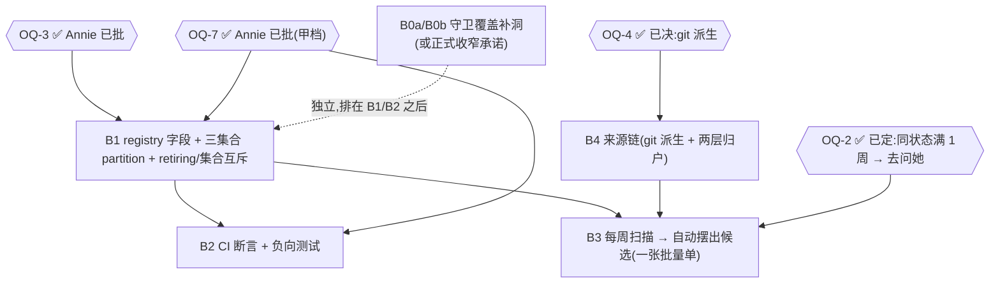

# FLY-1412 开新 flag 必须带退役条件 + 自动建清理单 — 实施计划(拆单交工程)

Issue: FLY-1412 (https://linear.app/geoforge3d/issue/FLY-1412/flag治理治源头-开新-flag-必须同步带退役条件-建清理单-创建时强制不靠人记)
日期: 2026-07-22
基于: prd.md(同文件夹)

**Version**: v23(Annie 08:28 拆分:登记强制留+补严、退役申报砍。B0a/B0b 升为必做主 deliverable)

> **v9 改了什么(相对 v8)**:B3 加**严格的两段式候选 predicate**(否则最自然的 `!spec.longTermKeep` 写法
> 会把 G 里 139 个 `undefined` 的存量 row 一并当成清理候选);A1 写成**可执行合同**
> (本仓 `strict` 开着但没开 `exactOptionalPropertyTypes`,显式 `longTermKeep: undefined` 能过编译);
> 诚实交代 first-parent 集合差**看不见同一 commit 内的同名替换**;统一 `keepReason` 的 trim 语义。
>
> **v8 改了什么(相对 v7)**:A1 从单向升级成**双向状态合同**(v7 的 A1 只管「不在 G 的必须声明」,
> 于是「给 G 里的 row 写上 longTermKeep 却忘了执行 `G → J`」全程绿 —— 已裁决的 row 继续被 N5 当成未裁决债);
> 补两条负向 fixture;把三条残余绕过写成**真实能全绿的 diff 形状**(单独把名字加回 G 其实会红);
> OQ-7 依赖措辞收敛成「只确认是否接受甲」。
>
> **v7 改了什么(相对 v6)**:初始化改成**集合等式 `J0/G0`**(v6 一边要求动态计算、一边把 `G=139/J=9`
> 写死进验收 —— pin→B1 之间只要有一个 adoption 名字退出或新拿 `retiring`,两者就不能同时成立);
> 139/9 降为「今天的 checkpoint」;明写 `retiring` row backfill `longTermKeep:false`;
> 删掉仍残存的 v5 版 OQ-7 选档合同;B2 正向 fixture 同步补字段要求。
>
> **v6 改了什么(相对 v5)**:三集合 + partition 定为**无条件基础合同**(OQ-7 不再决定墓碑存不存在,
> 只决定要不要在它之上叠加跨版本保护),并把**甲定为本单方案**、乙/丙降为未来增强;
> 删掉不可执行的 CODEOWNERS「保护」假设(本仓没有 CODEOWNERS,且 Free plan 私有仓无 branch protection);
> **B0a 不再认领 reverse all-sites**(会误报 4 个合法 helper-consumer readSite)→ 挪进 B0b 并改成 pattern-aware;
> 9 个 `retiring` row 初始化进墓碑(N5 从 139 起);正向验收补「同时补显式 longTermKeep」。
>
> **v5 改了什么(相对 v4)**:把墓碑的 disjointness 升级成**守恒式 partition**
> `ADOPTION_BASELINE = GRANDFATHERED ⊎ ADJUDICATED`(只做 disjoint 挡不住「从工作名单删掉但不进墓碑」);
> 补 pin → B1 之间的一次性初始化规则(复用 first-parent 集合差);统一称「三集合」。
>
> **v4 改了什么(相对 v3)**:补 append-only 裁决墓碑 `LIFECYCLE_ADJUDICATED`
> (静态子集挡不住「已裁决名字被加回」和「复用历史名字」两条真绕过);钉死 ADOPTION_SHA + digest
> 并解决浅 clone 下 provenance 不可执行的问题;B0b 补 config schema 现实约束;OQ-7 保护对象扩到两个集合。
>
> **v3 改了什么(相对 v2)**:把 baseline 拆成**不可变 adoption baseline + 可变工作名单**两个集合
> (v2 合成一个 → 「冻结」与「缩到 0」自相矛盾);补集合级互斥(registry ∩ tombstone = ∅)
> 与 `keepReason` 反向约束;B0 拆成 B0a/B0b(扩目录关不掉语法变体和 project_config);
> B4 补跨波次来源链空窗合同。
>
> **v2 改了什么**:B1 砍掉自动推断(有源码反例);新增 **B0**(守卫覆盖补洞);
> B2 补「新 flag + 同时加豁免仍变红」的负向测试与 baseline 冻结;
> B3 补 per-flag 幂等 / crash-recovery 合同;B4 从「可选」升为 **B3 前置**;
> 修正 v1 「B1+B2 不依赖 open question」的错误说法(OQ-3 就卡在 B1)。

---

## 0. 这份 plan 是什么、不是什么

- **是**:把 prd.md 拆成 Tadashi 照着能建的 build issue。
- **不是** 本单自己的实现计划 —— **本单不改生产代码**。本单 PR 只含本文件夹的文档。

> ⚠️ **2026-07-23 Annie 裁决:砍掉创建时强制**(「flag 不需要必须带退役条件呀」)。
> 机制从「出生强制 + CI 门」改为「**每周扫描问她**」。据此:
> - **§2 B0(守卫补洞)= 保留、且升为必做主 deliverable**(Annie 要补严登记网,不再 optional);
> - **§4 B2 拆开**:「登记 / drift 守卫」那半 = **保留(B2′)**;「必须填 longTermKeep」那半 = 删;
> - **§3 B1 只留「加两个可选字段」**(三集合守恒机制随退役申报一起删);
> - **§6 B3(扫描)= 退役出口主体**;§5 B4 保留。
> **登记强制(B0a/B0b/B2′/B1/B4)不依赖 1150 → ship-now;只有 B3 卡 1150。**
> **以本 banner + PRD v23 骨架为准。**

---

## 1. 总体形状



**✅ 现状(v13)**:OQ-3 / OQ-7 / OQ-2 **Annie 都已拍**,**B1 / B2 / B3 不再有 founder 侧阻塞**。
(历史留痕:v1 曾错写「B1+B2 不依赖任何 open question」——当时确实依赖 OQ-3 / OQ-7,
v2 纠正过;现在是因为**真的拍完了**才无阻塞,不是当初那个错误说法复活。)

---

## 2. B0a / B0b · 登记守卫补洞 —— **主 deliverable · 必做 · ship-now(不依赖 1150)**

> ⭐ **Annie 08:28 明确要留、要补严**(原话「网有洞、只扫了一部分代码、野 flag 能溜过去」)——
> 从 v21 误标的「作废」**恢复,并从「可选」升级为「必做主 deliverable」**。这是本单最先能上、也是她最担心的那件事。

**规模**:B0a 小~中 / B0b 中~大 · **依赖**:无(**不卡 1150**)· **必做,ship-now**

### 2.1 为什么需要它

PRD §1.3 已诚实写明:现有 forward 漂移守卫的覆盖比想象的窄。**实测**:

| 缺口 | 证据 |
|---|---|
| 只扫 4 个目录 | `feature-flags-drift.test.ts:23-28` = `teamlead/src`、`config/src`、`flywheel-comm/src`、`edge-worker/src`;而全仓有 **21** 个 package 带 `src/`(含 `claude-runner`、`voice-bridge` 等 registry 自己已声明 readSite 的地方) |
| 只认几种读法 | 正则只覆盖 `process.env.X`、bracket 形式、参数名恰为 `env` 且带 `=== "0"/"1"/"true"/"false"` 比较的形式;**解构、封装 helper、其它参数名、truthy / parseBool 形式都能绕过** |
| 不查 project_config | 完全不检查未注册的 `project_config` 布尔键 |
| 反向检查太松 | `flag.readSites.some(...)` + 文件 `.includes(envVar)` —— 声明 4 个 readSite,只要**一个**文件含该字符串就通过;**注释里的字符串也算数** |

→ **不补这个洞,「新 flag 100% 被治住」就是过度承诺。**

### 2.2 两条路,选一条(要么补,要么诚实收窄)

⚠️ **v3 修正(Codex R2 MEDIUM 4)**:v2 把「扩目录 + reverse 改 all-sites」当成能关掉全部六类洞 ——
**关不掉**。扩目录治不了语法变体;而 `project_config` 键**根本没有 `FLYWHEEL_*` 这个 token**,
扩 env 正则永远扫不到它。所以 B0 要**拆成两半**,规模分开估:

| 子件 | 做法 | 能关掉的洞 |
|---|---|---|
| **B0a**(小~中) | forward 扫描扩到全部生产 package root + `scripts/*.sh`。**不含 reverse 改造**(见下方 v6 更正) | 目录缺口、shell 缺口 |
| **B0b**(中~大) | 语法变体(解构 / 封装 helper / 参数名非 `env` / truthy / parseBool)靠 **AST 扫描**,不是正则;`project_config` 布尔键靠 **config schema 枚举**,reverse 要区分 env row 的 `envVar` 与 project-config row 的 `configKey`;**外加 pattern-aware reverse 改造**(见下方) | 语法变体、project_config、reverse 太松 |
| **乙 · 收窄** | 两个都不做,但把 PRD / 指标措辞正式限定为「**对写进 registry 的新行强制生命周期**」 | —(靠诚实措辞,不靠代码) |

**倾向:先做 B0a,B0b 单独排期**;**乙是完全可接受的兜底** ——
PRD §1.3 / N4 已经按乙的口径写好了,所以**不做 B0 也不会让文档撒谎**。这正是 B0 标「可选」的原因。

#### ⚠️ B0b 的「config schema 枚举」在当前架构里还不存在(v4 追加)

`packages/config` 的 project config 是 **`types.ts` 的 interface + `ConfigLoader.ts` 的手写校验**,
**不是一份可以直接枚举出全部 key/type 的 declarative schema**。
而且源码里**已经有一批布尔 config 没有 registry row**,例如:
`skills.enabled`、`skills.proofshot.vision_default`、`checkpoints.*.enabled`、
`founder_milestone_report.enabled`、`xiaohongshu_learning.video_opt_in`。

→ B0b 一旦「枚举布尔键并要求命中 registry」,**首次运行就会撞上一批既有项**;
而「哪些是 feature flag、哪些只是普通配置」**不可能由 `boolean` 这个类型自动判断**。

**所以 B0b 交工程前必须先补四件事**(否则「AST + config schema 枚举」只是方向,不是可实施的 build issue):
1. 可枚举的 canonical schema / metadata **从哪来**,还是要先把它建起来;
2. 「feature gate」与「普通布尔配置」的**判定合同**;
3. 既有未注册布尔的 **backfill 或带理由 allowlist**;
4. 那张 allowlist **自己怎么不变成新的创建绕过**(同 §4.2 的教训)。

**B0b 是 optional,不阻塞 B1/B2** —— 但不要在没补这四件事之前把它当成「可以直接开工」。

#### ⚠️ v6 更正:reverse 改成「每个 readSite 文件都必须含该 env」会**误报**

v5 把这条放进 B0a 当作小改动。**实跑当前 `FEATURE_FLAGS` 逐 row 逐 readSite,现状就有 4 个会红**
(我已逐个 grep 复核,这 4 个文件里确实一个 envVar 字面量都没有):

| flag | readSite 文件 | 为什么它是**合法**的 |
|---|---|---|
| `codex_hard_gate_killswitch` | `packages/teamlead/src/bridge/auto-qa-held.ts` | 它调用从 `codex-gate.ts` import 的 `codexHardGateEnabled(env)` |
| `ask_hygiene` | `packages/teamlead/src/bridge/zombie-gate-hygiene.ts` | 调用 / 重导出来自 `packages/flywheel-comm/src/db.ts` 的 `askHygieneEnabled` |
| `ask_hygiene` | `packages/teamlead/src/bridge/gate-poller.ts` | 同上 |
| `ask_hygiene` | `packages/teamlead/src/StateStore.ts` | 同上 |

**envVar 字面量本来就只该出现在 canonical resolver 里** —— 这是好代码,不是漂移。
「每个文件都含该字符串」≠「每个 readSite 有效」。
硬上线只会逼工程**为了变绿而在 consumer 里复制 envVar 字面量或塞注释 sentinel**,
把 catalog 和代码都搞坏。

**所以**:
1. **B0a 只认领「扩目录 + shell」**,不再认领 reverse 改造;
2. reverse 改造挪进 **B0b**,并且必须做成 **pattern-aware 合同**:
   - **直接读**的 readSite:用 AST 证明确有该 envVar 的属性读取(**注释不算**);
   - **helper consumer**:证明它 import / 调用了该 flag 的 canonical resolver ——
     或者给 `FlagReadSite.pattern` 增加一个明确的 **delegated-resolver** 语义;
   - 上面 4 个现存 site 作为 **migration fixture**;
3. B0b 必须补**两条 reverse 负向测试**(v5 完全没有 reverse 负向 fixture,
   意味着 B0a 可能在没证明它 reverse 承诺的情况下被验收):
   - 声明 direct readSite 但文件里没有该 env 的属性读取 → **红**;
   - 声明 delegated site 但没调用 canonical resolver → **红**。

### 2.4 ⭐ 豁免登记机制(Tadashi 硬要求 —— 别漏)

**背景**:有些接缝是**刻意不登记**的(实测:QA 故障注入 / Chrome 窗口回收)。Lead 在 1413 已判「不给它们补登记选项」——
**那个判断不变**。但网一旦补严,这些刻意接缝会**撞网**:要么被迫**假登记**(污染 registry),要么在守卫里留一个**永久暗洞**(silent hole)。两个都错。

**所以 B0a/B0b 必须带一个显式的「豁免登记」机制**:

- **白名单 + 必填理由 + 归属人**:一个 flag 可以合法地【不登记】,但必须在**豁免名单**里显式列出、写明**为什么**、归**谁**。
- **豁免本身在账面上**:git 跟踪、可审计 —— **不是守卫代码里一个静默的 `skip`**。
- **不变量(一句话)**:**「要么登记,要么带理由豁免 —— 没有第三种存在方式。」** 网才完整。

**落地**:
- QA 故障注入 / Chrome 窗口回收 → 进豁免名单(理由 + 归属),**不假登记、也不留暗洞**;
- 与 Lead 1413 判断**一致**:它们仍然不登记,只是走**显式豁免**、而不是靠守卫的盲区。
- **验收 fixture**:①在豁免名单里 + 未登记 → 绿;②**不在**豁免名单 + 未登记 → **红**;③在豁免名单但**缺理由或归属** → **红**。

### 2.3 测试(负向 fixture 是重点)

在下列每处各放一个**未注册的假 gate**,证明 CI **真的变红**
(⚠️ 按 B0a / B0b 分开验收,**不要拿 B0a 去认领 B0b 的三个 fixture**):

| fixture | 归属 |
|---|---|
| **`FLYWHEEL_CHAT_RECEIPTS`**(真实样本:claude-lead.sh:1442,0 registry 命中,现守卫扫不到)→ 补严后必须**红或走豁免** | B0a(shell) |
| `claude-runner` 里的未注册 gate | B0a |
| `voice-bridge` 里的未注册 gate | B0a |
| 一个 shell script 里的未注册 gate | B0a |
| 解构读法(`const { FLYWHEEL_X } = process.env`) | **B0b** |
| 参数名非 `env` 的注入式读取 | **B0b** |
| 未注册的 `project_config` 布尔键 | **B0b** |

---

## 3. B1′ · registry 加两个可选字段(承载状态位)—— **大幅收窄**

**Annie 裁决后 B1 只剩**:给 `FeatureFlagSpec` 加 `longTermKeep?: boolean` + `keepReason?: string` 两个**可选**字段,
由扫描流程在她答「留」时写入;**没有任何创建时强制、没有三集合守恒机制**。
外加 §5.6 的简化互斥(`retiring` 非空时不能同时 `longTermKeep: true`;`retiring` 值须是 `(FLY|GEO)-\d+`)。
**规模:小**(纯加字段)。

> ⛔ **原 B1 的三集合守恒机制(adoption 快照 / grandfather / 墓碑 / digest / partition / `REPLACED_SINCE_PIN`)全部作废** ——
> 它是创建时强制的记账 scaffolding,强制没了它就没用了。以下留痕。

<details><summary>(历史)原 B1 三集合</summary>

**规模**:中 · **依赖**:✅ **无阻塞** —— OQ-3(冻结 cohort)与 OQ-7(甲档)Annie 均已批,可开工

### 3.1 改什么

| 文件 | 改动 |
|---|---|
| `packages/config/src/feature-flags/registry.ts` | `FeatureFlagSpec` 加 `longTermKeep?: boolean` + `keepReason?: string`(**TS 层可选,CI 层必填** —— 见 §3.3) |
| `packages/config/src/feature-flags/lifecycle.ts`(**新建**) | 三张名单(adoption 快照 / 工作名单 / 裁决墓碑)+ `ADOPTION_SHA` 与 digest + 生命周期判定入口 + 单行与集合级互斥校验 + **建议值**生成器 |
| `packages/config/src/feature-flags/index.ts` | 导出新模块 |
| `.github/workflows/ci.yml` | **本单方案(甲)不动**。仅当未来叠加乙档(protected base / live git)时才加一个带 fetch 的轻量 job |

### 3.2 ❌ 不做自动推断(v1 已删除)

v1 想用 `category` + `polarity` 自动判生命周期。**源码里有确凿反例**(PRD §5.2.1 逐条列了):
`watchdog_blocked`(注释写着「Annie 裁定保留且默认开」)、`codex_hard_gate_killswitch` /
`merge_approval_gate_killswitch` / `qa_done_gate_killswitch` / `auto_qa_killswitch`(都是长期安全门)、
`founder_ux_gate_killswitch`(被归类 governance_gate,注释却写它正在 **RETIRE** 一道 gate)。

**类型说的是「这开关是什么、谁能翻」,不是「它该活多久」。**

→ **保留但降级**:`suggestLifecycle(spec)` 只用来生成 **CI 报错文案里的建议值**,
**不能满足 CI 断言,也不能被 B3 的扫描当输入。** 这一点要写进代码注释,防止后人「顺手接上去」。

### 3.3 「必填」怎么落

```
TS 层:  longTermKeep?: boolean          // 可选 —— 否则 148 行现存声明立刻编译不过

CI 层:  【双向状态合同 —— 写成可执行判定,不要只写自然语言】
  name ∈ G:  !Object.hasOwn(spec, "longTermKeep") && !Object.hasOwn(spec, "retiring")
  name ∉ G:  typeof spec.longTermKeep === "boolean"
```

**⚠️ 为什么必须写成 `typeof === "boolean"` 而不是「字段出现」**(v9):
本仓 `tsconfig.base.json` 开了 `strict`,但**没有开 `exactOptionalPropertyTypes`** ——
所以 `{ longTermKeep: undefined }` **能过编译**。
若把「必须出现」实现成 `Object.hasOwn(...)`,一个非-G 的 row 写 `longTermKeep: undefined`
就能满足「字段出现了」,**却根本没回答 founder 要的那个布尔**。
反过来,G 那半句的「不得出现」**必须真按 property absence 判**,不能只看读出来是不是 `undefined`。
**不需要为此在全仓打开 `exactOptionalPropertyTypes`。**

**⚠️ 为什么必须双向**(v8 修正):v7 的 A1 只有后半句,于是这两条路全绿 ——
① 给一个还在 `G` 里的 row 写上 `longTermKeep: true` + `keepReason`,**但忘了执行 `G → J`**:
   A1 因为它在 G 就豁免、A2 理由非空、A3/A5 三集合根本没动 → 全过;
② 给 `G` 里的 row 加上 `retiring`(哪怕同时正确写了 `longTermKeep: false`),仍忘了 `G → J` → 同样全过。
**结果:已经裁决过、甚至已经有退休单的 row,继续被 N5 当成「未裁决的存量债」,进度条假装没动。**
双向之后:`retiring` row 只要还在 registry 就必然不在 `G`,再叠加「`retiring` + `true` 非法」,
它唯一合法值自然就是 `false` —— **不用加枚举、不用加字段,也不用扩状态模型。**

**三个集合**(v3 拆出前两个;v4 补墓碑;v5 用守恒式把三者绑起来 —— 见 PRD §5.5):

```
/** 不可变:adoption 时刻的精确 148 个名字。
 *  ADOPTION_SHA = 6b42de3f47491d464481941056d2f228da012b3e
 *  sorted-name SHA-256 = 03a35204868bbdcd07e1fe78b7c56f3e37c8abf043e567ffe773061a4956136f
 *  ⚠️ digest 算法必须逐字照这个来,否则算不出上面这个值:
 *      sha256( 去重排序后的名字用 "\n" 连接,并在末尾再加一个 "\n" )
 *    等价 shell:  ... | sort -u > f && shasum -a 256 f
 *    ⚠️ 少了结尾那个换行会得到 7cc517e8…(实测),用 "," 连接得到 2db0de72…,
 *      JSON.stringify(sorted) 得到 965486b0… —— 三种都是错的。
 *  ⛔ 撞到不一致时【禁止】把常量改成自己算出来的值 —— 必须查为什么。
 *     这个常量的唯一意义就是「有人动了 adoption baseline 会被看见」;
 *     允许「算不对就改常量」= 防篡改性质当场归零。
 *  已被删除的历史名字继续留在这里(它是快照,不是现状)。 */
export const LIFECYCLE_ADOPTION_BASELINE: readonly string[] = [ /* 148 个 */ ];

/** 可变、单调缩小:还没裁决的存量债。初始 = G0(见下方集合等式;今天恰好 139)。
 *  这是 workstream ③ 的工作清单;缩到 0 = ③ 完成。 */
export const LIFECYCLE_GRANDFATHERED: readonly string[] = [ /* 初始 = G0 */ ];

/** 只增不减:已裁决过的名字。离开工作名单就进这里,永不回头。
 *  初始 = J0(见下方集合等式;今天恰好 9,全是已带 retiring 的 row)。 */
export const LIFECYCLE_ADJUDICATED: readonly string[] = [ /* 初始 = J0 */ ];
```

**为什么必须是三个**:一个集合无法同时满足三件事 ——
① 若真冻结成 148,这 148 个**永远豁免**,③ 删多少个进度指标都不动;
② 若它随③缩小,「假 flag + 加豁免仍变红」那条负向测试就**失去独立基准**;
③ 存量 flag 被真删掉时,「名单里每个名字都还在 registry」的断言会**逼工程去改本该冻结的 baseline**。

**而两个集合仍然不够**(v3 追加):`GRANDFATHERED ⊆ ADOPTION_BASELINE` 是**静态**子集,
证明不了 `GRANDFATHERED(head) ⊆ GRANDFATHERED(base)`。一个已裁决、已移出的原始名字**可以被加回**;
甚至可以删掉旧 flag、**用同一个历史名字**建一个语义完全不同的新 flag 再加回豁免 —— 全绿。
→ 这就是 `LIFECYCLE_ADJUDICATED` 只增不减墓碑的用途。

**⚠️ v6 定案:三集合 + partition 是 B1/B2 的无条件基础合同,不随 OQ-7 选档变化。**
v5 曾写「选乙则墓碑可省」—— 那会让 Tadashi 拿到两套互斥验收(一处允许省 J,一处强制 partition)。
**OQ-7 只决定要不要在这套基础之上再叠加跨版本保护,不决定 J 存不存在。**

**⚠️ ADOPTION_SHA 现在就钉死,不留占位符** —— 否则等 B1 开工时才取 HEAD,
**这期间新增的 flag 会被一起 grandfather 掉**,悄悄扩大本单说要冻结的那 148 个。

#### ⚠️ pin → B1 落地之间的一次性初始化规则(v5 追加)

**别把「G 初始 = 全部 adoption 名字、J 初始 = 空」当成到时候照抄就行。** 今天(pin 之后)registry 还没变过,
但 **plan 是之后才交工程实施的,而实测增速 ≈ 37.5 个/周**。
到 B1 真正开工时,这两件事可能已经发生:

| 情形 | 后果 |
|---|---|
| 某个原始名字**已被删除** | `G ⊆ 当前 registry` 直接失败,工程被迫临时处置 |
| 某个原始名字**被删除后又被同名新 row 复用** | 静态快照看上去「名字集没变」,**但它其实已经历过一次退休 + 重建** —— 正是本轮要防的复用路径,只不过发生在 gate 上线之前 |

**B1 的一次性生成步骤必须复用 PRD §1.1 已经在用的 first-parent 集合差方法**:

**⚠️ 初始值必须写成集合等式,不能硬编码计数**(v7 修正 —— v6 一边要求动态计算、
一边把 `G=139 / J=9` 写死进验收;只要 B1 之前有**任何一个** adoption 名字退出或新拿到
`retiring`,这两条就同时成立不了。而本文档自己引用的增速(≈37.5/周)和既往 19 次删除,
恰恰说明**不能假定这个窗口是静止的**。):

```
PINNED_RETIRING      = ADOPTION_SHA 上已带 retiring 的 adoption 名字
LEFT_SINCE_PIN       = pin→B1 的 first-parent 任一 transition 中【离开过 registry】的 adoption 名字
RETIRING_SINCE_PIN   = pin→B1 任一 transition 中【出现过 retiring】的 adoption 名字
REPLACED_SINCE_PIN   = pin→B1 之间【内容变过且无法证明还是同一个 flag identity】的 adoption 名字
                       (来自下面「同一 commit 内同名替换」那条保守路;走诚实收窄路时这一项为空集)

J0 = PINNED_RETIRING ∪ LEFT_SINCE_PIN ∪ RETIRING_SINCE_PIN ∪ REPLACED_SINCE_PIN
G0 = A \ J0
```

> ⚠️ **第四项是必须的**(stopgap 抓的真矛盾):下面的保守路说「凡不能证明还是同一个 flag identity 的
> 直接进 `J0`」,但如果等式是三项闭式,§3.5 和 §8 的「生成结果满足 J0 等式」验收**会按定义失败**。
> 走保守路就必须有 `REPLACED_SINCE_PIN`;走诚实收窄路则它恒为空集,等式退回三项。

**随之而来的约束**:
- `G0 ⊆ 当前 registry`;
- `A = G0 ⊎ J0`(守恒式,天然成立);
- **仍在 registry 且属于 `J0` 的 row 必须带显式 lifecycle**;其中带 `retiring` 的
  **必须是 `longTermKeep: false`** —— `true` 被互斥规则 1 禁止,不写又被 A1 拦,
  所以唯一合法值就是 `false`。**直接写死这条,别让工程从三条分散断言里自己推**;
- 同名复用的 row 仍按**新 row** 要求显式 lifecycle;
- **B1 验收比对的是「生成结果符合上面等式」,不是永远比 139/9**;
- pin 之后新增的非-adoption 名字:不进任何豁免集合,必须在 B1 的 PR 里补显式 lifecycle。

⚠️ **最后这条会撑大 B1 的实际工作量,别把 B1 当纯加法**(stopgap M5):
按实测 ~37.5 个/周,pin 到 B1 落地隔两周就是 **~75 行**要现场判 `true`/`false`。
**判定权不在实现者手里** —— 那正是 §3.2 砍掉自动推断要防的事。规则:
- 这些 row 的来源单还在,**由 B1 的 PR review 逐条确认**,不许实现者独自拍;
- 拿不准的一律写 `false`(归扫描管,后面还有人看),**绝不默认 `true`**(`true` = 永久豁免,错了没人再看);
- 数量若超出一个 PR 能认真 review 的规模,**拆一张前置单**,别塞进 B1。

**今天(2026-07-22)的 checkpoint 值**(= 若 B1 立刻实施的结果,**不是永久验收常量**):
`PINNED_RETIRING` = 9(全部 `FLY-1393`),`LEFT_SINCE_PIN` = ∅,`RETIRING_SINCE_PIN` = ∅
→ **`J0` = 9,`G0` = 139**。N5 的实施基线在 B1 head 上按 `|G0|` 记录;历史若没变,它自然还是 139。

**⚠️ 为什么 `retiring` row 归 J(v6 定案)**:
PRD §5.6 已把 `retiring` 定义为「**已经有一张单在退休它**」,B3 也把它当「已认领」。
那它们**已经有明确的临时生命周期判断了**,不该再算进「未裁决的存量债」。
(另一条路是保留 `G=A, J=∅`,但那样必须把 N5 改称「尚未迁移到显式生命周期的存量债」,
不能再叫「未裁决数量」—— **指标不能一边说「未裁决」,一边把已有退休单的 row 算进去。**
选前者更干净。)
**注意 append-only 语义**:`retiring` marker 后来被移除,**也不能**把该名字悄悄送回 `G`。

**这是实现时的一次性本地生成检查**,不要求日常 CI 在浅 clone 下读 git 历史 ——
提交之后,稳态检查由 partition(§3.4 规则 8)+ digest 负责。

**⚠️ 诚实边界:名字集合差看不见「同一个 commit 内的同名替换」**(v9 追加)

`LEFT_SINCE_PIN` 靠的是「名字在相邻 main 快照之间**真的消失过**」。但本仓**大量用 squash-merge**
(触碰 registry 的 65 个 first-parent commit 里 **48 个是单 parent**,另 17 个是真 merge ——
真 merge 只会让盲区更大),于是这个形状**溜得过去**:

```
parent 里有 adoption row x
  → 一个 PR 内:删掉旧 x,再用同名建一个语义完全不同的新 row
  → 整个 PR 落成 main 上一个 commit
  → names(parent) 和 names(result) 都含 x  ⇒ 集合差看不到任何「离开」
```

**逐 first-parent commit 扫也识别不了同一个 commit 内的替换。** 两条路,选一条写进初始化验收:

| 路 | 做法 |
|---|---|
| **保守(推荐)** | 对 `ADOPTION_SHA..B1` 之间**内容发生过变化**的每个 adoption row 做一次脚本辅助审计;**凡不能证明还是同一个 flag identity 的,直接进 `J0`** 并补显式 lifecycle |
| 诚实收窄 | 明确承认「同一个 main transition 内的同名替换」也属于**甲档的 code-review 残余边界**,**不再声称名字集合差覆盖了所有 pre-B1 复用** |

**并加一条初始化 fixture**:parent 与 result 都含同名、但 row 内容被整个替换 ——
至少证明实现没有把「名字一直在」错写成「已证明没发生复用」。

**⚠️ provenance 的 CI 约束**:`.github/workflows/ci.yml` 四处 `actions/checkout@v4` **都没有 `fetch-depth`**
(默认只取一个 commit)→ **测试里直接 `git show <ADOPTION_SHA>:registry.ts` 在现有 CI 会失败。**
两个可执行方案:

**本单执行甲;乙仅登记为未来增强,不是当前实现分支。**

| 方案 | 做法 | scope 影响 |
|---|---|---|
| **甲 ✅ 本单执行** | 实现时用 pinned SHA 一次性生成列表,连同 `ADOPTION_SHA` 和 digest 一起提交;CI 只校验「148 个 + 唯一 + digest 吻合」,**完全不碰 git 历史** | 不用动 `ci.yml` |
| 乙 · live git | 单独起轻量 job,只在那里 fetch 精确 SHA / base ref 再逐字比对 | **`.github/workflows/ci.yml` 要进 B1/B2 改动清单**;不要给整个 test matrix 拉全历史 |

形态参照本仓已有的 `NON_FLAG_ALLOWLIST`(`truth.ts:3`)。

⚠️ **v1 矛盾已修**:v1 的 plan 只 grandfather「推断不出来的 80 个」,PRD 却说 148 全部。
自动推断删除后统一为 148;v3 拆成快照+工作名单,v4 再补墓碑 —— 现在是**三个集合**。

### 3.4 三层状态互斥(PRD §5.6)

**单行检查**:
```
assertLifecycleConsistency(spec):
  1. retiring 非空 && longTermKeep === true            → 非法(自相矛盾)
  2. longTermKeep === true && keepReason.trim().length === 0(或缺失) → 非法
       ⚠️ 不能写成 `!keepReason` —— JS 里 "   " 是 truthy,纯空白理由会被放过,
         而 A2 明说要拒。**helper 与 CI 断言必须是同一套语义,不许各写一套。**
  3. keepReason 存在 && longTermKeep !== true           → 非法(v3 新增:
       只「true 时必填」不够 —— 把 true 改成 false 会留下一句语义相反的旧理由)
  4. retiring 非空 && 不是合法 issue 标识((FLY|GEO)-\d+)  → 非法
       ⚠️ 必须同时认 GEO- —— 历史 Flywheel issue 在 GEO team 下,不迁移(CLAUDE.md)。
       同一条也适用于 B4 从 git 派生解析出来的来源单号。
```

**集合级检查**(v3 新增,Codex R2 HIGH 3)。
⚠️ **签名必须可参数化**(stopgap M6):下面写成 `assertLifecycleSets()` 只是省略写法 ——
本节要求的 9 条负向 fixture 全都要**替换** `A`/`G`/`J`/registry 才能构造,
而目标测试文件现有 29 条断言**全部直接打真 `FEATURE_FLAGS`,零负向 fixture 先例**。
所以校验函数要接受注入的集合(`assertLifecycleSets({A, G, J, registry})`),
**否则「新加的门必须先看见它红一次」这条纪律根本没法执行。**
```
assertLifecycleSets({A, G, J, registry}):
  5. 当前 registry 的 envVar 集合 ∩ RETIRED_FLAGS 的 envVar 集合 = ∅
     今天恰好为空,但没有任何 invariant 在保证它。少了这条,
     一个 flag 可以同时处在「当前存在」和「已完成退休」两个阶段。
  6. LIFECYCLE_GRANDFATHERED ⊆ LIFECYCLE_ADOPTION_BASELINE
  7. LIFECYCLE_GRANDFATHERED ⊆ 当前 registry 名字集
  8. 【守恒式 / partition,v5】
       LIFECYCLE_ADOPTION_BASELINE = LIFECYCLE_GRANDFATHERED ⊎ LIFECYCLE_ADJUDICATED
     即同时断言:
       8a. G ∩ J = ∅        (裁决过的名字不许回头)
       8b. G ∪ J = A        (每个原始名字必须恰好落在「未裁决」或「已裁决」之一)
     ⚠️ 只写 8a 是不够的 —— v4 只有 disjointness,于是这条路全绿:
        PR1 把 x 从 G 删掉、却「忘了」加进 J  → G={} J={} 三条断言全过
        PR2 删掉 x 的 longTermKeep、把 x 加回 G → G={x} J={} 依然全过
        根本不需要从 append-only 墓碑里删行 —— 因为墓碑从来没被强制写入过。
     8b 让「从 G 删掉但不进 J」当场变红,这才真正兑现「离开工作名单就必须进墓碑」。
     (J ⊆ A 由 partition 自动得到,不必单列。)
```

### 3.5 测试(TDD)

| 测试 | 断言 |
|---|---|
| adoption baseline 精确性 | 恰好 148 个、无重复,且 **digest 等于 `03a35204…6136f`**(按上面的算法)。**只约束不可变集合,且绝不读 git 历史** —— 逐字比对 `ADOPTION_SHA` 上的名字集是**生成时的一次性本地检查**,不是 CI 断言(浅 clone 下跑不了,§3.3) |
| 工作名单是子集 | `GRANDFATHERED ⊆ ADOPTION_BASELINE` |
| 工作名单无陈旧项 | `GRANDFATHERED ⊆ 当前 registry`(存量被真删后必须同步从工作名单移除) |
| **删除不会逼改 baseline** | 模拟真删掉一个存量 flag → **adoption baseline 不必改**;但**必须同时执行 `G → J`**(不是只把工作名单减一 —— 否则违反 8b) |
| 互斥 1 | `{retiring:"FLY-1393", longTermKeep:true}` → 非法 |
| 互斥 2 | `{longTermKeep:true}` 无 `keepReason` → 非法 |
| 互斥 3 | `{keepReason:"...", longTermKeep:false}` → 非法 |
| 互斥 4 | `{retiring:"nonsense"}` → 非法 |
| 集合互斥 | 构造一个同时在 registry 和 `RETIRED_FLAGS` 的 envVar → 非法(负向 fixture) |
| **exit path 被跳过** | 从 `G` 删掉一个名字**但不加进 `J`** → **红**(8b;这条证明的是 exit path 本身,v4 缺的就是它) |
| **裁决了却没出 G** | `G` 里的 row 新增显式 `longTermKeep`,**但没执行 `G → J`** → **红**(A1 前半句) |
| **retiring 了却没出 G** | `G` 里的 row 新增 `retiring`(即使同时写对 `longTermKeep: false`),**但没执行 `G → J`** → **红** |
| **已裁决名字被加回** | 一个已从工作名单移出(已进墓碑)的原始名字,在 head 被重新加回工作名单 → **红** |
| **历史名字被复用** | 原始名字对应的 flag 已删除,新 row 复用同名、没写 `longTermKeep`、且加回工作名单 → **红** |
| **正向裁决(必须绿)** | `G` 减一、`J` 加一、`A` 不变、N5 减一、**且该 row 同时补上显式 `longTermKeep`**(`true` 还要带 `keepReason`)→ **绿**(证明③的正常前进路径没被守恒式堵死。**漏掉「补显式声明」这一步,A1 会拦住,测试不可能绿**) |
| adoption 快照 provenance | 名字数 = 148、无重复、sorted-name digest = `03a35204…6136f`(**不读 git 历史**,浅 clone 下可跑) |
| 建议值**不满足门** | `suggestLifecycle()` 返回了建议,但该 flag 仍被判为「未声明」← **防止后人把建议接成自动判定** |
| 现存 `retiring` row | 全部在初始 `J0` 里(不在 `G0`),且 **backfill 成 `longTermKeep: false`**;通过一致性校验 |
| **`retiring` row 漏 backfill** | 一个在 `J0`、仍在 registry、却没写 `longTermKeep: false` 的 `retiring` row → **A1 红** |
| 初始化等式 | 生成结果满足 **四项** `J0 = PINNED_RETIRING ∪ LEFT_SINCE_PIN ∪ RETIRING_SINCE_PIN ∪ REPLACED_SINCE_PIN` 且 `G0 = A \ J0`(**比等式,不比 139/9** —— 139/9 只是 2026-07-22 的 checkpoint) |

### 3.6 风险

**低**。纯加法,不碰 flag **取值**路径(`resolve.ts` 完全不动),无运行时行为改动 → 不需要真机 QA。

---

</details>

## 4. B2 · CI 断言 —— **拆开(Annie 08:28):登记半保留 = B2′,退役半删**

- **登记那半 = 保留为 B2′**(新 flag 未登记 / 绕开 registry → CI 红)—— 见 §9.1 与交付顺序;它靠的是 §2 的 drift 守卫(补严后)。
- **退役那半 = 删**(原 B2 的 A1-A5 断言全是 longTermKeep + 三集合 partition,随退役申报一起删)。

> 以下折叠的是**原 B2 的退役半原文**(A1-A5 三集合断言),留痕,不再实现。

<details><summary>(历史)原 B2 退役半断言</summary>

**规模**:小 · **依赖**:B1 · **OQ-7**

### 4.1 断言(加进 `feature-flags-registry.test.ts` —— 它已经是注册表不变量的家,现有 **29** 条)

| # | 断言 | 查哪个集合 |
|---|---|---|
| **A1** | **双向**:在 `G` 里的 row **不得**出现 `longTermKeep` / `retiring`;不在 `G` 里的现存 flag **必须**显式写 `longTermKeep` | 工作名单 |
| **A2** | `longTermKeep === true` → **`keepReason.trim().length > 0`**(客观合同,**不发明质量分类器**;若确实要拦 `TODO`/`TBD`,列一张精确有限的 denylist + 对应测试);`false` 时不许有 `keepReason` | — |
| **A3** | **`LIFECYCLE_GRANDFATHERED` ⊆ `LIFECYCLE_ADOPTION_BASELINE`**(挡住「从来不在原始 148 里」的名字) | 两个都查 |
| **A5** | **partition:`ADOPTION_BASELINE` = `GRANDFATHERED` ⊎ `ADJUDICATED`**(disjoint **且** 并集覆盖 —— 只做 disjoint 挡不住「删了不入墓碑」)。**无条件生效,不随 OQ-7 选档变化** | 三个集合 |
| **A4** | 三层状态互斥 + 集合级互斥(§3.4 的 1-7 条) | — |

### 4.2 ⚠️ A3 的真实边界(Codex R1 BLOCKER 4 + R2 BLOCKER 1,已复核认可)

v1 写 A3 = 「名单里每个名字必须还在 registry」——**那只能发现陈旧项,发现不了新增豁免**。
下面这个组合在 v1 设计下会**全绿**:①加一个没写 `longTermKeep` 的新 flag ②同时把它加进豁免名单。

**v3 的做法**:adoption 时刻的 **148 个名字精确冻结**成不可变的 `LIFECYCLE_ADOPTION_BASELINE`;
可变的工作名单 `LIFECYCLE_GRANDFATHERED` 只能是它的**子集**。
这样「新 flag + 同时加进工作名单」会被 A3 抓住 —— 新名字不在冻结 baseline 里。
**关键**:A1 查**可变**工作名单(所以③每裁一个,进度指标真的会动);
A3 拿**不可变** baseline 当基准(所以「只减不增」有个不会被稀释的参照系)。

**仍然诚实的残余边界 —— 写成「真实能全绿的 diff 形状」**(v8 精确化;
注意**单独**把名字加回 `G` 其实会红,因为它还在 `J` 里、违反 `G ∩ J = ∅`,所以必须先动墓碑):
①改 `LIFECYCLE_ADOPTION_BASELINE` 本身,并同步改 count / digest 等仓内 provenance;
②**先从 `J` 删掉**已裁决名字,再把它加回 `G`;
③**先从 `J` 删掉**历史名字,用该名字建一个新 row,再把它加回 `G`(复用分支)。
CI 在「甲」档下都会绿 —— **最终保护是 code review**。墓碑的价值不在于不可绕,
而在于绕它的动作形状是「**从只增列表里删一行**」,在 diff 里比「加一行」刺眼得多。
**本单方案 = 甲**(PRD §5.5.2 已定案):接受这三条,并**在代码注释和 PRD 里明写
「最终保护是 code review,不是 CI」**。乙(protected base ref 比对)是**未来增强**,
不在本单 scope;**且在本仓有真正的 merge enforcement 之前,不得把乙描述成「机器层面阻止合入」**
(本仓无 CODEOWNERS,Free plan 私有仓无 branch protection)。

**不许写「airtight」这个词。**

### 4.3 负向测试(验收的重点)

| 测试 | 必须 |
|---|---|
| 加一个没写 `longTermKeep` 的假 flag | CI **红** |
| 加假 flag **并同时把它加进可变工作名单 `LIFECYCLE_GRANDFATHERED`** | CI **仍然红**(A3 抓到它不在冻结 baseline 里)← **这条是 A3 的存在理由** |
| `G` 里的 row 新增显式 `longTermKeep`,**没执行 `G → J`** | CI **红**(双向 A1 前半句) |
| `G` 里的 row 新增 `retiring`(即使同时写对 `longTermKeep: false`),**没执行 `G → J`** | CI **红** |
| 非-`G` row 写 `longTermKeep: undefined` | CI **红**(必须 `typeof === "boolean"`,不是「字段出现」) |
| **`G` 里的 row 写 `longTermKeep: undefined`**(属性存在、值 undefined) | CI **红**(G 那半句按 **property absence** 判 —— 这半边合同也必须先看见它红一次) |
| `{longTermKeep: true, keepReason: "   "}` | CI **红**(trim 后为空) |
| 删掉假 flag | CI 绿 |
| 从工作名单裁掉一个真存量 flag(补上 `longTermKeep`) | CI 绿,且 **N5 减 1、adoption baseline 不变** |

### 4.4 风险

**低,但有真实副作用:这条 CI 会挡住别人的 PR。**
→ **报错文案是交付物,不是顺手写的一句**。必须包含:哪个 flag、要写什么、
`true` / `false` 分别怎么写、以及 `suggestLifecycle()` 给的建议值(并说明**建议仅供参考,要自己确认**)。

---

</details>

## 5. B4 · 来源链(**git 派生 + 两层归户**)— **B3 的前置,不是可选装饰**

**规模**:小~中 · **依赖**:**OQ-4**

v1 把 B4 列为「可选」。**改**:B3 生成的清理单必须能说清「这个 flag 是哪张单开的」,
否则它就是一份没人认领的自动垃圾(research §2:Piranha 的 diff 必须指派给作者,否则机制空转)。

✅ **OQ-4 已决:git 派生,不加 `sinceIssue` 字段。** 理由(Tadashi):靠人填会填错**且填错了没人会发现**;
git 派生**可重算、可审计、错了能重跑**。

**解析路径(三条冗余)**:`git blame` 行 → commit → 主题里的 PR# / FLY 单号 →
PR body 按仓规带 Linear 链接;**分支名也带单号**。

**责任链做成两层(实测 40 个 commit,33 个可解析)**:

| 层 | 覆盖 | 做法 |
|---|---|---|
| 主路径 | **约 80%+** | 解析成功 → **在周批量单里逐行标注**来源单 + 该单 owner;**「自动指派」落在后续【执行单】上**,不在周批量单上(一个 issue 只有一个 assignee,批量单跨多 owner)。见 PRD §5.3 指派拓扑 |
| 断链兜底 | **7/40**(无标记直提 + 应急 wip) | **不指派,也不裸列** —— 单独一节标「**无主 flag(来源不可考)**」 |

> ⭐ **一个连来源单都找不到的 flag,恰恰是最该被清的那一类。**
> 断链**本身当信号用**,比硬塞一个猜的负责人诚实。

> ⛔ **不带进 B2**:Tadashi 提过「将来仓规收紧、CI 拒绝无单号 commit,B2 可以顺手带」——
> **不带**。那是全仓提交规范改动,影响每个人每次提交,blast radius 远超本单,而且是「将来」不是现在的验收。
> 记成**未来增强(仓规收紧 → 断链率下降),不属本单**。**B2 范围不变。**
**B4 不阻塞 B1/B2** —— 没有来源链,创建时的硬门照样成立。

### 5.1 ⚠️ 跨波次的来源链空窗(Codex R2 HIGH 2)

交付顺序是 B1/B2 先落、B4 后落。于是**中间这段窗口**会产生没有来源链的行:
① 第一波到第三波之间新增的 `longTermKeep: false` 行;
② 期间从工作名单裁出来、判为 `false` 的存量行。
**这些行到了 B3 就是「无人认领的清理候选」。**

**与实现选项无关的验收合同(不管选甲还是乙都必须成立)**:
> **B3 通电前,每个清理候选必须有【确定的来源查询结果】** —— 但注意区分两种「没有」:
> · **合法地查不到来源**(无标记直提 / 应急 wip,实测 7/40)→ ✅ **照常进批量单**,
>   放「**无主 flag(来源不可考)**」一节,不指派、**但绝不隐藏**(它们恰恰最该被清);
> · **查询动作本身失败**(git 跑不了 / Linear 拿不到 / 解析器崩)→ ⛔ **fail-closed + 告警**,
>   不产出可能残缺的报告。
> ⚠️ 早先写成「来源未知 → fail-closed 不建单」是错的,那会把最该清的那批永久饿死。

**因此 B4 拆单时必须明确写出**(⚠️ OQ-4 已选 git 派生、且三集合已删,所以旧的「字段 / backfill / 存量豁免」几条作废):
1. **git 派生怎么稳定产出 issue 标识**:`blame 行 → commit → 主题 PR# / FLY|GEO 单号 → PR body Linear 链接`,分支名也带号(三条冗余路径);
2. **两层归户**:能解析的自动归户(实测约 80%+),解析不出来的进「无主 flag」一节 —— **不指派也不隐藏**;
3. **无 backfill、无空窗**:git 派生是回溯的,对历史任何一行都能尝试解析,不存在「新增行没写来源」的缺口(不加 `sinceIssue` 字段,就没有要 backfill 的字段)。

> ✅ **空窗问题因 OQ-4 选甲而自然消失**:git 派生是**回溯**的 —— 对历史上任何一行都能**尝试**解析,
> 不存在「这段时间新增的行没写来源」这种缺口。
> ⚠️ 「能算」≠「一定算得出」—— 实测 7/40 解析不出来(无标记直提 / 应急 wip),
> 那批走上面的「无主 flag」通道,**不是 fail-closed**。上面那套 backfill 讨论**只对已否决的乙档成立**,
> 保留在此仅作留痕。**B4 不再需要 backfill 清单。**

---

## 6. B3 · 每周扫描 → 自动摆出候选(一张批量单)

**规模**:**大** · **依赖**:B1 + B4 + **FLY-1150 的有效值来源全覆盖** + **OQ-9(产出方未定)**。
⚠️ **不要写成「1150 已提供 value_last_changed」** —— 它的 DDL 里没有这一列。OQ-2 已由 Annie 拍定,不再是阻塞

### 6.1 ✅ 判据已定(OQ-2,Annie 亲拍)

> **同一个状态待满 1 周 → 去问她(出厂 7 天,可配)。就这一条,没有别的条件。**

形式化:**`value_last_changed`** 距今 ≥ 1 周(出厂 7 天,可配) 且 `longTermKeep !== true` 且无 `retiring` → 进候选,**去问她**。

⚠️ **判据量的是【值】多久没变,不是 registry 那一行多久没编辑**(v15 修正的概念错):
· 改注释 → 行的时间戳变了但值没动 → **漏问**;
· 生产里把值翻了 → 值变了但 registry 一个字没改 → **该重新计时却没重新计时**。
Annie 原话量的是值(「同一个状态」「比如说打开、关闭」)。
⚠️ **时钟的口径(R2 HIGH-1,别照 raw 写)**:`value_last_changed` 量的是**有效值**
(走完 project → global → code default 的 precedence 链、解析成类型化值之后)**前后是否真的变了**,
**不是**某一层 `raw_value` 变没变、也**不是**只查「当前生效 scope」那一层。
两个方向都会错:清掉一个和 global 同值的 project override 会**白白重置时钟**;
清掉一个和 global 不同值的 override 会**漏掉真实变更**(因为清完之后当前生效 scope 变成 global)。
**SQLite 陷阱**:`to_raw != from_raw` 在 NULL 上返回 NULL,会把「从无到有 / 从有到清空」整个丢掉 ——
**用 `from_present` / `to_present` 判存在**。完整定义 + 必测场景见 PRD §5.3。

⚠️ **readiness 门(R2 HIGH-2)**:1150 是**增量迁移**,且默认把紧急 kill switch / 治理门留在 legacy。
**「changelog 建好了」≠「每个候选 flag 的写路径都进了 changelog」** —— 仍走 legacy 的 flag **没有时钟**。
→ B3 只对**写路径已进 changelog** 的 flag 算候选;其余**不进候选但必须单列「无时钟(尚未迁移)」**,不许静默漏掉。

⚠️ **派生合同归谁 = OQ-9,未解前 B3 不开工**(甲 = 写进 1150 的产出契约 / 乙 = B3 自己派生)。

⚠️ **`value_last_changed` 不能靠回放 changelog 重建**(R3 HIGH-1):有效值链是
`project DB → 允许的 global DB → legacy config/env → registry default`,而 shadow epoch 的写不影响读、
cutover epoch 决定同一行算不算数、legacy 层与 **registry default 变更**(实例:`740c90ee` 把
`founder_ux_gate.mode` 从 off 改成 enforce)**根本不产生 changelog 行**。
→ **必须由解析边界直接记「有效值变迁」**;**全部来源没被覆盖的 flag 一律判「无时钟」、不进候选但单列**。
⚠️ **1150 当前 DDL 里没有这一列**;产出方 = **OQ-9 未定**,**未解前 B3 不开工**。完整定义见 PRD §5.3。
本单不实现它 —— 生产 .env 不在仓里、
代码里也没有任何 value-change 账本(已逐条核过)。

✅ **硬依赖已确认(Tadashi 证伪失败)**:`.env` 不在 git 里(无历史);feature-flags 工具的 audit
**只覆盖走工具改的**,手改 `.env` 完全绕过;fleet-backups 是零散事件性备份,不能当时间序列。
⚠️ **不做临时追踪器凑合**(每日快照 diff 之类)—— 为了早几天跑 B3 造一个注定要扔的脚手架,不值。
**B3 老实排在 FLY-1150 之后。**

⚠️ **关键区分(别翻案)**:这个阈值(现 1 周)是**闹钟**,不是**证据** ——
系统只负责「到点提醒问一句」,**不负责替她断定这 flag 没用**。
她否掉的是后者(日历静默 ≠ 没在用),要的是前者。详见 PRD §5.4。
❌ 「看来源单是否 Done」那个替代方案 **Annie 判为「复杂化」,已作废,不要实现**。

#### ⚠️ 候选集两段式(v21 —— Annie 裁决砍掉三集合后,第一段的语义反转了)

**写死两段式**:

```
baseCandidates =
    当前 registry 里满足
      spec.longTermKeep !== true         // 只排「她答过留」;false 和 undefined 都【保留】
      且 spec.retiring 不存在             // 正在退休的不问
    的 row

cleanupCandidates =
    baseCandidates 里【再】满足 value_last_changed ≥ 1 周(OQ-2)的 row
```

- **只排 `longTermKeep === true`(她答过「留」)和 `retiring`(正在退休)。**
- **`longTermKeep === undefined`(从没被问过的存量)【保留进候选】** —— 这在新设计里**正是想要的**:
  存量本来就该被扫,只是「时钟只向前记」让它们晚一周浮现(PRD §5.5)。
- `longTermKeep !== true` **且**带 `retiring` 的:进「**已认领**」报告,**不进建单集合**。
- **OQ-2 只定义第二段(时钟阈值),不许重新定义第一段。**

> ⛔ **v9-v20 曾把 `!spec.longTermKeep`(含 undefined)标成「灾难」,理由是三集合设计里
> undefined = grandfather 存量、要被豁免。那套已随创建时强制删除** —— 现在 undefined 不豁免,
> `!spec.longTermKeep && !spec.retiring` 反而【基本正确】(只需把 `!` 换成显式 `!== true` 防 truthy 歧义)。

**B3 至少要有这四条表驱动验收**:

| case | 期望 |
|---|---|
| `undefined` 或 `false`、无 `retiring`、满足时钟 | → **是候选**(存量与新 flag 同等对待) |
| 显式 `true`(她答过「留」) | → **永不是候选** |
| `retiring` 非空 | → **报告为已认领,但不建单** |
| 满足前两段但时钟未满 1 周 | → **不是候选**(晚一周浮现) |

### 6.2 运行时合同(Codex HIGH 6,全部采纳)

`client.createIssue` 在 Bridge 确实可达(`auto-qa-effects.ts:266-331`、`plugin.ts:9925-9977`),
但**那两处都是局部封装,不是公共 helper**。更接近的现成 pattern 是 `runbook-gap.ts` + StateStore 去重。

拆单前必须钉死:

| # | 合同 |
|---|---|
| 0 | ✅ **单的粒度已决(OQ-8,HL 拍)**:**B3 只产出【每周一张批量单】,到此为止。** ⚠️ **执行单的拆分(机械可逆走 1243 形态 / 破坏性删除走 1240 形态隔离审)发生在【人裁决之后】,不是 B3 的自动行为** —— 谁接这一步留到拆单时明确。**B3 绝不自动建执行单**(否则越过「只问不动」的边界) |
| 1 | **宿主与节奏**:哪个模块、挂哪个 scheduler、boot 行为、周 cadence、时区、shutdown / 重叠保护 |
| 2 | **失败语义**:`LINEAR_API_KEY` 缺失 / team-project-label 查不到 / create 返回无 issue / 网络失败 → retry + 告警;**失败绝不可记成「已处理」** |
| 3a | **per-flag 裁决回执**:一张批量单里**逐个 flag** 记「已裁决 / 未裁决 + askedCount」。⚠️ 单是**混合**的(一张含多个 flag),**单的开关状态代表不了每个 flag 的裁决状态**,N6 响应率也算不出来 —— **没有 per-flag 回执,这一环就是瞎的** |
| 3 | **per-flag 认领账本**(不是「本周批次」):A、B 已在一张 open 单里,下周新增 C 时**只为 C 建单**,不把 A、B 重复带上 |
| 4 | **单关了但 flag 还在** → ✅ **已定(PRD §5.4)**:`value_last_changed` 没变 → 它按判据本来就还该被问 → **下周照常再摆出来**,但标「**已问过 N 次**」(`askedCount += 1`)。**永久静音是最危险的默认,不采用。** 状态机:单仍 open → 不重复建;单已关但 flag 未解决且仍够资格 → 进下周批量、计数 +1;已裁决 → 交给 B3 之外那条被明确指派的执行路径 |
| 5 | **crash 窗口**:Linear 建单成功、账本落盘前崩溃 → 用确定性 marker + Linear 查重收敛;**未知时 fail-closed 不重复建** |
| 6 | **dry-run**:不写 Linear、**不写「已创建」账本**;从 dry-run 切正式后仍能建 |
| 7 | **单的形态**:team `FLY`、project `Flywheel`、label、title marker、description schema |
| 8 | **`retiring` 排除**:已有 `retiring` 的 flag 不再建新单,但在报告里列为「已认领」 |

### 6.2b ⭐ 绝不自动删 + 问法按类型变(Lead brief 定稿,v10 补)

**硬规矩**:扫描**只把候选摆出来问 owner**;owner / Annie 点头后才立删除单。**绝不自动删。**
→ 实现和文案都要写死这一点:B3 建的是**「请你裁决」单**,不是「已经删了」通知。

**问法由 `value_kind` 驱动**(所以 §3.1 的字段清单里 `value_kind` 不是摆设):

| flag 形态 | 单里怎么问 |
|---|---|
| `bool`,开着且已稳定 | 「bake in(写死成默认行为)+ 删掉这个 flag?」 |
| `bool`,关着、一直没动 | 「删?」 |
| `enum`(多分支) | 「选一个赢的 branch 留下,删掉其余 + 删 flag?」 |

### 6.3 单的内容

每个 flag 要带:名字、category/polarity、`longTermKeep` 声明、来源单(B4)。
**并且必须自带一条警告**:退休一个 flag = **代码 gate 与注册表定义必须同步删**
(漂移守卫双向:只删注册表 → 正向挂;只删代码 → 反向挂)。这是 FLY-1243 踩过的坑,写进单模板。

### 6.4 自反的坑(实现时必须处理)

B3 自己的总开关会是一个 `default_on kill_switch`。
虽然 v2 已经不做自动推断(所以不会被自动判成临时),但它**仍然必须显式写
`longTermKeep: true` + `keepReason`**。
⚠️ 理由不是「否则 A1 会拦它」—— 写 `false` 一样能过 A1。
**真正的理由是:写 `false` 会让 B3 每周给它自己开一张清理单。** 这不是玩笑,是要写进代码的一行。

### 6.5 风险

**中~高**。唯一会自动往外部(Linear)写东西的一环。
**必须**:总开关、per-flag 幂等账本、**首次上线先 dry-run 跑一周**(只出报告不建单),
人工核对选出的 flag 是否确实该清,再通电。**需要独立 QA。**

---

## 7. 交付顺序(Annie 08:28 拆分后):ship-now vs 等-1150

| 波次 | 内容 | 前置 | 效果 |
|---|---|---|---|
| **第一波 · ship-now(登记强制)** | **B0a / B0b**(守卫补严)+ **B2′**(登记 CI 断言)+ **B1**(加两个可选字段)+ **B4**(git 派生责任链) | 无 —— **都不依赖 1150** | **防野建立刻生效** —— Annie 最担心的那件事先落地 |
| **第二波 · 等-1150(退役出口)** | **B3**(每周扫描问她) | B1 + B4 + **FLY-1150 有效值来源全覆盖** + **OQ-9** | **退役出口** —— 出口变成机器每周发起 |

> ⚠️ **B3 卡在 FLY-1150 未落地 + OQ-9 未解** —— 这是退役出口暂时动不了的原因。
> 「时钟证伪清单 + 6 个待答问题」已转 Tadashi 当 1150 设计输入。
> **上线预期**:时钟只向前记,**扫描上线后第一周零候选**,之后逐周浮现(PRD §5.5,Annie 已知情)。

## 8. 验收

| build issue | 客观验收证据 |
|---|---|
| B0a | 6 处负向 fixture 逐个证明未注册时 CI 真的红:`claude-runner` / `voice-bridge` / shell(B0a)——**先看见它红一次** |
| B0b | 解构 / 非 `env` 参数名 / `project_config` 键(B0b,AST + config schema)+ 2 条 reverse 负向 + 4 个 helper-consumer migration fixture 全绿 |
| B1′ | 单测全绿;`FeatureFlagSpec` 有 `longTermKeep?` / `keepReason?` 两个**可选**字段;§5.6 简化互斥成立(`retiring` + `longTermKeep:true` 非法;`retiring` 值须是合法 issue 号(`FLY-` 或 `GEO-`);`keepReason` 仅 `longTermKeep===true` 时允许)。**没有三集合 / digest / 创建时断言。** |
| B2′ | **登记那半保留**:未登记 / 绕开 registry 的新 flag → CI 红(阳性对照:先看见它红)。⛔ **退役那半(必须填 longTermKeep)已删,不验** |
| B3 | dry-run 一周报告 + 人工核对;第二周**不重复建单**(per-flag 账本生效);crash 注入后不产生重复单;**「单关了但 flag 还在」→ 下周重新摆出且 askedCount 递增**(证明没有被永久静音);**候选集只含写路径已进 changelog 的 flag,未迁移的单列「无时钟」一节** |
| B4 | 抽样 flag 的来源单号与 git / issue 记录一致;**两条 fixture 必须分开验**:①**确定地查不到来源** → 该候选**照常进批量单**的「无主 flag」一节(不指派、不隐藏)②**查询动作失败**(git / Linear / 解析器)→ **不产出残缺报告、告警、保留上周状态** |

> B2 / B0 的验收特意写成「**先证明它会红**」—— 本项目吃过「空过绿测」的亏
> (fixture 把被断言的机制关掉了,测试永远绿)。**新加的门必须先看见它红一次。**

---

## 9. 我不碰的东西(scope discipline)

- 不改 `resolve.ts`(flag 取值路径)、不动 flag store(→ FLY-1150)。
- **不裁决存量 148 个的生命周期**(→ workstream ③);本单只把它们记进**三集合**(不可变 adoption 快照 / 会缩小的工作名单 / 只增裁决墓碑),并把已带 `retiring` 的那批初始化进墓碑。
- 不做免重启(→ FLY-1405)、不做 dashboard(→ FLY-872 / FLY-1038)。
- ⚠️ 「零新基建」只对 **B1+B2**(创建时的门)成立;**B3 有真实的运维面**(周期任务、持久账本、
  重试告警、去重、崩溃对账、dry-run、总开关)—— 复用现成 pattern 降成本,不等于机制不存在。
- 不 ship、不碰 founder-gate、不自 publish 任何 founder 物料。
