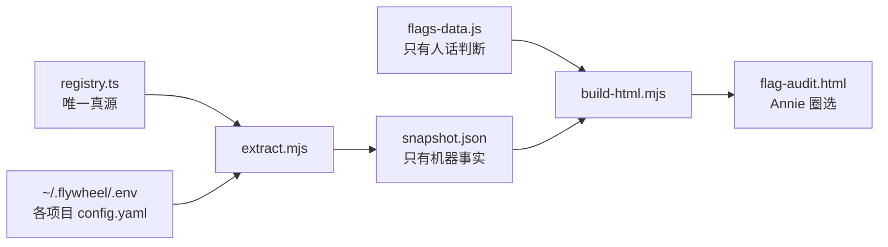

# FLY-1413 新增开关补审 — 探索

Issue: FLY-1413 (https://linear.app/geoforge3d/issue/FLY-1413/flag治理清存量-55-个新增开关补审-逐条圈选留清动态化像-fly-1136-那批)
日期: 2026-07-22
基于: 无

## 1. 这单要解决什么

FLY-1136 那轮逐条审过一批 flag,Annie 圈完之后执行了 4 个清理单(FLY-1240/1241/1242/1243)。那之后又冒出一批新开关,**这批没人审过** —— 哪个还需要、哪个该删、哪个该动态化,不清楚。本单把这批补审完,出一张 Annie 能逐条圈选的 HTML,圈完按桶拆执行单。

不改生产代码。本单 = 审计 + 圈选材料。

## 2. 数字先对齐:不是 55,是 62

单子标题写「~55 个新增」,实测 **62 个**。口径如下(全部可复现):

| 口径 | 数字 | 来源 |
|---|---|---|
| FLY-1136 最终审计基线 | 103 | 分支 `flywheel-FLY-1136` 的 `snapshot.json`(它自己从 85 涨到 103 并 reconcile 过) |
| 今天 registry 总数 | 148 | 本单用同一个 `extract.mjs` 跑当前 `registry.ts` |
| 基线里已被清掉的 | 17 | FLY-1240/1241/1242/1243 等执行单的成果 |
| **本单要补审的新增** | **62** | 148 − (103 − 17) |

算式:`103 − 17 + 62 = 148` ✅

FLY-1405 描述里的「138 个」是 2026-07-21 的快照,这两天又涨了 10 个。所以本单以 **62** 为准,不是 55、也不是 138 减 83。

补一条口径说明:FLY-1136 的产物在分支 `flywheel-FLY-1136`(PR #546),**没有合进 main**。所以基线只能从那条分支取,不能从 main 取。

## 3. 复用 FLY-1136 的管线,不重造

FLY-1136 留下的三段式管线正好可以原样复用,而且它带的硬门是这类审计不出错的关键:

关键设计(照抄):

- **机器事实和人话判断分家**。现值、生效方式、读点这些只从 `snapshot.json` 出;`flags-data.js` 只写人话和建议,绝不复制现值 —— 这样重跑 extract 刷新现值不会跟人话打架。
- **硬门**,任一不过就不出 HTML。注意本单的名字集合门**不是**「等于整个 registry」,而是「等于本次审计范围」——`snapshot.newSinceBaseline`(那 62 个)。基线名单 `baseline-fly1136.json` 作为交付物一起提交,而且 extract 会拿 `git show dc62daac:<原路径>` **回验**它没被人改过(基线一改,审计范围就变,founder 被问的问题也就变了)。
- **不落密钥**。extract 只读 `.env` 里 `FLYWHEEL_*` 的键值;布尔型按 flag 语义折算成开/关只存结果。诚实说明:`value` / `enum` 型(数值、枚举、默认路径)**原值既进 snapshot、也会显示在页面上**——**没做脱敏**,因为它们不是凭据;但这一点要写明,不能含糊成「不落任何原值」。

本单在此之上加一样东西:**运行时硬关(runtime hard-off)覆盖表** —— 见 research.md §3,这是 FLY-1136 那版没有的,而且不加就会把现状写错。

## 4. 三个桶怎么定义(本单口径,和 FLY-1136 的四桶不同)

| 桶 | 什么情况归这里 |
|---|---|
| **清** | 这个开关已经不起作用了(代码里硬关死),或它自己写明了退役条件而条件已满足 → 固化成默认 + 退休开关,逻辑保留 |
| **动态化** | 该继续当开关,但现在改了要重启才生效 → 读点迁 call-time / 接进控制台,归 FLY-1405 那条线 |
| **留** | 现在就已经是想要的样子:要么已经能秒切,要么是治理门(本来就不该批量切),要么是路径/密钥类配置(不该热改) |

Tadashi 通过 Lead 补充的三条排版要求已并入:按建议桶分组排序、数值型不硬塞「清」、保留「改了怎么才生效」一列。

## 5. 已经看到的几件事(细节在 research.md)

1. **13 个是死壳** —— 环境变量在,但它的消费者接在一条已退役的巷道后面,怎么设都没用。分两批:停车扫描一批(5 个)+ 投递签收一批(6 个)+ checkpoint 巡检和总闸(2 个)。这是本单最实的「清」批。
2. **14 个离「能秒切」只差一层分类** —— 读点在代码里已经是 call-time,只是注册表把它标成了 readonly/conversational。这是 FLY-1405 最便宜的一段;**但要注意跨进程那几条**(读它的是 Runner 或独立守护进程,改 Bridge 侧分类没用)。
3. **4 个环境变量在代码里当开关用,但根本没注册进 registry** —— 控制台看不见、审计漏掉。单列一节,而且它们**不是一类**:两个是内部运维杆,两个是刻意不登记的接缝(后者不给「补登记」这个选项)。
4. **1 个默认开的兜底开关在生产被显式关掉,没有任何地方记了为什么**。这条按「为什么是这个状态 = UNKNOWN」如实标,不编理由。
5. **1 个自己写明了退役条件、但条件我没取证** —— 同样不替它下结论,预选「不确定」并写清要补哪三样证据。

## 6. 交付边界

产出全部在 `product/doc/FLY-1413-flag-audit-increment/`,随分支走 PR:`exploration.md` / `research.md` / `plan.md` / `extract.mjs` / `flags-data.js` / `build-html.mjs` / `baseline-fly1136.json` / `snapshot.json` / `evidence-bridge-health.json` / `flag-audit.html`。

**不 publish、不直投 Annie**:HTML commit 进分支,把路径交给 Lead,由 Lead review + 发布 + 投进 FLY-1413 的 thread + 陪 Annie 圈。

圈完之后按桶拆执行单(删除单独成单、隔离审,像 FLY-1240–1243 那批)—— 那是下游单,不在本单。
