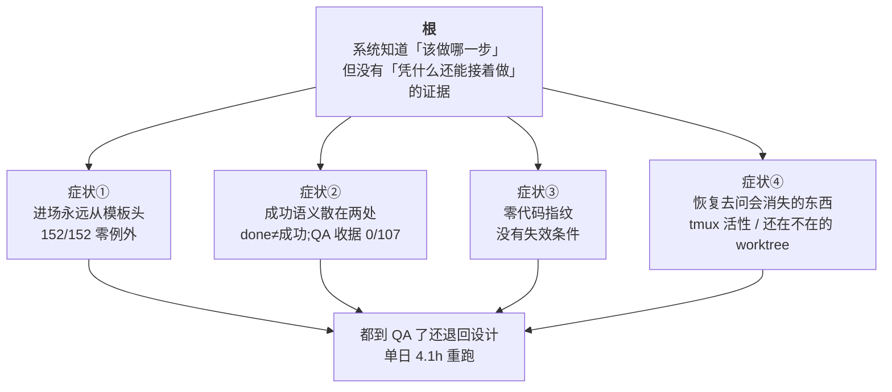

# FLY-1699 重跑与恢复:DAG 从断点继续 — PRD

Issue: FLY-1699 (https://linear.app/geoforge3d/issue/FLY-1699/重派恢复场景runsstart-支持指定入场节点跳过已完成的-designimplement-段)
日期: 2026-08-11
基于: 无(本单第一份文档;证据取自生产 `teamlead.db` 只读快照、四个事故 worktree 实测、以及 Codex design review R1/R2 的独立源码复核)

---

## 0. 一句话

**系统里其实一直知道「这个 run 该做哪个节点」,但从来没有一份「凭什么现在还能接着
做」的证据。** 于是每次重新进场只能从模板第一个节点重来。

本单只做一件事:**给「当前该做的那一步」配一份可验证的恢复凭据,重新进场时凭它接
着跑。** 不是加 `entryNodeId` + 修接管 + 补续跑三块补丁 —— 那是同一个根的三张脸。

---

## 1. Annie 的原话(逐字,不改写)

> 这是一个做 PRD 的东西,到时候我们要一起去思考一下,这种"重跑和恢复"的场景到底
> 应该做成什么样子。
>
> 而且**不要把它 specific 限制在具体的 design、implementation 或 QA 层面,而是要
> 考虑所有 DAG 的这种模式。**
>
> 假设它有 multiple 节点,之前可能已经跑了三个节点。在第三个节点跑到一半的时候,
> 整个系统 crash 了。类似这种情况下,我们在系统重启后重新跑的时候,我希望的是:
>
> **1. 已经成功跑完的节点,只要代码没变,就没有必要从头开始跑,我们能从断点继续
> 开始就可以了。**
>
> **2. 这里的"断点继续"倒不需要非常非常细节。比如第三个节点已经跑到一半了,你从
> 第三个节点重新开始跑也没关系,不需要非得从它正好一半的那个地方断点续传。**
>
> 但我们现在基本上是完全从头开始,直接从节点 1 重新跑,这样子肯定不行。

事故当天的原话(2026-08-11 08:28 PT,#flywheel-engineer):

> 为什么所有东西又全变成设计了?都已经到QA了,你又到设计,不是纯浪费token吗?
> 那你重派不能重新从设计开始啊?

| # | 硬要求 | 落点 |
|---|---|---|
| R1 | 已成功完成的节点不重跑 | §4.2 |
| R2 | **只要代码没变** —— 变了就失效重跑 | §4.3 |
| R3 | 所有 DAG 模式通用,不许只写工程线 | §4.5 |
| R4 | 粒度 = 节点级;**节点内续传不做** | §6 第一条 |

> **R2 的一处必要澄清(§4.3 会展开)**:「跑到一半的那个节点自己留下的半成品」
> **不算「代码变了」** —— 它恰恰是崩溃现场的一部分。把它当成「代码变了」会把节点
> 1、2 一起判废、退回模板头,那正好是 Annie 在抱怨的行为。

---

## 2. 我核了什么

四条。**2.2 和 2.4 是对我自己先前说法的更正**,而且两次错的方向都是让问题看起来比
实际小。

### 2.1 进场节点是模板头的纯函数 —— 四个模板,零例外 ✅

`workflow-template-selection.ts:388-395` 用入度算唯一起点(起点不唯一直接 throw),
`:425` 写进 `startReservation.nodeId`。请求体里**没有任何字段**能影响它。

| run 绑定的模板 | run 数 | 实际首个启动节点 | 例外 |
|---|---|---|---|
| tpl_code | 82 | design 82/82 | 0 |
| tpl_eng_heavy | 36 | design 36/36 | 0 |
| tpl_generic_menu | 31 | execute 31/31 | 0 |
| tpl_prd | 3 | produce 3/3 | 0 |
| **合计** | **152** | **全 = 模板入度 0 节点** | **0** |

Codex 独立复核:reservation 与 snapshot 算出的起点 **152/152 一致**。
⇒ **R3 的「通用」有数据撑着,不是形容词。**

> 两处口径:① Lead 给的是 n=111,我口径是「全部有 template_id 的 run」= 152,取数
> 窗口不同,方向一致。② **上表是 run 实际绑定的模板 id;当前 seed 文件里的 id 已
> 经是 `tpl_generic` / `tpl_product_v1` / `tpl_eng_*`。** 库里的旧 run 绑的是旧
> id —— 这个差异本身就是 §4.3 V3 必须绑 run 自己快照、而不是绑「当前模板」的理由。

### 2.2 🔴 更正:「哪些节点成功完成了」没有一份干净记录

**我先前写的是**:`workflow_run_node`(done)+ `workflow_node_completion` 是一份单
一、耐久、可读的账本,据此**部分证伪**了 Lead 的「状态散在四处」假说。**这条不成
立。**

| 事实 | 数字 | 含义 |
|---|---|---|
| `workflow_run_node` state='done' | 369 行 | — |
| `workflow_node_completion` | **194 行** | 差 175 行 |
| QA 节点 done 行 join completion | **0 / 107** | **裁决类节点根本不写完成收据** |

- `state='done'` 的真实语义是「这次 attempt **完成了一次转移**」,**不是「成功」**。
  QA 判 fail 走 loop 回 implement 时,源 attempt 同样被标 `done`。
- 裁决节点(qa / review)的权威写在 `workflow_claims` + `edge_traversed`;普通节点
  才写 `workflow_node_completion`。**两类节点的成功证据在两个地方。**

⇒ **Lead 的「没有一份完整权威、后继者能直接读的记录」在这件事上是成立的。** 我先
前只看了表在不在,没看语义和覆盖率,结论下早了。

> 边界:Lead 假说点名的 sessions 七字段白名单 / env / 分支文件,属于**接任活
> actor** 那条路;我仍未逐处审计,对它**不下结论**。

### 2.3 没有任何「代码没变」的落点 ✅

全部 `workflow_*` 表里带 sha/head 的列只有四处,全是专用:`workflow_node_pr_binding`
(仅产 PR 节点)、`workflow_gate_holder`(仅 gate)、`workflow_declared_pr` /
`workflow_ship_target_binding`(仅 ship)、`workflow_materialization_receipt`(仅文
档物化)。通用完成层**零代码指纹**;`completion_submission_digest` 是提交**报文**
的摘要。⇒ R2 那句话今天在系统里没有落点。

### 2.4 🔴 更正:「同 issue 同 worktree,产物本来就在」是错的

源码复核推翻了我先前的物理前提(`Blueprint.ts:1358-1374`):

- **接管分支**要求同时:`ctx.startPoint` 存在、工作树干净、`head === startPoint` 或
  startPoint 是 head 祖先。任一不满足 → **fail-closed** `worktree_takeover_failed`。
- **否则** `removeIfExists()` **删掉 worktree 和本地分支**,再 `create({startPoint})`;
  **startPoint 缺失回落 `origin/main`**(`WorktreeManager.ts:199-239,392-462`)。

⇒ 一个没带 restore 指针的新 run **会把存着 plan 和 PR 提交的分支删掉、从
`origin/main` 重建**。而且删本地分支后,如果没有别的 ref 指着,那些 commit 就是
dangling 对象,会被 GC —— **裸 SHA 不是耐久锚点**。

**硬性影响**:恢复凭据必须绑一个**引擎自有的受保护 ref**(见 §4.3 V1),启动时显式
传 `startPoint`;**绝不能依赖 worktree 还在**。验收也必须**先删 worktree 和本地分支
再测**,否则绿是「工作区碰巧还在」(假绿)。

### 2.5 接管路建在最不耐久的证据上;8-11 的 hold 是三种死因

| 层 | 内容 | 生存范围 | 事故集 |
|---|---|---|---|
| **T1 耐久** | DB 收据 / GitHub PR / **被 ref 指着的 Git 对象** | 跨进程、跨重启、跨机器 | 4/4 |
| **T2 工作区本地** | `.flywheel/runs/<execId>/codex/design-review.json`(已 gitignore) | worktree 拆了就没 | **1/4** |
| **T3 会话内** | tmux 指针 / 活 session 登记 | **会话一结束即清空** | 0/4 |

| issue | 生产实测 hold 原因 |
|---|---|
| FLY-1686 | `persisted_target_missing` |
| FLY-1680 / FLY-1574 | `holder_activation_failed:state_not_revivable:completed` |
| FLY-1614 / FLY-1676 / FLY-1573 | `worktree_not_ready:head_mismatch:…` |

> Issue 原文写「全线不可用(persisted_target_missing)」,实测是**三种**。只修第一
> 种,另外 2/3 仍卡死。

### 2.6 代价(2026-08-11 单日实测)

| issue | 首跑 | 重跑① | 重跑② | implement 重跑 |
|---|---|---|---|---|
| FLY-1614 | 54.5 min | **39.0** | **11.1** | — |
| FLY-1680 | 38.2 min | **36.6** | **12.9** | — |
| FLY-1686 | 103.3 min | **87.8** | — | — |
| FLY-1645 | 189.9 min | **12.2** | **7.6** | **40.2** |

design 重跑 **207 min** + implement 重跑 **40 min** ≈ **4.1 小时**墙钟,全在 xhigh。

- **诚实边界**:墙钟不等于 token;重跑里有一小部分是真新增(第二遍读了已有产物、
  写了交接说明)。4.1 h 是**可避免上限**,不是精确浪费值。
- 重跑②那列(11.1 / 12.9 / 7.6)是 Lead 用「采纳令」把设计段压成过场的效果。
  **它有效,恰好证明产物可复用;但它靠提示词纪律,不是机制**,所以第一次重派
  (39.0 / 36.6 / 87.8)一分钟没省下。

---

## 3. 根:一个,不是三个



---

## 4. 方案

### 4.1 形状:恢复当前那一步,不做增量缓存

| | A. 恢复当前该做的那一步(**选**) | B. 逐节点增量复用(build cache) |
|---|---|---|
| 判据 | 对**当前目标**验一次:恢复 ref + 输入信封 + 快照语义 + writer 围栏 | 每个节点各自的产物/输入指纹 |
| 代码变了 | 整体失效 → 显式降级路径 | 只失效受影响节点,其余照用 |
| 风险 | 保守(可能多跑一点) | **会错误复用** |

**B 有致命反例**:引擎不知道 runner 实际读过什么(它不是 hermetic action)。Linear
描述改了、agent 文件改了、某个被读过但不属于该节点产物的源文件改了 —— 输出可以一
字不变而结论已不成立。更糟:拿旧 run 的 `node_output` 行去「现算」,读到的永远是同
一行,**天然永远相等** = 空过的判据。

A 逐字对上 Annie 那句「只要代码没变」:没变就接着跑,变了就重跑。**「改了个无关文
件也要精确复用」不在本单范围。**

### 4.2 不造第二份前沿 —— 挂在已有的权威目标上

**引擎其实已经有权威前沿了。** 每次转移在**同一个事务**里写:`edge_traversed`(含
目标 node/attempt、outcome、后继 execution 或 rework request,`StateStore.ts:28562-28584`)、
目标 `workflow_run_node` 行(`:28585-28705`)、`workflow_run.current_node_id`
(`:28798-28800`)。

⇒ **本单不新建一份「前沿」,只给这个已有的目标元组挂一份验证附件。**

```
attachment 唯一键 = (run_id, target_node_id, target_attempt, transition_uid)
```

- resolver **先读并 CAS 当前权威目标元组**,再要求附件与它**精确一致**;
  **不按时间找「最新一条」**(那会漂移)。
- **每一种会改动前沿的转移都必须产出或继承附件**,不只是「成功完成」:
  QA/review **fail**(loop 出的 implement#2 是新目标,必须写它自己的新附件,不许复
  用 implement#1 的旧行)、rework route revision、operator rewind、dead-execution
  replacement/rollback、gate opening。**漏掉任何一种,附件就会和 `current_node_id`
  分叉。**

> 这一条直接决定 FLY-1680:它的 implement#1 完成过、head 也有批准评审,但 QA fail
> 已持久地创建了 implement#2。**当前目标就是 implement#2。** 任何「找到一条匹配的
> 旧成功记录就继续」的写法都会把它错判进 QA。

### 4.3 恢复凭据的有效性合同 —— R2 的落点

| # | 条件 | 关键要求 |
|---|---|---|
| **V1** | **恢复锚点可达** | 必须是**引擎自有的受保护 ref**(如 `refs/flywheel/checkpoints/<receipt-id>`)或已推到 allowlist 远端 ref;绑 repo identity + ref + commit + ref generation。**裸 SHA 不算耐久**(§2.4:删本地分支后会被 GC) |
| **V2** | **输入信封未变** | 具名权威来源 + 单调版本:issue 正文/验收标准、founder 追加指令集合、QA/rework 反馈与 route revision |
| **V3** | **语义未变** | 绑 **run 自己的 pinned snapshot digest** + 目标 resolved node digest + 实际 dispatch/runtime digest + rework authority-context digest。**不是绑「当前发布的模板」** |
| **V4** | **恢复载体 kind 已知** | `git_checkpoint` \| `state_only_checkpoint`,各自完整 fail-closed schema |
| **V5** | **目标 writer 已围栏** | 见下,**不是**全-run quiescence |

任一条算不出来(git 不可读 / 探测超时 / 版本未知)→ **判失效**。算不出来 ≠ 通过。

**V1 的关键细则 —— 半成品不是「代码变了」。**
崩溃时,正在跑的那个节点很可能已经留下未提交改动、甚至提交了一个半成品 commit。
**这是崩溃现场,不是新的有效状态。** 必须把:

- **可信基线** = 附件里的恢复 ref,和
- **不可信后缀** = 当前节点在基线之后留下的 dirty tree / 后代 commit

**分开处理**:在旧 writer 已围栏之后,把后缀移进 quarantine ref + 诊断记录,再从基
线精确重建,然后**从当前节点重跑**(R4 允许)。
**未知来源或外部 writer 造成的 drift(例如远端分支被别人推进)必须 hold,不许静默
reset。**

> ⚠️ 如果按「head 必须等于基线」一刀切,那么「节点 3 跑到一半崩溃」这个**最典型的
> 场景**会判失效、一路退回模板头 —— **正好是 Annie 抱怨的那个行为。** 这条细则不
> 是优化,是本方案能不能解决原问题的分界线。

**V3 的关键细则 —— 崩溃恢复保持原语义。**
同-run 恢复的既有合同是**故意 candidate-free** 的:它从不可变的 pinned snapshot 恢
复,当前 binding / 已发布 revision 的变化不能把一个有效 run 卡死
(`workflow-template-selection.ts:475-517`;snapshot 已冻结 resolved node、agent 内
容摘要、manifest digest,`workflow-run-snapshot.ts:217-237,411-452`)。
⇒ 拿「当前模板」去比对,既会把有效 run 判废,又达不到目的 —— **在同一个 run 里退回
模板头,跑的仍然是旧 pinned snapshot,不会自动换成新模板。**
**产品结论:崩溃恢复 = 保持这个 run 原来的语义。** 想用新语义必须顶掉旧 run 重开一
个(§4.7 路 B)。

**V5 的关键细则 —— 围栏的是 writer,不是整个 run。**

> 🚨 **实施陷阱**:现有的通用 `validateRunQuiescenceEvidenceTx()` 已被**明确中和为
> 永远返回 ok**(`StateStore.ts:23120-23131`),因为一个 DAG run 里本来就会有
> parked-alive 的 holder,要求全员死会卡死全线。**直接复用这个名字 = 拿到一个安全
> 假绿。**

要证明并围栏的是**将被替换的那个 writer 及其未来写权限**:
- 确切的 execution / activation / attempt 不可再运行;
- CommDB TURN、wake、submission/output credential 已撤销或换 generation;
- 分支/工作区 mutation lease 已转移;
- **一个延迟恢复的旧进程,在新 actor 起来之后不能再 commit/push/交完成报文。**

⇒ V5 必须是 **mutation-time fence + CAS**,不只是 admission 时看一眼活没活。
parked 只读 holder 显式排除;**unknown 一律 hold**。

### 4.4 gate 等待是可恢复的前沿(和「批准不可复用」是两件事)

- **founder 批准本身永不复用** —— founder-only-authority,红线不动。
- **但「QA 已 pass、正卡在一个尚未批准的 founder gate 上」是一个合法的当前目标。**
  在这个状态崩溃,恢复应当是**接着等那个 gate**,而不是把 QA 重跑一遍。

先前版本把这两件事混成了「gate 不可复用」,会导致 gate 等待期间崩溃后白跑一轮 QA。

### 4.5 通用性:两种恢复载体,引擎零节点类型分支 —— R3 的落点

既然 §4.1 选了整体验证,就**不再保留逐节点 input/output recipe**(那是 build cache
的形状)。恢复载体收窄成一个严格 union:

| kind | 适用 | 恢复锚点 |
|---|---|---|
| `git_checkpoint` | 需要重建工作区的节点 | 受保护 ref + commit(V1) |
| `state_only_checkpoint` | 不需要工作区、且输入已由 pinned snapshot + 输入信封封闭的节点 | 纯 DB(已有 `workflow_node_outputs` 等) |

**两种都不满足 → 不可恢复(fail-closed)。** 引擎只认 kind,不认
design/implement/qa;不强迫纯 DB 的通用工作流伪造 Git 产物。

Git 路径必须绑 repo identity + 已提交对象/ref;禁止拿任意 worktree 文件或 manifest
里的裸 branch 字符串当权威;路径做仓内相对 + symlink/逃逸校验。指纹 JSON 定死
canonical 编码、排序、重复 key 拒绝、摘要算法、大小上限、schema version。

**TOCTOU**:恢复 ref 必须在持有该分支 TURN/lease、工作树可判定时捕获,并在写事务前
后 re-probe;丢 TURN 或 head 变了 → 拒绝写附件。SQLite 与 Git ref/worktree 不是同一
个事务,必须定义 `intent → ref prepare → DB commit → launch → reconcile` 各个崩溃
点的语义。

### 4.6 恢复怎么落地

```mermaid
sequenceDiagram
  participant L as Lead
  participant B as runs 入口
  participant S as StateStore
  participant W as Worktree
  L->>B: runs/start (可选 entryNodeId = 只能更保守)
  B->>S: 读当前权威目标元组 + 它的验证附件
  S-->>B: target(node,attempt,transition) + V1..V5 依据
  B->>B: 验 V1-V5;任一不过 → 走显式降级(§4.7),不是「自然回落」
  B->>S: 单事务:围栏旧 writer → 撤凭据 → 旧 attempt 标 superseded → 分配新 attempt/execution/activation → 写 resume admission
  B->>W: 隔离不可信后缀 → 从受保护 ref 精确重建 → 显式传 startPoint
  W-->>B: 工作区回到精确对象(worktree/本地分支都不在也能恢复)
```

### 4.7 生命周期:必须先拍板的边界

今天两条路都不通:`/api/runs/start` 见到 successor phase 会在 resolver **之前**直接
409(`runs-route.ts:1782-1806`);`recoverWorkflowStartSelection()` 固定返回**原**
reservation 的 node / attempt 1 / execution(`workflow-template-selection.ts:479-533`)。

| | A. 续同一个 run(**推荐 v1**) | B. 新 run 顶掉旧 run |
|---|---|---|
| 做法 | 恢复到**当前权威目标**,新增 resume admission | 原子 supersede + 权威投影 |
| 下游不变量 | 天然满足 | **必须显式投影** |
| 能换新语义吗 | 不能(§4.3 V3) | 能 |
| 适用 | crash / 重启(8-11 就是这个) | 旧 run 真判终 / 要换语义 |

**路 A 不是免费的,两处必须新建:**

1. **独立的 resume admission**,不改原 start reservation ——
   `workflow_start_reservation` 的 `run_id` 是 `UNIQUE` 且整表禁止 update/delete
   (`StateStore.ts:16368-16386`),它表达的是**首次**物化,承载不了第二次进场的
   entry/attempt/execution/幂等响应。
2. **旧 attempt 的终结语义** —— 崩溃时当前节点通常仍是 `admitted/running`,带着活的
   execution/activation、credential、launch owner、dispatch intent。必须定义:围栏
   → 撤销 → 标 `superseded` → 分配新 attempt/execution/activation/launch ordinal。

**路 B 的代价是具体的**:QA 提交裁决时在**本 run** 里找 implement producer
(`workflow-decision-routes.ts:536-554`);开 land gate 要求**本 run** 有当前 head 的
`workflow_node_pr_binding`(`StateStore.ts:28069-28077`)。所以新 run 从 qa 进场必须
把这些权威按 `source_run_id/source_node_id/source_attempt/source_receipt_id` 谱系
**投影**过去 —— **绝不允许伪造一条旧 actor 的新 completion**。

**降级路径必须显式**:V1–V5 任一不过时,是「同 run rewind」、typed 409/hold、还是
「supersede 后新 run 从模板头」?**不能一边把路 B 砍掉,一边假设「自然回落到模板
头」会发生。** 若选新 run 从头,它不投影旧权威,但**仍需要一条原子 supersede 合
同**。

### 4.8 `entryNodeId` 的定位

不是指令,是**只能更保守**的上限请求:

```
effectiveEntry = min( leadRequested ?? 引擎推出的目标 , 引擎推出的目标 )
```

不传 = 引擎自己算(默认路径)。这样 issue 需求 1(Lead 指定)与需求 2(必须机械)
不再打架。

必须进入 selection digest、resume admission、route digest/start response、幂等判定。
语义:**首次冻结;精确重放返回同一判定;payload 或 checkpoint 不同 → 409,不重新猜。**

> ⚠️ 若允许 Lead **主动往前 rewind**(比引擎目标更早),那不是「读一个不同的
> entry」,而是一次真正的 workflow rewind:必须撤销下游 claims / gate holders /
> rework path 并创建新 target attempt。**这条能力的授权与撤销语义必须在语义子单里
> 定死,不能拖到接线那一步才发现。**

### 4.9 硬边界

- `founder_gate` 的**批准**、`land` 的**落地效果**:永不复用。
- 裁决节点的 **fail** 结论:永不算成功。
- 跨 issue / 跨分支复用:不做。
- worktree key 由引擎从 identifier 自算,**绝不接受外部传入的 key 字符串**
  (沿用 `resolveWorktreeKey` 既有安全姿态)。

### 4.10 接管路(症状④)的位置

按 Lead 转达的裁定,接管服务于①,不单列成需求。**我先前写的「§4.4 已让另两种 hold
不再是死胡同」证据不足,已删除。**

实际机制比我先前描述的复杂:`state_not_revivable:completed` 不发生在活性分类那一
步,而发生在 actor 被判 alive/wake **之后** —— `activateHolderForWake()` 拒绝把
StateStore 终态 `completed` 改回 running(`holder-wake-activation.ts:30-50`),而
rework coordinator 的目标预留仍绑在旧 `preferred_actor_execution_id`
(`workflow-rework-coordinator.ts:325-445`)。而且这里要的是 **QA fail 后让
implement 做返工**,不是沿普通成功边启动后继。

两条候选,**本 PRD 不替工程拍**:(a) 允许同 execution 的新 activation,但保持
sessions 终态不可逆,给 CommDB/turn 单独的 activation 生命周期;(b) 把 rework 路由
原子改绑到新 execution/actor,再走 replacement launch。
**直接放开 `completed → running` 会破坏现有终态免疫,不做。**

---

## 5. 验收

### 5.1 机制验收(前瞻、通用)

隔离房造 **4 节点合成 DAG**(不用工程线模板,证明通用)。

**恢复正确性:**

| # | 场景 | 期望 |
|---|---|---|
| A1 | 节点 1-2 成功、节点 3 运行中崩溃,**工作区 dirty**(未提交改动) | 隔离不可信改动 → 从受保护 ref 重建 → **进场 = 节点 3**;节点 1、2 不重跑 |
| A2 | 同上,但节点 3 **已提交一个后代 commit** | 同 A1(后代 commit 进 quarantine ref);**绝不能因 head≠基线就退回模板头** |
| A3 | 崩溃后**删掉 worktree 和本地分支**,再重派 | 只凭受保护 ref 恢复到精确对象;**断言没有从 `origin/main` 起** |
| A4 | 同 A3 且执行 `git gc` / 换一个 clone | 仍能恢复(证明 ref 是耐久锚点,不是裸 SHA) |
| A5 | **远端 issue 分支被外部推进** | **hold,不许静默 reset** |

**失效与降级:**

| # | 场景 | 期望 |
|---|---|---|
| A6 | 改 Linear issue 描述 / founder 追加指令(产物一字不变) | V2 不过 → 走**拍板定下的**降级路径(不是「自然回落」) |
| A7 | 当前发布模板从旧 id 换成新 id,run 快照未变 | V3 **不失效**(同-run 恢复保持原语义,§4.3) |
| A8 | 探测人为打断(git 不可读 / 版本未知) | fail-closed,不得静默通过 |

**权威与并发:**

| # | 场景 | 期望 |
|---|---|---|
| A9 | **QA fail + head 未变 + implement#2 pending + 旧 implement 收据仍匹配** | 进场**必须** implement#2;**绝不能**因旧收据匹配而进 QA;附件必须绑最新 attempt |
| A10 | QA pass 后卡在**未批准的 founder gate**,此时崩溃 | 恢复 = **接着等 gate**;不重跑 QA;批准本身仍不可复用 |
| A11 | 新 actor 起来后,**旧 writer 延迟回来提交** | 被 mutation fence 拒绝 |
| A12 | 探测与物化之间并发推进 head;或旧 actor 存活性 unknown | CAS 拒绝 / hold;**不创建第二个 writer** |
| A13 | 逐点崩溃重放:围栏后、ref prepare 后、DB commit 后、launch 前后、response 前 | 各点可恢复;同 key 精确重放返回**完全相同**结果 |
| A14 | 同 idempotency key + 不同 requested entry/checkpoint | 409 |

**兼容与边界:**

| # | 场景 | 期望 |
|---|---|---|
| A15 | 旧 schema / NULL 附件 / unknown kind / 两种载体都不满足 | 一律不恢复 |
| A16 | gate 批准与 land 效果的变异测试 | 永不复用 |
| A17 | 三种兼容态**分别**定义:flag OFF 的 legacy bytes;flag ON 但无可用附件;flag ON 的 active-run 恢复新行为 | 三者不能笼统叫「字节兼容」 |
| A18 | 当前 seed 模板 `tpl_generic` / `tpl_product_v1` 各跑一次;历史 alias `tpl_generic_menu` / `tpl_prd` 另列 migration case | 同一套规则,引擎无节点类型分支 |

**A2 / A5 / A8 / A9 / A11 / A16 是阴性对照,必须有** —— 没有阴性对照的绿是假绿。
**A3 必须先删 worktree + 本地分支** —— 否则绿是「工作区碰巧还在」。

**Rollout**:先 observe-only(只输出 proposed target + reason,不改变 launch),统计
命中/降级分布;**default-off kill switch**。这个功能在**所有 DAG start 的爆炸半径**
上,一个 fresh-issue 哨兵远远不够。

### 5.2 事故重放(回溯)

生产库只读副本 + 真 dispatcher(`VACUUM INTO` 快照 → 转 WAL,**绝不打生产库**;配
方见记忆 `reference_qa_prod_db_replica_dispatcher_harness.md`)。

> ⚠️ **必须绑死的前置**:8-11 那批 run 完成时,附件字段**还不存在**,受保护 ref 也
> 没建过。重放要先做**凭据重建**(从当时确实落库/落盘的东西反推:已提交的产物、
> `workflow_node_pr_binding.head_sha`、`codex_review_record.target_pr_head_sha`)。
> **它证明的是「判据逻辑当时能判对」,不是「机制当时在跑」。** 这个 caveat 必须和
> 「省下 4.1 小时」绑在一起说,分开会被读成机制当时就在跑。

| issue | 事故时当前目标 | PR head vs 已批准评审 head | 应判进场 |
|---|---|---|---|
| **FLY-1645** | qa#1 running | `d2b41ba4` == `d2b41ba4` ✅ | **qa** |
| FLY-1680 | implement#2(QA fail 后返工) | `98e0e4b6` == `98e0e4b6` ✅ | **implement**(目标是 #2,不是 qa) |
| FLY-1614 | implement#2 | `253b283f` ≠ `69dc8697` ❌ | implement |
| FLY-1686 | implement#2 | `cba1446b` ≠ `f942a4fa` ❌ | implement |
| FLY-1693 | 前身是 generic_menu,无 design 产物 | — | design(不变) |

**Issue 原文验收口径需一处修正**:原文写「五单都能从 qa 进场」。实测其中三单当时正
处在 **QA 失败后的返工**,当前目标就是 implement#2 —— 再跳过 implement 等于跳过未经
评审的改动。**正确目标:1 单进 qa(FLY-1645)、3 单进 implement、design 段 0 重跑。**
对应省下 148 min design 重跑 + 40 min implement 重跑。

判据:① 四单 design 节点 0 个新 attempt;② FLY-1645 首个 running 节点 == `qa`;
③ 每份附件都精确绑当时的权威目标元组;④ 人为改 FLY-1614 的 PR head 一位 → 拒绝恢复。

---

## 6. 非目标 / 主动砍掉

| 砍掉 | 理由 |
|---|---|
| **节点内断点续传** | Annie 明确说不需要(R4) |
| **逐节点增量复用 / build cache** | §4.1:引擎不知道非 hermetic runner 读过什么,会错误复用 |
| **崩溃恢复时自动换用新模板语义** | §4.3 V3:同 run 恢复跑的是 pinned snapshot;要换语义只能顶掉旧 run 重开 |
| 自动恢复(引擎自己发现并重派) | 本单只保证「重派时不退回起点」 |
| 复用 founder 批准 / land 效果 / 裁决 fail 结论 | 权限红线 + 正确性红线 |
| 跨 issue / 跨分支复用 | 攻击面 |
| **路 B(新 run 顶掉旧 run + 权威投影)** | v1 只做路 A;B 单独一单 |
| 放开 `completed → running` | 破坏终态免疫 |
| 接管路的 sessions/env/分支文件状态整合 | 未审计,不在本单必要路径 |
| 设计门结论从工作区文件升级成 DB 行 | 真缺口(T2 仅 1/4),独立并行子单 |

---

## 7. 风险

| # | 风险 | 处置 |
|---|---|---|
| K1 | 把「跑到一半留下的半成品」当成「代码变了」→ 退回模板头 | §4.3 V1 细则(基线 vs 不可信后缀);A1/A2 专杀 |
| K2 | 裸 SHA 被 GC / 换机器 → 恢复不了 | 受保护 ref;A3/A4 专杀 |
| K3 | 拿 `done` 当成功 → FLY-1680 类误判 | §4.2 挂已有权威目标;A9 专杀 |
| K4 | 复用 `validateRunQuiescenceEvidenceTx()` → **安全假绿** | §4.3 V5 明写陷阱;A11/A12 专杀 |
| K5 | 附件与 `current_node_id` 分叉 | 唯一键绑 transition;每种前沿变动都必须写/继承附件 |
| K6 | SQLite 与 Git ref 跨存储崩溃 | §4.5 定义各崩溃点;A13 专杀 |
| K7 | 爆炸半径 = 所有 DAG 的 start | observe-only 先行 + default-off kill switch |
| K8 | 与在飞的 FLY-1614 / FLY-1686 撞车 | 本单不改 TURN 交接语义;实施前与两单 head 对一次 |
| K9 | 「机制上线」被误读成「历史 run 也能省」 | §5.2 前置与省时数字绑死发布 |

---

## 8. 拆单顺序(先冻结语义,再定表)

反过来做会把错误抽象固化进 schema。

| 序 | 子单 | 必须产出 |
|---|---|---|
| 1 | **同-run 语义合同** | 当前目标 SSOT、attempt/activation 替换、Lead rewind 的授权与撤销、**V1–V5 失效后的降级路径**、gate 等待可恢复 |
| 2 | **围栏与跨存储协议** | target-writer quiescence/fencing **真值表**(显式排除 parked 只读 holder,unknown 一律 hold)+ 受保护 ref + intent/prepare/commit/launch/reconcile 各崩溃点 |
| 3 | schema | `workflow_resume_reservation` + 绑目标的附件 + stage/reconcile |
| 4 | 挂写入点 | 在现有 transition / rework / replacement 写路径挂附件;先做变异测试 |
| 5 | **只读 resolver(shadow)** | 只输出 proposed target + reason;验证它只接受与当前目标精确匹配的附件 |
| 6 | 恢复落地 | 后缀隔离 + 精确重建 + 显式 startPoint + dispatcher admission |
| 7 | `runs/start` 接线 | 上限请求、route digest、response 重放 |
| 8 | E2E + rollout | A1–A18、observe-only、kill switch、metrics |
| 9 | **最后**才做事故重放 | 8-11 凭据重建 + 重放 |

并行独立:接管路语义(§4.10,**前提是明确它不用于解除 active run 的 hold**);设计
门结论耐久化。

---

## 9. 已定（2026-08-11 Annie 拍板）

> 四条**全部按推荐锁定**。③ 是她逐字回的「**接受修正口径**」；①②④ 她未提异议，
> Lead 明说「按推荐往下走、不再问第二遍」后执行 —— **口径写清楚：③ 是明确同意，
> ①②④ 是「已告知并按推荐执行」，不是她逐条批的。** 她随时可以推翻任一条。

1. ✅ **形状 = 恢复当前那一步**（代码没变就接着跑,变了就重跑）。**不做**「逐节点
   精确复用」——后者会错误复用(§4.1)。
   *依据:逐字对应她那句「只要代码没变」。*
2. ✅ **半成品 = 隔离归档后从该节点重跑**,**不算**「代码变了」。
   *依据:按「head 变了就全废」一刀切,会把她说的那个场景直接打回模板头,等于白修。*
3. ✅ **验收口径 = 1 单进 qa(FLY-1645) + 3 单进 implement + design 零重跑**,替代
   issue 原文的「五单都进 qa」(那三单当时正处在 QA 失败后的返工)。
   *她的原话:「接受修正口径」。*
   ⚠️ **这不是放宽**:判据反而更细(四单 design 0 新 attempt / 1645 首个 running 节点
   必须正好是 qa / 人为改一位 head 必须被拒绝恢复)。
4. ✅ **诚实口径 = 「省下 4.1 小时」必须和「8-11 那批要靠凭据重建才能重放」这个
   caveat 绑在一起说**,不单独宣称省了多少。

**给 Tadashi(工程边界,2 条):**

5. **生命周期**:v1 走路 A(续同一个 run + 新增 resume admission),把路 B(新 run
   顶掉旧 run + 权威投影)留作后续单?
   *推荐:是。8-11 就是 crash/重启场景。*
6. **降级路径**:V1–V5 任一不过时,定成同-run rewind、typed 409/hold、还是 supersede
   后新 run 从模板头?**必须三选一写死**,不能留「自然回落」。
   *推荐:typed 409/hold + 显式 supersede 入口;静默回落到模板头正是本单要消灭的行为。*

---

## 附:关键代码位置

| 位置 | 作用 |
|---|---|
| `workflow-template-selection.ts:388-395,425` | 入度算起点 + 写死 `startReservation.nodeId` ← 症状① |
| `Blueprint.ts:1358-1374` + `WorktreeManager.ts:199-239,392-462` | 接管失败即删 worktree/本地分支并从 `origin/main` 重建 ← §2.4 |
| `StateStore.ts:28562-28584,28585-28705,28798-28800` | 转移事务:`edge_traversed` + 目标 attempt + `current_node_id` ← **已有的权威前沿**,§4.2 |
| `StateStore.ts:16368-16386` | `workflow_start_reservation` UNIQUE 且禁 update/delete ← 必须另建 resume admission |
| `StateStore.ts:23120-23131` | `validateRunQuiescenceEvidenceTx()` 已中和为永远 ok ← **§4.3 V5 的陷阱** |
| `workflow-template-selection.ts:475-533` | 同-run 恢复 candidate-free,固定返回原 reservation ← §4.3 V3 / §4.7 路 A 的改点 |
| `workflow-run-snapshot.ts:217-237,411-452` | pinned snapshot 冻结 resolved node / agent / manifest digest |
| `runs-route.ts:1782-1806` | 见 successor phase 在 resolver 之前 409 |
| `workflow-decision-routes.ts:536-554` / `StateStore.ts:28069-28077` | QA 找 producer / land gate 要本 run 的 PR binding ← 路 B 的代价 |
| `holder-wake-activation.ts:30-50` + `workflow-rework-coordinator.ts:325-445` | `completed` 拒绝复活的真实位置 ← §4.10 |
| `workflow_node_completion` / `workflow_claims` + `edge_traversed` | 成功证据分居两处 ← §2.2 |

---

# 具体方案(Annie 拍 A 粗版后追加,2026-08-11)

> Annie:「A 没有问题,那 PRD 就算是已经做好了…但是你是不是还要细节地看一下:
> **1. 我们具体代码是怎么实现的?2. 它的 database 是怎么实现的?** 你具体给一个方
> 案出来吧」

**规模先交底:1 个新列 + 2 处必改代码(写 / 读)+ 1 处必须一并改否则会毁分支(见
④ 末)。** 细版的「每类节点一张指纹配方表」已被砍,本节没有把它做回来。
下面每条都给真文件、真行号、真列名;查不到的地方我写查不到。

## ① 节点完成是在哪里写库的

| 项 | 值 |
|---|---|
| 文件 | `packages/teamlead/src/StateStore.ts` |
| 函数 | `commitEnrolledCompletion(input)`,起始 **`:26679`** |
| 写哪张表 | `workflow_node_completion`,INSERT 在 **`:27077-27092`** |
| 同事务还写 | `workflow_node_pr_binding`(`:27055-27070`,经 `recordWorkflowNodePrBindingTx`,`:26591`);`workflow_run_node`(`upsertWorkflowRunNodeTx`) |
| 谁调它 | `packages/teamlead/src/bridge/event-route.ts:891`;另有 `bridge/land-executor.ts:172`、`bridge/merge-ship-gate.ts:176` |

## ② 两张表的真实 schema(逐列)

**`workflow_node_completion`(`StateStore.ts:16351-16365`)**

| 列 | 类型 / 约束 |
|---|---|
| `activation_id` | TEXT,FK → `workflow_execution_binding(activation_id)` |
| `run_id` | TEXT NOT NULL |
| `node_id` | TEXT NOT NULL |
| `attempt` | INTEGER NOT NULL CHECK (attempt > 0) |
| `execution_id` | TEXT NOT NULL |
| `route` | TEXT NOT NULL |
| `event_uid` | TEXT NOT NULL UNIQUE |
| `source_event_id` | TEXT NOT NULL |
| `completion_submission_digest` | TEXT NOT NULL |
| `completed_at` | TEXT NOT NULL |
| 主键 | (run_id, node_id, attempt) |

> 🔴 **这张表是 append-only**:触发器 `workflow_node_completion_no_update` /
> `_no_delete`(`:16506-16513`)会 ABORT 任何 UPDATE/DELETE。**这直接决定了 ⑤ ——
> 旧行不可能回填。**

**`workflow_run_node`(`StateStore.ts:15606-15616`)**

| 列 | 类型 |
|---|---|
| `run_id` / `node_id` | TEXT NOT NULL |
| `attempt` | INTEGER NOT NULL |
| `state` | TEXT NOT NULL |
| `execution_id` | TEXT |
| `started_at` / `ended_at` | TEXT |
| 主键 | (run_id, node_id, attempt) |

**现在有没有能当「代码版本」用的列?没有。**
`completion_submission_digest` 是完成**报文**的摘要,不是代码;`workflow_run_node`
一列都没有。全库带 sha/head 的列只有 4 处,全是 PR/gate/ship/文档物化专用(§2.3)。

## ③ 要加的那个字段

| 项 | 值 |
|---|---|
| 名字 | `completion_head_sha` |
| 类型 | `TEXT`(nullable —— 旧行只能是 NULL,见 ⑤) |
| 谁写 | `commitEnrolledCompletion()`,即 ① 的那条 INSERT |
| 谁读 | 进场那一次比较(④) |

**「当时的代码版本」在我们这儿具体取什么 —— 我去看了实际能拿到什么:**

**它已经算好了,就在 `StateStore.ts:27033-27040`:**

    const sessionHead = this.getSession(input.executionId)?.pr_head_sha;
    const completionSubjectDigest = genericNoCodeExit
      ? undefined
      : input.subjectDigest ? input.subjectDigest.toLowerCase()
      : /^[0-9a-f]{40}$/i.test(sessionHead ?? "") ? sessionHead.toLowerCase()
      : undefined;

- 值是 **40-hex 的分支 head sha**,来源二选一,都是现成的:① 事件信封里的
  `subjectDigest`(由 `event-route.ts:897` 的 `completionHead` 传入,入口在
  `:27030-27033` 已做 40-hex 校验);② 兜底 `sessions.pr_head_sha`。
- **这个变量今天已经在用** —— `:27057` 拿它当写 PR binding 的闸
  (`input.prBinding.headSha.toLowerCase() === completionSubjectDigest`)。
  **只是没存下来。**

⇒ **所以「加一个字段」在代码上就是:那条 INSERT 多一列、多一个参数。** 不需要新算
任何东西,不需要新的探测。

**两条必须说清的边界(不说清会被当成比实际更强的保证):**

1. 它是**完成时刻记录的 head**,不是引擎在写库那一刻现场 `rev-parse` 出来的。对
   「这次完成对应哪个提交」它是准的;但别把它当成「引擎自证的现场快照」。
2. `genericNoCodeExit`(不产代码的 generic 节点)这里是 **undefined** —— 这类节点
   **天然没有 head**。必须显式定义,建议:**没有 head = 不可复用**,与 ⑤ 的保守档
   一致。查到的现状就是 undefined,我没有替它猜一个值。

## ④ 进场那次比较加在哪

| 项 | 值 |
|---|---|
| 文件 | `packages/teamlead/src/workflow-template-selection.ts` |
| 今天写死起点的两行 | **`:393`**(`const starts = manifest.nodes.filter(...)`)+ **`:425`**(`nodeId: starts[0]!.id`) |
| 改什么 | **比较的结果替换 `:425` 那个值**,其余不动 |
| 触发点 | `packages/teamlead/src/bridge/runs-route.ts` 的 DAG 进场段(~`:2380-2470`,调用 `resolveWorkflowTemplateSelection()` 处) |

**比较本身(一次):**

    当前分支 head  vs  该 run 最后一条 completion 的 completion_head_sha
      ├ 相符 → 进场 = workflow_run.current_node_id   (已有列,不用新算)
      └ 不符 → 进场 = starts[0].id                    (现状,不变)

**「相符」建议用祖先判定,不用严格相等 —— 这一条直接决定方案能不能解决 Annie 说的
那个场景:**

- 严格相等:节点 3 跑到一半只要**提交过任何东西**,head 就 ≠ 最后一条 completion
  的 head → 判不符 → **退回模板头**。那正好是她在抱怨的行为,方案等于没做。
- **祖先判定**:`last_completion_head` 是当前 head 的祖先 → 认为「只有这个 run 自己
  往前走过」→ 判相符,进场 = `current_node_id`(即那个跑到一半的节点),从它重跑
  (R4 允许)。
- 原语是现成的:`GitResultChecker.isAncestorOf()`(`packages/edge-worker/src/GitResultChecker.ts:94`),
  `Blueprint.ts:1319` 已经在用同一个。

**当前分支 head 怎么拿(现成写法,不用发明):**

    git -C <mainRepoPath> rev-parse --verify -q refs/heads/<branch>

`bridge/branch-cleanup.ts:143-155` 就是这么写的(`canceled-pr-close.ts:187,246` 同
款)。分支名由 `WorktreeManager.worktreeName(mainRepoPath, issueId)` 给
(`WorktreeManager.ts:206,397`);repo 路径可取 `workflow_node_pr_binding.target_repo_path`
(该表已有此列)。

> 🔴 **除了「一个字段 + 一次比较」,还有第三处必须一并改,否则会毁掉分支 —— 我按
> 要求点名报出来,没有自行加码:**
> 判「可续」之后启动时**必须显式传 `startPoint`**。`WorktreeManager.create()` 在
> `startPoint` 缺省时会回落到 `origin/main`(`WorktreeManager.ts:213-217`),而
> `Blueprint.ts:1358-1374` 在接管不成立时会先 `removeIfExists()`(删 worktree **和
> 本地分支**,`WorktreeManager.ts:392-462`)。**两者相加 = 存着 plan 和 PR 提交的
> 分支被重置。** 这不是优化,是不做就会出事的一处。

## ⑤ Migration:已有的完成记录没有这个字段,怎么算

**先讲清约束**:`workflow_node_completion` 是 append-only(触发器禁 UPDATE,②),
所以现存 **194 行**的新列**不可能回填**,必然是 NULL。这不是选择题的一部分,是前提。

| 档 | 规则 | 代价 |
|---|---|---|
| **保守(推荐)** | `completion_head_sha IS NULL` → **判失效**,走现状(从模板头) | 存量 run 一轮都省不到;新机制从**下一次完成**开始生效 |
| 乐观 | NULL → 判有效,照旧 `current_node_id` 进场 | 拿一条**完全不知道对应什么代码**的旧记录去跳过节点 |

**推荐保守。理由三条:**

1. **爆炸半径**:这个判断在**所有 DAG 的 start 上**(152/152 都走这条路),不是某
   条线的局部开关。
2. **代价不对称**:乐观档省下的只是存量那批(而且大部分已经跑完或已判终);换来的
   是「不知道代码状态就跳过节点」的**永久**风险 —— 一旦跳错,产出的是错代码,不是
   多跑一轮。
3. **坏处的可观测性不同**:保守档的坏处是可测量、可等的(上线一轮之后就有真实命中
   率数据);乐观档的坏处是随机的、而且**事后才看得见**。

> 顺带:`genericNoCodeExit` 那类节点(③ 边界 2)本来就没有 head,和 NULL 同档处
> 理 —— 不可复用。

## 这版**不覆盖**什么(诚实清单)

Codex design review R1/R2 提出了若干条,粗版按 Annie「别搞复杂」的裁定**没有做**。
列在这里不是要加回来,是让 Tadashi 能给残余风险定价:

| 没覆盖 | 后果 | 建议归属 |
|---|---|---|
| 恢复锚点是分支 head,不是引擎自有的受保护 ref | 本地分支被删且无别的 ref 指着时,commit 可能被 GC → 恢复不了(退回模板头,不会出错代码) | 后续单 |
| 未提交改动的隔离/归档 | 工作区 dirty 时接管本来就 fail-closed;粗版不改这条 | 后续单 |
| 旧 writer 的 mutation fencing | 旧 actor 延迟回来仍可能写分支 | 后续单;**⚠️ 别调 `validateRunQuiescenceEvidenceTx()`,它已被中和为永远返回 ok(`StateStore.ts:23120-23131`),用它 = 安全假绿** |
| 独立的 resume admission | `workflow_start_reservation` 的 `run_id` 是 UNIQUE 且禁 update/delete(`StateStore.ts:16368-16386`),粗版不往里写第二次进场 | 后续单 |
| QA fail 后 `current_node_id` 的正确性 | 粗版直接信任 `current_node_id`(它由转移事务维护,`StateStore.ts:28798-28800`),不自己重推前沿 —— 这是粗版能这么小的原因,也意味着**它对不对完全取决于那一列对不对** | 上线前用 FLY-1680 实测一次即可(它的 `current_node_id` 应为 implement) |

## 上线次序(粗版)

1. 加列(`ALTER TABLE ... ADD COLUMN`,nullable,幂等)。
2. 写侧:①那条 INSERT 多写一列。**此时不读**,先攒数据。
3. 读侧先做 **observe-only**:算出 proposed entry + reason 记日志,**不改变实际进
   场**。看命中率和 NULL 占比。
4. 数据好看了再打开,`default-off` 开关保留。

---

# 附录:为什么这一单没走 founder 迭代(实测,2026-08-11)

Annie:「我们之前完全可以在这个 PRD 的 HTML 上去 iterate,为什么现在完全不行了?
它好像完全不知道这个事情一样,是我们这个 DAG 的模板没有写清楚吗?」

两个原因叠加,先说不推给模板的那个:**跑这一单的 PM 角色说明里写了「出 explainer
HTML → 跟 founder co-eval」,这一步被跳过了** —— 直接写文档、开 PR、把单子推到
`founder_gate`。这是执行失职。

第二个原因是结构性的,拉生产库五个模板当前生效版本(revision 4)实测:

| 模板 | 节点链 | 有迭代回边吗 |
|---|---|---|
| `tpl_code`(工程线) | design → implement → qa → founder_gate → land | ✅ `qa_retry`(qa→implement) |
| **`tpl_prd`**(本单) | produce → founder_gate → land | ❌ 无 |
| **`tpl_design`** | produce → founder_gate → land | ❌ 无 |
| **`tpl_prototype`** | produce → founder_gate → land | ❌ 无 |
| **`tpl_generic_menu`** | execute → founder_gate → land | ❌ 无 |

**四个非工程模板全是「干一次 → 请批准 → 上线」的直线,零 loop。** 工程线那条唯一的
loop 还是 QA 机器判的,不是给 founder 用的。

⇒ `produce` 完成后,图上**唯一的出边就是 `founder_gate`**(批准/不批准的二值门)。
founder 说「这里改一下」时,**没有任何一条边能回到 `produce`**。本单 run
`2ee49a15` 的 `current_node_id` 现在正是 `founder_gate`。

**该怎么补(两条):**

1. 加一条回边,让 founder 在「批准 / 不批准」之外有第三个选择「改一版再来」→ 回
   `produce` 重跑一轮。
2. **规定 `produce` 的首次交付是一张 founder-facing HTML**,不是文档 + PR。现在模板
   对此无规定,交付形态全靠跑单者自觉。

**与 FLY-1691 的关系**:该单已立项做「三个产品模板补 founder 迭代环」。
**实测是四个 —— `tpl_generic_menu` 同样缺**,建议一并纳入。

> 更正:本文早前一版曾称完成后「交给 DAG 的 review 节点」。**`tpl_prd` 没有 review
> 节点**(有 review 节点的是 seed 文件里的 `tpl_product_v1`,生产绑定的是
> `tpl_prd`)。那句话是错的。
