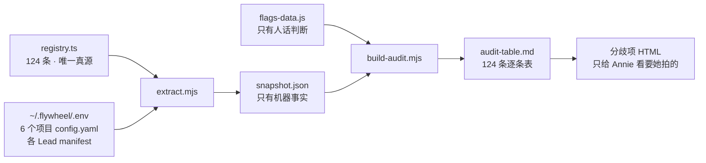

# FLY-1782 · 124 个 feature flag 重新体检

**Issue**: FLY-1782(https://linear.app/geoforge3d/issue/FLY-1782)
**日期**: 2026-08-15
**基于**: `product/doc/FLY-1136-feature-flag-audit/`(第一轮)· `product/doc/FLY-1413-flag-audit-increment/`(第二轮)· `product/doc/FLY-1091-feature-flag-policy/`(政策)

逐条体检表(124 条,机器生成)在同目录 **[`audit-table.md`](audit-table.md)**。
本文写的是:数字怎么对上的、怎么查的、查出了什么、每条怎么裁、哪些必须问 Annie。

---

## 0. 一句话结论

**单子的假设方向对,但位置错了。**

单子预判「过去三周删了一整批功能,存量 registry 里大概率躺着一批已经死掉的 flag」。
本轮逐条查完:**registry 里一条死的都没有** —— 因为代码库有一套「功能死了、开关跟着立墓碑」的机制(`truth.ts` 的 `RETIRED_FLAGS`,现有 96 块墓碑),它一直在正常工作。

**尸体堆在另一个地方:生产的 `~/.flywheel/.env` 里。**
那里有 **11 行**(10 个不同的键)设的是**已经立了墓碑的开关**。代码库自带的校验器对这 11 行的判词逐字是「**已退役假开关,删这行**」——只是**从来没人拿它扫过生产 .env**。

顺带查出的第二件事更要紧:**上一轮审计管线本身有个解析 bug**,会把系统里最重要的那根杠杆(DAG 派工总闸)读成和生产**相反**的值。已修,见 §3.1。

---

## 1. 数字先对齐(全部可复现)

| 口径 | 数字 | 怎么来的 |
|---|---|---|
| 今天 registry 条数 | **124** | `grep -c 'name: "' registry.ts` |
| 2026-07-24(FLY-1456 执行后)条数 | **141** | `git show 83a90791:.../registry.ts` |
| 那之后**新增** | **9** | 两版名字集合求差 |
| 那之后**删除** | **26** | 同上 |
| 净变化 | **−17** | 141 − 26 + 9 = 124 ✅ |

> ⚠️ **单子描述里的「新增 15 / 删除 27 / 净 −12」对不上账**:15 − 27 = −12,但同一张表里写的 141 → 124 是 −17。
> 本轮以 first-parent 上 `83a90791`(07-24,在 FLY-1456 合入之后)为基准重算,得 **9 / 26 / −17**,三个数自洽。

**那 26 个删除是怎么没的**——单子的定性判断**成立**:

| 来源 | 条数 | 例子 |
|---|---|---|
| FLY-1570 拆看门狗全家 | 12 | `bridge_watchdog` · `watchdog_judge` · `stuck_detect` · `misroute_patrol` · `pane_idle_suppress` |
| 三段式退役(FLY-1674) | 7 | `three_stage_killswitch` 一族 5 条 + `park_biased_handoff` + `retest_head_delta_guard` |
| 消息层重构(FLY-1645) | 4 | `receipt_foundation` · `receipt_activation_dry_run` · `zombie_gate_resolve` · `codex_hold_nudge` 一族 |
| 其余 | 3 | `lead_pending_escalation` · `quiet_classifier` · `quiet_persist_dedup` |

**没有一条是治理清掉的,全是功能被删、开关陪葬。** 这条区分是本单的核心洞见,下面 §3 会说明它为什么其实是**好消息**。

### 1.1 体检范围要分两层(证据强度不同,不能混成一个数)

| 层 | 条数 | 证据强度 |
|---|---|---|
| **从没被审过** | **16** | 本轮第一次逐条写 |
| 审过、但要重验 | 108 | 历史裁决可能因为功能被删/重构而失效 |

16 条全新的是:`bridge_loop_guard` · `cmux_autostart_exec` · `cmux_roster` · `cmux_strict_view` · `cmux_wal_quarantine` · `continuity_preflight` · `converge_cmux_symlink` · `doa_backoff` · `founder_reply_unreachable` · `instruction_path_check` · `liveness_alerts` · `mailbox_queue` · `push_guard` · `tmux_keepalive` · `workflow_gate_carrier` · `workflow_turn_divergence_alerts`。

这个 16/108 的切分不是估的:两轮历史审计的名单**各自从 git 里重新取出来核对过**(`dc62daac` 的 103 条 + `6019e021` 的 62 条),任何一份取不出来,程序就把这个切分记成 UNKNOWN 而不是悄悄算成一个更好看的数字。

---

## 2. 怎么查的

沿用 FLY-1136 → FLY-1413 那条管线,并加了三样:



**铁律照抄**:机器事实(现在开还是关、改了怎么生效、哪个进程读)只从 `snapshot.json` 出;`flags-data.js` 只写人话和建议,**绝不复制现值** —— 这样重跑一次刷新现值,不会和人话打架。

**本轮加的三样:**

1. **进程归属从「只查增量」扩到「全部 124 条」。** 上一轮只需要给它那 62 条增量交代「改了要重启哪个进程」,剩下 32 条留成「未核实」。本轮既然要逐条写,就必须逐条追到真进程 —— 现在 124 条**一条不剩**都有实证(`未核实` 进不了表,硬门会直接停)。
2. **两层基线**(见 §1.1),让「从没审过」和「审过但过期了」分开报。
3. **死壳判据全部重跑**,而不是继承上一轮的表 —— 见 §3.2。

**产出全部可复现**:`node extract.mjs && node build-audit.mjs`。五道硬门(名字集合逐字相等 / 每条都有判断 / 判断层不许断言现值 / 进程归属不许未核实 / 快照必须对得上今天的 registry.ts)任一不过就不出表。

---

## 3. 查出了什么

### 3.1 🔴 上一轮的审计管线会把最重要的那根杠杆读反

`~/.flywheel/.env` 第 161 行:

```
FLYWHEEL_WORKFLOW_TEMPLATE_DISPATCH=1  # 2026-07-31 Annie 拍板恢复 DAG 派工(v2 已退役回 v1)
```

生产是用 `set -a; source ~/.flywheel/.env` 加载的。bash 会把前面带空格的 `#` 当注释扔掉,所以生产读到的是 **`1` → 派工总闸开着**。

而 FLY-1136/1413 传下来的解析器把 `=` 后面**全部**留着,读到的是 `"1  # 2026-07-31 Annie…"`,它不等于 `"1"`,于是判成 **关**。

实测对照(同一行,两种读法):

```
bash 看到:      [1]
老解析器看到:   [1  # 2026-07-31 Annie]     === "1"? false
```

**这意味着:如果照上一轮的管线直接出表,Annie 会看到「DAG 派工是关的」——和生产事实正好相反。**

行为反证(不靠推理):**这次体检自己就是以一个 generalized workflow 节点在跑的**,而那种节点只有在派工总闸开着时才存在。

已修:`.env` 侧现在和 YAML 侧用同一套注释剥离逻辑(YAML 侧当年在 Codex review 里补过,`.env` 侧一直没补上)。今天全生产 `.env` 里只有这一个已注册开关受影响,但它偏偏是最不能读错的那个。

### 3.2 registry 里没有死壳 —— 而且这是好消息

上一轮标了 13 条死壳(3 条「读函数写死返回 false」+ 10 条「唯一消费方永远不跑」)。本轮开工先核了一遍:**那 13 条已经在 FLY-1456(PR #695,2026-07-24 合入)里被真删了**,继承来的表整张都是空的。

然后按同样两个形状重扫今天的 124 条:

- **形状 A(读函数被写死成常量)**:0 条。上一轮那个 `retiredWatchdogLaneEnabled(): false` 的写法,随 FLY-1570 一起消失了。
- **形状 B(唯一消费方在一条永不运行的通道后面)**:0 条。
- **旁证**:124 条**每一条**在生产源码里都至少有一个真实(非注释)读点,没有一条是纯孤儿。

**诚实说明这个「零」的边界**:形状 A/B 是可以机器扫的;「读点存在、也会跑,但这个功能实际上没人在用了」是**不能**机器扫的 —— 那要靠 §3.4 的「从没被打开过」信号和 Tadashi 的生产知识。所以本轮报的是「按这两个判据没找到」,不是「保证一条死的都没有」。

**为什么说是好消息**:这套机制是在起作用的。功能被删的时候,开关会被移出 registry 并在 `truth.ts` 立一块 `retiredBy` 墓碑(现有 96 块)。**registry 自己会保持干净**,不需要治理去追着清。

### 3.3 🔴 尸体在 .env 里,而且校验器早就写好了、只是没人跑

代码库自带 `validateFlagTruthEnvironment()`:拿一批环境变量行进去,已立墓碑的会被判「**已退役假开关,删这行**」。

**本轮第一次拿它扫生产 `~/.flywheel/.env`,结果 11 条不通过:**

| .env 里设着的键 | 被谁退役 | 现在这行的实际作用 |
|---|---|---|
| `FLYWHEEL_WATCHDOG_JUDGE=0` | FLY-1570 | 无 |
| `FLYWHEEL_LEAD_PENDING_ESCALATION=0` | FLY-1570 | 无 |
| `FLYWHEEL_STUCK_DETECT=0` | FLY-1570 | 无 |
| `FLYWHEEL_STUCK_FOUNDER_PAGE=0` | FLY-1570 | 无 |
| `FLYWHEEL_THREE_STAGE_CODEX_DESIGN=0` | FLY-1674 | 无 |
| `FLYWHEEL_THREE_STAGE_CODEX_IMPLEMENT=1` | FLY-1674 | 无 |
| `FLYWHEEL_ZOMBIE_GATE_RESOLVE=0` | FLY-1570 | 无 |
| `FLYWHEEL_SWAP_PRESSURE_HIGH_PCT=99` | FLY-1501 | 无 |
| `FLYWHEEL_SWAP_PRESSURE_LOW_PCT=95` **和** `=99` | FLY-1501 | 无(而且同一个键写了两遍,值还不一样) |
| `FLYWHEEL_MAILBOX_DISCORD=1` | FLY-1645 | ⚠️ **不是无 —— 见下** |

前 9 个键是纯死行,删掉零风险、零行为变化。

#### ⚠️ 但第 10 个不能照着删 —— 两个仓库对不上

`FLYWHEEL_MAILBOX_DISCORD` 在主仓 `truth.ts` 里已经立了墓碑(FLY-1645,随 PR #808 于 2026-08-11 合入),校验器因此判它「删这行」。

**但装在这台机器上的 Discord 插件(0.0.4)仍然在活着读它**,而且是**直接读 .env 的文件文本**:

```ts
// chat-receipt-recorder.ts:142
export function readMailboxDiscordFlag(readEnvFile) {
  const line = readEnvFile().split(/\r?\n/).find(c => c.startsWith('FLYWHEEL_MAILBOX_DISCORD='))
  return { enabled: line?.slice(prefix.length) === '1' }   // 行不在 → false
}
```

**所以照着主仓校验器的判词把这行删掉,会把插件侧的 mailbox Discord 入站直接翻成关。**

这是一个**现成的踩雷点**:主仓的自动化判词说「删」,照做会改行为。它不是产品判断,是工程侧的双仓时序问题 —— 已按 §5 列为需要 Tadashi 定的项,**本单不动它**。

### 3.4 真正的决策面只有 11 条,不是 124 条

117 个环境开关里,**只有 11 条在生产 `.env` 里被人显式设过**;另外 106 条跑的就是代码默认值。

| 显式设过的 11 条 | 值 | 是不是真的改变了行为 |
|---|---|---|
| `workflow_template_dispatch` | 1 | ✅ 是(默认关) |
| `workflow_generalized_templates` | 1 | ✅ 是(默认关) |
| `workflow_claims_write` | 1 | ✅ 是(默认关) |
| `workflow_claims_read` | 1 | ✅ 是(默认关) |
| `workflow_gate_carrier` | 1 | ✅ 是(默认关) |
| `skill_framework_mode` | split | ✅ 是(默认 superpowers) |
| `founder_consent_decision_mode` | audit_only | ✅ 是(默认 off) |
| `lead_cross_dept_channel_ids` | 一个频道 id | ✅ 是(默认空) |
| `cmux_linked_view` | 0 | ✅ 是(默认开)· ⚠️ 见 §5 |
| `mailbox_queue` | 1 | ❌ 否,默认本来就开 |
| `cmux_view_invariant` | 1 | ❌ 否,默认本来就开 |

最后两条是「刻意写出来的宣告」而不是行为改变 —— 这本身没错(部署闸会去读 `mailbox_queue` 那一行),但值得知道:**看起来 11 条被调过,实际只有 9 条真的偏离了默认。**

**这条对 FLY-1778 有直接意义**:要做的「值存哪、怎么现读」,真正有状态要搬的只有 9 条,不是 124 条。

### 3.5 registry 的读点元数据比它自己以为的乱 —— 这条直接冲着 FLY-1778 的 M0 去

Tadashi 给 FLY-1778 定的第一条 guardrail 是:「M0 读点 manifest 是硬门,先做;**M0 若发现读点比 registry `readSites` 元数据更乱,迁移难度要重估**」。

本轮顺手量了一下(按精确 token、只算非注释行):

| | 条数 |
|---|---|
| registry 的 `readSites` 和真实读点**完全对得上** | **93 / 124** |
| **漏声明**了至少一个真实读点 | **29 / 124** |
| 声明了一个**根本搜不到这个 token** 的文件 | **4 / 124** |

漏得最多的几条:`lead_dry_run`(声明 1,实际 14)· `lead_cross_dept_channel_ids`(声明 1,实际 14)· `roundtable_thread_autocontinue`(声明 1,实际 7)。共同点很清楚:**跨到 shell launcher 的那些漏得最厉害** —— registry 的 `readSites` 主要盯着 TS 侧。

那 4 条「声明了却搜不到」的(`ask_hygiene` · `codex_hard_gate_killswitch` · `claude_account_identity_check` · `skill_framework_split_participation`)是另一种性质:它们声明的是**消费点**(用那个已经解析好的判断的地方),不是 env 字面读点。**`readSites` 这个字段本身的定义就不统一**。

⇒ 结论给 FLY-1778:**答案是「是,比元数据更乱」**。M0 不能拿 registry 的 `readSites` 当成读点清单直接用,尤其是 shell 侧。原始数据已落在同目录 `readsite-gap.json`,可以直接喂给 M0。

### 3.6 文档与现实漂移(记录,不在本单修)

1. **`CLAUDE.md` 把 FLY-1456 记成「⏳ PR #695 code review」** —— 实测 **PR #695 已于 2026-07-24 合入**,13 个死壳 flag 已真删。
   *(归宿已定:记进 **FLY-1780** 的交付清单一并修,不单独开 PR。本单只列出这条 finding,不动那个文件。)*
2. **`CLAUDE.md` 把 FLY-1631 记成「⏳ Code cleanup PR; runtime/data/backlog gates pending」** ——
   实测 **FLY-1631 已于 2026-08-04 Done**(PR #775 已合入)。
   *(和第 1 条同一类漂移,同样归 **FLY-1780** 的交付清单。本轮查它是因为审阅件上有一句
   「那套旧架构已经整批废弃了」—— 不能只靠 CLAUDE.md 的行状态就写进给 founder 的页面,
   所以回 Linear 核了原始状态。核完成立。)*
3. **FLY-1405 已于 2026-08-15 取消**,范围并进 FLY-1778。
   ⚠️ 后果:FLY-1456 当时把 **45 条幸存者「只标记给 FLY-1405」** —— 那批标记现在**指向一张已取消的单**,等于暂时没有归属。本轮把它们的去向重新指到 FLY-1778(见 §4)。
   ⚠️ 同时:「动态化」在本轮**不再是一个可以逐条给出的裁决** —— 它整体归 FLY-1778 了。
4. **两条 DAG 开关的注册表描述已经和现状对不上**(`workflow_generalized_templates` / `workflow_claims_write`,详见 §5)。

---

## 4. 逐条裁决(124 条全在 [`audit-table.md`](audit-table.md))

| 裁决 | 条数 | 含义 |
|---|---|---|
| **留** | 116 | 现状就是想要的样子,不动 |
| **固化** | 5 | 值已稳定 / 它自己写明的退役条件可能已满足 → 建议固成默认并退休开关 |
| **分歧** | 3 | HL 和 Tadashi 收敛不了,必须问 Annie(§5:D-1 一个 + D-2 两个) |
| **清** | 0 | registry 里没有该删的(该删的在 .env,见 §3.3) |

证据强度分布:**本轮取证 38 · 按默认 85 · 查无依据 1**。
「按默认」的意思是:没人设过、跑代码默认值,结论强度到此为止 —— **不等于逐条验过它在生产里的行为**。这两种强度不合并成一句「都验过了」。

### 4.1 「固化」候选(不是「清」,是「该收口了」)

这七条的共同形状是:**opt-in、默认关、从注册那天起在生产里一次都没被打开过**,而且多半自带一个没人去核的前提条件。

最初挑出 7 条候选;经 2026-08-15 的 HL × Tadashi 收敛,**其中 2 条被推翻改回「留」**(见 §4.4),最终 5 条:

| 开关 | 建的时间 | 挂了多久 | 它自己写的条件 | 收敛后的结论 |
|---|---|---|---|---|
| `runner_autocontinue` | 07-04 | 42 天 | 「先单-runner canary」 | **建议退役** —— 理由是「它会误导读代码的人」,不是「没在用」(§4.5)。⚠️ 真删需 Annie 点头 |
| `publish_broker` | 07-12 | 34 天 | 「真发布另需 token 供给 + founder 批」 | 只有 founder 知道近期有无对外发布计划 → 上页问她 |
| `cmux_autostart_exec` | 07-24 | 22 天 | 「只用于 launchd 控制面故障的短时诊断,**稳定后退役**」 | **提议退役**(稳定标准=30 天无相关告警,已达标);动作排在 FLY-1778 之后。⚠️ 真删需 Annie 点头 |
| `proofshot` | — | — | 逐项目,六个项目**全部**默认关 | 和 `lead_chrome_enabled`(所有 Lead 也全关)一起看:**整条浏览器能力线都没在用** → 上页问她 |
| `xiaohongshu_learning` | — | — | 逐项目,六个项目**全部**默认关 | 是她自己的学习管线,只有她知道还要不要 → 上页问她 |

**它们都不是「死」的** —— 代码活着、读点活着,拨一下就会起作用。它们是**没有人负责的存量**。所以裁的是「固化 / 收口」,不是「清」。

被推翻改回「留」的两条:`converge_cmux_symlink`(机制还活着,FLY-1784 部署刚用到)、
`claude_account_identity_check`(前置没做恰恰说明该做 —— 当天早上刚撞过它要防的那种污染)。

### 4.2 三档归属(谁来定)+ 护栏 1

裁决(留/固化/清)说的是**要做什么**;三档说的是**谁来定**。两者是两个维度,不能混。

| 档 | 谁定 | 条数(收敛后) |
|---|---|---|
| **A** | HL + Tadashi 收敛后直接执行,不占 founder 时间 | 118 条开关 |
| **B** | 需要 Tadashi 的生产知识才能定 | 0 —— 4 条已于 2026-08-15 全部收敛,见 §4.5 |
| **C** | 必须 founder 拍 | **8 项**(6 条 flag + E-1 + D-3 那条 .env 行) |

**护栏 1(Tadashi 背书,逐字执行)**:**founder 裁过 / 安全关键 / 不可逆 → 强制进 C 档。**
他的口径原文:「**A 档是省她的心,不是绕她的门。**」

这条护栏本轮**真的改了归属**,不是走过场 —— 三项被从 A/B 提到 C:

| 我提到 C 的 | 原本想放哪 | 触发哪一条 | HL 复裁后的最终落位 |
|---|---|---|---|
| **E-1 清 `.env` 里 9 行死键** | A(死行,删了零行为变化) | **不可逆** —— 动的是生产配置文件 | **留在 C** |
| `runner_autocontinue` | B(canary 没做,像纯排期问题) | **founder 授权面** —— 它让 runner 不用人戳就自己续跑 | **留在 C**,而且现在有两条理由:① Tadashi 改判为建议退役(= 删除提议)② 触碰 founder 授权面 |
| `claude_account_identity_check` | B(前置没做,像纯排期问题) | 我按**安全关键**提的 | **撤出 C** —— 见下面的范围裁决 |

> **HL 的范围裁决(修正我对护栏 1 的理解)**:
> **护栏 1 只对「建议清掉」生效,不对「建议保留」生效。**
> `claude_account_identity_check` 的收敛结论是**保留 + 重起 30 天表**,那是一个**保留**裁决、不是删除提议
> ⇒ 护栏 1 不触发 ⇒ 不占她的裁决区,归纯工程动作。
> 这条不对称是有道理的:**留着是安全侧**,删掉才是需要她把关的那一侧。
> 我最初的读法把「安全关键」当成了无条件触发器,那是读宽了。

`publish_broker`(对外发布授权)、`proofshot`、`xiaohongshu_learning` 本来就在 C 档。
`cmux_autostart_exec` 与 `converge_cmux_symlink` 当时留在 B,收敛后进【已收敛附录】,不占她的裁决区。

**最终 C 档 = 8 项**:D-1 · D-2 · D-3 · E-1 · `runner_autocontinue` · `publish_broker` · `proofshot` · `xiaohongshu_learning`。
(D-2 一度被收敛进附录,前提被推翻后搬回 —— 见 §5 的 D-2 段。)

> **护栏 2(A 档也要带证据)怎么满足的**:[`audit-table.md`](audit-table.md) 里**每一条**都带
> 【在干嘛 / 现在什么值 · 是不是有人显式设过 / 为什么是这个状态 / 改了要重启哪个进程】,
> 而进程归属这一列是**逐条追到实例化点**的(`未核实` 由硬门 G4 拦死,一条都进不了表)。
> 所以 A 档不存在「只有结论没有依据」的条目。

### 4.4 B 档 4 条的收敛结果(2026-08-15,HL × Tadashi)

**4 条全部收敛,B 档清零 —— 都不占 founder 的裁决区。** 其中**两条推翻了我的初判**,原因记在这里:

| 开关 | 我的初判 | 收敛结论 | 为什么翻 |
|---|---|---|---|
| `converge_cmux_symlink` | 固化(退役条件也许已满足) | **保留,不退** | converge 这套机制现在还是活的 —— FLY-1784 的部署注记刚用到它(cmux 侧 bin 副本 pull 之后要靠它换字节) |
| `claude_account_identity_check` | 固化(前置 30 天没做 → 该收口) | **保留,并重起 30 天表** | 我把「前置没做」读成了「没人要它」;**恰恰相反** —— Tadashi 当天早上刚撞过 active 标签与 keychain 真身不符的污染,这条防的正是那个 |
| `cmux_autostart_exec` | 固化 | **提议退役**(达标) | 稳定标准定为「30 天无 autostart 相关告警」,已达标;动作排在 FLY-1778 落地之后(要先有翻转审计) |
| `runner_autocontinue` | 固化 | **建议退役**(见下) | 见 §4.5 —— 这条的结论本身也翻过一次 |

> ⚠️ **规则丙(Tadashi 背书,对内铁律)**:凡结论含「以后退役 / 随 FLY-1778 清理批清掉」的条目,
> 必须显式写明 —— **退役动作本身仍需 Annie 点头,不由 FLY-1778 顺手带掉。**
> 依据 FLY-1781 的铁律「永不自动删」:我们内部收敛可以决定**什么时候提议删**,
> 但**真删那一下**的决定权在她。被我们收敛掉的条目**不能变成绕过她的删除通道**。
> 目前走这条路径的有两条:`cmux_autostart_exec` 与 `runner_autocontinue`。

### 4.5 `runner_autocontinue` —— 退它的理由不是「没用」,是「它会误导读代码的人」

这条的结论翻过一次,而**论证比结论重要**,所以完整记下来:

1. **第一次判「保留」**,依据是 Tadashi 的判据「无独立调用方就按已取代退役,有则保留」——
   grep 出主仓 7 处命中,确实有独立调用方:`bridge/autocontinue-armer.ts` 整个模块由它把门,
   `bridge/plugin.ts:9659` 也是 `=== "1"` 才起那个独立 poller。落在「有则保留」这一支。
2. **拿到「生产 `.env` 里从来没设过 = 从来没开过」这个事实后,Tadashi 改判为建议退役**,理由是:

   > **「接线完整但从未启用」比「被取代的死代码」更该退。**
   > 它的意图已经被两个后继机制分食了 —— Codex 停驻唤醒归 **FLY-1774 auto-wake**,
   > Claude idle 续跑归 **detection-gated recovery-nudge**。armer + poller 从来没开过,
   > 等于**从来没被需要证明过**。留着的唯一效果是:让下一个读 `plugin.ts` 的人
   > 以为系统里有第三条唤醒通道。

⇒ **退役的理由是「它会误导读代码的人」,不是「它没在用所以删」。** 这两句不是同一个意思,不要简化。

⇒ 顺带一条口径:它的真实状态是**【接线完整但从未启用】**,**不是**「被 FLY-1774 取代之后的死代码」。
   两个状态不一样 —— 前者从没被验证过是否必要,后者是被验证过之后被替换掉。别写混。

⚠️ 规则丙适用:**真删那一下仍需 Annie 点头。**

### 4.6 B 档台账:每条都带【拆迁单号】

> Tadashi 的硬要求:**没有单号他核不动**。查不到的写「未定位」,**不猜**。
> 「拆迁单」= 让这条历史裁决失效的那张单。

| 失效的历史裁决 | 拆迁单号 | 依据(可复核) |
|---|---|---|
| FLY-1413 的 `RUNTIME_HARD_OFF`(3 条)+ `DEAD_BY_DEPENDENCY`(10 条)整张表 | **FLY-1456** | PR #695(2026-07-24 合入)把那 13 条 flag 真删了,表里每一项都指向不存在的名字 |
| `.env` 的 `WATCHDOG_JUDGE` · `LEAD_PENDING_ESCALATION` · `STUCK_DETECT` · `STUCK_FOUNDER_PAGE` · `ZOMBIE_GATE_RESOLVE` | **FLY-1570** | `truth.ts` 的 `retiredBy` 字段逐字 |
| `.env` 的 `THREE_STAGE_CODEX_DESIGN` · `THREE_STAGE_CODEX_IMPLEMENT` | **FLY-1674** | 同上 |
| `.env` 的 `SWAP_PRESSURE_HIGH_PCT` · `SWAP_PRESSURE_LOW_PCT`(两行) | **FLY-1501** | 同上 |
| `.env` 的 `MAILBOX_DISCORD` | **FLY-1645** | 同上;墓碑随 PR #808 于 2026-08-11 合入 |
| `workflow_claims_write` 的读点从 3 处掉到 1 处(FLY-1413 的进程归属据此失效) | **FLY-1674** | PR #828 删掉 `bridge/workflow-shadow-writer.ts` 并移除 `plugin.ts` 的读点(`git log --diff-filter=D` + `-S` 双向取证) |
| `workflow_generalized_templates` / `workflow_claims_write` 的描述前置条件与现状脱钩 | **FLY-1631** | v2 运行时整批废弃;`.env` 第 161 行注释亦写「v2 已退役回 v1」 |
| FLY-1456 给 45 条幸存者打的「→ FLY-1405」标记 | **FLY-1405** | Linear:FLY-1405 于 2026-08-15 canceled,范围并入 FLY-1778 |
| `cmux_autostart_exec` / `converge_cmux_symlink` 的退役条件是否已满足 | **未定位** | 这两条**不是被拆迁弄失效的** —— 它们从建立起就带着自己的退役条件,只是没人去核。按要求写「未定位」而不是硬凑一个单号 |

### 4.7 「留」为什么占到 116 条

因为绝大多数是同一个形状:**默认开的 kill switch,守着一个正在用的功能,没人动过**。对这种,「留」是唯一正确答案 —— 它们的价值恰恰在于平时不用。

真正会引起讨论的不在这 116 里,在上面 5 条和下面 3 条。

---

## 5. 三条分歧项(要 Annie 拍的,只有这三条)

> 判准:HL 能从证据里读出答案的 → 不给她;需要 Tadashi 生产知识的 → 走 Tadashi;
> **只有「谁都能说出理由、但取舍是产品/风险偏好」的,才占她的决策预算。**

### D-1 · `cmux_linked_view` 被关着,到今天仍然没有任何书面原因

- **事实**:生产 `.env` 显式设了 `=0`(默认是开)。
- **事实**:FLY-1413 那轮(07-23)已经把它列成 UNKNOWN,当时的处置是「维持 0,等 FLY-1364 ship 之后重测再定」。
- **事实(本轮新查到,而且改变了这条的性质)**:**FLY-1364 已于 2026-07-23 Done**(PR #671)。
  也就是说 —— **重测的前提条件在 23 天前就满足了,不是还在等**;是条件到了、没人去做。
- Tadashi 当时的说法是「某次 cmux 不稳定期间关掉的」—— **那是回忆,不是证据**,不作为结论。

要她定的是:**再挂一轮,还是这次就把重测排掉。** 这是取舍不是技术题——重测要占人手,而它影响的是她自己每天看的 cmux 侧栏。

### D-2 · 两个管 ship 授权的开关:条款写着必须关,实际开着(**要 founder 拍**)

> **这一条我判断被推翻了三次,全过程原样留在这里 —— 它是本轮最贵的一条经验。**

**第一次错**:我说它是「说明书没跟上旧架构废弃」,引 **FLY-1631「v2 退役」**。
HL 质疑「同名不同物」,取证证实**那是两个不同的 v2**:

| | FLY-1631 的 v2 | 这两个开关的 v2 |
|---|---|---|
| 是什么 | 一整套**独立运行时**:`packages/v2-actions` / `v2-cli` / `v2-cutover` / `v2-dag` … + 两个 launchd job + `flywheel-v2.db` | **workflow manifest 的 schema 版本号**(`WorkflowManifestV2`,`workflow-template.ts:114`),即 Bridge **内部 DAG 引擎**的清单格式 |
| 现在还在吗 | 没了(`packages/v2-*` 全部不存在) | **在,而且正在跑** |

机械证据:① `isGeneralizedTemplatesEnabled` 唯一消费点 `workflow-template-dispatch.ts:43`
→ `schemaVersion === 2`;② **PR #775 改了 100 个文件,`workflow-template.ts` / `workflow-claims.ts` /
`workflow-template-dispatch.ts` 一个没碰**;③ **FLY-1631 自己就写了这条硬边界**(「Bridge 的
`workflow_v2` 与废弃 v2 无关,严禁误伤」)。

**第二次错**:去掉错误引用后,我的第一反应是改写成「两个管 ship 授权的开关脱钩且开着」的**惊悚版**。
也不对 —— 那只是换了一个同样没有证据的方向。

**第三次错(这次是「宽慰版」)**:Tadashi 一度给出「这是 Annie 7-31 亲自拍板开的」,我按此改成
registry 文档债并搬进附录。**HL 去核 `.env` 发现那条拍板注释挂在第 161 行的 `workflow_template_dispatch` 上,
不在这两行上**;Tadashi 收回了那半句。⇒ 「她已经答过」不成立 ⇒ 搬回她的裁决区。

> 🔴 **同一个动作犯了三次,主角轮流当**:拿一条**相邻的、真实的**记录去解释**另一个对象**。
> 第一次是我引 FLY-1631,第二次是 HL 差点写进页面,第三次是我已经把它发布出去了(v6)。
> **这类错的特征是:引用本身完全属实,错的是「它讲的是不是同一个东西」。**

#### 三条已核实的事实(每条可指)

1. **真实启用时间是 2026-07-19,不是 7-31**(比那次拍板早 12 天)。
   - HL 的可指物:`teamlead.db` 的 `workflow_run` 首行 `2026-07-19 01:02:05`。**我独立复核,逐字一致。**
   - **我另外取到一条更硬的**:`~/.flywheel/audit.db` 的 `fleet_admin_audit` 里有 `workflow_claims_write`
     的翻转记录 —— `2026-07-19T00:54:09Z`,经 fleet 控制台,`rawFrom:null → rawTo:"1"`,`applied`。
     **它比第一条 `workflow_run` 早 8 分钟**,时序自洽。
2. **7-27 的 freeze 与 7-31 的恢复都只动 `workflow_template_dispatch`,从没碰过这两行。**
   可指物:`.env` 第 144 行那条被注释掉的 `disabled 2026-07-27: v2 freeze` 只注释了 `TEMPLATE_DISPATCH` 一行;
   142 / 151 两行是光秃秃的 `=1`,无任何注释。
3. **7-19 那次启用的批准出处,查不到记录。** 照实写,不补白。

#### 我对第 3 条的补充(比「查不到」更精确,但**不软化**它)

- `workflow_claims_write` **有**一条机械翻转记录(上面那条);`workflow_generalized_templates` **连翻转记录都没有** —— 两条腿不一样长,不能混着说。
- 那条 fleet 审计行只证明**什么时候、经什么面被翻开**,**不证明谁批准的** —— 审计行不含人的身份,origin 是 loopback。
- `founder_consent_audit` 里**零命中**,但它的 action 词表(`approve_to_ship_gate` / `close_runner` / `terminate` …)**根本没有 flag 翻转这一类**。
  ⇒ **它的沉默是不知情,不是否定** —— 这条通路从来就不记 flag。不能拿它当「没批准」的证据,也不能拿它当「批过」的证据。

#### 终稿口径:两条独立的腿,两半都要给

| | |
|---|---|
| **硬的一半** | 两个管 ship 授权的开关,和自己写明的准入条件脱钩、并且开着;**启用时的批准出处查不到记录**。 |
| **软的一半** | 不是被偷偷翻开的 —— 随引擎上线一起生效,时间可指到分钟;之后 12 天**重度实证**(FLY-1693 e2e、529 房反复全链、今天四单含 E5 四单一体、claims 链当日二十多个 verdict)。 |

> **「谁批准的」和「它是否在被依赖」互不替代。**
> 用了十二天且跑得稳,**不等于**当初有人批准过;查不到批准记录,**也不等于**它坏了。
> —— 不写得比事实惊悚,也不写得比事实安心。

**Tadashi 的工程判断(标明是判断,不是事实)**:registry 条款没同步其后的实证,属 registry 文档债,
行动项是把条款更新为引用实证清单;**不是关开关**。

**要 founder 定的**:按哪个现实对齐 —— ① 把条款改成现状(承认实证已超过当年那两道门),
还是 ② 把现状改回条款(先关掉、按原条款走完验收)?
**为什么必须问她**:落在 **ship 授权链**上,而且**没有批准记录可援引**。我们能给证据,不能替她定方向。

### D-3 · 主仓叫「删这行」,插件还在读 → `FLYWHEEL_MAILBOX_DISCORD`

- 主仓已立墓碑(FLY-1645),自带校验器对这行的判词是「已退役假开关,删这行」。
- 装在机器上的 Discord 插件 0.0.4 **仍然直接读 .env 的这一行**,行不在就当 false。
- ⇒ **照着主仓的判词做,会把 mailbox Discord 入站关掉。**

要她定的是:**这一行现在的处置** —— 保持原样等插件跟上、还是先把主仓那块墓碑撤回。
(技术上怎么修是 Tadashi 的;要她拍的是「在两边对齐之前,消息层这条路要不要冒风险」。)

---

## 6. 拆出的执行单(按动作性质分,破坏性的单独成单)

| # | 动作性质 | 内容 | 为什么单独成单 |
|---|---|---|---|
| **E-1** | 🔴 **破坏性删除 · C 档** | 清掉生产 `.env` 里 9 个已立墓碑的死键 + 修 `FLYWHEEL_SWAP_PRESSURE_LOW_PCT` 重复行 | 动生产 `.env`,**不可逆 → 按护栏 1 强制进 C 档,要 founder 点头**。**`FLYWHEEL_MAILBOX_DISCORD` 不在这单里**(见 D-3) |
| **E-2** | 非破坏性 · 加检查 | 把 `validateFlagTruthEnvironment()` 接到生产 `.env` 上,让它别再只当库函数摆着 | 纯新增检查,零行为变化。**这是让 §3.3 不再发生的根治**,比一次性清理值钱 |
| **E-3** | 非破坏性 · 修元数据 | 补 29 条漏声明的 `readSites`、修 4 条搜不到的、统一 `readSites` 的定义 | 只改注册表元数据。**产出直接喂 FLY-1778 的 M0** |
| **E-4** | 决策收口(不改代码) | §4.1 的 7 条「固化」候选逐条定去留 | 要的是决定不是代码;定完再各自开执行单 |
| **E-5** | 已归属 | 106 条「按默认跑」的动态化 / 值存储 → **FLY-1778**(不是已取消的 FLY-1405) | 本单只负责把清单和 §3.4、§3.5 的实测交过去 |

> **验收怎么算**:E-1 做完,`validateFlagTruthEnvironment()` 扫生产 `.env` 从 11 条错降到 1 条(只剩 `FLYWHEEL_MAILBOX_DISCORD`,且它的保留有书面理由)。这个判据可复现、不靠人说了算。

---

## 7. 本轮没做的 / 边界

- **不改生产代码**(本单产出 = 体检结论 + 审阅件 + 执行单)。
- **不重设计存储、不做动态化** → FLY-1778。
- **不做创建时治理** → FLY-1455。
- **不做每周扫描** → FLY-1781。
- **没改 `CLAUDE.md`** —— 它是工程侧文件,§3.6 那条漂移已转 Tadashi。
- **没有动生产 `.env` 里的任何一行** —— E-1 是一张待批的单,不是本轮已执行的动作。
- **「registry 里零死壳」是按 §3.2 那两个可机器扫的判据得出的**,不是「保证一条死的都没有」。
