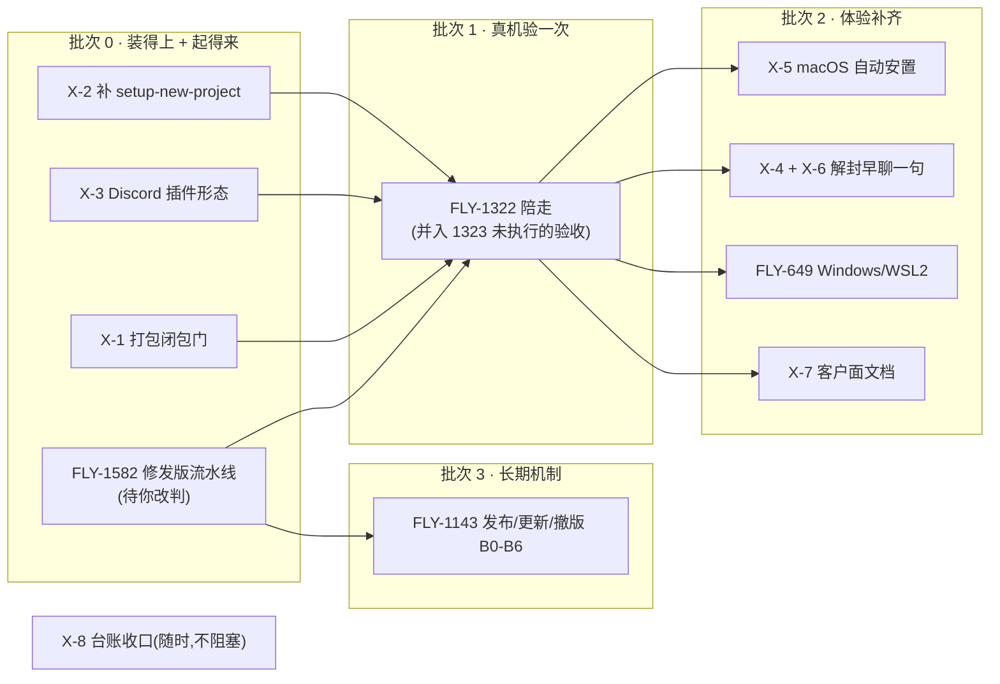

# FLY-1826 产品化现状盘点 — 事实与差距(不含结论)

Issue: FLY-1826 ([产品化·评估] 现状盘点:离「能在别人电脑上跑」还差什么)
URL: https://linear.app/geoforge3d/issue/FLY-1826
日期: 2026-08-17
基于: Linear issue 树(FLY-648/654/303/1322/679 + 审计发现的 908/910/1023/1062/1098/1143 线)· 仓库代码只读审计(`13a19c15`)· 三处线上活性探测(npm registry / Cloudflare Worker / GitHub Actions)

> **边界**:本文只给事实与差距,**不给排序、不给方案**。每条都附出处(文件:行 / issue 号 / 探测命令)。
> **未真机验证**:全部结论来自代码阅读 + 只读探测,没有在任何陌生机器上真跑过一次。凡属推断的地方逐条标注。

---

## 0. 提问人给的线索里,需要纠正的地方

| 提问人的浅扫 | 核实结果 |
|---|---|
| 「FLY-648 / 654 / 303 / 1322 / 679 = 这条线」 | **不完整**。真正交付「别人电脑上跑」的是**另一条线**:FLY-908(定位 EPIC)→ FLY-910(PRD)→ FLY-1023(Buddy 全量 build,PR #523)→ FLY-1062(npm 分发,PR #531/541/558/565)→ FLY-1098(发布 PRD)→ FLY-1143(发布 build,未开工)。这条线不挂在 648 下面(除 910 挂 908 外),所以按 648 的 children 看不见。 |
| 存在的脚本清单(8 个) | **漏了核心的几个**:`scripts/flywheel-buddy.sh`(442 行,对话式 onboarding 状态机)· `scripts/flywheel-buddy-steps.sh`(505 行,机读 step CLI)· `scripts/buddy/`(persona + 21 份用户面话术 + fixtures)· `scripts/lib/buddy-connect.sh` + `scripts/lib/buddy-connectors/`(shopify/veeqo/ordoro/imap 四个只读连接器)· `scripts/lib/agent-cli-providers/`(claude/codex + CONTRACT.md)· `scripts/linux-preflight.sh` · `scripts/release/`(6 个发布脚本)· `packages/onboard-shell/`(对外 npm 薄壳)· `packages/payload-endpoint/`(Cloudflare Worker 分发端点)。 |
| 「零 Dockerfile / compose / devcontainer」 | **确认属实**。`git ls-files \| grep -icE 'dockerfile\|docker-compose\|devcontainer'` = 0。 |
| 「FLY-654 写着容器化是前置,若容器化零代码则前置没满足」 | **前置假设已被现实绕过**。FLY-1062 的 npm payload 路线在**零容器**的情况下做出了「客户零仓库访问安装」。所以容器化不是硬前置 —— 它是 2026-06-28 立 654 时的假设,7 月走了另一条路。 |
| 「EPIC Done 是否等于这条线做完了?我怀疑是容器关闭」 | **证实了「容器关闭」这一半,但不止**。见下 §1。 |

---

## ① 纸面上说要做什么(真实关系与状态)

```mermaid
graph TD
  E648["FLY-648 EPIC 可移植+可部署<br/>✅ Done 2026-07-07"]
  E648 --> S649["FLY-649 Windows/WSL2<br/>⬜ Backlog"]
  E648 --> S650["FLY-650 可移植 provisioning<br/>✅ Done 06-30 (PR #380)"]
  E648 --> S651["FLY-651 容器化<br/>❌ Canceled(与 652 重复)"]
  E648 --> S652["FLY-652 容器化<br/>⬜ Backlog"]
  E648 --> S653["FLY-653 配置驱动项目<br/>⬜ Backlog"]
  E648 --> S559["FLY-559 云端探索<br/>⬜ Backlog"]
  E648 --> S654["FLY-654 产品化给别人用<br/>⬜ Backlog"]
  E648 --> S679["FLY-679 PM-agent flow<br/>⬜ Backlog"]

  E908["FLY-908 EPIC 产品定位<br/>✅ Done 07-08"]
  E908 --> P910["FLY-910 onboarding PRD<br/>✅ Done 07-09 (PR #471)"]
  P910 -.PRD §12 拆 BI-0..BI-8.-> B1023["FLY-1023 Buddy 全量 build<br/>✅ Done 07-09 (PR #523)"]
  B1023 --> D1062["FLY-1062 npm 分发层<br/>✅ Done 07-12 (PR #531/541/558/565)"]
  D1062 -.需要 spec.-> P1098["FLY-1098 发布 CI/CD PRD<br/>✅ Done 07-10 (PR #544)"]
  P1098 --> B1143["FLY-1143 发布 build B0-B6<br/>⬜ Backlog · 零开工"]

  Q1322["FLY-1322 全新部署陪走(真机首考)<br/>⬜ Backlog · 07-17 建单至今零动作"]

  E303["FLY-303 装成可安装的包<br/>⬜ Backlog · 06-17 立,未更新过"]
```

### 1.1 「EPIC Done」= 交付完成吗?—— 不等于。判断依据三条

1. **EPIC 关闭时,它自己的 8 个 children 里 6 个仍未完成**(649 Backlog、651 Canceled、652 Backlog、653 Backlog、559 Backlog、654 Backlog;只有 650 Done)。其中 **FLY-649 是这个 EPIC 自己标为「[immediate] 老公 ASAP」的第一优先 sub**,至今 Backlog。
2. **关闭它的 PR 只覆盖了一个切片**:FLY-648 的唯一 attachment = PR #477「flywheel-setup — one-command fresh-instance wizard + WSL2 path (rev2)」。也就是说,EPIC 是在「一条命令的安装向导 + WSL2 路径」落地那天被关的,不是在「可部署产品」达成那天。
3. **工作没停,但换了容器**:648 关闭(07-07)之后,同一件事在 908/910/1023/1062 那条线上继续跑了整整一周,并交付了远比 648 多的东西(见 §2)。FLY-303 从 2026-06-17 建单起 `updatedAt` 再没变过 —— 它描述的「可安装的包」目标其实已由 FLY-1062 实现,但 303 从没被关。

> **一句话**:648 是**行政性关闭**(它那一刀落地了就关),不是**交付性关闭**;而且真正的交付大头发生在它关闭之后、在另一棵树上。

### 1.2 两份 PRD 的成熟度(直接关系到「PRD ready 到什么程度」)

| PRD | 状态 | 拆解粒度 | 下游 build |
|---|---|---|---|
| **FLY-910** `engineering/doc/FLY-910-onboarding/prd.md`(292 行) | v3,Annie 逐小节共创收敛 + Codex design review APPROVED | §12 列了 **BI-0…BI-8 共 9 个 build issue**,每个带范围/验收/依赖顺序;§6.7 逐项标了「MVP-minimum vs 目标 vs 底座前置」 | 已由 **FLY-1023 全量实现(Done)** |
| **FLY-1098** `product/doc/FLY-1098-release-cicd/prd.md` | 定稿,8 轮 co-eval + Codex design review 4 轮 APPROVED + **Annie 2026-07-10 lgtm 放行** | §14 列了 **B0…B6 共 7 块**,含激活依赖序 | **FLY-1143 · Backlog · 从建单(07-10)至今零开工** |

FLY-910 PRD 里明确留作「不阻塞 MVP、后续做」的 5 项(§6.7 + §12 BI-0(b)):macOS clean-host 全自动 bring-up · Discord roles/webhooks 权限扩 + 幂等建 · OAuth(替换安全 token)· Codex adapter · 更多 vertical。**这 5 项至今没有对应的 follow-up issue 被建出来**(在 Flywheel team 里按关键词查不到)。

---

## ② 实际上建了什么(读代码,不读 issue 自述)

### 2.1 一条命令的完整链路 —— 存在,且比想象的完整

```
npx @flywheel-ai/onboard  ──(license key)──►  Cloudflare Worker /manifest,/payload/<ver>
        │                                              │
        │                                       R2 bucket: flywheel-payloads
        ▼
   下载 payload tarball(零仓库访问、零 TypeScript、.flywheel-prebuilt 哨兵)
        ▼
   scripts/flywheel-onboard.sh   环境检查 → preflight → model_key(装 Claude Code + 登录用户自己订阅)
        ▼
   scripts/flywheel-buddy.sh     对话式 Buddy(b0–b8 状态机,话术在 scripts/buddy/copy/,黑话有 lint 测试锁)
        │
        └─ scripts/flywheel-buddy-steps.sh(机读 step CLI)→ 12 步:
           preflight · skeleton · model_key · bots · channels · linear · github
           · config · services · finish · captain_health · digest
```

逐块核实(全部 = 存在且有实现,不是占位):

| PRD 的 build issue | 代码落点 | 核实 |
|---|---|---|
| BI-1 一条命令 + AgentCliProvider seam | `scripts/flywheel-onboard.sh`(142 行)· `scripts/lib/agent-cli-providers/{claude.sh,codex.sh,CONTRACT.md}` | ✅ 有 |
| BI-2 Buddy 本体(loop + persona + 续传) | `scripts/flywheel-buddy.sh` · `scripts/buddy/persona.md` · `brain-prompts/` · journal v2 `buddy` 区 + 白名单 key + secret-scan(`flywheel-buddy-steps.sh:171,405-408`) | ✅ 有 |
| BI-3 Discord / Linear / GitHub | `flywheel-setup.sh` `step_run_bots/channels/linear`(含 Discord API v10、权限整数、频道 post+read probe)+ `flywheel-buddy-steps.sh:65-141` `step_run_github`(gh device/web login → find-or-create repo → 首推 → ls-remote 验) | ✅ 有 |
| BI-4 业务连接器 + JIT 只读接入 | `scripts/lib/buddy-connect.sh` + `buddy-connectors/{shopify,veeqo,ordoro,imap}.sh` + `scripts/buddy/fixtures/` | ✅ 有 |
| BI-5 自动安置 + health-check | `step_run_services` → `provision-fleet-host.sh` · `step_run_captain_health`(Bridge 2xx + bot identity + 频道 post/read) | ⚠️ 见 §3-C(macOS 上不自动) |
| BI-6 早聊一句 + 第一个产出 | `scripts/lib/buddy-captain-preview.sh` · `buddy/copy/step5-early-chat.md` · `step8-first-output.md` | ⚠️ 见 §3-D(默认关) |
| BI-7 卡住转人工 | `scripts/lib/buddy-escalate.sh` + `~/.flywheel/support-summary-*.json`(脱敏) | ✅ 有 |
| BI-8 Discord 4 步素材 | 未在仓库找到截图/短视频素材 | ❌ 没找到 |

### 2.2 分发层 —— 也存在,并且**部分已经真上线了**

| 环节 | 事实 | 取证 |
|---|---|---|
| 对外 npm 薄壳 | `@flywheel-ai/onboard@0.1.0` **已公开发布在 npm 上**,发布时间 **2026-07-18T13:47Z**,maintainer `xrliannie.b` | `curl https://registry.npmjs.org/@flywheel-ai/onboard` → 200 |
| 分发端点 | Cloudflare Worker **已部署且活着**:`https://flywheel-onboard-endpoint.xrliannie-b.workers.dev` | `curl .../manifest` → **401** `{"error":"invalid or revoked key"}`(有鉴权、在跑);`curl .../` → 404 |
| GitHub 侧配置 | repo variable `FW_ENDPOINT` + `CLOUDFLARE_ACCOUNT_ID` 已配(07-18);secret `FW_BETA_PUBLISH_TOKEN` 已配 | `gh variable list` / `gh secret list` |
| 打包管线 | `scripts/package-onboard.sh`(943 行)+ `package-onboard-files.allow`(125 行显式路径白名单)+ 发布安全门(secret 扫描 / 零 .ts / 零私仓 slug / 零 git clone) | 代码 |
| 客户端到端验收测试 | `scripts/__tests__/customer-e2e-acceptance.test.sh` 存在:conditional-create → 真 payload-release → 真 promote → 真 key 签发 → fresh HOME 装 npm pack 出来的壳 → 重启端点后第二个客户仍能装 | 代码 |

> ⚠️ **这个 e2e 的诚实边界**:它跑在**同一台机器**上(fresh HOME + 本地 `serve-node.mjs` 文件系统 bucket),证明的是**链条形态成立**,不是「陌生人的电脑上跑通了」。PR #565 自己写明「真 npm publish 一次都没有发生,也发生不了」。

---

## ③ 差距清单

分档说明:**A=硬阻断**(今天陌生人走不通)· **B=半成品/默认降级** · **C=写死在本机/遗留** · **D=从没验证过**。
「粗估大小」= 小(≤1 天)/ 中(2–5 天)/ 大(>1 周),依据写在每条里 —— 这是**规模估计,不是排序建议**。

### A-1 · 分发管线已断 30 天,且客户通道从未开过 【A · 中】
- **现在的状态**:有代码,但**在跑的那条是坏的**。
- **事实**:`Payload Beta Release` 定时任务每 6 小时跑一次,**自 2026-07-18T18:22Z 起连续失败 118 次**(此前 26 次成功)。失败点固定在同一处:
  ```
  [payload-release] reserve: CAS conflict — re-reading and re-judging (attempt 1..8)
  [payload-release] reserve: CAS retries exhausted   → exit 1
  ```
  (`gh run view 31981601406 --log-failed`,2026-08-17T00:19Z)
- **更关键的事实**:`Payload Promote` workflow **一次都没运行过**(`gh run list --workflow payload-promote.yml` 返回空)。promote 是把版本切进 **customer-release** 通道的唯一动作 → **今天客户通道的指针大概率仍是 null,即没有任何版本可供客户安装**。
- **卡住的是什么**:缺代码(beta 侧 CAS reserve 的根因未诊断)+ 缺一次真发布流程(promote 需要 Annie 在 Discord 卡上点 ✅ 的 broker 动作,`FLYWHEEL_PUBLISH_BROKER` 在生产 `.env` 里**没有配**,`~/.flywheel/publish-audit.jsonl` **不存在** = broker 从未执行过任何发布)。
- **大小依据**:CAS 根因未知(可能小到一行);但 promote + key 签发 + broker 供 token 这一整段是**从未真跑过的流程**,按 runbook §1「一次性初始化」6 步 + §3 两段 promote 估中。

### A-2 · 客户机上 Captain 起不来(代码路径推断,未真机验证) 【A · 中偏大】
- **现在的状态**:**回归** —— 曾经能走,2026-08-10 之后不能了。
- **链条**:
  1. `packages/teamlead/scripts/claude-lead.sh:921-995`:Lead 启动前硬性要求 `~/.flywheel/bin/{check,update}-discord-plugin.sh` 存在且可执行,**否则 `exit 1`**(该 abort 自 2026-03-28 PR #66 起就在);并且要求 `check-discord-plugin.sh --print-contract` 的输出**逐字等于** `discord@flywheel-plugins/v1`,否则 `exit 1`。
  2. **契约那一道是 2026-08-10 PR #802 才加的**(`git log -S'DISCORD_PLUGIN_CONTRACT'` → `eb428399e`)。
  3. Buddy 在客户机上装的是一个 **no-op 守卫桩**(`scripts/lib/buddy-captain-preview.sh:44-56`),内容只有 `exit 0` —— 它**不打印任何契约字符串**。桩是 7 月写的,针对的是 #802 之前的启动器。
  4. 打包产物**不含**任何 Discord 插件件:`scripts/package-onboard-files.allow` 和 `package-onboard.sh` 的 `PO_SCRIPT_FILES` 里 **grep 不到 discord-plugin / install-discord-plugin-ops.sh / flywheel-daemon.sh**。
  5. 插件本身来自一个**本地注册的私有 marketplace**(`flywheel-plugins`,`claude plugin marketplace add <本地目录>`),陌生人的机器上不存在。
- **为什么至今没被发现**:唯一的 Captain 启动合同测试 `scripts/__tests__/flywheel-buddy-captain.test.sh` 走的是 launcher 的 **dry-run 模式**,而 dry-run 分支**明确跳过整段插件检查**(`claude-lead.sh:946-947`)。所以这条路在 CI 里结构上测不到。
- **卡住的是什么**:缺代码(桩要么补契约输出、要么启动器给 customer-mode 留合法出口)+ 缺分发件(插件 fork 怎么到客户机上,或客户机上 Lead 的 Discord 能力走别的通道)。
- **⚠️ 诚实标注**:这是**读代码路径得出的推断**,我没有在任何机器上真跑过 `claude-lead.sh` 的客户机形态。可证伪方式:在一台干净 HOME 上装桩后跑 `claude-lead.sh`(非 dry-run),看是否 `exit 1`。

### A-3 · 一条命令的另一个入口对陌生人是死路 【A · 小】
- **现在的状态**:写死的遗留路径。
- **事实**:`scripts/flywheel-onboard.sh:32,85` —— 不在 checkout 里运行时,它 `git clone https://github.com/xrliAnnie/flywheel.git`。该仓库经 `gh repo view` 确认为 **PRIVATE**。同样私有的还有 `xrliAnnie/flywheel-skills`(默认 skills 源,`flywheel-setup.sh:1291`)。
- **npm 路线绕开了它**,但这个脚本仍是仓库里的「一条命令入口」,且 `flywheel-onboard.sh` 本身**在 payload 白名单里**(`PO_SCRIPT_FILES` 第一行)—— 客户拿到的包里带着这条对他无效的回落路径。
- **卡住的是什么**:缺代码(打包时剔除/改写该回落)或缺决定(明确废弃 curl 入口)。
- **大小依据**:一处默认值 + 一条打包断言。

### B-1 · macOS 上「自动安置」不自动 【B · 中】
- **现在的状态**:有但半成品 —— 而且 PRD 早就诚实标注了(§6.7「macOS 安置 MVP-minimum 可为 guided/manual fallback」)。
- **事实**:`scripts/provision-fleet-host.sh:520-534` 的 darwin 分支里,所有动作都是 `step "..."`;而 `step()`(:151-157)**只是 `echo`**。也就是说 macOS 上 supervisor 阶段**只打印计划、不安装 launchd、不起 Bridge**。Lead 的 plist 更是明写「delegated to the real host, NOT auto-run here」。
- **后果链**:`step_run_finish`(`flywheel-setup.sh:1205-1217`)会轮询 Bridge 12×5 秒,然后报错并打印 `linear: systemctl --user status flywheel-bridge.service; darwin: bring services up per runbook §B` —— **一个非技术客户在这一步会撞上一句工程 runbook**,而这正是 PRD §5 铁律 1「绝不露工程黑话」要禁的东西。
- **卡住的是什么**:缺代码(macOS clean-host 全自动 bring-up,PRD §12 BI-0(b) 已列为 follow-up 但**没有对应 issue**)。
- **大小依据**:PRD 自己把它拆成 manifest→plist install/bootstrap→Bridge reload→bot online→Captain ping 五段真实验收。

### B-2 · 「早聊一句」默认关,北极星体验被削 【B · 中】
- **现在的状态**:有代码,**默认关**。
- **事实**:`doc/engineer/implementation/fly-1023-buddy-onboarding-runbook.md:56` —— live 预览默认关(`FLYWHEEL_BUDDY_PREVIEW_LIVE=1` 才开),原因是 **launcher 的 pane 环境机制会把 Captain 的钥匙值经 tmux 参数传递**,对客户产品违反「密钥不进命令行参数」红线。缺省行为降级为「早聊挪到安顿之后」。
- **为什么要紧**:PRD §7 step5 的设计意图是「最快给一个活的同事在回我的时刻」(time-to-first-message 是次级指标)。降级后这个时刻被推到全部安置完成之后。
- **卡住的是什么**:缺代码(launcher 侧 pane-env 参数卫生,runbook 称之为「独立 follow-up」—— 同样**没有对应 issue**)。

### B-3 · health-check 只证明管子通,不证明 Captain 会说话 【B · 小】
- **事实**:`flywheel-buddy-steps.sh:150-168` 的 `step_run_captain_health` 自己打了诚实标记 `"level":"transport-probe"`,注释写明「proves the PIPE, not that a live Captain answers」。真的「Captain 应答一条 ping」被留给真机 QA(runbook §5 第 4 项)。
- **卡住的是什么**:缺验证(见 D-1),不缺代码。

### C-1 · 客户机上没有面向客户的文档 【C/A · 中】
- **现在的状态**:几乎没有。
- **事实**:客户能看到的全部文字 = `packages/onboard-shell/README.md`(**18 行**:装、更新、换 key)。安装、排障、「我卡住了怎么办」的客户面文档在仓库里找不到。仓库里的 runbook(`fly-1023-*`、`fly-1062-*`)都是**运维/工程视角**,明写「排障时不许绕」的红线,不是给客户的。
- **卡住的是什么**:缺文档。
- **大小依据**:要覆盖 12 个步骤 × 每步失败分支 + Discord 建 bot 的 4 步截图(PRD BI-8,也没找到素材)。

### C-2 · 陌生人仍要自带一串前置 【C · 小(记录)/ 大(消掉)】
- **现在的状态**:有引导,但不是零前置。逐条事实:
  | 前置 | 事实来源 |
  |---|---|
  | **Node**(Linux/WSL2 上是 `presentCheck`,装不了只能硬阻断;monorepo 模式还要 **pnpm**) | `flywheel-setup.sh:105,120-121` deps 表 |
  | **一台 7×24 常开的机器** | PRD §2 已知取舍:「要一台 7×24 常开机器 = 会挡掉纯非技术小白」 |
  | **Discord 账号 + 自建 server + 自建 bot + 开 2 个 intent + 点邀请链接**(4 步手动,平台锁死) | PRD §8-A:bot 不能建归用户所有的 server、不能建自己、intent 只能在 Portal 开 |
  | **Linear 账号 + token** | `step_run_linear`,PRD §6.7 标注 MVP = 安全隐藏 token(OAuth 是「目标」) |
  | **GitHub 账号**(走 `gh` device/web login) | `flywheel-buddy-steps.sh:72-79` |
  | **Claude 订阅**(用客户自己的账号登录,不收 key) | `_fs_model_key_orchestrated` |
  | **license key**(经 Annie 手交) | runbook §6:明文 key 只在签发瞬间打印一次,经 Annie 手交客户 |
- **卡住的是什么**:一部分是**平台边界**(Discord 那 4 步无 API 可消),一部分是**产品定位取舍**(PRD 已明确 MVP 用户 = 「有技术直觉但非程序员」的经营者)。
- **大小依据**:把它写成一张清单 = 小;要把 Node/常开机器这类消掉 = 换部署形态(managed / 容器 / 云),= 大。

### C-3 · 许可证 key 一把都没发过,且发不出去 【C · 小(依赖 A-1)】
- **事实**:`scripts/release/license-key.mjs issue/revoke/rotate` 存在;但 runbook §6 写明**空态前置检查**:目标 entitlement 的 channel `latest` 为 null → 脚本 + 端点**双重拒绝**。A-1 里 customer-release 从未 promote → 现在签发会被拒。
- **卡住的是什么**:被 A-1 阻塞;之后是缺运营流程(谁发、发给谁、怎么记账)。

### D-1 · 零真机验证 —— 这条线一次都没在别人的电脑上跑过 【D · 中】
- **现在的状态**:没有。
- **事实**:
  - `fly-1023-buddy-onboarding-runbook.md` §5 列了 **5 项真机 QA 清单**(干净 VM linux/WSL2 + macOS 各一次全流程 · vendor 真 auth 实测 · ≤60s 北极星真机计时 · Captain 真活体拉起 + 真应答一条 ping · WSL2 浏览器回环 + gh apt source 回归),标注「QA 阶段执行」。**在仓库和 Linear 里都找不到任何一项的执行证据。**
  - **FLY-1322**(Annie 亲走全新部署 + Runner 影随记摩擦)—— 2026-07-17 建单,**至今 Backlog,`updatedAt` 与 `createdAt` 同一秒,一个月零动作**。
  - `linux-preflight.sh:5-7` 自己写着:「D3=B real-machine acceptance is gated by the founder running the provisioner on her own Linux + Windows(WSL2) boxes and reporting back」—— 这个 gate 没有关闭记录。
- **为什么要紧**:A-2 这类回归**只有真机能抓**(CI 结构上测不到),而且已经存在了 7 天以上没人知道。
- **大小依据**:FLY-1322 自己设计的方法(本机建干净 macOS 标准用户 + 陪走)= 半天到一天,加上边走边修的摩擦,估中。

### D-2 · Windows 只有 WSL2 一条路,且没验证过 【D · 中】
- **事实**:`flywheel-onboard.sh:66-69` 只接受 `Darwin|Linux`,WSL2 走 Linux 分支;runbook §5 第 5 项把「WSL2 浏览器回环 + gh apt source 回归」列为 **FLY-648 已知项**(= 已知会出问题)。**FLY-649(给老公 ASAP 的 Windows)仍是 Backlog**。
- **卡住的是什么**:缺验证 + 可能缺代码(两个已知项)。

### E-1 · 多租户 = 「各跑各的」,没有任何运营面 【结构性 · 大】
- **事实**:FLY-654 的定义就是「多租户靠各跑各的(每人独立部署、天然隔离)」。当前实现符合这个定义。但随之而来的是:**没有客户名册、没有计费、没有支持通道、没有任何客户侧可观测性**。客户卡住时的产物是本机的 `~/.flywheel/support-summary-*.json`(脱敏),要客户**自己发给支持同学**(`flywheel-onboard.sh:116`)。「支持同学」这个角色目前不存在。
- **这是刻意的 v1 取舍**(PRD §4:MVP 不做收费、不做 managed),列在这里是为了让差距清单完整,不是说它是 bug。

### E-2 · 容器化 / 云端 = 零代码 【结构性 · 大】
- **事实**:确认零 Dockerfile / compose / devcontainer。FLY-652(容器化)、FLY-559(云端)、FLY-653(配置驱动项目)全在 Backlog。
- **但注意**:「配置驱动项目」有一部分已在 provisioning 层落地(`provision-fleet-host.sh --repo-root/--state-dir/--home` 三分离 + `fs_generate_fleet_artifact` 生成 projects.json/host.json/manifest),653 作为 issue 从没开过,不代表这块完全零进展。

---

## ④ issue 描述 与 代码现实 不符之处(以代码为准)

| # | issue 怎么说 | 代码现实 |
|---|---|---|
| 1 | FLY-648 EPIC **Done** | 它 8 个 children 里 6 个未完成;关闭它的 PR 只覆盖安装向导 + WSL2 路径(§1.1) |
| 2 | FLY-654:「sub #3 容器化 + sub #4 配置驱动项目 = **前置**」 | 容器化零代码,但 FLY-1062 已在零容器下做出「客户零仓库访问安装」→ 该前置**不成立** |
| 3 | FLY-303:「Flywheel 演进为**可安装的 framework**」= 未来方向,Backlog | 该目标**已由 FLY-1062 实现**(公开 npm 薄壳 + 打包 payload + 客户零仓库访问),303 从没被更新或关闭 |
| 4 | FLY-1062 **Done**;PR 描述称「客户链条在真形态下走通」 | 走通的是**同机 hermetic e2e**(fresh HOME + 本地文件系统 bucket);真发布 PR 自己写明「真 npm publish 一次都没有发生」。此后薄壳确实在 07-18 发布了(founder-local 路径),但 **customer-release 通道从未 promote**(§A-1) |
| 5 | FLY-1023 **Done**,PRD BI-5「自动安置」验收 = health-check 全绿 | macOS 上 supervisor 阶段只打印不执行(§B-1);health-check 自标 `transport-probe`,不证明 Captain 会说话(§B-3) |
| 6 | FLY-649「[immediate] 老公 ASAP」 | Backlog,建单 2026-06-28 至今零动作;WSL2 代码路径存在但两个已知项未回归 |
| 7 | FLY-1322 描述里「FLY-519/1062 真机首考」 | 真机首考从未发生(§D-1) |

---

## ⑤ 我不确定 / 没验证的地方(不要把这些当结论用)

1. **A-2(Captain 起不来)是读代码推断的**,没真机跑过。可证伪:干净 HOME + 装桩 + 非 dry-run 跑 `claude-lead.sh`。
2. **A-1 的 CAS 冲突根因没诊断**。8 次重试在 1.2 秒内耗尽、且没有其他并发写者,这**看起来**不像真竞争,但我没有读 Worker 的 reserve 实现去证实 —— 只报现象,不报根因。
3. **customer-release 通道指针是不是 null,我无法直接证实** —— 端点要 license key 才读得到 manifest,我没有 key。我的依据是「promote workflow 零次运行 + broker 零 audit 记录 + 生产 `.env` 无 broker 配置」三条间接证据。
4. **FLY-910 PRD §12 里标为 follow-up 的 5 项有没有对应 issue**,我是按关键词在 Flywheel team 里查的,可能漏。
5. **payload 打包本身今天还能不能成功**,我没跑 `package-onboard.sh`;beta workflow 失败在 reserve 那一步,说明它之前的步骤当时是过的,但这不等于今天在本地也过。
6. 本文所有 issue 状态取自 2026-08-17 的 Linear 快照。

---
---

# 第 2 轮(2026-08-17)— 回答 Annie 的 founder_review 反馈

> Annie 第 1 轮 verdict = `passed:false`,并把范围扩了。她要四件事:
> ①【②节】「在那个之后我们的系统又变了一些…这些新改动会不会影响已有的系统?还走得通吗?」
> ②【③节】把差距转成 issue:哪些复用 / 哪些关掉 / 是否新建 / 依赖关系 / batch 怎么分
> ③【④节】不符之处也转成 follow-up issue 去 track
> ④【⑤节】能深挖的继续深挖;挖不动的另列清单给她和 Tadashi
>
> **注意:「不给结论/不排序」这条红线是 founder 本人解除的**(她明确要 batch 和依赖)。本轮据此给排序,并标明哪些是硬依赖、哪些是判断。
> **A-2 真机验证仍然不做**(HL 的理由未被推翻:干扰在跑的 fleet + 本质属 FLY-1322)。本轮深挖全部是**静态、只读**的。

## 2.0 深挖方法(为什么这次的结论比第 1 轮硬)

第 1 轮我只碰巧抓到 A-2 一条。这轮做的是**系统性闭包检查**,方法三步:

1. **确定回归窗口**。分发层激活日 = **2026-07-18**(FLY-1323 关单 13:46 → npm publish 13:47 → 同日最后一次 beta 成功 12:23)。窗口 = 7-18 → 8-17,**30 天,204 个 commit**。
2. **确定客户路径表面**。从 `scripts/package-onboard-files.allow`(125 行显式白名单)机械导出 payload 实际发的 **57 个具名脚本**。
3. **对这 57 个做双向闭包扫描**:
   - 正向:它们引用的 `~/.flywheel/bin/*.sh` 里,哪些不在 payload 里;
   - 反向:它们 `source`/调用的同级脚本里,哪些不在 payload 里。
   然后**逐条去调用点核实是硬失败还是有守卫**(这一步排掉了 3 个误报)。

## 2.1 回答问题 ①:改动确实打破了已有系统,这一类**共 6 条**,而且同一个根因

### 根因(先说这个,因为逐条补是治不完的)

**打包产物从来没有对着「真正的安装步骤」做过闭包检查。**

那个被当成护栏的 `customer-e2e-acceptance.test.sh`,在**第 68 行把入口脚本换成了一个假的**:

```bash
cat > "$stage/scripts/flywheel-onboard.sh" <<'INNER'
```

所以它证明的是「下载→校验→解包→交接跑起来」,**12 个安装步骤一步都没真跑过**。
另一个护栏 `flywheel-buddy-captain.test.sh` 走 launcher 的 **dry-run**,而 dry-run 分支在代码里**明确跳过**后面所有硬门。
→ 两个护栏都在被测对象的**上游**停住了。这就是为什么下面 6 条能一条都不被发现。

### 逐条(全部经调用点核实)

| # | 缺什么 | 后果 | 性质 | 证据 |
|---|---|---|---|---|
| **N-1** | `scripts/setup-new-project.sh` **不在 payload 里**,且无 packaged 替代 | **第 2 步(建项目骨架)直接失败** —— 12 步里的第 2 步。每一个客户装到这儿就死 | 硬 · 致命 | `flywheel-setup.sh:1077` `[ -x … ] \|\| { fs_err "setup-new-project.sh missing"; return 1; }`;allowlist / `PO_SCRIPT_FILES` / 4 个 `PO_SCRIPT_DIRS` 全部搜不到它;`flywheel-setup.sh` 的 prebuilt 分支只影响依赖表和 slug,**不跳过 skeleton** |
| **N-2** | `~/.flywheel/bin/{check,update}-discord-plugin.sh` 不在 payload,且客户机上**没有任何东西会创建它们** | 队长(Lead)启动 `exit 1`。安置完成后走 `bootstrap-services → wrapper-v2 → lead-body → claude-lead`,在 `:958` 撞死 | 硬 | 全仓唯一创建者是 `buddy-captain-preview.sh:44`(默认关,且见 N-3 已死);`grep` 确认 allowlist 零命中 |
| **N-3** | 2026-08-11(PR #806)起 `claude-lead.sh:603-607` **FATAL 要求 v2 载体** | 「早聊一句」的 live 路径**彻底死** —— `buddy-captain-preview.sh:168` 直接 `bash claude-lead.sh`,不设 `FLYWHEEL_LEAD_BODY_V2` | 硬(该功能本就默认关) | 该文件自 7-18 起 **0 commit**;它唯一设 env 的分支是 `:148` 的 `FLYWHEEL_LEAD_DRY_RUN=1` = **正好是那个契约测试的模式**,所以测试绿、真路径死 |
| **N-4** | `packages/teamlead/scripts/lib/canonical-lead-identity.sh` 不在 payload,但 `codex-lead.sh`(**在** payload)`set -euo pipefail` 下无守卫 `source` 它 | 客户若用 Codex 后端 → Lead 立即退出 | 硬 · 条件性(MVP 默认 Claude,不触发) | `codex-lead.sh:21,67-68` |
| **N-5** | `scripts/lib/discord-pointer-guard.sh` 不在 payload,但 `update-flywheel.sh`(**在** payload)无守卫 `source` 它 | `update-flywheel.sh` 是 `set -uo pipefail`(**无 -e**)→ source 失败不中止 → `:88` `if discord_pointer_cutover_required` 命令不存在返 127 = 假 → **静默走「不需要 cutover」分支** | 软 · **静默走错** | `update-flywheel.sh:18,47-49,88` |
| **N-6** | `~/.flywheel/bin/skills-sync.sh` 不在 payload | 客户机技能库**永不同步**(而且技能仓库本身是私有的) | 软 | `provision-fleet-host.sh:498,517` 只是 `step "…(see runbook)"` = 打印 |

### 我查过但**排除**的误报(3 条)——列出来是为了让这份计数可信

| 曾疑似 | 为什么不是洞 |
|---|---|
| `restart-services.sh` 不在 payload | `packaged/bootstrap-services.sh:4-12` **明确写明**它在 packaged 路径上被禁用,并由该脚本本身替代。出现在 grep 里的是解释性注释 |
| `flywheel-daemon.sh` 不在 payload | 同上,同一段注释:「hardcodes ~/Dev/flywheel — 两者在 packaged 路径 DISABLED」 |
| `~/.flywheel/bin/sync-gbrain-docs.sh` 不在 payload | `daily-standup.sh:110` 有 `[[ -x … ]]` 守卫 + 显式 `非 fatal` 注释 |

### 一条正面的事实

`scripts/release/` · `packages/onboard-shell/` · `packages/payload-endpoint/` —— **自 7-18 激活以来 0 个 commit**。
所以 A-1 那条流水线断掉**不是代码被改坏的**,更可能是服务端状态(manifest / releaseLedger)问题。
(**仍然只是推断** —— 我没有 key,读不到端点上的实际状态。)

反过来,`scripts/package-onboard-files.allow` 在同窗口有 **10 个 commit**(最近 8-14)—— 说明打包白名单**是有人在维护的**;
但 8-10 那个改 Discord 契约的 PR #802 **不在这 10 个里面** → 改硬门的人没同步改 payload。N-2 就是这么来的。

## 2.2 一个必须让你知道的事实:A-1 不是「没人发现」

**`FLY-1582`** —— 标题就是「[生产·静默] Payload Beta Release 连红 54 次 / 13 天零发布 — 卡在 reserve 的 CAS 重试耗尽,无人知晓」。

- **2026-08-01 建单**,写得非常完整:症状、可复现命令、失败日志、4 条候选方向(并明确标注「这些是候选不是结论」)、验收标准(含「workflow 变绿不算,要在端点 manifest 那侧查到产物才算」)。
- **2026-08-14 被 Canceled**。唯一一条评论:
  > 关闭依据(2026-08-14 backlog 大扫除,Annie 批注页裁决):她裁:「这个也暂时不用修,关掉吧」(P1 族批注)

**所以这不是漏掉,是你在 8-14 拍过一次「暂时不用修」。**
当时那张单**没有告诉你**的上下文,正是这份盘点补上的两条:
① 这条流水线是**客户拿到软件的唯一通道**;② **给客户的通道从头到尾一次都没开过**(promote 零次运行)。
要不要因此改判,是你的决定 —— 我只把当时缺的上下文补上。

## 2.3 另一条:FLY-1323 的验收标准从未执行

FLY-1323(激活分发层)写的验收是:**「在无私仓权限的干净环境:`npx @flywheel/onboard` 一条命令走通下载+安装引导」**。

- 它 **2026-07-18 13:46:46 关单**,npm 首发是 **13:47:50** —— **关单在发布之前 64 秒**。
- 那条验收要的「无私仓权限的干净环境」,就是 FLY-1322 那张陪走单要做的事,而 1322 至今零动作。
- 附带:1323 写的包名是 `@flywheel/onboard`,实际发布的是 `@flywheel-ai/onboard`。

## 2.4 回答问题 ②③:issue 盘点(复用 / 关掉 / 新建 / 依赖 / 批次)

### (a) 已有 issue 逐张裁定

| Issue | 现状 | 裁定 | 依据 |
|---|---|---|---|
| **FLY-1582** | Canceled(你 8-14 拍的) | **待你改判** —— 它就是 A-1,内容完整可直接开工 | §2.2 |
| **FLY-1143** | Backlog · PRD 定稿 + 你 7-10 放行 · B0–B6 已拆 | **复用**,不必新建。B1(发布)/B2(托管+许可证)/B5(客户自动更新+撤版)正好压 A-1 + C-3 | PRD §14 |
| **FLY-1322** | Backlog · 建单一个月零动作 | **复用** —— 它就是 D-1,而且是唯一能抓到 N-1…N-6 那一类的机制。**把 FLY-1323 那条没执行的验收并进去** | §2.3 · runbook §5 |
| **FLY-649** | Backlog | **复用** = D-2(Windows/WSL2) | — |
| **FLY-654** | Backlog | **改写,不要关** —— 它的「容器化是前置」已被现实推翻;剩下的实质 = C-1 文档 + E-1 运营面 | §④-2 |
| **FLY-303** | Backlog · 建单起没动过 | **关掉** —— 目标已由 FLY-1062 达成(公开 npm 薄壳 + 打包产物 + 零仓库访问) | §④-3 |
| **FLY-652 / 559 / 653** | Backlog | **保留,但去掉「654 的前置」这个定性** —— 它们现在不阻塞任何东西 | §④-2 |
| **FLY-679** | Backlog | **保留,不属本批** —— 它是客户访谈线,跟「能不能在别人电脑上跑」无关 | issue 自述 |
| **FLY-648** | Done | **不重开**。在 654 的改写里记一笔「它关闭时的 6 项未完成去哪了」 | §1.1 |
| **FLY-1323** | Done | **不重开**,把它那条没跑的验收挪进 1322 | §2.3 |

### (b) 需要新建的(8 张)

| 新建 | 内容 | 治哪条 | 大小 |
|---|---|---|---|
| **X-1** | **打包闭包门**:让 payload 对着**真实安装步骤**做闭包检查(替掉那个把入口换成假脚本的 e2e);任何被引用而未打包的文件必须让 CI 红 | N-1…N-6 的**根因** | 中 |
| **X-2** | `setup-new-project.sh` 缺失 → 安装第 2 步失败 | N-1 | 小 |
| **X-3** | Discord 插件在客户机上的形态(补件 or 给客户模式一个合法出口) | N-2 | 中 |
| **X-4** | `claude-lead.sh` v2 载体 FATAL 打死了 buddy 预览路径 | N-3 | 小 |
| **X-5** | macOS 客户机「自动安置」全自动 bring-up | B-1(= PRD §12 BI-0(b),早就写了、从没建单) | 中 |
| **X-6** | launcher pane-env 密钥卫生 → 解封「早聊一句」 | B-2(= runbook 说的 follow-up、从没建单) | 中 |
| **X-7** | 客户面文档 + Discord 4 步截图/短视频素材 | C-1 + BI-8 | 中 |
| **X-8** | **台账收口单**:把 §④ 那 7 处 issue-vs-code 不符落地(关 303 / 改写 654 / 去掉容器化前置定性 / 给 648 补未完成项记录) | 问题③ | 小 |

### (c) 依赖关系与批次



**哪些是硬依赖(技术上绕不过):**
- `X-2 / X-3 → FLY-1322`:第 2 步就死、队长起不来的话,陪走走不到第 3 步,是**浪费你的时间**。
- `FLY-1582 → FLY-1322`:没有可安装的版本,陪走没有东西可装。
- `FLY-1582 → FLY-1143`:1143 的 B1/B2/B5 全部建在那条流水线上。

**哪些是我的判断(可以改):**
- `X-1(闭包门)` 放批次 0:技术上它不阻塞任何东西,但**不放前面的话,X-2/X-3 修完还会有第 7、第 8 条**。这是「修结构 vs 逐条补漏」的取舍,不是硬依赖。
- `FLY-1322 → 批次 2`:先陪走是因为陪走会**产出新的摩擦清单**,可能改写批次 2 的内容。反过来做也行,只是可能白做。
- `批次 3 靠后`:1143 是长期机制(自动更新、撤版、判据),在「一个客户都还没装上」之前它的收益低。

**不进批次、需要你先定商业形态才能排的:**
E-1(运营面:客户名册 / 计费 / 支持通道)· FLY-652 容器化 · FLY-559 云端 · FLY-653 · FLY-920 收费模式。
这些取决于 self-host 还是 managed —— PRD 已把 managed 定为 V2,但没定时间。

## 2.5 回答问题 ④:还能深挖的 / 挖不动要交给你和 Tadashi 的

**这轮已经挖掉的**(第 1 轮的 6 条不确定项里):
- ✅「这些新改动会不会影响已有系统」→ 挖出 6 条 + 1 个根因(§2.1)
- ✅「A-1 是不是代码改坏的」→ 分发层 0 commit,排除代码回归(§2.1 末)
- ✅「A-2 有没有更早的拦截点」→ 有,N-3 的 FATAL 在 Discord 检查之前(§2.1)

**挖不动、要交给你和 Tadashi 的(4 条,附原因):**

| # | 挖不动的事 | 为什么 | 谁能做 |
|---|---|---|---|
| 1 | 端点上 `releaseLedger` / `releaseOps` 的**实际内容** —— A-1 的根因十有八九在这里 | 读它需要 ops-admin capability token,只在你/运维手里 | 你 + Tadashi(FLY-1582 那张单第 2 条验收就是要这个前后对比) |
| 2 | customer-release 通道指针**到底是不是 null** | 同上,要 license key | 你 |
| 3 | N-1…N-6 的**真机确认** | 要在一台干净 HOME 上跑非 dry-run,有干扰在跑的 fleet 的风险;HL 明确划出本单范围 | FLY-1322(你亲走) |
| 4 | 今天本地还能不能成功打出 payload | 我没跑 `package-onboard.sh`(在生产机上跑重型构建的风险) | Tadashi,一条命令 |

**本轮仍然成立的不确定项:**
- N-1…N-6 全部是**静态闭包推断**,没真机验证。每条都给了文件:行,可逐条证伪。
- A-1 根因仍未诊断(见上表第 1 条)。
- 所有 issue 状态取自 **2026-08-17** 快照;A-1 的失败次数是 as-of 值,还在涨(我取证时 118,HL 复核时 119)。

---

## 2.6 已建的 8 张单(2026-08-17,经 HL 授权建、**未派工**)

| 编号 | X 号 | 标题 | 标签 | 优先级 |
|---|---|---|---|---|
| **FLY-1835** | X-1 | 打包闭包门 —— 安装包必须对着真正的安装步骤做完整性检查 | Flywheel | High |
| **FLY-1836** | X-2 | `setup-new-project.sh` 没被打进安装包 → 客户安装第 2 步直接失败 | Flywheel | **Urgent** |
| **FLY-1837** | X-3 | Discord 插件在客户机上的形态未定 → Lead 启动被硬门拒绝 | Flywheel | High |
| **FLY-1838** | X-4 | 2026-08-11 的 v2 载体 FATAL 门打死了 Buddy「早聊一句」的 live 路径 | Flywheel | Medium |
| **FLY-1839** | X-5 | macOS 上「自动安置」只打印不执行 | Flywheel | Medium |
| **FLY-1840** | X-6 | launcher 经 tmux 参数传钥匙 → 违反密钥红线 | Flywheel | Medium |
| **FLY-1841** | X-7 | 客户能看到的文档总共 18 行 + Discord 4 步素材 | **Flywheel-Product** · no-three-stage | Medium |
| **FLY-1842** | X-8 | 台账收口 —— §④ 那 7 处不符的建议清单(执行由 HL/Annie) | **Flywheel-Product** · no-three-stage | Medium |

每张单里都写明:对应差距清单的哪一条 · 为什么不能复用现有单 · 验收标准 · 「未派工」。

**标签判断**:X-1…X-6 = 工程实现 → `Flywheel`;X-7(客户面文档/素材)、X-8(台账,且执行动作只能由 HL/Annie 做)→ `Flywheel-Product`。
X-7 在描述里写了「若 HL 判断这更像工程单请改标」(按 HL「判不准就标 Flywheel-Product,宁可错在我这边」的指示)。

**FLY-1836 标 Urgent** 是唯一一个非 Medium/High 的判断:它是唯一一条「今天每个客户都会撞上、且在流程第 2 步」的缺陷。优先级本身是可改的信号,不是裁定。

## 2.7 执行边界(HL 2026-08-17 指示,记录在案)

| 动作 | 我可以 | 我不可以 |
|---|---|---|
| 新建 issue | ✅ 直接建(已建 8 张) | ❌ 派工 —— dispatch 是 HL 和 Tadashi 的事 |
| 关闭现有 issue | ❌ | 只许**提议 + 理由 + 证据**,由 HL 或 Annie 执行。依据:关闭不可逆,关错一张会让一条线在账上凭空消失(FLY-648 前车之鉴) |
| 改现有 issue 描述 / 复用判定 | ❌ | 只许提议。理由:现有单是 Annie 读过的东西,改它等于改她的记忆 |
| 依赖 vs 顺序 | ✅ 两者都给 | 必须**分开写** —— 依赖是事实做硬约束,顺序是判断做建议,混在一起她没法只推翻其中一半 |

**优先级裁定(HL 明确)**:**founder 的指令高于 Lead 的指令。她解除的红线就是解除了,不需要 Lead 再批准一次。**
以后同类情况:founder 明确要求 > Lead 的 hold,直接按她的走,知会 Lead 一声即可,不用等回。

---
---

# 第 3 轮(2026-08-17)— 形态对齐

> Annie 第 2 轮 verdict = `passed:false`,但**不是挑错,是换目标**。原话:
> 「其实我们主要需要的就是一个做产品化的清单,现在看起来你大概已经有了,我们其实只需要这一部分。」
> 「做这个东西有一个小小的问题,就是我想再跟你**完全确认一下,我们对『产品化』的理解是否一致**,免得到时候理解不一致,最后做出来的东西四不像。」
> 要的东西:一个总的可互动 HTML,含 ① 每个 batch 做哪些 issue 的顺序 ② **产品化最终是一个什么样的形态**(跟她陈述一遍 + 给 Tadashi 陈述一遍,写详细一点)。
> 流程:HTML 给她 → 她或我发 Tadashi → 等 Tadashi 手上 feature flag 那批做完 → 开始做这一批 → 最终交给 Tadashi 的是**一份正确的 PRD**。

产出:`shape-and-plan.html`。

## 3.1 方法:三档来源标记(避免我编形态)

她要的是**校准我的理解**,不是让我发明一个形态。所以每一条都标来源:

| 标记 | 含义 | 依据 |
|---|---|---|
| **已定** | 她和 HL 白纸黑字定过 | FLY-911 定位文档(152 行,v1 final)· FLY-910 PRD(292 行,v3,Codex APPROVED) |
| **事实如此** | 没人正式拍过,但代码已长成这样 | 只读代码事实 |
| **没定** | 真的没人定过,需要她拍 | 缺口 |

**「事实如此」这一档是本轮的核心价值** —— 它是最可能「不是她要的」的部分。

## 3.2 形态陈述的骨架(一条时间线,9 站)

| 站 | 内容 | 档 | 出处 |
|---|---|---|---|
| 0 · 他是谁 | 非技术电商/social 一人公司老板;核心痛 = **持续地建+养业务软件**,不是一次性杂活;明确不服务 DIY 程序员 / 通用助手用户 / 想要零人赚钱的人。MVP 再收窄一档为「有技术直觉但非程序员」(因自托管要常开机器) | 已定 | FLY-911 §1 · FLY-910 §2 |
| 1 · 怎么拿到 | `npx @flywheel-ai/onboard` + 一把许可证钥匙;**钥匙经 Annie 手交**,签发时只打印一次 → **客户获取是手工的、无自助注册** | 事实如此 | onboard-shell README · 发布 runbook §6 |
| 2 · 要自带什么 | 常开电脑 · Discord(4 步手动,**平台锁死省不掉**)· Linear · GitHub · **他自己的 Claude 订阅** | 已定 | FLY-910 §7 step2 · §8-A |
| 3 · 装的体验 | 不是说明书,是 Buddy 陪装:一次一件 / 当场验 / 具体报错 / 可续传 / 失败两次转人工;**全程零工程黑话**(Lead/Runner/Bridge/manifest/launchd/repo/token 一律不露) | 已定 | FLY-910 §5 §6 |
| 4 · 何时算装好 | **不是「环境 ready」,是拿到第一个真结果**,目标 ≤60s | 已定 | FLY-910 §10 §7 step8 |
| 5 · 他机器上跑什么 | Bridge 常驻 + 每 Lead 一个 keepAlive 服务 + 每天 03:00 汇报;Runner 按需起 → **完整 Flywheel,不是精简版**;关机 = 团队下班 | 事实如此 | `packaged/bootstrap-services.sh` |
| 6 · 日常怎么用 | Discord + 手机;跟有名字的 Captain 说话;系统自推进,**只在要拍板时找他**;**批决定不批 diff** | 已定 | FLY-911 §3 §4 |
| 7 · 凭什么敢用 | 六道可感知保障(可读审批/能喊停/预算护栏/named Lead/结果可验/持续维护) | 已定 | FLY-911 §4.5 |
| 8 · 多客户关系 | **各跑各的**,无统一后台 → 无名册/无计费/**无支持通道**;而程序现在让客户「发给支持同学」,**这个角色不存在** | 已定(但后果没被讨论过) | FLY-654 · `flywheel-onboard.sh:116` |

## 3.3 本轮最重要的一问:「做完」指哪一档

判断:**四不像最可能从这里来**。三档差别巨大,现有单只覆盖 A + 半个 B:

| 档 | 含义 | 覆盖情况 |
|---|---|---|
| **A · 装得上** | 陌生人能独立装完并拿到第一个真结果 = **PRD 北极星,一字不多** | 现有 8 张新单 + FLY-1582 + FLY-1322 = 正好这一档 |
| **B · 用得住** | 一周还在用、能自动更新、坏版本能撤 = 定位文档的信任锚点「一试真能跑、**下周还能跑**」 | 批次 2 + FLY-1143 的一部分;FLY-911 §7 明说这条「是要争的,不是已赢」 |
| **C · 卖得出** | 收费 + 客户名册 + 支持通道 | **一张单都没有**,也没建 —— 取决于她先定商业形态 |

我给的理解是「这批做 A + 尽量把 B 做到能自动更新,C 等商业形态」,并明写**如果她要的其实是 C,这批单缺得很多、得先补商业形态层再拆**。

## 3.4 需要她拍的 6 件

1. **这批做到哪一档**(A / A+B / C)—— 最影响后面怎么拆
2. 第一批客户是谁、几个(老公?Anna 在谈的那家?)—— 决定陪走验什么、第一个产出接哪些系统
3. 自托管 → 托管版的时间和触发条件(PRD 只写 V2 没写时间)
4. 收费(FLY-920 至今 Backlog)
5. 「支持同学」这个角色 —— 建它,还是改掉那句话(诚实红线)
6. 容器化还要不要 —— npm 路线已在零容器下达成客户零仓库访问安装,FLY-652/559/653 悬着

## 3.5 一处主动澄清(没有顺着她的说法走)

她原话:「这个 HTML 其实就是你说的 **P40、P41、P42、P43**」。
实际编号是 **FLY-1835…FLY-1842**(8 张),**没有 1843**。判断为语音转写偏差,页面上一律用真实编号并显式说明 ——
顺着一个不存在的编号走,等于把它坐实。

## 3.6 本轮边界

- **只出 HTML,不出 PRD** —— 她原话「你可以先做成一个可互动的 HTML」;校准完再写 PRD 才不会白写。
- 现有 issue 仍然**一张都没碰**(HL 的执行边界,见 §2.7)。
- 形态陈述**全部有出处**,没有一条是我发明的;凡是没出处的都标成「事实如此·待确认」或「没定·需要你拍」。

## 3.7 第 3 轮修订(HL 三条约束,发布后到达 → 重做)

HL 的批准里带了三条约束,到达时我已经发布过一版。逐条:

| HL 的约束 | 我第一版的状态 | 处理 |
|---|---|---|
| **一、第三档(真的没定)做成她能逐条圈的选项,不要写成陈述句** —— 她要的是确认理解一致,不是要一份定义 | ❌ 没满足:第 ⑥ 节是表格陈述句 | **重做**:全部改成 radio,7 组 28 个选项,每组都带「先不定」出口 |
| **二、必须带一键复制 + localStorage,复制失败如实报** | ✅ 已满足 | 保留,并**扩展**到 radio(圈选也进 localStorage、也进汇总文本) |
| **三、长度 ≤6000px,撑不下就把 Tadashi 那部分拆成第二个链接** | ❌ 没满足:**实测 8251px** | **拆分**:工程版独立成 `shape-eng.html`;主页压到 **5036px**,工程页 **2966px** |

### 实测(headless Chromium 1280×900,不是估算)

```
主页  shape-and-plan.html   height=5036px   (上限 6000 ✓)
工程页 shape-eng.html        height=2966px   ✓
```

### 交互实测(不是声称)

```
radio inputs on page: 28
counter: 已回答 4 项
preview 含 档位/客户/容器/补充: true / true / true / true
highlighted labels: 3
after reload — radio kept: "A + 尽量到 B" | textarea kept: "先把老公跑通再说"   ← 持久化成立
copy(正常):   "已复制 ✓"
copy(把 clipboard 和 execCommand 双双打断): "复制没成功 — 请手动选下面的文字"
   falsely claims success: false        ← 失败不谎报,阳性对照通过
   offers manual text instead: true
```

**为什么专门验失败路径**:HL 今晚刚被 Annie 当场指出他的决策页漏了复制按钮 —— 她写了意见却收集不出来。
「复制成功」这条路径好验,**但真正会造成损失的是「失败了却显示已复制」** —— 她照着粘,粘出来是空的,这一轮就白丢了。
所以我把 `navigator.clipboard` 和 `document.execCommand` 双双打断,确认按钮如实报失败并把全文摊出来给她手选。

### HL 特别要求的一处措辞

关于她口述的「P40 P41 P42 P43」:HL 说**不要沉默地替换成真实编号** ——
「她口述转写偏差很常见,但如果我们只是静静换成别的号,她下次还会用 P40 那套叫法,而且会以为我们确认了它存在。」
所以页面顶部明写:**「你提到的 P40-P43 我这边没有对应物」** + 真实编号是 FLY-1835…1842 + 猜是语音转写偏差。
(HL 补充:FLY-1843 是他另外建的删 ElevenLabs 的单,跟这批无关。)

---
---

# 第 4 轮(2026-08-17)— Annie 的形态 verdict + 两个反问

## 4.1 她定下来的(可以进 PRD)

| 问题 | 她的答案 |
|---|---|
| 一句话形态 | **一样** |
| 8 站时间线 | **全部对** |
| **做到哪一档** | **A + 尽量到 B**(= 我给的理解) |
| 第一批客户 | **老公** |
| 托管版时间 | 等第一个客户跑顺再说 |
| 收费 | 这批不碰,继续免费给熟人 |
| 容器化 | 先不定(附反问) |

**她自己补的一条(要原样进 PRD 的 non-goals,并注明是她的判断)**:
托管/云端暂时不做 —— 理由是她判断「Colab 和 Cloud Code 也在往这个方向发展,以后很可能不需要我们自己做」;
但她同时说「**多机**已经在往这个程度发展了」。读法:云端 = 可能被平台吃掉的方向,不投;多机另说。

**一个顺带的好消息**:第一批客户 = 老公(电商)→ 第一个真产出走 **dropship 订单**,
正好是**唯一已经建好连接器的那个 vertical**(Shopify / Veeqo / Ordoro / IMAP),不用新建。

## 4.2 反问一:「支持同学是什么意思,是指那个 buddy 吗?」

**不是 Buddy。是我上一页没把三个角色说清楚 —— 表达问题,不是她没看懂。**

| 角色 | 是什么 | 什么时候在 |
|---|---|---|
| **Buddy** | 装的时候陪他的助手 | 软件 · 装完就收工 |
| **Captain** | 装完后他每天在 Discord 说话的那个 | 软件 · 一直在 |
| **「支持同学」** | **Buddy 也搞不定时接手的人** | **人 · 现在不存在** |

代码里真实发生的:某步连续失败两次 → `buddy-escalate.sh` 生成脱敏摘要 →
`flywheel-onboard.sh:116` 跟客户说「把这个文件发给我们的支持同学,他们会帮你接着弄」。
→ **程序已经替我们许了一个承诺,而我们没有兑现的人。** 要么补人,要么改话(诚实红线)。

## 4.3 反问二:「Windows 和 Mac 都要能用,容器化是不是必须的?」

**答:不必须,而且她担心的「每次出两套版本」这个成本现在实际不成立。** 三条依据(全部可核):

1. **Windows 已经有路径** —— 走 WSL2 即 Linux 分支。**不是没做,是没验过**
   (FLY-649 Backlog;runbook §5-5 列了 WSL2 浏览器回环 + gh apt source 两个已知项没回归)。
2. **不是两套版本,是一套代码 + 一个适配层** —— `scripts/lib/supervisor.sh:4` 原话:
   **「launchd (macOS) is the only load-bearing macOS coupling in the fleet runtime」**;
   同一个 provisioner 两边跑(`:7-8`),平台由 uname 派生(`:19`,Darwin→launchd / Linux→systemd-user)。
3. **分叉规模实测** —— payload 的 57 个具名脚本里**只有 12 个**含平台分支,集中在 5 个文件
   (supervisor 34 / provision-fleet-host 33 / flywheel-setup 27 / bridge-wrapper 19 / platform-deps 13 处);
   唯一 darwin-only 的**依赖**是 `cmux`,而它 `required:false`(观看器,不承重)。

**反向成本**:容器要先装 Docker(Mac 上 = Docker Desktop)→ 对非技术一人公司老板是**在「一条命令」前面又加一步**,
**跟 beachhead 的 done-for-you 定位相冲**;且容器内还要跑 tmux 会话 + Runner + Discord 出站 + 状态持久化。

**容器化真正的买家 = 云端 / 多机**(它买的是「环境一致」)。而云端她刚说暂时不做。
→ **正确的关联不是「容器化 ↔ 多平台」,是「容器化 ↔ 云端/多机」。按这批的选择,容器化不在关键路径上。**

**诚实边界**:第 2、3 条是代码事实(有出处);**「所以不必须」是我的推断,需要 Tadashi 从工程角度复核**,我不替工程拍板。
另:真正拦着 Windows 的**不是缺容器,是没人在 Windows 上真跑过**(D-2)——容器也解决不了(WSL2 里再跑容器 = 又加一层)。

`supervisor.sh` 里 `container` 已是一个 fail-loud 的桩(`:266`/`:318`,指向 FLY-652)—— 位置早就留好了,只是没实现。

## 4.4 本轮交付

`answers.html` —— 短页(**实测 2939px**,上限 6000)。三节:已定项固化(请她过目)+ 两个反问的答案(各带一格可圈选)。
交互实测:10 个 radio · 汇总含 radio+文本 · reload 后持久化 · nonce 占位零残留。

**这一轮是最后一轮校准** —— 她回完就写 PRD。

## 4.5 Annie 对两个反问的答复(第 4 轮 verdict)

| 问题 | 她的答案(原话) |
|---|---|
| 「支持同学」是什么 / 怎么办 | **「就是我,写成找我」** —— 「我们这边现在这边也只有我一个活人啊,然后我们的 customer 也只有我老公啊,那就是他有问题就来问我就行了。**第一版不太需要做什么所谓的支持同学**」 |
| 容器化 | **「这批不做,那三张单可以关」** |

**她对容器化的补充(新方向,已建 FLY-1848)**:

> 「容器化那边我目前感觉应该是不用做,但这个东西会需要去做一下 **deep research**,主要是现在 agent 的生态正在很快速的发展,那我知道现在有很多大公司他们在做**给 agent 虚拟机**这么一个东西。那我们这块**大概率可能不会用一个 container,大概是可能会需要一个虚拟机对不对?**但这个东西会需要先做很多 deep research,再决定说这个东西到底应该长成什么样子。」

**处理**:
- 建 **FLY-1848**(research · Flywheel-Product):给 agent 的隔离环境该长什么样(VM vs 容器)。里面写明它**不阻塞**产品化这批,并把「这批不做容器化」的三条事实作为前置结论写进去,防止在那张单里重开。
- 更新 **FLY-1842**:把她这两条裁决记为「**founder 已授权,执行仍由 HL/Annie**」。并要求**关那三张单之前先把 FLY-1848 链上去** —— 否则容器化这条线会在账上消失,**这正是 FLY-648 的教训**。
- **盘点 Runner 不执行关闭** —— 边界不变(她说「可以关」是授权,不是指示我去关)。

## 4.6 PRD 已落地(`prd.md`)+ 一个还阻塞的 open question

`prd.md` 写完,范围逐条对应她四轮的裁决:只服务老公 · A+尽量到B · 第一个产出 dropship · 托管/云端/收费/支持角色/容器化全进 non-goals(每条附裁决人与理由)· 10 条 requirements 链到已建的单 · 依赖与顺序分开 · 北极星沿用 FLY-910。

**🔴 唯一还阻塞批次 0 的**:`open-1` = **FLY-1582 要不要改判**。
她 2026-08-14 裁过「暂时不用修,关掉吧」,而本单补上的两条上下文(唯一客户通道 + 通道从未开过)**她至今没有就此表态** ——
第 3 轮她没提,第 4 轮我没单独问(**这是我的遗漏**,应该在 answers 那页就单独设一格)。
不改判 = 没有可安装的版本 = R10 真机陪走**没有东西可装**。
→ 本轮 `prd-review.html` 把它做成单独一节 + 4 个可圈选(改判修 / 先查根因 / 还是不修 / 先不定),并诚实写明:
**根因我查不了(要 ops-admin 钥匙),所以就算她选「修」,第一步大概率也是她自己花两分钟读一下发布台账。**

**本轮交付**:`prd.md` + `prd-review.html`(实测 **2269px**;6 radio · 8 行表格完整 · 汇总含 radio+文本 · reload 持久化 · nonce 零残留)。
