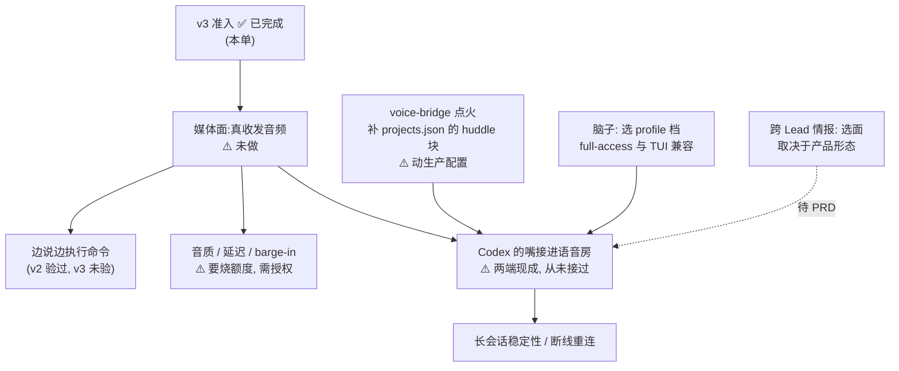

# Plan: 语音总管的实现路径 — FLY-1844

**Issue**: FLY-1844
**URL**: https://linear.app/geoforge3d/issue/FLY-1844
**日期**: 2026-08-17
**基于**: `exploration.md` · `research.md` · `decisions.md`
**状态**: 技术路径草案 — **不含产品决定,不含优先级,不含拆单**

> ⚠️ **这份文档是什么、不是什么**
>
> **是**:issue 要的那张「技术上怎么搭」的图 —— 每块有哪些走法、各自代价、以及**下一步要验什么**。
> **不是**:排期、优先级、产品形态、任务分解。那些归 Honey Lemon 与 Annie 共创(FLY-1451 红线);
> Annie 已给出走法 —— 一个 issue track、2~3 个 PRD、prototype 验形态、最后交 Tadashi(`decisions.md` D-2)。
>
> **所有选项并列摆出,本文不做推荐、不择一。**

---

## 0. 起点已经变了 —— 接手先读这一条

三周多以来这条线的前提是「v3 被服务端拒了,先解决准入」。**这个前提不成立**(`research.md` §1)。

| 项 | 旧前提 | 实测 |
|---|---|---|
| v3 准入 | 被拒,卡账号权限 | **通**。订阅身份即可,复现 2 次,后端回 SDP answer |
| 出路 | 换 API key / 换账号层级 / 等 | **都不需要**(`decisions.md` L-1 已关闭 API-key 路线) |
| 安全前置 | 必须先做 OS 级隔离才能动手 | **Annie 已否决限制方向**(`decisions.md` D-1) |

⇒ **今天没有任何一道「求人」的闸。剩下全是工时。**

---

## 1. 嘴和耳朵 —— 走哪条传输

**已定的事实**(非选项):

- v2 走 websocket;**v1 / v3 走 WebRTC**(SDP offer 以 multipart POST 到 `/backend-api/.../realtime/calls`)
- v3 **只支持 audio**,不支持 text 输出(`text realtime output modality requires realtime v2`)
- v3 音色用 v1 那张单(`juniper maple spruce ember vale breeze arbor sol cove`)
- **headless 能起 WebRTC 握手** —— 本单实测:纯 node 进程、无浏览器、无图形界面、不碰系统音频设备,
  用纯 JS 的 WebRTC 栈生成 SDP offer 即可。⚠️ **只验到握手,媒体面没走过。**

**两条并列走法:**

| | A · 走 v3 (WebRTC) | B · 走 v2 (websocket) |
|---|---|---|
| 成熟度 | 新档,`under development` 开关 | 同上,但**七月已验过完整音频闭环** |
| 客户端栈 | 需要一个 WebRTC 栈(纯 JS 的 `werift` 已验证够用) | 只需 websocket,更轻 |
| 已验证到哪 | **握手**(本单)。媒体面未走 | **全链**(FLY-1443 C1/C2:外部音频进 → 转写 → 模型语音出) |
| 未知 | 音质、延迟、barge-in、长会话、媒体面 | 同左,但少一层传输风险 |
| 代价 | 多一个 WebRTC 依赖;协议更新更易破 | 若 v2 后续被弃则要迁移(v1 已被后端标为要 `quicksilver=v2`) |

> **两条都不是「选一个就锁死」** —— 协议层是同一套 `thread/realtime/*`,换档主要是换 `version` +
> `transport` 两个参数。本单的探针两条都能跑。

**下一步要验的(按顺序,前面不过后面无意义):**

1. **媒体面**:在 v3 那条 peer connection 上真正收发音频 —— 这是本单唯一没走的一段
2. **能不能边说边干活**:七月在 v2 上验过「说一句 → 真执行命令 → 语音回报」,**v3 上没验过**
3. **音质 / 延迟 / barge-in**:⚠️ 这一步会真消耗额度,需 founder 或 Lead 明确授权
4. **长会话稳定性**:断线重连、半小时会不会崩

---

## 2. 脑子 —— 已经是既有形态,不用新造

**已核实**(`research.md` §4):Annie 那句「Codex 本身就能执行命令,只是把语音能力再加进去」在代码层成立。

- 16 个 Lead 里 **2 个**已经是 `backend: codex-app-server`
- 生产启动器已上线(`codex resume --remote` 的 windowed TUI 形态)
- 加语音 = **在同一个 Codex 会话上多开一条语音通道**,不是另起一个脑子
  ⇒ 「说话 → 它真去干活 → 再说给你听」是同一个它

**三档 profile 现状**(`codex-lead-runtime.ts:195-199`):

| profile | 语义 | 与 D-1 的关系 |
|---|---|---|
| `read-only` | companion 陪聊 | 权限最小 —— **与 D-1 方向相反** |
| `write-capable` (Z) | 网络关 + workspace-write + gateway/broker;**headless-only** | 中间档 |
| `full-access` | **Claude-equal**:workspace-write + 网络开 + 本地 gh/git,**无 confinement** | **最贴合 D-1** |

> ⚠️ **CLAUDE.md 硬规则**:生产 Codex Lead 必须是 **windowed TUI**,不是 headless app-server。
> 而 `write-capable` (Z) 档是 headless-only —— **这两条会打架**,谁要走 Z 档得先解决这个冲突。
> `full-access` 与 TUI 兼容(`codex-lead-tui-runtime.ts:839-845` 明确只放行 read-only 与 full-access)。

**读取面的现状(据实记录,不作为阻碍)**:今天没有任何一档约束读取 ——
FLY-260 做过 read-deny,被 FLY-1241 删了,全仓 grep 生产代码零命中。
按 D-1 这是**符合 Annie 要求的现状**,不需要额外开工。风险陈述见 `decisions.md` D-1,已报 Lead,不在此重复。

---

## 3. Discord 语音房那条腿 —— 减法,不是加法

**Annie 已裁决**(`decisions.md`,非选项):这部分整个要改;之前用 Gemini 自己写的,现在用 Codex 自带的,应能简化很多步骤。

**现状**(`research.md` §4):

- `packages/voice-bridge` **13,225 行**,功能完整:进语音房、DAVE opus 解密、收音(`EarsReceiver`)、
  放音(`LeadSpeaker`,含队列 / earcon / barge-in 停)、`BrainPort`、huddle 会议机制
- **今天零运行**:无 launchd plist、无进程、`projects.json` 的 `huddle` 块 = 0 → config fail-closed 起不来
- 上一次功能性改动:2026-07-17

**哪些留、哪些删:**

| 层 | 处置 | 理由 |
|---|---|---|
| 进语音房 / 收音 / 放音 / barge-in | **留** | 跟用谁的脑子无关,是纯 Discord 侧管道 |
| Gemini Live audio-direct 引擎 | **大概率删** | Codex 自带嘴耳,不用租 |
| ElevenLabs (`/eleven`) | Annie 7/23 已说可直接立单删 | 独立目录 6 文件 + 6 测试 + 2 e2e,但有约 10 处共享接线要拆 |
| `BrainPort`(text-in / text-stream-out 的 loopback) | **要重新想** | 见下 |

**`BrainPort` 是最关键的一处接缝,两条并列走法:**

| | A · 绕过 BrainPort | B · 保留 BrainPort |
|---|---|---|
| 形态 | Codex realtime 直接吃音频、吐音频,voice-bridge 只做 Discord 侧搬运 | 仍走 STT → 文本 → 脑子 → 文本 → TTS |
| 优点 | 层数最少,最贴合「用 Codex 自带的简化很多步骤」 | 复用现有 barge-in / 会议 / 纪要机制;脑子可换 |
| 代价 | 现有依赖文本缝的机制(huddle 纪要、AddressRouter、ConfirmationLadder)要重做或放弃 | 白白多两次转换,延迟叠加,而且没用上 Codex 自带的耳朵嘴 |

> ⚠️ **这一处未做真机验证**,两条都只是读代码的判断。工作量**没估** —— 估它需要真机接一次。

---

## 4. 它怎么知道别的 Lead 在干什么

**Annie 已定流程**,这一节降级为素材(`decisions.md` D-2)。四条现成的路,全部并列、不推荐:

| | 看到什么 | 代价 |
|---|---|---|
| **A** 舰队快照 `/api/fleet/snapshot` | 谁在线、跑什么活、卡在哪步。结构化、快;**loopback 免 token** | 只有骨架,看不到「为什么慢」;机器视角要翻译 |
| **B** Linear | 单子状态 / 优先级 / 负责人 —— 排优先级正需要 | 只反映记了账的,不反映此刻正在发生的 |
| **C** 读 Lead 屏幕(`terminal-mcp`:`runner_terminal_capture` / `search` / `list` / `status`) | 最真实,此刻在想什么、卡在哪句 | 量大且无结构;16 个全看一遍不便宜 |
| **D** 直接问 Lead(`flywheel-comm ask`) | 质量最高,当事人自己总结 | **要等**,与「你在语音房等着听」冲突 |

其他现成面:`/api/sessions` `/api/runs`(需 token)、`/api/standup`、`/api/digest`、
`/api/voice/*`(FLY-546 耳机 daemon 的 Bridge face)。

**四条不互斥,可以混。** 真正的产品问题 ——「你进语音房那三秒,它先说什么」—— 会反过来决定用哪几条,
属于 Annie 说的「先聊清楚要做成什么样」那一步。

---

## 5. 依赖关系(哪些能并行、哪些必须串行)



- **B 是唯一的硬瓶颈**:媒体面不通,后面全部无意义
- **E 可以完全并行**(纯配置 + 部署,不依赖 realtime 任何结论),但**动生产配置**
- **I 走虚线**:它不是技术依赖,是等 PRD

---

## 6. 风险与未知(按缺什么分类,与 `research.md` §6 同源)

**缺授权**

- 点亮 voice-bridge —— 要改生产 `projects.json`,影响正在跑的舰队
- 音质 / 延迟 / barge-in 实验 —— 会真消耗订阅额度
- ~~安全执行边界~~ —— **Annie 已否决限制方向,不再是待办**(D-1)

**缺真机**

- **媒体面**(最要紧)· v3 上边说边执行命令 · Codex 的嘴接进语音房 · 长会话稳定性
- `BrainPort` 那处接缝该绕过还是保留

**缺外部信息**

- `realtime_conversation` 何时转正 —— 仍是 `under development` 默认关,CLI 无 voice 子命令,协议随时可变
- v3 的用量 / 限流天花板 —— 未撞过

---

## 7. 复现与环境纪律(接手必读)

```
codex 0.147.0
pin  /Users/xiaorongli/.codex-mufasa/packages/standalone/releases/0.147.0-aarch64-apple-darwin/bin/codex
sha  19c4f144c5226a9f17c58e6f0fa854843b0f77a6eb420f40e2745a12f10f5d37
```

- ⚠️ **不要依赖 `~/.local/bin/codex`** —— 它是被争用的可变 symlink,在反复摆动。**pin versioned 绝对路径。**
- 探针:`evidence/admit.mjs`(websocket)· `evidence/admit-webrtc.mjs`(WebRTC,需 `werift`)
- 纪律:不写 `~/.codex/config.toml`(只用 `--enable` 单次生效)· 不碰 `codex-profile` / 不切账号 ·
  不用 `codex-with-fallback`(会触发轮换)
- 拿到 `started`/`error` 就 `stop` = 零 model turn = 额度≈0。**只有第 1 节那四步「下一步要验的」会真花钱。**
