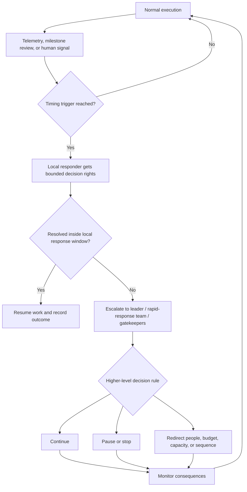
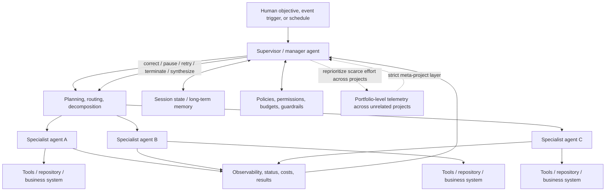

# Right-Moment Redirection in Human Organizations and AI Meta-Orchestration

## Executive summary

Human organizations do not usually solve the “right moment” problem by giving a leader more authority. They solve it by **constraining when authority is expected to activate**. Across healthcare, manufacturing, product development, software operations, and project teams, the recurring pattern is a sensing-and-escalation system: observable signals are collected; a threshold, deadline, cadence, or decision gate converts those signals into an interruption; decision rights specify who can stop, escalate, or redirect work; and a response window determines whether the issue remains local or rises to a higher level. Rapid-response medicine, Toyota’s andon system, Stage-Gate portfolio processes, Google-style error budgets, and temporal leadership practices are different implementations of this same architecture. citeturn20search12turn20search7turn21search6turn13search0turn20search2

There is no single empirical definition of the “right moment.” Studies operationalize it through proxies: deterioration detected before cardiac arrest or death; escalation immediately after a clinical score crosses a threshold; action before a takt-time production window expires; a Go/Kill decision at a pre-established development gate; reallocation when an SLO error budget is exhausted or at risk; removal of blockers during a regular coordination cadence; or completion of projects by their promised date. Thus, “right” generally means **a decision point at which intervention improves an outcome relative to intervening later or not intervening, while avoiding excessive false alarms, interruption, or premature termination**. Different research traditions measure different pieces of that tradeoff. citeturn20search1turn20search12turn20search3turn13search0turn20search2

The strongest human evidence comes from domains with explicit, machine-readable triggers. Hospital rapid-response systems provide an unusually clear test. A 2021 Cochrane review found low-certainty randomized evidence of little or no effect on several aggregate outcomes, illustrating that installing an escalation system does not automatically improve results. Yet Kaiser Permanente’s much more integrated Advance Alert Monitor—prediction, centralized monitoring, trained responders, and a defined clinical workflow—was associated in a 19-hospital staggered deployment with lower mortality after alerts; Kaiser reported a 16% lower mortality rate in the intervention cohort and an estimated average of roughly 520 deaths prevented per year during the study period. citeturn20search12turn20search21turn20search29

The evidence also shows recurrent failure modes. Timing systems fail when detection is late, signals are not relayed, responders do not act, thresholds generate unusable alarm loads, people conceal bad news, gate reviews become ceremonial, or coordination itself consumes too much productive capacity. Hospital safety research explicitly separates “failure to rescue” into failure to recognize, relay, and react. Daily-standup research similarly found that a cadence intended to surface blockers became disliked when it turned into managerial status reporting, occurred too frequently, or lasted too long. citeturn0search18turn21search2turn21search5

The costs are not incidental. A pediatric medical-emergency-team analysis estimated annual operating costs from about **$287,000 to $2.36 million**, depending on staffing configuration, while estimating that a critical deterioration event added nearly $100,000 in subsequent care relative to other ICU transfers. A conventional 15-minute daily standup mechanically consumes 0.25 person-hours per attendee per day before any follow-up work; ten people meeting on 220 workdays therefore consume about **550 person-hours per year**. Production stops, feature freezes, gate reviews, and false-positive alerts create analogous opportunity costs, although these are rarely quantified consistently in the organizational literature. citeturn21search1turn21search4turn21search5

For AI, **real supervisor-agent systems now exist**, including products in general availability. Amazon Bedrock has a supervisor agent that decomposes work among up to ten collaborators; Microsoft Copilot Studio supports parent agents delegating to separately orchestrated connected agents; ServiceNow’s AI Agent Orchestrator manages teams of workflow agents; Google’s Gemini Enterprise Agent Platform supports multi-agent orchestration, persistent state, and interoperable agents; and Cognition’s Devin can explicitly act as a manager that scopes work, spawns subordinate Devins, watches their progress, intervenes, terminates them, resolves conflicts, and synthesizes results. citeturn15search0turn15search1turn14search2turn14search1turn15search2turn14search0

However, the evidence is materially weaker for the stronger concept in the question: **a persistent “meta chief of staff” that continuously watches multiple unrelated projects, determines that priorities have changed at the organizational level, and reallocates effort from one project to another at the right moment.** In the public systems reviewed through August 18, 2026, most supervisors operate *inside a user request, workflow, incident, software task, or business process*. Devin is the closest structural match because managed Devins can span repositories and combine with recurring schedules and persistent state, but public evidence still centers on decomposing engineering objectives rather than autonomously governing an enterprise portfolio of independent projects. This conclusion is an inference from the disclosed architectures and deployments, rather than proof that no private deployment exists. citeturn14search0turn14search3turn14search15turn15search10turn14search25

Controlled AI research reinforces the distinction. A 2026 study covering **260 configurations across six benchmarks** found that multi-agent coordination ranged from **+80.8%** relative performance on decomposable financial reasoning to **−70.0%** on sequential planning; its model selected the best architecture for 87% of held-out configurations. A separate analysis of more than 1,600 traces across seven multi-agent frameworks identified 14 recurring failure modes concentrated in system design, inter-agent misalignment, and task verification. In other words, adding a supervisor creates a coordination mechanism, but does not by itself solve when delegation, interruption, or redirection is beneficial. citeturn22view2turn22view3

## What the “right moment” means empirically

“Right moment” is not normally a directly observed variable. It is inferred from a **timing rule plus an outcome criterion**. The most important distinction is between authority and activation: authority answers *who is allowed to redirect*; a timing mechanism answers *what evidence makes continued execution less appropriate than interruption or reallocation*.

| Operational meaning of “right moment” | Timing rule used | Typical criterion in evidence | Example |
|---|---|---|---|
| **Threshold crossing** | Act when a monitored variable or composite score exceeds a predefined limit | Arrest, mortality, unplanned ICU transfer, deterioration | Early-warning and rapid-response systems; NEWS2 uses score-linked escalation levels. citeturn0search2turn0search5turn20search12 |
| **Predicted future risk** | Act when estimated probability of a bad future event crosses a threshold | Mortality after alert, ICU admission, length of stay | Kaiser Permanente Advance Alert Monitor. citeturn20search1turn20search17 |
| **Response-window expiration** | Local actor gets a bounded period; escalate or stop if unresolved before it expires | Defects escaping downstream, interruption duration | Toyota andon: alert first; line stop if the leader cannot resolve the problem within takt time. citeturn20search3turn20search7 |
| **Information checkpoint** | Reassess at preselected maturity points | Launch success, profitability, portfolio impact | Stage-Gate Go/Kill reviews and portfolio reviews. citeturn21search6turn21search9 |
| **Cumulative risk budget** | Redirect when tolerated failure consumption reaches or approaches a limit | Reliability relative to SLO, feature-versus-reliability allocation | Google SRE error budgets. citeturn13search0turn13search1turn13search6 |
| **Temporal milestone** | Intervene at particular phases rather than continuously | Completion on schedule | Temporal planning at project initiation and reminders during execution. citeturn20search2 |
| **Periodic synchronization** | Surface blockers on a regular cadence | Information sharing, problem identification, subjective value, team coordination | Daily standups. citeturn21search2turn21search11 |
| **Human exception signal** | Permit people closest to the work to declare an abnormality even before metrics establish certainty | Learning behavior, defect containment, safety escalation | Toyota andon and psychologically safe speaking-up cultures. citeturn20search15turn3search20 |

These designs embody different error costs. A highly sensitive clinical alarm tolerates more false positives when the cost of missing deterioration is high; a capital-intensive development gate can tolerate longer evidence-gathering periods because killing a good project prematurely can destroy substantial option value. Error-budget systems explicitly accumulate tolerated failure over time rather than treating every failure as an immediate stop condition. Toyota’s system instead combines an immediate low-cost signal with a short local resolution window before the more expensive system-level interruption occurs. citeturn13search1turn13search2turn20search3

A useful analytical decomposition, reflected especially clearly in healthcare, is:

**Detection latency → signaling latency → decision latency → implementation latency.**

A leader can possess complete formal authority yet still redirect too late if the first three stages fail. AHRQ’s “failure to rescue” framing distinguishes failures to **recognize**, **relay**, and **react** to deterioration; rapid-response systems therefore contain both an “afferent” sensing/escalation component and an “efferent” response capability. citeturn0search10turn0search18

## Human mechanisms, evidence, and decision architecture

Across domains, the core human architecture looks approximately like this. The exact trigger differs by organization, but the separation between sensing, local response, escalation, and higher-level resource redirection recurs in healthcare, manufacturing, product governance, and reliability engineering. citeturn20search12turn20search7turn21search6turn13search0

### Formal triggers and monitoring

Hospital early-warning systems represent the purest “trigger” mechanism. NEWS2 assigns escalation intensity from observed physiological measures; in Royal College of Physicians examples, a score of 7 or more entails immediate/continuous high-level response, while lower scores produce progressively less urgent review. Rapid-response systems attach a response team to these criteria, converting the threshold into a defined organizational action rather than merely an informational dashboard. citeturn0search2turn0search5turn0search10

The empirical record is mixed. The 2021 Cochrane review found low-certainty randomized evidence that early-warning/rapid-response interventions may make little or no difference to hospital mortality, unplanned ICU admissions, length of stay, or adverse events, and moderate-certainty evidence of little or no difference on one composite outcome. Earlier meta-analyses have found associations with fewer arrests and lower mortality; this divergence partly reflects heterogeneous implementations and the weakness of many observational designs. citeturn20search12turn20search4turn20search8

Kaiser Permanente’s Advance Alert Monitor illustrates why the trigger cannot be evaluated separately from the response organization. Its system analyzed electronic patient data, sent high-risk cases to a centralized group of trained nurses, and integrated the alert into a defined clinical workflow. The staggered deployment covered 19 Northern California hospitals between August 2016 and February 2019 and the underlying NEJM analysis covered 548,838 non-ICU hospitalizations involving 326,816 patients. Kaiser’s research organization reported 16% lower mortality in the intervention cohort, while later institutional reporting estimated about 520 deaths prevented per year during the 3.5-year evaluation period. citeturn20search1turn20search21turn20search29

This illustrates a recurrent organizational mechanism: **a metric does not redirect effort; a metric attached to a protocol, staffed response capability, and escalation path does**. The less successful rapid-response literature documents exactly the converse: detection can exist without timely action. citeturn0search12turn0search18turn20search12

### Bounded local authority and escalation windows

Toyota’s andon/jidoka mechanism separates a low-cost interruption signal from the higher-cost line stop. Toyota describes jidoka as detecting problems and taking prompt action, with shop-floor workers able to signal abnormalities and, where necessary, stop production. Toyota UK’s explanation makes the temporal rule more explicit: pulling the andon does not necessarily stop the line immediately; the stop occurs if the responding team leader cannot solve the problem within the worker’s takt time. citeturn20search7turn20search3turn20search15

That means the timing logic is not simply “any worker may stop production.” It is closer to:

**abnormality detected → immediate visible signal → brief local resolution window → automatic/escalated stop if unresolved by a production-clock deadline.**

The mechanism combines decentralization of detection with centralized or team-leader response. It therefore reduces the informational problem created when only senior managers can recognize a need to redirect, while retaining a bounded period in which local correction can avoid the full opportunity cost of stopping production. The primary Toyota sources document the mechanism clearly; they do not provide a controlled causal estimate of its standalone effect on productivity or quality, so the effectiveness evidence for andon specifically is primarily operational/case-based rather than experimental. citeturn20search3turn20search7

### Gates, portfolio review, and precommitted decision rights

Stage-Gate systems address timing at a slower scale. Work proceeds through stages until reaching explicit gates at which gatekeepers make Go/Kill, prioritization, and resource-allocation decisions. Portfolio management adds periodic comparison across projects rather than evaluating each project only in isolation. citeturn21search3turn21search6

Cooper and Kleinschmidt’s benchmarking work across **161 business units** found that merely having a formal new-product process did not discriminate high performance, while a **high-quality, rigorous process** did. Their reported drivers included clear strategy, resource availability, and rigorous processes containing tough Go/Kill points; the reported coefficient for high-quality process quality was .416 against the profitability dimension and .226 against product-development impact. Because the research is cross-sectional benchmarking rather than randomized assignment, it supports an association between disciplined decision processes and outcomes rather than a causal estimate of the benefit of any particular gate. citeturn21search9turn21search0

The timing mechanism here is **precommitment**. A project leader does not wait indefinitely for an intuitive moment to reconsider the project. The organization specifies in advance when a project must expose itself to broader comparison and which decision-makers can remove resources. The known failure mode is ceremonial governance: projects can pass through formal gates without genuinely difficult Go/Kill decisions. Cooper’s benchmarking result that formal process presence alone had no performance association is directly consistent with that distinction. citeturn21search6turn21search9

### Dynamic budgets and incentive alignment

Google’s SRE error-budget mechanism creates a continuous trigger rather than a fixed calendar gate. An SLO defines the target level of reliability, and the difference between perfect performance and the SLO becomes an “error budget.” Google describes tracking it on daily or weekly horizons, with higher-level monthly or quarterly assessment, and attaching a policy specifying consequences when the budget is exhausted. citeturn13search0turn13search1

The important organizational property is that **the trigger is agreed before the conflict occurs**. Product development and reliability groups jointly accept a measurable level of failure; when the service is in danger of missing the SLO or exhausts the budget, feature work can be deprioritized or frozen while reliability work receives higher priority. Google documents feature freezes and high-priority reliability work as consequences in its SRE engagement model. citeturn13search0turn13search6turn13search10

This is simultaneously a metric, governance arrangement, decision-rights mechanism, and incentive mechanism. Instead of asking a senior executive to adjudicate every dispute between shipping features and improving reliability, the pre-agreed budget converts observed reliability into a resource-allocation event. Google’s published Evernote and Home Depot cases describe real adoption and organizational effects, but these are case studies rather than controlled estimates of productivity or financial return. citeturn13search3

### Temporal leadership and recurrent synchronization

Not all timing mechanisms are thresholds. Some work by making leader behavior phase-specific. In a 2023 study of **62 application-development project teams**, Siddiquei, Fisher, and Hrivnak separated temporal leadership into **temporal planning at project initiation** and **temporal reminders during execution**. Together those two temporal behaviors accounted for 91.7% of the predictable variance assigned among the leadership predictors; in models containing all four predictors, the set explained 39% of variance in timely project completion, while conventional initiating structure did not contribute significantly. In regression with controls, temporal planning had a significant coefficient of β=.52, whereas the other listed leadership predictors were not significant. citeturn20search2

The study is particularly relevant because it compares *when* leadership behaviors occur rather than merely whether a leader is directive. The criterion is **timely project completion**, not generic leadership ratings. The design remains observational rather than experimental, so selection and common organizational causes remain possible explanations. citeturn20search2

Daily standups use a still simpler timing device: a frequent coordination clock. Stray and colleagues studied 12 software teams, interviewed 60 people, and observed 79 standup meetings. Participants valued information sharing and opportunities to identify and solve problems; negative reactions arose when meetings became reports to the manager, occurred too frequently, or ran too long. Thus the same mechanism that lowers the maximum time a blocker can remain invisible also creates recurrent coordination overhead. citeturn21search2turn21search5

### Signaling culture

Formal triggers only detect what their sensors can observe. Organizational cultures therefore use human exception signaling as a complementary channel. Edmondson’s foundational field research on psychological safety associated a shared belief that interpersonal risk-taking is safe with team learning behavior. In timing terms, the mechanism matters because bad news can reach decision-makers before it is formally undeniable; the empirical literature establishes stronger evidence for speaking up and learning behavior than for an exact causal estimate of how many minutes or days earlier a strategic redirection occurs. citeturn3search20

Toyota’s andon system institutionalizes the same principle structurally by making abnormality signaling a legitimate front-line action rather than a request for managerial permission. Healthcare escalation research documents the reverse failure mode: professional boundaries, governance ambiguity, response-team behavior, and local culture can prevent escalation even when a formal early-warning score exists. citeturn20search15turn0search12

## Costs, effectiveness, and recurrent failure modes

The evidence is strongest when a mechanism has both a measurable trigger and a measurable adverse event; it becomes weaker as the outcome moves toward broad constructs such as “portfolio success” or “organizational agility.” The following strength labels are analytical summaries: **higher** means systematic/randomized or large quasi-experimental evidence is available; **moderate** indicates structured field/benchmark studies; **lower** indicates mainly operational cases or descriptive evidence.

| Mechanism | Evidence on effectiveness | Evidence strength | Main failure mode | Reported or observable cost |
|---|---|---:|---|---|
| **Clinical early-warning + rapid response** | Systematic evidence is inconsistent: the 2021 Cochrane review found little/no difference on several outcomes with low-to-moderate certainty, while other meta-analyses find reduced arrest/mortality associations. citeturn20search12turn20search4 | Higher, but mixed | Alarm without timely relay/response; false alarms; understaffed responders; hierarchy/culture. citeturn0search12turn0search18 | Pediatric MET estimate: **$287,145–$2,358,112/year**, depending on staffing. citeturn21search4 |
| **Integrated predictive alert + dedicated workflow** | Kaiser AAM associated with 16% lower mortality among alerted intervention patients; 19-hospital deployment and very large population. citeturn20search21turn20search1 | Moderate-to-higher quasi-experimental | Model drift, false positives, workflow noncompliance, staffing and integration requirements | Dedicated monitoring staff, data integration and response workflow; the cited evaluation did not publish a simple all-in per-alert implementation price. citeturn20search17 |
| **Toyota andon/jidoka** | Long-lived operational mechanism; direct causal effect of andon isolated from the broader Toyota Production System is not quantified in the primary sources reviewed. citeturn20search7turn20search15 | Lower causal, strong mechanism evidence | Excessive stopping or suppressed signaling; local resolution failing before takt deadline | Lost line throughput during stops; team-leader response capacity; primary sources reviewed provide no normalized dollar cost. citeturn20search3 |
| **Stage gates / portfolio reviews** | Benchmarking across 161 business units associates rigorous NPD process quality and tough Go/Kill discipline with stronger performance; mere formalization did not. citeturn21search9 | Moderate correlational | Rubber-stamp gates, sunk-cost escalation, gaming forecasts, too-late cancellation | Review preparation, executive attention, delayed work while awaiting decisions, and option value lost from false kills; normalized costs are rarely reported in this evidence base. citeturn21search6turn21search9 |
| **Error budgets / SLO governance** | Published Google, Evernote, and Home Depot cases show real adoption and explicit feature/reliability tradeoffs; no randomized productivity estimate. citeturn13search3turn13search6 | Lower-to-moderate case evidence | Bad SLI/SLO selection, gaming exclusions, feature freezes after misleading alerts | Observability/instrumentation, governance work, plus opportunity cost of deferred feature work; Google explicitly identifies the reliability-versus-innovation tradeoff. citeturn13search1turn13search5 |
| **Temporal planning + reminders** | 62 project teams: temporal leadership predicted timeliness much better than generic initiating structure. citeturn20search2 | Moderate correlational | Plans become stale; reminders become noise; leader over-coordinates | Leader planning and monitoring time; no standardized monetary estimate in the study. citeturn20search2 |
| **Daily standups** | Qualitative field evidence supports rapid blocker/information exchange but identifies substantial dissatisfaction under poor implementations. citeturn21search2turn21search18 | Moderate qualitative | Status-report theater, excessive frequency, meeting duration, interruption | A common 15-minute cadence implies 0.25 person-hour per attendee/day; ten attendees × 220 days = **550 person-hours/year**, excluding follow-up. The 15-minute norm is described in the empirical study. citeturn21search5 |
| **Psychological safety / speaking up** | Field research associates psychological safety with learning behavior; direct intervention-timing effect usually not the measured endpoint. citeturn3search20 | Moderate for voice/learning; lower for redirection timing | Silence, authority gradients, punishment for false alarms | Training, managerial attention, and potential short-term conflict; monetary costs seldom isolated. citeturn0search12 |

Two cost patterns recur across mechanisms.

First is **standing capacity**: teams pay continuously so that a response capability is available before the crisis. Rapid-response teams are the clearest quantified case. Bonafide and colleagues estimated annual pediatric medical-emergency-team costs ranging from roughly $287,000 for a nurse/respiratory-therapist configuration with concurrent duties to approximately $2.36 million for a more dedicated staffing configuration. Their analysis also estimated nearly $100,000 of additional post-event costs for patients experiencing critical deterioration relative to other ICU transfers, which makes explicit the tradeoff between preparedness cost and late-response cost. citeturn21search1turn21search4

Second is **coordination tax**. Gates consume executive and project-team time; standups consume recurring team time; alarms consume responder attention; SLO enforcement can suspend feature throughput; and stop-the-line systems deliberately sacrifice immediate production. These costs grow with false-positive frequency. The organizational literature often measures the benefits of coordination more readily than its full time cost, which makes exact cross-mechanism cost-effectiveness comparisons infeasible from published studies alone. citeturn21search5turn13search2turn20search3

There is also a structural failure that cuts across all of them: **authority can be centralized while information is decentralized**. Gatekeepers cannot kill a failing project whose forecast has been sanitized; a medical response team cannot intervene in a patient no one escalates; senior operations managers cannot redirect engineering before the relevant reliability telemetry reaches them. Mechanisms such as andon, psychological safety, automated alerting, and near-real-time SLO metrics primarily change the *arrival time and credibility of information*, not the legal authority of the eventual decision-maker. citeturn20search15turn3search20turn20search21turn13search5

## AI meta-orchestrators in actual products and deployments

For the AI part, it is useful to distinguish four levels analytically.

A **tool orchestrator** chooses among tools or APIs. A **workflow supervisor** manages multiple agents inside one objective. A **domain orchestrator** manages several continuing workflows or agents in a business domain. A strict **cross-project meta-agent** would persist across independent projects, maintain a portfolio-level model of priorities and resource constraints, notice when conditions have changed, and redirect effort among those projects without requiring each reallocation to originate as a new human task. The first three categories are now demonstrably deployed. Public evidence for the fourth remains sparse.

The typical disclosed architecture is:

The solid-line portion closely matches documented systems such as Devin, Amazon Bedrock, Copilot Studio, and ServiceNow. The dotted portfolio layer is the stronger “meta chief of staff” capability for which public deployment evidence is much thinner. citeturn14search0turn15search0turn14search2turn14search16

| System / vendor | Status and date | Architecture and scope | Evidence of real use or deployment | Reported performance evidence | Cost evidence | Match to strict cross-project meta-agent |
|---|---|---|---|---|---|---|
| **Cognition Devin — Managed Devins** | **Live product, March 19, 2026**. citeturn14search0 | Main Devin scopes work, creates subordinate Devins in isolated VMs, assigns work, reads trajectories, monitors progress, messages/corrects children, resolves conflicts, pauses/terminates them and synthesizes results. Scheduled Devins add recurring execution and state across runs. citeturn14search0turn14search3turn14search15 | Cognition describes enterprise deployment of Devin broadly and cases involving many concurrent agents; public evidence specifically isolating the new manager feature is thinner than evidence for Devin overall. citeturn6search25turn6search26 | Vendor cases report 5–6× faster migrations in some enterprise work and broader efficiency gains, but these are not controlled evaluations of Managed Devins specifically. citeturn6search25turn6search26 | Free; Pro **$20/mo**; Max **$200/mo**; Teams usage-based with **$80/mo minimum**; Enterprise custom. Child sessions consume ACUs, so parallelism increases usage. citeturn19search0turn14search0 | **Closest public structural match**, but demonstrated scope is predominantly software tasks/repositories; no public proof of autonomous enterprise-wide project-portfolio reallocation. |
| **ServiceNow AI Agent Orchestrator** | Announced Jan. 29, 2025; **available March 2025 and subsequently GA**. citeturn14search1turn14search19 | Builds/manages teams of agents around agentic workflows; Orchestrator coordinates multi-step planning while worker agents execute tools; integrated with ServiceNow workflow/data layers. citeturn14search16turn14search25 | ServiceNow said it had nearly **1,000 signed AI-agent customers** at announcement; this establishes commercial agent adoption, not that all were using the Orchestrator. citeturn14search1 | ServiceNow has published platform/customer outcome metrics, but public metrics generally do not isolate the causal contribution of the Orchestrator from the rest of the platform. citeturn8search14 | At 2025 launch, Orchestrator/Studio were included at no additional license cost for Pro Plus and Enterprise Plus customers under consumption-based usage; 2026 packaging uses broader AI tiers and custom enterprise quotes. citeturn14search1turn8search23turn8search5 | **Domain/workflow orchestrator.** Can span departments and enterprise systems, but disclosed behavior is goal/workflow-centric rather than portfolio-priority management. |
| **Amazon Bedrock multi-agent collaboration** | **GA March 10, 2025.** citeturn15search0turn15search4 | Hierarchical supervisor breaks a request into subtasks, delegates to collaborator agents and consolidates results. Current documented limit: **10 collaborator agents per supervisor**. citeturn15search1 | AWS product is GA; an AWS Rocket case describes specialized agents cooperating within the homebuying journey. citeturn5search24 | AWS initially reported “marked” internal benchmark improvements but did not publish comparable numeric results on the launch page. Broader controlled MAS research shows benefit depends heavily on task decomposability. citeturn15search0turn22view2 | Usage primarily compounds model-inference and agent-service consumption; Bedrock/AgentCore pricing is consumption-based with no upfront minimum for AgentCore. citeturn19search3turn19search9 | **Workflow supervisor**, not demonstrated as a persistent cross-project portfolio manager. |
| **Microsoft Copilot Studio connected/multi-agent orchestration** | Multi-agent orchestration announced at Build **May 19, 2025**; current 2026 documentation describes connected agents and cross-app orchestration. citeturn14search26turn14search5 | A parent agent delegates part of a request to separate child agents that retain their own orchestration, tools, knowledge, permissions and transcripts; agents can also respond to autonomous triggers. citeturn14search2turn14search11 | Public documentation demonstrates deployable product capability; reviewed sources did not establish a named customer running a persistent cross-project supervisor with autonomous portfolio authority. | Microsoft explicitly notes separate parent/child transcripts and the need to correlate telemetry, illustrating real coordination/observability overhead. Public controlled multi-agent outcome metrics are limited. citeturn14search2 | **25,000 Copilot Credits for $200/month** per capacity pack, with pay-as-you-go also available; different actions consume different credit amounts. citeturn14search8 | **Workflow/cross-app supervisor**; structurally capable of reaching agents in other domains, but no reviewed evidence of independent portfolio reprioritization. |
| **Google Gemini Enterprise Agent Platform** | Launched **April 22, 2026** as the successor/evolution of Vertex AI’s agent platform. citeturn15search2 | Agent Runtime, Sessions, persistent Memory Bank, observability, identity/gateway controls, Agent2Agent support and multi-agent orchestration. Google explicitly markets running multiple agents simultaneously for workflows such as product launches. citeturn15search10turn19search5turn19search8 | Production platform with GA runtime components; Gemini Enterprise can register agents hosted in different **Google Cloud projects**, including cross-project ADK-agent registration. “Project” there is a cloud administrative boundary, not evidence of business-project portfolio management. citeturn15search22 | Google customer cases report large workflow improvements for individual agent uses, but reviewed evidence did not isolate a general multi-agent supervisor’s causal performance. citeturn5search7 | Consumption includes model usage and platform services; Memory Bank billing is scheduled to begin **September 1, 2026** under the published pricing schedule. citeturn19search2 | **Long-running multi-agent platform**, technically close in infrastructure, but the platform provides orchestration primitives rather than publicly demonstrating an autonomous enterprise portfolio chief. |
| **Anthropic Claude Code agent teams** | **Research preview, February 5, 2026.** citeturn15search3 | Lead/coordination agent assigns tasks to parallel Claude sessions; independent agents can work on a shared codebase and communicate through team structures. Best suited, according to Anthropic, to decomposable independent/read-heavy work. citeturn15search3turn6search6turn6search12 | Anthropic used a 16-agent team internally to build a Rust C compiler through nearly **2,000 Claude Code sessions**. citeturn15search19 | That stress test produced about **100,000 lines** and a compiler capable of building Linux 6.9 for x86, ARM and RISC-V; it cost about **$20,000 in API usage**. This is an internal engineering demonstration, not an enterprise comparative trial. citeturn15search19 | Claude Code enterprise usage averages about **$13/developer/active day** and **$150–250/developer/month**; multiple instances/automation can materially increase this. Anthropic describes agent teams as token-intensive. citeturn19search1turn6search9 | **Prototype/task supervisor**, not persistent multi-project governance. |
| **C3 AI / C3 Code** | Commercial capability described in C3 AI’s **April 30, 2026 SEC filing**. citeturn16search1turn17view2 | C3 Code “orchestrates multiple AI agents working in parallel” against enterprise data to build applications. A C3 AI patent separately describes an orchestrator supervising many agents/tools, selecting agents iteratively, and operating across enterprise systems. citeturn17view0turn18view0 | SEC filing is strong evidence that the issuer represents the feature as part of its product; reviewed filing excerpts do not supply named deployments demonstrating cross-project autonomous orchestration. citeturn17view2 | Filing claims reduced development time/resources but does not provide a controlled numeric multi-agent comparison in the cited disclosure. citeturn16search1 | Enterprise pricing is not quantified in the cited filing. | **Strong architecture evidence, weaker deployment-specific evidence**; disclosed use is application-development orchestration, not project-portfolio control. |
| **CrewAI Enterprise** | Startup/platform launched 2024; investor materials report **150 enterprise customers within six months** and **$18 million total funding** by Oct. 2024. citeturn16search4turn16search0 | Central platform for designing, deploying, monitoring and iterating “crews” and multi-agent workloads. citeturn16search23 | Investor/VC evidence establishes commercial uptake; the framework lets customers define supervisor-like multi-agent processes. citeturn16search4turn16search28 | No controlled cross-project supervisor metric was identified in the reviewed investor/product evidence. | Public investor material documents funding rather than a normalized orchestration price. citeturn16search0 | **Multi-agent development/orchestration platform**, not evidence of a self-directing corporate meta-chief. |
| **UiPath agentic orchestration patent family** | U.S. patent **US12412138B1**, published Sept. 9, 2025; assigned to UiPath. citeturn18view3 | Patent describes orchestration of AI agents, RPA robots, third-party agents and humans across end-to-end processes, including deployment, monitoring, optimization, scaling and security. citeturn17view1turn18view2 | **Patent evidence only for the architecture in this analysis**; a patent is not evidence that the claimed configuration was deployed. | Not an evaluation. | Not a pricing source. | Important evidence of industry design direction, **not deployment proof**. |
| **Infosys Topaz AI Next** | Described in Infosys’s 2026 Form 20-F. citeturn16search24 | Issuer describes a unified AI platform for orchestration of complex multi-agent enterprise workflows across humans and agents. citeturn16search24 | SEC disclosure establishes a commercial company claim; the cited filing does not demonstrate a persistent independent project-portfolio agent. | No isolated supervisor metric in the cited disclosure. | No normalized orchestration price in the cited disclosure. | **Enterprise workflow orchestration claim**, not demonstrated portfolio-level autonomy. |

Several distinctions in this table are important.

**“Multi-project” is frequently ambiguous in vendor materials.** An agent platform can connect to many source-code repositories, SaaS systems, departments, or cloud “projects” while still executing one higher-level request. Google’s documentation, for example, explicitly supports agents hosted in different Google Cloud projects, and Devin can distribute work across repositories, but neither fact alone demonstrates autonomous prioritization among unrelated business initiatives. citeturn15search22turn14search0

**Persistence is now real.** Google provides long-running runtime, session state, and persistent Memory Bank; Devin can schedule recurring sessions that retain state; AWS AgentCore supports memory; and enterprise agent platforms increasingly include tracing and observability. The technical prerequisites for a continuing meta-agent therefore exist independently of whether organizations have delegated portfolio-level redirection authority to one. citeturn14search3turn19search5turn19search8turn15search9

**Intervention in subordinate work is also real.** Devin explicitly lets the manager observe individual child sessions, send corrections, pause or terminate agents, and monitor their compute consumption. This is closer to a human manager’s mid-course redirection than simple router architectures that pick a specialist once and wait for a result. citeturn14search0

What remains poorly evidenced is the final layer: **discovering, without being asked, that Project A has become less valuable than Project B and moving scarce effort accordingly**. Current public systems overwhelmingly receive their objective, workflow trigger, schedule, or task boundary from humans or deterministic enterprise automation. That is the principal empirical gap between today’s deployed supervisor agents and the stronger “meta chief of staff” concept. citeturn14search2turn15search0turn14search25turn14search3

## Multi-agent performance, costs, and AI failure modes

The available controlled evidence gives no general result that “more hierarchy” or “more agents” improves performance.

The April 2026 revision of *Towards a Science of Scaling Agent Systems* evaluated **260 configurations**, five canonical architectures—single-agent plus independent, centralized, decentralized, and hybrid multi-agent designs—across six benchmarks and three LLM families. Relative performance ranged from **+80.8%** over a single-agent baseline on decomposable financial reasoning to **−70.0%** on sequential planning. Coordination returns diminished as underlying single-agent capability rose, tool-heavy tasks incurred multi-agent overhead, and systems without centralized verification propagated errors more readily. The authors’ predictive framework selected the highest-performing architecture for **87% of held-out configurations**. citeturn22view2

That experiment is directly relevant to the “right moment” problem. A supervisor has at least three timing decisions: **when to decompose**, **when to intervene in a subordinate trajectory**, and **when to stop coordinating and synthesize**. The −70% result on sequential tasks demonstrates that invoking cross-agent coordination at the wrong structural moment can be much worse than leaving the task with one agent; the +80.8% result shows the opposite on genuinely decomposable work. citeturn22view2

The MAST study examined more than **1,600 annotated traces from seven multi-agent frameworks**. Expert analysis produced **14 failure modes** grouped into system-design problems, inter-agent misalignment, and task-verification failures; the taxonomy-development annotation achieved κ=.88 inter-annotator agreement. The study’s starting observation was that multi-agent performance gains are often small despite substantial system complexity. citeturn22view3

These findings resemble familiar organizational failures. An AI supervisor can mis-specify a subordinate’s task, just as a human manager can delegate ambiguously; agents can pursue locally coherent but mutually inconsistent plans, analogous to siloed project teams; and supervisors can fail to verify a result before accepting it, analogous to ceremonial gate reviews. The analogy is analytical, but the underlying AI failure categories are directly observed in MAST. citeturn22view3turn21search9

Cognition’s experience provides operational evidence about the same problem. Its April 2026 discussion of multi-agent engineering says its live design resembles “manager splits work → children execute → manager synthesizes,” rather than an unstructured swarm. Cognition reports problems when managers become overly prescriptive, when subordinate agents incorrectly assume shared state, and when context needed for coherent delegation is not explicitly propagated. citeturn14search15turn6search0

Costs also scale differently from traditional software orchestration. A conventional deterministic router costs little relative to the workers it invokes; an LLM supervisor itself performs inference, and every child may be another full model session. AWS’s own agentic cost guidance explicitly warns against using AI supervisors for deterministic routing because model-based routing creates unnecessary inference cost, and recommends tracking orchestration cost separately from worker cost. This is descriptive evidence of an economic distinction increasingly recognized by vendors themselves. citeturn15search32

Anthropic provides the clearest concrete demonstration of how large that bill can become. Its 16-agent compiler experiment used nearly 2,000 Claude Code sessions and approximately **$20,000 of API spend**. Anthropic’s general Claude Code enterprise telemetry places ordinary single-developer usage much lower—about $13 per active developer-day and $150–250 per developer-month—showing how intensive parallel-agent work can move into a different cost regime. citeturn15search19turn19search1

Devin’s architecture similarly makes the scaling mechanism visible: each managed child is a complete Devin with its own VM, terminal, browser, and development environment, and the manager interface explicitly exposes per-child ACU consumption. In such systems, the marginal cost of delegation is not merely another function call; it is another stateful agent trajectory plus the supervisor’s coordination work. citeturn14search0

The result is an AI analogue of the human coordination tax. Human organizations spend meetings, review time, reserve staffing, and interruption capacity to detect the right redirection moment; agent systems spend tokens, runtime, memory/state operations, telemetry, tool calls, verification, and sometimes redundant work. Both can lose more from coordination than they gain when the task is tightly sequential or the signal for intervention is poor. citeturn21search5turn21search4turn22view2

## Empirical picture across human and AI systems

The cross-domain evidence supports several descriptive conclusions without implying a preferred organizational design.

**Authority and timing are separate organizational variables.** In the strongest human mechanisms, decision rights are coupled to an activation rule. NEWS2 links physiological scores to escalation; Toyota links unresolved abnormalities to takt time; Stage-Gate links continued investment to review points; SRE links engineering priorities to accumulated error-budget consumption; temporal leadership links different leader behaviors to different phases of a project. citeturn0search5turn20search3turn21search6turn13search6turn20search2

**The “right moment” is usually engineered as a boundary, not discovered by leader intuition.** That boundary may be numerical, temporal, predictive, event-driven, or social. Human judgment remains inside the response process, but the organization reduces reliance on leaders spontaneously noticing the need to act. citeturn20search21turn13search0turn20search15

**The most successful-looking systems combine sensing with a response institution.** Kaiser’s integrated alert program did not merely calculate risk; it connected the model to centralized trained nurses and a clinical response workflow. Toyota does not merely display an abnormality; the andon calls a responsible leader and places resolution inside a production-clock window. Error budgets do not merely chart reliability; a pre-agreed policy changes allowable development behavior when the budget is depleted. citeturn20search21turn20search3turn13search0

**Formalization alone is weak evidence.** Cochrane’s rapid-response review found that the presence of EWS/RRS machinery often did not produce clear aggregate outcome gains, and Cooper’s product-development benchmarking found that merely having a formal process was unrelated to strong performance while process quality differentiated outcomes. Both literatures separate “a mechanism exists” from “the mechanism reliably changes behavior at the moment it matters.” citeturn20search12turn21search9

**Earlier detection has a price.** Higher-frequency sensing generates alarms, meetings, review events and interruptions. The pediatric rapid-response example shows standing staffing costs reaching millions of dollars annually; recurrent 15-minute coordination scales into hundreds or thousands of team-hours; stop-the-line and feature-freeze mechanisms explicitly sacrifice immediate throughput. Those costs are part of the timing system rather than implementation noise around it. citeturn21search4turn21search5turn13search6turn20search3

**AI has reached genuine hierarchical orchestration, but mostly below the portfolio level.** Devin, Bedrock, ServiceNow, Copilot Studio and Claude Code all provide versions of a supervisor/child-agent pattern; Google supplies infrastructure for persistent, interoperable, long-running agents. Patents from UiPath and C3 AI show that enterprise vendors are explicitly designing orchestrators above heterogeneous agents, software robots, tools, and in UiPath’s case people. citeturn14search0turn15search0turn14search16turn14search2turn15search3turn19search5turn18view2turn18view0

**What has not been convincingly demonstrated publicly is an AI analogue of enterprise portfolio governance with endogenous timing.** The missing evidence is not “can an AI call other agents?”—that is established. It is evidence that one persistent AI observes several unrelated projects, maintains organization-level priorities and constraints, detects that the value of continuing one has changed relative to another, initiates a resource shift on its own, and then monitors whether that redirection was timely. The reviewed public deployments stop mainly at task, workflow, domain, incident, or development-program orchestration. This statement is a research finding about available public evidence through August 18, 2026, not a claim that no private system has been built. citeturn14search0turn14search1turn15search0turn14search2turn15search2turn17view2

Finally, **current multi-agent evaluations suggest that the timing problem becomes harder, not easier, when AI is added above other agents**. The supervisor must decide not only what work belongs where, but when coordination is worth its extra inference, context, latency, and error-propagation costs. The controlled scaling study’s span from +80.8% to −70.0% depending on task structure, together with MAST’s 14 observed failure modes, is the clearest current empirical evidence that “having a meta-agent” and “redirecting at the right moment” remain separate capabilities. citeturn22view2turn22view3

---

## Sources (resolved URLs)

1. https://arxiv.org/abs/2503.13657
2. https://arxiv.org/abs/2512.08296
3. https://aws.amazon.com/bedrock/pricing/
4. https://aws.amazon.com/blogs/aws/introducing-multi-agent-collaboration-capability-for-amazon-bedrock/
5. https://aws.amazon.com/blogs/machine-learning/how-rocket-streamlines-the-home-buying-experience-with-amazon-bedrock-agents/
6. https://cloud.google.com/blog/products/ai-machine-learning/introducing-gemini-enterprise-agent-platform
7. https://cloud.google.com/products/gemini-enterprise-agent-platform/pricing
8. https://cloud.google.com/products/gemini-enterprise-agent-platform
9. https://cloud.google.com/transform/101-real-world-generative-ai-use-cases-from-industry-leaders
10. https://cognition.ai/blog/devin-can-now-manage-devins
11. https://cognition.ai/blog/devin-can-now-schedule-devins
12. https://cognition.ai/blog/how-devin-is-modernizing-cobol-at-fortune-500-companies
13. https://cognition.ai/blog/multi-agents-working
14. https://cognition.ai/blog/new-self-serve-plans-for-devin
15. https://divisionofresearch.kaiserpermanente.org/real-time-in-hospital-alerts/
16. https://docs.anthropic.com/en/docs/claude-code/costs
17. https://docs.aws.amazon.com/bedrock/latest/userguide/create-multi-agent-collaboration.html
18. https://docs.aws.amazon.com/wellarchitected/latest/agentic-ai-lens/agentcost01-bp03.html
19. https://docs.cloud.google.com/gemini/enterprise/docs/release-notes
20. https://global.toyota/en/company/vision-and-philosophy/production-system/index.html
21. https://journals.sagepub.com/doi/10.1177/15480518231160880
22. https://journals.sagepub.com/doi/abs/10.2307/2666999?pq-origsite=primo
23. https://learn.microsoft.com/en-us/microsoft-copilot-studio/guidance/multi-agent-patterns
24. https://mag.toyota.co.uk/andon-toyota-production-system/
25. https://newsroom.servicenow.com/press-releases/details/2025/ServiceNow-announces-new-agentic-AI-innovations-to-autonomously-solve-the-most-complex-enterprise-challenges-01-29-2025-traffic/default.aspx
26. https://patents.google.com/patent/US12111859B2/en
27. https://patents.google.com/patent/US12412138B1/en
28. https://psnet.ahrq.gov/innovation/advance-alert-monitor-program-automated-early-warning-system-adults-risk-hospital
29. https://psnet.ahrq.gov/issue/cost-benefit-analysis-medical-emergency-team-childrens-hospital
30. https://psnet.ahrq.gov/issue/why-do-healthcare-professionals-fail-escalate-early-warning-system-ews-protocol-qualitative
31. https://psnet.ahrq.gov/primer/failure-rescue
32. https://psnet.ahrq.gov/primer/rapid-response-systems
33. https://pubmed.ncbi.nlm.nih.gov/25070310/
34. https://pubmed.ncbi.nlm.nih.gov/34808700/
35. https://sre.google/sre-book/service-level-objectives/
36. https://sre.google/workbook/implementing-slos/
37. https://sre.google/workbook/slo-engineering-case-studies/
38. https://www.academia.edu/21026249/The_Daily_Stand_Up_Meeting_A_Grounded_Theory_Study
39. https://www.anthropic.com/engineering/building-c-compiler
40. https://www.anthropic.com/news/claude-opus-4-6
41. https://www.insightpartners.com/ideas/behind-the-investment-crewai/
42. https://www.insightpartners.com/ideas/crewai-launches-multi-agentic-platform-to-deliver-on-the-promise-of-generative-ai-for-enterprise/
43. https://www.insightpartners.com/ideas/crewai-scaleup-ai-story/
44. https://www.microsoft.com/en-us/microsoft-365-copilot/pricing/copilot-studio
45. https://www.microsoft.com/en-us/microsoft-365/blog/2025/05/19/introducing-microsoft-365-copilot-tuning-multi-agent-orchestration-and-more-from-microsoft-build-2025/
46. https://www.nejm.org/doi/full/10.1056/NEJMsa2001090
47. https://www.pmi.org/learning/library/winning-new-product-development-projects-8049
48. https://www.rcp.ac.uk/improving-care/national-clinical-audits/falls-and-fragility-fracture-audit-programme-fffap/national-audit-of-inpatient-falls-naif/post-fall-medical-examination-a-guide-for-inpatient-settings/explanatory-notes/
49. https://www.rcp.ac.uk/resources/national-early-warning-score-news-2/
50. https://www.researchgate.net/publication/279563021_Winning_Businesses_in_Product_Development_The_Critical_Success_Factors
51. https://www.sciencedirect.com/science/article/abs/pii/S0164121216000066
52. https://www.sec.gov/Archives/edgar/data/1067491/000119312526270520/infy-20260331.htm
53. https://www.sec.gov/Archives/edgar/data/1577526/000157752626000078/ai-20260430.htm
54. https://www.servicenow.com/
55. https://www.servicenow.com/community/servicenow-otto-articles/action-fabric-mcp-server-mcp-client-and-a2a-explained/ta-p/3557794
56. https://www.stage-gate.com/blog/portfolio-management-fundamental-for-new-product-success/
57. https://www.toyota-europe.com/about-us/toyota-vision-and-philosophy/toyota-production-system
