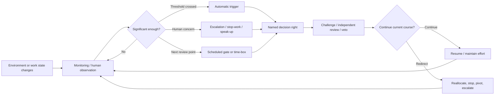
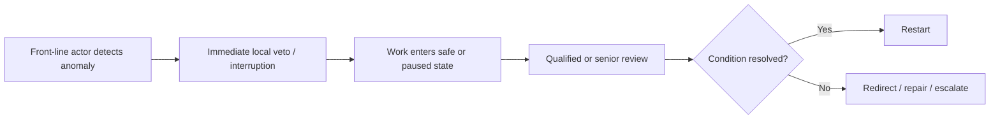
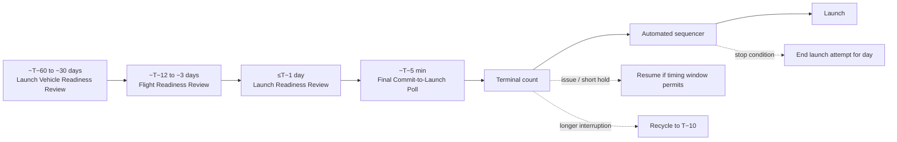

# Timing Control in Human Organizations: How Leaders Redirect Effort at the Right Moment

## Executive summary

Organizations rarely solve the timing problem of redirection by giving a leader more authority alone. The mechanisms found across strategy, emergency management, aviation/spaceflight, healthcare, manufacturing, financial markets, software development, venture capital, clinical trials, and occupational safety instead act on one or more stages **before** the leader's exercise of authority: sensing a change, recognizing its significance, deciding that a threshold has been crossed, routing the information to an appropriate decision-maker, interrupting current work, challenging the prevailing interpretation, or constraining what the leader may do next. Strategic-management research accordingly defines decision speed as the interval from the first reference to deliberate action to commitment to act, while temporal-organization research defines organization-environment fit as synchronization between organizational and environmental activity cycles. These are different conceptions of timing: the first is about latency; the second is about synchronization. citeturn13view5turn13view4

Across the literature, a “right moment” is therefore **not synonymous with the earliest possible moment**. In high-velocity environments, faster strategic decisions can be advantageous; in other settings, acting before enough evidence accumulates produces costly false positives. Market circuit breakers illustrate the latter problem particularly clearly: they intervene immediately at a predetermined price threshold, yet cannot distinguish a destabilizing run from legitimate liquidity demand, so their calibration trades delay of harmful dynamics against interruption of beneficial trading. citeturn13view9 Clinical early-warning systems reveal the same basic trade-off from another direction: deterioration often produces an intervention window before arrest, but excessively sensitive monitoring generates false alarms and attention depletion. citeturn18view2turn13view8

The most empirically consequential distinction is between **authority mechanisms** and **timing mechanisms**. Decision-right assignments, formal command structures, and delegated authority answer *who may redirect*. Trigger thresholds, continuous monitoring, review cadence, escalation paths, stop-work rights, adversarial review, and cultural “speak-up” norms answer *when information reaches that person and when current action can be interrupted*. Kownatzki and colleagues' multimethod study of five international multibusiness firms illustrates the interaction: goal setting, extrinsic incentives, and decision-process control accelerated SBU strategic decisions, while strategy imposition slowed them; the mechanisms identified included transparency, participation, trust, alignment, and timely feedback. citeturn13view5

The strongest direct outcome evidence in this review comes from **healthcare trigger-and-response systems**. A meta-analysis encompassing nearly 1.3 million admissions found adult rapid-response-team implementation associated with a 33.8% reduction in non-ICU cardiopulmonary arrests (RR 0.66, 95% CI 0.54–0.80) but no significant reduction in adult hospital mortality (RR 0.96, 95% CI 0.84–1.09). Pediatric systems were associated with a 37.7% reduction in non-ICU arrests and a 21.4% mortality reduction, although the latter result was not robust to sensitivity analysis. citeturn13view7 AHRQ's 2024 synthesis similarly concludes that rapid-response systems can have substantial effects but that evidence quality remains low and effectiveness is impaired when deterioration is recognized late, activation does not occur despite thresholds being met, or the response arm is delayed. citeturn18view2

These systems also demonstrate why **measurement and response have to be treated separately**. A rapid-response system has an “afferent” limb that detects and activates, and an “efferent” limb that acts; a perfect trigger is ineffective if activation is socially suppressed or the response team is unavailable. AHRQ reports substantial evidence that thresholds are sometimes met without activation and that such delay is associated with worse outcomes. citeturn18view2 NASA uses an analogous architecture: launch-commit criteria define measurable operating limits and prescribed actions if a limit is exceeded, while progressively later readiness reviews and a final commit-to-launch poll determine whether the program is allowed to enter increasingly irreversible phases. citeturn17view0turn17view3

There is a recurrent **sensitivity-versus-specificity problem**. More monitoring and lower interruption thresholds reduce missed or late redirections but impose attention, interruption, and false-positive costs. Healthcare alarm studies report false-alarm fractions of 72%–99% in some settings; one academic center experienced more than 59,000 alarms in 12 days. citeturn13view8 Securities circuit breakers impose explicit 15-minute trading halts after certain 7% and 13% market declines, but empirical and theoretical research identifies legitimate-liquidity costs and “magnet” effects around thresholds. citeturn17view6turn13view9turn10search6

Several mechanisms address **bias and social inhibition rather than sensing**. Laboratory and meta-analytic research on devil's advocacy and dialectical inquiry generally finds better critical evaluation and, in important experiments, higher-quality recommendations than consensus-only procedures; however, adversarial procedures can reduce participants' desire to work with one another in the future. citeturn14search1turn15view5 A 2025 experiment specifically found that appointing a devil's advocate reduced escalation of commitment after negative project feedback in both open and blame-oriented error-management climates, while an open error climate alone had offsetting effects: it made admission of failure easier but also increased willingness to take risks. citeturn15view4

Likewise, cultural mechanisms chiefly alter the **social cost and latency of raising a signal**. Psychological safety is conventionally defined as a shared belief that a team is safe for interpersonal risk-taking. citeturn5search0turn16search21 Crew-resource-management evidence provides a useful estimate of what formalized speak-up/teamwork culture interventions change: a healthcare meta-analysis of 20 studies found large effects on knowledge (approximately *d*=1.05) and behavior (approximately *d*=1.25 in the authors' summary), much smaller effects on attitudes, but insufficient evidence for durable effects on clinical outcomes. citeturn16search5 Thus cultural mechanisms have stronger evidence for changing **intermediate behavior** than for proving that final redirections happen at an objectively optimal moment.

The principal cost categories recur across mechanisms:

| Cost category | What creates it | Illustrative evidence |
|---|---|---|
| **Direct operating cost** | Sensors, data systems, dedicated responders, review staff, training, independent challengers | A pediatric medical-emergency-team analysis estimated annual operating costs ranging from roughly **$287,000 to $2.3 million**, depending on staffing model. citeturn18view0 |
| **Attention/cognitive cost** | Alarm load, metrics, escalation messages, role complexity | Healthcare alarm studies report false-alarm rates as high as 72%–99%. citeturn13view8 |
| **Interruption/opportunity cost** | Production stops, trading halts, cancelled launches, diverted responders | SEC market-wide breakers impose 15-minute halts at specified thresholds; NASA can recycle a countdown to T−10 or end an attempt for the day depending on when a stop occurs. citeturn17view6turn17view2 |
| **Deliberation/delay cost** | Gates, approvals, escalation hops, red-team review, committee review | Scrum, for example, reserves recurring inspection windows including a 15-minute daily event and time-boxed sprint reviews and retrospectives. citeturn13view10 |
| **Relational cost** | Structured conflict, challenging superiors, blame risk | Devil's-advocacy experiments have found higher critical evaluation but less desire for future collaboration. citeturn15view5 |
| **Error cost** | False positive intervention or false negative non-intervention | Circuit breakers can interrupt legitimate liquidity; early-warning systems can either over-alert or miss/delay deterioration. citeturn13view9turn18view2 |
| **Rigidity/option cost** | Precommitted thresholds and contracts become inappropriate after conditions change | VC and clinical-trial governance explicitly exchange discretion for staged or independent decision rights; direct causal estimates of this organizational rigidity cost remain sparse. citeturn13view11turn18view4 |

The overall evidence is therefore asymmetric. There is considerable evidence that organizations can alter **detection latency, escalation latency, interruption probability, decision speed, information quality, and willingness to challenge**. There is much less evidence demonstrating that any one mechanism identifies an objectively optimal redirect time across environments. Most empirical literatures measure proxies—arrests prevented, decision speed, project continuation, trading volatility, call rates, speaking-up behavior, or decision quality—rather than the counterfactual quantity the question ultimately implies: *how much better or worse would the organization have performed had it redirected somewhat earlier or later?* citeturn13view5turn13view7turn15view4

## What “the right moment” means in the literature

There is no single cross-disciplinary construct called “the right moment.” Several literatures operationalize the problem differently, and those differences matter because they imply different timing mechanisms.

**Decision latency.** Strategic-decision research commonly defines decision speed as the elapsed time between the first reference to deliberate action and commitment to act. citeturn13view5 Eisenhardt's high-velocity-environment work established the influential argument that fast decisions need not result from impoverished analysis; rapid decision-makers can use current information, consider multiple alternatives, and resolve conflict quickly rather than simply omitting analysis. citeturn2search4turn2search24 Here the “right moment” is close to **short enough latency to preserve environmental relevance**.

**Temporal fit or entrainment.** Pérez-Nordtvedt and colleagues define organization-environment temporal fit as a state of synchronization or alignment between organizational and environmental activity cycles. Temporal misfit, in their model, produces inefficiency and inferior performance. citeturn13view4 Here the issue is not absolute speed. A decision can be fast but mistimed if the organization's cycle is out of phase with customers, regulators, competitors, production, or a physical process.

**Threshold crossing.** Safety and control systems operationalize timing as the instant when a pre-agreed observable moves outside an acceptable region. NASA's launch-commit criteria define operating limits and what must occur when they are exceeded. citeturn17view0 Rapid-response systems similarly use vital-sign thresholds or early-warning scores to initiate escalation. citeturn18view2 Securities circuit breakers turn a market-price movement into a rule-bound intervention. citeturn17view6 The “right moment” is consequently **state contingent**, not calendar contingent.

**A decision window.** Other systems recognize a zone in which intervention remains useful rather than one exact instant. Hospital deterioration may produce abnormal physiology hours before an arrest, creating an interval in which intervention can prevent the adverse event. citeturn18view2 NASA's countdown illustrates a physical counterpart: a hold at one countdown point may be recoverable, while the same interruption later can require recycling the sequence or terminating the day's attempt. citeturn17view2 The relevant quantity is therefore often *time remaining before reversibility collapses*.

**Scheduled inspection points.** Scrum formalizes recurring inspection and adaptation rather than trying to identify every environmental discontinuity algorithmically. The Daily Scrum inspects progress every working day; the Sprint Review examines the completed increment and environmental changes to determine future adaptations. citeturn13view10 FEMA incident management similarly divides operations into defined operational periods with an Incident Action Plan for each period. citeturn17view9turn17view10 “Right moment” here means **a bounded maximum waiting time until mandatory reconsideration**.

**Option-preserving decision points.** Staged-finance and clinical-trial literatures treat timing as a sequential exercise of options. Venture-capital contracts allocate board, voting, liquidation, cash-flow, and other control rights separately, allowing control to change as financing proceeds. citeturn13view11 Empirical VC research finds that the interval before another financing decision itself responds to uncertainty: in one study of Indian firms funded between 2000 and 2017, a 1% increase in market uncertainty was associated with more than a 6% increase in the delay before a funding round, while greater agency problems were associated with a 55% shorter interval. citeturn18view5 The relevant moment is the point at which additional information changes the value of continuation relative to stopping or waiting.

**Independent safety review.** Clinical Data Monitoring Committees are structurally distinct from the project team and may receive delegated authority concerning trial conduct. citeturn18view4 Here the timing concept is not merely *when does evidence cross a line?* but also *when is evidence mature enough that an independent body can distinguish a real safety/efficacy signal from statistical fluctuation?* Premature stopping can itself reduce precision and bias apparent treatment effects, illustrating a direct cost of acting “too early.” citeturn11search25

A useful synthesis of these literatures—not a term used uniformly by them—is that organizational timing performance depends on the sum of several latencies:

\[
T_{\mathrm{redirect}}
=
T_{\mathrm{sense}}
+
T_{\mathrm{recognize}}
+
T_{\mathrm{route}}
+
T_{\mathrm{decide}}
+
T_{\mathrm{execute}}
\]

A mechanism creates value only insofar as reducing one component does not produce a larger increase in false intervention, information error, coordination cost, or downstream delay. This interpretation is supported by the separation of recognition and response in rapid-response systems, the threshold/liquidity trade-off in circuit breakers, and strategic evidence that control structures can either accelerate or slow commitment. citeturn18view2turn13view9turn13view5

The generic timing-control sequence can be represented as follows:

The literature accordingly contains **three different types of timing error**: detecting a real change too late; acting on a signal too early or unnecessarily; and detecting correctly but losing the intervention window while information waits for escalation, approval, or execution. Healthcare rapid-response evidence contains examples of the first and third; alarm fatigue and circuit-breaker research make the second unusually visible. citeturn18view2turn13view8turn13view9

## Signal and trigger mechanisms

The mechanisms in this family primarily reduce the time between a change in underlying conditions and organizational recognition of that change.

| Mechanism | Operational description and typical contexts | Empirical evidence and measurable indicators | Costs | Known failure modes |
|---|---|---|---|---|
| **Trigger-based protocols** | Pre-specify a measurable state and an associated action: call a response team, stop a countdown, halt trading, enter an emergency mode. Common in healthcare, aerospace, finance, process industries, cybersecurity and safety-critical operations. NASA's LCCs explicitly specify operating limits and required actions after a limit is exceeded. citeturn17view0 | Healthcare provides the strongest outcome evidence. Across nearly 1.3 million admissions, RRT implementation was associated with adult non-ICU arrest RR 0.66, but adult mortality RR 0.96; pediatric arrest RR 0.62 and mortality RR 0.79, with the latter sensitive to analysis choices. citeturn13view7 Typical indicators: threshold breaches, activations/1,000 admissions, response time, arrests outside ICU, mortality, unplanned ICU transfer. citeturn18view2 | Rule development and validation; training; response capacity; false activations; interruption. One pediatric MET cost analysis estimated **$287,000–$2.3m annually**, depending on staffing. citeturn18view0 | Threshold may be too sensitive or insensitive; people may fail to activate after a threshold is reached; response capacity may be unavailable; rigid thresholds do not understand context. AHRQ finds delayed/missed activation remains common. citeturn18view2 |
| **Monitoring and metrics** | Continuously or periodically measure leading or lagging indicators and compare them with expected trajectories. It supplies a signal but does not necessarily specify an action. Contexts include hospitals, production, finance, operations centers and portfolio/project management. | In rapid-response systems, vital signs and early-warning scores are common “afferent-limb” measures, exploiting the fact that deterioration often precedes arrest by hours. citeturn18view2 Indicators include deviation from target, rate of change, threshold duration, prediction score, forecast error and time from abnormal observation to acknowledgement. | Sensors/data collection; analysts; data cleaning; ongoing threshold calibration; cognitive burden. | Lagging metrics detect change after useful options have narrowed; noisy metrics produce signal overload; repeated nonactionable signals produce desensitization. Healthcare alarm data show false rates of 72%–99% in some studies. citeturn13view8 |
| **Real-time dashboards and visual analytics** | Aggregate current measures into a common visual picture so decision-makers can compare status, trends, exceptions and alternatives without waiting for periodic reports. Used in healthcare operations, logistics, financial operations, emergency management and digital businesses. | A 2024 experiment with **524 participants** found that dashboard information format, currency and completeness indirectly affected decision quality by reducing perceived task complexity and increasing information satisfaction. citeturn16search19 This supports the perceptual/information-quality pathway, not a claim that dashboards necessarily improve hard organizational outcomes. Typical measures: data age, refresh latency, acknowledgement time, task complexity, decision quality, user satisfaction and alert-to-action time. | Data integration and infrastructure; display development; maintenance; attention switching; training; reconciliation of competing metrics. Quantitative total-cost evidence is sparse. | More data can exceed human attention; presentation choices influence interpretation; dashboards may create false confidence in stale or incomplete data. Continuous alerting can become alarm fatigue: more than 59,000 alarms in 12 days were reported at one academic center. citeturn13view8turn16search19 |

The rapid-response literature shows why “install a metric” and “redirect at the right time” are very different accomplishments. AHRQ decomposes the system into **recognition/activation** and **response**. It reports that deterioration thresholds are often met while activation is delayed or never occurs; such delays are associated with poorer outcomes. citeturn18view2 Thus the relevant timing metric is not only model sensitivity or dashboard refresh speed but the entire interval from first actionable signal to effective intervention.

It also provides unusually clear evidence of the false-positive cost of increasing sensitivity. AHRQ's alarm-safety review reports both extraordinary signal volume and very high false-alarm fractions. citeturn13view8 Reducing alarms can materially alter workload: the same review describes a standardized monitoring process in which median cardiac alarms fell from 180 to 40 per monitored patient-day and median false-alarm percentage from 95% to 50%; another intervention cut false alarms from 18.8% to 9.6%. citeturn13view8 The mechanism therefore has an empirically visible **attention budget**.

Market-wide circuit breakers are a particularly clean non-medical example of a trigger that encodes both **state and time of day**. Current U.S. market-wide thresholds are 7%, 13%, and 20% declines in the S&P 500. A Level 1 or Level 2 breach before 3:25 p.m. produces a 15-minute halt, whereas the same breach at or after 3:25 p.m. does not; a Level 3 breach closes trading for the rest of the day. citeturn17view6 In other words, the regulation does not define the “right moment” as “whenever 7% occurs”; the trigger is conditional on both magnitude and remaining trading time.

That specificity does not eliminate classification error. Formal models note that a circuit breaker observes price movement but not the underlying reason for selling and can therefore block legitimate liquidity demand. citeturn13view9 Empirical research has also found significant “magnet” effects around trading pauses, in which behavior changes as participants anticipate the threshold. citeturn10search6 This is a general failure mode of highly visible thresholds: once participants know the intervention boundary, their behavior may change **before** the threshold is reached.

## Governance, escalation, and interruption mechanisms

These mechanisms do less to discover a signal and more to ensure that a detected signal reaches someone who can redirect effort before the opportunity closes.

| Mechanism | Operational description and typical contexts | Empirical evidence and indicators | Costs | Failure modes and evidence gaps |
|---|---|---|---|---|
| **Escalation rules** | Map conditions to a route through an organizational hierarchy: local handling below one level, higher command for larger/nonroutine consequences. Emergency services, hospitals, IT operations, military organizations and regulated industries commonly use them. | FEMA's ICS explicitly allocates which resource requests can be made locally and which require Incident Commander approval; formal operational periods and IAPs specify objectives, assignments and communication. citeturn17view10turn17view9 Nine-disaster research on ICS found it applicable across emergency activities but strongly contingent on context and pre-existing organizational/community conditions. citeturn17view12 Indicators: number of escalation hops, detection-to-notification time, acknowledgement time, percentage bypassing the chain, open escalations and time at each tier. | Supervisory staffing, communication systems, training, documentation, handoffs, planning overhead; every hop can add delay. Quantitative cost evidence for escalation architecture itself is weak. | Too many escalations overload senior decision-makers; too few leave major issues local; routing may be bypassed. FEMA explicitly warns that reaching around established resource-ordering processes creates serious problems. citeturn17view10 |
| **Delegated veto / stop-work authority** | Give a front-line actor the power to interrupt work before leadership deliberation is complete. Common in industrial safety, aviation-like crew systems, construction and lean production. OSHA crane rules require that an operator have authority to stop/refuse loads whenever safety is in question until a qualified person determines safety is assured. citeturn17view4 | Legal existence is strongly documented, but causal studies isolating veto rights from training and culture are sparse. Toyota's Andon description illustrates a calibrated version: a pull summons a team leader; the line ultimately stops if the problem cannot be resolved within the available takt-time interval. citeturn17view13 Indicators: stop calls, near misses intercepted, percentage upheld/overridden, response time, restart time, repeated stops on the same defect. | Low standing cost once rights exist, but potentially high activation cost through lost production or operational delay; investigation and restart consume capacity. | Underuse because of hierarchy or retaliation fears; overuse when the triggering criterion is vague; normalization of frequent stops; local actor sees only part of system trade-off. OSHA's broader refusal doctrine itself restricts protected refusal to conditions including good-faith belief, serious danger and insufficient time for normal enforcement channels, illustrating the need to distinguish urgent interruption from routine dispute. citeturn17view5 |
| **Decision-rights matrices / formal delegation** | Allocate who proposes, advises, approves, executes or can block different decision classes. They reduce search for an owner and separate routine from exceptional decisions. Used in multibusiness corporations, projects, emergency command and governance. | In five international multibusiness organizations, Kownatzki et al. found goal setting, extrinsic incentives and decision-process control associated with faster SBU strategic decisions; negative incentives and conflict-resolution controls showed no effect, while strategy imposition slowed decisions. citeturn13view5 FEMA likewise distinguishes purchases that can occur without Incident Commander review from exceptional requests requiring it. citeturn17view10 Indicators: approval hops, decision cycle time, rework from unclear ownership, escalations caused by unclear authority, proportion resolved at first authorized tier. | Governance design, documentation, training, maintenance when structures change; excessive approval layers create queueing and coordination burden. | A matrix specifies **who**, but usually not **when**. If sensing and escalation triggers are absent, perfectly clear decision ownership can still act late. Highly centralized “strategy imposition” can itself slow decisions. citeturn13view5 Direct causal evidence on named RACI-type matrices specifically is notably thin. |
| **Legal and regulatory timing constraints** | External rules determine when action becomes mandatory, prohibited, or subject to independent approval. Examples include stop-work law, financial-market circuit breakers, clinical monitoring requirements and safety certification. | OSHA's crane standard contains an immediate safety veto. citeturn17view4 SEC market breakers provide a much more quantitatively studied regulatory trigger: specified percentage declines cause defined halts. citeturn17view6 Research finds both stabilizing rationale and costs from restricting legitimate trading, with empirical evidence of threshold-induced behavioral effects. citeturn13view9turn10search6 | Compliance staff, documentation, monitoring, legal review and audits; when triggered, shutdown or market-access costs can dominate. A Level 1/2 U.S. market-wide breaker itself costs 15 minutes of trading time when applicable. citeturn17view6 | Rules are intentionally less discretionary and therefore can be blunt; thresholds can become stale; regulated actors may optimize around a boundary; regulators cannot observe every context variable relevant to the true optimum. citeturn13view9 |

FEMA's Incident Command System is instructive because it combines **decision rights, escalation, planning cadence, and span-of-control constraints** rather than relying on command authority alone. ICS includes management by objectives, incident action planning, resource management, common terminology, unified communications and information management. citeturn17view8 FEMA materials identify an effective incident span of control as roughly three to seven subordinates/resources per supervisor, reflecting the finite attention capacity through which timely escalation must pass. citeturn17view11

Field evidence does not establish ICS as a universally optimal timing architecture. Buck, Trainor and Aguirre's analysis of FEMA Urban Search and Rescue participation in nine disasters concluded that ICS is a partial solution whose effectiveness depends on context; it performed better where responders formed an established community, demands were relatively routine, and emergent social organization was limited. citeturn17view12 The finding is important for timing because standardized escalation is quickest when participants already share roles and terminology; novelty can make the same structure less frictionless.

Delegated vetoes solve a different problem: **the leader may be too far from the anomaly to be the first legitimate interrupter**. OSHA's crane rule therefore gives the operator, rather than a distant manager, the legal ability to stop whenever a safety concern arises. Restart requires a qualified-person determination that safety has been assured. citeturn17view4 This transforms authority into a two-stage system:

The timing advantage is immediate interruption without waiting for senior approval. Its costs are correspondingly transferred to **false stops, restart time, and verification**, while its principal false-negative risk moves from “leader did not hear in time” to “front-line person did not invoke the right.” The latter is why formal stop authority and cultural speak-up mechanisms are complements analytically even though they are separate institutional devices. OSHA explicitly contains anti-retaliation protections around dangerous-work refusal, indicating that formal authority alone does not eliminate the social dimension of interruption. citeturn17view5

## Scheduled, precommitted, and adversarial mechanisms

A second major family avoids dependence on spontaneous anomaly recognition by creating moments at which continuing the current course must be reconsidered.

| Mechanism | Operational description and contexts | Empirical evidence and indicators | Costs | Failure modes and evidence gaps |
|---|---|---|---|---|
| **Time-boxing / recurring review cadence** | Work proceeds for a bounded period, after which progress and environmental assumptions are inspected. Common in software/product teams, emergency operations and iterative project structures. | Scrum's Daily Scrum is a 15-minute inspection/adaptation event each working day; its Sprint Review inspects outcome and environmental change and is capped at four hours for a one-month sprint; the retrospective is capped at three. citeturn13view10 FEMA IAPs likewise cover explicit operational periods. citeturn17view9 Indicators: cadence interval, missed reviews, time from environmental change to next review, carry-over work, number of adaptations per cycle. | Recurring meeting and preparation time; context switching; coordination overhead. Scrum makes part of this direct cost measurable through explicit time boxes. citeturn13view10 | Maximum detection delay is bounded by cadence but not eliminated: a discontinuity immediately after a review can wait nearly a full cycle. Too-short cycles impose churn; too-long cycles delay reconsideration. Strong causal evidence linking a particular cadence to optimal redirection timing is limited. |
| **Stage gates / progressive commitment** | Major irreversible steps require increasingly specific readiness checks. Common in aerospace, capital projects, product development and regulated programs. | NASA launch governance is unusually explicit: LVRR about 30–60 days before launch, FRR 3–12 days before, LRR no later than one day before, and a final commit-to-launch poll approximately five minutes before launch; a “Go” is required from all parties polled before terminal count. citeturn17view3 Indicators: open gate actions, waivers, readiness exceptions, time between gates, issues discovered per gate and recycles. | Review labor, documentation, waiting for closure, schedule reserves and potential delay. Costs rise sharply when a late gate fails because commitment has accumulated. | Gate compliance can become ceremonial; late information can bypass earlier assumptions; many gates increase delay while too few allow hidden problems to persist. Direct comparative causal estimates are scarce. |
| **Pre-commitment contracts and staged rights** | Ex ante rules allocate future control rights or condition future resources on a later decision point. Used in venture capital, partnerships, corporate governance, clinical trials and financing. | Kaplan and Strömberg's study of actual VC contracts documents separate allocation of cash-flow, board, voting, liquidation and other control rights. citeturn13view11 VC timing data show decision intervals respond strongly to uncertainty and agency problems; 1% greater market uncertainty was associated with >6% longer delay to the next round, while greater agency problems were associated with a 55% reduction in the interval. citeturn18view5 Indicators: milestone achievement, burn rate, runway, valuation, covenant breaches, board votes, next-round interval. | Negotiation/legal cost, monitoring, loss of managerial discretion, bargaining around milestones, risk that an ex ante condition becomes obsolete. | Milestones can be gamed; rigid rights can induce premature termination or continuation; changing environments can invalidate assumptions embedded in the contract. Evidence on actual rights is strong descriptively but causal evidence that a specific right produces optimal timing is much weaker. |
| **Independent stopping rules / monitoring committees** | Predefine evidence thresholds and delegate interim review to actors separated from day-to-day project ownership. Clinical trials are the clearest institutional form. | FDA guidance recognizes Data Monitoring Committees as bodies carrying out important trial-monitoring functions and notes that sponsors may delegate design/conduct decisions to other entities. citeturn18view4 Statistical literature documents that stopping trials early can sacrifice precision and exaggerate apparent effects, making the false-positive cost of an early stop unusually measurable. citeturn11search25 Indicators: interim effect estimate, confidence bounds, adverse-event rates, information fraction, stopping boundary crossing. | Independent expertise, statistical analysis, secure data handling, committee meetings and delay while evidence matures. | Repeated looks at data increase statistical complexity; overly permissive boundaries stop too early, overly stringent boundaries preserve exposure to harm or waste resources. |
| **Red-team review / devil's advocacy / dialectical inquiry** | Assign a person or group to develop a critique, countercase or competing interpretation before commitment or continued investment. Used in strategy, military planning, risk review and major investment decisions. | Schweiger, Sandberg and Ragan found dialectical inquiry and devil's advocacy produced higher-quality recommendations and assumptions than consensus. citeturn14search1 A later meta-analysis found devil's advocacy generally more effective than an expert-only approach, though results varied with task structure. citeturn15view5 A 2025 experiment found a devil's advocate reduced escalation of commitment following negative project feedback in both tested error climates. citeturn15view4 Indicators: alternatives generated, assumptions challenged, recommendation reversals, forecast error, termination/continuation decisions and time added to deliberation. | Additional analyst/team time; duplicate analysis; deliberate conflict; delay before commitment. Experimental evidence finds lower desire for future collaboration in some adversarial groups. citeturn15view5 | Ritualized dissent, weak challenge, challenger capture, excessive opposition, relational damage; direct field evidence in actual high-stakes “red teams” is substantially thinner than laboratory evidence on devil's advocacy. |
| **Cultural norms: speak-up, psychological safety, CRM** | Reduce the interpersonal penalty for reporting anomalies, contradicting superiors, admitting failure or calling for intervention. Commonly institutionalized in aviation-derived teamwork, hospitals, laboratories and high-risk operations. | Edmondson's foundational field research defines psychological safety around interpersonal risk taking and links it to team learning behavior. citeturn5search0 In acute-care CRM, a 20-study meta-analysis found large effects on knowledge and observed behavior but insufficient evidence for clinical outcomes or long-term durability. citeturn16search5 Indicators: safety-climate scales, speaking-up frequency, near-miss reports, response to dissent, escalation frequency and observed teamwork behavior. | Training and simulation, leader time, debriefs, attention to interpersonal process; possible increase in debate and reporting volume. | Formal permission may not overcome status hierarchy; excessive comfort with risk may have unintended effects. A 2025 escalation experiment found an open error climate both facilitated admission of failure and encouraged risk-taking, with the opposing effects yielding no overall difference in escalation. citeturn15view4 Hard causal evidence on actual “right-time” redirection remains limited. |

NASA provides an unusually visible example of **progressively tightening decision timing as reversibility falls**. Its formal launch process layers long-horizon readiness reviews over near-instantaneous terminal-count controls. The current procedural document describes an LVRR roughly 30–60 days before launch, an FRR 3–12 days beforehand, an LRR no later than one day beforehand, and a final poll around five minutes before launch. citeturn17view3 Once terminal operations are underway, the cost of an interruption depends sharply on when it occurs: during Artemis I's terminal countdown, a stop between T−6 and T−1:30 could be held for up to three minutes and resumed; a longer stop required recycling to T−10; after handover to the automated launch sequencer, an issue sufficient to stop the count ended that day's launch attempt. citeturn17view2

The architecture illustrates a broader pattern: the organization does **not** use one redirection mechanism at all moments. Far from an irreversible event, it uses deliberative reviews; nearer the event, explicit criteria and unanimous/defined poll rights become more important; at the final phase, automated constraints replace a portion of discretionary real-time judgment. citeturn17view0turn17view2turn17view3

Precommitment addresses a different temporal pathology: **the person making a continuation decision may be psychologically different, in effect, from the person who would have evaluated the same prospect before resources were sunk**. Escalation-of-commitment research defines the phenomenon as continuing investment after negative feedback. citeturn15view4 Structured challenge can alter that continuation decision: in the 2025 experiment, a devil's advocate reduced escalation by making negative information more salient and countering the shift from the project's original economic goal toward simply completing it. citeturn15view4

The same experiment also reveals why culture cannot be reduced to the slogan that “more psychological safety equals earlier stopping.” An open error-management climate made participants less afraid to admit failure but also increased willingness to experiment and take risk; the two effects offset one another at the aggregate level. citeturn15view4 This is unusually direct evidence that a mechanism lowering **social false negatives**—unspoken bad news—can simultaneously increase **decision false negatives** if managers become more willing to continue risky projects.

## Cross-mechanism comparison, timing trade-offs, and evidence limits

The following table compares the mechanisms specifically as **timing-control architectures**. “Cost magnitude” is an ordinal cross-context assessment based on the standing resources and activation consequences documented above; it is not a pooled monetary estimate, because comparable cost-effectiveness studies exist for only a minority of mechanisms.

| Mechanism | Evidence strength for timing effect | Typical standing / activation cost | Typical latency to intervene | False-positive risk | False-negative / late-action risk | Sectors with strongest examples |
|---|---|---|---|---|---|---|
| **Trigger protocol** | **Strong–moderate**: RCT/meta-analytic healthcare evidence; strong operational evidence elsewhere. citeturn13view7turn18view2 | Medium–high / medium–high; dedicated responders can cost hundreds of thousands to millions annually. citeturn18view0 | Seconds to minutes once condition is recognized | Medium–high if threshold sensitive | Medium if threshold insensitive or activation ignored | Healthcare, aerospace, finance, process safety |
| **Monitoring / metrics** | **Moderate** for detection; weaker for causal final outcomes | Medium–high / low | Near-real-time to reporting cadence | High with noisy measures | High with lagging/poorly sampled measures | Healthcare, operations, finance, manufacturing |
| **Escalation rules** | **Moderate descriptive; limited causal** | Medium / medium | Minutes to hours; increases with hops | Medium | Medium–high from routing delay or non-escalation | Emergency response, IT, healthcare, government |
| **Delegated veto / stop-work** | **Strong legal/operational documentation; limited isolated causal evidence** | Low–medium / potentially high | Immediate to minutes | Medium; interruption may be precautionary | Medium–high if social inhibition suppresses use | Construction, manufacturing, high-risk operations |
| **Time-boxed review** | **Strong descriptive; limited causal timing evidence** | Low–medium recurring / low | Bounded by cadence: minutes, day, sprint or operational period | Low in the sense that review is expected rather than exceptional; review can still cause churn | Medium: change just after a review waits until next inspection unless separately escalated | Software/product, emergency management |
| **Decision-rights matrix / delegation** | **Moderate** adjacent evidence on decision speed. citeturn13view5 | Low–medium / low–medium | Can reduce routing delay substantially | Low as a sensing mechanism; it does not itself fire | **High if unpaired with a trigger**, because ownership alone does not reveal change | Corporate, projects, emergency command |
| **Real-time dashboard** | **Moderate experimental** on information processing; limited hard field outcomes. citeturn16search19 | Medium–high / low per view, high attention at scale | Seconds to minutes technically | Medium–high; display/alert overload | Medium–high when alerts are ignored or data stale | Healthcare, logistics, digital operations |
| **Stage gate** | **Moderate operational; mixed project evidence** | Medium / potentially high if failed late | Days to months between gates; very fast near final commitment | Medium: project can be stopped at a conservative gate | High between widely spaced gates | Aerospace, product development, capital projects |
| **Red team / devil's advocate** | **Moderate laboratory/meta-analytic; limited field hard outcomes**. citeturn14search1turn15view5 | Medium / medium | Hours to weeks, depending review | Medium: excessive challenge can derail viable plans | Medium: ritualized or socially weak challenge misses true problems | Strategy, military/risk, investment review |
| **Precommitment / staged contract** | **Moderate descriptive and observational** | Medium / medium–high rigidity | At milestone, round or contractual event | Medium–high if milestones become obsolete | Medium if milestones fail to capture emerging risk | VC, finance, partnerships, trials |
| **Independent stopping committee** | **Strong statistical rationale; variable empirical organizational evidence** | Medium / medium | Interim-analysis cadence; days to months | Explicitly material: premature stopping loses precision | Explicitly material: late stopping prolongs exposure or waste | Clinical trials, safety governance |
| **Legal/regulatory constraint** | **Moderate–strong within specific domains; effects often mixed** | Medium–high / high when triggered | Immediate for automated rules; hours/days for regulatory process | Medium–high with blunt thresholds | Medium if rule has gaps or delayed enforcement | Securities, occupational safety, healthcare, utilities |
| **Cultural speak-up norms / CRM** | **Moderate–strong for behavior; weak–moderate for hard outcomes**. citeturn16search5 | Medium, diffuse / low | Potentially immediate | Variable: more voice also means more low-value signals | High under hierarchy/fear; lower when voice is psychologically safe | Aviation-derived systems, healthcare, technical teams |

A second way to compare the mechanisms is by **what latency they attack**:

| Timing bottleneck | Mechanisms primarily aimed at it | What remains unresolved |
|---|---|---|
| The organization does not **see** the change | Monitoring, metrics, dashboards | Sensor/model validity and attention capacity |
| It sees it but cannot distinguish signal from noise | Thresholds, forecasting, red teams, independent monitoring | Sensitivity/specificity and model error |
| Someone sees it but does not **raise** it | Speak-up norms, delegated veto, legal protection, CRM | Status, retaliation fear, incentives |
| It is raised but goes to the wrong place | Escalation rules, decision-right assignment, ICS | Handoff and queueing delay |
| The decision-maker is biased toward continuation | Devil's advocate, independent reviewer, staged funding, stopping rule | Reviewer bias, premature stopping, new information |
| The organization never pauses to reconsider | Time-boxes, gates, operational periods | Events that occur between review points |
| A decision is made but execution is too slow | Pre-scripted response, delegated local authority, automation | Capacity constraints and implementation friction |
| Intervention itself is costly | Threshold calibration, conditional holds, review before restart | Fundamental FP/FN trade-off cannot be eliminated |

Several empirical findings are especially informative about this architecture.

First, **mere activation volume is not the outcome**. The early MERIT cluster-randomized trial of medical emergency teams found large increases in emergency-team calling after implementation without a clear improvement in its primary composite clinical outcome over the evaluation period. citeturn12search0 Later meta-analyses found clearer reductions in arrests but weaker or inconsistent mortality effects. citeturn13view7 This separates “the organization reacts more often” from “the organization reacts at beneficial moments.”

Second, there can be a **minimum mechanism dose**. AHRQ's review notes earlier evidence that rapid-response systems needed to reach a threshold number of activations per 1,000 admissions before measurable outcome effects appeared. citeturn18view2 A nominal right that is almost never exercised therefore does not constitute an effective timing mechanism.

Third, **speed-enhancing control is not the same as more centralized control**. Kownatzki et al. found some corporate controls accelerated SBU decisions, while strategy imposition slowed them. citeturn13view5 That result fits the broader distinction between clear boundaries—which can remove uncertainty about who may act—and repeated upstream approval—which can add queueing and deliberation.

Fourth, **continuous monitoring is constrained by human bandwidth**. Dashboard experiments find that format, currency and completeness affect decision quality through perceived complexity and information satisfaction. citeturn16search19 Alarm studies show what happens at the extreme: enormous signal volume and false-alarm prevalence. citeturn13view8 Therefore “real time” describes data availability, not necessarily human recognition or organizational actuation latency.

Fifth, **adversarial review has a measurable social price**. Devil's advocacy improves critical evaluation under many experimental conditions, but at least one experiment found participants less inclined to work with one another subsequently. citeturn15view5 The mechanism's timing cost is thus not only extra meeting time: repeated institutionalized dissent can alter relationships and future coordination.

Sixth, **the costs of acting too early are often better identified in regulated/statistical systems than in ordinary management research**. Circuit-breaker research explicitly models the loss from blocking legitimate liquidity demand. citeturn13view9 Clinical-trial stopping research explicitly analyzes loss of precision and inflated apparent effects from premature stopping. citeturn11search25 In ordinary project-management settings, by contrast, studies more often document escalation of failing projects than the countervailing population of viable projects that were terminated prematurely.

This last asymmetry produces several major evidence gaps.

**There is little direct measurement of “optimal redirection time.”** Most papers observe decision duration, continuation, mortality, arrest, performance, or decision quality. They rarely estimate a causal response curve showing the outcome had the organization redirected at \(t-1\), \(t\), or \(t+1\). The healthcare literature comes closest because physiological deterioration sometimes permits explicit reconstruction of missed windows. citeturn18view2

**Many mechanisms are studied as bundles.** Rapid-response systems combine metrics, triggers, education, escalation, dedicated response capacity and culture. citeturn18view2 ICS combines common terminology, authority, objectives, planning cadence, communications and resource control. citeturn17view8 CRM changes knowledge, attitudes and behavior simultaneously. citeturn16search5 This makes attribution of the timing effect to any single component difficult.

**Hard evidence is concentrated in sectors where failures are observable and costly.** Healthcare generates arrests and mortality data; finance generates high-frequency prices; clinical trials have explicit stopping statistics. RACI-style corporate decision matrices, red-team programs, organizational dashboards, and informal speak-up practices often lack equivalent counterfactual outcome measures.

**Implementation cost evidence is highly uneven.** Medical response systems have explicit staffing-cost estimates. citeturn18view0 Market breakers have explicit downtime. citeturn17view6 Scrum specifies meeting time. citeturn13view10 By contrast, the literature rarely monetizes the attention cost of escalation, relational cost of adversarial review, administrative cost of decision-right maintenance, or opportunity cost of a delayed strategic pivot.

**False positives are often undercounted outside automatic systems.** A safety intervention that prevents an event leaves an ambiguous counterfactual: perhaps no event would have occurred. Automatic alarms, statistical stopping boundaries and trading halts make false-intervention rates easier to study. Informal leadership redirection typically does not.

**Formal rights and actual use diverge.** OSHA can guarantee a stop right, yet a worker must still recognize a danger and be willing to invoke the right. citeturn17view4turn17view5 A rapid-response threshold can be exceeded without a call. citeturn18view2 A devil's advocate can be formally present yet insufficiently influential. This distinction between *de jure interruption authority* and *behavioral activation* is one of the most consistent findings across otherwise unrelated literatures.

Taken together, the evidence describes the organizational “right moment” problem as a **coupled detection–classification–routing–interruption–decision–execution problem**, rather than an authority problem. Organizations observed in the literature encode timing in fundamentally different ways—continuous thresholds, recurring clocks, staged gates, distributed stop rights, independent reviews, external legal boundaries, and informal voice norms—and each shifts rather than eliminates the basic trade-off between **late action and unnecessary action**. The empirical record is comparatively strong on whether these mechanisms change intermediate behavior and latency, strong in a few sectors on downstream outcomes, and substantially weaker on the counterfactual question of whether the resulting intervention occurred at the globally optimal instant. citeturn18view2turn13view9turn13view5turn15view4