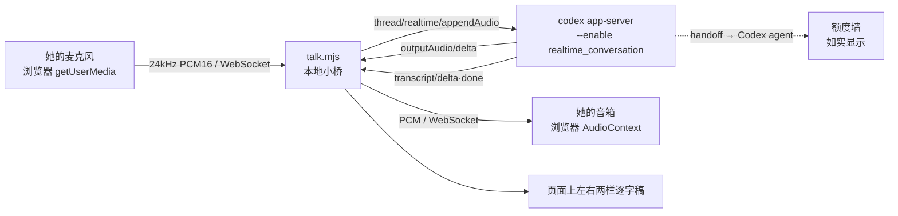

# FLY-1911 Codex 语音端到端原型 — 实施计划

Issue: FLY-1911 (https://linear.app/geoforge3d/issue/FLY-1911/voice原型-把-codex-语音端到端跑通-验它真的能说能听不只是会话能建起来)
日期: 2026-08-19
基于: research.md

---

## 这份计划要解决的问题

research.md 已经用机器证明了「它会说、它能听」。**还剩一件机器证不了的事:
这声音,人听着到底行不行。** 音质、节奏、打断的体感、它把 Annie 的话听成什么样 ——
这几条只能她自己开口试。所以原型的全部目的就是:**把麦克风递到她手里。**

## 梯子爬到哪一档,为什么停在这

| 档 | 够不够 | 判断 |
|---|---|---|
| 1 手跑一次 | ✗ | 0.148.0 **没有** voice 子命令,`realtime_conversation` 仍是 `under development`/默认关。人没法直接开口 |
| 2 一次性脚本 | ✓(已跑完) | S1–S5 就是这一档,已经回答了「能不能」 |
| 3 假 UI + 假数据 | ✗ | 风险不是「好不好看」,假数据答不了「听着行不行」 |
| **4 一条真的端到端细路** | **← 停这** | 她真开口 → 真送进 Codex → 真回声音。**判据 ①②③④ 的人那一半只能在这验** |

## 交付两件东西(分层,让她零门槛先听到)

### 甲 · 卡片(零门槛,不用装任何东西)

一页 founder HTML:
- **一个播放按钮** —— 内嵌 S1 那段 wav(base64 data URI)。她点一下就听见 Codex 说话。
  这是判据 ① 的人那一半,成本是 0。
- 它听我那句话听成了什么(两版转写并排,包括第一版糊掉的样子)。
- 打断 150 / 217 ms、首音 610 ms、长会话结果 —— 用人话写,不写黑话。
- **额度那堵墙如实写在正面**,不藏在附录。
- 每一块下面一个留言框(localStorage),底部一键汇总复制。

### 乙 · 「跟它说句话」本地原型(她想亲自试的时候)

```
node talk.mjs        →  打开 http://127.0.0.1:8911
```



页面上她能看见的:
1. 左栏 **它把我听成了什么**(role=user 逐字稿)—— 判据 ②,她当场能看出「PR」有没有听对。
2. 右栏 **它说了什么**(role=assistant 逐字稿)+ 声音同步播。
3. 她一开口,**当场停播** —— 判据 ③ 的体感那一半。
4. 顶上一行:通话已持续多久 / 有没有掉线 —— 判据 ④。
5. 交办那一步如果撞额度,**把原话贴出来**,不假装成功。

## 技术选型(以及为什么不选另一条)

| 选择 | 取 | 舍 |
|---|---|---|
| 通道 | **v2 / websocket** —— 音频就是 JSON-RPC 上的 base64 PCM | v3 / webrtc:要接 SDP answer + 收 RTP + 解 Opus。**这一档的工我没量过,不写「容易」**。v3 准入已复验通过(S3),留给产品化阶段决定 |
| 前端 | **浏览器一页 HTML** | 命令行 + 麦克风:要额外处理终端的麦克风授权,且没法给她看逐字稿 |
| 打断 | **浏览器本地能量检测,一开口就清播放队列** | 等服务端信号:服务端 150–217ms 才停发,但她耳朵里还有缓冲。本地清队列是体感最好的做法,也是真客户端的做法 |
| 采样率 | **24000 Hz 单声道**,与它自己吐的一致 | 48k 再重采样:多一层,没必要 |

## 明确切掉的(每加一样都得砍一样)

- ✂ 不接 Discord、不点亮 voice-bridge、不碰 `projects.json`。
- ✂ 不做 v3/WebRTC 媒体面。
- ✂ 不做断线重连、不做多用户、不做打包安装、不做样式打磨。
- ✂ 不接进 Flywheel 任何生产路径,不产生产代码。
- ✂ 不解 FLY-1453 的读取面(已知敞着,报告里点名,不在本单解)。

## 已知会翻车的地方(先说,别等她撞上)

| 风险 | 会长什么样 | 我怎么办 |
|---|---|---|
| 额度墙 | 交办那一步报 `usage limit` | 页面**如实显示原话**;说话/听懂/打断/长会话不受影响 |
| 浏览器自动播放策略 | 不点按钮就没声音 | 必须点「开始通话」才建 AudioContext(本来就要点) |
| 麦克风授权 | 首次弹窗 | `127.0.0.1` 是安全上下文,允许一次即可 |
| 真人语音没验过 | 她的口音/语速/环境噪音下可能不如 TTS | **这正是要她试的原因**;我不预先下结论 |
| `realtime_conversation` 还是 under development | 协议随时可能变 | 原型 pin 0.148.0 绝对路径 + sha256;报告里点名这是可变面 |

## 验收(原型自己的)

原型本身算做成了,当且仅当:
1. 她点开卡片能听见一句人话。
2. 她跑起来之后,对着麦克风说一句,**页面左栏出现她说的字**。
3. **她能听见它回话。**
4. 她插话时**当场停口**。
5. 撞额度时,**页面显示的是原话,不是「成功」**。

## 下一步(不在本单)

- 判据 ⑤ 后半段(结果回到耳朵)—— 等额度,或 Lead 指一个可用号。
- v3 媒体面的工量 —— 产品化阶段量。
- 载体形状定稿 —— 交 B(FLY-1850)/ C(FLY-1851)的 PRD,本单只提供实测证据。
