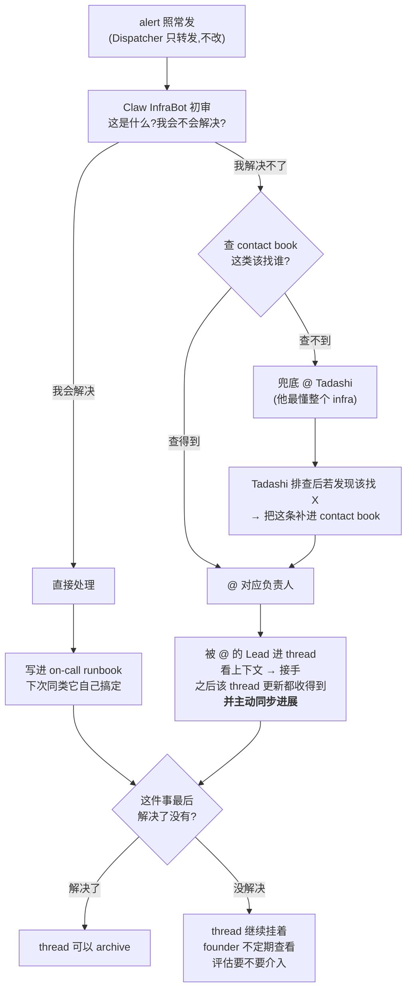
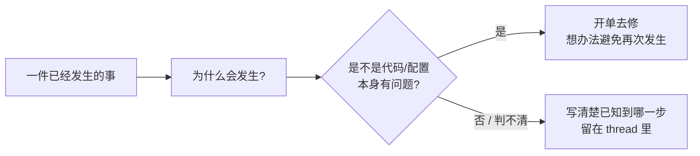

# FLY-2060 Alerts 频道值守机制 — PRD

Issue: FLY-2060 (https://linear.app/geoforge3d/issue/FLY-2060/prd-alerts-频道值守机制-签收判理闭环-降噪账founder-8-25-直令hl-出-prd)
日期: 2026-08-25
基于: 无(v1 已作废,见文末「版本说明」)

---

## 0. 一句话

`#flywheel-alerts` 里每条告警都要有人**看一眼、判一下、给个说法**;
并且每解决一次、每找对一次人,都要**留下一条记录** ——
让下一次**少拉一个人进来**。

---

## 1. Problem

### 1.1 founder 当天的三个实证(2026-08-25)

| # | 现象 | 说明 |
|---|---|---|
| 1 | 切号器身份冲突在 alerts 里喊了一整天没人应 | 告警发出来了,**没有响应者** |
| 2 | FLY-1969 的 founder 卡被自动消息埋掉 | 关联 FLY-2059 |
| 3 | founder 原话「提了一嘴没人管」 | **没有结论**,提出 ≠ 有人接 |

### 1.2 缺口的形状:有 owner 字段,没有人真的看

现状(`doc/architecture/infra-alerts-spec.md`)已经有工单格式、状态流转、逐类 owner 映射。
也已经有一个被设计成默认 owner 的 bot(`claude-infra-bot`),它的角色文件写着
「**只**响应 Alerts 里**显式 @ 你**的工单帖」。

**问题就在这一句上。** 现在是**逐条点名制**:被点名 → 有人管;
没被点名的、点了名但那个 bot 没起来的 → 没有任何人在看。

> **本 PRD 补的是:在「逐条点名」上面,加一个「有人先看一眼、并且负责给出说法」的环节,
> 外加两本会越用越省事的册子。** 现有的告警管道不推翻、不重建。

### 1.3 账本上的实测:ACK 这个状态,一次都没有发生过

现状其实**已经有一本签收账**(`~/.flywheel/teamlead.db` 的 `alert_threads`,
工单生命周期 `NEW → ACK → REPAIRING → RESOLVED / ESCALATED` 就记在这里)。
我去查了它。**测于 2026-08-25。**

| 观察 | 数字 |
|---|---|
| 总工单数(2026-06-23 ~ 2026-08-21) | **497** |
| 其中 `acked_at` 有值的(= 曾被认领) | **0** |
| 工单终态 | `ESCALATED` **425** · `RESOLVED` **4** · 未标状态 68 |
| `resolved_at` 有值的 | 24(约 5%) |

**0 / 497。** 不是样本小 —— 是两个月里**一次都没有**。
而 425 条走到 `ESCALATED`,按现有合同那正是「**无人认领超时**」的产物。

> **我核过这不是「账本没接线」**:写 `acked_at` 的代码路径存在于**生产 Bridge 当前自报的
> 那一版**(buildSha `fe795ecbe`)—— 状态转到 `ACK` 时会盖一次时间戳,而且盖上之后不会被后续
> 状态抹掉。同一段代码在 429 条记录上成功写了别的字段。
> ⇒ **`ACK` 是唯一一个从未发生过的状态。**

**⚠️ 两条我没证到的:**
1. 我只查了这一张表。不能排除「认领」被记在别的地方。
2. **这本账自己也停了**:`ticket_status` 在 08-14 之后不再盖,整张表 08-21 之后不再进新行
   (至今 4 天多)。**为什么停,我没有诊断** —— 见 §7 Q7。

**这条对 PRD 的意义**:值守机制不是在一张白纸上建 —— 是在一套**已经建好、但从来没有人站上去**
的机制上,补上那个「站上去的人」。

### 1.4 另一个事实:类别数远小于实例数,但类别还在缓慢增加

这条是 §6「活会不会自递减」那一节的**主要证据**,所以我特意去证伪了自己一次 —— 结果修正了一个数,见下面的方框。

**(a) 近 7 天:实例几百条,类别只有 17 种**

| 类别 | 条数 | 占比 |
|---|---|---|
| 工作区清理拒绝 | 416 | 约 55% |
| 信箱投递失败 | 169 | 约 22% |
| 其余 15 种 | 合计约 165 | 约 23% |

**(b) 但「17 种」是七天窗口看到的数,不是 contact book 要覆盖的规模**

| 观察窗口 | 出现过的类别数 |
|---|---|
| 近 7 天 | 17 |
| 近 14 天 | 30 |
| 近 30 天 | 46 |
| 近 60 天 | 60 |
| 近 90 天 | 63 |
| 全期(2026-05-01 起) | **63** |

> ⚠️ **自我修正**:我一开始拿「17 种」当 contact book 的规模证据,**这个数被七天窗口挡小了**。
> contact book 要覆盖的是**长尾**,不是某一周活跃的那些 —— 真实规模是 **63 类**。
> 曲线在变平(60 天 60 种 → 90 天 63 种),但**没有停**。

**(c) 新类别还在进来,速度是每月个位数**

| 月份 | 首次出现的新类别数 |
|---|---|
| 2026-05 | 5 |
| 2026-06 | 4 |
| 2026-07 | **45**(告警管道本身在建的爆发期) |
| 2026-08(至 25 日) | 9;最近一条是 8-10,之后 15 天没有新类别 |

⇒ **结论:类别数是「几十」这个量级、增长在放缓,但不是一个静止的集合。**
这直接决定了 R3 里那条「新类别上线前必须在册」不是形式主义 —— 它是自递减能不能持续的闸门。

> ⚠️ 口径:以上都是「系统认为发生了一件该报的事」的去重条数,**不是**频道里贴出的消息条数
> (我没有读频道历史的通路)。近 14 天日量在 22 ~ 1735 之间,**波动超过一个数量级**。

---

### 1.5 一个具体例子:同一个投递故障,把废话和真事一起挡在门外

§7 Q2 那件事(某个发射源的告警未能进入频道)还没核准规模,**但它挡下了什么是数得清的**。
把近 7 天落在 dead-letter 目录里的 462 个文件逐个打开、按类别数(测于 2026-08-25;
Lead 与我各数了一次,结果逐字相同):

| 类别 | 条数 | 严重度 |
|---|---|---|
| 工作区清理拒绝 `cmux_cleanup` | **414**(90%) | warning |
| **Bridge 异常退出** `bridge_abnormal_exit` | **31** | **severe** |
| 信箱投递失败 `mailbox_dead_letter` | 10 | warning |
| 工作流引擎告警 `workflow_engine_issue_alert` | 3 | warning |
| **工作流引擎升级** `workflow_engine_escalation` | 3 | **severe** |
| `tmux_rescue_hold` | 1 | warning |

**同一个投递故障,把 414 条重复的清理告警,和 31 条「Bridge 挂了」一起挡在了门外。**
按严重度数:被挡下的里面有 **34 条 `severe`**。

> ⚠️ **这条纠正一个很自然但会出错的推论**:「没送达、而我也没感觉少了什么 ⇒ 那些大概都是噪音」。
> 事实是 —— **真事她也没看见**。「我没感觉」在这里不能当证据,因为**没送达本身就是感觉不到的**。
>
> ⛔ 本 PRD **到此为止,不往下延伸**:哪些该报、哪些不该报,是第 2 层的事(§5)。
> 这里只陈述「被挡下的是什么」这个事实。

## 2. Users

| 角色 | 得到什么 |
|---|---|
| **founder(Annie)** | 不用自己当兜底读者。她只需要**不定期翻一下还没解决的 thread**,判断要不要她介入。 |
| **值守(Claw InfraBot)** | 一份清楚的动作序列:先看、能修就修、不能修就查册子找人、找不到就兜底给 Tadashi。 |
| **域负责人 Lead** | 被 @ 才需要进来;进来就有 thread 上下文,接手后一直收得到更新。 |
| **Tadashi** | 兜底位,但每兜一次就往 contact book 补一条,**下次不该再兜同一件事**。 |
| **下一个遇到同类问题的人** | 有 runbook 可查(怎么解决)、有 contact book 可查(该找谁)。 |

---

## 3. 这套 flow 长什么样(本 PRD 的主体)

### 3.1 主线

### 3.2 另一条线:为什么会发生(根因与防复发)

主线管「这次怎么收场」,这条线管「下次别再来」。

> 例(founder 原话的那个例子):今天 bridge 为什么断?是不是代码没写好?
> 是的话开单去修。

### 3.3 两个沉淀 —— 这是整套机制的重点

| 册子 | 沉淀什么 | 谁写 | 下次省掉什么 |
|---|---|---|---|
| **on-call runbook** | 这类问题**怎么解决** | 值守(解决之后立刻写) | 省掉「再想一遍怎么修」 |
| **contact book** | 这类问题**该找谁** | 值守(查到了就用);**Tadashi 兜底排查后必须回填** | 省掉「到处问该找谁」 |

> **目的只有一个:下一次少拉一个人进来。**
> founder 原话:「省得把一堆人拉进来找来找去」。
> **推论(要写死):每次找对了人、或解决了问题,都必须留下一条记录 —— 否则下次原样重来。**

---

## 4. Requirements

### R1 — 值守席位:Claw InfraBot,值守是它的主职

- 席位**唯一**,由 `claude-infra-bot`(Claw)担任。
- 它对**整条队列**负责,不只对「@ 到它的那几条」负责 —— 这是它现在**没有**的职责,必须明写进角色文件。
- 沿用现状不改:「谁都不救自己」(Claude 侧账号/auth 问题仍归 Codex 那边);「一条工单一个 owner」。
- **它为什么不会像 Cass 一样被淹 → 见 §6,那是本 PRD 必须论证的部分,不是一句断言。**

### R2 — 初审:每条都要过一眼,只有三种去向

值守对每一条告警必须落到三者之一,**没有第四种,也不许什么都不做**:

| 去向 | 条件 | 动作 |
|---|---|---|
| **① 我来解决** | 职权内、会解决 | 直接处理 → **解决后写进 runbook** |
| **② 找到人** | 自己解决不了,contact book 查得到 | @ 对应负责人(§R5) |
| **③ 兜底** | 自己解决不了,contact book **也查不到** | @ Tadashi;Tadashi 查明后**回填 contact book**(§R4) |

**不许「装懂」**:对没有 runbook 条目、自己也不确定的问题,值守可以**看和查**
(读日志、看状态),但**不许动手改系统状态去试**。理由:试探性修复会把一个还能诊断的
问题变成一个被搅乱的现场,反而让接手的人更难查。
⇒ 不确定就走 ② 或 ③,**宁转勿吞**。

> ⛔ 本 PRD **不定义**「这条是不是噪音」的判断层。按直令,那是下一层的事。
> 现在的规矩很简单:**每条都要有人看一眼、并且落到上面三个去向之一。**

### R3 — contact book(该找谁)

- 内容:**一类问题 → 负责人**。粒度以「能直接决定 @ 谁」为准。
- **查得到 → 直接 @;查不到 → 兜底 @ Tadashi。**
- **回填是必经步骤,不是建议**:Tadashi 兜底排查后,若发现这类该找 X,
  **必须把这条加进 contact book**,下次直接找 X。
- 起点不是空的:现有的逐类 owner 映射就是第一版底稿,**但它现在只写到「哪个 bot 修」,
  没写到「哪个人/哪个域负责」** —— 差的这一层正是 contact book 要补的。
- **新类别上线前必须在册**:「册子上没有这一类」这件事本身要能被发现,而不是等它撞上兜底。
- **住在哪儿:Flywheel 仓库**(founder 裁定,见 R4.1)。
- ⚠️ **如实记录现状:contact book 现阶段近乎单点。**
  founder 原话:「现在 alert 的内容也都是 Flywheel 这个系统怎么样,我猜就算我们列了一堆
  contact book,最后能解决问题的人可能也就只有他」。
  ⇒ **所以不要把它设计得复杂。** 它现在的价值不在「分流给很多人」,而在
  **把「该找谁」这件事从每次重新判断变成查一次表** —— 哪怕表上大部分行都指向同一个人。
  ⇒ 它的复杂度应该跟着实际负责人数量长,不是一开始就按多人设计。

### R4 — on-call runbook(怎么解决)

- 内容:**一类问题 → 这次是怎么解决的**,写到「下次照着做能做完」的程度。
- **解决之后立刻写,不是攒着以后写。** 攒着 = 不会写(见 §6 的失败条件)。
- 每条至少要有:什么现象、做了什么、怎么确认真的好了。

#### R4.0 ⚠️ runbook 的读者是 Infra bot,不是人(founder 定,本节最重要)

founder 提出的用法(原话节选):

> 「假设我们做了这个产品之后给我老公用,在他电脑上跑,很有可能 Bridge 跑着跑着负载过大就挂了。
> 我不希望他的东西一挂,他就不知道 GG 了该怎么办。其实如果我们的产品能有个 Infra bot
> 帮他解决这些问题,我觉得会非常需要。」
> 「比如 Bridge 负载过大坏了该怎么解决,不同的人遇到这个问题,最后解决的方法其实都一样。
> 这样的话,这套 runbook 拿去 share 是完全没问题的。」

**⇒ runbook 不是给我们几个人查的文档,是 Infra bot 的知识库。** 这带来两个后果,都要落到写法上:

| 后果 | 具体是什么 |
|---|---|
| **① 判据变了** | 一条 runbook 写得好不好 = **Infra bot 照着它能不能真把问题解决掉**,不是「人读得懂不懂」。人读着通顺但 bot 执行不了,算没写好。 |
| **② 必须写通用处置** | 它**跨用户可复用**(不同的人遇到同一个问题,解法一样)。所以**不能写死我们这台机器的路径、账号、主机名**;凡是本机特有的东西,要写成「从哪儿取」而不是把值抄进去。 |

> ⛔ **Infra bot 本身不在这一版展开设计。** 那是 founder 刚抛出来的一个新东西
> (「任何其他人用我们这套产品,都需要这样一个 Infra bot 来排查问题」)——
> **标记为后续独立议题,本 PRD 到此为止。**

#### R4.1 两本册子住在哪儿(founder 裁定)

| 东西 | 放哪儿 |
|---|---|
| **runbook** | **Flywheel 仓库** |
| **contact book** | **Flywheel 仓库** |
| **处理流水**(每次处置的过程记录) | **不进仓库**(founder 原话:「流水不需要进来」) |
| 新开一个 alert 专用 repo | **不开** |

**⚠️ 这里有一个被 founder 纠正掉的思路,记下来免得以后又绕回去:**

原本的切法是「给我们几个看 ⇒ 跟代码住 / 给以后的用户看 ⇒ 单独开 repo」。
她选的是「**给以后用 Flywheel 的人看的**」,却**放 Flywheel 仓库** —— 看起来矛盾,
其实是**那个二分法本身错了**:它默认「以后的用户」= 别的项目的用户。

> **但 Flywheel 就是那个产品。** 别人用 Flywheel,他们的系统**就是这个仓库**。
> 所以「给未来用户的 runbook」天然就该**跟着 Flywheel 一起发货**。

⇒ 判据不是「给谁看」,而是**它跟谁一起变**:runbook 讲的是怎么修 Flywheel,
Flywheel 变它就得变 —— 所以它跟 Flywheel 住。

- **runbook 条目是可以升级的**:某一类反复出现且处置完全机械时,应该有一条出路让它
  **不再需要人**(自动执行,或这类不该再进队列)。
  ⚠️ **那条出路的设计属于下一层,本 PRD 不做**(§5 明确不做)。
  这里只把缺口点名 —— 它直接影响 §6 的论证强度。

### R5 — 被 @ 的 Lead 的义务

- **进 thread 看上下文 → 接手。** 接手之后,该 thread 的所有更新它都收得到。
- **必须主动在 thread 里同步进展。** 不是等人问。
- 平时**不被 @ 就不需要关注 alert channel 的所有消息**(§R7)。

### R6 — 每件事必须有明确结论

- 每个 issue 最后**必须有一个明确结论:解决了没有**。
- **解决了** → thread 可以 archive。
- **没解决** → thread 继续挂着,**不许静默关掉**;founder 会不定期查看未解决的 thread,
  评估是否需要她介入。
- ⇒ 推论:**「没解决」是一个合法且必须可见的终态**。把没解决的东西关掉,比不处理更糟。

### R7 — Lead 接入规范

- 所有 Lead 都可以在 alerts 频道里被 @ 到,但**平时不被 @ 就不需要关注**。
- 一旦在某 thread 被 @,就进去接手(§R5)。
- 参照核心房已有的做法(FLY-898,服务器层强制、光打名字不算、必须真 @)。
- **值守是这个频道里唯一需要看全部消息的角色** —— 这是「有人在看整条队列」的前提。

### R8 — 根因线

- 对已经发生的事,除了收场,还要问**为什么会发生**。
- 判定是代码/配置本身的问题 → **开单去修**,并写清楚打算怎么避免再次发生。
- 判不清 → 把已知到哪一步写在 thread 里,不硬下结论。

---

## 5. Non-goals(明确不做)

- ⛔ **不设任何主指标 / 考核指标。** founder 原话:「东西都还没建好,你设主指标干什么?
  先把东西做出来,我们看看能不能用」。⇒ v1 里那套「签收率 + 分母守卫」**整条作废**,
  本版不以任何形式出现。
- ⛔ **不设任何 hard limit**(例如「一天最多发 N 条」)。
- ⛔ **不设计「噪音怎么判定」那一层。** founder 原话:「1 还没做完就开始做 2 了,
  能不能先把 1 做好?」⇒ 噪音判定是第 2 层,本 PRD 不碰。
- ⛔ **不动 Flywheel Alerts Dispatcher。** 它不是 LLM,只负责转发,本次不改。
- ⛔ **不带回全局 QA 门 / CI 证据门**(founder 8-25 直令)。
- ⛔ **不写工程实现选型。** 只写要什么、这套 flow 长什么样。
- ⛔ **不重建告警管道**;不改 founder 通知落 issue thread 的既有铁律。
- ⛔ **不引入人类值班表。** 值守是 bot。
- ⛔ **不拆单。** 产出到 **Epic** 为止,建单是 Tadashi 的事(founder 定的常设分工,§8)。
- ⛔ **不设计 Infra bot 本身。** founder 在这一轮抛出的新方向(让产品自带一个 Infra bot
  帮用户排查),**是独立议题**,本 PRD 只把 runbook 的读者定成它,不设计它(R4.0)。

---

## 6. 这次为什么不会重演 Cass —— 必须论证的那一条

**Lead 的担心(原话)**:InfraBot 现在活少,但**值守本身就会让它变成活多** ——
那正是上次把 Cass 淹掉的机制。

下面是我的论证。**结论先说:一半成立,一半不成立。**

### 6.1 先把「被淹」拆成两种不同的失败

| 失败 | 机制 | 信号长什么样 |
|---|---|---|
| **A 被淹没** | 事情多 + 它们跟**别的主职**抢同一份注意力 → 值守永远排第 N | 「它在忙别的,alert 没人看」 |
| **B 被压垮** | 事情多,**没有别的事在抢** → 就是做不完 | 「它什么别的都没做,还是处理不完」 |

**Cass 死于 A,不是 B。** 她同时是分派、协调、汇报口,值守对她永远是第 N 优先级;
而值守的本质是「**优先级低但必须全覆盖**」—— 这两个属性天生打架。

**换到 InfraBot,A 被结构性地消掉了**:值守是它的主职,没有别的主职跟它抢。
它的角色定义本来就是「低频、精准、不开 Runner、不碰产品代码」。

**⇒ 所以「重演 Cass」这个具体问法的答案是:不会,因为 A 的成因不在了。**
**但这不等于安全 —— 它把风险从 A 换成了 B。** 下面单独论证 B。

### 6.2 活会不会自递减:分两条线,答案不一样

#### 线一「该找谁」—— 成立,但是**净递减**,不是**单调递减**

- contact book 的条目数上限 = **问题类别数**,不是问题实例数。这是量级差:
  **类别几十,实例几百到上千。**
- 一条查明的路由**永久受益**:补进册子之后,同类再来就是「查表 → @」,不再需要排查。
- 兜底位(Tadashi)的负担因此是**先高后低**:每兜一次就少一类将来要兜的。

**但我把自己这条论证证伪了一次,得到一个修正**(§1.4(b)(c)):

- contact book 要覆盖的不是「某一周活跃的 17 类」,而是**全期 63 类**的长尾。我最初拿 17
  当规模,那个数被七天窗口挡小了。
- **新类别还在进来**:2026-08 的 25 天里新增 9 类(最近一条 8-10,之后 15 天为 0)。
  7 月一次性来了 45 类,但那是告警管道自己在建的爆发期,不代表常态。

⇒ **修正后的结论:这条线上活确实会自己变少,但前提是「新类别的流入速度 < 沉淀速度」。**
按目前的数(新增每月个位数 vs 类别总数几十),这个前提**成立**,而且余量不小 ——
**但它是一个会被打破的前提,不是一条定律。** 打破它的方式很具体:再来一次 7 月那种
一个月新增 45 类的爆发期。

⇒ 所以 R3 里那条「**新类别上线前必须在册**」是这条线的**闸门**,不是形式主义:
它把「新类别进来」从一件事后被动兜底的事,变成一件上线时就已经付过账的事。

#### 线二「怎么解决」—— 只部分成立,我不掩饰这一点

- runbook 让**每一次**处理更便宜(不用重新想),但**次数一点没变**。
- 实测:一个类别 7 天 416 条。哪怕 runbook 把单次从 5 分钟压到 30 秒,
  那仍然是每天几十次动作,而且它还在往上涨。
- **真正让活变少的是「掐掉源头」或「让机器自己做」,不是写手册。**
- 而这两件事:掐源头 = 噪音判定(第 2 层,本 PRD 不做);
  自动执行 = R4 里点名的那条出路(也不在本 PRD)。

⇒ **在第 2 层做出来之前,线二只是「单次变便宜」,不是「总量变少」。**

### 6.3 沉淀本身是活:自递减是先增后减

写 runbook、回填 contact book 都要时间。**前期是净增负担。**
自递减的曲线是**先升后降**,而 Cass 的失败恰好发生在「升」的那一段。

⇒ **这是本机制最真实的风险,我不认为它已经被解决。**

### 6.4 所以我的诚实结论

| 问题 | 答案 |
|---|---|
| 会不会重演 Cass 那种「被淹没」? | **不会** —— 主职冲突这个成因不在了 |
| 值守的活会不会自递减? | **「找谁」会**(净递减,前提是新类别流入 < 沉淀速度);**「解决」不会**,除非第 2 层跟上 |
| 那 InfraBot 会不会被压垮? | **有可能**,尤其在沉淀期。这条我不能证明它不会 |

**四个不能砍的前提**(砍掉任何一条,论证立刻不成立):

1. **值守是主职**,不跟别的活抢注意力 —— 否则退化成 Cass。
2. **沉淀是必经步骤**,不是「有空再写」 —— 否则册子永远建不起来,自递减那条线不存在。
3. **册子必须真的被查**,而且查表要比重新想更省事 —— 否则册子写了也白写。
4. **新类别上线前必须在册**(R3)—— 否则新类别会持续从兜底位漏进来,把线一的净递减吃掉。

**外加一条行为要求(不是指标)**:值守**处理不过来的时候必须主动说出来**,
而不是默默堆积。上面区分 A/B 两种失败就是为了这个 —— 被压垮的信号跟被淹没不一样,
只有它自己看得见。

---

## 7. Open Questions(要拍板的,我不自己填)

| # | 问题 | 我的倾向 | 为什么要问 |
|---|---|---|---|
| **Q1** | **值守自己挂了谁管?** 现状里「infra bot 挂了」这条告警的 owner 写的就是它自己 | 交给 Codex 那边的 bot(与「谁都不救自己」同构) | 结构性洞:最需要的时候必然失效 |
| **Q2** | 有迹象显示**某个发射源的告警未能真正进入频道**(实测:近 7 天 416 条同一类别、同一原因,落在 shell 发送路径的 dead-letter 里)。**规模与影响待 Lead 核准中。** 若属实,本 flow 的第一步「alert 照常发」对这一类不成立,要先修投递层 | 本 PRD 不设计解法;核准后单开一张单 | 数字口径正在跟 Lead 对账(两条发送路径各有一本账、互不相交),**未核准前不作为事实使用** |
| **Q7** | **签收账本自己停了**:`alert_threads` 08-14 后不再盖状态、08-21 后不再进新行(§1.3)。是账本停了,还是告警流本身改道了? | 未诊断,建议开一张单查明 | 值守机制要落在这本账上;账本是活的还是死的,决定这个 Epic 落在哪儿 |
| **Q3** | Cass 现在还是自动修复的执行身份,移交后她跟值守的边界? | Cass 完全退出值守 | 两个角色都「有点负责」= 都不负责 |
| **Q5** | 「没解决」的 thread 挂多久算太久?要不要定期汇总给 founder? | 不设时限;定期汇总一次未解决清单,她自己判断 | founder 说她会不定期查看 —— 要不要给她一份现成的清单 |
| **Q6** | 被 @ 的 Lead 多久没动静算失联? | 不设硬性时限;值守可以再 @ 一次并写在 thread 里 | 不想引入 hard limit,但完全没有兜底也不行 |

---

## 8. Epic 范围

> **这一节只划范围,不拆单。** founder 定的分工(常设):
> **PRD 写好 → 出一个 Epic → Tadashi 自己往 Epic 下面建单。**
> 她原话:「你不要自己给他拆一堆活出来……出个 Epic,然后 Tadashi 自己往那个 Epic 下面去建单就可以了」。
> ⇒ 所以下面**不写**拆几个单、每个单叫什么、谁做、什么顺序。

### 8.1 这个 Epic 覆盖哪些问题

| # | 问题 | 出处 |
|---|---|---|
| 1 | 告警队列**没有人对整体负责** —— 没被点名的、点名了但没人起来的,全部落地为零 | §1.2 / §1.3 |
| 2 | **认领这一步从来没发生过**(账本上 0 / 497) | §1.3 |
| 3 | 「该找谁」每次都要重新判断,**判明的结果没有沉淀** | §3.3 / R3 |
| 4 | 「怎么解决」每次都要重新想,**解法没有沉淀**,而且未来要能**被 Infra bot 直接使用** | §3.3 / R4 |
| 5 | 被 @ 的人**接手之后没有可见的进展同步** | R5 |
| 6 | 事情**没有明确终点** —— 既没有「解决了」也没有「没解决但挂着可见」 | R6 |
| 7 | 只收场、**不问为什么发生**,同一件事会再来 | R8 |
| 8 | Lead **要么全看要么看不到**,没有「不被 @ 就不用管、被 @ 必看」这一档 | R7 |

### 8.2 边界(这个 Epic 不覆盖)

- ⛔ **噪音怎么判定** —— 下一层的事(§5)
- ⛔ **Infra bot 本身的设计** —— founder 刚提出的新方向,**独立议题**(R4.0)
- ⛔ **告警转发组件** —— 不动
- ⛔ 任何指标 / 考核 / hard limit / 全局 QA 门 / CI 证据门
- ⛔ 工程实现选型 —— 由 Tadashi 在建单时决定
- 🔶 **未能进入频道的那一类告警**(§7 Q2):**规模待核准**,核准后属不属于这个 Epic 由 Tadashi 判
- 🔶 **签收账本为何停止写入**(§7 Q7):未诊断;它决定这个 Epic 落在哪本账上,**建议先查明**

### 8.3 什么算做完

1. 有**一个明确的值守席位**,它对**整条队列**负责,而不只对点名到它的那些。
2. 每条告警都能**落到一个明确去向**(自己解决 / 转给某人 / 兜底),没有无人过问的。
3. **两本册子真实存在于 Flywheel 仓库里,并且在长**:解决过的写进 runbook,查明过的路由写进 contact book;
   兜底一次就回填一次。
4. runbook 的条目是**通用处置**,不写死本机路径/账号 —— 即「拿去 share 没问题」(R4.0)。
5. 被 @ 的人接手后,**thread 里看得到进展**。
6. 每件事都有**明确结论**:解决了(可 archive)或没解决(挂着可见)。
7. Lead **不被 @ 就收不到、被 @ 必达**。
8. 判定为代码问题的,**有单去修**。

> **PM 验收 = 未来 FLY-830,现在不做。**

---

## 9. 我不确定的地方(摊开说)

1. **§6.2 线二我论证不成立**,我没有绕过去写成好听的话:runbook 只让单次变便宜,
   不让次数变少。真正减量的那两条路都在本 PRD 范围之外。
2. **沉淀期是净增负担**(§6.3),而这正是 Cass 倒下的那一段。我没有解法,只有「值守
   处理不过来要主动说」这个行为要求 —— 那是个补救,不是预防。
3. **contact book 的第一版粒度我没定死**。太粗 → 老是兜底;太细 → 没人维护。
   建议从现有的逐类 owner 映射直接改写起步,跑一段再调。
   规模参考:全期 63 类(§1.4(b))。**别按 17 类去估工作量,那是七天窗口的数。**
4. **§1.4 的数字是记账库的数,不是频道消息条数**。我没有读频道历史的通路,
   这个口径差异会影响你对「量」的直觉判断。
5. **§1.3 的 0/497 我核到了「写入路径存在于生产在跑的那一版」这一层,但只查了那一张表** ——
   不能排除「认领」被记在别处。而且那本账 08-21 之后就不再进新行了,**为什么停我没有诊断**。
   ⇒ 所以正确的读法是:**「在这本账上,ACK 一次都没发生过」**,不是「全世界都没人认领过」。
6. **「工作区清理拒绝」那 416 条我判不清是不是该报**。它的意思是「它保住了一个没登记的
   工作区」—— 那可能恰恰是它在正常起作用。按 R2 的规矩,我判不清的点是:
   **我分不清「它频繁触发」是坏事,还是它正在干正确的事。**
   (判定属于第 2 层,本 PRD 不碰 —— 这里只是把我的不确定说清楚。)

---

## 10. 版本说明

- **v1(已作废,不要引用)**:按最初派单写的,主体是「签收率 100% + 悬案清零 + 分母守卫
  (总量不下降)」。founder 已明确否掉整套指标口径,理由是「东西都还没建好,设什么主指标」,
  且「要求总量不下降」方向是反的 —— 降噪本来就是目标。
  v1 曾被投出一版 founder 评审页,**那一版内容作废**。
- **v2**:按 founder 亲自澄清的 flow 重写。主体从「指标」换成「flow + 两个沉淀」,
  新增 §6 的自递减论证,删除全部指标与噪音判定内容。
- **v3(本版)**:按 founder 在评审页 ⑤ / ⑩ 两条留言改。
  - **⑩**:删掉整节「拆出来的活」,换成 **§8 Epic 范围**(覆盖什么 / 边界 / 什么算做完)。
    分工改为常设:PRD → Epic → **Tadashi 自己建单**。
  - **⑤**:两本册子都放 **Flywheel 仓库**,流水不进仓库,不开新 repo(R4.1);
    并记下被她纠正掉的那个二分法 —— **Flywheel 就是那个产品**,所以「给未来用户的 runbook」
    天然跟着 Flywheel 发货。
  - **R4.0(本版最重要的新增)**:**runbook 的读者是 Infra bot,不是人** ——
    判据从「人读得懂」变成「bot 照着能不能解决」,写法必须通用、不写死本机路径账号。
  - contact book 如实记录「现阶段近乎单点」,不按多人复杂度设计(R3)。
