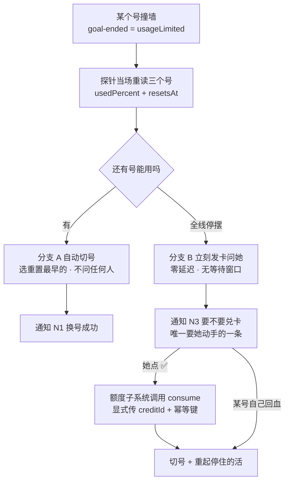

# FLY-2591 Codex 自动切号 + 重置卡兑换 — PRD

Issue: FLY-2591 (https://linear.app/geoforge3d/issue/FLY-2591/产品prd-codex-自动切号-重置卡兑换的产品定义fly-2571-的-prdfounder-2026-09-15-直令派-runner)
日期: 2026-09-16
基于: exploration.md, research.md

> **状态：定稿**（founder 2026-09-16 18:47Z 直令「你可以整个去 finalize 这个 PRD 了」）。
>
> 本文是**流程说明书**，不是问答记录。工程可以照着它建。
> 讨论过程、被否掉的方案、外部证据链全部收在**附录**，正文只留结论。
> 标注：**【实测】** 代码/宿主上亲自读到 · **【官方】** OpenAI 官方页面逐句读到 ·
> **【founder】** founder 直接裁定 · **【二手】** 第三方转述 · **【推断】**。

---

## 0. 终局：她收到那条通知的那一刻

> 凌晨两点，三个 Codex 号全空了。她手机上**立刻**弹出一条消息：
>
> **「Codex 全线停摆 —— 要不要兑 business 的重置卡？」**
> 下面一行说清为什么推荐 business，再下面是三个号的数字供她两秒扫一眼。
>
> 她打开 Codex，点一下 Redeem。不用回消息、不用告诉任何人。
> 一分钟内舰队自己切过去，停住的 4 条活重新跑起来，并发来一条「已恢复」。
>
> **她全程做了一个动作：点了一下 Redeem。**

这份 PRD 就是从这一刻倒推出来的。**凡是不能让这一刻成立的，都不做。**

---

## 1. 问题

### 1.1 现象

2026-09-15 03:42Z，founder 自己发现「Codex 的 quota 也快用完了」。**这句话本身就是 bug** —— 额度不该由她发现。

三个 Codex Pro 号（school / personal / business）打满时：

* 【实测 FLY-2571】`code` / `simple_code` 的实现节点**全部起不来**：QA 必须与实现不同 vendor，而 QA 菜单只有 Claude；实现改走 Claude 被 `SAME_VENDOR_REVIEW_COMBINATION` 拒派。⇒ **Codex 断 = 新代码单一律停**，不是降级，是全停。
* 【实测 FLY-2465】2026-09-09 白停 7 小时，靠 founder 亲自拍号 + Lead 手工切号才恢复。
* 【实测 FLY-2521】2026-09-11 更糟：自动切号机制反而把舰队卡死，她 18:43Z 兑了卡、18:45Z 探针已通，机制 8 分钟不动，最后只能拉总开关。

### 1.2 三层，卡住的是第三层

| 层 | 今天 |
|---|---|
| **L1 切号** | 【实测】**代码已存在**（FLY-2465 Done 2026-09-10，`packages/teamlead/src/codex-quota/`，12 文件 2977 行） |
| **L2 兑卡** | 【实测】**零代码**（全仓 `banked\|redeem\|reset_card\|creditGrant` 零命中） |
| **L3 装机** | 【实测】**从未装完**，FLY-2521/2523 未解，总开关 2026-09-14 被关到 `false` |

⇒ 本 PRD 补 L2，并把 L3 写成硬前置（§9）。

---

## 2. 用户

| 用户 | 要什么 | 今天得到什么 |
|---|---|---|
| **founder** —— 唯一的决策者兼唯一的执行者 | 停摆就**立刻**告诉她，附一个明确推荐；她点一下就完事 | 自己发现额度快满；收到一堆数字 |
| Lead | 舰队自己活着 | 手工 `codex-profile save && use` |
| Codex runner | 别半路被换身份、别白死 | 被收后靠 run-recovery 重起；全线停摆时无出路 |

---

## 3. 目标与非目标

### 3.1 目标

1. 她不再需要自己发现额度问题。
2. 只要还有一个号有额度，舰队自己切，不问任何人。
3. **全线停摆就立刻问她**，卡面上只出现一个推荐的号 + 为什么。
4. **凡是机器读不到的东西，必须写在她按批准的那条消息上**（§6.3）—— 不让她在信息缺失时批准。
5. 每一步判断可离线重放复现。
6. 每种异常都明确、都不静默。

### 3.2 非目标

* ⛔ **不留「找客服要重置」这条路。**【官方】"Can Support reset my usage limits? **No.**"
* ⛔ **不接任何重置预测平台。** founder 2026-09-16 裁定「放弃」（留档 A.5）。
* ⛔ **不做付费即时重置。**
* ⛔ **不改 Claude 侧任何东西。** Claude 的 90% 预切与本机制无关，不统一、不重构。
* ⛔ **不设指标 / 考核 / hard limit。**
* 🔴 ⛔ **不设任何「延迟阈值 / 静默期 / 等待窗口」参数。** founder 2026-09-16 明确推翻：
  > 「你不用等 8 个小时。它只要一停摆，而且我们所有的账号都没有扣款，你马上就来问我需不需要重置卡就可以了。**完全不需要等什么 8 个小时，完全没有必要。**」
* ⛔ **不为「不停摆」绕开 QA 跨 vendor 不变量或任何 merge / authority 闸。**
* ⛔ **FLY-2523 完成前不打开新逻辑**（§9）。

### 3.3 🔴 硬约束（constraint，不是 nice-to-have）

**C1 —— 兑卡的调用面对整个系统封死，只留一条路。**

`account/rateLimitResetCredit/consume` 能在**任何持有凭据的进程**里被调用。因此：

> **唯一合法调用路径：founder 在卡面上 approve 之后，由额度子系统调用。**
> 封死一切其它调用面 —— 包括但不限于 **Codex runner、Lead、临时脚本、任何带 codex CLI 的 agent**。

**理由（写清楚，这是安全边界不是产品偏好）**：重置卡是**真实且不可逆的资源**。
「在她不知情的情况下被烧掉」正好命中她要消灭的那件事 —— **她不该当人肉看门狗**。
【二手】openai/codex#41801 已有用户报告 Codex 在对话中**自主调用该工具、无确认框就消费了一张卡**
（同类还有 #41593）⇒ 这不是假想风险，是已发生过的形态。

**C2 —— 🔴 幂等键必须绑到「哪一次 approve × 哪一张卡」。**

`idempotencyKey` 的存在说明后端支持去重，但**去重的边界由我们定**。
键绑错（按时间戳、按重试次数、按当前时间生成）⇒ **一次 approve 被重放 = 烧两张卡**。

```
idempotencyKey = f(approvalId, creditId)      ← 同一次 approve 重试多少次都得到同一个键
⛔ 不许掺入时间戳、重试计数、随机数、进程 id
```

* 同一次 approve 的任何重试（网络超时、进程重启、事件重投）**必须**复用同一个键。
* **重放时期望的 outcome 是 `alreadyRedeemed`，不是再扣一张。**
  实现必须把 `alreadyRedeemed` 当成**成功**（幂等命中），不是失败、不是重试信号。
* ⚠️ **这条是能不能安全上线的门槛，不是细节。** 没有它，自动兑卡不许开。

---

## 4. 完整流程

### 4.1 总览 —— 只有两条出路，没有第三条



> **注意这张图里没有「等一等再说」这条路。** 见 §4.5。

### 4.2 触发：什么信号算「这个号没额度了」

**F1 —— 主触发。**【实测】结构化的 goal-ended 状态，**不是**解析 stderr 文本：

```ts
// packages/core/src/codex-quota.ts
codexQuotaSignalV1Schema = z.strictObject({
  version: 1, vendor: "codex",
  source: "goal_ended" | "review_exec",
  evidence: "usageLimited" | "usageLimitExceeded",
  sourceEventId, bindingId, observedAt,
})
```
发出方 `packages/claude-runner/src/codex-daemon-adapter-helpers.ts:233-250`。

**F2 —— 「满」的判定。**【实测】`candidate-selector.ts:limited()` =
`reached === true || windows.some(w => w.usedPercent === 100)`。
**没有 90% 预切阈值** —— 与 Claude 的 90% 切号明确不同，这是 founder 要的（「Codex 只有周额度用完才切」）。

**F3 —— 信号天生滞后，所以必须当场重读。**【官方】
> "If you reach your usage limits during an active turn, the agent will be able to continue working on that turn."

⇒ 撞墙不腰斩当前回合，`usageLimited` 是**回合结束时**才出现的信号。
⇒ **卡面上的一切数字必须来自探针当场重读，禁止使用触发信号里携带的旧值。**

### 4.3 探测

**P1 —— 探针。**【实测】`quota-reader.ts` 起一个隔离的 `codex app-server`，
走 `initialize → account/read（校身份）→ account/rateLimits/read`，20s 超时，
返回每个窗口的 `usedPercent` + `resetsAt`，并校验账号身份与刷新令牌有效性。
**可对任意号执行**（包括当前没在用的），不需要真跑活、不需要撞墙。

**P1b —— 🔴 探针还能读到重置卡（协议已具备，我方未实调）。**
`account/rateLimits/read` 的返回里带一个可空的 `rateLimitResetCredits`：

```ts
RateLimitResetCreditsSummary = { availableCount: bigint,
                                 credits: RateLimitResetCredit[] | null }
RateLimitResetCredit        = { id, resetType, status, grantedAt,
                                expiresAt: number | null, title, description }
```

⇒ **每个号剩几张卡、每张卡什么时候过期，机器都读得到。**
`credits: null` 表示只知道张数；空数组表示查过且无可用卡；后端可能截断列表，
所以 `credits.length` 可以小于 `availableCount`（实现要按这个语义处理，不许假设两者相等）。

**P1c —— 🔴 兑卡可以由机器执行（协议已具备，我方未实调）。**
```
account/rateLimitResetCredit/consume
  params  { idempotencyKey: string, creditId?: string | null }
  outcome "reset" | "nothingToReset" | "noCredit" | "alreadyRedeemed"
```
`creditId` 省略时由后端挑下一张；我们**总是显式指定**（§4.6 ⑦）。
调用面与幂等键受 §3.3 C1/C2 硬约束。

> **取证与可信度（重要，别把它读成已验）**
> * 【官方代码】openai/codex PR #28143 "feat(app-server): expose rate-limit reset credits"，
>   **merged 2026-06-15T21:54:02Z**。方法名与全部字段取自该仓 schema 原文。
> * 【实测·静态】本机二进制
>   `~/.codex-242/packages/standalone/releases/0.153.2-aarch64-apple-darwin/bin/codex`
>   中静态可见 `rateLimitResetCredit/consume`、`availableCount`、`idempotencyKey`、
>   `alreadyRedeemed`、`nothingToReset`（`strings` 只读查，**未执行、未碰 `~/.codex`**）。
> * ⚠️ **【未验证】静态有符号 ≠ 我们的账号 / 鉴权路径调得通。**
>   我方**从未实调过**这两个方法。⇒ 实调列为 §12 B0 第一项，
>   且**必须挑没有在飞作业的窗口、由有权限的人做，先干跑参数校验再考虑真调**（FLY-2521 教训）。

**P2 —— 读不到时。** 该号标 `observation_unavailable`，60 秒后重试。
⛔ **不当成「有额度」，也不当成「没额度」。**

**P3 —— 5h 窗口若对 Pro 回归。**【官方】现在只有周窗（8-25 只对 Plus 恢复，Pro 明确保持关闭）。
【实测】但 `parseCodexRateLimits` 本来就解析 `primary` + `secondary` 两个窗口 ⇒ **结构不用改**，只需两条语义：
* §4.6 阶梯里的「自然重置时间」**明确指周窗**，不能被 5h 窗的近期 reset 污染；
* 通知里写清是**哪个窗**打满的。

### 4.4 分支 A：还有号能用 → 自动切号（已实现，不改）

**A1 选号。**【实测】`candidate-selector.ts` 排序：`reset 升序 → 剩余额度降序 → profile 字母序`。
即「还有额度的号里选**重置最早**的」—— 先把早重置的号用掉。
排除：身份未验证 / 认证不健康 / 观测超过 60 秒 / 已 limited。

**A2 切的瞬间，在跑的体会怎样。**【实测】`host-readiness.ts:91-106` 把每个 codex home 分两类：

| 类型 | 合同 | 换号的影响 |
|---|---|---|
| `managed` | `credentialShared === true`，auth.json 是指向 canonical `~/.codex/auth.json` 的 symlink | **换掉 canonical 的瞬间，所有共享它的在跑体身份立刻跟着变** |
| `independent` | 自带凭据 | 不受影响 |

⇒ **切号的安全前提：managed homes 处于 `drained`（无活体）。** 这就是 host-readiness 检查 `activity` 的意义。

**A3 怎么不丢活。**【实测】`run-recovery.ts`：被 usageLimited 收掉的 run → `terminate` → `runs/start`，
与 Lead 手工重起链等价。**探针失败时禁止重起。**
【实测】`coordinator.ts:8` `CODEX_QUOTA_MAX_PAUSE_MS = 10 分钟` = 最长静默暂停。

### 4.5 🔴 分支 B 的触发条件：全线停摆 → 立刻发卡，零延迟

```
条件：全线停摆
动作：立刻发 N3，问她要不要兑卡
延迟：零。不等、不攒、不设窗口。
```

**「全线停摆」的定义**（⚠️ 见下方标注）：
> 三个号**全部没有可用额度**，且没有任何一个号能在不兑卡的情况下被切过去。
> 即 §4.4 的 `selectCodexQuotaCandidate` 返回 `pool_exhausted`。

> ⚠️ **这条定义是按 Lead 对 founder 原话的读法写的，待 founder 确认。**
> 她的原话是「它只要一停摆，**而且我们所有的账号都没有扣款**，你马上就来问我」。
> 「所有的账号都没有扣款」这一句 Lead 读作「确认是**全线**停摆 —— 所有号都没有可用额度，
> 不是只有一个号打满」。Lead 已将此读法发给 founder 确认；她若纠正，改这一处即可，其余不动。

#### 为什么这里没有「先等等看」

v1–v4 这里曾有一道等待闸（最早自然重置 < N 小时就不叫她），以及一套按停摆时长分档的打扰强度。
**founder 2026-09-16 全部推翻**，理由是「完全没有必要」。本 PRD 据此删除，并且：

* **不是把 8 改成别的数字** —— 1 小时 / 1–8 小时 / >8 小时那三档**整个不存在了**；
* **PRD 里不留任何「延迟阈值 / 静默期 / 等待窗口」参数**；
* **触发点只剩一个**：全线停摆的那一刻。

**与她 round 1「一小时内能重置就等」的关系（说清楚，免得读起来像自相矛盾）：**
那一轮她说的「等」，是**要不要花掉一张卡**；这一轮她说的「不等」，是**要不要告诉她**。
两者不冲突，合起来就是新规则：

> **机器立刻报告，并给出「该烧哪个号」这个唯一推荐；
> 「到底烧不烧」是她的判断 —— 所以卡上必须写出最早的号什么时候自己回血，让她两秒内能自己权衡。**

⇒ 机器不再替她估「值不值得等」（那是她的卡、她的停摆容忍度）。
⇒ 机器仍然不把**计算**推给她：兑哪个号是算出来的，不是让她挑（§4.6）。

### 4.6 选号 + 选卡：唯一输出的阶梯

> **v6 重写。** 之前这条阶梯是在「卡张数和到期日都读不到」的前提下设计的 ——
> 那个前提是错的（§4.3 P1b）。现在两项都读得到，founder 在 FLY-2571 给的原始规则
> **可以按她本来的意思恢复**，不再需要任何降级。

```
前置：全线停摆（§4.5）

① 候选 = availableCount > 0 的号                    ← 现在可判，不再靠猜
② 排除「resetsAt 读不到」的号                        ← 见 B2
     若排空 → 走 N9，不自行决定
③ 若某号持有的卡会在【该号自己回血之前】就过期 → 优先选它
     那张卡不烧就一定烂掉（号自己回血之前它已过期）
     多个号命中 → 选其中卡过期最早的那个
④ 否则选【自然重置时间最晚】的号                      ← 分钟粒度
⑤ 平手 → 选【剩卡最多】的
⑥ 再平手 → 固定字母序 business < personal < school
⑦ 定号之后，用该号里【过期最早】的那张卡，显式传它的 creditId

⇒ 输出 =（哪个号，哪张卡）。任何输入组合只有一个输出，可离线重放复现。
```

**B1 —— 为什么是「自然重置最晚」。**【官方】
> "Using a full banked reset refreshes your 5-hour and weekly Codex usage windows and
> **changes your weekly reset date**."

⇒ 兑卡会**覆盖掉这个号原本的自然重置**。所以要烧在「自然重置最不值钱、也就是等得最久」的号上。
烧在马上要回血的号上，等于把一次免费回血扔掉。

**B2 —— `resetsAt` 读不到的号没有被选资格。**
重置时刻未知的号**随时可能自己回血**。它也无法参与「谁最晚」的排序。
⇒ 排除它，并且**必须在卡面上说出来（§6.3）**。

**B3 —— 分钟粒度。** founder 2026-09-15 裁定。她在 FLY-2571 的样例里按「天」看成平手
（school 与 business 都是 9-21），机器读到的是分钟：
`personal 9-19 10:17 · school 9-21 00:28 · business 9-21 15:31` ⇒ 最晚是 business。

**B4 —— 第 ③ 步是 founder 原始规则 ② 的恢复，而且现在是无阈值的。**
她在 FLY-2571 说的是「卡本身快过期的号优先」。v3 我把它摘出去了，理由是「机器读不到到期日」——
**那个理由现在不成立**。恢复它时我没有用「< 7 天」这类拍脑袋阈值，而是用一个**自带判据**的形式：

> **一张卡，如果它会在自己所属的号回血之前过期，那它不烧就一定作废。**

这不需要任何参数，且与她的直觉一致：把注定烂掉的卡先用掉。

**B5 —— 第 ⑦ 步（用过期最早的那张卡）是纯占优，没有取舍。**
同一个号里的卡彼此等价，只有过期时间不同 ⇒ 永远先用快过期的那张。
实现必须**显式传 `creditId`**，不要省略让后端自己挑。

### 4.7 她点 ✅ 之后

1. 额度子系统调用 `account/rateLimitResetCredit/consume`，
   显式传 §4.6 ⑦ 选出的 `creditId` 与 §3.3 C2 规定的 `idempotencyKey`。
2. 按 outcome 分支：

   | outcome | 处理 |
   |---|---|
   | `reset` | 成功。重读 `account/rateLimits/read` 拿新状态 → 走分支 A（切号 + 重起被收的活） |
   | `alreadyRedeemed` | **当成功**（幂等命中，§3.3 C2）。⛔ 不重试、不再扣一张 |
   | `noCredit` | 该号其实没卡 → 回 §4.6 阶梯排除它、重算、发新卡片 |
   | `nothingToReset` | 记录并升级。⚠️ **不许据此假定「卡没被扣」**，见下 |

3. **切号/重起的唯一依据仍是探针读到的额度状态**，不是 consume 的返回值。
   ⛔ 不许伪造回执，不许在探针确认前重起任何活。

> ⚠️ **`nothingToReset` 不是「没扣卡」的证据。**
> 它是**后端结果码**，协议没说此时扣不扣。【founder 直接经验】是**照扣**
> （「就算我现在的账号是满的，我用了那个 reset 卡，它也会把这个东西浪费掉」）。
> ⇒ **以 founder 为准**，实现时把「`nothingToReset` 之后 `availableCount` 有没有变」
> 记成实现期观察项（§11）。

---

## 5. 卡账本：不需要了

> **v6 整节推翻。** v1–v5 花了很大篇幅设计「卡账本」三条路（不要账本 / 她手录 / 机器直读），
> 前提是「机器读不到卡」。**那个前提是错的。**

【官方代码 + 实测·静态】`account/rateLimits/read` 直接返回
`availableCount` 与每张卡的 `expiresAt`（§4.3 P1b）⇒ **机器直读，账本这个东西不存在了。**

| 原方案 | 处置 |
|---|---|
| C 不要账本（曾是默认） | **删除** |
| A founder 手录（曾是可选增量） | **删除** —— 一个字都不用她录 |
| B 机器直读（曾是「待查」） | **成为唯一方案**，且已确认协议具备 |

**连带删除的东西**（都是为了绕开「读不到」而造的）：
* 卡面上的「[假设] 我没有卡账本…」「[假设] 我读不到每张卡的到期日…」两格
* 「账本是 X 天前录的」新鲜度提示
* 「兑卡后手动把张数 -1」—— 现在重新读一次就有真值
* 「OpenAI 白送卡会让手录账本向上失真」这条顾虑 —— 直读没有这个问题

> 📌 **这一节是本单最贵的一次返工，教训记在 §13。**

## 6. 通知：逐字文案 + 触发时刻

> founder 点名要的第二块。下面每一条都是**要发出去的原文**，不是「会显示相关信息」这种描述。
> 占位符用 `{{ }}` 标出。所有时间按她本地时区显示。

### 6.0 🔴 渲染规范（实测得出，不是推断）

> **来源：2026-09-16 Lead 把 N1 逐字贴进 `#flywheel-product` 顶层做的真实渲染测试**
> （标了「排版测试，假数据」）。Runner 无 Discord 发信面，这条由 Lead 代跑。

| # | 规范 | 证据 |
|---|---|---|
| **R1** | 整条卡**一条消息发得下**，不会被 Discord 切开；粗体、`⚠️`、`[假设]` 行都照常渲染 | 【实测】 |
| **R2** | 🔴 **「复核用」那张表必须包在代码块（三反引号）里** —— 用等宽字体才不塌列。<br>⛔ **不许用 markdown 表格**：Discord 不渲染它，列会塌 | 【实测】 |
| **R4** | 🔴 **等宽代码块里禁止混入中日韩字符。** 表格内容一律 **ASCII**；中文说明放在代码块**外面**。<br>只要表内有中文，列对齐就依赖字体的 CJK 宽度比 —— 而那个比值 ① **不是 2** ② 随字体 / 客户端变 ③ 我们**在发出前无法验证**。<br>⇒ **不去「算准」一个不可靠的常数，而是「去掉」对它的依赖。**<br>ASCII-only 之后，宽度恒为 1，`ljust` / `padEnd` 才重新可用；列宽 = 该列最大长度，列间隔 2 格，行尾不补。 | 【实测·截图证伪】founder 2026-09-16 两次：先指「要对齐啊」，修完又发截图「看起来依然没有对齐啊」 |
| ~~R4 旧版~~ | ~~「东亚全角占 2 格，用宽度感知补齐」~~ **原文留档，已撤回。**<br>方向（按显示宽度而非字符数）没错，但它依赖的常数 **CJK = 2 个 ASCII 宽在 Discord 的等宽字体里不成立** ⇒ 按 2 格补的空格必然对不齐。症状：「读不到」那格结束得比别行早，其后整列左移。 | 🔴 **已撤回** |
| **R3a** | ✅ **带 mention 时的「渲染」已验证。** mention 独占一行后接正文；下方代码块表的**列起点不受 mention 影响**；粗体 / ⚠️ / ✅ / 四行表均正常；整条仍一条消息发得下 | 【实测·替身】2026-09-16，Lead 在自己频道用**自己的 bot id 顶替 @Annie** 实测（标了「排版测试·假数据」） |
| **R3b** | ⚠️ **真 @founder 时的「通知行为」= 仍未验证**（是否推送、是否高亮）。⛔ **不许因为 R3a 已验就把这一格也标成已验** —— 只有真 @她才知道，而**不会为了测它半夜 ping 她**。实现 N3 / N8 / N9 时确认 | 【未验证】 |

> 🔴 **R3 为什么拆成两格 —— 这条判据比结论重要：**
> **一次测量只能兑现它实际覆盖的那一格。** 替身 mention 测掉的是**渲染**，
> 它**不能**顺带把**通知行为**也标成已验。标签不得超出量程。
>
> ⚠️ 并且这一格的空白**不是随机的** —— **N3 / N8 / N9 在真实运行时都会带 mention**，
> 也就是说未验证的那一格**恰好集中在最要紧的那三条上**。这比「有一格空着」严重，
> 所以 R3b 必须在实现这三条时单独消掉，不能顺延。

> 🔴 **两条判据，比 R4 本身重要：**
>
> **① 一个依赖【不可验证常数】的规则，不是规则，是猜测。能去掉依赖就去掉，不要去调那个常数。**
> R4 旧版没有算错 —— 它按自己的模型算得很整齐。错的是模型里那个 `CJK = 2` 的常数，
> 而这个常数**随字体和客户端变，我们在发出前无法验证**。
> ⇒ 正解不是把 2 调成 1.8 或别的数，是**让表里不再出现需要这个常数的字符**。
>
> **② 「只有真发出去才看得见」的东西，我方的任何计算都不构成验证。**
> R4 旧版的「已修」是**基于错模型的自证** —— 算了宽度、对了表、以为对了。
> **真正证伪它的是 founder 的截图。**
> ⇒ 这一条正好打脸 R4 旧版自己的取证方式，所以旧版原文留档不抹，撤回写在旁边。
>
> ⚠️ **连带撤回我此前给出的「列起点一致」证据**：那个判据本身比「行宽一致」强（行尾长短是内容差异，
> 判对齐要看各列起点），**但它同样要先有一个可靠的宽度函数** —— 在表里有 CJK 时，
> 宽度函数不可靠 ⇒ 那次「列起点 10/16/28 一致」的结论**不构成验证**。
> ASCII-only 之后宽度恒为 1，这个判据才重新成立。
>
> **取舍(如实写)**：**列对齐 + 中文表头，这两件在 Discord 里没法同时成立。**
> 要中文表头就得放弃表格形态，改成「一行一个号」的列表。这是取舍，不是 bug。
>
> **适用范围**：R4 只管**要发进 Discord 的内容**。PRD 内部的示意块（如 §9 的宿主状态诊断）
> 不发出去，不受它约束 —— 但也**不要照抄那种含中文的排版去发**。
>
> 💡 **R2 与 R4 同类：都只有真发进 Discord 才看得见。**
> HTML 预览看不出来（HTML 会自己排版），读源码也看不出来（源码里空格数看着是对的）。
> ⇒ 这一类只能靠「真贴一次」发现，不能靠 review。
> 给 founder 的页面里那张「复核用」表是 **HTML 表格**（HTML 才有这个能力），
> 它定的是**字段与顺序**；**真实发送必须按 R2 用代码块**。两者不是一回事，别照着 HTML 抄。

### 6.1 总表 —— 触发时刻

| # | 触发的那一刻 | @她 | 她要不要动手 |
|---|---|---|---|
| **N1** | 切号完成、且受影响 run 的重起动作全部结束 | 否 | 否 |
| **N3** | 🔴 **判定全线停摆的那一刻，立刻发。零延迟。** | **是** | **是 —— 唯一一条** |
| **N4** | N3 之后她还没处理（见 §6.5） | 否 | 是 |
| ~~N5~~ / ~~N6~~ | 🔴 **删除，不准备**（founder：想象不到什么情况需要） | —— | —— |
| **N7** | N3 后 5 分钟仍探不到 `pick` 恢复 | 否 | 是 |
| **N8** | 探到 `pick` 被兑过但仍 limited | **是** | 是 |
| **N9** | 三个号的 `resetsAt` 全读不到 | **是** | 是 |
| **N10** | 账本里任一张卡距过期 < 7 天（每天最多一条） | 否 | 可选 |
| **N11** | readiness 自检失败时，随每次额度事件带上 | 否 | 否（但要看得见） |

> **只有一个触发点通向她**：N3。其余要么是知会，要么是异常。
> **N3 没有任何延迟参数** —— 判定全线停摆即发。

### 6.2 N1 · 换号成功 —— **完全照抄 Claude 现有格式**

> founder 2026-09-16 原话：「你去看一下我们现在的代码里面，Claude 它自动切号器，
> 它从一个号换到另外一个号，它的格式是什么样，**你就完全照抄那个格式就行了**。」

【实测】现行格式在 `packages/teamlead/src/account-heal/account-switch-notification.ts:198`
（`formatSwitchNotification`），消费方 `switch-executor.ts:608` →
`quota-monitor-runtime.ts` / `account-switch-repair.ts` / `account-switch-cli.ts`。
**已确认是在用的那段，不是废弃代码。**

原格式（逐字）：

```
Claude 已切号：**{{from}} → {{to}}**（{{triggerLabel}}）

原账号 **{{from}}**
{{email 或「邮箱暂时未读到」}}
```text
window  used   left   reset (PT)
5h      12%    88%    9-16 10:00
7d      45%    55%    9-21 00:28
Fable   n/a    n/a    n/a
```

新账号 **{{to}}**
{{email}}
```text
...同上...
```
```

**Codex 版按它改，只动必须动的两处：**

| 改什么 | 为什么 |
|---|---|
| 抬头 `Claude 已切号` → `Codex 已切号` | 供应商不同 |
| 表里的窗口行 `5h / 7d / Fable` → `weekly`（5h 窗回归后再加 `5h`） | 【官方】Pro 现在只有周窗（§4.3 P3） |

**其余一律不动**：`原账号/新账号` 的分块、邮箱行、```text 代码块表、`window used left reset` 四列、列宽对齐。

> 💡 这段代码**本来就用 ```text 代码块**渲染那张表 —— 与 §6.0 R2（Lead 真贴 Discord 测出来的）
> 独立互证。照抄它同时就满足了渲染规范。

### 6.3 🔴 N3 · 要不要兑卡 —— 唯一要她动手的一条

**触发时刻：判定全线停摆的那一刻，立刻发。不等、不攒、无窗口。**

> **v6 按 founder 2026-09-16 的原话重写。** 她给了确切结构，不发挥：
> ① 一句「现在所有号都没额度了」② 一张表（几个号 / 各自什么时候 reset / 还有几张卡 / 每张卡什么时间）
> ③ 一条建议（优先 reset 哪个号、用它哪张卡，简短写原因）④ 她点 Approve → 直接执行，结束。
>
> 她的判据：**「用最少的文字提供足够多的信息」。**
> ⛔ 删掉：语气助词、「怎么兑」的教学、括号里的解释性补充、任何「我为什么这么说」的自辩。

```
🔴 Codex 三个号都没额度了，{{N}} 条活停住。

```text
account    quota   refills-at    reset-cards
personal   100%    09-19 10:17   2  (10-03, 10-04)
school     100%    unknown       1  (10-03)
business   100%    09-21 15:31   2  (10-04, 10-21)
```
account 号 · quota 额度 · refills-at 自然回血 · reset-cards 重置卡 · unknown 读不到

建议：reset business，用 10-04 那张。
它 9-21 15:31 才回血，三个里最晚，烧它最不浪费。

⚠️ school 的重置时间读不到，已排除。

✅ 批准后我直接执行。
```

**逐条对上她的四段：**

| 她要的 | 卡上哪一行 |
|---|---|
| ① 一句：所有号都没额度 | 第 1 行 |
| ② 表：几个号 / 各自 reset / 几张卡 / 每张卡什么时间 | 代码块表（§6.0 R2 —— **必须是代码块**） |
| ③ 建议：哪个号 + 哪张卡 + 简短原因 | 「建议：…」两行 |
| ④ Approve 就执行 | 最后一行 |

**批准语义（v6 变了，这是最大的一处）：**
* 她点 ✅ ⇒ 额度子系统调用 `account/rateLimitResetCredit/consume`，
  显式传 §4.6 ⑦ 选出的 `creditId` 与 §3.3 C2 规定的 `idempotencyKey`。
* **⛔ 卡面上不再出现任何「怎么兑」的教学** —— 她原话：「我没有要手动去做重置，这个是要自动去处理的」。
* ⚠️ 兑卡执行链**在 §12 B0 实调验证通过之前不许开**（§4.3 取证注记）。
  在那之前，这张卡的 ④ 退化为「机器把 creditId 报给 Lead，由人执行一次」，
  **并在卡面上如实写明这是临时形态** —— 不许让她以为已经自动了。

#### 🔴 仍然保留的必备状态（她标的那个「洞」）

> 她的原话：「**如果某个号的重置时间读不到，你起码要在需要我 approve 的那个 message 上面体现出来**……那我自己去看一眼。」

| 状态 | 卡上必须出现的原话 |
|---|---|
| 某号 `resetsAt` 读不到 | `⚠️ {{profile}} 的重置时间读不到，已排除。` |
| 某号登录失效 | `⚠️ {{profile}} 需要重新登录，已排除。` |
| 某号卡张数读不到 | `⚠️ {{profile}} 的重置卡读不到。` |

**理由不变**：缺这一格，就是**让她在信息缺失的情况下按批准**。
**但措辞按她这轮的要求压到一行** —— 原来那句括号里的解释（「重置时刻未知的号随时可能自己回血，
选它可能白烧一张卡」）**删掉**：那是我的推理过程，不是她需要知道的信息。

### 6.4 其余通知

> **v6 按 founder 2026-09-16 裁决删了两条。** 她的原话：
> 「你中间两个什么已恢复、还有『不用兑了』…… **我想象不到有什么情况需要发这些 message，根本不需要准备它们。**」

| # | 逐字文案 |
|---|---|
| ~~N5 不用兑了~~ | 🔴 **删除，不准备** |
| ~~N6 已恢复~~ | 🔴 **删除，不准备** |
| **N4** | `⏳ 还在停，已停 {{N}} 分钟。`<br>节奏：N3 后每 30 分钟 × 最多 4 次，之后每 2 小时；她回过任意一句后直接降为 2 小时档。不 @ |
| **N7** | `❓ 没探到 {{pick}} 恢复。` |
| **N8** | `🔴 {{pick}} 兑了卡但额度没回来。`（**@她**） |
| **N9** | `🔴 三个号的重置时间都读不到，算不出该 reset 哪个。`（**@她**）<br>⛔ **删掉**了原来那句「这是唯一一种我确实给不出结论的情况，所以我直接说出来，而不是瞎猜」——<br>她原话：「你就事论事告诉我发生了什么就可以了，不要加一堆助词、语气助词进去。」 |
| **N10** | `🗓 {{profile}} 有一张重置卡 {{M-D}} 过期。` |
| **N11** | `⚙️ 自动切号关着：{{reason}}。需要手工切号。` |

**贯穿全部通知的文案判据（founder 2026-09-16）：**

> **每写一句问一次「删掉它，她会少知道什么吗？」不会 → 删。**

⛔ 明令禁止：语气助词、操作教学、括号里的解释性补充、任何「我为什么这么说」的自辩。

### 6.5 🔴 卡面设计规范：默认值型问题 ≠ 裁决型问题

> **默认值型的问题和裁决型的问题，不能共用同一轮的裁决权。**

**来源（一次真实的死局，2026-09-16）**：FLY-2591 的 round 6 卡里带了一条读法确认，
对 founder 说的是「**对就不用回，不对回一句**」—— 一个**允许沉默**的问题。
但它被挂在一轮**必须有裁决**的 founder_review 上。结果：

* 卡 04:09Z 铸出，3.46h 无裁决，巡检报 dwell 超阈；
* **而且不能催** —— 催她就等于把我们自己给出的「不用回」收回去。
* 死局的成因不在她，**在门的设计**。

**⇒ 铸卡时按这个分类，一条卡只装一类：**

| 类型 | 形态 | 能不能开一轮门 |
|---|---|---|
| **裁决型** | 「这两个方案你要哪个」「这个数字定多少」 | ✅ 才配开门，且卡上要写明「这个我等你」 |
| **默认值型** | 「我按 X 理解了，不对回一句」 | ⛔ **不做成门**。写进卡面/正文即可，按默认往前走 |

**推论（两个方向都成立）：**
1. 一张卡如果**只剩默认值型**的问题 → 它就不该是一轮需要裁决的 review。
2. **要开一道真的门，就不能同时给「不回也行」的台阶。**

**已经犯了的补救**：按默认成立往前走，**卡保持开着当入口**，不撤、不重铸、也不催；
等对方自己的时段到了再并进当天第一条消息，不单独 ping。

> ⚠️ 这个形状是**巡检报 dwell 超阈之后回查才看出来的**，设计时双方都没想到 ——
> 所以它值得成为铸卡时的固定检查项，而不是靠临场警觉。

---

## 7. Mockup

**形态**：按 FLY-2244 定的顺序，现在是**选项阶段** ⇒ 交付 concept 级静态渲染，不是高保真代码。
她选定方向后，高保真那一轮才用真代码。

**交付物**：给她看的那一页里把 N1 / N3（含必备状态区）/ N5 / N6 / N9 按 Discord 消息的样子渲染出来，
她能直接看到**换行、字段顺序、什么在第一行、数字块的位置**。

> ⚠️ **边界，如实写**：Runner **不能**自己往 Discord 发消息（本角色无发信面）。
> Lead 建议的「直接在 Discord 里试一下」这条路**需要 Lead 代发** ——
> §6 的文案是逐字的，Lead 可以原样贴进测试频道验证真实渲染。我这边交付页面里的 concept 渲染。

---

## 8. 阴性对照（每种都明确、都不静默）

| 情形 | 行为 |
|---|---|
| 某号卡张数读不到 | 卡面写明「{{号}} 的重置卡读不到」，该号不进候选 |
| 推荐的号其实没卡（consume 回 `noCredit`） | 自动排除该号、重算阶梯、发**新**卡片 |
| consume 回 `alreadyRedeemed` | **当成功**（幂等命中）。⛔ 不重试、不再扣一张 |
| consume 回 `nothingToReset` | 记录 + 升级；⛔ 不据此假定「卡没被扣」 |
| 同一次 approve 被重投 / 进程重启后重放 | 复用同一 `idempotencyKey` ⇒ 期望 `alreadyRedeemed`。**绝不允许烧第二张** |
| 非额度子系统调用 consume | 🔴 **必须被封死**（§3.3 C1）。若发现有其它调用面能调到，视为上线阻断项 |
| 某号 `resetsAt` 读不到 | ①不参与「谁最早回血」的展示；②**无被选资格**；③**卡面必备状态 1** |
| 三个号 `resetsAt` 全读不到 | **N9**，不自行决定 |
| 兑了探不到恢复 | **N7**，5 分钟后发，不自动改推别的号 |
| 兑完仍无额度 | **N8**，不重试、不建议烧第二张 |
| 三号重置时刻完全相同 | 阶梯 ④⑤，字母序定死，永远有唯一答案 |
| 卡快过期但号还能用 | **不切号、不动**，只发 N10 |
| 切号成功但活没重起来 | N1 如实写 `重起 M/N`，差额升级 Lead，**不假装成功** |
| 某号登录失效（非额度） | 从候选剔除，**卡面必备状态 5** + 单独告警。⚠️ 不能与额度混报 |
| 探针读不到数据 | 标 `observation_unavailable`，60 秒重试；不当「有额度」也不当「没额度」 |
| readiness 自检失败 | 机制**保持关闭**并发 **N11**，退回手工。⛔ 绝不进 incident 循环 |
| 同一次停摆重复触发 | 按 generation 去重，**只发一张 N3** |
| 5h 窗满但周窗没满（窗口回归后） | **不切号**（只是短暂限流），通知里说明是哪个窗 |

---

## 9. 硬前置：FLY-2521 / 2523

> ⛔ **FLY-2523 收尾之前，本 PRD 的任何新逻辑一律不许打开。**

【实测 2026-09-15，我在宿主上亲自核过】9-11 的病根原样还在：

```
~/.flywheel/codex-quota/
  switch-audit.jsonl        0 字节
  readiness-receipt.json    不存在 → host-readiness 恒 authority_unavailable
                                   → incident 恒 readiness_failed，target_profile 永远空
codex-homes/agents/flywheel/eng_design/auth.json   symlink → ~/.codex/auth.json   ✔ 合规
codex-homes/agents/flywheel/implement/auth.json    普通文件 3982 bytes            ✘ 违约，换号对它无效
flag_values codex_quota_auto_switch  raw_value=false  rev=3  updated_at 2026-09-14T07:36:01Z
```

**总开关语义已查清**（回答 FLY-2571 的「别假设它就是开关」）：
【实测】`packages/config/src/feature-flags/registry.ts:353` —— `codex_quota_auto_switch`，
`kill_switch` / `bridge_global` / `default_on`，描述即「自动轮转限额账号并恢复受影响 runner」，
消费方 `plugin.ts` 七处全是这套机制。**语义无歧义，它就是总开关。**

### 9.1 2523 完成前的降级

| | 行为 |
|---|---|
| 切号 | **关闭**，退回 Lead 手工 |
| 全线停摆 | 仍**立刻**发 N3（**卡面不依赖宿主部署，可以先上**） |
| 重起活 | 不自动，由 Lead 手工 |
| 可见性 | 每次都带 **N11**，写明「自动切号关着，因为 readiness-receipt 不存在」 |

> 💡 §4.6 阶梯 + §6 通知 + §7 mockup **都不依赖宿主部署**，可在 2523 之前先落地，
> 让她至少先拿到「一句结论」。只有「自动切过去 + 自动重起活」那半必须等 2523。
> ⇒ 这是 §12 拆单的主切分线。

---

## 10. 成功判据

> ⛔ founder 明确排除「指标 / 考核 / hard limit」，所以这里**不设数值目标**。
> 但每一条都写成**可观察、有基线、能判真假**的行为 —— 基线取自已发生的真实事故。

| # | 基线（今天，实测） | 做完之后必须成立 |
|---|---|---|
| 1 | 2026-09-15 03:42Z 是**她自己**发现「quota 快用完了」 | 任何一次 Codex 额度事件，**机器先说**。她的第一手信息来源是通知，不是自己察觉 |
| 2 | 2026-09-09 打满后白停 **7 小时**，靠她拍号 + Lead 手切 | 只要还有一个号能用，**零人工**；切完能从 N1 看到「现在用谁、为什么」 |
| 3 | 全线停摆时发的是 `Codex fleet remains paused… Check account resets or add credits`（一堆信息，无结论） | 卡面上**只有一个推荐的号 + 一句理由**，数字在分割线以下。不出现「这是三个号的数字，你挑一个」 |
| 4 | 今天没有任何机制告诉她「哪些信息我读不到」 | 她按批准时**不缺信息**：§6.3 的必备状态，凡命中必在卡面上出现（一行，不解释） |
| 4b | 今天她要自己去 Codex 点 Redeem | 她**只点一个 ✅**，兑卡由机器执行（§4.7）。⚠️ B0 实调通过前是临时形态，卡面如实写明 |
| 4c | —— | **一次 approve 永远只烧一张卡**：重投 / 重启 / 重试都复用同一幂等键，期望 `alreadyRedeemed`（§3.3 C2） |
| 4d | 今天 consume 接口对任何持凭据的进程开放 | **只有额度子系统在她 approve 之后能调**（§3.3 C1）；其它调用面被封死 |
| 5 | —— | **可复现**：给定三个号的重置时刻 + 账本状态（含缺失），阶梯输出确定唯一，离线重放得到同一个号 |
| 6 | —— | §8 每一行都有对应测试，**没有一条走静默分支** |
| 7 | 2026-09-11 readiness 失败 → 舰队被卡死、8 分钟不恢复、只能拉总开关 | readiness 失败时机制**保持关闭并发 N11 说出来**，舰队退回手工但不被卡死 |
| 8 | 今天从停摆到她知道：**不确定**（取决于她什么时候自己看） | 从判定全线停摆到 N3 发出：**零延迟**，无任何等待窗口参数 |

---

## 11. 未决问题

| # | 问题 | 处置 |
|---|---|---|
| **1** | 🔴 **在我们这台机器上实调 `rateLimits/read`（带 credits）与 `rateLimitResetCredit/consume`** | 协议已具备、二进制静态可见（§4.3 取证），但**我方从未实调**。⇒ §12 **B0 第一项**。<br>⚠️ **必须挑没有在飞作业的窗口、由有权限的人做，先干跑参数校验再考虑真调**（FLY-2521 教训）。⛔ 今晚不做 |
| **2** | ⚠️ **「全线停摆」的定义**（§4.5） | 她原话里的「所有的账号都没有扣款」按 **Lead 的读法**写成「三个号全部没有可用额度」。**待 founder 确认**（round 5 她未回应，不再追问） |
| **3** | 🔴 **有哪些调用面能调到 consume？** | §3.3 C1 要求封死除额度子系统之外的一切调用面。**实现前必须把调用面清点一遍**（runner / Lead / 临时脚本 / 任何带 codex CLI 的 agent）。清不干净 = 上线阻断 |
| **4** | `nothingToReset` 之后 `availableCount` 有没有变 | 【founder】说照扣，以她为准。实现期观察一次，**不是**用来推翻她的实测 |
| **5** | N4 重复提醒的间隔（30min×4 → 2h） | 机器拍的默认。⚠️ 这是「重复提醒的间隔」，**不是**「第一次通知的延迟」—— N3 零延迟已定死 |
| **6** | ⚠️ **真 @founder 时的通知行为**（是否推送 / 是否高亮，§6.0 R3b） | **渲染已验**（R3a，bot 替身实测）；**通知行为仍空** —— 只有真 @她才知道，不为测它半夜 ping 她。⇒ 实现 N3 / N8 / N9 时确认。⚠️ 这一格恰好覆盖**全部三条会 @她的通知** |
| **7** | 5h 窗口哪天对 Pro 回归 | 不可知。§4.3 P3 已把语义写好，回归时只需确认 |

---

## 12. 拆单建议（⛔ 不由我拆，交 Tadashi）

| # | 块 | 实现哪一段 | 依赖 |
|---|---|---|---|
| **B0** | 🔴 **实调验证**：`rateLimits/read` 带 credits 的真实返回；`consume` 的参数校验（先干跑）；**清点所有能调到 consume 的调用面** | §11 #1 #3 | 无。**先做，B2/B5 都取决于它**。⛔ 必须挑无在飞作业的窗口 |
| **B1** | **选号 + 选卡阶梯**（纯函数 + 离线重放测试） | §4.6 | 无。**可立刻做** |
| **B2** | **N3 卡片**（四段式 + 必备状态 + ✅ 批准语义 + N4 追问） | §6.3、§6.4 | B1 |
| **B3** | **N1 照抄 Claude 切号格式**（只改抬头与窗口行） | §6.2 | 无。**独立小块，可立刻做** |
| **B4** | 🔴 **兑卡执行链**：`consume` 调用 + 幂等键 + outcome 分支 + **调用面封死** | §3.3 C1/C2、§4.7 | **B0**。⛔ C2 没做完不许开 |
| **B5** | **N10 卡快过期提醒** | §6.4 | B0 |
| **B6** | **N11 + readiness 失败降级与可见性** | §9.1 | 无。**独立，且能防 9-11 重演** |
| **B7** | **阴性对照全表的测试**（含幂等重放、各 outcome 分支） | §8 | B1–B6 |
| **B8** | **兑卡成功后自动切号 + 自动重起** | §4.7 | ⛔ **FLY-2523 完成** |

**建议顺序**：`B0 → (B1 ‖ B3 ‖ B6) → B2 → B4 → B5 → B7 → (2523) → B8`

> **PM 验收 = 未来 FLY-830，现在不做。**

---

## 13. 🔴 调研方法注记（写给后面接手的人）

> **「界面上做不到」≠「系统做不到」。要断一个能力的上限，必须去看协议 / 接口，不能拿 UI 推。**

**这一条是花代价买来的。** 本单 v1–v5 有一整套设计，是建立在两个「读不到」上的：
* 「每张卡的到期日读不到」→ 把 founder 的原始规则 ②（卡快过期优先）从阶梯里摘掉
* 「有几张卡读不到」→ 造了一整节「卡账本」，设计了手录接口、新鲜度提示、失真处理

**两条都是错的。** 它们的证据来源是**第三方对 Web UI 的观察**（「界面只显示剩几张」），
而我把 **UI 的展示限制当成了系统的能力上限**。真去看协议，
`account/rateLimits/read` 早在 2026-06-15 就返回了每张卡的 `expiresAt`，
`account/rateLimitResetCredit/consume` 也一直在那儿。

⇒ 代价：一节被推翻的设计（§5）、一条被无谓降级的规则（§4.6 B4）、
若干条为绕开「读不到」而造的卡面文案。

**判据固化为**：
1. 断言「X 做不到」之前，先问「我看的是 UI 还是接口？」
2. 只有**协议 / schema / 源码**能给能力上限；UI 观察和第三方转述只能给**现象**。
3. 同型错误当晚发生过两次（另一次是拿 A 项目的源码去断 B 项目的能力）—— 不是巧合，是默认失效模式。

---

# 附录

## A. 外部规则与证据

【官方】原文两处，2026-09-15 由 Lead 用 claude-in-chrome 取回（curl 是 403，真浏览器能过）：
* **A** = `help.openai.com/en/articles/11369540-using-codex-with-your-chatgpt-plan`
* **B** = `developers.openai.com/codex/pricing`

| # | 事实 | 档 |
|---|---|---|
| A.1 | 兑一张卡刷新 5h 窗 + 周窗，**并改写周重置日期** | 【官方 A】 |
| A.2 | 卡自发放起 **30 天**过期 | 【官方 B】 |
| A.3 | **「没东西可刷就不扣卡」= 假，卡照扣** | 【founder】 |
| A.4 | 打满时**当前回合不被腰斩** | 【官方 B】 |
| A.5 | 一次性重置是公告式促销，**"Future resets are not guaranteed."** | 【官方 A】 |
| A.6 | Support **不给**重置 | 【官方 A】 |
| A.7 | ~~界面只显示剩几张，不显示每张的到期日~~ → **只是 Web UI 的限制**；`account/rateLimits/read` 返回每张卡的 `expiresAt` | 🔴 **v6 修正**，见 §13 |
| A.8 | ~~兑换必须人手动，无官方自动通道~~ → **app-server 有 `account/rateLimitResetCredit/consume`**（PR #28143，merged 2026-06-15） | 🔴 **v6 修正**，见 §4.3 P1c |
| A.9 | 5h 窗口 8-25 只对 Plus 恢复，**Pro 明确保持关闭** | 【二手，多来源一致】 |

**A.3 的三级证据链**（它曾是本 PRD 的一根支柱，已撤）：
1. 【二手】多个第三方把「没东西可刷就不扣卡」归给 OpenAI Help Center。
2. 【官方】把 A / B 两页取回逐句读 —— **两处都没有这句话**。
3. 🔴 【founder 2026-09-16 裁定，决定性】
   > 「它当然会变啦，我都已经用过很多次了，这个我很确定。逻辑就是：假设你有 3 张卡，你现在 reset，它就会用一张卡。就这么简单，没有什么好去验证的。」
   > 「就算我现在的账号是满的，我用了那个 reset 卡，它也会把这个东西浪费掉。」

⇒ **兑一张就扣一张。不是待验证，是已知答案**，不让 founder 花一张真卡去验她已经确定的事。
⇒ 设计含义：机器**绝不能**在「可能还有额度」的号上推荐兑卡。好在 §4.6 阶梯按构造做不到
（前置是全线停摆，且被选中的号重置时刻已知）。

**A.5 的附带结论（预测平台，已放弃）**：查过第三方「重置预测平台」——
用量追踪类工具（ReserveGauge / codexusage.dev / SessionWatcher / codex-reset.com）读的就是我们已经在读的同一个
`resetsAt`，零增量；唯一真的预测「意外重置」的站 `willcodexquotareset.com` 自称
"vibes index"、明写「别拿它做重要决定」、无 API。官方亦云 "Future resets are not guaranteed."
**founder 2026-09-16 裁定放弃。正文不留备选尾巴，此条仅作知识留档。**

## B. 被推翻 / 修正的上游说法

| 上游 | 说法 | 处置 |
|---|---|---|
| FLY-2571 | 「唯一可靠来源是 `codex exec` 撞墙字符串」 | **已过时**。触发是结构化 goal-ended 状态，额度有独立便宜探针（§4.2、§4.3） |
| FLY-2571 | 「同名 flag 语义存疑」 | **已查清**，它就是这套机制的总开关（§9） |
| Lead 草案 | 阶梯 ②「卡即将过期 → 选那个号」 | **推翻**：输入 99% unknown。改成独立提醒 N10（§4.6 B4） |
| founder 样例 | 三号全满选 school（天粒度） | **她 2026-09-15 裁定分钟粒度** ⇒ 该样例正确答案是 business（§4.6 B3） |
| 我的 v1 | 「`T_wait = 2 小时`」 | 判据形状 v1 即正确（一直是读真实 `resetsAt` 比阈值）。招来「盲等」误读的是我 explainer 的措辞「先等等看」——**措辞问题，不是机制问题**。⇒ 该参数本身已在 v5 整体删除 |
| 我的 v3 | 「竞态白烧卡是真实风险」 | **删除**。founder 指出不可能发生，核规则确认她对 |
| 我的 v3 阶梯第 ② 步 | 「排除自然重置在 1 小时内的号」 | **换掉**：给定当时的第 0 步它是**空操作**（死分支）。换成「`resetsAt` 读不到的号无被选资格」——那才是真正的缝（§4.6 B2） |
| 转达 | 「中间地带切分点留给她拍」 | **不采纳**。递滑块 = 她一贯否掉的形态 |
| 🔴 我的 v1–v5 | 「每张卡的到期日读不到」「有几张卡读不到」「兑卡只能她本人按」 | 🔴 **v6 全部推翻**。三条都是把 **Web UI 的限制当成系统能力上限**；协议早就具备（§4.3 P1b/P1c）。连带推翻：§5 卡账本整节、§4.6 摘掉 founder 原始规则②、卡面上两格「[假设]」（§13 记教训） |
| 🔴 我的 v2–v4 | 「等待闸（<1h 就等）」+「打扰强度按 1h / 1–8h / >8h 分档」 | **v5 整套删除**。founder 2026-09-16：「完全不需要等什么 8 个小时，完全没有必要」。⇒ 全线停摆立刻发卡，**PRD 里不留任何延迟阈值 / 静默期 / 等待窗口参数**（§4.5） |

## D. 模板正本（宽度已校验，可直接粘贴）

> **这不是待办清单，是正本留档。** 以后任何人要发这三条，**复制这里**，不要再手改空格。

**状态（2026-09-16）**：三份已由 Lead 逐字发进 founder 的 thread（标了假数据）。她的裁决：

| 模板 | 她的裁决 |
|---|---|
| D.1 N3 请兑卡 | ✅ **已确认**（founder 2026-09-16 18:47Z：「那现在看起来可以」）（完整经过见下） |
| D.2 N1 已换号 | ✅ 「没有问题」 |
| D.3 N9 给不出结论 | ✅ 「没有问题」 |

**D.1 的完整经过（三轮，第 2 轮我们自以为修好了）：**

| 轮 | 我们做了什么 | 她的反应 |
|---|---|---|
| 1 | 发出第一版 | 🔴 「要对齐啊，不能参差不齐的」 |
| 2 | 按「东亚全角 = 2 格」重排，**算了宽度、对了表、以为对了** | 🔴 **截图证伪**：「看起来依然没有对齐啊！」 |
| 3 | 改成 **ASCII-only**（§6.0 R4），中文对照移到代码块外 | ✅ **她确认**：「那现在看起来可以」（18:47Z） |

> 📌 **这一轮之所以敢写「已确认」，是因为判它的是她，不是我们的计算。**
> 第 2 轮我们也「算了宽度、对了表、以为对了」，仍然是歪的 ——
> **「理论上不可能歪」正是第 2 轮栽的地方**（§6.0 判据 ②）。
>
> 🔴 **⛔ 这张三行表不许收成一行「已修」，即使已经通过。**
> **通过之后正是最容易把它收起来的时刻** —— 事情成了，曲线就显得多余。
> 但**通过恰恰证明了这条曲线值钱**：第 3 轮之所以对，是因为第 2 轮错过。
> 把第 2 轮删掉，第 3 轮就变成一个没有来由的选择，
> **下一个人会以为「用 ASCII」是品味，而不是被证伪逼出来的。**

> ⚠️ Runner **没有 Discord 发信面** —— 真发这一步一直由 Lead 代做，本节只负责把内容固化下来。
> ⚠️ 表格必须保持在代码块里（§6.0 R2），空格一个都不能动（§6.0 R4）。

**对齐怎么保证（v7 改法）**：表内**一律 ASCII**，中文对照放在代码块**外面**（§6.0 R4）。
ASCII 下宽度恒为 1，列起点可直接按字符数校验：
N3 表四行列起点 `0 / 11 / 19 / 33` 一致（数据行末尾多出的 `36` 在**最后一列内部**，
是数量与括号之间的刻意间隔，不是第五列）；N1 表 `0 / 8 / 15 / 22` ×2 行一致。

> 🔴 **撤回**：此前这里写的是「按东亚全角计 2 格算显示列起点、实测 `[0,10,16,28]` 一致」。
> 那个结论**基于一个错误常数**（CJK ≠ 2 个 ASCII 宽，见 §6.0 R4 撤回记录），
> **不构成验证** —— 真正证伪它的是 founder 的截图，不是任何计算。
> ⚠️ 另一处独立缺陷也留档：我第一版检查器因嵌套围栏静默空检，给出过一个不可信的 0（见 §13）。
> **两处都是「我方计算 ≠ 验证」的实例。**

### D.1 — N3 请兑卡（唯一要她动手的一条）

    🔴 Codex 三个号都没额度了，4 条活停住。

    ```text
    account    quota   refills-at    reset-cards
    personal   100%    09-19 10:17   2  (10-03, 10-04)
    school     100%    unknown       1  (10-03)
    business   100%    09-21 15:31   2  (10-04, 10-21)
    ```
    account 号 · quota 额度 · refills-at 自然回血 · reset-cards 重置卡 · unknown 读不到

    建议：reset business，用 10-04 那张。
    它 9-21 15:31 才回血，三个里最晚，烧它最不浪费。

    ⚠️ school 的重置时间读不到，已排除。

    ✅ 批准后我直接执行。

### D.2 — N1 已换号（照抄 Claude 现有格式，只改抬头与窗口行）

    Codex 已切号：**business → personal**（quota:weekly）

    原账号 **business**
    xrliannie.b@gmail.com
    ```text
    window  used   left   reset (PT)
    weekly  100%   0%     9-21 15:31
    ```

    新账号 **personal**
    xrliannie@gmail.com
    ```text
    window  used   left   reset (PT)
    weekly  38%    62%    9-19 10:17
    ```

### D.3 — N9 给不出结论

    🔴 三个号的重置时间都读不到，算不出该 reset 哪个。

> **mention 相关的两格，状态不同，别混：**
> * ✅ **渲染**（§6.0 R3a）：已验证 —— 2026-09-16 用 **bot 替身 mention** 实测，
>   列起点不受影响、整条仍发得下。
> * ⚠️ **真 @founder 时的通知行为**（§6.0 R3b）：**仍是空的**，只有真 @她才知道。
>   ⛔ 不许因为渲染已验就把它也标成已验 —— **一次测量只能兑现它实际覆盖的那一格。**
>
> ⚠️ 若再做排版测试，请照旧标明「排版测试，假数据」。

---

## C. 版本历史

| 版 | 日期 | 改了什么 |
|---|---|---|
| v1 | 2026-09-15 | 首版，两处待裁 |
| v2 | 2026-09-15 | round 1：分钟粒度定；阈值 2h→1h + 显式上界；预测平台调研 |
| v3 | 2026-09-15 | 官方原文到手：两条提级、三条新增；支柱撤下 |
| v4 | 2026-09-16 | round 3：支柱结案为假、删验证动作；删竞态段；阶梯第 ② 步换成「读不到 resetsAt 无被选资格」 |
| v5 | 2026-09-16 | **round 4，两条裁决**：<br>① **形态改为真 PRD**（不再是问答清单）：新增 §4 完整流程、§6 逐字通知文案与触发时刻、§6.3 卡面必备状态、§7 mockup、§10 带基线的成功判据；讨论过程全部移入附录；删预测平台正文（留档 A.5）。<br>② 🔴 **删掉整套等待阈值**：全线停摆立刻发卡，零延迟，PRD 里不留任何延迟参数。「全线停摆」的定义按 Lead 读法写，标注待 founder 确认（§11 #1） |
| **v5.1** | **2026-09-16** | **真实 Discord 渲染测试的结果**（Lead 代跑，Runner 无发信面）：新增 §6.0 渲染规范 —— R1 一条消息发得下；🔴 R2 复核用表格必须用**代码块**不是 markdown 表格（HTML 预览看不出来）；⚠️ R3 带 mention 的渲染**未验证**，列入 §11 #5b |
| **v6** | **2026-09-16** | **round 5 反馈 + 一次能力面复核**：<br>① **卡面按 founder 给的四段式重写**（一句 / 表 / 一条建议 / ✅ 就执行），删光语气助词、操作教学、括号解释、自辩。<br>② **N5「不用兑了」/ N6「已恢复」整个删除**（她：想象不到什么情况需要）；**N1 完全照抄 Claude 现有切号格式**（只改抬头与窗口行）；N9 删自辩。<br>③ 🔴 **查协议后推翻三条核心假设**：每张卡的 `expiresAt` 可读、张数可读、**兑卡可由机器执行**（PR #28143 merged 2026-06-15 + 本机二进制静态可见）。⇒ §5 卡账本整节作废、§4.6 恢复 founder 原始规则②（且无阈值）、卡面删两格「[假设]」。<br>④ **新增 §3.3 硬约束**：C1 兑卡调用面对全系统封死（只留「她 approve 后由额度子系统调」）、C2 幂等键绑到「approve × 卡」（一次 approve 只烧一张）。<br>⑤ **新增 §13 调研方法注记**：「界面上做不到 ≠ 系统做不到」。
| **v7** | **2026-09-16** | 🔴 **R4 被 founder 截图证伪并改写**：旧版「东亚全角占 2 格 + 宽度感知补齐」依赖的常数在 Discord 等宽字体里**不成立**，改成**代码块内禁止中日韩字符**（表内一律 ASCII、中文对照放块外）—— 不去算准一个不可靠的常数，而是去掉对它的依赖。旧版原文留档不抹。<br>新增两条判据：**① 依赖不可验证常数的规则不是规则是猜测；② 「只有真发出去才看得见」的东西，我方任何计算都不构成验证。**<br>连带撤回我此前的「列起点一致」证据（同一错常数），并如实写出取舍：**列对齐 + 中文表头在 Discord 无法同时成立**。
| **v8 定稿** | **2026-09-16** | founder 18:47Z 确认 ASCII 版表（「那现在看起来可以」）并直令定稿。附录 D 的 D.1 从「待确认」改为**已确认**，三轮经过留档（含第 2 轮「我们自以为修好了」那一行）。全份 PRD 定稿；下一步由 Lead 拆成工程效果规格交 Tadashi，**不由本 Runner 拆单**。<br>⚠️ 仍然未决、不随定稿消失的两项：**§11 #1 B0 实调**（上线前置，需无在飞作业的窗口 + 有权限的人）、**§6.0 R3b 真 @founder 的通知行为**（未验证）。 |

