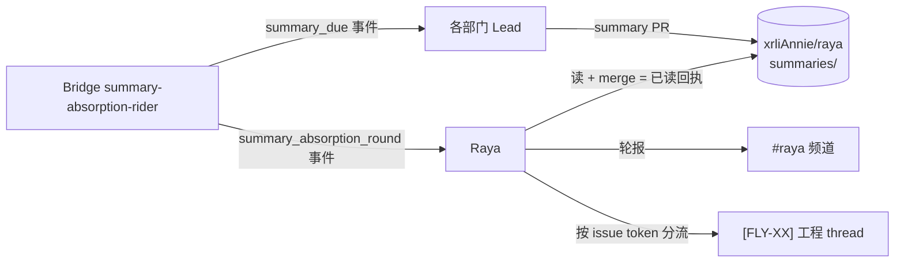

# FLY-2609 重新定义 Raya 主动汇报 — 探索

Issue: FLY-2609 (https://linear.app/geoforge3d/issue/FLY-2609/raya产品设计-重新定义主动汇报后台记录与给-annie-看的对话分开)
日期: 2026-09-15
基于: 无

---

## 0. 一句话

Raya 现在把「后台流程跑完了」当成「该跟 Annie 说话了」——这两件事从产品上就该拆开：后台记录自己存、给 Annie 看的每一条都必须是她看得懂、跟她有关、能原地接着聊的内容。

---

## 1. Founder 原话与问题定义

事发：两轮积压的 summary 任务被连续处理，Raya 在 #raya 主频道短时间内发出两段长 update，并在两个工程 thread 追加记录。

Annie 的三句原话（来源 #raya 消息 1549574793370533941 / 1549575749210738759 / 1549580592532693126）：

1. **不需要每件事都告诉她**，希望慢慢讨论 Raya 应有的样子。
2. **分不同线程没有问题**；不是要取消所有线程。
3. **纯内部记录自己存即可**；发到 Discord 的内容就是做给她看的，要有意义、可理解，并**接受原地回复**。

拆成可验证的诉求：

| # | 诉求 | 今天为什么不满足 |
|---|---|---|
| R1 | 后台记录 ≠ founder 触达。跑完一轮不等于要说话 | 合同写死「每轮必报」，节奏点就是发言点（§2.2） |
| R2 | 发出去的每条要说清「实际变了什么、跟我有什么关系」 | 合同规定的模板是 review 数/吸收数/项目数/roundId/PR 串（§2.3） |
| R3 | 积压事件不应变成连续打扰 | 一个 pass 会连结算两个 slot，两条汇报背靠背（§2.4） |
| R4 | 线程要双向可用（她能原地回） | 归 FLY-2597 与同 Epic 工程子单，本单不修实现（§2.6） |

**注意边界**：把文字缩短是临时措施，不等于产品已重新设计。本单要改的是「什么时候说话、说什么、说给谁」的产品语义，不是措辞。

---

## 2. 现状审计（本机实核，2026-09-15，基于 main `dc7b437af`）

### 2.1 机制全貌



- 产出侧合同：`packages/teamlead/lead-rules-base/summary-inflow.md`（装载条件 `FLYWHEEL_LEAD_HAS_SUMMARY_DUTY=1`）。
- 内容合同：Raya 仓 `summaries/README.md` —— Facts + **Judgment 必填**，per-lead 粒度（`~/.flywheel/summary-config.json`，founder 2026-08-28 亲定）。
- 节奏：flag `summary_absorption_cadence_ms`，默认 `21600000`（6h），bridge_global，founder 可在管理台改。
- 吸收侧合同：Raya 仓 `IDENTITY.md`（§Summary absorption rounds / §Visible reporting）。
- 调度：`packages/teamlead/src/bridge/summary-absorption-rider.ts`，挂在 GatePoller 计时器上。

### 2.2 「每轮必报」写在哪 —— 而且有两份互相打架的合同

**合同 A（Raya `IDENTITY.md` §Visible reporting）**：

> At the end of every round where you reviewed at least one PR, absorbed at least one summary, or asked at least one question, post a report in your own `#raya` channel.
> …**A truly empty round stays silent** unless Annie explicitly asks for empty-round heartbeats.

**合同 B（Bridge 注入的 `notification_context`，`summary-absorption-rider.ts:395`）**：

> 【本轮对账(FLY-2382)】**无论本轮有没有 review/吸收/追问活动,都要在 #raya 发一条汇报**,
> 并**逐字包含**下面这几行(不要改写、不要省略):
> `本轮 N/M 份已交;未交:<Lead 名单>`

**⇒ B 覆盖 A**：B 是每轮随事件注入的、措辞更强硬的指令，且明令「逐字、不要改写、不要省略」。所以今天的真实运行规则是 **每轮必报 + 必附缺交名单**，不是 IDENTITY.md 写的「空轮静默」。

这一条正是 issue 要求「显式处理旧合同与今天反馈的冲突」的核心：**R1 的障碍不在 Raya 的判断力，在于合同禁止她判断**。

### 2.3 「统计数 + roundId」也是合同规定的，不是 Raya 的文风

`IDENTITY.md` 给了逐字模板：

> 今天下午 6 点，我 review 了 11 个 PR，吸收了 8 条（覆盖 6 个项目），3 处没看懂已去问对应 Lead。PR：#…；roundId：…

并要求 "Include the time, reviewed count, absorbed count, project count, settled question count, project/Lead names where useful, and the PR list or links."

再叠加 §2.2 的 B 合同要求逐字带上 `本轮 N/M 份已交;未交:…`。

**⇒ Annie 看到的「roundId、统计数、报错串取代内容」是两份合同叠加出来的必然结果。** 光让 Raya「写短一点」改不动它——模板和逐字行是硬要求。

`roundId` 本身有真实用途（幂等/恢复/provenance：`summary merge --round`、MEMORY.md provenance、ledger key `{roundId, pr}`），但那是**机器需要**，不是 founder 需要。今天它被要求出现在给人看的那条里。

### 2.4 「两轮积压连续处理」是代码里的确定行为，不是偶发

`summary-absorption-rider.ts:400`：

```ts
for (const candidate of [slotStartMs, slotStartMs - cadenceMs]) {
```

每个 pass 最多结算**当前 slot + 上一个 slot**两个。每个被结算的 slot 都 `appendRayaRound()` 追加一个 `summary_absorption_round` 事件，各自带一份 `report_line` 与「必发汇报」指令。

**⇒ Bridge 重启、Raya 不在、或上一轮漏结算，下一次 pass 就会把两轮一起投给 Raya，Raya 按合同各发一条 → 短时间两段长 update。** 这就是 Annie 观察到的现象，机制上可复现。

补充：`graceMs = min(30min, cadence)`；超过 grace 才第一次观察到的 slot 只记日志、不补发 due（`missedSlots`），但**已建 due 行的 slot 仍会被结算**。

### 2.5 「按 issue token 分流」是全局 Lead 规则，Raya 也吃这一条

`packages/teamlead/lead-rules-base/cos-lead-rules.md` §Reply Discipline（FLY-162）：

```
STEP 1. 抽取 \b[A-Z]{2,}-\d+\b，得 N 个 distinct token
STEP 2. N==0 → 频道回复；N==1 → /api/chat-threads/send；N>=2 → N 次 send，一 token 一次
```

并显式写明「**Topic semantics is NOT an input to this algorithm**」——禁止按语义判断该不该发。

**⇒ Raya 的轮报里只要出现两个 issue 号，就会机械地在两个工程 thread 各追加一条。** 这正是 Annie 说的「在两个工程 thread 追加记录」。

**但 Annie 明确说「分不同线程没有问题；不是要取消所有线程」** —— 所以本单不是废掉 FLY-162，而是要回答：**哪些内容该走 thread、哪些根本就不该发到 Discord**。分流规则是对的，被喂进去的东西是错的。

### 2.6 已有工作：FLY-2597（同 Epic，在飞分支 `origin/flywheel-FLY-2597`）

在建、尚未合入 main。它做的是**通用机制**，本单必须复用而不是另造：

| FLY-2597 产出 | 状态 | 对本单的意义 |
|---|---|---|
| thread 标题机器状态词「要你答」（与既有「待批」互斥、同一台轮转机器） | 在飞 | R4 的「哪些 thread 要她回」有了机器可判的表达 |
| Epic 固定页「⚡ 现在要你看」改为与标题同源派生 | 在飞 | 「待她看」的机器 attention 视图已有归宿，Raya 不必用聊天刷存在 |
| `founder_ask` 表 + `POST /api/chat-threads/send` 可选 `founderAsk` 字段 | 在飞 | Lead/Raya 要 founder 决定时的机器标记；纯记录**不**带这个字段就不顶 thread |
| founder 回帖（作者 id = founder）即熄灭 | 在飞 | 双向可用的机器判定点已存在，本单不重复造 |

FLY-2597 exploration §2.6 已明确把球踢过来：

> ⇒ 本单在规则上能做的是「不新增 + 加一条负向规则」，**是否停用 summary duty 归 Lead/founder 裁**。

**⇒ FLY-2609 就是接这个裁决。** 本单负责 Raya 的产品语义与旧 summary 通知合同的迁移，**不再造一套通用提醒引擎**。

### 2.7 与更早的 founder 决定的一致性检查（FLY-942，2026-07）

FLY-942 PRD 的边界铁律（Annie lgtm 定稿）：

- 「汇报**全进对应 [FLY-XX] thread、自然语言**；**无 founder 频道 / 无决策卡模板 / 无 digest**」
- 「**绝不静默 ⨯ 不刷屏**」「**无新状态变化 = 无新通知**」

**不冲突，反而是同一诉求的延续**：今天 Raya 的轮报事实上就是一个 **digest**（N 份已交/未交名单/PR 串），而 FLY-942 明令「无 digest」。所以「每轮必报」这条合同在 2026-07 就已经与 founder 的既有决定相左，只是当时 Raya 机制还没落地。

⚠️ 但有一处**需要 Annie 裁**：FLY-942 说「无 founder 频道」，而 Raya 有自己的 `#raya` 频道且 Annie 在用。#raya 是「跟 Raya 对话的地方」还是「Raya 的播报台」——这是 T3 要问的。

---

## 3. 冲突清单（issue 要求「显式处理」的部分）

| 旧合同条款 | 出处 | 与今天反馈的冲突 | 处置（待 Annie 裁） |
|---|---|---|---|
| 每轮必报（无论有无活动） | rider `notification_context` | 直接冲突 R1 | 建议废，改为「有值得说的才说」 |
| 必附缺交名单，逐字不许改写 | 同上 + `summary-round-classify.ts:147` | 直接冲突 R2（它是统计不是内容） | 建议移出 founder 面，转后台/机器视图 |
| 汇报模板含 review/吸收/项目数、roundId、PR 串 | Raya `IDENTITY.md` §Visible reporting | 直接冲突 R2 | 建议重写模板 |
| 空轮静默 | Raya `IDENTITY.md` 同节 | 与上面的 B 合同自相矛盾 | 保留并升格为唯一规则 |
| 按 issue token 机械分流 | `cos-lead-rules.md` FLY-162 | **不冲突**（Annie 说线程没问题） | 保留；只管住「什么内容进来」 |
| Judgment 必填 | `summaries/README.md` | **不冲突**，反而是 R2 的资产 | 保留并强化 |
| 6h 节奏 | flag `summary_absorption_cadence_ms` | 间接（节奏点=发言点才是问题） | **本单不动 cadence**（issue 明令） |

**🔴 在合同和机制更新前，不假装运行规则已经停用。** 本单只产出 PRD 与 build issue；在对应 PR 合入前，Raya 今天仍然按旧合同跑。

---

## 4. Topic 树（本单要跟 Annie 钻的子块）

```
FLY-2609 重新定义 Raya 主动汇报
├── T1 分层：哪些只落后台 / 哪些值得主动通知 / 哪些留到对话展开   ← 先钻这块
├── T2 触达节奏：后台阅读周期 与 founder 触达节奏解耦；积压不连发
├── T3 场所语义：#raya 是对话场还是播报台；什么内容进 [FLY-XX] thread
├── T4 内容形态：一条给 Annie 的消息长什么样（替掉统计模板）
└── T5 旧合同迁移：每轮必报/缺交名单/逐字行怎么下线，下线前怎么办
```

当前位置：**T1 未开**（本文写完即向 Annie 开第一轮 founder_review）。

---

## 5. 我的初步判断（待 Annie 否决）

1. **根因不是 Raya 话多，是合同把「机器完成一个周期」直接等同于「对人说话」。** 这两个事件必须解耦：后台轮次可以 6h 一次甚至更密，founder 触达应该由「是否存在她需要知道的变化」决定。
2. **「缺交名单」是给机器/Lead 的运维信号，不是给 founder 的内容。** 它该去 Epic 固定页或 alerts，不该占 Annie 的注意力。
3. **roundId 是 provenance，不是消息。** 机器需要它做幂等恢复，给人看的那条不该出现它。
4. **FLY-2597 已经把「要你答 / 待你看」做成了通用机器视图**——Raya 不需要用聊天来刷存在感，她应该只在「有判断要交换」时说话。

## 6. 假设（明确列出，未确认前不写进 PRD）

- A1：Annie 要的不是「更少的话」，是「每句话都值得」。（从「要有意义、可理解」推）
- A2：`#raya` 她当成对话场，不是公告栏。（从「接受原地回复」推）
- A3：她不想要一个固定频率的 digest；宁可不定期但有内容。（从 FLY-942「无 digest」+ 本次反馈推）
- A4：summary 机制本身（Lead 写 PR、Raya merge 当已读）她仍认可，要改的只是「Raya 读完之后怎么跟她说」。

A1–A4 都要在第一轮 founder_review 里请她确认或否决。

## 7. Open questions（带给 Annie 的）

- Q1（T1）：这块**你有定见，还是我来发挥**？具体是：什么样的事值得打断你？
- Q2（T3）：`#raya` 你希望它是「你和 Raya 聊天的地方」还是「Raya 汇报的地方」？
- Q3（T5）：旧合同下线前的过渡期，你希望 Raya 继续按老规矩发，还是先静默只落后台？
